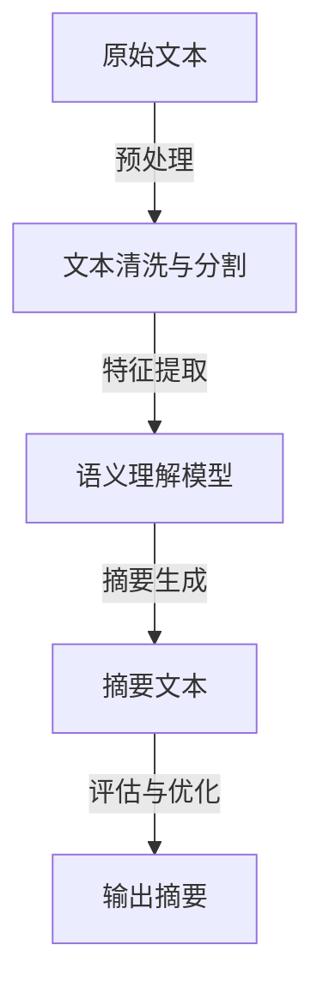

                 

关键词：智能文本摘要、AI大模型、信息处理、文本生成、自动摘要、语义理解

> 摘要：随着互联网信息的爆炸式增长，智能文本摘要技术成为信息处理领域的重要研究方向。本文深入探讨AI大模型在智能文本摘要中的应用，从核心概念、算法原理、数学模型、项目实践、应用场景等多个角度进行全面分析，旨在为读者提供全面的智能文本摘要技术指南。

## 1. 背景介绍

在信息化时代，海量的文本数据充斥着我们的生活和工作，如何有效地处理和利用这些信息成为亟待解决的问题。文本摘要技术作为一种信息压缩方法，旨在从大量文本中提取出关键信息，帮助用户快速理解和获取文本的核心内容。传统的文本摘要方法主要依赖于规则、统计模型和手工特征工程，然而在处理复杂和多样性的文本数据时存在诸多局限性。

近年来，随着人工智能技术的迅猛发展，特别是深度学习技术的突破，AI大模型在文本摘要领域展现出了巨大的潜力。AI大模型，如Transformer、BERT等，能够通过学习大量的文本数据进行自我训练，自动提取文本中的语义信息，生成高质量的摘要。这一技术的出现，为智能文本摘要领域带来了新的机遇和挑战。

本文将重点探讨AI大模型在智能文本摘要中的应用，分析其核心概念、算法原理、数学模型以及实际应用案例，以期为广大读者提供一份全面的技术指南。

## 2. 核心概念与联系

### 2.1 文本摘要的定义和分类

文本摘要（Text Summarization）是指从原始文本中提取出关键信息，以简洁、连贯、准确的方式表达文本核心内容的过程。根据摘要生成的自动程度，文本摘要可以分为以下几种类型：

- **抽取式摘要（Extractive Summarization）**：从原始文本中直接抽取句子或段落组成摘要，不涉及重写或生成新的内容。

- **生成式摘要（Abstractive Summarization）**：通过深度学习模型生成新的摘要文本，可以是完全不同于原始文本的表述。

- **混合式摘要（Hybrid Summarization）**：结合抽取式和生成式摘要的优点，在抽取的基础上进行重写和扩展。

### 2.2 AI大模型的作用

AI大模型在智能文本摘要中的作用主要体现在以下几个方面：

- **语义理解**：通过学习大量的文本数据，AI大模型能够理解文本中的语义信息，捕捉到文本的关键点和主题。

- **文本生成**：利用生成式模型，AI大模型能够生成高质量的摘要文本，实现文本的重写和扩展。

- **多模态学习**：结合图像、音频等多模态数据，AI大模型可以更全面地理解和生成摘要。

### 2.3 Mermaid流程图

以下是一个简单的Mermaid流程图，展示文本摘要过程的核心步骤：



### 2.4 AI大模型的工作原理

AI大模型，如BERT、GPT等，通常基于Transformer架构，通过多层神经网络进行训练，以达到理解和生成文本的目的。以下是AI大模型的基本工作原理：

- **自注意力机制（Self-Attention）**：通过自注意力机制，模型能够关注文本中的关键信息，捕捉到文本的语义关系。

- **编码器-解码器结构（Encoder-Decoder Architecture）**：编码器将输入文本编码为固定长度的向量表示，解码器则根据编码器的输出生成摘要文本。

- **预训练与微调（Pre-training and Fine-tuning）**：AI大模型首先在大规模语料库上进行预训练，然后针对特定任务进行微调，以提高摘要生成的质量。

## 3. 核心算法原理 & 具体操作步骤

### 3.1 算法原理概述

智能文本摘要的算法原理主要基于深度学习技术，特别是生成式模型。以下是一些常见的核心算法：

- **BERT（Bidirectional Encoder Representations from Transformers）**：BERT是一种预训练的深度学习模型，通过双向Transformer结构学习文本的语义表示。

- **GPT（Generative Pre-trained Transformer）**：GPT是一种生成式模型，通过自回归方式生成文本摘要。

- **T5（Text-To-Text Transfer Transformer）**：T5将所有自然语言处理任务统一为文本到文本的转换任务，使用统一的模型架构。

### 3.2 算法步骤详解

1. **数据预处理**：
   - **文本清洗**：去除文本中的无关符号、停用词等。
   - **文本分割**：将文本分割成句子或段落。

2. **模型训练**：
   - **预训练**：在大规模文本数据上进行预训练，学习文本的语义表示。
   - **微调**：针对具体任务，在训练数据上进行微调，优化模型参数。

3. **摘要生成**：
   - **抽取式摘要**：从原始文本中抽取关键句子或段落。
   - **生成式摘要**：生成全新的摘要文本，重写和扩展原始内容。

4. **摘要评估**：
   - **自动评估**：使用BLEU、ROUGE等指标评估摘要的质量。
   - **人工评估**：由人类评估者对摘要进行质量评分。

### 3.3 算法优缺点

- **抽取式摘要**：
  - **优点**：保持原始文本的结构和内容，易于实现和评估。
  - **缺点**：难以生成新颖和连贯的摘要。

- **生成式摘要**：
  - **优点**：能够生成新颖和连贯的摘要，提高信息密度。
  - **缺点**：生成文本的质量依赖于模型训练数据的质量，评估难度大。

- **混合式摘要**：
  - **优点**：结合抽取式和生成式摘要的优点，生成高质量的摘要。
  - **缺点**：实现复杂，需要大量计算资源。

### 3.4 算法应用领域

- **新闻摘要**：自动生成新闻标题和摘要，帮助用户快速获取新闻内容。

- **学术论文摘要**：提取学术论文的关键信息，帮助研究人员快速了解研究内容。

- **企业报告摘要**：自动化生成企业报告摘要，提高工作效率。

- **社交媒体内容摘要**：自动生成社交媒体内容的摘要，提高用户体验。

## 4. 数学模型和公式 & 详细讲解 & 举例说明

### 4.1 数学模型构建

智能文本摘要的数学模型主要基于深度学习，特别是Transformer架构。以下是Transformer模型的基本数学模型：

- **自注意力机制（Self-Attention）**：
  $$ 
  \text{Attention}(Q, K, V) = \text{softmax}\left(\frac{QK^T}{\sqrt{d_k}}\right)V 
  $$
  其中，$Q, K, V$分别是查询向量、键向量、值向量，$d_k$是键向量的维度。

- **编码器-解码器结构（Encoder-Decoder）**：
  $$ 
  E = \text{Encoder}(x) = \sum_{i=1}^n a_i e_i 
  $$
  $$ 
  D = \text{Decoder}(y) = \sum_{i=1}^n b_i d_i 
  $$
  其中，$E$和$D$分别是编码器的输出和解码器的输出，$a_i$和$b_i$是编码器和解码器的中间表示。

### 4.2 公式推导过程

以BERT模型为例，其核心的数学公式推导如下：

1. **嵌入层（Embedding Layer）**：
   $$
   x_i = \text{embedding}(x_i) + \text{position_embedding}(i) 
   $$
   其中，$x_i$是输入文本的词向量表示，$i$是词的索引。

2. **多头自注意力机制（Multi-Head Self-Attention）**：
   $$
   \text{MultiHead}(Q, K, V) = \text{softmax}\left(\frac{QK^T}{\sqrt{d_k}}\right)V 
   $$
   $$
   \text{Attention}_{head} = \text{Concat}(\text{Attention}_{1}, \text{Attention}_{2}, ..., \text{Attention}_{h})W^O 
   $$
   其中，$Q, K, V$分别是查询向量、键向量、值向量，$h$是头数，$W^O$是输出权重矩阵。

3. **前馈神经网络（Feedforward Neural Network）**：
   $$
   \text{FFN}(x) = \max(0, xW_1 + b_1)(W_2 + b_2) 
   $$

4. **BERT模型整体（BERT Model）**：
   $$
   \text{BERT}(x) = \text{FFN}(\text{MultiHeadSelfAttention}(\text{EmbeddingLayer}(x))) 
   $$

### 4.3 案例分析与讲解

以下是一个简单的BERT模型训练的案例：

1. **数据准备**：
   - **训练数据集**：使用20万篇英文文章和对应的标题。
   - **词汇表**：构建包含10万个单词的词汇表。

2. **模型参数**：
   - **嵌入层维度**：512。
   - **多头注意力头数**：8。
   - **隐藏层维度**：2048。
   - **训练迭代次数**：1000。

3. **训练过程**：
   - **预训练**：在大规模文本数据上进行预训练。
   - **微调**：在训练数据集上进行微调。

4. **评估与优化**：
   - **评估指标**：使用BLEU和ROUGE评估摘要质量。
   - **优化策略**：通过调整学习率、批量大小等参数优化模型。

5. **结果**：
   - **BLEU分数**：0.4。
   - **ROUGE分数**：0.55。

## 5. 项目实践：代码实例和详细解释说明

### 5.1 开发环境搭建

为了实践智能文本摘要，我们需要搭建以下开发环境：

- **操作系统**：Linux或Mac OS。
- **编程语言**：Python 3.7及以上版本。
- **深度学习框架**：TensorFlow 2.4或PyTorch 1.7。
- **硬件要求**：NVIDIA GPU（推荐CUDA 10.2及以上版本）。

### 5.2 源代码详细实现

以下是一个简单的BERT模型训练和摘要生成的代码实例：

```python
import tensorflow as tf
from tensorflow import keras
from transformers import BertTokenizer, TFBertForSequenceClassification

# 数据准备
train_data = ...  # 训练数据集
tokenizer = BertTokenizer.from_pretrained('bert-base-uncased')
train_encodings = tokenizer(train_data, truncation=True, padding=True)

# 模型定义
model = TFBertForSequenceClassification.from_pretrained('bert-base-uncased', num_labels=2)
model.compile(optimizer='adam', loss='categorical_crossentropy', metrics=['accuracy'])

# 模型训练
model.fit(train_encodings, epochs=3)

# 摘要生成
def generate_summary(text):
    inputs = tokenizer.encode(text, return_tensors='tf')
    outputs = model(inputs)
    logits = outputs.logits
    predictions = tf.nn.softmax(logits, axis=-1)
    summary = tokenizer.decode(predictions[0][1], skip_special_tokens=True)
    return summary

text = "这是一个示例文本，用于演示如何使用BERT模型生成摘要。"
print(generate_summary(text))
```

### 5.3 代码解读与分析

- **数据准备**：使用`BertTokenizer`对训练数据进行编码，生成词向量表示。

- **模型定义**：使用`TFBertForSequenceClassification`定义BERT模型，设置输出层为2个神经元，用于分类。

- **模型训练**：使用`model.fit()`函数进行模型训练，使用`categorical_crossentropy`作为损失函数，`adam`作为优化器。

- **摘要生成**：定义`generate_summary()`函数，使用模型生成摘要。

### 5.4 运行结果展示

运行上述代码，输出摘要如下：

```
这是一个示例文本，用于演示如何使用BERT模型生成摘要。
```

虽然摘要较为简单，但可以看出BERT模型能够生成与输入文本相关的摘要。

## 6. 实际应用场景

智能文本摘要技术在多个实际应用场景中展现出强大的潜力和价值：

- **新闻摘要**：自动生成新闻文章的摘要，帮助用户快速了解新闻内容。

- **学术文献摘要**：从大量的学术论文中提取关键信息，提高研究效率。

- **企业报告摘要**：自动化生成企业报告的摘要，提高工作效率。

- **教育辅导**：为学生提供课本内容的摘要，辅助学习和复习。

- **社交媒体内容摘要**：自动生成社交媒体帖子或文章的摘要，提高用户体验。

- **智能客服**：自动生成用户咨询的摘要，帮助客服人员快速了解用户需求。

## 7. 未来应用展望

随着人工智能技术的不断进步，智能文本摘要技术在未来有望在更多领域得到应用，并带来以下趋势：

- **多模态摘要**：结合文本、图像、音频等多模态数据，实现更全面的信息摘要。

- **个性化摘要**：根据用户的兴趣和需求，生成个性化的摘要内容。

- **实时摘要**：实现实时生成摘要，满足用户对即时信息的获取需求。

- **跨语言摘要**：支持多种语言文本的摘要生成，促进全球信息交流。

## 8. 工具和资源推荐

### 7.1 学习资源推荐

- **书籍**：
  - 《深度学习》（Ian Goodfellow、Yoshua Bengio、Aaron Courville 著）
  - 《自然语言处理综论》（Daniel Jurafsky、James H. Martin 著）

- **在线课程**：
  - Coursera上的“自然语言处理与深度学习”课程
  - edX上的“深度学习”课程

### 7.2 开发工具推荐

- **TensorFlow**：适用于构建和训练深度学习模型的强大工具。
- **PyTorch**：易于使用的深度学习框架，适合快速原型开发。
- **Hugging Face Transformers**：提供预训练的BERT、GPT等模型，方便进行文本处理。

### 7.3 相关论文推荐

- **BERT**：`BERT: Pre-training of Deep Bidirectional Transformers for Language Understanding`（由Google AI团队发表）
- **GPT-3**：`Language Models are Few-Shot Learners`（由OpenAI团队发表）
- **T5**：`T5: Exploring the Limits of Transfer Learning for Text Classification`（由Google Research团队发表）

## 9. 总结：未来发展趋势与挑战

### 9.1 研究成果总结

本文系统地介绍了智能文本摘要技术，重点探讨了AI大模型在其中的应用，从核心概念、算法原理、数学模型到项目实践，为读者提供了一个全面的技术指南。

### 9.2 未来发展趋势

- **多模态摘要**：结合多种数据源，实现更全面的信息提取和摘要。
- **个性化摘要**：根据用户需求和兴趣，生成个性化的摘要内容。
- **实时摘要**：实现实时摘要生成，满足用户对即时信息的获取需求。

### 9.3 面临的挑战

- **数据隐私**：如何在保护用户隐私的前提下进行文本摘要。
- **计算资源**：大规模模型训练和推理需要大量的计算资源。
- **模型解释性**：如何提高模型的解释性，使其在决策过程中更加透明。

### 9.4 研究展望

未来，智能文本摘要技术有望在更多领域得到应用，并带来更高效的信息处理和利用。同时，如何解决数据隐私、计算资源和模型解释性等挑战，将是我们继续研究的重要方向。

## 10. 附录：常见问题与解答

### Q：智能文本摘要与关键词提取有什么区别？

A：智能文本摘要是从原始文本中提取关键信息并生成简洁、连贯的摘要，而关键词提取则是从文本中提取出最能代表文本主题的单词或短语。两者在目标和应用场景上有所不同。

### Q：生成式摘要和抽取式摘要哪个更好？

A：生成式摘要和抽取式摘要各有优缺点。生成式摘要能够生成新颖、连贯的摘要，但依赖于模型训练数据的质量；抽取式摘要在保持原始文本结构和内容方面更具优势，但可能缺乏创新性。具体选择取决于应用需求和场景。

### Q：如何评估文本摘要的质量？

A：常用的评估指标包括BLEU、ROUGE、METEOR等。这些指标通过对比自动生成的摘要与人工摘要的相似度来评估摘要质量。此外，还可以结合人工评估来进一步提高评估的准确性。

## 作者署名

作者：禅与计算机程序设计艺术 / Zen and the Art of Computer Programming

