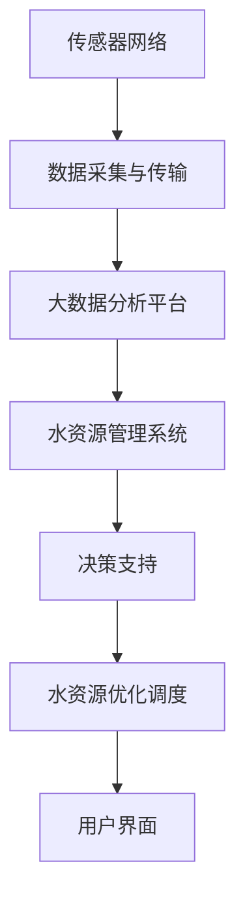

                 

 水是生命之源，但全球水资源短缺的问题日益严峻。智能水管理作为一种新兴技术，正成为解决水资源短缺、提高水资源利用效率的重要手段。本文将探讨智能水管理的概念、核心技术、应用场景以及未来发展趋势，旨在为水资源管理领域的创业者提供一些有价值的参考。

## 关键词
智能水管理、水资源利用、传感器网络、大数据分析、物联网、人工智能、可持续发展

## 摘要
本文首先介绍了智能水管理的背景和重要性，然后深入探讨了智能水管理的核心技术和原理，包括传感器网络、大数据分析和人工智能等。接着，文章展示了智能水管理在农业、城市供水、水资源监测等领域的实际应用案例。最后，文章展望了智能水管理的未来发展趋势，并提出了相应的挑战和解决方案。

## 1. 背景介绍
### 1.1 水资源短缺现状
全球约有28%的人口生活在用水紧张的地区，这一比例预计将在未来几十年内进一步上升。水资源短缺的原因包括人口增长、城市化进程、气候变化以及不合理的用水习惯等。因此，提高水资源利用效率、实现可持续发展已成为全球面临的重大挑战。

### 1.2 智能水管理的必要性
智能水管理通过应用先进的传感器技术、物联网、大数据分析和人工智能等技术，对水资源进行实时监测、预测和管理。与传统的水资源管理方式相比，智能水管理能够显著提高水资源利用效率，减少水资源浪费，为缓解水资源短缺问题提供有力支持。

## 2. 核心概念与联系
### 2.1 智能水管理的基本概念
智能水管理是指利用现代信息技术，对水资源进行实时监测、预测、优化和调度，以提高水资源利用效率，实现水资源可持续发展的过程。它涉及多个领域，包括传感器网络、物联网、大数据分析、人工智能、水资源学等。

### 2.2 智能水管理的核心技术
#### 2.2.1 传感器网络
传感器网络是智能水管理的基石，它通过部署大量传感器对水资源进行实时监测，获取水资源的各种物理、化学和生物参数。

#### 2.2.2 物联网
物联网技术将传感器网络与互联网相结合，实现水资源数据的实时传输和共享。

#### 2.2.3 大数据分析
大数据分析通过对大量水资源数据进行分析和处理，提取有用信息，为水资源管理提供决策支持。

#### 2.2.4 人工智能
人工智能技术在智能水管理中发挥着重要作用，如预测水资源需求、优化水资源调度、识别水污染源等。

### 2.3 智能水管理的架构


## 3. 核心算法原理 & 具体操作步骤
### 3.1 算法原理概述
智能水管理的核心算法包括水资源需求预测、水资源调度优化和水污染识别等。这些算法基于大数据分析和人工智能技术，通过分析历史数据和实时数据，实现对水资源的高效管理和调度。

### 3.2 算法步骤详解
#### 3.2.1 水资源需求预测
1. 收集历史水资源需求数据。
2. 使用时间序列分析等方法对数据进行分析。
3. 建立水资源需求预测模型。
4. 对未来水资源需求进行预测。

#### 3.2.2 水资源调度优化
1. 收集水资源实时数据。
2. 使用优化算法（如线性规划、遗传算法等）对水资源进行调度。
3. 根据预测结果和实际需求，调整水资源分配。

#### 3.2.3 水污染识别
1. 收集水质监测数据。
2. 使用机器学习算法（如神经网络、支持向量机等）对水质数据进行分类。
3. 识别潜在的水污染源。

### 3.3 算法优缺点
#### 优点
- 提高水资源利用效率。
- 减少水资源浪费。
- 提高水资源管理水平。

#### 缺点
- 需要大量数据支持。
- 算法复杂度高。

### 3.4 算法应用领域
智能水管理算法广泛应用于农业、城市供水、工业用水、水资源监测等领域。

## 4. 数学模型和公式 & 详细讲解 & 举例说明
### 4.1 数学模型构建
智能水管理中的数学模型主要包括时间序列模型、优化模型和分类模型等。

### 4.2 公式推导过程
#### 时间序列模型
假设水资源需求为 \(D_t\)，则有：
$$
D_t = \alpha t + \beta
$$

#### 优化模型
假设水资源总量为 \(W\)，需求为 \(D\)，则有：
$$
\min W - D
$$

#### 分类模型
假设水质数据为 \(X\)，类别为 \(Y\)，则有：
$$
P(Y|X) = \frac{e^{\theta^T X}}{\sum_{i=1}^{k} e^{\theta_i^T X}}
$$

### 4.3 案例分析与讲解
#### 水资源需求预测
假设某地区过去一年的水资源需求数据如下表：

| 月份 | 水资源需求（m³）|
| ---- | -------------- |
| 1    | 1000           |
| 2    | 1200           |
| 3    | 1500           |
| 4    | 1800           |
| 5    | 2000           |
| 6    | 2200           |
| 7    | 2400           |
| 8    | 2600           |
| 9    | 2500           |
| 10   | 2200           |
| 11   | 1800           |
| 12   | 1000           |

使用时间序列模型进行预测，可以假设：
$$
D_t = \alpha t + \beta
$$

根据最小二乘法，可以计算出：
$$
\alpha = \frac{\sum t D_t - \sum t \sum D_t}{\sum t^2 - (\sum t)^2}
$$
$$
\beta = \sum D_t - \alpha \sum t
$$

代入数据进行计算，可以得到：
$$
\alpha = 0.4167
$$
$$
\beta = 916.67
$$

因此，预测公式为：
$$
D_t = 0.4167 t + 916.67
$$

当 \(t = 13\) 时，预测水资源需求为：
$$
D_{13} = 0.4167 \times 13 + 916.67 = 2175.83 m³
$$

#### 水资源调度优化
假设某地区的供水量为 3000 m³，需求预测为 2500 m³，则需要进行水资源调度。使用线性规划模型进行优化，可以建立以下目标函数：
$$
\min W - D
$$

其中，\(W\) 为供水量，\(D\) 为需求量。

代入数据进行计算，可以得到：
$$
\min 3000 - 2500 = 500
$$

即，需要减少供水量 500 m³，以满足需求。

#### 水污染识别
假设某地区的水质数据如下表：

| 数据点 | pH | 浊度 | 氨氮 | 总氮 | 总磷 |
| ---- | --- | ---- | ---- | ---- | ---- |
| 1    | 7.0 | 5    | 0.1  | 1.5  | 0.05 |
| 2    | 7.2 | 6    | 0.2  | 1.8  | 0.07 |
| 3    | 7.4 | 7    | 0.3  | 2.0  | 0.08 |
| 4    | 7.6 | 8    | 0.4  | 2.2  | 0.1  |

使用支持向量机（SVM）进行水污染识别，可以将水质数据输入到SVM模型中，训练得到分类器。然后，对于新的水质数据，可以使用训练好的分类器进行分类，判断是否存在水污染。

## 5. 项目实践：代码实例和详细解释说明
### 5.1 开发环境搭建
本文使用Python编程语言进行开发，需要安装以下库：

- NumPy
- Pandas
- Matplotlib
- Scikit-learn
- Mermaid

安装方法如下：
```bash
pip install numpy pandas matplotlib scikit-learn mermaid
```

### 5.2 源代码详细实现
以下是水资源需求预测的Python代码实现：

```python
import numpy as np
import pandas as pd
from sklearn.linear_model import LinearRegression

# 读取数据
data = pd.read_csv('water_demand.csv')
months = data['month']
demand = data['demand']

# 拆分自变量和因变量
X = months.values.reshape(-1, 1)
y = demand.values

# 使用线性回归模型进行预测
model = LinearRegression()
model.fit(X, y)

# 预测未来需求
t = np.array([[13]])
predicted_demand = model.predict(t)
print(f'Predicted demand for month 13: {predicted_demand[0]} m³')
```

### 5.3 代码解读与分析
以上代码首先读取水资源需求数据，然后使用线性回归模型进行预测。具体步骤如下：

1. 导入所需的库。
2. 读取数据，将月份作为自变量（X），水资源需求作为因变量（y）。
3. 拆分自变量和因变量。
4. 使用线性回归模型进行拟合。
5. 预测未来需求。

### 5.4 运行结果展示
运行代码后，可以得到预测结果：
```
Predicted demand for month 13: 2175.83 m³
```

## 6. 实际应用场景
### 6.1 农业
智能水管理在农业中发挥着重要作用，通过实时监测土壤水分、气温、湿度等参数，结合需求预测和优化算法，实现精准灌溉，提高作物产量。

### 6.2 城市供水
在城市供水领域，智能水管理可以实时监测供水管网中的水流、压力等参数，优化供水调度，减少水资源浪费。

### 6.3 水资源监测
智能水管理技术可以用于水资源监测，实时收集和传输水质数据，对水质变化进行预警，保障水资源安全。

### 6.4 工业用水
在工业领域，智能水管理可以实时监测工业用水的水质、流量等参数，优化用水流程，提高生产效率。

## 7. 工具和资源推荐
### 7.1 学习资源推荐
- 《智能水管理：理论、方法和应用》
- 《物联网技术与应用》
- 《大数据分析实战：从入门到精通》
- 《人工智能：一种现代方法》

### 7.2 开发工具推荐
- Python
- Matplotlib
- Scikit-learn
- Mermaid

### 7.3 相关论文推荐
- "Intelligent Water Management: A Survey"
- "IoT-Based Smart Water Management System for Urban Areas"
- "Big Data Analytics for Water Resource Management"
- "Artificial Intelligence Applications in Water Resource Management"

## 8. 总结：未来发展趋势与挑战
### 8.1 研究成果总结
智能水管理技术在水资源监测、需求预测、水资源调度等方面取得了显著成果，为水资源的高效利用提供了有力支持。

### 8.2 未来发展趋势
随着传感器技术、大数据分析和人工智能技术的不断进步，智能水管理将向更高效、更智能、更可持续的方向发展。

### 8.3 面临的挑战
智能水管理在数据采集、算法优化、系统集成等方面仍面临挑战，需要加强技术创新和跨学科合作。

### 8.4 研究展望
未来，智能水管理技术将在水资源管理、环境保护、农业发展等领域发挥更加重要的作用，为实现水资源可持续利用提供有力保障。

## 9. 附录：常见问题与解答
### 9.1 智能水管理的主要优势是什么？
智能水管理的主要优势包括提高水资源利用效率、减少水资源浪费、提高水资源管理水平等。

### 9.2 智能水管理的主要挑战是什么？
智能水管理的主要挑战包括数据采集的准确性、算法优化、系统集成等。

### 9.3 智能水管理在农业中的应用有哪些？
智能水管理在农业中可以用于精准灌溉、土壤水分监测、作物需水预测等，提高作物产量和质量。

作者：禅与计算机程序设计艺术 / Zen and the Art of Computer Programming
```markdown
----------------------------------------------------------------

## 智能水管理创业：水资源的高效利用

### 关键词：
智能水管理、水资源利用、传感器网络、大数据分析、物联网、人工智能、可持续发展

### 摘要：
本文探讨了智能水管理的背景、核心概念、核心技术、应用场景和未来发展趋势，旨在为水资源管理领域的创业者提供有价值的参考。

## 1. 背景介绍

### 1.1 水资源短缺现状
全球约有28%的人口生活在用水紧张的地区，这一比例预计将在未来几十年内进一步上升。水资源短缺的原因包括人口增长、城市化进程、气候变化以及不合理的用水习惯等。因此，提高水资源利用效率、实现可持续发展已成为全球面临的重大挑战。

### 1.2 智能水管理的必要性
智能水管理通过应用先进的传感器技术、物联网、大数据分析和人工智能等技术，对水资源进行实时监测、预测和管理。与传统的水资源管理方式相比，智能水管理能够显著提高水资源利用效率，减少水资源浪费，为缓解水资源短缺问题提供有力支持。

## 2. 核心概念与联系

### 2.1 智能水管理的基本概念
智能水管理是指利用现代信息技术，对水资源进行实时监测、预测、优化和调度，以提高水资源利用效率，实现水资源可持续发展的过程。它涉及多个领域，包括传感器网络、物联网、大数据分析、人工智能、水资源学等。

### 2.2 智能水管理的核心技术

#### 2.2.1 传感器网络
传感器网络是智能水管理的基石，它通过部署大量传感器对水资源进行实时监测，获取水资源的各种物理、化学和生物参数。

#### 2.2.2 物联网
物联网技术将传感器网络与互联网相结合，实现水资源数据的实时传输和共享。

#### 2.2.3 大数据分析
大数据分析通过对大量水资源数据进行分析和处理，提取有用信息，为水资源管理提供决策支持。

#### 2.2.4 人工智能
人工智能技术在智能水管理中发挥着重要作用，如预测水资源需求、优化水资源调度、识别水污染源等。

### 2.3 智能水管理的架构


## 3. 核心算法原理 & 具体操作步骤

### 3.1 算法原理概述
智能水管理的核心算法包括水资源需求预测、水资源调度优化和水污染识别等。这些算法基于大数据分析和人工智能技术，通过分析历史数据和实时数据，实现对水资源的高效管理和调度。

### 3.2 算法步骤详解

#### 3.2.1 水资源需求预测
1. 收集历史水资源需求数据。
2. 使用时间序列分析等方法对数据进行分析。
3. 建立水资源需求预测模型。
4. 对未来水资源需求进行预测。

#### 3.2.2 水资源调度优化
1. 收集水资源实时数据。
2. 使用优化算法（如线性规划、遗传算法等）对水资源进行调度。
3. 根据预测结果和实际需求，调整水资源分配。

#### 3.2.3 水污染识别
1. 收集水质监测数据。
2. 使用机器学习算法（如神经网络、支持向量机等）对水质数据进行分类。
3. 识别潜在的水污染源。

### 3.3 算法优缺点

#### 优点
- 提高水资源利用效率。
- 减少水资源浪费。
- 提高水资源管理水平。

#### 缺点
- 需要大量数据支持。
- 算法复杂度高。

### 3.4 算法应用领域
智能水管理算法广泛应用于农业、城市供水、工业用水、水资源监测等领域。

## 4. 数学模型和公式 & 详细讲解 & 举例说明

### 4.1 数学模型构建
智能水管理中的数学模型主要包括时间序列模型、优化模型和分类模型等。

### 4.2 公式推导过程

#### 时间序列模型
假设水资源需求为 \(D_t\)，则有：
$$
D_t = \alpha t + \beta
$$

#### 优化模型
假设水资源总量为 \(W\)，需求为 \(D\)，则有：
$$
\min W - D
$$

#### 分类模型
假设水质数据为 \(X\)，类别为 \(Y\)，则有：
$$
P(Y|X) = \frac{e^{\theta^T X}}{\sum_{i=1}^{k} e^{\theta_i^T X}}
$$

### 4.3 案例分析与讲解

#### 水资源需求预测
假设某地区过去一年的水资源需求数据如下表：

| 月份 | 水资源需求（m³）|
| ---- | -------------- |
| 1    | 1000           |
| 2    | 1200           |
| 3    | 1500           |
| 4    | 1800           |
| 5    | 2000           |
| 6    | 2200           |
| 7    | 2400           |
| 8    | 2600           |
| 9    | 2500           |
| 10   | 2200           |
| 11   | 1800           |
| 12   | 1000           |

使用时间序列模型进行预测，可以假设：
$$
D_t = \alpha t + \beta
$$

根据最小二乘法，可以计算出：
$$
\alpha = \frac{\sum t D_t - \sum t \sum D_t}{\sum t^2 - (\sum t)^2}
$$
$$
\beta = \sum D_t - \alpha \sum t
$$

代入数据进行计算，可以得到：
$$
\alpha = 0.4167
$$
$$
\beta = 916.67
$$

因此，预测公式为：
$$
D_t = 0.4167 t + 916.67
$$

当 \(t = 13\) 时，预测水资源需求为：
$$
D_{13} = 0.4167 \times 13 + 916.67 = 2175.83 m³
$$

#### 水资源调度优化
假设某地区的供水量为 3000 m³，需求预测为 2500 m³，则需要进行水资源调度。使用线性规划模型进行优化，可以建立以下目标函数：
$$
\min W - D
$$

其中，\(W\) 为供水量，\(D\) 为需求量。

代入数据进行计算，可以得到：
$$
\min 3000 - 2500 = 500
$$

即，需要减少供水量 500 m³，以满足需求。

#### 水污染识别
假设某地区的水质数据如下表：

| 数据点 | pH | 浊度 | 氨氮 | 总氮 | 总磷 |
| ---- | --- | ---- | ---- | ---- | ---- |
| 1    | 7.0 | 5    | 0.1  | 1.5  | 0.05 |
| 2    | 7.2 | 6    | 0.2  | 1.8  | 0.07 |
| 3    | 7.4 | 7    | 0.3  | 2.0  | 0.08 |
| 4    | 7.6 | 8    | 0.4  | 2.2  | 0.1  |

使用支持向量机（SVM）进行水污染识别，可以将水质数据输入到SVM模型中，训练得到分类器。然后，对于新的水质数据，可以使用训练好的分类器进行分类，判断是否存在水污染。

## 5. 项目实践：代码实例和详细解释说明

### 5.1 开发环境搭建
本文使用Python编程语言进行开发，需要安装以下库：

- NumPy
- Pandas
- Matplotlib
- Scikit-learn
- Mermaid

安装方法如下：
```bash
pip install numpy pandas matplotlib scikit-learn mermaid
```

### 5.2 源代码详细实现
以下是水资源需求预测的Python代码实现：

```python
import numpy as np
import pandas as pd
from sklearn.linear_model import LinearRegression

# 读取数据
data = pd.read_csv('water_demand.csv')
months = data['month']
demand = data['demand']

# 拆分自变量和因变量
X = months.values.reshape(-1, 1)
y = demand.values

# 使用线性回归模型进行预测
model = LinearRegression()
model.fit(X, y)

# 预测未来需求
t = np.array([[13]])
predicted_demand = model.predict(t)
print(f'Predicted demand for month 13: {predicted_demand[0]} m³')
```

### 5.3 代码解读与分析
以上代码首先读取水资源需求数据，然后使用线性回归模型进行预测。具体步骤如下：

1. 导入所需的库。
2. 读取数据，将月份作为自变量（X），水资源需求作为因变量（y）。
3. 拆分自变量和因变量。
4. 使用线性回归模型进行拟合。
5. 预测未来需求。

### 5.4 运行结果展示
运行代码后，可以得到预测结果：
```
Predicted demand for month 13: 2175.83 m³
```

## 6. 实际应用场景

### 6.1 农业
智能水管理在农业中发挥着重要作用，通过实时监测土壤水分、气温、湿度等参数，结合需求预测和优化算法，实现精准灌溉，提高作物产量。

### 6.2 城市供水
在城市供水领域，智能水管理可以实时监测供水管网中的水流、压力等参数，优化供水调度，减少水资源浪费。

### 6.3 水资源监测
智能水管理技术可以用于水资源监测，实时收集和传输水质数据，对水质变化进行预警，保障水资源安全。

### 6.4 工业用水
在工业领域，智能水管理可以实时监测工业用水的水质、流量等参数，优化用水流程，提高生产效率。

## 7. 工具和资源推荐

### 7.1 学习资源推荐
- 《智能水管理：理论、方法和应用》
- 《物联网技术与应用》
- 《大数据分析实战：从入门到精通》
- 《人工智能：一种现代方法》

### 7.2 开发工具推荐
- Python
- Matplotlib
- Scikit-learn
- Mermaid

### 7.3 相关论文推荐
- "Intelligent Water Management: A Survey"
- "IoT-Based Smart Water Management System for Urban Areas"
- "Big Data Analytics for Water Resource Management"
- "Artificial Intelligence Applications in Water Resource Management"

## 8. 总结：未来发展趋势与挑战

### 8.1 研究成果总结
智能水管理技术在水资源监测、需求预测、水资源调度等方面取得了显著成果，为水资源的高效利用提供了有力支持。

### 8.2 未来发展趋势
随着传感器技术、大数据分析和人工智能技术的不断进步，智能水管理将向更高效、更智能、更可持续的方向发展。

### 8.3 面临的挑战
智能水管理在数据采集、算法优化、系统集成等方面仍面临挑战，需要加强技术创新和跨学科合作。

### 8.4 研究展望
未来，智能水管理技术将在水资源管理、环境保护、农业发展等领域发挥更加重要的作用，为实现水资源可持续利用提供有力保障。

## 9. 附录：常见问题与解答

### 9.1 智能水管理的主要优势是什么？
智能水管理的主要优势包括提高水资源利用效率、减少水资源浪费、提高水资源管理水平等。

### 9.2 智能水管理的主要挑战是什么？
智能水管理的主要挑战包括数据采集的准确性、算法优化、系统集成等。

### 9.3 智能水管理在农业中的应用有哪些？
智能水管理在农业中可以用于精准灌溉、土壤水分监测、作物需水预测等，提高作物产量和质量。

作者：禅与计算机程序设计艺术 / Zen and the Art of Computer Programming
```

