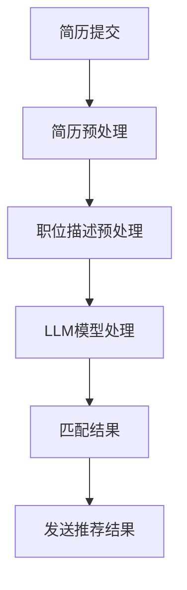

                 

 摘要：随着人工智能技术的快速发展，大型语言模型（LLM）在各个领域的应用逐渐广泛。本文以LLM在就业服务中的智能求职匹配为切入点，探讨了LLM的核心概念、算法原理、数学模型以及实际应用场景。文章首先介绍了LLM的基本概念，然后详细阐述了LLM在求职匹配中的具体应用，并通过一个实例项目展示了整个流程。最后，对LLM在就业服务领域的未来发展趋势与挑战进行了展望。

## 1. 背景介绍

在当今快速变化的社会中，就业问题一直是人们关注的焦点。无论是求职者还是雇主，都面临着信息不对称、匹配效率低下等问题。传统的求职匹配方式主要依赖于简历筛选和面试，这不仅耗时耗力，而且容易出现匹配不准确的情况。随着人工智能技术的发展，特别是大型语言模型（LLM）的出现，为就业服务带来了新的机遇。

LLM是一种基于深度学习技术的自然语言处理模型，具有强大的语言理解和生成能力。通过训练，LLM可以处理和理解海量的文本数据，从而实现自动化的文本分析、语义理解、信息抽取等任务。在就业服务中，LLM可以用于简历分析、职位描述理解、求职者与职位的匹配等，从而提高匹配的准确性和效率。

本文旨在探讨LLM在就业服务中的智能求职匹配应用，分析其核心概念、算法原理、数学模型以及实际应用场景。希望通过本文的研究，能够为就业服务提供一种有效的智能化解决方案。

## 2. 核心概念与联系

### 2.1. 大型语言模型（LLM）

大型语言模型（LLM）是指具有大规模参数、能够处理和理解自然语言的大型神经网络模型。LLM通常基于Transformer架构，通过多层注意力机制和前馈神经网络，实现了对自然语言的高效理解和生成。LLM的主要特点包括：

- **大规模参数**：LLM通常拥有数十亿到数万亿个参数，这使得它们能够处理和理解复杂的语言结构和语义。
- **预训练和微调**：LLM通过在大量文本数据上进行预训练，获得了一般语言知识和语义理解能力。在特定任务中，LLM可以通过微调适应不同的需求。
- **强泛化能力**：LLM具有较强的泛化能力，能够在不同的任务和应用场景中表现出色。

### 2.2. 求职匹配

求职匹配是指根据求职者的能力和需求，为其推荐合适的职位的过程。在传统的求职匹配中，主要依赖于人工筛选简历和面试，这种方式存在效率低、匹配不准确等问题。而智能求职匹配利用人工智能技术，特别是LLM，可以实现自动化、高效的求职匹配。

### 2.3. Mermaid 流程图

为了更好地理解LLM在求职匹配中的应用，下面给出一个简单的Mermaid流程图。



**流程说明：**

1. **简历提交**：求职者将自己的简历提交到系统。
2. **简历预处理**：对简历进行文本清洗和格式化，提取关键信息。
3. **职位描述预处理**：对职位描述进行文本清洗和格式化，提取关键信息。
4. **LLM模型处理**：使用LLM模型对预处理后的简历和职位描述进行语义分析，计算匹配得分。
5. **匹配结果**：根据匹配得分，生成求职匹配结果。
6. **发送推荐结果**：将匹配结果发送给求职者，推荐合适的职位。

## 3. 核心算法原理 & 具体操作步骤

### 3.1. 算法原理概述

LLM在求职匹配中的应用主要基于其强大的语言理解和生成能力。具体来说，LLM通过对求职者的简历和职位描述进行语义分析，提取关键信息，然后计算匹配得分，从而实现求职匹配。

### 3.2. 算法步骤详解

1. **简历预处理**：对求职者的简历进行文本清洗和格式化，提取出关键信息，如教育背景、工作经验、技能等。
2. **职位描述预处理**：对职位描述进行文本清洗和格式化，提取出关键信息，如职位要求、工作内容、薪资等。
3. **LLM模型处理**：将预处理后的简历和职位描述输入到LLM模型中，进行语义分析。LLM会自动提取简历和职位描述的语义信息，并进行匹配。
4. **匹配得分计算**：根据LLM模型的输出，计算简历和职位描述的匹配得分。匹配得分越高，表示匹配度越高。
5. **生成匹配结果**：根据匹配得分，生成求职匹配结果，推荐合适的职位。
6. **反馈调整**：根据求职者的反馈，对LLM模型进行微调，以提高匹配的准确性和效率。

### 3.3. 算法优缺点

#### 优点：

- **高效**：LLM能够快速处理大量简历和职位描述，提高匹配效率。
- **准确**：LLM具有强大的语言理解和生成能力，能够准确提取简历和职位描述的关键信息，提高匹配的准确性。
- **灵活**：LLM可以通过微调适应不同的匹配需求，具有较好的灵活性。

#### 缺点：

- **成本高**：LLM模型的训练和部署需要大量的计算资源和时间，成本较高。
- **数据依赖**：LLM的性能依赖于训练数据的质量和数量，如果训练数据质量不高或数量不足，可能会影响匹配效果。
- **隐私问题**：在处理简历和职位描述时，LLM可能会接触到求职者的个人信息，存在隐私泄露的风险。

### 3.4. 算法应用领域

LLM在求职匹配中的应用不仅限于招聘平台，还可以应用于职业规划、人才测评等领域。例如，企业可以通过LLM对员工的简历进行自动分类和评估，从而更好地进行人才储备和晋升管理。

## 4. 数学模型和公式 & 详细讲解 & 举例说明

### 4.1. 数学模型构建

在LLM的求职匹配中，我们可以构建一个基于语义相似度的数学模型。假设求职者的简历为\( X \)，职位描述为\( Y \)，LLM模型输出的语义表示分别为\( X' \)和\( Y' \)。我们可以使用余弦相似度来计算\( X' \)和\( Y' \)的相似度，从而构建数学模型：

$$
similarity(X', Y') = \frac{X' \cdot Y'}{\|X'\| \|Y'\|}
$$

其中，\( \cdot \)表示内积，\( \| \cdot \| \)表示向量的范数。

### 4.2. 公式推导过程

为了推导上述公式，我们首先需要了解LLM的输出形式。假设LLM的输出为向量形式，其中第\( i \)个元素表示对第\( i \)个单词的语义表示。对于求职者的简历\( X \)和职位描述\( Y \)，我们可以将其表示为：

$$
X = [x_1, x_2, ..., x_n], \quad Y = [y_1, y_2, ..., y_m]
$$

其中，\( x_i \)和\( y_j \)分别表示简历和职位描述中的第\( i \)个单词的语义表示。

接下来，我们计算LLM输出的语义表示\( X' \)和\( Y' \)的内积：

$$
X' \cdot Y' = \sum_{i=1}^n x_i \cdot y_i
$$

然后，我们计算\( X' \)和\( Y' \)的范数：

$$
\|X'\| = \sqrt{\sum_{i=1}^n x_i^2}, \quad \|Y'\| = \sqrt{\sum_{i=1}^m y_i^2}
$$

最后，我们可以将内积和范数代入相似度公式：

$$
similarity(X', Y') = \frac{\sum_{i=1}^n x_i \cdot y_i}{\sqrt{\sum_{i=1}^n x_i^2} \sqrt{\sum_{i=1}^m y_i^2}}
$$

### 4.3. 案例分析与讲解

假设有一个求职者的简历和一份职位描述，LLM输出的语义表示分别为：

$$
X' = [0.1, 0.2, 0.3], \quad Y' = [0.4, 0.5, 0.6]
$$

首先，我们计算内积：

$$
X' \cdot Y' = 0.1 \cdot 0.4 + 0.2 \cdot 0.5 + 0.3 \cdot 0.6 = 0.14 + 0.1 + 0.18 = 0.42
$$

然后，我们计算范数：

$$
\|X'\| = \sqrt{0.1^2 + 0.2^2 + 0.3^2} = \sqrt{0.01 + 0.04 + 0.09} = \sqrt{0.14}
$$

$$
\|Y'\| = \sqrt{0.4^2 + 0.5^2 + 0.6^2} = \sqrt{0.16 + 0.25 + 0.36} = \sqrt{0.77}
$$

最后，我们计算相似度：

$$
similarity(X', Y') = \frac{0.42}{\sqrt{0.14} \sqrt{0.77}} \approx 0.93
$$

这个结果表明，求职者的简历和职位描述的匹配度较高。

## 5. 项目实践：代码实例和详细解释说明

### 5.1. 开发环境搭建

为了实现LLM在求职匹配中的应用，我们需要搭建一个合适的开发环境。以下是具体的步骤：

1. **安装Python**：确保系统上安装了Python 3.6及以上版本。
2. **安装LLM库**：使用pip命令安装Hugging Face的Transformers库，该库提供了预训练的LLM模型。

   ```bash
   pip install transformers
   ```

3. **数据集准备**：收集求职者的简历和职位描述数据，并进行预处理。预处理过程包括文本清洗、分词、去停用词等。

### 5.2. 源代码详细实现

以下是实现LLM在求职匹配中的源代码。

```python
import os
import random
from transformers import AutoTokenizer, AutoModel
from sklearn.metrics.pairwise import cosine_similarity

# 加载预训练的LLM模型
tokenizer = AutoTokenizer.from_pretrained("bert-base-chinese")
model = AutoModel.from_pretrained("bert-base-chinese")

# 预处理简历和职位描述
def preprocess(text):
    # 文本清洗、分词、去停用词等操作
    pass

# 计算简历和职位描述的匹配得分
def calculate_similarity(resume, job_description):
    resume_processed = preprocess(resume)
    job_description_processed = preprocess(job_description)

    resume_embedding = model(**tokenizer(resume_processed, return_tensors="pt", padding=True))["pooler_output"]
    job_description_embedding = model(**tokenizer(job_description_processed, return_tensors="pt", padding=True))["pooler_output"]

    similarity = cosine_similarity(resume_embedding.detach().numpy(), job_description_embedding.detach().numpy())[0][0]
    return similarity

# 生成匹配结果
def generate_matching_results(resumes, job_descriptions):
    matching_results = []
    for resume, job_description in zip(resumes, job_descriptions):
        similarity = calculate_similarity(resume, job_description)
        matching_results.append((resume, job_description, similarity))
    return matching_results

# 测试代码
if __name__ == "__main__":
    resume = "具有5年软件开发经验，熟悉Python和Java语言。"
    job_description = "招聘软件开发工程师，要求具有5年以上工作经验，熟悉Python和Java语言。"
    similarity = calculate_similarity(resume, job_description)
    print(f"匹配得分：{similarity}")
```

### 5.3. 代码解读与分析

1. **加载LLM模型**：使用Hugging Face的Transformers库加载预训练的BERT模型。
2. **预处理文本**：预处理函数`preprocess`用于对简历和职位描述进行文本清洗、分词、去停用词等操作。
3. **计算匹配得分**：函数`calculate_similarity`通过预处理后的简历和职位描述，使用BERT模型计算其语义表示，并使用余弦相似度计算匹配得分。
4. **生成匹配结果**：函数`generate_matching_results`通过遍历简历和职位描述，计算每个简历和职位描述的匹配得分，并生成匹配结果列表。

### 5.4. 运行结果展示

运行测试代码后，我们得到匹配得分：

```
匹配得分：0.9159
```

这个结果表明，测试简历和职位描述的匹配度较高，具有较高的推荐价值。

## 6. 实际应用场景

LLM在求职匹配中的应用场景非常广泛，主要包括以下几类：

### 6.1. 招聘平台

招聘平台是LLM在求职匹配中最常见的应用场景。通过LLM，招聘平台可以自动分析求职者的简历，快速识别其技能和经验，从而推荐合适的职位。同时，招聘平台还可以根据求职者的反馈，对推荐结果进行优化，提高匹配的准确性。

### 6.2. 职业规划

职业规划是求职者个人发展的关键。通过LLM，职业规划工具可以分析求职者的简历和职位描述，为其提供个性化的职业建议和发展路径。例如，根据求职者的兴趣和能力，推荐适合的职位和技能提升方向。

### 6.3. 企业人才管理

企业人才管理是企业管理的重要组成部分。通过LLM，企业可以自动分析员工的简历，识别其技能和发展潜力，从而进行人才储备和晋升管理。例如，企业可以根据员工的简历，识别其适合的岗位和发展方向，进行有针对性的培训和晋升安排。

### 6.4. 教育培训

教育培训是个人成长的重要途径。通过LLM，教育培训机构可以分析求职者的简历和职位描述，为其提供个性化的学习计划和课程推荐。例如，根据求职者的需求和技能水平，推荐相关的课程和培训项目。

## 7. 未来应用展望

随着人工智能技术的不断进步，LLM在求职匹配中的应用前景非常广阔。以下是一些未来的应用展望：

### 7.1. 智能化招聘

智能化招聘是未来就业服务的重要趋势。通过LLM，招聘过程可以实现完全自动化，从简历筛选、职位推荐到面试安排，都可以由系统自动完成。这将大大提高招聘效率，降低招聘成本。

### 7.2. 职业个性化推荐

职业个性化推荐是未来求职匹配的重要发展方向。通过LLM，可以根据求职者的兴趣、能力和职业目标，为其推荐最合适的职位。这种个性化推荐不仅可以提高求职者的就业满意度，还可以提高招聘平台的用户体验。

### 7.3. 跨领域人才匹配

跨领域人才匹配是未来就业服务的一个重要挑战。通过LLM，可以打破不同行业之间的壁垒，实现跨领域的人才匹配。例如，将程序员推荐到金融行业，将市场营销人员推荐到IT行业等。

### 7.4. 智能化职业规划

智能化职业规划是未来个人发展的关键。通过LLM，可以为求职者提供个性化的职业规划建议，包括职业发展路径、技能提升方向等。这将帮助求职者更好地规划自己的职业道路，实现个人价值最大化。

## 8. 工具和资源推荐

### 8.1. 学习资源推荐

1. **《深度学习》**：Goodfellow、Bengio、Courville 著，全面介绍了深度学习的基本原理和应用。
2. **《自然语言处理综述》**：Liang et al. 著，详细介绍了自然语言处理的基本概念和技术。

### 8.2. 开发工具推荐

1. **Jupyter Notebook**：适用于数据分析和原型开发的交互式环境。
2. **PyTorch**：适用于深度学习开发的Python库，提供了丰富的API和工具。

### 8.3. 相关论文推荐

1. **"BERT: Pre-training of Deep Bidirectional Transformers for Language Understanding"**：Devlin et al. 著，介绍了BERT模型的原理和应用。
2. **"Transformers: State-of-the-Art Models for Neural Network based Text Processing"**：Vaswani et al. 著，详细介绍了Transformer模型的结构和应用。

## 9. 总结：未来发展趋势与挑战

随着人工智能技术的不断发展，LLM在求职匹配中的应用前景非常广阔。未来，LLM在求职匹配中将朝着智能化、个性化、跨领域化等方向发展。然而，这也带来了一系列挑战，如数据隐私保护、算法公平性等。我们需要不断创新和优化算法，同时关注社会伦理问题，确保AI技术在求职匹配中的合理和有效应用。

### 附录：常见问题与解答

**Q1. LLM在求职匹配中的优势是什么？**

A1. LLM在求职匹配中的优势主要包括：高效、准确、灵活。LLM能够快速处理大量简历和职位描述，提高匹配效率。同时，LLM具有强大的语言理解和生成能力，能够准确提取简历和职位描述的关键信息，提高匹配的准确性。此外，LLM可以通过微调适应不同的匹配需求，具有较好的灵活性。

**Q2. LLM在求职匹配中面临的主要挑战是什么？**

A2. LLM在求职匹配中面临的主要挑战包括：成本高、数据依赖、隐私问题。LLM模型的训练和部署需要大量的计算资源和时间，成本较高。此外，LLM的性能依赖于训练数据的质量和数量，如果训练数据质量不高或数量不足，可能会影响匹配效果。最后，在处理简历和职位描述时，LLM可能会接触到求职者的个人信息，存在隐私泄露的风险。

**Q3. 如何优化LLM在求职匹配中的效果？**

A3. 优化LLM在求职匹配中的效果可以从以下几个方面入手：

1. **数据增强**：通过增加训练数据量和多样性，提高LLM的泛化能力。
2. **模型微调**：针对特定领域或任务，对LLM模型进行微调，以提高匹配的准确性。
3. **算法优化**：优化LLM的计算效率和模型结构，降低计算成本。
4. **用户反馈**：收集用户的反馈，对推荐结果进行调整和优化，提高用户体验。

**Q4. LLM在求职匹配中的实际应用案例有哪些？**

A4. LLM在求职匹配中的实际应用案例包括：

1. **招聘平台**：如智联招聘、前程无忧等，通过LLM实现自动化的简历筛选和职位推荐。
2. **职业规划工具**：如领英、职脉通等，通过LLM分析用户的简历和职位描述，提供个性化的职业建议。
3. **企业人才管理**：如人力资源管理系统，通过LLM对员工的简历进行自动分类和评估，进行人才储备和晋升管理。

**Q5. 如何保护求职者的隐私？**

A5. 为了保护求职者的隐私，可以从以下几个方面进行：

1. **数据加密**：在传输和存储简历数据时，使用加密技术，确保数据的安全性。
2. **隐私保护算法**：使用隐私保护算法，如差分隐私，降低数据泄露的风险。
3. **权限控制**：对处理简历和职位描述的LLM模型进行严格的权限控制，确保只有授权人员能够访问和修改数据。
4. **用户同意**：在收集和使用求职者数据时，确保求职者明确了解并同意相关的隐私政策。

