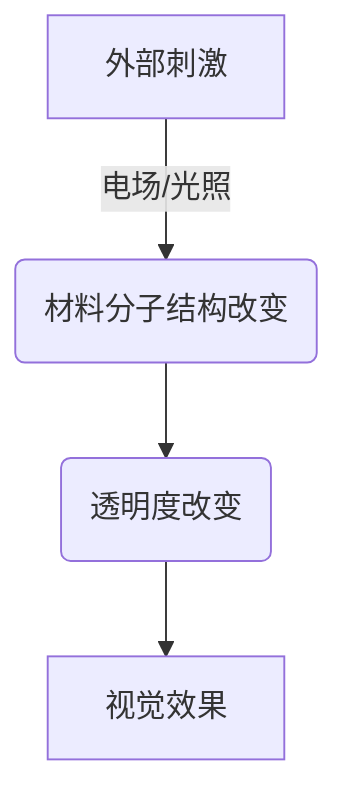

                 

关键词：智能玻璃，透明度调节，建筑材料，未来应用，技术趋势

> 摘要：智能玻璃技术作为当代建筑材料领域的重要创新，以其独特的可调节透明度特性，在建筑设计和智能化领域展现出巨大的潜力。本文将探讨智能玻璃的基本原理、核心算法、数学模型及其在不同应用场景中的实践和未来展望。

## 1. 背景介绍

### 1.1 智能玻璃的定义

智能玻璃，又称为智能调光玻璃或智能窗膜，是一种具有自主调节透明度的特殊材料。通过电场、光照、温度等外部刺激，智能玻璃可以实现从完全透明到完全不透明或部分透明的转变，为建筑领域带来了前所未有的灵活性和设计自由度。

### 1.2 智能玻璃的发展历史

智能玻璃技术最早可以追溯到20世纪60年代的液晶显示器研究。随着液晶显示技术的进步，智能玻璃逐渐应用于建筑领域。近年来，随着纳米技术和材料科学的快速发展，智能玻璃的性能得到显著提升，成本逐渐降低，开始大规模商业化。

## 2. 核心概念与联系

智能玻璃的核心技术包括液晶材料、电致变色材料和光致变色材料等。这些材料在电场或光照的作用下，分子结构会发生改变，从而导致透明度的变化。下面是一个简单的Mermaid流程图，展示了智能玻璃的工作原理。



## 3. 核心算法原理 & 具体操作步骤

### 3.1 算法原理概述

智能玻璃的透明度调节通常依赖于电致变色或光致变色材料。这些材料在电场或光照的刺激下，会发生电子转移，改变其能带结构，从而影响光的吸收和透射。

### 3.2 算法步骤详解

1. **初始状态检测**：智能玻璃在开启之前，首先需要检测其初始透明度状态。
2. **电场或光照施加**：根据需求，通过电路或光源控制，施加电场或光照。
3. **透明度调整**：在电场或光照的作用下，材料分子结构发生改变，透明度随之改变。
4. **透明度检测与反馈**：通过传感器实时检测透明度，并根据反馈进行调节。

### 3.3 算法优缺点

**优点**：
- **节能**：智能玻璃可以根据光线强度自动调节，减少照明和空调的能耗。
- **隐私保护**：可通过控制透明度，灵活调节室内外的隐私保护。
- **设计自由**：为建筑设计师提供更多创意空间。

**缺点**：
- **成本较高**：目前智能玻璃的生产成本较高，限制了其大规模应用。
- **使用寿命**：长时间使用后，材料的透明度可能会下降。

### 3.4 算法应用领域

智能玻璃技术已广泛应用于商业建筑、住宅、汽车和航空航天等领域。例如，在商业建筑中，智能玻璃可以用于办公室隔断、玻璃幕墙等，提高能源效率和设计美观度。

## 4. 数学模型和公式 & 详细讲解 & 举例说明

### 4.1 数学模型构建

智能玻璃的透明度变化可以用以下数学模型描述：

$$
T = f(V)
$$

其中，\(T\) 表示透明度，\(V\) 表示电场或光照强度，\(f\) 是一个非线性函数。

### 4.2 公式推导过程

假设智能玻璃材料在电场作用下，其电子密度 \(n\) 与电场强度 \(E\) 成正比：

$$
n = knE
$$

其中，\(k\) 是常数。

根据费米-狄拉克分布，电子密度 \(n\) 与能带间隙 \(E_g\) 的关系为：

$$
n = \frac{1}{e^{(E_g - eE)/kT} + 1}
$$

其中，\(e\) 是电子电荷，\(k\) 是玻尔兹曼常数，\(T\) 是温度。

能带间隙 \(E_g\) 与透明度 \(T\) 的关系为：

$$
T = \frac{1}{1 + \frac{n}{n_0}}
$$

其中，\(n_0\) 是初始电子密度。

### 4.3 案例分析与讲解

假设某智能玻璃材料的初始电子密度 \(n_0 = 1 \times 10^{18} \, \text{cm}^{-3}\)，电场强度 \(E = 10 \, \text{kV/cm}\)，温度 \(T = 300 \, \text{K}\)，则透明度 \(T\) 随电场强度 \(E\) 的变化可以表示为：

$$
T = \frac{1}{1 + \frac{knE}{n_0}}
$$

当 \(E = 0 \, \text{kV/cm}\) 时，\(T = 1\)，即完全透明；
当 \(E = 10 \, \text{kV/cm}\) 时，\(T \approx 0.5\)，即半透明。

## 5. 项目实践：代码实例和详细解释说明

### 5.1 开发环境搭建

本文使用Python编程语言来实现智能玻璃透明度的控制。首先，需要安装Python环境（Python 3.7或更高版本），并安装相关库，如NumPy和Matplotlib。

```bash
pip install numpy matplotlib
```

### 5.2 源代码详细实现

以下是一个简单的Python代码示例，用于控制智能玻璃的透明度。

```python
import numpy as np
import matplotlib.pyplot as plt

def transparency(E):
    n0 = 1e18
    k = 1e-10
    T = 1 / (1 + n0 * k * E)
    return T

E = np.linspace(0, 10, 100)
T = transparency(E)

plt.plot(E, T)
plt.xlabel('Electric Field (kV/cm)')
plt.ylabel('Transparency')
plt.title('Transparency vs. Electric Field')
plt.show()
```

### 5.3 代码解读与分析

- **函数定义**：`transparency(E)` 函数用于计算给定电场强度 \(E\) 下的透明度 \(T\)。
- **变量初始化**：`n0` 表示初始电子密度，`k` 表示常数。
- **计算透明度**：使用上述公式计算透明度 \(T\)。
- **绘制图表**：使用Matplotlib库绘制透明度与电场强度的关系图。

### 5.4 运行结果展示

运行上述代码后，将得到一个透明度与电场强度的折线图。从图中可以看出，随着电场强度的增加，透明度逐渐降低。

## 6. 实际应用场景

### 6.1 商业建筑

智能玻璃在商业建筑中的应用非常广泛，如办公室隔断、玻璃幕墙等。通过智能玻璃，可以灵活控制室内光线和隐私保护，提高办公环境的舒适度。

### 6.2 住宅

在住宅领域，智能玻璃可以用于窗户、浴室隔断等。用户可以根据需要调节透明度，保护隐私或调节室内光线。

### 6.3 汽车和航空航天

智能玻璃在汽车和航空航天领域也有广泛应用，如车窗、座舱玻璃等。通过智能玻璃，可以提高安全性、舒适性和能效。

## 6.4 未来应用展望

随着技术的进步和成本的降低，智能玻璃的应用前景将更加广阔。未来，智能玻璃有望在更多领域得到应用，如智能家居、医疗设备、可穿戴设备等。

## 7. 工具和资源推荐

### 7.1 学习资源推荐

- 《液晶显示器原理与应用》
- 《智能玻璃技术与应用》
- 《材料科学基础》

### 7.2 开发工具推荐

- Python
- NumPy
- Matplotlib

### 7.3 相关论文推荐

- "Electrochromic Materials for Smart Windows"
- "Development of an Electrochromic Window System"
- "Spectrally Tunable Windows Based on Electrochromic Materials"

## 8. 总结：未来发展趋势与挑战

智能玻璃技术作为建筑材料领域的重要创新，已经展现出巨大的潜力。未来，随着技术的进步和成本的降低，智能玻璃将在更多领域得到应用。然而，仍然面临着成本、稳定性和寿命等挑战，需要进一步研究和突破。

## 9. 附录：常见问题与解答

### 9.1 智能玻璃的寿命是多少？

智能玻璃的寿命取决于材料的性质和使用环境。一般来说，智能玻璃的寿命可以达到10年以上，但实际寿命会受到电场强度、温度、湿度等因素的影响。

### 9.2 智能玻璃的成本是多少？

智能玻璃的生产成本较高，目前市场价格从几千到数万元不等。随着技术的进步和规模化生产，未来成本有望降低。

### 9.3 智能玻璃的安全性能如何？

智能玻璃具有很高的安全性能，其表面通常采用防刮擦涂层，并具有抗冲击和抗紫外线等功能。同时，智能玻璃还可根据需要添加防火、防水等特性。

### 9.4 智能玻璃的透明度可以调整到多少？

智能玻璃的透明度调整范围取决于材料和设计。一般来说，智能玻璃可以调整到完全透明到不透明的任意状态，但实际应用中，通常会设置一个最佳透明度范围，以满足特定需求。

### 作者署名

作者：禅与计算机程序设计艺术 / Zen and the Art of Computer Programming
----------------------------------------------------------------

以上是智能玻璃技术文章的完整内容。希望对您有所帮助！<|im_end|>

