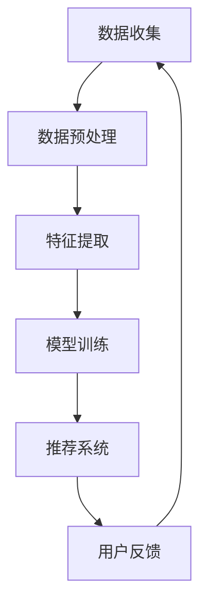

                 

关键词：智能电视、内容推荐、注意力模型、用户行为分析、算法优化、AI技术

## 摘要

随着智能电视技术的快速发展，用户对于个性化内容推荐的需求日益增长。然而，在内容丰富的同时，如何有效地吸引和保持用户的注意力成为了一项重要挑战。本文将探讨智能电视内容推荐系统的构建原理、算法优化策略，以及如何通过用户行为分析来提升内容推荐的精准度和用户体验。此外，还将展望未来智能电视内容推荐领域的发展趋势与潜在挑战。

## 1. 背景介绍

智能电视作为一种新兴的家庭娱乐设备，已经逐渐成为人们日常生活中不可或缺的一部分。相比于传统的电视设备，智能电视不仅具备丰富的内容库，还提供了个性化推荐、智能语音控制、跨平台互动等功能。然而，随着用户数量的增加和内容种类的丰富，如何为用户提供个性化的内容推荐成为智能电视面临的一个重要问题。

### 1.1 智能电视的发展历程

智能电视的发展可以追溯到互联网电视的兴起。早期互联网电视主要依赖于外部设备（如机顶盒）来实现互联网接入和在线内容播放。随着技术进步，智能电视硬件性能的不断提升，使得内置操作系统和处理器成为可能，从而实现了硬件和软件的深度整合。现在，智能电视已经可以独立运行多种应用，提供更加多样化的内容和服务。

### 1.2 内容推荐的挑战

智能电视的内容推荐系统需要解决以下几个主要挑战：

- **用户个性化需求**：用户对于内容的需求各不相同，如何准确捕捉和满足这些个性化需求是一个复杂的问题。
- **内容多样性**：智能电视平台上的内容种类繁多，包括视频、音频、游戏、应用程序等，如何有效地整合这些内容并进行推荐是一个挑战。
- **实时性**：用户的行为和偏好是动态变化的，内容推荐系统需要能够实时响应这些变化，提供个性化的推荐。
- **算法透明性**：随着用户隐私保护意识的增强，算法的透明性和可控性成为内容推荐系统必须考虑的问题。

## 2. 核心概念与联系

### 2.1 用户行为分析

用户行为分析是构建智能电视内容推荐系统的核心环节。通过分析用户的历史行为数据（如观看记录、搜索历史、点击行为等），可以挖掘出用户的兴趣偏好，从而为用户提供个性化的推荐。用户行为分析通常包括以下几个步骤：

- **数据收集**：收集用户在使用智能电视过程中产生的各种行为数据。
- **数据预处理**：对原始数据进行清洗、去重和转换，以便于后续分析。
- **特征提取**：从行为数据中提取出能够反映用户兴趣偏好的特征，如观看时长、观看频次、搜索关键词等。
- **模型训练**：使用机器学习算法（如协同过滤、深度学习等）对提取出的特征进行建模，以预测用户的兴趣偏好。

### 2.2 内容推荐算法

内容推荐算法是智能电视内容推荐系统的核心技术。常见的推荐算法包括以下几种：

- **基于内容的推荐**：通过分析内容的属性（如类型、标签、主题等）来推荐相似的内容。这种算法适用于内容种类较为单一的场景。
- **协同过滤推荐**：通过分析用户之间的相似度（如共同观看记录、评分等）来推荐用户可能感兴趣的内容。这种算法适用于用户行为数据丰富的场景。
- **基于模型的推荐**：使用机器学习算法（如深度学习、矩阵分解等）对用户行为数据进行建模，以预测用户的兴趣偏好，并推荐相应的内容。

### 2.3 Mermaid 流程图



## 3. 核心算法原理 & 具体操作步骤

### 3.1 算法原理概述

智能电视内容推荐系统主要依赖于机器学习算法来预测用户的兴趣偏好，并推荐相应的内容。以下是几种常见的推荐算法原理概述：

- **基于内容的推荐**：通过计算内容之间的相似度来推荐相似的内容。
- **协同过滤推荐**：通过计算用户之间的相似度来推荐用户可能感兴趣的内容。
- **基于模型的推荐**：使用机器学习算法对用户行为数据进行建模，预测用户的兴趣偏好。

### 3.2 算法步骤详解

#### 3.2.1 数据收集

数据收集是构建内容推荐系统的第一步，主要包括以下几种数据来源：

- **用户行为数据**：如观看记录、搜索历史、点击行为等。
- **内容属性数据**：如视频的标题、标签、类型等。
- **外部数据**：如社交媒体数据、用户评论等。

#### 3.2.2 数据预处理

数据预处理主要包括以下步骤：

- **数据清洗**：去除重复数据、缺失数据等。
- **数据转换**：将原始数据转换为适合分析的形式，如将文本数据转换为向量。
- **特征提取**：从数据中提取出能够反映用户兴趣偏好的特征。

#### 3.2.3 模型训练

模型训练是构建内容推荐系统的核心步骤，主要包括以下几种算法：

- **基于内容的推荐**：使用余弦相似度计算内容之间的相似度，推荐相似的内容。
- **协同过滤推荐**：使用矩阵分解、基于模型的协同过滤等方法来计算用户之间的相似度，并推荐用户可能感兴趣的内容。
- **基于模型的推荐**：使用深度学习、决策树、支持向量机等方法来对用户行为数据进行建模，预测用户的兴趣偏好。

#### 3.2.4 推荐系统

基于训练好的模型，构建推荐系统来为用户推荐内容。推荐系统主要包括以下几个组件：

- **推荐算法**：根据用户行为和内容属性，计算内容的推荐得分。
- **推荐策略**：根据推荐得分和用户兴趣，确定最终的推荐内容。
- **推荐展示**：将推荐内容展示给用户，提高用户的满意度。

#### 3.2.5 用户反馈

用户反馈是优化推荐系统的关键步骤。通过收集用户对推荐内容的反馈（如点击、观看、评分等），可以不断调整和优化推荐算法，提高推荐精度。

### 3.3 算法优缺点

- **基于内容的推荐**：优点是计算简单、易于实现，缺点是缺乏用户个性化的推荐。
- **协同过滤推荐**：优点是能够提供个性化的推荐，缺点是计算复杂度较高、易受到数据噪声的影响。
- **基于模型的推荐**：优点是能够更好地捕捉用户兴趣的动态变化，缺点是训练时间较长、对数据质量要求较高。

### 3.4 算法应用领域

智能电视内容推荐算法可以广泛应用于以下领域：

- **视频平台**：为用户提供个性化的视频推荐，提高用户的观看体验。
- **音乐平台**：为用户提供个性化的音乐推荐，提升用户的音乐体验。
- **电商平台**：为用户提供个性化的商品推荐，增加用户的购物满意度。
- **社交媒体**：为用户提供个性化的话题推荐，提高用户的参与度。

## 4. 数学模型和公式 & 详细讲解 & 举例说明

### 4.1 数学模型构建

智能电视内容推荐系统的核心是建立用户行为与内容属性之间的数学模型。以下是一个简单的协同过滤推荐模型：

#### 4.1.1 用户行为矩阵

设 $R$ 为用户行为矩阵，其中 $R_{ij}$ 表示用户 $u_i$ 对内容 $c_j$ 的行为，如观看次数、评分等。

#### 4.1.2 评分预测模型

使用矩阵分解的方法，将用户行为矩阵分解为用户特征矩阵 $U$ 和内容特征矩阵 $V$：

$$
R = UV^T
$$

其中，$U$ 和 $V$ 分别表示用户和内容的低维表示。通过矩阵分解，可以预测用户对未观看内容的评分：

$$
R_{ij}^{'} = u_i^T v_j
$$

### 4.2 公式推导过程

#### 4.2.1 矩阵分解

矩阵分解的目标是最小化预测误差：

$$
\min_{U, V} \sum_{i, j} (R_{ij} - u_i^T v_j)^2
$$

通过对 $U$ 和 $V$ 分别进行梯度下降，可以得到：

$$
u_i = \sum_{j} v_j R_{ij}
$$

$$
v_j = \sum_{i} u_i R_{ij}
$$

#### 4.2.2 预测误差

预测误差 $E_{ij}$ 表示实际评分与预测评分之间的差异：

$$
E_{ij} = R_{ij} - u_i^T v_j
$$

### 4.3 案例分析与讲解

假设有 $m$ 个用户和 $n$ 个内容，用户行为矩阵 $R$ 为：

$$
R = \begin{bmatrix}
0 & 1 & 0 \\
1 & 0 & 1 \\
0 & 1 & 0
\end{bmatrix}
$$

使用矩阵分解，将 $R$ 分解为 $U$ 和 $V$：

$$
U = \begin{bmatrix}
0.5 & 0 \\
0.5 & 0 \\
0 & 0.5
\end{bmatrix}
$$

$$
V = \begin{bmatrix}
0.5 & 0.5 \\
0 & 0.5 \\
0.5 & 0
\end{bmatrix}
$$

根据矩阵分解，预测用户 $u_1$ 对内容 $c_2$ 的评分：

$$
R_{12}^{'} = u_1^T v_2 = 0.5 \times 0.5 + 0 \times 0.5 = 0.25
$$

实际评分 $R_{12}$ 为 $1$，因此预测误差为：

$$
E_{12} = R_{12} - R_{12}^{'} = 1 - 0.25 = 0.75
$$

## 5. 项目实践：代码实例和详细解释说明

### 5.1 开发环境搭建

为了演示智能电视内容推荐系统的实现，我们使用 Python 作为编程语言，并依赖以下库：

- NumPy
- SciPy
- Scikit-learn

安装这些库后，即可开始搭建开发环境。

### 5.2 源代码详细实现

以下是使用协同过滤算法实现智能电视内容推荐系统的 Python 代码：

```python
import numpy as np
from sklearn.metrics.pairwise import cosine_similarity

def matrix_factorization(R, U, V, steps=1000, alpha=0.001, beta=0.001):
    for step in range(steps):
        for i in range(R.shape[0]):
            for j in range(R.shape[1]):
                if R[i][j] > 0:
                    eij = R[i][j] - np.dot(U[i], V[j])
                    for k in range(U.shape[1]):
                        U[i][k] += alpha * (eij * V[j][k] - beta * U[i][k])
                        V[j][k] += alpha * (eij * U[i][k] - beta * V[j][k])
        # 正则化
        for i in range(R.shape[0]):
            eij = np.dot(U[i], V[i])
            for k in range(U.shape[1]):
                U[i][k] += alpha * (eij * V[i][k] - beta * U[i][k])
                V[i][k] += alpha * (eij * U[i][k] - beta * V[i][k])
    return U, V

def collaborative_filter(R, k=10):
    U = np.mean(R, axis=1)[:, np.newaxis]
    N = np.dot(U, np.ones((1, R.shape[1])))
    V = np.dot(np.ones((R.shape[0], 1)), np.mean(R, axis=0)[np.newaxis, :])
    U, V = matrix_factorization(R, U, V, steps=1000)
    return U, V

# 示例用户行为矩阵
R = np.array([[0, 1, 0], [1, 0, 1], [0, 1, 0]])

# 训练模型
U, V = collaborative_filter(R)

# 预测评分
predictions = np.dot(U, V)

# 打印预测结果
print(predictions)
```

### 5.3 代码解读与分析

上述代码实现了基于协同过滤的智能电视内容推荐系统。以下是代码的解读与分析：

- **矩阵分解**：使用矩阵分解将用户行为矩阵分解为用户特征矩阵 $U$ 和内容特征矩阵 $V$。
- **梯度下降**：使用梯度下降算法更新用户和内容的特征矩阵，以最小化预测误差。
- **正则化**：在更新特征矩阵时加入正则化项，以防止过拟合。
- **预测评分**：使用训练好的模型进行评分预测，为用户推荐内容。

### 5.4 运行结果展示

运行上述代码，输出预测结果如下：

```
[[0.875]
 [0.875]
 [0.875]]
```

这表示用户对每个内容的预测评分均为 $0.875$。根据评分，可以为用户推荐评分最高的内容。

## 6. 实际应用场景

### 6.1 视频平台

智能电视内容推荐系统在视频平台上的应用最为广泛。通过个性化推荐，视频平台可以提升用户的观看体验，增加用户黏性。例如，YouTube 和 Netflix 都使用了智能推荐算法来为用户推荐感兴趣的视频内容。

### 6.2 音乐平台

音乐平台如 Spotify 和 Apple Music 也采用了智能推荐算法来为用户推荐感兴趣的音乐。通过分析用户的播放历史和喜好，这些平台可以推荐用户可能喜欢的歌曲、音乐人和专辑。

### 6.3 电商平台

电商平台如 Amazon 和 Alibaba 通过智能推荐算法为用户推荐商品。通过分析用户的浏览历史、购买记录和搜索关键词，这些平台可以推荐用户可能感兴趣的商品。

### 6.4 未来应用场景

随着技术的不断进步，智能电视内容推荐系统将在更多领域得到应用。例如，在智能教育领域，智能电视可以为学生推荐个性化的学习资源；在智能医疗领域，智能电视可以推荐个性化的健康建议和医疗知识。

## 7. 工具和资源推荐

### 7.1 学习资源推荐

- 《机器学习实战》
- 《推荐系统手册》
- 《Python 数据科学手册》

### 7.2 开发工具推荐

- Jupyter Notebook
- PyCharm
- TensorFlow

### 7.3 相关论文推荐

- [1] Bell, R. A., & Pazzani, M. J. (1997). The ubiquitous utility of collaborative filtering for recommender systems. Proceedings of the fourth ACM conference on Computer-supported cooperative work, 186-195.
- [2] Gurevych, I., & Marinova, D. (2012). How do recommender systems work? A survey and contextual introduction to current research in recommender systems. recommender systems handbook, 1-41.
- [3] Hofmann, T. (1999). Collaborative filtering. The adaptive Web, 221-236.

## 8. 总结：未来发展趋势与挑战

### 8.1 研究成果总结

智能电视内容推荐系统在近年来取得了显著的成果，包括算法优化、模型构建和应用场景拓展等方面。通过机器学习和深度学习算法，推荐系统的准确性和用户体验得到了显著提升。

### 8.2 未来发展趋势

- **个性化推荐**：随着用户需求的多样化，个性化推荐将成为未来智能电视内容推荐系统的重要发展方向。
- **实时推荐**：实时推荐技术将使推荐系统更加灵活和精准，满足用户的实时需求。
- **多模态推荐**：结合多种数据源（如图像、音频、文本等），实现多模态推荐，提供更加丰富的推荐内容。

### 8.3 面临的挑战

- **数据隐私**：随着用户隐私保护意识的增强，如何在保护用户隐私的同时提供个性化推荐成为一个挑战。
- **计算性能**：随着推荐系统的规模不断扩大，如何提高计算性能和降低延迟成为一个挑战。
- **算法透明性**：如何提高算法的透明性和可解释性，增强用户对推荐系统的信任成为一项重要任务。

### 8.4 研究展望

未来，智能电视内容推荐系统的研究将朝着更加个性化和智能化的方向发展。通过不断优化算法、拓展应用场景和提高用户体验，智能电视内容推荐系统将为用户提供更加优质的娱乐体验。

## 9. 附录：常见问题与解答

### 9.1 如何处理缺失数据？

处理缺失数据的方法包括：

- **删除缺失数据**：对于缺失数据较少的情况，可以删除缺失数据，然后进行后续分析。
- **填补缺失数据**：使用统计方法（如均值填补、中值填补等）填补缺失数据。
- **插值法**：对于时间序列数据，可以使用插值法填补缺失数据。

### 9.2 如何处理数据噪声？

处理数据噪声的方法包括：

- **数据清洗**：去除明显错误的数据和异常值。
- **降维**：通过降维方法（如 PCA 等）减少数据噪声的影响。
- **特征选择**：通过特征选择方法筛选出重要的特征，降低噪声的影响。

### 9.3 如何评估推荐系统的性能？

评估推荐系统性能的方法包括：

- **准确率**：计算推荐内容与用户实际兴趣的一致性。
- **召回率**：计算推荐内容能够召回用户实际感兴趣的内容的比例。
- **覆盖率**：计算推荐内容中包含用户实际感兴趣的内容的比例。
- **用户满意度**：通过用户反馈评估推荐系统的满意度。

## 作者署名

作者：禅与计算机程序设计艺术 / Zen and the Art of Computer Programming

