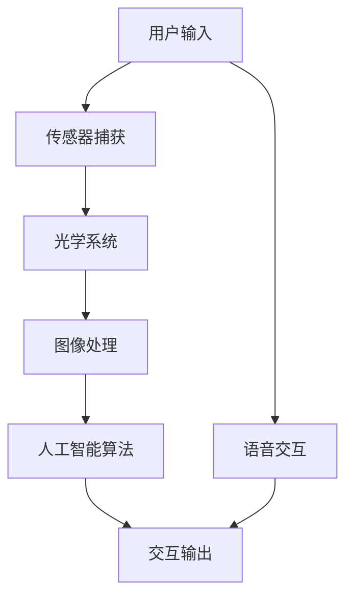

                 

关键词：智能眼镜，增强现实，创业，AR设备，技术趋势，应用场景，开发工具

> 摘要：随着科技的发展，智能眼镜作为增强现实（AR）设备的一种，正逐渐成为人们生活和工作中的重要组成部分。本文将探讨智能眼镜的市场背景、核心技术、算法原理、数学模型、项目实践、应用场景以及未来发展趋势和挑战。

## 1. 背景介绍

智能眼镜，即具有增强现实功能的眼镜，能够将虚拟信息叠加到真实世界中，为用户提供沉浸式的交互体验。近年来，随着智能手机和移动互联网的普及，智能眼镜市场迎来了快速发展。特别是在疫情影响下，远程工作和在线教育需求激增，智能眼镜的应用场景不断扩展。

智能眼镜的主要市场包括：消费市场、医疗市场、工业市场、军事市场以及教育市场。其中，消费市场以娱乐和通信为主，医疗市场主要用于远程诊断和患者监护，工业市场则用于现场监控和维护，军事市场则涉及战场情报获取和士兵训练，教育市场则提供了新的互动式学习方式。

### 市场背景

- 消费市场：随着5G技术的推广和AR应用的普及，智能眼镜在消费市场中的需求逐渐增加。消费者对新兴科技的追求，以及智能眼镜提供的便捷性和娱乐性，推动了消费市场的快速发展。
- 医疗市场：智能眼镜在医疗领域的应用，包括远程手术指导、患者监控、医疗数据采集等，提高了医疗服务的效率和质量。
- 工业市场：智能眼镜可以帮助工人实时查看工作指导、安全警示、设备维护信息等，提升了工业生产的安全性和效率。
- 军事市场：智能眼镜在战场情报获取、士兵导航、战术指挥等方面具有显著优势。
- 教育市场：智能眼镜为教育提供了新的互动方式，使得学习过程更加生动和有趣。

### 核心概念与联系

智能眼镜的核心技术包括光学设计、传感器技术、图像处理、语音交互、以及人工智能算法。以下是智能眼镜系统的Mermaid流程图：



## 2. 核心概念与联系

### 2.1 光学设计

光学设计是智能眼镜的核心技术之一，决定了图像的清晰度和视角范围。智能眼镜的光学系统通常包括镜片、透镜和反射镜等组件。为了提高视觉效果，光学设计需要考虑成像质量、光线损失、眼镜重量和舒适性等因素。

### 2.2 传感器技术

智能眼镜配备有多种传感器，包括摄像头、麦克风、加速度计、陀螺仪和心率传感器等。这些传感器用于捕捉环境信息、用户动作和生理数据，为图像处理和人工智能算法提供输入。

### 2.3 图像处理

图像处理技术负责将捕获的图像数据进行分析和增强，使其能够在智能眼镜上呈现。图像处理包括图像增强、图像识别、图像分割和目标跟踪等步骤。

### 2.4 语音交互

语音交互技术使得用户可以通过语音命令与智能眼镜进行自然交互。语音识别和语音合成技术是语音交互的核心，它们能够理解和生成自然语言，为用户提供便捷的操作方式。

### 2.5 人工智能算法

人工智能算法负责处理和分析传感器数据，实现智能眼镜的智能功能。常见的算法包括计算机视觉算法、语音识别算法、机器学习算法和深度学习算法等。

## 3. 核心算法原理 & 具体操作步骤

### 3.1 算法原理概述

智能眼镜的核心算法主要分为计算机视觉算法和人工智能算法。计算机视觉算法用于图像捕捉和处理，而人工智能算法则用于数据分析和决策。

### 3.2 算法步骤详解

1. **图像捕捉**：智能眼镜的摄像头捕捉用户周围的环境图像。
2. **图像预处理**：对捕获的图像进行预处理，包括去噪、对比度增强、大小调整等。
3. **图像识别**：使用计算机视觉算法对预处理后的图像进行分析，识别出图像中的物体、人脸和其他目标。
4. **目标跟踪**：根据识别结果，使用目标跟踪算法跟踪目标的位置和运动状态。
5. **数据融合**：将图像数据和传感器数据融合，为人工智能算法提供更全面的输入。
6. **智能决策**：人工智能算法根据融合后的数据进行智能分析，生成决策结果。
7. **交互输出**：将决策结果通过语音、图像或触觉反馈给用户。

### 3.3 算法优缺点

- **计算机视觉算法**：优点在于能够实现高效的环境感知和目标识别，缺点是计算资源消耗较大，对光线和环境变化的适应性较差。
- **人工智能算法**：优点在于能够进行复杂的数据分析和决策，缺点是训练过程需要大量数据和计算资源，算法的可解释性较低。

### 3.4 算法应用领域

智能眼镜的核心算法在多个领域具有广泛的应用，包括但不限于：

- **消费市场**：娱乐、导航、购物等。
- **医疗市场**：远程诊断、患者监护、手术指导等。
- **工业市场**：现场监控、设备维护、安全预警等。
- **军事市场**：战场情报获取、士兵导航、战术指挥等。
- **教育市场**：互动式学习、虚拟实验、远程教学等。

## 4. 数学模型和公式 & 详细讲解 & 举例说明

### 4.1 数学模型构建

智能眼镜的数学模型主要包括图像处理模型和人工智能模型。图像处理模型通常使用如傅里叶变换、卷积神经网络等数学工具，而人工智能模型则基于概率论、统计学和机器学习算法。

### 4.2 公式推导过程

以卷积神经网络（CNN）为例，其核心公式为：

$$
\text{output} = \text{activation}(\text{weights} \cdot \text{input} + \text{bias})
$$

其中，$activation$ 为激活函数，$weights$ 和 $bias$ 为网络参数。

### 4.3 案例分析与讲解

以下是一个简单的CNN模型应用于图像分类的案例：

```latex
\begin{equation}
\text{input} = \begin{bmatrix}
    \text{image\_1} \\
    \text{image\_2} \\
    \text{...} \\
    \text{image\_N}
\end{bmatrix}
\end{equation}

\begin{equation}
\text{weights} = \begin{bmatrix}
    w_{11} & w_{12} & ... & w_{1N} \\
    w_{21} & w_{22} & ... & w_{2N} \\
    ... & ... & ... & ... \\
    w_{M1} & w_{M2} & ... & w_{MN}
\end{bmatrix}
\end{equation}

\begin{equation}
\text{bias} = \begin{bmatrix}
    b_1 \\
    b_2 \\
    ... \\
    b_M
\end{bmatrix}
\end{equation}

\begin{equation}
\text{output} = \text{activation}(\text{weights} \cdot \text{input} + \text{bias})
\end{equation}
```

在这个例子中，$\text{input}$ 为输入图像矩阵，$\text{weights}$ 和 $\text{bias}$ 为网络权重和偏置，$\text{output}$ 为网络输出结果，$activation$ 为激活函数。

## 5. 项目实践：代码实例和详细解释说明

### 5.1 开发环境搭建

开发智能眼镜项目需要搭建相应的开发环境，包括操作系统、编程语言、开发工具和依赖库。以下是一个简单的开发环境搭建步骤：

1. 选择操作系统：Windows、Linux或MacOS。
2. 安装Python：Python是智能眼镜开发的主要编程语言，可以从官方网站下载安装。
3. 安装依赖库：包括NumPy、Pandas、TensorFlow、OpenCV等。
4. 安装智能眼镜SDK：不同品牌的智能眼镜提供不同的SDK，用于开发应用程序。

### 5.2 源代码详细实现

以下是一个简单的智能眼镜图像分类程序的代码示例：

```python
import tensorflow as tf
import numpy as np
import cv2

# 加载训练好的CNN模型
model = tf.keras.models.load_model('model.h5')

# 加载图像数据
image = cv2.imread('image.jpg')

# 预处理图像数据
image = cv2.resize(image, (224, 224))
image = image / 255.0

# 预测图像类别
prediction = model.predict(np.expand_dims(image, axis=0))

# 打印预测结果
print(prediction)

# 显示图像
cv2.imshow('Image', image)
cv2.waitKey(0)
cv2.destroyAllWindows()
```

### 5.3 代码解读与分析

这个简单的程序首先加载了训练好的CNN模型，然后读取一个图像文件，对其进行预处理，最后使用模型进行预测并显示结果。

- **加载模型**：使用 `tf.keras.models.load_model` 函数加载训练好的模型。
- **加载图像**：使用 OpenCV 库读取图像文件。
- **预处理图像**：调整图像大小，将图像数据归一化到0-1之间。
- **预测类别**：使用模型对预处理后的图像进行预测。
- **显示结果**：使用 OpenCV 库显示预测结果。

### 5.4 运行结果展示

运行上述程序后，会在屏幕上显示输入图像和预测结果。预测结果通常是一个概率分布，表示图像属于各个类别的概率。

## 6. 实际应用场景

智能眼镜在实际应用场景中展示了巨大的潜力。以下是一些典型的应用场景：

### 6.1 消费市场

- **娱乐**：智能眼镜可以提供沉浸式游戏和视频体验，吸引年轻消费者。
- **导航**：智能眼镜可以作为导航设备，为用户提供实时路线指引和地理位置信息。
- **购物**：智能眼镜可以帮助用户在购物过程中查看商品详情和用户评价。

### 6.2 医疗市场

- **远程诊断**：医生可以使用智能眼镜进行远程手术指导和患者监护。
- **患者监护**：智能眼镜可以实时监测患者的生理数据，如心率、血压和呼吸等。
- **医疗数据采集**：医生可以通过智能眼镜采集医疗数据，提高工作效率。

### 6.3 工业市场

- **现场监控**：工人可以使用智能眼镜实时查看设备状态和操作指南。
- **设备维护**：智能眼镜可以帮助工人快速定位设备故障并提供维修指导。
- **安全预警**：智能眼镜可以检测环境中的危险因素，为工人提供安全预警。

### 6.4 军事市场

- **战场情报获取**：士兵可以使用智能眼镜获取实时战场信息，提高作战能力。
- **士兵导航**：智能眼镜可以为士兵提供精确的导航信息，确保其在战场上的位置。
- **战术指挥**：指挥官可以使用智能眼镜进行实时战术指挥，协调作战行动。

### 6.5 教育市场

- **互动式学习**：智能眼镜可以提供互动式的学习体验，提高学生的学习兴趣和效果。
- **虚拟实验**：教师可以通过智能眼镜为学生提供虚拟实验环境，增强学生的实践能力。
- **远程教学**：教师可以使用智能眼镜进行远程教学，为学生提供个性化的学习指导。

## 7. 工具和资源推荐

为了开发智能眼镜应用程序，需要使用一系列工具和资源。以下是一些建议：

### 7.1 学习资源推荐

- **官方文档**：智能眼镜制造商的官方文档提供了详细的技术指南和API文档。
- **在线课程**：有许多在线平台提供智能眼镜开发的课程，如Coursera、Udacity和edX。
- **技术博客**：一些技术博客和论坛，如Stack Overflow、GitHub和Reddit，提供了丰富的开发经验和资源。

### 7.2 开发工具推荐

- **开发环境**：Python、Java和C++是智能眼镜开发的主要编程语言。
- **开发框架**：TensorFlow、PyTorch和OpenCV是常用的开发框架，适用于图像处理和计算机视觉任务。
- **智能眼镜SDK**：根据所选的智能眼镜品牌，选择相应的SDK，如Google ARCore、Apple ARKit和Microsoft Mixed Reality。

### 7.3 相关论文推荐

- **计算机视觉**：《深度学习在计算机视觉中的应用》（Deep Learning for Computer Vision），作者：福岛邦彦（Hongyi Li）等。
- **增强现实**：《增强现实技术：从理论到实践》（Augmented Reality Technology: From Theory to Practice），作者：井上顺（Yasuhiko Inoue）等。
- **人工智能**：《深度学习》（Deep Learning），作者：Ian Goodfellow、Yoshua Bengio和Aaron Courville。

## 8. 总结：未来发展趋势与挑战

### 8.1 研究成果总结

智能眼镜作为增强现实设备的一种，已经在多个领域取得了显著的研究成果。计算机视觉和人工智能算法的快速发展，使得智能眼镜能够提供更加丰富和智能化的功能。光学设计和传感器技术的进步，也为智能眼镜提供了更好的视觉效果和用户体验。

### 8.2 未来发展趋势

未来，智能眼镜的发展趋势包括以下几个方面：

- **硬件性能提升**：随着硬件技术的进步，智能眼镜的处理器性能、存储容量和电池续航能力将得到显著提升。
- **软件优化**：软件优化将提高智能眼镜的响应速度和操作便捷性，提供更加流畅的用户体验。
- **多样化应用场景**：智能眼镜将在医疗、工业、军事和教育等更多领域得到广泛应用。
- **标准化**：智能眼镜的标准化将有助于促进不同品牌和平台之间的兼容性和互操作性。

### 8.3 面临的挑战

智能眼镜在发展过程中也面临一些挑战：

- **隐私保护**：智能眼镜的普及可能导致用户隐私泄露，需要制定相关法规和标准，保护用户隐私。
- **电池寿命**：智能眼镜的电池续航能力仍需提升，以满足用户长时间使用的需求。
- **光学设计**：光学设计需要进一步优化，以提供更好的视觉效果和舒适度。
- **成本控制**：智能眼镜的成本较高，需要通过技术进步和规模化生产来降低成本，使其更加普及。

### 8.4 研究展望

未来，智能眼镜的研究将重点围绕以下几个方面：

- **人机交互**：探索更加自然和直观的人机交互方式，提高用户的使用体验。
- **人工智能**：结合最新的机器学习和深度学习技术，提高智能眼镜的智能程度和决策能力。
- **边缘计算**：利用边缘计算技术，提高智能眼镜的实时性和响应速度。
- **生态系统**：构建智能眼镜的生态系统，包括硬件、软件、平台和服务，推动智能眼镜的全面发展。

## 9. 附录：常见问题与解答

### 9.1 如何选择智能眼镜？

选择智能眼镜时，应考虑以下因素：

- **应用场景**：根据实际需求选择适合的应用场景。
- **硬件性能**：选择处理器性能、存储容量和电池续航能力较高的智能眼镜。
- **兼容性**：考虑智能眼镜与现有设备和软件的兼容性。
- **价格**：根据预算选择合适的智能眼镜。

### 9.2 智能眼镜的隐私问题如何解决？

智能眼镜的隐私问题可以从以下几个方面解决：

- **隐私保护法规**：制定相关法规，规范智能眼镜的隐私保护。
- **用户教育**：加强对用户隐私保护的教育，提高用户的隐私意识。
- **技术措施**：采用加密技术、匿名化处理和用户权限管理等技术手段，保护用户隐私。

### 9.3 智能眼镜的电池续航能力如何提升？

提升智能眼镜电池续航能力的措施包括：

- **硬件优化**：采用低功耗处理器和传感器，减少电池消耗。
- **软件优化**：优化操作系统和应用程序，减少不必要的功耗。
- **能源管理**：采用高效的能源管理系统，优化电池使用。
- **充电技术**：开发快速充电技术和无线充电技术，提高充电效率。

---

**作者：禅与计算机程序设计艺术 / Zen and the Art of Computer Programming**

