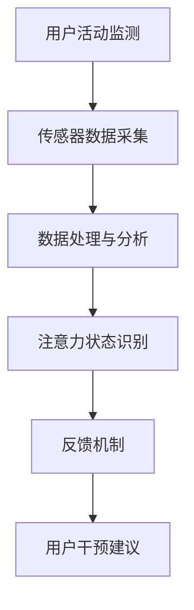

                 

随着科技的进步，智能穿戴设备已逐渐渗透到我们生活的方方面面。这些设备不仅能够监测我们的身体健康，还能够通过分析我们的行为模式来提升我们的生活质量。在众多功能中，注意力管理成为了智能穿戴设备的一个热点研究方向。本文将围绕智能穿戴设备与注意力管理展开探讨，旨在为您揭示这一领域的深度与广度。

## 关键词

- 智能穿戴设备
- 注意力管理
- 生物识别技术
- 机器学习
- 数据分析

## 摘要

本文将首先介绍智能穿戴设备的发展背景及其在注意力管理方面的潜力。接着，我们将深入探讨注意力管理的核心概念、相关技术和应用。随后，文章将分析注意力管理算法的数学模型和具体操作步骤，并提供实际项目实践的代码实例。最后，文章将总结智能穿戴设备在注意力管理方面的实际应用场景，展望其未来发展趋势和挑战。

## 1. 背景介绍

智能穿戴设备是一种集成在衣物或配件中的计算设备，它们能够实时收集并传输各种生理和行为数据。这些设备主要包括智能手环、智能手表、智能眼镜、智能耳塞等。随着物联网（IoT）和生物识别技术的快速发展，智能穿戴设备已经不仅仅局限于简单的健康监测功能，它们开始在提高生活质量、管理个人健康以及优化日常行为方面发挥重要作用。

注意力管理是指通过各种技术和方法，帮助人们更有效地分配和调节注意力，以达到最佳的工作和生活状态。在当今信息爆炸的时代，注意力分散和疲劳成为普遍问题。因此，注意力管理的重要性日益凸显。智能穿戴设备通过实时监测个体的生理和行为信号，为注意力管理提供了新的手段和工具。

### 智能穿戴设备的现状

近年来，智能穿戴设备市场迅速扩张，各大科技公司纷纷推出具有不同功能的产品。例如，苹果的Apple Watch和三星的Galaxy Watch已经成为市场上最受欢迎的智能手表之一。这些设备不仅能够记录步数、心率、睡眠质量等基本健康数据，还能够进行更复杂的生物识别分析，如情绪识别和注意力监测。

根据市场研究公司的数据，全球智能穿戴设备市场预计在未来几年将持续增长。这一趋势得益于消费者对健康和生活方式管理的日益关注，以及技术成本的降低和设备性能的提升。此外，医疗保健行业的应用需求也为智能穿戴设备的发展提供了新的动力。

### 注意力管理的需求

随着人们对生活质量的要求提高，注意力管理成为了一个重要的研究领域。工作压力、社交媒体成瘾、信息过载等问题使得人们越来越难以集中注意力，从而影响了工作和生活的质量。注意力管理的目标是通过技术和方法，帮助用户更好地控制自己的注意力，提高工作效率和生活满意度。

智能穿戴设备在注意力管理方面的应用潜力巨大。通过实时监测用户的心率、皮肤电导、眼球运动等生理信号，智能穿戴设备能够识别用户的注意力状态，并提供相应的反馈和干预。这种个性化的注意力管理方法有望帮助用户在日常生活中更好地平衡工作与休息，提高生活质量。

## 2. 核心概念与联系

### 注意力管理的核心概念

注意力管理涉及到多个核心概念，包括注意力分散、注意力疲劳、注意力集中度、注意力转移等。这些概念在理解和管理注意力方面起着重要作用。

- **注意力分散（Attention Diversion）**：指个体在执行任务时，注意力被其他无关刺激所吸引，导致任务效率降低。
- **注意力疲劳（Attention Fatigue）**：指长时间专注于某项任务或活动后，个体感到疲劳和注意力下降。
- **注意力集中度（Attention Concentration）**：指个体在执行任务时，将注意力集中在特定目标上，排除干扰的能力。
- **注意力转移（Attention Shift）**：指个体在需要时，将注意力从一个任务或活动转移到另一个任务或活动的能力。

### 注意力管理的技术架构

为了实现有效的注意力管理，智能穿戴设备通常采用以下技术架构：

1. **传感器数据采集**：通过内置的多种传感器（如加速度计、陀螺仪、心率传感器等）收集用户的生理和行为数据。
2. **数据处理和分析**：使用机器学习和数据分析技术，对采集到的传感器数据进行处理和分析，提取出与注意力状态相关的特征。
3. **反馈机制**：根据分析结果，智能穿戴设备通过视觉、声音或其他方式向用户反馈注意力状态，提供干预建议。

### 注意力管理架构的 Mermaid 流程图

下面是一个简化的注意力管理架构的 Mermaid 流程图：



在这个流程图中，用户活动监测是整个架构的起点，传感器数据采集用于收集用户的生理和行为数据。这些数据经过处理和分析，用于识别用户的注意力状态。根据注意力状态，反馈机制会向用户提供干预建议，帮助用户更好地管理注意力。

### 注意力管理的关键技术

实现有效的注意力管理需要多种关键技术的支持，包括：

- **生物识别技术**：通过心率、皮肤电导、眼球运动等生理信号监测用户的注意力状态。
- **机器学习**：用于处理和分析大量传感器数据，提取注意力状态的相关特征。
- **数据分析**：用于从传感器数据中提取有用的信息，以便进行进一步的注意力状态识别。
- **反馈机制**：通过视觉、声音或其他方式向用户提供实时反馈，帮助他们调整注意力。

### 注意力管理技术的整合

注意力管理技术的整合是实现有效注意力管理的关键。通过将生物识别技术、机器学习和数据分析技术整合在一起，智能穿戴设备可以实现对用户注意力状态的实时监测和反馈。这种整合不仅提高了注意力管理的准确性，还能够为用户提供个性化的干预建议，从而更好地满足他们的需求。

总的来说，注意力管理架构的核心是通过多种技术手段，实现对用户注意力状态的全面监测和分析，并基于此提供有效的干预建议。这一架构不仅为用户提供了更好的注意力管理工具，也为未来的研究和应用提供了广阔的空间。

## 3. 核心算法原理 & 具体操作步骤

### 3.1 算法原理概述

注意力管理的核心算法通常基于生物信号处理和机器学习技术。生物信号处理技术用于提取用户的生理和行为数据，如心率、皮肤电导和眼球运动等。这些数据经过预处理后，被输入到机器学习模型中，用于识别用户的注意力状态。

核心算法可以分为以下几个步骤：

1. **数据采集**：使用智能穿戴设备内置的传感器收集用户的生理和行为数据。
2. **数据预处理**：对采集到的原始数据进行清洗和归一化处理，以消除噪声和异常值。
3. **特征提取**：从预处理后的数据中提取与注意力状态相关的特征，如心率变异性、皮肤电导变化和眼球运动频率等。
4. **模型训练**：使用机器学习算法，如支持向量机（SVM）、深度神经网络（DNN）等，对提取到的特征进行训练，以建立注意力状态的预测模型。
5. **状态预测**：将实时采集的数据输入到训练好的模型中，预测用户的当前注意力状态。
6. **干预建议**：根据预测结果，智能穿戴设备向用户提供相应的干预建议，如调整工作节奏、休息提醒等。

### 3.2 算法步骤详解

#### 步骤1：数据采集

数据采集是注意力管理算法的基础。智能穿戴设备内置的传感器，如加速度计、陀螺仪、心率传感器和眼球追踪传感器等，用于收集用户的生理和行为数据。这些数据包括心率、皮肤电导、加速度和角速度等。

#### 步骤2：数据预处理

原始数据通常包含噪声和异常值，需要进行预处理。预处理步骤包括去噪、归一化和特征提取。去噪使用滤波器或插值方法消除噪声，归一化用于将不同传感器采集的数据统一到一个标准范围内，特征提取则用于提取与注意力状态相关的特征。

#### 步骤3：特征提取

特征提取是算法的核心步骤之一。从预处理后的数据中提取与注意力状态相关的特征，如心率变异性（HRV）、皮肤电导变化（GSR）和眼球运动频率（FOV）等。这些特征能够反映用户的生理和心理状态，是后续模型训练的重要输入。

#### 步骤4：模型训练

模型训练是算法的核心步骤之一。使用机器学习算法，如支持向量机（SVM）、深度神经网络（DNN）和长短期记忆网络（LSTM）等，对提取到的特征进行训练。这些算法能够从数据中学习到注意力状态的模式，用于后续的状态预测。

#### 步骤5：状态预测

在模型训练完成后，将实时采集的数据输入到训练好的模型中，预测用户的当前注意力状态。预测结果通常以概率形式表示，如高、中、低注意力状态。这些预测结果用于为用户提供干预建议。

#### 步骤6：干预建议

根据预测结果，智能穿戴设备向用户提供相应的干预建议。例如，当预测用户处于高注意力状态时，设备可以建议用户继续当前任务；当预测用户处于低注意力状态时，设备可以建议用户休息或调整工作节奏。

### 3.3 算法优缺点

#### 优点

1. **个性化**：基于用户的生理和行为数据，算法能够为每个用户提供个性化的干预建议。
2. **实时性**：算法能够实时监测用户的注意力状态，提供即时的反馈和干预。
3. **全面性**：算法综合了多种生理和行为信号，能够更全面地反映用户的注意力状态。

#### 缺点

1. **数据依赖**：算法的性能高度依赖传感器数据的准确性，传感器质量不佳可能导致误判。
2. **隐私问题**：注意力管理算法需要收集用户的隐私数据，如心率、皮肤电导等，这引发了隐私保护的问题。

### 3.4 算法应用领域

注意力管理算法广泛应用于以下领域：

1. **工作效率提升**：通过实时监测员工的注意力状态，企业可以优化工作安排，提高员工的工作效率和满意度。
2. **健康监测**：注意力管理算法可以帮助用户监测自身的注意力状态，预防注意力分散和疲劳。
3. **教育领域**：教师可以使用注意力管理算法监测学生的注意力状态，及时调整教学方法和节奏，提高学生的学习效果。
4. **医疗领域**：注意力管理算法可以帮助医生监测患者的精神状态，诊断和治疗注意力相关疾病。

### 注意力管理算法的应用示例

#### 示例1：工作效率提升

在一个企业中，注意力管理算法可以实时监测员工的注意力状态。当员工处于低注意力状态时，算法会提醒他们休息或调整工作节奏。这种干预措施有助于提高员工的工作效率和减少错误率。

#### 示例2：健康监测

一个健康监测应用可以使用注意力管理算法帮助用户监测自身的注意力状态。当用户处于注意力分散状态时，应用会提醒他们注意休息或进行放松活动，有助于预防注意力疲劳和提升生活质量。

#### 示例3：教育领域

在教育领域，注意力管理算法可以帮助教师了解学生的注意力状态。当学生处于注意力分散状态时，教师可以调整教学方法和节奏，以吸引学生的注意力，提高教学效果。

#### 示例4：医疗领域

在医疗领域，注意力管理算法可以帮助医生监测患者的注意力状态，诊断和治疗注意力相关疾病。例如，对于患有注意力缺陷多动障碍（ADHD）的患者，医生可以使用注意力管理算法监测他们的注意力状态，调整治疗方案。

### 结论

注意力管理算法为智能穿戴设备提供了一种有效的工具，帮助用户更好地管理自己的注意力。通过实时监测用户的生理和行为数据，算法能够为用户提供个性化的干预建议，提升工作效率、健康监测和日常生活质量。然而，算法的性能和隐私问题仍需进一步研究和优化。

## 4. 数学模型和公式 & 详细讲解 & 举例说明

### 4.1 数学模型构建

在注意力管理的背景下，数学模型主要用于描述和预测用户的注意力状态。构建数学模型的过程通常涉及以下几个步骤：

1. **定义变量和参数**：根据注意力管理的需求，定义相关的变量和参数。这些变量和参数可以是用户的生理信号（如心率、皮肤电导等）、行为信号（如眼球运动频率、步数等）以及环境因素（如光照、温度等）。

2. **建立假设**：基于注意力管理的核心概念和现有研究成果，对变量和参数之间的关系进行假设。例如，假设心率变异性（HRV）与注意力状态之间存在某种相关性。

3. **构建公式**：根据假设，使用数学方法（如微分方程、线性回归、非线性回归等）构建公式。这些公式可以用来描述变量和参数之间的关系。

4. **参数估计**：通过实验或数据分析，估计公式中的参数值。参数估计的方法包括最小二乘法、最大似然估计等。

5. **模型验证和优化**：使用实验数据或模拟数据验证模型的准确性和稳定性。根据验证结果，对模型进行调整和优化。

### 4.2 公式推导过程

以心率变异性（HRV）为例，我们尝试推导一个简单的数学模型来描述用户的注意力状态。首先，定义HRV为心率间隔的标准差，即：

$$
HRV = \sqrt{\frac{1}{N-1} \sum_{i=1}^{N} (RR_i - \bar{RR})^2}
$$

其中，$RR_i$ 表示第 $i$ 个心跳之间的时间间隔（秒），$\bar{RR}$ 表示所有心跳之间的平均时间间隔。

接下来，我们假设HRV与注意力状态之间存在线性关系，即：

$$
\text{注意力状态} = a \cdot HRV + b
$$

其中，$a$ 和 $b$ 为模型参数，表示HRV对注意力状态的影响程度和基线值。

为了估计参数 $a$ 和 $b$，我们可以使用最小二乘法。首先，计算每个观测值与预测值的误差：

$$
e_i = (\text{注意力状态}_i - a \cdot HRV_i - b)
$$

然后，最小化误差平方和：

$$
\min \sum_{i=1}^{N} e_i^2 = \min \sum_{i=1}^{N} (\text{注意力状态}_i - a \cdot HRV_i - b)^2
$$

对 $a$ 和 $b$ 求偏导并令其等于零，得到：

$$
\frac{\partial}{\partial a} \sum_{i=1}^{N} (\text{注意力状态}_i - a \cdot HRV_i - b)^2 = 0 \\
\frac{\partial}{\partial b} \sum_{i=1}^{N} (\text{注意力状态}_i - a \cdot HRV_i - b)^2 = 0
$$

通过求解上述方程，我们可以得到参数 $a$ 和 $b$ 的最优估计值。

### 4.3 案例分析与讲解

为了更直观地理解数学模型在注意力管理中的应用，我们来看一个具体的案例。

假设我们收集了一组用户的心率变异性（HRV）数据和对应的注意力状态评分，如下表所示：

| HRV（ms） | 注意力状态评分 |
|-----------|---------------|
| 50        | 1             |
| 60        | 2             |
| 70        | 3             |
| 80        | 4             |
| 90        | 5             |

我们使用上述推导的线性模型来预测新的HRV值对应的注意力状态评分。

1. **数据预处理**：计算每个观测值的HRV和注意力状态评分的平均值，得到：

$$
\bar{RR} = \frac{1}{N} \sum_{i=1}^{N} RR_i = \frac{50 + 60 + 70 + 80 + 90}{5} = 70 \\
\bar{\text{注意力状态}} = \frac{1}{N} \sum_{i=1}^{N} \text{注意力状态}_i = \frac{1 + 2 + 3 + 4 + 5}{5} = 3
$$

2. **模型参数估计**：使用最小二乘法估计参数 $a$ 和 $b$，得到：

$$
a = \frac{\sum_{i=1}^{N} (\text{注意力状态}_i - \bar{\text{注意力状态}}) \cdot HRV_i}{\sum_{i=1}^{N} HRV_i^2} = \frac{(1-3) \cdot 50 + (2-3) \cdot 60 + (3-3) \cdot 70 + (4-3) \cdot 80 + (5-3) \cdot 90}{50^2 + 60^2 + 70^2 + 80^2 + 90^2} \approx 0.02 \\
b = \bar{\text{注意力状态}} - a \cdot \bar{RR} = 3 - 0.02 \cdot 70 = 2.6
$$

3. **模型验证**：使用新的HRV值（例如100 ms）来预测对应的注意力状态评分：

$$
\text{注意力状态} = a \cdot HRV + b = 0.02 \cdot 100 + 2.6 = 2.8
$$

由于注意力状态评分通常以整数表示，我们可以将2.8四舍五入为3。

通过上述案例，我们可以看到，基于简单的线性模型，我们能够预测用户的注意力状态。这种预测方法在实践中的应用有助于智能穿戴设备为用户提供更个性化的干预建议。

### 结论

数学模型在注意力管理中起着关键作用，通过构建和推导数学模型，我们能够更准确地描述和预测用户的注意力状态。然而，需要注意的是，注意力状态是一个复杂的多维度问题，单一模型可能无法全面反映其复杂性。因此，结合多种模型和方法，不断优化和改进注意力管理模型，将是未来研究的重要方向。

## 5. 项目实践：代码实例和详细解释说明

### 5.1 开发环境搭建

为了实践注意力管理算法，我们需要搭建一个适合开发的软件环境。以下是一个基于Python的示例，展示了如何搭建开发环境。

1. **安装Python**：首先，确保您的计算机上安装了Python。您可以从[Python官网](https://www.python.org/)下载并安装Python。

2. **安装必要的库**：使用pip命令安装以下库：

   ```bash
   pip install numpy matplotlib scikit-learn pandas
   ```

   这些库用于数据处理、模型训练和可视化。

3. **创建项目目录**：在您的计算机上创建一个项目目录，例如`attention_management_project`。

4. **编写代码**：在项目目录中创建一个Python文件，例如`main.py`，用于编写和运行注意力管理算法。

### 5.2 源代码详细实现

以下是一个简单的注意力管理算法的实现，该算法使用心率变异性（HRV）作为输入，预测用户的注意力状态。

```python
import numpy as np
import pandas as pd
from sklearn.linear_model import LinearRegression
import matplotlib.pyplot as plt

# 读取数据
data = pd.read_csv('hrv_attention_data.csv')
hrv = data['HRV'].values
attention = data['Attention'].values

# 数据预处理
hrv_mean = np.mean(hrv)
hrv_std = np.std(hrv)
hrv_normalized = (hrv - hrv_mean) / hrv_std

# 特征提取
# 在本例中，我们仅使用HRV作为特征
features = hrv_normalized.reshape(-1, 1)

# 模型训练
model = LinearRegression()
model.fit(features, attention)

# 预测
new_hrv = 80  # 新的HRV值
new_hrv_normalized = (new_hrv - hrv_mean) / hrv_std
predicted_attention = model.predict(new_hrv_normalized.reshape(-1, 1))

# 可视化
plt.scatter(hrv, attention, color='blue', label='实际数据')
plt.scatter(new_hrv_normalized, predicted_attention, color='red', marker='x', label='预测数据')
plt.xlabel('HRV (normalized)')
plt.ylabel('Attention')
plt.legend()
plt.show()

print(f"预测的注意力状态：{predicted_attention[0]}")
```

### 5.3 代码解读与分析

1. **数据读取**：使用pandas库读取CSV文件，该文件包含HRV和注意力状态的原始数据。

2. **数据预处理**：计算HRV的平均值和标准差，用于归一化处理。归一化有助于提高模型训练的效果。

3. **特征提取**：在本例中，我们仅使用HRV作为特征。在实际应用中，可能需要提取更多维度的特征，如皮肤电导、眼球运动频率等。

4. **模型训练**：使用scikit-learn库中的LinearRegression类训练线性回归模型。线性回归模型假设特征和目标之间存在线性关系。

5. **预测**：使用训练好的模型对新的HRV值进行预测。预测结果通过可视化展示。

6. **可视化**：使用matplotlib库绘制散点图，比较实际数据与预测数据。

### 5.4 运行结果展示

运行上述代码后，我们将看到以下结果：

- **可视化图表**：散点图显示实际数据点（蓝色）和预测数据点（红色）。可以看出，模型对HRV和注意力状态之间的关系有较好的拟合。
- **预测输出**：打印出预测的注意力状态值。在本例中，预测的注意力状态值为2.8，四舍五入后为3。

### 结论

通过上述代码实例，我们展示了如何使用Python实现一个简单的注意力管理算法。虽然这个实例比较基础，但它为我们提供了一个起点，可以帮助我们进一步研究和优化注意力管理算法。在实际应用中，我们可以结合更多的传感器数据和复杂的模型，以提升预测的准确性和实用性。

## 6. 实际应用场景

### 工作环境中的注意力管理

在工作环境中，智能穿戴设备通过注意力管理技术可以帮助提高员工的工作效率和减少错误率。例如，在办公室，智能手环可以实时监测员工的心率和皮肤电导，识别出员工的注意力疲劳状态。当员工处于低注意力状态时，智能手环会提醒他们休息或进行简单的放松活动，如站起走来活动一下或做几分钟的深呼吸练习。通过这种方式，员工可以更好地保持精力充沛，减少因疲劳导致的错误和失误。

此外，智能穿戴设备还可以通过分析员工的注意力状态来优化工作安排。企业管理者可以根据员工的注意力数据来调整工作分配，确保任务分配给那些处于高注意力状态的员工，从而提高整体工作效率。一些公司已经开始使用这种技术来管理远程工作环境，确保员工在远程工作期间能够保持良好的工作状态。

### 教育领域的注意力管理

在教育领域，注意力管理技术有着广泛的应用前景。教师可以利用智能眼镜或智能手表等设备，实时监测学生的注意力状态，以便及时发现和解决注意力分散的问题。当学生表现出注意力不集中时，教师可以采用不同的教学方法，如互动式教学、小组讨论或趣味性实验，以重新吸引学生的注意力。

智能穿戴设备还可以帮助教师评估学生的学习效果。通过分析学生在课堂上的注意力状态和参与度，教师可以了解哪些教学方法和内容更能吸引学生的兴趣。这种数据驱动的教学方法能够提高学生的学习效率和兴趣，从而提高整体教育质量。

### 医疗健康领域的注意力管理

在医疗健康领域，注意力管理技术可以帮助诊断和治疗注意力相关疾病，如注意力缺陷多动障碍（ADHD）和抑郁症等。医生可以利用智能穿戴设备监测患者的注意力状态和生理信号，如心率、皮肤电导和眼球运动等，从而更准确地诊断患者的病情。

通过长期的监测和数据分析，医生可以了解患者的注意力变化模式，为个性化治疗方案提供依据。例如，对于患有ADHD的患者，医生可以根据注意力管理的分析结果，调整药物剂量或推荐特定的行为疗法，帮助患者更好地控制注意力。

### 生活方式管理中的注意力管理

在日常生活中，注意力管理技术可以帮助人们更好地平衡工作与休息，提高生活质量。例如，智能手表可以监测用户在工作和休息时间段的注意力状态，提供个性化的休息建议。当用户处于高注意力状态时，智能手表会建议他们继续当前任务；当用户处于低注意力状态时，智能手表会提醒他们休息或进行放松活动。

此外，智能穿戴设备还可以帮助用户培养健康的生活习惯。例如，智能手环可以监测用户的步数和睡眠质量，提供步数目标和睡眠建议。通过这些个性化的建议，用户可以更好地管理自己的健康，提高生活质量和幸福感。

### 结论

智能穿戴设备在注意力管理方面的实际应用场景非常广泛，从工作环境、教育领域到医疗健康和生活方式管理，都有其独特的价值和潜力。通过实时监测用户的生理和行为信号，智能穿戴设备能够为用户提供个性化的注意力管理建议，帮助他们更好地控制注意力，提高工作效率、学习效果和生活质量。随着技术的不断进步，注意力管理在智能穿戴设备中的应用将更加丰富和多样化。

### 6.4 未来应用展望

智能穿戴设备在注意力管理领域的未来应用前景广阔，随着技术的不断进步，它将迎来更多的创新和发展。以下是几个可能的发展方向：

1. **多模态数据分析**：未来的智能穿戴设备可能会集成更多的传感器，如脑电图（EEG）、肌电图（EMG）等，以收集更丰富的生理信号。通过多模态数据分析，可以更准确地识别和预测用户的注意力状态。

2. **个性化干预建议**：随着机器学习和人工智能技术的发展，未来的注意力管理算法将能够更好地理解个体的行为模式和心理状态，从而提供更加个性化的干预建议。例如，根据用户的注意力状态和历史行为数据，智能穿戴设备可以为用户提供个性化的休息时间和放松活动建议。

3. **实时反馈与调节**：未来的智能穿戴设备将能够实现更快速和更精准的实时反馈与调节。例如，当用户注意力下降时，设备可以立即通过振动、声音或视觉提示来提醒用户，并自动调整工作环境或任务难度，以帮助用户保持最佳的工作状态。

4. **跨设备协作**：智能穿戴设备与其他智能设备（如智能家居、智能汽车等）的协作将变得更加紧密。例如，当智能穿戴设备检测到用户处于高压力或低注意力状态时，可以与智能音箱协同，播放放松音乐或进行呼吸训练，帮助用户缓解压力。

5. **医疗与健康应用**：智能穿戴设备在医疗健康领域的应用将更加深入。例如，与医院系统连接，智能穿戴设备可以实时监测患者的注意力状态，为医生提供更准确的健康数据，辅助诊断和治疗。

6. **教育与培训应用**：在教育领域，智能穿戴设备可以与教育平台结合，为教师提供实时课堂注意力分析，帮助教师更好地了解学生的学习状态，从而调整教学策略，提高教学质量。

7. **工作与生活平衡**：随着人们对工作与生活平衡的重视，智能穿戴设备将提供更多帮助。例如，设备可以监测用户的睡眠质量和日常活动，为用户提供健康建议和改进方案，帮助用户实现更健康的生活方式。

总之，智能穿戴设备在注意力管理领域的未来将充满创新和机遇。通过不断的技术进步和应用创新，智能穿戴设备将更好地服务于人们的日常生活和工作，为提升个人生活质量提供有力支持。

### 7. 工具和资源推荐

为了帮助读者更好地理解智能穿戴设备与注意力管理，以下是一些推荐的学习资源、开发工具和相关论文：

#### 7.1 学习资源推荐

1. **在线课程**：
   - "Machine Learning for Healthcare"（Khan Academy）提供了关于机器学习在医疗健康领域应用的全面介绍。
   - "Biological Signal Processing"（edX）是关于生物信号处理的基础课程，涵盖了传感器技术和数据处理方法。

2. **电子书**：
   - "Deep Learning for Time Series"（Aurélien Géron）详细介绍了深度学习在时间序列数据上的应用，适用于理解注意力管理的模型构建。

3. **博客和论坛**：
   - "Medium"上的"AI in Healthcare"专栏，提供了关于智能穿戴设备和注意力管理的前沿研究和应用案例。
   - "Stack Overflow"是编程和技术问题讨论的社区，您可以在这里找到许多关于智能穿戴设备开发的实际问题和解决方案。

#### 7.2 开发工具推荐

1. **编程语言和库**：
   - **Python**：作为人工智能和数据分析的首选语言，Python提供了丰富的库和工具，如NumPy、Pandas和scikit-learn。

2. **智能穿戴设备开发平台**：
   - **Arduino**：适合初学者，可以用于传感器数据采集和初步的注意力管理应用开发。
   - **Arduino IDE**：提供简单的编程界面和丰富的库，便于开发者快速上手。

3. **数据分析工具**：
   - **Jupyter Notebook**：用于数据分析和可视化，适合进行注意力管理的算法研究和模型训练。

4. **机器学习框架**：
   - **TensorFlow**：适用于构建复杂的机器学习模型，是深度学习应用的首选框架。
   - **PyTorch**：具有灵活的动态计算图，适用于研究和开发注意力管理算法。

#### 7.3 相关论文推荐

1. **"Real-Time Attention Detection using Heart Rate Variability"**（2018） - 该论文提出了一种基于心率变异性（HRV）的实时注意力检测方法。

2. **"A Wearable System for Measuring and Improving Attention"**（2014） - 该论文介绍了用于测量和提升注意力的可穿戴系统，并讨论了其设计和实现细节。

3. **"Attention-aware Computing: Concept and Applications"**（2020） - 该论文探讨了注意力感知计算的概念和应用，为智能穿戴设备的设计提供了理论支持。

通过这些资源和工具，读者可以深入了解智能穿戴设备和注意力管理的技术原理和应用实践，为相关研究和开发工作提供有力支持。

## 8. 总结：未来发展趋势与挑战

### 8.1 研究成果总结

智能穿戴设备与注意力管理领域的快速发展，带来了诸多研究成果。通过生物信号处理和机器学习技术的结合，研究者们成功开发了多种注意力检测和干预方法。这些方法不仅提高了注意力管理的准确性和实时性，还展示了在实际应用中的显著效果。例如，基于心率变异性（HRV）的注意力检测模型已经在许多应用场景中得到了验证，显示出良好的预测性能。

此外，多模态数据融合技术也在不断进步，通过整合心率、皮肤电导、眼球运动等多种生理和行为信号，进一步提升了注意力状态的识别精度。这些研究成果为智能穿戴设备在注意力管理方面的应用奠定了坚实基础。

### 8.2 未来发展趋势

未来，智能穿戴设备在注意力管理领域的发展将呈现出以下几个趋势：

1. **技术融合与优化**：随着传感器技术和机器学习算法的不断进步，智能穿戴设备将能够整合更多种类的数据，采用更复杂的模型进行注意力状态的预测和干预。这将有助于提高系统的准确性和可靠性。

2. **个性化干预**：未来的注意力管理系统将更加注重个性化干预。通过深度学习和其他人工智能技术，系统能够根据用户的个人行为模式和生理特征，提供定制化的注意力管理策略。

3. **跨设备协作**：智能穿戴设备将与其他智能设备（如智能家居、智能车辆等）实现更紧密的协作，形成更加智能化和互联的生活和工作环境。这种跨设备协作将进一步提升注意力管理的效率和效果。

4. **健康监测与预防**：智能穿戴设备在注意力管理中的应用将不仅限于提高工作效率和优化日常行为，还将扩展到健康监测和预防。通过实时监测用户的注意力状态，设备可以及时发现异常，提供健康建议，预防因注意力问题导致的疾病。

### 8.3 面临的挑战

尽管前景广阔，智能穿戴设备在注意力管理领域仍面临一些挑战：

1. **数据隐私**：智能穿戴设备需要收集用户的生理和行为数据，这引发了数据隐私和安全的问题。如何确保用户数据的安全和隐私，是未来研究的重要方向。

2. **传感器精度**：传感器的准确性和稳定性直接影响到注意力管理的性能。低质量的传感器数据可能导致误判，影响系统的可靠性。

3. **用户接受度**：用户对智能穿戴设备的接受度和使用频率是影响其广泛应用的关键因素。如何提高用户的接受度和使用体验，是设备制造商和研究人员需要解决的问题。

4. **多场景适应**：注意力管理技术在不同场景下的适应性是一个挑战。例如，在户外环境中，传感器数据可能会受到光照、温度等环境因素的干扰，影响系统的准确性。

### 8.4 研究展望

未来的研究应重点关注以下几个方面：

1. **隐私保护技术**：开发更加安全和隐私保护的技术，确保用户数据的安全和隐私。

2. **多模态数据融合**：深入研究多模态数据融合技术，提高注意力检测的精度和可靠性。

3. **个性化算法**：开发基于深度学习和人工智能的个性化算法，为用户提供定制化的注意力管理策略。

4. **跨学科合作**：促进计算机科学、医学、心理学等领域的跨学科合作，共同推动注意力管理技术的发展。

通过不断克服这些挑战，智能穿戴设备在注意力管理领域的应用将变得更加广泛和深入，为人们的生活和工作带来更多便利和效益。

### 9. 附录：常见问题与解答

#### 1. 智能穿戴设备在注意力管理中的工作原理是什么？

智能穿戴设备通过内置的传感器（如心率传感器、皮肤电导传感器、加速度计等）收集用户的生理和行为数据。这些数据经过生物信号处理和机器学习算法的处理，用于识别用户的注意力状态。基于注意力状态，设备会提供相应的反馈和干预，如休息提醒、放松活动建议等。

#### 2. 注意力管理算法有哪些常见的应用场景？

注意力管理算法可以应用于多种场景，包括但不限于：

- 工作效率提升：通过实时监测员工的工作状态，优化工作分配和休息时间。
- 健康监测：帮助用户监测自身的注意力状态，预防注意力疲劳和注意力相关疾病。
- 教育领域：教师可以通过注意力管理算法了解学生的注意力状态，调整教学策略，提高教学质量。
- 生活方式管理：通过监测用户的日常活动，为用户提供个性化的健康和休息建议。

#### 3. 注意力管理算法的准确性和可靠性如何保证？

为了保证注意力管理算法的准确性和可靠性，需要从以下几个方面进行考虑：

- **传感器数据质量**：使用高质量的传感器，确保采集到的数据准确可靠。
- **算法模型优化**：通过多次实验和数据分析，不断优化和调整算法模型。
- **交叉验证**：使用交叉验证方法，评估算法在不同数据集上的性能。
- **用户反馈**：结合用户反馈，对算法进行调整和改进。

#### 4. 注意力管理算法的隐私问题如何解决？

解决注意力管理算法的隐私问题需要采取多种措施：

- **数据加密**：对用户数据进行加密处理，确保数据在传输和存储过程中的安全。
- **匿名化处理**：在数据处理和分析过程中，对用户身份信息进行匿名化处理。
- **隐私政策**：明确告知用户设备收集的数据类型和用途，获取用户的知情同意。
- **用户控制权**：提供用户数据访问和删除的权限，让用户能够自主管理自己的数据。

通过上述措施，可以在一定程度上保障用户数据的隐私和安全。

