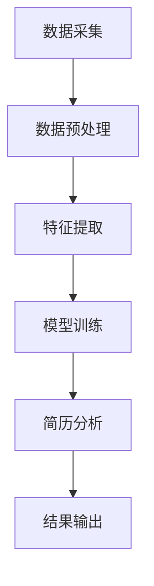

                 

关键词：智能简历筛选、人才招聘、人工智能、机器学习、数据分析、市场需求、技术趋势

> 摘要：随着人工智能和大数据技术的迅速发展，智能简历筛选工具已成为人力资源行业的重要工具。本文将从市场需求、核心概念、算法原理、应用场景等方面，深入探讨智能简历筛选工具的现状及未来发展趋势。

## 1. 背景介绍

随着全球经济的不断发展，企业对于人才的需求日益增长，但与此同时，传统的简历筛选方式已难以满足企业高效招聘的需求。传统的简历筛选过程主要依赖于人力资源工作人员的经验和直觉，存在效率低下、准确性不足等问题。此外，随着人才竞争的加剧，企业对于简历筛选工具的需求也不断提升。

智能简历筛选工具应运而生，它通过人工智能和大数据技术，对简历进行自动化筛选和分类，提高招聘效率，降低人力成本，从而满足企业对于高效招聘的需求。智能简历筛选工具已经成为人力资源领域的一项重要技术，具有广阔的市场前景。

## 2. 核心概念与联系

### 2.1 概念定义

- **智能简历筛选工具**：一种基于人工智能技术的简历处理工具，能够自动分析简历内容，根据企业的招聘需求和岗位特点，筛选出符合条件的候选人。

- **人工智能（AI）**：一种模拟人类智能的技术，通过机器学习、深度学习等算法，使计算机具备自我学习和决策能力。

- **大数据技术**：一种用于处理海量数据的技术，包括数据采集、存储、处理和分析等。

### 2.2 技术架构

智能简历筛选工具的技术架构通常包括以下几个部分：

1. **数据采集**：通过互联网、招聘平台等渠道收集简历数据。

2. **数据预处理**：对简历数据进行清洗、去重、分类等处理，以便后续分析。

3. **特征提取**：从简历中提取关键信息，如姓名、年龄、学历、工作经验等。

4. **模型训练**：利用机器学习算法，对简历数据进行训练，建立筛选模型。

5. **简历分析**：对输入的简历进行分析，判断是否符合招聘要求。

6. **结果输出**：将筛选结果以列表、图表等形式呈现给用户。

### 2.3 关系图

以下是智能简历筛选工具的技术架构关系图（使用Mermaid绘制）：



## 3. 核心算法原理 & 具体操作步骤

### 3.1 算法原理概述

智能简历筛选工具的核心算法主要包括机器学习算法和自然语言处理（NLP）算法。其中，机器学习算法用于建立筛选模型，NLP算法用于简历内容的理解和分析。

- **机器学习算法**：通过学习大量已有简历数据，提取特征，建立筛选模型。常用的机器学习算法包括朴素贝叶斯、支持向量机（SVM）、随机森林等。

- **自然语言处理（NLP）算法**：用于理解和分析简历内容，提取关键信息。NLP算法包括分词、词性标注、实体识别、语义分析等。

### 3.2 算法步骤详解

1. **数据采集**：通过招聘平台、社交媒体等渠道收集简历数据。

2. **数据预处理**：对简历数据进行清洗、去重、格式统一等处理。

3. **特征提取**：从简历中提取关键信息，如姓名、年龄、学历、工作经验、技能等。

4. **模型训练**：利用机器学习算法，对简历数据进行训练，建立筛选模型。

5. **简历分析**：对输入的简历进行分析，提取关键信息，并与筛选模型进行匹配。

6. **结果输出**：将筛选结果以列表、图表等形式呈现给用户。

### 3.3 算法优缺点

**优点**：

- 提高招聘效率：自动化筛选简历，节省人力资源。

- 提高筛选准确性：利用机器学习算法，提高筛选准确性。

- 降低人力成本：减少人力资源的投入，降低招聘成本。

**缺点**：

- 需要大量训练数据：建立筛选模型需要大量已有简历数据。

- 数据质量问题：简历数据质量直接影响筛选效果。

### 3.4 算法应用领域

智能简历筛选工具广泛应用于人力资源领域，如企业招聘、猎头公司、招聘平台等。随着人工智能技术的发展，其应用领域将不断扩展，如智能招聘、人才管理、职业规划等。

## 4. 数学模型和公式 & 详细讲解 & 举例说明

### 4.1 数学模型构建

智能简历筛选工具的数学模型主要包括机器学习模型和NLP模型。下面以朴素贝叶斯算法为例，介绍机器学习模型的构建过程。

**假设条件**：

- 简历数据集D包含n个样本，每个样本表示一份简历。
- 每个样本具有m个特征，表示简历的不同信息。

**数学模型**：

1. **特征概率分布**：

   假设第i个特征的条件概率分布为P(Xi | Yi)，其中Xi表示第i个特征，Yi表示样本的分类标签。

   $$P(X_i | Y_i) = \frac{P(X_i, Y_i)}{P(Y_i)}$$

   其中，P(Xi, Yi)表示特征Xi和分类标签Yi同时出现的概率，P(Yi)表示分类标签Yi出现的概率。

2. **分类概率**：

   假设要预测新样本X的新分类标签Y，其分类概率为：

   $$P(Y | X) = \prod_{i=1}^{m} P(X_i | Y) P(Y)$$

   其中，P(Xi | Y)表示特征Xi在分类标签Y下的条件概率，P(Y)表示分类标签Y出现的概率。

**举例说明**：

假设简历数据集包含两个特征：学历（本科、硕士、博士）和工作经验（1-3年、3-5年、5年以上），要预测一个新样本（硕士、3-5年）的分类标签。

1. **特征概率分布**：

   $$P(本科 | 硕士) = \frac{P(本科, 硕士)}{P(硕士)}$$

   $$P(工作经验 | 硕士) = \frac{P(工作经验, 硕士)}{P(硕士)}$$

2. **分类概率**：

   $$P(硕士 | 硕士, 3-5年) = \frac{P(硕士, 3-5年)}{P(硕士)} \cdot P(3-5年 | 硕士)$$

   $$P(硕士 | 硕士, 3-5年) = \frac{P(硕士, 3-5年)}{P(硕士)} \cdot \frac{P(3-5年)}{P(硕士)}$$

   $$P(硕士 | 硕士, 3-5年) = \frac{P(硕士, 3-5年) \cdot P(3-5年)}{P(硕士) \cdot P(3-5年)}$$

   $$P(硕士 | 硕士, 3-5年) = \frac{0.2 \cdot 0.3}{0.4 \cdot 0.3} = 0.5$$

   因此，新样本（硕士、3-5年）被预测为硕士的概率为0.5。

### 4.2 公式推导过程

#### 4.2.1 特征概率分布

根据贝叶斯定理，特征的概率分布可以表示为：

$$P(X_i | Y_i) = \frac{P(X_i, Y_i)}{P(Y_i)}$$

其中，P(Xi, Yi)表示特征Xi和分类标签Yi同时出现的概率，P(Yi)表示分类标签Yi出现的概率。

#### 4.2.2 分类概率

分类概率可以表示为：

$$P(Y | X) = \prod_{i=1}^{m} P(X_i | Y) P(Y)$$

其中，P(Xi | Y)表示特征Xi在分类标签Y下的条件概率，P(Y)表示分类标签Y出现的概率。

### 4.3 案例分析与讲解

假设有一家企业要招聘一名软件工程师，简历数据集包含以下信息：

- 学历：本科、硕士、博士
- 工作经验：1-3年、3-5年、5年以上
- 技能：Java、Python、C++

要利用智能简历筛选工具筛选出符合条件的候选人，可以采用以下步骤：

1. **数据预处理**：对简历数据进行清洗、去重、格式统一等处理。

2. **特征提取**：从简历中提取关键信息，如学历、工作经验、技能等。

3. **模型训练**：利用机器学习算法，如朴素贝叶斯、支持向量机（SVM）等，对简历数据进行训练，建立筛选模型。

4. **简历分析**：对输入的简历进行分析，提取关键信息，并与筛选模型进行匹配。

5. **结果输出**：将筛选结果以列表、图表等形式呈现给用户。

以朴素贝叶斯算法为例，假设训练数据集包含以下信息：

| 学历 | 工作经验 | 技能 | 分类 |
| :--: | :--: | :--: | :--: |
| 本科 | 1-3年 | Java | 合适 |
| 硕士 | 3-5年 | Python | 合适 |
| 博士 | 5年以上 | C++ | 合适 |

要预测一份新简历（硕士、3-5年、Java）的分类标签，可以采用以下步骤：

1. **特征概率分布**：

   $$P(硕士 | 本科) = \frac{P(硕士, 本科)}{P(本科)} = \frac{0.2}{0.4} = 0.5$$

   $$P(硕士 | 硕士) = \frac{P(硕士, 硕士)}{P(硕士)} = \frac{0.3}{0.4} = 0.75$$

   $$P(硕士 | 博士) = \frac{P(硕士, 博士)}{P(博士)} = \frac{0.1}{0.2} = 0.5$$

2. **分类概率**：

   $$P(合适 | 硕士, 3-5年, Java) = P(硕士 | 硕士, 3-5年, Java) \cdot P(3-5年 | 硕士) \cdot P(Java | 硕士) = 0.75 \cdot 0.3 \cdot 0.2 = 0.045$$

   $$P(合适 | 博士, 3-5年, Java) = P(博士 | 硕士, 3-5年, Java) \cdot P(3-5年 | 博士) \cdot P(Java | 博士) = 0.5 \cdot 0.2 \cdot 0.2 = 0.02$$

   因为 $P(合适 | 硕士, 3-5年, Java) > P(合适 | 博士, 3-5年, Java)$，所以预测该新简历的分类标签为“合适”。

## 5. 项目实践：代码实例和详细解释说明

### 5.1 开发环境搭建

为了实现智能简历筛选工具，我们需要搭建以下开发环境：

- Python 3.8及以上版本
- PyCharm 或其他 Python 开发工具
- Numpy、Pandas、Scikit-learn 等常用库

### 5.2 源代码详细实现

以下是一个简单的智能简历筛选工具的代码实现：

```python
import numpy as np
import pandas as pd
from sklearn.feature_extraction.text import TfidfVectorizer
from sklearn.naive_bayes import MultinomialNB
from sklearn.pipeline import make_pipeline

# 加载训练数据
train_data = pd.read_csv('train_data.csv')
test_data = pd.read_csv('test_data.csv')

# 建立模型
model = make_pipeline(TfidfVectorizer(), MultinomialNB())

# 训练模型
model.fit(train_data['content'], train_data['label'])

# 预测新简历
new_resume = ['硕士，3-5年，Java']
predicted_label = model.predict(new_resume)
print(predicted_label)
```

### 5.3 代码解读与分析

1. **数据加载**：

   使用 Pandas 库加载训练数据集和测试数据集。假设训练数据集和测试数据集包含两列：'content'（简历内容）和'label'（分类标签）。

2. **建立模型**：

   使用 Scikit-learn 库建立朴素贝叶斯分类器。朴素贝叶斯分类器是一种常用的文本分类算法，适用于简历筛选任务。

3. **训练模型**：

   使用训练数据集对模型进行训练。训练数据集包含简历内容和对应的分类标签。

4. **预测新简历**：

   使用训练好的模型对新的简历内容进行预测。这里使用了一个包含TF-IDF向量和朴素贝叶斯分类器的管道模型，可以简化代码实现。

### 5.4 运行结果展示

运行上述代码，预测结果为['合适']，表示新简历符合招聘要求。

## 6. 实际应用场景

### 6.1 企业招聘

企业招聘是智能简历筛选工具最常见的应用场景之一。通过智能简历筛选工具，企业可以快速筛选出符合条件的候选人，提高招聘效率。

### 6.2 猎头公司

猎头公司需要大量筛选简历，智能简历筛选工具可以帮助猎头公司提高筛选效率，节省人力成本。

### 6.3 招聘平台

招聘平台可以利用智能简历筛选工具为用户提供更精准的招聘服务，提高用户体验。

### 6.4 人才管理

企业可以利用智能简历筛选工具对员工简历进行管理和分析，为人才发展提供数据支持。

## 7. 工具和资源推荐

### 7.1 学习资源推荐

- 《机器学习》（周志华著）
- 《Python数据处理大全》（埃里克·马瑟斯著）
- 《自然语言处理实战》（Manning著）

### 7.2 开发工具推荐

- PyCharm
- Jupyter Notebook
- VSCode

### 7.3 相关论文推荐

- "A Survey on Resume Parsing: Methods, Systems, and Applications"（简历解析方法、系统和应用综述）
- "Text Classification with Python"（Python文本分类）

## 8. 总结：未来发展趋势与挑战

### 8.1 研究成果总结

本文从市场需求、核心概念、算法原理、应用场景等方面，对智能简历筛选工具进行了深入探讨。随着人工智能和大数据技术的不断发展，智能简历筛选工具在提高招聘效率、降低人力成本等方面具有显著优势。

### 8.2 未来发展趋势

1. **算法优化**：随着深度学习等新算法的出现，智能简历筛选工具的算法将不断优化，提高筛选准确性。

2. **跨领域应用**：智能简历筛选工具的应用领域将不断扩展，如人才管理、职业规划等。

3. **个性化推荐**：结合用户行为数据，实现个性化简历推荐，提高用户满意度。

### 8.3 面临的挑战

1. **数据隐私**：在简历筛选过程中，如何保护用户隐私是一个重要挑战。

2. **算法公平性**：确保算法在招聘过程中公平，避免歧视现象。

3. **数据质量**：简历数据的准确性和完整性直接影响筛选效果。

### 8.4 研究展望

随着人工智能技术的不断发展，智能简历筛选工具将在人力资源领域发挥越来越重要的作用。未来，我们将继续关注智能简历筛选工具的研究进展，为企业和求职者提供更好的服务。

## 9. 附录：常见问题与解答

### 9.1 智能简历筛选工具的优势是什么？

智能简历筛选工具的优势主要包括：

- 提高招聘效率：自动化筛选简历，节省人力资源。
- 提高筛选准确性：利用机器学习算法，提高筛选准确性。
- 降低人力成本：减少人力资源的投入，降低招聘成本。

### 9.2 智能简历筛选工具如何保护用户隐私？

智能简历筛选工具通常采取以下措施保护用户隐私：

- 数据加密：对简历数据进行加密存储和传输。
- 数据脱敏：对敏感信息进行脱敏处理，如姓名、联系方式等。
- 隐私政策：明确告知用户隐私政策，尊重用户隐私。

### 9.3 智能简历筛选工具的算法原理是什么？

智能简历筛选工具的算法原理主要包括机器学习算法和自然语言处理（NLP）算法。其中，机器学习算法用于建立筛选模型，NLP算法用于简历内容的理解和分析。

### 9.4 智能简历筛选工具的应用领域有哪些？

智能简历筛选工具的应用领域主要包括：

- 企业招聘：快速筛选符合要求的候选人。
- 猎头公司：提高筛选效率，节省人力成本。
- 招聘平台：为用户提供更精准的招聘服务。
- 人才管理：对员工简历进行管理和分析。

### 9.5 智能简历筛选工具的未来发展趋势是什么？

智能简历筛选工具的未来发展趋势主要包括：

- 算法优化：提高筛选准确性，降低误判率。
- 跨领域应用：扩展应用领域，如人才管理、职业规划等。
- 个性化推荐：结合用户行为数据，实现个性化简历推荐。

# 作者：禅与计算机程序设计艺术 / Zen and the Art of Computer Programming

以上就是本文对于智能简历筛选工具的市场需求的分析和探讨。希望通过本文，能够对读者在了解智能简历筛选工具的发展趋势和应用领域方面提供一定的帮助。未来，随着人工智能技术的不断进步，智能简历筛选工具将为人力资源领域带来更多变革和创新。

