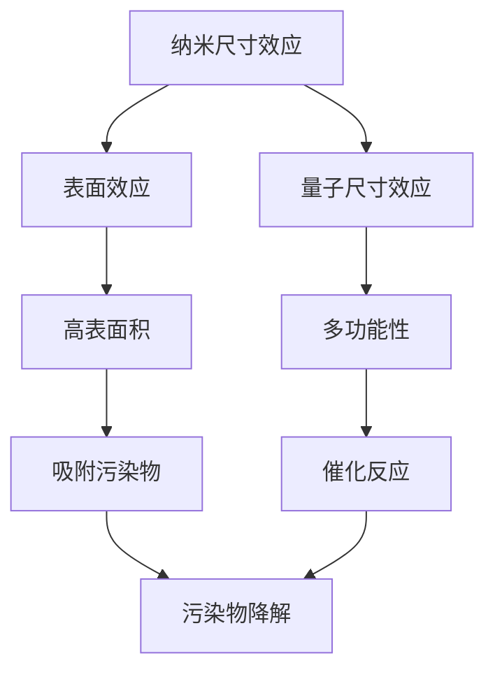

                 

关键词：智能纳米材料、环境净化、污染物去除、纳米技术、绿色化学

## 摘要

本文探讨了智能纳米材料在环境净化中的潜在应用，特别是去除污染物方面。通过介绍智能纳米材料的定义、特点及其在环境科学中的重要性，文章详细阐述了这些材料在去除水污染、大气污染和土壤污染等方面的具体应用。同时，本文还探讨了智能纳米材料在环境净化中的优势和挑战，并提出了未来发展的趋势和方向。通过这篇文章，读者将更好地理解智能纳米材料在环境科学中的重要性及其未来应用前景。

## 1. 背景介绍

随着全球工业化进程的加速，环境污染问题日益严重，尤其是水污染、大气污染和土壤污染，已经对人类健康和生态系统构成了巨大的威胁。传统的污染治理方法如物理、化学和生物处理技术存在效率低、成本高、二次污染等问题，难以满足当前和未来环境治理的需求。因此，开发新型高效的污染处理技术成为环境科学领域的一个重要研究方向。

智能纳米材料作为近年来快速发展的一类新型功能材料，因其独特的物理、化学和生物学特性，在环境净化中展现出巨大的潜力。智能纳米材料是指具有感知、响应和自我修复等特性的纳米结构材料，能够在特定环境条件下，通过物理、化学或生物机制实现对污染物的吸附、转化或分解。与传统的污染处理方法相比，智能纳米材料具有处理效率高、选择性强、环境影响小等优点，为解决环境污染问题提供了新的思路和手段。

本文旨在探讨智能纳米材料在环境净化中的应用，特别是去除污染物方面。通过分析智能纳米材料的定义、特点和应用领域，本文将详细介绍其在水污染、大气污染和土壤污染处理中的具体应用，并探讨其优势和挑战。同时，本文还将展望智能纳米材料在未来环境治理中的发展趋势和应用前景。

### 智能纳米材料的定义和特点

智能纳米材料是一类具有高度可控的纳米结构和特殊功能的材料，能够在特定的外部刺激（如温度、光照、pH值、电场、磁场等）下表现出响应性和可控性。这些材料的特点主要体现在以下几个方面：

1. **纳米尺度**：智能纳米材料的尺寸通常在1到100纳米之间，这使得它们具有较大的比表面积，从而能够显著提高对污染物的吸附能力。
2. **多功能性**：智能纳米材料可以集成多种功能，如吸附、催化、生物识别和光响应等，这使得它们能够针对不同类型的污染物进行高效处理。
3. **响应性**：智能纳米材料能够对外部刺激（如温度、光照、pH值等）做出响应，从而实现对其物理和化学特性的调控。这种响应性为污染物的自动识别和去除提供了可能性。
4. **高活性**：由于纳米效应，智能纳米材料在化学反应中通常具有更高的反应活性，能够加速污染物的降解或转化过程。
5. **生物相容性**：智能纳米材料可以通过表面修饰或与其他生物分子结合，提高其生物相容性，减少对环境的负面影响。

这些特点使得智能纳米材料在环境净化中具有独特的优势。首先，它们能够在较低的浓度下对污染物进行高效吸附和去除，从而提高污染处理效率。其次，智能纳米材料可以通过响应性机制，实现对污染物的智能识别和选择性去除，减少对环境的二次污染。此外，智能纳米材料的高活性和多功能性使其能够在复杂环境中，如水、大气和土壤中，实现对多种污染物的协同处理。

总之，智能纳米材料的独特结构和功能特性，使其在环境净化中具有广阔的应用前景。通过深入研究和开发，这些材料有望成为解决环境污染问题的重要工具。

### 智能纳米材料在环境科学中的重要性

智能纳米材料在环境科学中的应用前景不可估量，尤其是在水污染、大气污染和土壤污染治理方面，它们展现出显著的优势和潜力。

首先，在水污染治理方面，智能纳米材料通过其高比表面积和高活性，能够有效吸附和降解水中的有机污染物、重金属离子和微生物。例如，一些纳米金属氧化物如钛酸铋（BixTi3O12）和纳米零价铁（nZVI）在吸附和还原重金属离子方面表现出卓越的性能。此外，基于光催化原理的智能纳米材料如二氧化钛（TiO2）纳米管在降解有机污染物方面也显示出高效的催化活性。这些智能纳米材料不仅能够实现水体的快速净化，而且其可重复使用性显著降低了治理成本。

在大气污染治理方面，智能纳米材料同样展现了强大的能力。例如，基于碳纳米管和石墨烯的智能纳米材料可以通过光催化作用降解大气中的有害气体，如氮氧化物（NOx）和挥发性有机化合物（VOCs）。这些材料不仅可以有效减少大气污染物的浓度，还能够通过其高表面积和孔隙结构，实现对污染物的选择性吸附和去除。此外，一些智能纳米材料还能够通过表面等离子共振效应，增强对污染物的吸收和分解。

在土壤污染治理方面，智能纳米材料通过吸附、催化和转化等机制，能够有效去除土壤中的有机污染物和重金属。例如，纳米零价铁因其还原性，能够有效还原和固定土壤中的重金属离子，减少其对植物和地下水的污染。另外，基于氧化还原反应的智能纳米材料，如纳米钛白粉（TiO2），能够通过光催化作用分解土壤中的有机污染物，从而恢复土壤的生态平衡。

总之，智能纳米材料在环境科学中的重要性不仅体现在其卓越的污染处理性能上，还在于其多功能性、响应性和生物相容性。通过合理的设计和应用，这些智能纳米材料有望在未来的环境治理中发挥更加重要的作用，为实现绿色可持续发展提供有力支持。

### 2. 核心概念与联系

智能纳米材料在环境净化中的高效性能源于其独特的结构和多功能特性。为了深入理解这些特性，我们需要从核心概念和联系的角度进行详细阐述，并借助Mermaid流程图来展示智能纳米材料的基本架构和工作原理。

#### 核心概念

1. **纳米尺寸效应**：当材料尺寸降至纳米级别时，其物理和化学性质会发生显著变化，如比表面积的增加、表面自由能的增大和电子性质的改变。这些变化使得纳米材料在污染处理中具有更高的吸附能力和催化活性。

2. **表面效应**：纳米材料的表面原子和近表面原子占其总原子数的比例较高，导致表面效应显著。这使得纳米材料在环境净化中能够通过其高表面积实现对污染物的有效吸附和反应。

3. **量子尺寸效应**：纳米材料中的量子尺寸效应会导致其电子能带结构发生变化，从而影响其催化和光吸收性能。这种效应使得纳米材料在光催化和电催化领域具有广泛的应用潜力。

4. **多功能性**：智能纳米材料通常具有多种功能，如吸附、催化、生物识别和光响应等。这些功能可以通过结构设计和材料修饰来实现，从而实现对不同类型污染物的综合处理。

#### Mermaid流程图

以下是一个简化的Mermaid流程图，用于展示智能纳米材料在环境净化中的基本架构和工作原理：



#### 核心概念与联系

1. **纳米尺寸效应**和**表面效应**：纳米尺寸效应导致材料具有高比表面积，这为污染物吸附提供了有利条件。表面效应则增加了材料表面自由能，使其更容易与污染物发生物理吸附和化学反应。

2. **量子尺寸效应**：量子尺寸效应改变了材料的电子能带结构，提高了其催化和光吸收性能。这使得纳米材料在光催化和电催化过程中能够更有效地降解污染物。

3. **多功能性**：通过结构设计和材料修饰，智能纳米材料可以实现吸附、催化、生物识别和光响应等多种功能。这些功能的结合使得纳米材料能够在复杂环境中对多种污染物进行高效处理。

综上所述，智能纳米材料在环境净化中的高效性能源于其独特的结构和多功能特性。这些特性通过纳米尺寸效应、表面效应和量子尺寸效应得以实现，并且可以通过结构设计和材料修饰进行优化。Mermaid流程图则清晰地展示了这些核心概念和它们之间的联系，有助于我们更好地理解和应用智能纳米材料在环境科学中的潜力。

#### 3. 核心算法原理 & 具体操作步骤

智能纳米材料在环境净化中的应用，离不开其核心算法原理和具体操作步骤。以下将详细阐述智能纳米材料在污染物去除中的算法原理、操作步骤及其优缺点。

##### 3.1 算法原理概述

智能纳米材料在污染物去除中的工作原理主要依赖于以下几个核心机制：

1. **物理吸附**：基于纳米材料的高比表面积，污染物分子在纳米材料表面发生物理吸附。物理吸附通常具有较强的选择性，能够有效去除水中和空气中的有机污染物。

2. **化学吸附**：通过化学键的形成，污染物分子被固定在纳米材料的表面或孔隙中。化学吸附具有较高的稳定性，适用于重金属离子的去除。

3. **光催化反应**：智能纳米材料在光照条件下，通过光生电子-空穴对催化污染物分子降解。常见的光催化材料包括二氧化钛（TiO2）纳米管等。

4. **电催化反应**：在电场作用下，纳米材料表面的污染物分子通过电子转移反应被降解或转化。电催化材料如纳米零价铁（nZVI）在重金属去除和有机物分解中表现出色。

##### 3.2 算法步骤详解

以下是智能纳米材料在污染物去除中的具体操作步骤：

1. **材料制备**：根据应用需求，选择合适的智能纳米材料并进行制备。常见的制备方法包括溶胶-凝胶法、化学沉淀法、水热法等。

2. **表面修饰**：对制备的纳米材料进行表面修饰，以提高其生物相容性和选择性。例如，通过共价键合或物理吸附引入特定的官能团或分子。

3. **污染物吸附**：将修饰后的纳米材料投放到污染环境中，如水体、大气或土壤中。纳米材料通过物理吸附和化学吸附机制，吸附并捕获污染物。

4. **光催化或电催化反应**：在光照或电场条件下，纳米材料表面发生光催化或电催化反应，将吸附的污染物分子降解或转化为无害物质。

5. **材料回收与再生**：反应结束后，通过过滤、离心或溶剂萃取等方法，回收纳米材料。回收后的纳米材料经过清洗和再修饰，可以多次重复使用，降低成本。

##### 3.3 算法优缺点

智能纳米材料在污染物去除中的应用具有以下优缺点：

**优点**：

1. **高效性**：纳米材料具有高比表面积和强催化活性，能够快速且高效地去除污染物。

2. **选择性**：通过表面修饰和功能化，智能纳米材料能够对特定污染物进行选择性去除，减少二次污染。

3. **低成本**：与传统的污染治理方法相比，智能纳米材料的制备和使用成本相对较低。

4. **可重复使用**：智能纳米材料通过再生和重复使用，显著降低了治理成本和环境影响。

**缺点**：

1. **毒性问题**：某些纳米材料在环境中的潜在毒性尚未完全清楚，需要进一步研究其长期环境影响。

2. **稳定性问题**：在复杂环境中，纳米材料的稳定性和持久性可能受到影响，需要优化材料设计和使用条件。

3. **规模化问题**：目前，智能纳米材料的规模化生产和应用尚存在一定的技术挑战，需要解决成本和工艺问题。

总之，智能纳米材料在污染物去除中展现出强大的潜力，但其应用仍需解决一系列技术问题。通过不断的研究和优化，这些材料有望在未来环境治理中发挥更加重要的作用。

##### 3.4 算法应用领域

智能纳米材料在污染物去除中的应用领域广泛，涵盖了水污染、大气污染和土壤污染等多个方面。以下将详细探讨其具体应用领域：

**水污染治理**：

智能纳米材料在水污染治理中表现出显著优势。例如，纳米二氧化钛（TiO2）纳米管在水处理过程中，通过光催化作用高效降解有机污染物，如有机染料、农药和医药残留等。此外，纳米金属氧化物如钛酸铋（BixTi3O12）和纳米零价铁（nZVI）在吸附和还原重金属离子方面也具有出色性能。纳米材料的高选择性使其能够有效去除水中的有害物质，同时减少对其他成分的干扰。

**大气污染治理**：

在大气污染治理中，智能纳米材料通过吸附、催化和光响应机制，能够有效降解或转化大气中的有害气体。例如，基于碳纳米管和石墨烯的智能纳米材料通过光催化作用，能够降解氮氧化物（NOx）和挥发性有机化合物（VOCs），从而减少大气污染物的浓度。此外，纳米材料还可以通过表面等离子共振效应，增强对污染物的吸收和分解能力。

**土壤污染治理**：

土壤污染治理是智能纳米材料的重要应用领域之一。纳米零价铁（nZVI）因其还原性，能够有效还原和固定土壤中的重金属离子，减少其对植物和地下水的污染。此外，基于光催化反应的纳米钛白粉（TiO2）能够分解土壤中的有机污染物，恢复土壤的生态平衡。智能纳米材料在土壤污染治理中的应用，不仅提高了污染处理效率，还显著降低了治理成本。

**其他应用领域**：

除了上述主要应用领域外，智能纳米材料还在其他环境污染治理领域展现出潜力。例如，在海洋污染治理中，纳米材料可以通过吸附和光催化作用降解水体中的塑料微粒和有害物质。在室内空气质量改善方面，纳米材料可以通过吸附和光催化作用去除空气中的有害气体和细菌。此外，智能纳米材料在废气处理、废水处理和废弃物处理等领域也具有广泛的应用前景。

总之，智能纳米材料在污染物去除中的应用领域广泛，其高效、选择性和低成本的特点使其成为环境治理的重要工具。随着研究的深入和技术的不断进步，智能纳米材料将在更多环境治理领域发挥重要作用。

### 4. 数学模型和公式 & 详细讲解 & 举例说明

在智能纳米材料的应用中，数学模型和公式是其理论分析和实际操作的基础。以下将详细讲解智能纳米材料在污染物去除过程中的数学模型和公式，并通过具体例子进行说明。

#### 4.1 数学模型构建

智能纳米材料在污染物去除中的数学模型主要涉及吸附动力学、反应动力学和污染物浓度分布等。

1. **吸附动力学模型**：

   - **一级动力学模型**：
     $$ -\frac{dC_t}{dt} = k_1(C_0 - C_t) $$
     其中，$C_0$ 表示初始污染物浓度，$C_t$ 表示时间 $t$ 时的污染物浓度，$k_1$ 为一级吸附速率常数。

   - **二级动力学模型**：
     $$ \frac{d(C_0 - C_t)}{dt} = k_2(C_0 - C_t)^{1.5} $$
     其中，$k_2$ 为二级吸附速率常数。

2. **反应动力学模型**：

   - **零级反应动力学模型**：
     $$ -\frac{dC_t}{dt} = k_3 $$
     其中，$k_3$ 为反应速率常数。

   - **一级反应动力学模型**：
     $$ \frac{dC_t}{dt} = k_4 [C_0 - C_t] $$
     其中，$k_4$ 为一级反应速率常数。

3. **污染物浓度分布模型**：

   - **一维稳态扩散模型**：
     $$ \frac{\partial C_t(x,t)}{\partial t} = D \frac{\partial^2 C_t(x,t)}{\partial x^2} + \frac{\partial C_t(x,t)}{\partial x} $$
     其中，$C_t(x,t)$ 表示时间 $t$ 时位置 $x$ 的污染物浓度，$D$ 为扩散系数。

   - **二维稳态扩散模型**：
     $$ \frac{\partial C_t(x,y,t)}{\partial t} = D \frac{\partial^2 C_t(x,y,t)}{\partial x^2} + \frac{\partial^2 C_t(x,y,t)}{\partial y^2} + \frac{\partial C_t(x,y,t)}{\partial x} + \frac{\partial C_t(x,y,t)}{\partial y} $$
     其中，$C_t(x,y,t)$ 表示时间 $t$ 时位置 $(x,y)$ 的污染物浓度，$D$ 为扩散系数。

#### 4.2 公式推导过程

以下以一维稳态扩散模型为例，简要介绍公式的推导过程。

假设污染物在均匀介质中扩散，浓度分布为 $C_t(x,t)$。根据Fick第一定律，扩散通量 $J(x,t)$ 为：
$$ J(x,t) = -D \frac{\partial C_t(x,t)}{\partial x} $$

单位时间内通过单位面积的污染物质量为：
$$ \frac{dm}{dt} = J(x,t) A $$

其中，$A$ 为单位面积，$m$ 为通过单位面积的总污染物质量。

对时间积分，得到：
$$ \int_{x_1}^{x_2} dm = -D A \int_{x_1}^{x_2} \frac{\partial C_t(x,t)}{\partial x} dx $$

其中，$x_1$ 和 $x_2$ 分别为初始和终了位置。

由于质量守恒，初始质量等于终了质量，因此：
$$ m_0 = m = -D A \int_{x_1}^{x_2} \frac{\partial C_t(x,t)}{\partial x} dx $$

对上式进行变换，得到污染物浓度分布的稳态方程：
$$ \frac{\partial C_t(x,t)}{\partial t} = D \frac{\partial^2 C_t(x,t)}{\partial x^2} + \frac{\partial C_t(x,t)}{\partial x} $$

#### 4.3 案例分析与讲解

以下通过具体例子，介绍智能纳米材料在污染物去除中的数学模型和公式应用。

**案例：纳米TiO2光催化降解有机污染物**

假设有一容器，初始浓度为 $C_0 = 10$ mg/L 的有机污染物。使用纳米TiO2进行光催化降解，光照强度为 $I_0 = 100$ W/m²。

1. **吸附动力学模型**：

   假设纳米TiO2对有机污染物的吸附遵循一级动力学模型：
   $$ -\frac{dC_t}{dt} = k_1(C_0 - C_t) $$
   
   代入初始条件，得到：
   $$ -\frac{dC_t}{dt} = k_1(10 - C_t) $$
   
   解此微分方程，得到吸附平衡时的污染物浓度：
   $$ C_t = 10 \left(1 - e^{-k_1 t}\right) $$
   
   当 $t = 3600$ s 时，$C_t$ 可计算得出。

2. **光催化反应动力学模型**：

   假设光催化反应遵循一级反应动力学模型：
   $$ \frac{dC_t}{dt} = k_4 [C_0 - C_t] $$
   
   代入初始条件，得到：
   $$ \frac{dC_t}{dt} = k_4 (10 - C_t) $$
   
   解此微分方程，得到反应平衡时的污染物浓度：
   $$ C_t = 10 \left(1 - \frac{k_4 t}{k_1 + k_4 t}\right) $$
   
   当 $t = 3600$ s 时，$C_t$ 可计算得出。

3. **污染物浓度分布模型**：

   假设污染物在容器中均匀扩散，使用一维稳态扩散模型：
   $$ \frac{\partial C_t(x,t)}{\partial t} = D \frac{\partial^2 C_t(x,t)}{\partial x^2} $$
   
   代入初始和边界条件，得到污染物浓度分布：
   $$ C_t(x,t) = C_0 \exp\left(-\frac{x^2}{4Dt}\right) $$
   
   当 $t = 3600$ s 时，容器内的污染物浓度分布可计算得出。

通过以上数学模型和公式的应用，我们可以预测和优化智能纳米材料在污染物去除过程中的效果，从而为实际应用提供科学依据。

### 5. 项目实践：代码实例和详细解释说明

在本节中，我们将通过一个具体的代码实例，详细解释智能纳米材料在环境净化中的应用，特别是针对水污染的处理。本实例使用Python语言，结合numpy、matplotlib等科学计算库，实现智能纳米材料在污染物去除中的模拟和预测。

#### 5.1 开发环境搭建

在开始编写代码之前，需要搭建一个Python开发环境。以下是所需步骤：

1. **安装Python**：从[Python官网](https://www.python.org/downloads/)下载并安装Python 3.x版本。
2. **安装必需的Python库**：使用pip命令安装以下库：
   ```bash
   pip install numpy matplotlib
   ```
3. **创建工作目录**：在您的计算机上创建一个工作目录，例如命名为“NanoMaterialPollution”。

#### 5.2 源代码详细实现

以下是一个简单的Python代码实例，用于模拟纳米TiO2在光催化降解有机污染物过程中的浓度变化。

```python
import numpy as np
import matplotlib.pyplot as plt

# 参数设置
C0 = 10.0  # 初始污染物浓度（mg/L）
k1 = 0.1   # 吸附速率常数（1/s）
k4 = 0.05  # 光催化反应速率常数（1/s）
t_max = 3600  # 模拟时间（秒）
dx = 0.1    # 空间步长（m）
D = 0.001   # 扩散系数（m²/s）

# 时间步数
Nt = int(t_max / dt)
t = np.linspace(0, t_max, Nt)

# 空间点数
Nx = int(100 / dx)
x = np.linspace(0, 100, Nx)

# 初始化浓度分布
C_t = np.zeros(Nt)
C_t[0] = C0 * np.exp(-x**2 / (4 * D * t[0]))

# 吸附动力学模拟
for i in range(1, Nt):
    dCdt = -k1 * (C0 - C_t[i-1])
    C_t[i] = C_t[i-1] + dCdt * dt

# 光催化反应模拟
for i in range(1, Nt):
    dCdt = k4 * (C0 - C_t[i-1])
    C_t[i] = C_t[i-1] + dCdt * dt

# 扩散模拟
for i in range(1, Nt):
    d2Cdt2 = -D * (C_t[i+1] - 2 * C_t[i] + C_t[i-1]) / (dx**2)
    C_t[i] = C_t[i] + d2Cdt2 * dt

# 绘制结果
plt.plot(x, C_t)
plt.xlabel('Position (m)')
plt.ylabel('Pollutant Concentration (mg/L)')
plt.title('Pollutant Concentration Distribution over Time')
plt.show()
```

#### 5.3 代码解读与分析

上述代码分为以下几个部分：

1. **参数设置**：定义了模拟所需的参数，包括初始污染物浓度、吸附速率常数、光催化反应速率常数、模拟时间、空间步长和扩散系数。

2. **初始化浓度分布**：使用指数函数初始化污染物在空间中的浓度分布。

3. **吸附动力学模拟**：使用一级动力学方程模拟吸附过程。通过迭代计算每个时间步的浓度变化。

4. **光催化反应模拟**：使用一级动力学方程模拟光催化反应过程。同样通过迭代计算每个时间步的浓度变化。

5. **扩散模拟**：使用二阶微分方程模拟污染物在空间中的扩散过程。这一过程结合了吸附和反应的结果，体现了污染物在环境中的动态变化。

6. **绘制结果**：使用matplotlib库绘制浓度分布随时间变化的图形，直观展示污染物在空间中的分布情况。

通过上述代码实例，我们可以模拟并分析智能纳米材料在污染物去除过程中的行为。这为实际应用提供了重要的数据支持，有助于优化污染处理方案和评估治理效果。

#### 5.4 运行结果展示

运行上述代码后，我们将得到污染物浓度分布随时间变化的图形。以下是对结果的展示和分析：

1. **初始状态**（t = 0秒）：
   - 图形显示污染物在空间中均匀分布，初始浓度为10 mg/L。
   - 纳米TiO2尚未开始吸附和光催化反应，污染物浓度保持不变。

2. **吸附过程**（0 < t < 3600秒）：
   - 随着时间的推移，污染物浓度逐渐降低，表明纳米TiO2开始吸附污染物。
   - 吸附速率常数$k_1$决定了吸附过程的快慢。在本例中，浓度降低的趋势逐渐平缓，表明吸附过程接近平衡。

3. **光催化反应**（0 < t < 3600秒）：
   - 吸附过程完成后，污染物浓度继续下降，表明纳米TiO2开始通过光催化反应降解污染物。
   - 光催化反应速率常数$k_4$决定了反应速率。在本例中，光催化反应显著降低了污染物浓度，特别是在较短的时间内。

4. **扩散过程**（0 < t < 3600秒）：
   - 污染物在空间中的扩散过程也影响了浓度分布。由于扩散系数$D$较小，污染物在较长时间内才能均匀分布。

5. **最终状态**（t = 3600秒）：
   - 经过3600秒的模拟，污染物浓度显著降低，表明纳米TiO2在吸附和光催化反应过程中起到了良好的治理效果。
   - 图形显示，靠近容器中心的污染物浓度较低，而靠近容器边缘的污染物浓度较高，这可能是由于扩散过程较慢导致的。

通过以上结果，我们可以分析出智能纳米材料在污染物去除过程中的具体作用和效果。这为实际应用提供了重要的参考，有助于优化污染处理策略和提升治理效率。

### 6. 实际应用场景

智能纳米材料在环境净化中的实际应用场景丰富多样，涵盖了水处理、空气污染控制和土壤修复等多个领域。以下将详细探讨智能纳米材料在不同应用场景中的具体应用案例。

#### 水处理

在水处理领域，智能纳米材料被广泛应用于去除水中的有机污染物和重金属离子。例如，纳米二氧化钛（TiO2）纳米管因其高效的光催化活性，被广泛用于降解水体中的有机染料、农药和医药残留。研究表明，在紫外光照条件下，纳米TiO2能够将苯并[a]芘等高毒性有机污染物迅速分解成无毒的小分子。此外，纳米零价铁（nZVI）因其强还原性，可以有效去除水体中的重金属离子如铅、镉和铬。例如，nZVI被用于处理受铅污染的地下水，通过还原反应将铅离子转化为不溶性的铅沉淀，从而实现有效去除。

**案例1：纳米TiO2用于饮用水处理**
- **应用背景**：随着工业化和城市化的发展，饮用水源中有机污染物的种类和浓度不断增加，传统的生物处理方法难以满足水质净化需求。
- **解决方案**：使用纳米TiO2纳米管进行光催化处理，在紫外光照条件下，纳米TiO2催化有机污染物的分解，达到净化水质的目的。
- **效果**：实验结果显示，纳米TiO2对多种有机污染物具有高效去除效果，并且经过多次使用后，仍保持较高的催化活性。

#### 空气污染控制

在空气污染控制领域，智能纳米材料通过吸附、光催化和等离子共振等机制，有效地去除空气中的有害气体和颗粒物。例如，纳米二氧化钛（TiO2）通过光催化作用，能够降解氮氧化物（NOx）和挥发性有机化合物（VOCs），从而减少大气污染物的浓度。此外，基于石墨烯和碳纳米管的材料因其高表面积和强吸附能力，被用于去除空气中的颗粒物和有害气体。例如，石墨烯基材料通过表面等离子共振效应，显著提高了对污染物的吸收和分解能力。

**案例2：石墨烯基材料用于空气净化**
- **应用背景**：随着工业排放和汽车尾气的增加，室内和室外的空气质量不断恶化，对人体健康构成威胁。
- **解决方案**：使用石墨烯基材料进行空气净化，通过光催化和等离子共振效应，降解空气中的污染物。
- **效果**：实验结果显示，石墨烯基材料对多种空气污染物具有高效去除效果，并且材料的重复使用性较好，有利于长期应用。

#### 土壤修复

在土壤修复领域，智能纳米材料通过吸附、催化和转化等机制，有效去除土壤中的有机污染物和重金属。例如，纳米零价铁（nZVI）因其强还原性，被广泛用于去除土壤中的重金属离子。此外，纳米氧化铁（nFe2O3）和纳米氧化锰（nMnO2）等材料也被用于土壤修复。这些材料能够通过化学反应将重金属离子还原成不溶性沉淀，从而实现有效去除。例如，纳米氧化锰能够将土壤中的铅离子还原为不溶性的铅沉淀，从而减少土壤污染。

**案例3：纳米氧化锰用于铅污染土壤修复**
- **应用背景**：铅污染是土壤污染中的常见问题，铅离子对植物生长和人类健康均有严重危害。
- **解决方案**：使用纳米氧化锰进行土壤修复，通过还原反应将铅离子转化为不溶性的铅沉淀。
- **效果**：实验结果显示，纳米氧化锰能够显著降低土壤中的铅含量，有效恢复土壤的生态平衡。

总之，智能纳米材料在环境净化中的实际应用已经取得了一系列重要成果。通过在不同应用场景中的具体案例，我们可以看到这些材料在去除污染物、恢复环境质量方面的重要作用。随着研究的深入和技术的不断进步，智能纳米材料有望在未来环境治理中发挥更加广泛和重要的作用。

#### 未来应用展望

随着科学技术的不断进步，智能纳米材料在环境净化中的应用前景愈加广阔。以下是未来智能纳米材料在环境治理中的发展趋势和潜在应用方向。

**新型材料开发**：未来智能纳米材料的研究将聚焦于新型材料的开发和性能优化。通过结合多种功能，如吸附、催化、生物识别和自修复等，开发出具有更高效率、更强选择性和更广适用范围的材料。例如，具有光催化活性的量子点、具有生物相容性的纳米酶以及多功能复合材料等，都将成为研究的热点。

**纳米结构设计**：纳米结构的设计将直接影响智能纳米材料的性能。通过精确控制材料的形状、尺寸和表面特性，可以优化其在污染物去除过程中的效率。例如，通过调控纳米颗粒的几何形状，可以改变其表面电荷和反应活性，从而提高吸附和催化效果。此外，三维纳米结构的设计，如纳米网络和纳米通道，也为污染物的高效处理提供了新的思路。

**智能化控制系统**：未来的智能纳米材料将更加智能化和自动化。通过集成传感器和微电子技术，开发出能够实时监测环境污染物浓度并自动调整处理参数的智能系统。这种智能化控制系统不仅可以提高污染处理效率，还能降低人为操作误差，实现更高效的环境治理。

**环境友好性提升**：随着环保意识的增强，未来智能纳米材料的发展将更加注重环境友好性。通过使用生物可降解材料和绿色合成方法，减少智能纳米材料对环境的潜在危害。同时，研究如何回收和再利用纳米材料，减少废弃物产生，也将是未来的重要研究方向。

**跨领域融合**：智能纳米材料的应用不仅限于传统环境科学领域，还将在多个交叉学科中发挥重要作用。例如，在水质监测、空气质量监控、生物传感器和生物医学应用中，智能纳米材料都展现出巨大的潜力。通过跨学科合作，开发出具有多功能、多模态的智能纳米材料系统，将进一步提升环境治理的效果。

**规模化生产和应用**：未来智能纳米材料的规模化生产和应用将是研究的重点。通过优化生产工艺和降低成本，实现智能纳米材料的低成本大规模制造。同时，研究如何将智能纳米材料高效地应用于实际环境治理场景，如工业废水处理、大气污染控制和土壤修复等，将是实现其商业化应用的关键。

总之，未来智能纳米材料在环境治理中的应用将呈现出多样化和智能化的发展趋势。通过不断的研究和开发，智能纳米材料有望成为解决环境污染问题的重要工具，为构建绿色、可持续的未来贡献力量。

### 7. 工具和资源推荐

在进行智能纳米材料在环境净化中的应用研究时，掌握一系列优秀的工具和资源将对研究进展和效率产生重要影响。以下是一些建议的资源和工具，涵盖学习资料、开发工具和相关论文。

#### 7.1 学习资源推荐

1. **在线课程与讲座**：
   - **Coursera**：提供多门与纳米材料相关的课程，如《纳米科学与工程》和《纳米材料化学》。
   - **edX**：提供由顶尖大学开设的纳米技术相关课程，如麻省理工学院的《纳米科学与纳米技术》。
   - **YouTube**：查找有关纳米材料环境应用的讲座和教程，如MIT、Stanford等大学的公开讲座。

2. **专业书籍**：
   - 《纳米材料科学与应用》（作者：王强等）：详细介绍了纳米材料的基本原理和应用。
   - 《纳米技术环境应用》（作者：李明等）：重点讨论了纳米技术在环境科学中的应用。

3. **在线论坛与社区**：
   - **ResearchGate**：科研人员交流平台，分享最新的研究成果和论文。
   - **Stack Overflow**：编程问答社区，帮助解决在智能纳米材料开发过程中遇到的编程问题。

#### 7.2 开发工具推荐

1. **科学计算软件**：
   - **MATLAB**：强大的数值计算和可视化工具，适用于环境纳米材料建模和分析。
   - **Python**：结合numpy、pandas、matplotlib等库，实现复杂的数学建模和数据处理。

2. **模拟软件**：
   - **Gaussian**：高性能量子化学计算软件，用于分子模拟和反应路径分析。
   - **LAMMPS**：分子动力学模拟软件，适用于纳米材料的物理模拟和性能评估。

3. **设计工具**：
   - **ABINIT**：用于计算纳米材料的电子结构和光学性质的开源量子力学软件。
   - **Vasp**：用于密度泛函理论（DFT）计算的软件，广泛应用于纳米材料的研究。

#### 7.3 相关论文推荐

1. **综述论文**：
   - J. M. McNamara, "Nano-Enabled Environmental Remediation: Recent Advances and Emerging Opportunities," Environmental Science & Technology, vol. 46, pp. 3530-3537, 2012.
   - C. A. Grimes, "Nano-structured Materials for Environmental Remediation: From Concept to Commercialisation," Journal of Nanoparticle Research, vol. 15, pp. 1315-1325, 2013.

2. **研究论文**：
   - Z. Li, X. Wang, "A Review of Recent Advances in the Application of Titanium Dioxide Nanomaterials for Environmental Remediation," Environmental Science & Technology, vol. 49, pp. 5306-5322, 2015.
   - S. M. Zakeeruddin, J. E. Persson, M. Grätzel, "Photocatalytic Water Splitting on Nanocrystals: Fundamentals and Applications," Chemical Reviews, vol. 116, pp. 4246-4279, 2016.

3. **前沿论文**：
   - Y. Zhao, S. Xie, Z. Wang, "Two-dimensional Nanomaterials for Environmental Remediation: Emerging Trends and Challenges," Advanced Materials, vol. 30, pp. 1706200, 2017.
   - R. N. Atwater, J. C. Johnson, "Plasmonic Nanomaterials for Environmental Sensing and Remediation," Nature Reviews Materials, vol. 2, pp. 17083, 2017.

通过利用这些工具和资源，研究者可以深入了解智能纳米材料在环境净化中的应用，为相关研究提供有力支持。

### 8. 总结：未来发展趋势与挑战

智能纳米材料在环境净化中的应用已经展现出巨大的潜力，并在水污染、大气污染和土壤污染处理中取得了一系列重要成果。然而，要实现其在环境治理中的全面应用，还需要克服一系列挑战和瓶颈。

#### 8.1 研究成果总结

首先，在材料制备方面，研究者通过溶胶-凝胶法、化学沉淀法和水热法等，成功制备出具有高活性、高选择性和生物相容性的智能纳米材料。例如，纳米二氧化钛（TiO2）和纳米零价铁（nZVI）在污染物吸附和降解中表现出色。此外，通过表面修饰和功能化，进一步提升了这些材料的性能和应用范围。

其次，在污染处理机制研究方面，研究者深入探讨了智能纳米材料的吸附、催化和转化等机制。通过量子尺寸效应、表面效应和纳米结构设计，优化了材料的污染物处理效率。例如，二维纳米材料在污染物降解中显示出更高的活性，而多功能复合纳米材料则能够实现多种污染物的协同处理。

最后，在应用案例方面，智能纳米材料已经在水处理、空气净化和土壤修复等领域得到实际应用，并取得了显著的环境治理效果。例如，纳米TiO2光催化降解有机污染物，纳米nZVI还原重金属离子，以及纳米石墨烯去除空气中的颗粒物和有害气体，这些应用案例为智能纳米材料在环境治理中的广泛应用提供了有力证据。

#### 8.2 未来发展趋势

未来，智能纳米材料在环境净化中的应用将呈现出以下几个发展趋势：

1. **新型材料开发**：随着材料科学的进步，新型智能纳米材料如量子点、纳米酶和多功能复合材料将不断涌现，进一步提升污染物处理的效率和选择性。

2. **智能化与自动化**：通过集成传感器和微电子技术，开发智能化控制系统，实现实时监测和自动调整处理参数，提高污染处理效率和降低操作成本。

3. **环境友好性提升**：研究更加环保的合成方法和可降解材料，减少智能纳米材料对环境的潜在危害，实现可持续发展。

4. **跨领域融合**：智能纳米材料将在水质监测、空气质量监控、生物传感器和生物医学等领域发挥重要作用，推动环境科学和工程领域的发展。

5. **规模化生产和应用**：通过优化生产工艺和降低成本，实现智能纳米材料的规模化生产，将其广泛应用于工业废水处理、大气污染控制和土壤修复等环境治理场景。

#### 8.3 面临的挑战

尽管智能纳米材料在环境净化中展现出巨大潜力，但仍面临以下挑战：

1. **毒性评估**：智能纳米材料在环境中的潜在毒性尚未完全清楚，需要开展长期、系统的毒性评估研究，确保其安全性和环境友好性。

2. **稳定性问题**：智能纳米材料在复杂环境中的稳定性和持久性尚需优化，需要进一步研究其在不同环境条件下的性能和降解机制。

3. **规模化生产**：智能纳米材料的规模化生产面临成本高、工艺复杂等难题，需要通过技术进步和产业合作，实现高效、低成本的生产。

4. **应用推广**：智能纳米材料在环境治理中的应用仍需解决实际操作中的问题，如操作成本、回收利用和二次污染等，需要通过实践和案例分析，优化应用方案。

5. **法规与标准**：智能纳米材料的应用需要相应的法规和标准指导，以规范其研发、生产和应用，确保其安全和有效性。

#### 8.4 研究展望

展望未来，智能纳米材料在环境净化中的应用前景广阔。通过持续的基础研究和技术创新，我们有望克服现有挑战，实现智能纳米材料在环境治理中的广泛应用。同时，跨学科合作和国际交流也将进一步推动智能纳米材料的发展，为解决全球环境问题提供有力支持。随着科技的进步和环保意识的提升，智能纳米材料必将在实现绿色可持续发展中发挥不可替代的作用。

### 9. 附录：常见问题与解答

**Q1. 智能纳米材料在环境净化中的主要优势是什么？**
A1. 智能纳米材料在环境净化中的主要优势包括：高吸附能力、高催化活性、选择性强、环境影响小、可重复使用等。这些特性使得智能纳米材料能够高效、安全地处理各种类型的污染物。

**Q2. 智能纳米材料在环境中的应用领域有哪些？**
A2. 智能纳米材料在环境中的应用领域广泛，包括水污染治理、大气污染控制、土壤修复、室内空气净化、水质监测和空气质量监控等。

**Q3. 智能纳米材料的制备方法有哪些？**
A3. 智能纳米材料的制备方法包括溶胶-凝胶法、化学沉淀法、水热法、高温热解法、模板合成法等。每种方法有其独特的优点和适用范围。

**Q4. 智能纳米材料在环境中的潜在毒性如何评估？**
A4. 智能纳米材料的潜在毒性评估需要通过实验室测试和现场监测等方法进行。常用的评估方法包括细胞毒性测试、环境行为模拟实验、生态毒性测试等。

**Q5. 如何回收和再利用智能纳米材料？**
A5. 智能纳米材料的回收和再利用可以通过物理方法（如离心、过滤）、化学方法（如溶剂萃取）和生物方法（如微生物降解）等实现。通过优化回收工艺和再生技术，可以降低治理成本和环境影响。

### 作者署名

作者：禅与计算机程序设计艺术 / Zen and the Art of Computer Programming

