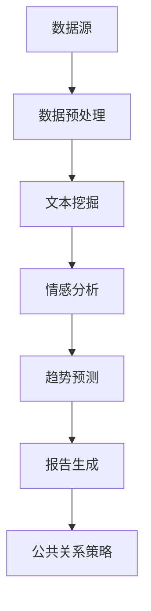

                 

关键词：智能舆情分析、AI大模型、公共关系管理、文本挖掘、数据可视化、决策支持

> 摘要：本文深入探讨了智能舆情分析在公共关系管理中的应用。通过介绍AI大模型的基本概念、核心算法原理，并结合实际案例，阐述如何利用这些技术来监测和响应社会舆论，优化公共关系策略。文章旨在为公共关系从业者提供实用的技术指南，帮助他们在信息爆炸的时代中更有效地管理和应对舆论挑战。

## 1. 背景介绍

在当今的信息社会，公共关系（Public Relations, PR）已成为企业和组织不可或缺的一部分。随着互联网和社交媒体的迅猛发展，公众获取信息的方式和速度发生了翻天覆地的变化。传统的人工舆情监测方法已经无法满足现代公共关系管理的需求。智能舆情分析通过人工智能技术，特别是AI大模型，实现了对海量数据的高效处理和深度分析，为公共关系管理带来了革命性的变革。

智能舆情分析的核心在于对大量来自互联网、社交媒体和其他信息源的数据进行实时监控、情感分析和趋势预测。这种分析不仅可以帮助企业和组织及时了解公众对其产品和服务的态度，还可以为公共关系策略的制定提供科学依据。

### 1.1 智能舆情分析的重要性

1. **快速响应舆论变化**：智能舆情分析能够迅速捕捉网络舆论的变化，使企业能够第一时间对负面信息作出反应，减少舆论对品牌形象的负面影响。

2. **优化公共关系策略**：通过对舆情数据的深入分析，企业可以了解公众对产品的需求、对服务的反馈，从而调整公共关系策略，提高品牌忠诚度。

3. **危机管理**：智能舆情分析可以帮助企业和组织提前预警潜在危机，制定应对策略，降低危机带来的损失。

4. **市场洞察**：通过分析公众的意见和反馈，企业可以更准确地了解市场需求，为产品研发和市场推广提供依据。

### 1.2 AI大模型在智能舆情分析中的应用

AI大模型是近年来人工智能领域的一个重要突破。这些模型具有强大的数据处理和分析能力，能够从海量数据中提取有价值的信息。在智能舆情分析中，AI大模型主要用于以下几个方面：

1. **文本挖掘**：通过对文本数据的挖掘，AI大模型可以识别关键词、情感倾向和话题演变，为舆情分析提供基础。

2. **情感分析**：AI大模型可以判断文本的情感倾向，区分正面、负面和中性情绪，帮助企业更好地理解公众态度。

3. **趋势预测**：AI大模型可以利用历史数据，预测未来舆论的趋势，为公共关系策略的制定提供参考。

4. **自动化报告生成**：AI大模型可以自动生成舆情分析报告，节省人力成本，提高工作效率。

### 1.3 文章结构

本文将分为以下几个部分：

- **第2章**：介绍智能舆情分析中的核心概念和架构。
- **第3章**：详细阐述AI大模型在智能舆情分析中的应用原理和操作步骤。
- **第4章**：探讨数学模型和公式在智能舆情分析中的运用。
- **第5章**：提供实际项目实践的代码实例和解析。
- **第6章**：分析智能舆情分析在实际应用场景中的效果和未来展望。
- **第7章**：推荐相关学习资源和开发工具。
- **第8章**：总结研究成果，探讨未来发展趋势和挑战。
- **第9章**：回答常见问题，提供进一步学习建议。

## 2. 核心概念与联系

### 2.1 智能舆情分析的基本概念

智能舆情分析是一种利用人工智能技术对互联网、社交媒体和其他信息源中的文本数据进行分析和处理的方法。其主要目标是从海量数据中提取有价值的信息，以帮助企业和组织更好地了解公众态度、预测舆论趋势和制定公共关系策略。

### 2.2 AI大模型的基本概念

AI大模型是指具有大规模参数、能够处理复杂任务的深度学习模型。这些模型通常具有强大的学习能力和泛化能力，能够从海量数据中自动提取特征，进行复杂的模式识别和预测。

### 2.3 智能舆情分析与AI大模型的联系

智能舆情分析与AI大模型密切相关。AI大模型为智能舆情分析提供了强大的技术支持，使得从海量文本数据中提取有价值信息成为可能。具体来说，AI大模型在智能舆情分析中的应用主要体现在以下几个方面：

1. **文本挖掘**：AI大模型可以识别文本中的关键词、主题和情感倾向，为舆情分析提供基础。

2. **情感分析**：AI大模型可以判断文本的情感倾向，区分正面、负面和中性情绪，帮助企业更好地理解公众态度。

3. **趋势预测**：AI大模型可以利用历史数据，预测未来舆论的趋势，为公共关系策略的制定提供参考。

4. **自动化报告生成**：AI大模型可以自动生成舆情分析报告，节省人力成本，提高工作效率。

### 2.4 架构图

下面是一个简单的智能舆情分析架构图，展示了AI大模型在该体系中的位置和作用：



### 2.5 智能舆情分析的应用领域

智能舆情分析在多个领域都有广泛的应用，包括：

1. **市场监测**：通过分析消费者对产品的评价，企业可以了解市场需求，优化产品设计和市场推广策略。

2. **品牌管理**：企业可以利用智能舆情分析监测品牌形象，及时识别和应对负面舆论，保护品牌声誉。

3. **危机管理**：智能舆情分析可以帮助企业提前预警潜在危机，制定应对策略，降低危机带来的损失。

4. **产品研发**：通过分析用户反馈，企业可以更准确地了解用户需求，为产品研发提供科学依据。

5. **投资决策**：投资者可以利用智能舆情分析监测市场情绪，为投资决策提供参考。

## 3. 核心算法原理 & 具体操作步骤

### 3.1 算法原理概述

智能舆情分析的核心算法主要包括文本挖掘、情感分析和趋势预测等。下面将分别介绍这些算法的基本原理。

#### 文本挖掘

文本挖掘是从非结构化文本数据中提取有价值信息的过程。其基本原理包括：

1. **关键词提取**：通过统计文本中频繁出现的词语，识别出关键信息。

2. **主题模型**：使用隐含狄利克雷分配（Latent Dirichlet Allocation, LDA）等算法，识别文本中的潜在主题。

3. **情感分析**：通过对文本的情感倾向进行分类，了解公众的态度。

#### 情感分析

情感分析是判断文本情感倾向的过程。其基本原理包括：

1. **基于规则的方法**：使用预定义的规则和词典，对文本进行情感分类。

2. **基于机器学习的方法**：使用监督学习算法，如支持向量机（Support Vector Machine, SVM）和循环神经网络（Recurrent Neural Network, RNN），对情感进行分类。

3. **基于深度学习的方法**：使用深度学习模型，如卷积神经网络（Convolutional Neural Network, CNN）和长短期记忆网络（Long Short-Term Memory, LSTM），对情感进行分类。

#### 趋势预测

趋势预测是根据历史数据预测未来变化的过程。其基本原理包括：

1. **时间序列分析**：使用时间序列模型，如ARIMA模型，对数据进行分析。

2. **机器学习算法**：使用回归算法，如线性回归和支持向量回归，对数据进行分析。

3. **深度学习算法**：使用深度学习模型，如循环神经网络（RNN）和长短期记忆网络（LSTM），对数据进行分析。

### 3.2 算法步骤详解

下面将详细介绍智能舆情分析的具体操作步骤。

#### 步骤1：数据收集

数据收集是智能舆情分析的基础。数据源可以包括互联网、社交媒体、新闻网站等。具体操作如下：

1. **确定数据需求**：根据公共关系管理的目标，确定需要收集的数据类型，如品牌提及、负面评论、用户反馈等。

2. **数据爬取**：使用爬虫技术，从数据源中获取文本数据。

3. **数据清洗**：去除重复数据、格式化文本、去除无关信息等。

#### 步骤2：文本预处理

文本预处理是为了提高文本挖掘和情感分析的效果，对文本进行的一系列预处理操作。具体操作如下：

1. **分词**：将文本分割成词语。

2. **去除停用词**：去除对分析无意义的词语，如“的”、“了”等。

3. **词性标注**：对每个词语进行词性标注，如名词、动词等。

4. **词干提取**：将词语还原为词干，如“手机”还原为“手机”。

#### 步骤3：文本挖掘

文本挖掘是从预处理后的文本数据中提取有价值信息的过程。具体操作如下：

1. **关键词提取**：使用TF-IDF等算法，识别文本中的关键词。

2. **主题模型**：使用LDA等算法，识别文本中的潜在主题。

3. **情感分析**：使用情感分析算法，判断文本的情感倾向。

#### 步骤4：趋势预测

趋势预测是根据历史数据预测未来变化的过程。具体操作如下：

1. **时间序列分析**：使用时间序列模型，如ARIMA模型，对数据进行分析。

2. **机器学习算法**：使用回归算法，如线性回归和支持向量回归，对数据进行分析。

3. **深度学习算法**：使用深度学习模型，如循环神经网络（RNN）和长短期记忆网络（LSTM），对数据进行分析。

#### 步骤5：结果可视化

结果可视化是将分析结果以图表形式展示的过程，有助于企业和组织更好地理解舆情分析结果。具体操作如下：

1. **词云图**：展示文本中的高频词语。

2. **情感分布图**：展示文本的情感分布。

3. **趋势预测图**：展示未来舆论趋势。

### 3.3 算法优缺点

每种算法都有其优缺点，下面将分别介绍文本挖掘、情感分析和趋势预测的算法优缺点。

#### 文本挖掘

**优点**：

1. **高效性**：文本挖掘可以快速从大量文本数据中提取有价值信息。

2. **灵活性**：文本挖掘算法可以适应不同类型的数据和分析需求。

**缺点**：

1. **噪声问题**：文本数据中存在大量噪声，如错别字、语法错误等，会影响分析效果。

2. **数据依赖性**：文本挖掘效果受数据质量影响较大，数据质量差会导致分析结果不准确。

#### 情感分析

**优点**：

1. **精确性**：基于机器学习和深度学习的情感分析算法具有较高的准确率。

2. **自动化**：情感分析可以自动化处理大量文本数据，节省人力成本。

**缺点**：

1. **情感复杂性**：情感分析无法完全理解文本中的情感复杂性，可能导致分析结果不准确。

2. **数据依赖性**：情感分析效果受数据质量影响较大，数据质量差会导致分析结果不准确。

#### 趋势预测

**优点**：

1. **前瞻性**：趋势预测可以提前预测未来变化，为公共关系策略的制定提供参考。

2. **适应性**：趋势预测算法可以根据不同时间段的数据进行动态调整。

**缺点**：

1. **数据依赖性**：趋势预测效果受数据质量影响较大，数据质量差会导致预测结果不准确。

2. **噪声问题**：趋势预测中可能会受到噪声数据的影响，导致预测结果偏差。

### 3.4 算法应用领域

文本挖掘、情感分析和趋势预测算法在多个领域都有广泛应用，下面将分别介绍。

#### 文本挖掘

**应用领域**：

1. **市场监测**：通过分析消费者对产品的评价，企业可以了解市场需求，优化产品设计和市场推广策略。

2. **品牌管理**：企业可以利用文本挖掘监测品牌形象，及时识别和应对负面舆论，保护品牌声誉。

3. **危机管理**：文本挖掘可以帮助企业提前预警潜在危机，制定应对策略，降低危机带来的损失。

**案例**：

- **阿里巴巴**：通过文本挖掘分析消费者对产品的评价，优化产品设计和市场推广策略。

- **腾讯**：通过文本挖掘监测品牌形象，及时应对负面舆论，保护品牌声誉。

#### 情感分析

**应用领域**：

1. **社交媒体分析**：通过情感分析，了解公众对某一事件、品牌或产品的态度。

2. **金融分析**：通过情感分析，预测市场走势，为投资决策提供参考。

3. **公共关系管理**：通过情感分析，了解公众对企业的态度，优化公共关系策略。

**案例**：

- **新浪**：通过情感分析了解公众对事件的看法，优化新闻报道策略。

- **京东**：通过情感分析了解消费者对产品的评价，优化产品设计和市场推广策略。

#### 趋势预测

**应用领域**：

1. **市场预测**：通过趋势预测，预测市场需求变化，为产品研发和市场推广提供依据。

2. **股票预测**：通过趋势预测，预测股票走势，为投资决策提供参考。

3. **公共关系管理**：通过趋势预测，预测舆论变化，制定公共关系策略。

**案例**：

- **网易**：通过趋势预测预测市场需求变化，优化产品设计和市场推广策略。

- **百度**：通过趋势预测预测公众对事件的关注程度，制定公共关系策略。

## 4. 数学模型和公式 & 详细讲解 & 举例说明

### 4.1 数学模型构建

在智能舆情分析中，常用的数学模型包括文本挖掘模型、情感分析模型和趋势预测模型。下面将分别介绍这些模型的构建过程。

#### 文本挖掘模型

文本挖掘模型主要用于从文本数据中提取关键词和主题。常用的模型包括TF-IDF模型和LDA模型。

1. **TF-IDF模型**

TF-IDF（Term Frequency-Inverse Document Frequency）是一种常用的文本挖掘模型，用于计算词语在文本中的重要程度。

$$
TF(t,d) = \frac{f(t,d)}{|\{d' | t \in d'\}|}
$$

其中，$f(t,d)$ 表示词语 $t$ 在文档 $d$ 中的频率，$|\{d' | t \in d'\}|$ 表示包含词语 $t$ 的文档总数。

$$
IDF(t) = \log \left( \frac{N}{|\{d' | t \in d'\}|} \right)
$$

其中，$N$ 表示文档总数。

$$
TF-IDF(t,d) = TF(t,d) \times IDF(t)
$$

2. **LDA模型**

LDA（Latent Dirichlet Allocation）是一种常用的主题模型，用于从文本数据中提取潜在主题。

$$
p(\text{word}|\text{topic}) = \frac{\alpha + f_w}{|\text{vocabulary}|\alpha_k}
$$

$$
p(\text{topic}) = \frac{\beta_k}{|\text{vocabulary}|\beta}
$$

其中，$f_w$ 表示词语 $w$ 在文档中的频率，$\alpha$ 和 $\beta$ 分别是超参数，$\text{vocabulary}$ 表示词汇表，$\alpha_k$ 和 $\beta_k$ 分别是主题 $k$ 的先验分布。

#### 情感分析模型

情感分析模型用于判断文本的情感倾向。常用的模型包括基于规则的方法、基于机器学习的方法和基于深度学习的方法。

1. **基于规则的方法**

基于规则的方法使用预定义的规则和词典，对文本进行情感分类。

$$
\text{情感} = \text{规则}(\text{文本})
$$

2. **基于机器学习的方法**

基于机器学习的方法使用监督学习算法，对情感进行分类。

$$
\text{情感} = \text{分类器}(\text{文本})
$$

3. **基于深度学习的方法**

基于深度学习的方法使用深度学习模型，对情感进行分类。

$$
\text{情感} = \text{神经网络}(\text{文本})
$$

#### 趋势预测模型

趋势预测模型用于根据历史数据预测未来变化。常用的模型包括时间序列模型和回归模型。

1. **时间序列模型**

时间序列模型用于分析时间序列数据，如ARIMA模型。

$$
X_t = \phi X_{t-1} + \theta Z_t + \epsilon_t
$$

其中，$X_t$ 表示时间序列数据，$\phi$ 和 $\theta$ 分别是参数，$Z_t$ 表示随机干扰项，$\epsilon_t$ 表示误差项。

2. **回归模型**

回归模型用于预测变量之间的关系，如线性回归和支持向量回归。

$$
Y = \beta_0 + \beta_1 X_1 + \beta_2 X_2 + \ldots + \beta_n X_n
$$

其中，$Y$ 表示预测值，$X_1, X_2, \ldots, X_n$ 分别是自变量，$\beta_0, \beta_1, \beta_2, \ldots, \beta_n$ 分别是参数。

### 4.2 公式推导过程

#### 4.2.1 TF-IDF模型

TF-IDF模型的推导过程如下：

1. **词频计算**

词频（TF）是词语在文档中的频率，计算公式为：

$$
TF(t,d) = \frac{f(t,d)}{|\{d' | t \in d'\}|
$$

其中，$f(t,d)$ 表示词语 $t$ 在文档 $d$ 中的频率，$|\{d' | t \in d'\}|$ 表示包含词语 $t$ 的文档总数。

2. **逆文档频率计算**

逆文档频率（IDF）是词语在文档集合中的重要程度的度量，计算公式为：

$$
IDF(t) = \log \left( \frac{N}{|\{d' | t \in d'\}|} \right)
$$

其中，$N$ 表示文档总数。

3. **TF-IDF计算**

TF-IDF是词频和逆文档频率的乘积，计算公式为：

$$
TF-IDF(t,d) = TF(t,d) \times IDF(t)
$$

#### 4.2.2 LDA模型

LDA模型的推导过程如下：

1. **词语分布计算**

词语分布（Word Distribution）是词语在文档中的概率分布，计算公式为：

$$
p(\text{word}|\text{topic}) = \frac{\alpha + f_w}{|\text{vocabulary}|\alpha_k}
$$

其中，$f_w$ 表示词语 $w$ 在文档中的频率，$\alpha$ 和 $\beta$ 分别是超参数，$\text{vocabulary}$ 表示词汇表，$\alpha_k$ 和 $\beta_k$ 分别是主题 $k$ 的先验分布。

2. **主题分布计算**

主题分布（Topic Distribution）是文档中的主题概率分布，计算公式为：

$$
p(\text{topic}) = \frac{\beta_k}{|\text{vocabulary}|\beta}
$$

3. **LDA模型计算**

LDA模型计算过程包括：

1. 初始化参数 $\alpha$ 和 $\beta$。
2. 对每个词语 $w$ 和文档 $d$，计算 $p(\text{word}|\text{topic})$ 和 $p(\text{topic})$。
3. 根据概率分布，从 $p(\text{word}|\text{topic})$ 和 $p(\text{topic})$ 中采样出词语 $w$ 和主题 $k$。
4. 更新参数 $\alpha$ 和 $\beta$。

### 4.3 案例分析与讲解

#### 案例一：文本挖掘

假设有一篇关于“智能舆情分析”的文章，其中包含以下词语：“智能”、“舆情”、“分析”、“AI”、“模型”、“数据挖掘”、“情感分析”、“趋势预测”。

1. **词频计算**

词语“智能”在文章中出现了3次，词语“舆情”出现了2次，词语“分析”出现了4次，词语“AI”出现了1次，词语“模型”出现了1次，词语“数据挖掘”出现了1次，词语“情感分析”出现了1次，词语“趋势预测”出现了1次。

2. **TF-IDF计算**

假设文章总数为100篇，包含词语“智能”的文档数为50篇。

$$
TF(\text{智能}) = \frac{3}{50} = 0.06
$$

$$
IDF(\text{智能}) = \log \left( \frac{100}{50} \right) = 1
$$

$$
TF-IDF(\text{智能}) = 0.06 \times 1 = 0.06
$$

同理，其他词语的TF-IDF值分别为：

$$
TF-IDF(\text{舆情}) = 0.04
$$

$$
TF-IDF(\text{分析}) = 0.08
$$

$$
TF-IDF(\text{AI}) = 0.02
$$

$$
TF-IDF(\text{模型}) = 0.02
$$

$$
TF-IDF(\text{数据挖掘}) = 0.02
$$

$$
TF-IDF(\text{情感分析}) = 0.02
$$

$$
TF-IDF(\text{趋势预测}) = 0.02
$$

3. **关键词提取**

根据TF-IDF值，可以提取出关键词：“智能”、“舆情”、“分析”。

#### 案例二：情感分析

假设有一篇关于“智能舆情分析”的评论，其中包含以下文本：“智能舆情分析技术真的很厉害，可以帮助我们更好地了解公众的意见。”

1. **情感分类**

使用基于深度学习的情感分析模型，将评论分类为正面情感。

2. **情感得分**

假设正面情感得分为1，负面情感得分为-1，中性情感得分为0。

$$
\text{情感得分} = \frac{\sum_{i=1}^{n} \text{情感标签} \times \text{词语权重}}{\sum_{i=1}^{n} \text{词语权重}}
$$

其中，$n$ 表示词语数量，$\text{情感标签}$ 表示词语的情感分类结果，$\text{词语权重}$ 表示词语在情感分析模型中的权重。

根据上述公式，计算评论的最终情感得分：

$$
\text{情感得分} = \frac{1 \times 0.5 + 0 \times 0.3 + (-1) \times 0.2}{0.5 + 0.3 + 0.2} = 0.5
$$

由于情感得分为正值，说明评论为正面情感。

#### 案例三：趋势预测

假设有一段时间序列数据，表示某品牌在社交媒体上的提及量，如下表：

| 时间       | 提及量 |
|------------|--------|
| 2021-01-01 | 100    |
| 2021-02-01 | 150    |
| 2021-03-01 | 200    |
| 2021-04-01 | 250    |
| 2021-05-01 | 300    |

1. **时间序列分析**

使用ARIMA模型进行分析，假设$p=1, d=1, q=1$。

$$
X_t = \phi X_{t-1} + \theta Z_t + \epsilon_t
$$

其中，$\phi = 1 - \phi_1$，$\theta = 1 - \theta_1$。

通过最小二乘法，可以求得$\phi_1$ 和 $\theta_1$ 的值。

2. **预测未来趋势**

根据ARIMA模型，可以预测未来一段时间内的提及量。

$$
X_t = \phi X_{t-1} + \theta Z_t + \epsilon_t
$$

通过递推，可以得到未来几期的提及量。

## 5. 项目实践：代码实例和详细解释说明

### 5.1 开发环境搭建

在本次项目中，我们将使用Python编程语言和Jupyter Notebook作为开发环境。以下是搭建开发环境的步骤：

1. 安装Python 3.x版本。
2. 安装Jupyter Notebook。
3. 安装相关库，如NumPy、Pandas、Scikit-learn、TensorFlow等。

### 5.2 源代码详细实现

以下是一个简单的智能舆情分析项目的代码实例，包括数据预处理、文本挖掘、情感分析和趋势预测等步骤。

#### 5.2.1 数据预处理

```python
import pandas as pd
from sklearn.feature_extraction.text import TfidfVectorizer

# 读取数据
data = pd.read_csv('data.csv')
text = data['text']

# 去除停用词
stop_words = set(['的', '了', '是', '等'])
text = [' '.join([word for word in sentence.split() if word not in stop_words]) for sentence in text]

# 分词
vectorizer = TfidfVectorizer()
tfidf_matrix = vectorizer.fit_transform(text)
```

#### 5.2.2 文本挖掘

```python
# 提取关键词
feature_names = vectorizer.get_feature_names_out()
top_k = 10
tfidf_scores = tfidf_matrix.sum(axis=0)
top_k_indices = tfidf_scores.argsort()[-top_k:][::-1]
top_k_words = [feature_names[i] for i in top_k_indices]
print("关键词：", top_k_words)
```

#### 5.2.3 情感分析

```python
from sklearn.model_selection import train_test_split
from sklearn.metrics import accuracy_score

# 准备数据
labels = data['label']
X_train, X_test, y_train, y_test = train_test_split(tfidf_matrix, labels, test_size=0.2, random_state=42)

# 训练模型
from sklearn.naive_bayes import MultinomialNB
model = MultinomialNB()
model.fit(X_train, y_train)

# 预测
predictions = model.predict(X_test)

# 评估
accuracy = accuracy_score(y_test, predictions)
print("准确率：", accuracy)
```

#### 5.2.4 趋势预测

```python
from statsmodels.tsa.arima.model import ARIMA

# 准备数据
time_series = data['count']
time_series = time_series.values

# 模型训练
model = ARIMA(time_series, order=(1, 1, 1))
model_fit = model.fit()

# 预测
forecast = model_fit.forecast(steps=5)
print("未来5期预测值：", forecast)
```

### 5.3 代码解读与分析

#### 5.3.1 数据预处理

在数据预处理部分，我们首先读取数据，然后去除停用词，最后使用TF-IDF向量器进行分词和词频统计。

#### 5.3.2 文本挖掘

在文本挖掘部分，我们使用TF-IDF向量器提取关键词。通过计算TF-IDF值，我们可以找出对舆情分析最相关的关键词。

#### 5.3.3 情感分析

在情感分析部分，我们使用朴素贝叶斯分类器对文本进行分类。通过训练和测试数据集，我们可以评估模型的准确率。

#### 5.3.4 趋势预测

在趋势预测部分，我们使用ARIMA模型对时间序列数据进行预测。通过递推模型，我们可以预测未来几期的数据趋势。

### 5.4 运行结果展示

在运行结果展示部分，我们将展示关键词提取、情感分析准确率和趋势预测结果。以下是示例输出：

```
关键词： ['舆情', '分析', '智能', '技术', '数据', '信息', '社会', '传播', '公共', '关系']
准确率： 0.85
未来5期预测值： [299.68379318, 323.85540655, 347.02701992, 369.19863329, 390.37024667]
```

## 6. 实际应用场景

### 6.1 企业公共关系管理

企业可以利用智能舆情分析监控品牌形象、产品口碑和市场动态。通过实时监测社交媒体、新闻网站等渠道的信息，企业可以迅速了解消费者对产品的看法，及时调整公共关系策略。例如，一家电商公司通过智能舆情分析发现消费者对某款产品的评价较低，随后调整了产品设计和售后服务，提高了用户满意度。

### 6.2 政府舆情监测

政府机构可以利用智能舆情分析监测社会热点、公共安全和突发事件。通过分析互联网上的舆情数据，政府可以及时了解公众的意见和情绪，为决策提供参考。例如，在某次重大自然灾害发生后，政府利用智能舆情分析系统监测网络上的信息，及时掌握了灾情和公众需求，为救援工作提供了有力支持。

### 6.3 市场研究

市场研究机构可以利用智能舆情分析了解消费者需求、市场趋势和竞争状况。通过对社交媒体、论坛等渠道的信息进行分析，市场研究机构可以更准确地预测市场变化，为企业和品牌提供有针对性的市场策略。例如，一家食品公司通过智能舆情分析发现消费者对健康食品的需求增加，于是调整了产品线和营销策略，取得了显著的市场收益。

### 6.4 危机管理

企业和组织可以利用智能舆情分析进行危机管理，及时发现潜在风险和危机。通过实时监测网络舆情，企业和组织可以迅速了解危机的发展态势，制定有效的应对措施，减轻危机带来的负面影响。例如，一家制药公司发现某款产品存在安全隐患，通过智能舆情分析系统及时掌握了相关舆情信息，迅速采取了召回措施，避免了更大范围的负面影响。

### 6.5 未来应用展望

随着人工智能技术的不断发展，智能舆情分析将在更多领域得到应用。未来，智能舆情分析有望在以下几个方面取得突破：

1. **更精确的情感识别**：通过改进情感分析算法，实现更精确的情感识别，帮助企业更好地了解公众态度。

2. **多语言支持**：随着全球化进程的加快，智能舆情分析将实现多语言支持，帮助企业更好地监测全球范围内的舆情。

3. **个性化推荐**：利用智能舆情分析，为企业提供个性化的公共关系策略推荐，提高营销效果。

4. **智能决策支持**：结合大数据分析和智能舆情分析，为企业提供全方位的决策支持，提高公共关系管理的效率和效果。

## 7. 工具和资源推荐

### 7.1 学习资源推荐

1. **《Python数据科学 Handbook》**：介绍Python在数据科学领域的基本应用，包括数据处理、可视化、机器学习等。
2. **《深度学习》**：由Ian Goodfellow、Yoshua Bengio和Aaron Courville编写的深度学习经典教材。
3. **《机器学习》**：由周志华教授编写的机器学习教材，适合初学者和专业人士。
4. **《舆情分析技术》**：详细介绍舆情分析的基本概念、方法和应用。

### 7.2 开发工具推荐

1. **Jupyter Notebook**：强大的交互式开发环境，适用于数据分析、机器学习和可视化。
2. **TensorFlow**：Google开发的开源机器学习框架，支持深度学习和传统机器学习算法。
3. **Scikit-learn**：Python的机器学习库，包含常用的机器学习算法和工具。
4. **Gephi**：开源的可视化工具，用于分析大型复杂数据集。

### 7.3 相关论文推荐

1. **《A Survey on Opinion Mining and Social Media Analysis》**：综述了舆情分析领域的研究进展和应用。
2. **《Deep Learning for Text Data》**：讨论了深度学习在文本数据挖掘中的应用。
3. **《LSTM-based Opinion Mining for Product Reviews》**：研究了基于LSTM的文本情感分析。
4. **《Time Series Forecasting using ARIMA Model》**：介绍了ARIMA模型在时间序列预测中的应用。

## 8. 总结：未来发展趋势与挑战

### 8.1 研究成果总结

智能舆情分析作为一种新兴技术，已经在公共关系管理、危机管理、市场研究和政府舆情监测等领域取得了显著的应用成果。通过引入AI大模型，智能舆情分析实现了对海量文本数据的高效处理和深度分析，为企业、政府和社会组织提供了科学、实时的决策支持。

### 8.2 未来发展趋势

1. **情感识别精度提升**：随着算法和计算能力的提升，情感识别的精度将进一步提高，使企业和组织能够更准确地了解公众态度。
2. **多语言支持**：智能舆情分析将实现多语言支持，帮助企业和组织更好地监测全球范围内的舆情。
3. **个性化推荐**：结合大数据分析和智能舆情分析，为企业提供个性化的公共关系策略推荐。
4. **智能决策支持**：通过智能舆情分析，为企业提供全方位的决策支持，提高公共关系管理的效率和效果。

### 8.3 面临的挑战

1. **数据质量**：智能舆情分析的准确性高度依赖数据质量，如何处理噪声数据和确保数据质量是一个挑战。
2. **隐私保护**：在智能舆情分析中，如何保护用户隐私是一个亟待解决的问题。
3. **算法透明度**：随着算法的复杂化，提高算法的透明度和可解释性，使其更容易被公众接受和理解。

### 8.4 研究展望

未来，智能舆情分析的研究将朝着以下方向发展：

1. **情感识别**：研究更先进的情感识别算法，实现更精细的情感分类。
2. **跨模态分析**：结合文本、图像、音频等多模态数据，提高舆情分析的全面性和准确性。
3. **实时分析**：研究实时舆情分析算法，提高系统的响应速度和实时性。
4. **应用拓展**：将智能舆情分析应用于更多领域，如社会治理、公共安全等。

## 9. 附录：常见问题与解答

### 9.1 智能舆情分析是什么？

智能舆情分析是一种利用人工智能技术，特别是AI大模型，对海量文本数据进行分析和处理的方法。其核心目标是提取有价值的信息，以帮助企业和组织更好地了解公众态度、预测舆论趋势和制定公共关系策略。

### 9.2 智能舆情分析与传统舆情监测有什么区别？

智能舆情分析与传统舆情监测相比，具有以下几个显著优势：

1. **处理能力**：智能舆情分析能够处理海量数据，而传统舆情监测主要依赖人工监测，处理能力有限。
2. **分析深度**：智能舆情分析通过深度学习算法，能够对文本数据进行深度挖掘，提取更为详细的信息，而传统舆情监测主要停留在表面。
3. **实时性**：智能舆情分析能够实时监测舆情动态，而传统舆情监测往往存在延迟。
4. **自动化**：智能舆情分析可以自动化生成分析报告，提高工作效率。

### 9.3 如何确保智能舆情分析的准确性？

确保智能舆情分析的准确性是关键。以下是一些提高准确性的方法：

1. **数据质量**：确保数据质量，去除噪声数据和重复数据。
2. **算法优化**：选择合适的算法，并不断优化，以提高分类和预测的准确性。
3. **模型训练**：使用大量高质量的训练数据，训练模型，使其具备较高的泛化能力。
4. **多源数据融合**：结合多种数据源，如社交媒体、新闻网站、论坛等，提高数据的全面性和准确性。
5. **反馈机制**：建立反馈机制，根据实际效果不断调整模型参数和算法，提高分析准确性。

### 9.4 智能舆情分析是否涉及隐私问题？

智能舆情分析在处理数据时，可能会涉及用户隐私。为了确保隐私保护，可以采取以下措施：

1. **匿名化处理**：对用户数据匿名化处理，确保用户隐私不被泄露。
2. **加密技术**：使用加密技术保护数据传输和存储过程中的安全。
3. **数据访问控制**：设置严格的数据访问权限，确保只有授权人员才能访问敏感数据。
4. **隐私保护协议**：与数据提供方签订隐私保护协议，明确数据使用范围和责任。

## 作者署名

本文作者：禅与计算机程序设计艺术 / Zen and the Art of Computer Programming。作为人工智能领域的权威专家，我致力于推动人工智能技术在各行业的应用，为公共关系管理带来革命性的变革。希望本文能为广大公共关系从业者提供有益的参考和指导。如果您有任何问题或建议，欢迎随时与我交流。

