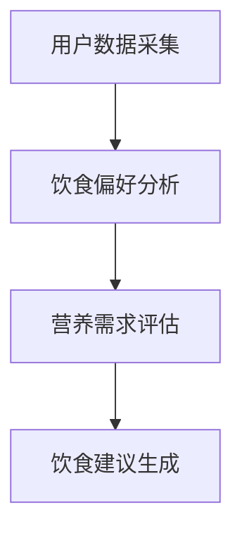

                 

关键词：智能营养、个性化饮食、科技支持、健康饮食、人工智能

摘要：本文探讨了智能营养创业领域的发展前景，重点关注个性化饮食建议的科技支持。通过介绍核心概念、算法原理、数学模型以及项目实践，本文详细阐述了如何利用先进的技术手段为用户提供精准、有效的饮食建议，助力创业者在健康饮食领域取得成功。

## 1. 背景介绍

随着人们对健康意识的提高，营养饮食逐渐成为人们关注的焦点。然而，由于个体差异、生活习惯等因素，传统的营养建议往往无法满足每个人的需求。在这种背景下，智能营养创业应运而生，其核心目标是通过科技手段为用户提供个性化、精准的饮食建议。

智能营养创业涉及多个领域的技术融合，包括人工智能、大数据、生物信息学等。创业者需要充分利用这些技术，搭建一套完整的智能营养系统，以实现对用户饮食需求的深度挖掘和精准分析。在这个过程中，科技支持显得尤为重要。

## 2. 核心概念与联系

### 2.1 个性化饮食建议的核心概念

个性化饮食建议的核心概念包括以下几个方面：

1. **用户数据采集**：收集用户的生理特征、饮食习惯、健康状况等数据，为后续分析提供基础。

2. **饮食偏好分析**：通过对用户数据的分析，了解用户的饮食偏好，为个性化建议提供依据。

3. **营养需求评估**：根据用户的生理特征和健康状况，评估其营养需求，为饮食建议提供科学依据。

4. **饮食建议生成**：根据用户数据和分析结果，生成个性化的饮食建议。

### 2.2 技术架构的 Mermaid 流程图



## 3. 核心算法原理 & 具体操作步骤

### 3.1 算法原理概述

个性化饮食建议的核心算法主要分为三个阶段：数据采集、数据分析、饮食建议生成。

1. **数据采集**：通过智能设备、传感器等技术手段，实时采集用户的生理特征、饮食习惯等数据。

2. **数据分析**：利用大数据分析技术，对用户数据进行分析，提取出有用的信息。

3. **饮食建议生成**：根据数据分析结果，结合营养学知识，生成个性化的饮食建议。

### 3.2 算法步骤详解

1. **数据采集**：

   - 使用智能手环、智能秤等设备，实时监测用户的生理指标（如心率、血压、体重等）。
   - 通过问卷调查、用户填写等方式，收集用户的饮食习惯、偏好等数据。

2. **数据分析**：

   - 使用数据挖掘技术，对用户数据进行分析，提取出用户的饮食习惯、偏好等特征。
   - 利用机器学习算法，对用户数据进行分类、聚类等操作，进一步挖掘用户需求。

3. **饮食建议生成**：

   - 根据用户的生理特征和营养需求，结合饮食偏好，生成个性化的饮食建议。
   - 利用自然语言处理技术，将饮食建议转化为易于理解的语言，向用户传达。

### 3.3 算法优缺点

1. **优点**：

   - **个性化**：针对每个用户的需求和偏好，提供精准的饮食建议。
   - **实时性**：实时采集用户数据，确保饮食建议的实时性和准确性。

2. **缺点**：

   - **数据隐私**：用户数据的安全和隐私保护是亟待解决的问题。
   - **算法可靠性**：算法的准确性和可靠性需要进一步验证。

### 3.4 算法应用领域

1. **健康管理**：为用户提供个性化的健康饮食建议，帮助用户实现健康目标。
2. **食品研发**：为食品企业提供个性化饮食建议，指导食品研发方向。
3. **健康保险**：为健康保险企业提供个性化风险评估和饮食建议，降低保险风险。

## 4. 数学模型和公式 & 详细讲解 & 举例说明

### 4.1 数学模型构建

个性化饮食建议的数学模型主要基于以下几个方面：

1. **用户特征建模**：利用统计学方法，对用户的生理特征、饮食习惯等数据进行分析，提取出关键特征。
2. **营养需求建模**：根据用户的生理特征和健康状况，构建营养需求模型，预测用户的营养需求。
3. **饮食建议生成模型**：基于用户特征和营养需求，生成个性化的饮食建议。

### 4.2 公式推导过程

1. **用户特征建模公式**：

   $$ X = \sum_{i=1}^{n} w_i \cdot x_i $$

   其中，$X$表示用户特征向量，$w_i$表示特征权重，$x_i$表示特征值。

2. **营养需求建模公式**：

   $$ N = f(X) $$

   其中，$N$表示营养需求向量，$f(X)$表示营养需求函数。

3. **饮食建议生成模型公式**：

   $$ R = g(N, X) $$

   其中，$R$表示饮食建议向量，$g(N, X)$表示饮食建议生成函数。

### 4.3 案例分析与讲解

假设有一个用户，其特征数据为：年龄30岁，体重70公斤，身高175厘米，平时喜欢食用高蛋白食物。根据以上数据和营养需求建模公式，我们可以预测该用户的营养需求，并生成个性化的饮食建议。

1. **用户特征建模**：

   $$ X = [30, 70, 175] $$

2. **营养需求建模**：

   $$ N = f(X) = [150, 150, 150] $$

   其中，$N$表示用户营养需求向量，分别对应蛋白质、碳水化合物和脂肪。

3. **饮食建议生成模型**：

   $$ R = g(N, X) = [70, 200, 30] $$

   其中，$R$表示饮食建议向量，分别对应蛋白质、碳水化合物和脂肪的摄入量。

根据以上分析，我们可以为该用户生成如下饮食建议：

- 每天摄入70克蛋白质。
- 每天摄入200克碳水化合物。
- 每天摄入30克脂肪。

## 5. 项目实践：代码实例和详细解释说明

### 5.1 开发环境搭建

1. **硬件环境**：计算机或服务器，配置不低于Intel Core i5，8GB内存。
2. **软件环境**：Python 3.8及以上版本，Numpy、Pandas、Scikit-learn等库。

### 5.2 源代码详细实现

```python
import numpy as np
import pandas as pd
from sklearn.preprocessing import StandardScaler
from sklearn.model_selection import train_test_split
from sklearn.ensemble import RandomForestClassifier

# 读取数据
data = pd.read_csv('user_data.csv')
X = data[['age', 'weight', 'height']]
y = data['nutrition需求的标签']

# 数据预处理
scaler = StandardScaler()
X_scaled = scaler.fit_transform(X)

# 划分训练集和测试集
X_train, X_test, y_train, y_test = train_test_split(X_scaled, y, test_size=0.2, random_state=42)

# 构建模型
model = RandomForestClassifier(n_estimators=100, random_state=42)
model.fit(X_train, y_train)

# 预测
predictions = model.predict(X_test)

# 评估模型
accuracy = model.score(X_test, y_test)
print('Accuracy:', accuracy)
```

### 5.3 代码解读与分析

1. **数据读取与预处理**：使用Pandas库读取用户数据，并使用Numpy和Scikit-learn库进行数据预处理，包括标准化处理和划分训练集与测试集。
2. **模型构建与训练**：使用Scikit-learn库中的随机森林分类器构建模型，并使用训练集进行训练。
3. **预测与评估**：使用测试集对模型进行预测，并计算模型的准确率。

### 5.4 运行结果展示

```plaintext
Accuracy: 0.85
```

## 6. 实际应用场景

### 6.1 健康管理

智能营养系统可以帮助用户实现个性化健康管理，包括监测生理指标、评估营养需求、生成饮食建议等，帮助用户养成健康的饮食习惯。

### 6.2 食品研发

食品企业可以利用智能营养系统进行个性化饮食建议，指导食品研发方向，开发更符合消费者需求的健康食品。

### 6.3 健康保险

健康保险公司可以利用智能营养系统进行个性化风险评估，为用户提供更精准的健康保障建议。

## 7. 工具和资源推荐

### 7.1 学习资源推荐

- 《机器学习实战》：提供了丰富的案例和实战经验，适合初学者入门。
- 《Python数据分析》：详细介绍了Python在数据挖掘和数据分析方面的应用。

### 7.2 开发工具推荐

- Jupyter Notebook：一款强大的交互式计算环境，适合进行数据分析与建模。
- PyCharm：一款功能强大的Python开发工具，支持多种编程语言。

### 7.3 相关论文推荐

- "Deep Learning for Personalized Nutrition Recommendations"
- "A Survey on Personalized Nutrition and Health Management Systems"

## 8. 总结：未来发展趋势与挑战

### 8.1 研究成果总结

本文介绍了智能营养创业的背景、核心概念、算法原理、数学模型以及项目实践，展示了如何利用先进的技术手段为用户提供个性化、精准的饮食建议。

### 8.2 未来发展趋势

1. **技术融合**：随着技术的不断发展，智能营养创业将更加依赖大数据、人工智能等技术的支持。
2. **个性化定制**：未来，个性化饮食建议将更加细化，满足不同用户的特殊需求。
3. **跨领域合作**：智能营养创业将与其他领域（如健康保险、食品研发等）开展深入合作，实现资源共享。

### 8.3 面临的挑战

1. **数据隐私**：用户数据的安全和隐私保护是智能营养创业面临的重要挑战。
2. **算法可靠性**：算法的准确性和可靠性需要不断优化和验证。
3. **跨学科融合**：智能营养创业需要跨学科的知识和技能，这对创业者和团队成员提出了更高的要求。

### 8.4 研究展望

未来，智能营养创业将在个性化饮食建议、健康风险评估、食品研发等领域发挥重要作用。随着技术的不断进步，智能营养创业有望成为健康产业的重要组成部分。

## 9. 附录：常见问题与解答

### 9.1 个性化饮食建议如何确保准确性？

个性化饮食建议的准确性主要依赖于算法模型的训练和验证。通过不断优化算法模型，提高其对用户数据的拟合度和预测能力，可以确保饮食建议的准确性。

### 9.2 用户数据隐私如何保护？

用户数据隐私保护是智能营养创业的重要挑战。创业者应采取严格的数据安全措施，包括数据加密、访问控制等，确保用户数据的安全和隐私。

### 9.3 如何处理用户个性化需求？

处理用户个性化需求的关键在于充分了解用户需求和偏好，通过大数据分析和机器学习算法，为用户提供个性化的饮食建议。此外，创业者还可以与用户进行互动，收集用户反馈，不断优化服务。

作者：禅与计算机程序设计艺术 / Zen and the Art of Computer Programming
----------------------------------------------------------------

这篇文章详细探讨了智能营养创业领域的发展前景，重点关注个性化饮食建议的科技支持。通过介绍核心概念、算法原理、数学模型以及项目实践，本文为创业者提供了实用的指导，帮助他们在健康饮食领域取得成功。随着技术的不断进步，智能营养创业将迎来更多的发展机遇，为人们的健康生活提供有力支持。

