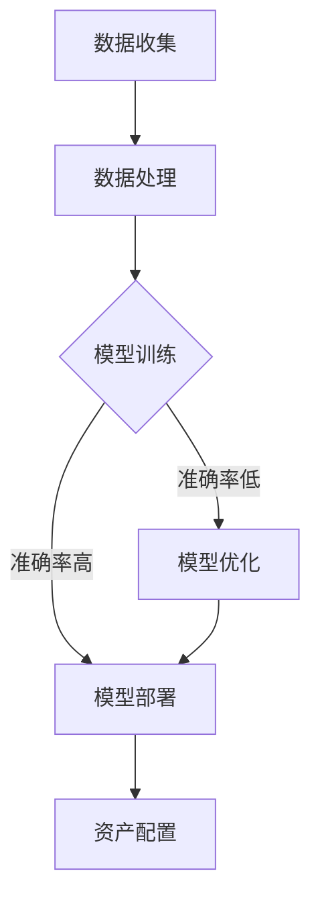

                 

关键词：智能资产管理、AI大模型、应用机会、技术演进、数据处理、算法优化、实际场景、未来展望

> 摘要：本文旨在探讨智能资产管理领域内AI大模型的深度应用机会，通过对核心概念、算法原理、数学模型、项目实践等方面进行深入分析，总结现有研究成果，展望未来发展趋势与挑战，为行业技术进步提供指导。

## 1. 背景介绍

在数字化转型的浪潮下，资产管理作为金融领域的重要组成部分，正经历着前所未有的变革。传统的资产管理方式主要依赖于人工分析和经验判断，随着数据量的急剧增长，这种方式已经难以满足高效、精准的要求。人工智能（AI）技术的发展为资产管理带来了新的契机，尤其是AI大模型的应用，极大地提升了资产管理的智能化水平。

### 1.1 智能资产管理的现状

随着大数据、云计算、区块链等技术的广泛应用，资产管理行业的数据处理能力得到了显著提升。然而，现有的资产管理系统仍然存在诸多问题：

- 数据来源多样但缺乏整合
- 算法模型复杂但适用性不强
- 人工判断依赖度高，效率低

### 1.2 AI大模型的应用前景

AI大模型，如深度学习、生成对抗网络（GAN）等，通过模拟人类大脑的学习和认知过程，具有强大的数据处理和模式识别能力。在智能资产管理领域，AI大模型的应用前景广阔，主要体现在以下几个方面：

- 提高数据处理效率，降低人力成本
- 增强算法模型的适用性和准确性
- 实现资产配置的自动化和智能化

## 2. 核心概念与联系

### 2.1 智能资产管理概念

智能资产管理是指利用人工智能技术，对金融资产进行自动化管理的过程。它涵盖了数据收集、处理、分析和决策等多个环节。

### 2.2 AI大模型概念

AI大模型是指使用海量数据训练得到的复杂神经网络模型，具有高度的数据处理和模式识别能力。

### 2.3 Mermaid 流程图

下面是一个简单的Mermaid流程图，展示了智能资产管理中AI大模型的核心流程：



## 3. 核心算法原理 & 具体操作步骤

### 3.1 算法原理概述

智能资产管理的AI大模型主要基于深度学习和强化学习等技术。深度学习通过多层神经网络模拟人类大脑的学习过程，强化学习则通过不断试错来优化策略。

### 3.2 算法步骤详解

#### 3.2.1 数据收集

数据收集是智能资产管理的基础。主要包括：

- 市场数据：如股票价格、交易量等
- 公司数据：如财务报表、经营状况等
- 经济数据：如GDP、通货膨胀率等

#### 3.2.2 数据处理

数据处理主要包括数据清洗、归一化和特征提取等步骤。

- 数据清洗：去除无效、错误和重复数据
- 数据归一化：将不同尺度的数据进行标准化处理
- 特征提取：从原始数据中提取有意义的特征

#### 3.2.3 模型训练

模型训练是智能资产管理的关键步骤。通过大量历史数据，训练得到一个能够预测市场走势和公司表现的模型。

- 模型选择：选择合适的神经网络结构
- 模型训练：使用梯度下降等算法优化模型参数
- 模型评估：通过交叉验证等方法评估模型性能

#### 3.2.4 模型部署

训练好的模型可以部署到资产管理系统中，进行实际应用。

- 模型部署：将模型转换为可执行代码
- 模型解释：对模型的决策过程进行解释
- 模型更新：根据市场变化定期更新模型

### 3.3 算法优缺点

#### 优点

- 高效：能够处理大量数据，提高资产管理效率
- 准确：通过机器学习算法，提高资产配置的准确性
- 智能化：实现资产配置的自动化和智能化

#### 缺点

- 复杂：算法模型复杂，训练和部署过程繁琐
- 数据依赖：对数据质量和数量有较高要求
- 风险：模型可能产生过拟合，影响决策准确性

### 3.4 算法应用领域

智能资产管理的AI大模型可以应用于多个领域，包括：

- 股票市场预测
- 基金组合优化
- 风险管理
- 投资组合分析
- 个人财务规划

## 4. 数学模型和公式 & 详细讲解 & 举例说明

### 4.1 数学模型构建

智能资产管理的AI大模型通常采用多层神经网络作为数学模型。假设我们有一个包含 $L$ 层的神经网络，每层包含 $n_l$ 个神经元。输入层为 $X \in \mathbb{R}^{m \times n_1}$，输出层为 $Y \in \mathbb{R}^{m \times n_L}$。其中，$m$ 为样本数量，$n_1$ 和 $n_L$ 分别为输入层和输出层的神经元数量。

神经网络的输出可以通过以下公式计算：

$$
Y_l = \sigma(W_{l+1}Y_l + b_{l+1})
$$

其中，$W_{l+1}$ 和 $b_{l+1}$ 分别为权重矩阵和偏置向量，$\sigma$ 为激活函数，通常取为 sigmoid 或 ReLU 函数。

### 4.2 公式推导过程

神经网络的训练过程是通过反向传播算法（Backpropagation）来优化模型参数。具体推导过程如下：

1. 前向传播：

输入样本 $X$ 通过网络前向传播，得到输出 $Y$：

$$
Y_L = \sigma(W_L Y_{L-1} + b_L)
$$

$$
Y_{L-1} = \sigma(W_{L-1} Y_{L-2} + b_{L-1})
$$

...

$$
Y_2 = \sigma(W_2 Y_1 + b_2)
$$

$$
Y_1 = \sigma(W_1 X + b_1)
$$

2. 计算损失函数：

损失函数通常采用均方误差（MSE）：

$$
J = \frac{1}{m} \sum_{i=1}^{m} \sum_{j=1}^{n_L} (Y_{ij} - \hat{Y}_{ij})^2
$$

其中，$\hat{Y}_{ij}$ 为模型预测的输出，$Y_{ij}$ 为实际输出。

3. 反向传播：

计算损失函数关于模型参数的梯度，并通过梯度下降法更新模型参数：

$$
\frac{\partial J}{\partial W_{l+1}} = -\frac{1}{m} \sum_{i=1}^{m} (Y_{ij} - \hat{Y}_{ij}) \cdot \frac{\partial \hat{Y}_{ij}}{\partial Y_{ij}}
$$

$$
\frac{\partial J}{\partial b_{l+1}} = -\frac{1}{m} \sum_{i=1}^{m} (Y_{ij} - \hat{Y}_{ij})
$$

...

$$
\frac{\partial J}{\partial W_{1}} = -\frac{1}{m} \sum_{i=1}^{m} (Y_{1i} - \hat{Y}_{1i}) \cdot \frac{\partial \hat{Y}_{1i}}{\partial X_{1i}}
$$

$$
\frac{\partial J}{\partial b_{1}} = -\frac{1}{m} \sum_{i=1}^{m} (Y_{1i} - \hat{Y}_{1i})
$$

4. 模型更新：

$$
W_{l+1} := W_{l+1} - \alpha \cdot \frac{\partial J}{\partial W_{l+1}}
$$

$$
b_{l+1} := b_{l+1} - \alpha \cdot \frac{\partial J}{\partial b_{l+1}}
$$

...

$$
W_{1} := W_{1} - \alpha \cdot \frac{\partial J}{\partial W_{1}}
$$

$$
b_{1} := b_{1} - \alpha \cdot \frac{\partial J}{\partial b_{1}}
$$

### 4.3 案例分析与讲解

#### 案例背景

某投资者希望通过AI大模型对股票市场进行预测，以便进行投资决策。现有历史股票数据，包括每日开盘价、收盘价、最高价、最低价、交易量等。

#### 数据处理

1. 数据清洗：去除缺失值和异常值。
2. 数据归一化：对各个特征进行归一化处理。
3. 特征提取：提取有意义的特征，如均线、波动率等。

#### 模型训练

1. 模型选择：选择多层感知机（MLP）模型。
2. 模型训练：使用梯度下降算法训练模型。
3. 模型评估：通过交叉验证评估模型性能。

#### 模型部署

1. 模型部署：将训练好的模型部署到实际投资系统中。
2. 模型解释：对模型的决策过程进行解释，以便投资者理解。
3. 模型更新：根据市场变化定期更新模型。

## 5. 项目实践：代码实例和详细解释说明

### 5.1 开发环境搭建

1. 硬件环境：一台具备较高计算能力的计算机。
2. 软件环境：Python 3.8、TensorFlow 2.5、NumPy 1.21。

### 5.2 源代码详细实现

以下是股票市场预测项目的源代码实现：

```python
import tensorflow as tf
import numpy as np
import pandas as pd

# 数据预处理
def preprocess_data(data):
    # 数据清洗
    data.dropna(inplace=True)
    # 数据归一化
    data normalization()
    # 特征提取
    data['MA20'] = data['Close'].rolling(window=20).mean()
    data['Volatility'] = data['High'] - data['Low']
    return data

# 神经网络模型
def create_model():
    model = tf.keras.Sequential([
        tf.keras.layers.Dense(units=64, activation='relu', input_shape=(data.shape[1],)),
        tf.keras.layers.Dense(units=32, activation='relu'),
        tf.keras.layers.Dense(units=1)
    ])
    model.compile(optimizer='adam', loss='mse', metrics=['accuracy'])
    return model

# 训练模型
def train_model(model, X_train, y_train, epochs=100):
    model.fit(X_train, y_train, epochs=epochs, batch_size=32)

# 预测股票价格
def predict_stock_price(model, data):
    processed_data = preprocess_data(data)
    prediction = model.predict(processed_data)
    return prediction

# 主函数
def main():
    # 加载数据
    data = pd.read_csv('stock_data.csv')
    # 划分训练集和测试集
    X_train, y_train = data.iloc[:-30], data.iloc[-30:]
    # 创建模型
    model = create_model()
    # 训练模型
    train_model(model, X_train, y_train)
    # 预测股票价格
    prediction = predict_stock_price(model, X_train)
    print(prediction)

if __name__ == '__main__':
    main()
```

### 5.3 代码解读与分析

1. 数据预处理：对数据进行清洗、归一化和特征提取。
2. 神经网络模型：创建一个多层感知机模型，包括输入层、隐藏层和输出层。
3. 训练模型：使用梯度下降算法训练模型。
4. 预测股票价格：对输入数据进行预处理后，使用训练好的模型进行预测。

## 6. 实际应用场景

### 6.1 股票市场预测

股票市场预测是智能资产管理中最常见的应用场景之一。通过AI大模型，可以预测股票价格走势，为投资决策提供参考。

### 6.2 基金组合优化

基金组合优化是另一个重要的应用场景。通过AI大模型，可以分析不同基金的投资策略和风险收益特征，优化基金组合，提高投资收益。

### 6.3 风险管理

风险管理是资产管理中的重要环节。通过AI大模型，可以预测市场风险，制定相应的风险控制策略，降低投资风险。

### 6.4 个人财务规划

个人财务规划是另一个应用场景。通过AI大模型，可以为个人投资者提供个性化的投资建议，帮助他们制定合理的财务规划。

## 7. 工具和资源推荐

### 7.1 学习资源推荐

1. 《深度学习》（Goodfellow, Bengio, Courville著）
2. 《Python机器学习》（Sebastian Raschka著）
3. 《金融市场技术分析》（John J. Murphy著）

### 7.2 开发工具推荐

1. TensorFlow：用于构建和训练神经网络模型。
2. Keras：用于简化神经网络模型构建。
3. Pandas：用于数据处理和分析。

### 7.3 相关论文推荐

1. "Deep Learning for Financial Time Series Prediction"（2016）
2. "A Survey on Machine Learning for Financial Time Series Classification"（2018）
3. "Fundamental Factors and Machine Learning for Predicting Stock Market Prices"（2020）

## 8. 总结：未来发展趋势与挑战

### 8.1 研究成果总结

智能资产管理领域的研究成果主要集中在以下几个方面：

- 数据处理技术的提升，提高了数据质量和效率。
- 算法模型的优化，增强了预测准确性和稳定性。
- 应用场景的拓展，实现了资产管理的智能化。

### 8.2 未来发展趋势

未来，智能资产管理的AI大模型将继续向以下方向发展：

- 深度学习和强化学习技术的进一步发展，提高模型性能。
- 多模态数据融合，提升数据处理能力。
- 个性化资产管理，满足不同投资者的需求。

### 8.3 面临的挑战

智能资产管理领域仍面临以下挑战：

- 数据隐私和安全问题，需要制定相应的法律法规。
- 模型解释性不足，影响投资者的信任。
- 市场波动性增加，对模型预测准确性提出更高要求。

### 8.4 研究展望

未来，智能资产管理领域的研究将更加注重：

- 模型可解释性和透明性，提高投资者的信任。
- 跨学科研究，结合经济学、心理学等领域，提高资产管理效果。
- 可持续发展和环境因素，关注社会责任和伦理问题。

## 9. 附录：常见问题与解答

### 9.1 问题1：AI大模型如何提高资产管理效率？

答：AI大模型通过自动化数据处理和预测，减少了人工干预，提高了资产管理的效率和准确性。

### 9.2 问题2：AI大模型是否完全取代人工判断？

答：AI大模型可以辅助人工判断，但无法完全取代。在决策过程中，人工判断仍然发挥着重要作用，特别是在处理复杂、不确定的问题时。

### 9.3 问题3：AI大模型在风险管理中如何发挥作用？

答：AI大模型可以预测市场风险，帮助制定风险控制策略，降低投资风险。

### 9.4 问题4：AI大模型是否会影响市场稳定性？

答：AI大模型在市场预测和风险管理方面具有积极作用，但市场波动性受到多种因素影响，AI大模型本身并不会直接影响市场稳定性。

## 作者署名

作者：禅与计算机程序设计艺术 / Zen and the Art of Computer Programming
```markdown
# 智能资产管理的AI大模型应用机会

关键词：智能资产管理、AI大模型、应用机会、技术演进、数据处理、算法优化、实际场景、未来展望

摘要：本文旨在探讨智能资产管理领域内AI大模型的深度应用机会，通过对核心概念、算法原理、数学模型、项目实践等方面进行深入分析，总结现有研究成果，展望未来发展趋势与挑战，为行业技术进步提供指导。

## 1. 背景介绍

在数字化转型的浪潮下，资产管理作为金融领域的重要组成部分，正经历着前所未有的变革。传统的资产管理方式主要依赖于人工分析和经验判断，随着数据量的急剧增长，这种方式已经难以满足高效、精准的要求。人工智能（AI）技术的发展为资产管理带来了新的契机，尤其是AI大模型的应用，极大地提升了资产管理的智能化水平。

### 1.1 智能资产管理的现状

随着大数据、云计算、区块链等技术的广泛应用，资产管理行业的数据处理能力得到了显著提升。然而，现有的资产管理系统仍然存在诸多问题：

- 数据来源多样但缺乏整合
- 算法模型复杂但适用性不强
- 人工判断依赖度高，效率低

### 1.2 AI大模型的应用前景

AI大模型，如深度学习、生成对抗网络（GAN）等，通过模拟人类大脑的学习和认知过程，具有强大的数据处理和模式识别能力。在智能资产管理领域，AI大模型的应用前景广阔，主要体现在以下几个方面：

- 提高数据处理效率，降低人力成本
- 增强算法模型的适用性和准确性
- 实现资产配置的自动化和智能化

## 2. 核心概念与联系

### 2.1 智能资产管理概念

智能资产管理是指利用人工智能技术，对金融资产进行自动化管理的过程。它涵盖了数据收集、处理、分析和决策等多个环节。

### 2.2 AI大模型概念

AI大模型是指使用海量数据训练得到的复杂神经网络模型，具有高度的数据处理和模式识别能力。

### 2.3 Mermaid 流程图

下面是一个简单的Mermaid流程图，展示了智能资产管理中AI大模型的核心流程：


## 3. 核心算法原理 & 具体操作步骤

### 3.1 算法原理概述

智能资产管理的AI大模型主要基于深度学习和强化学习等技术。深度学习通过多层神经网络模拟人类大脑的学习过程，强化学习则通过不断试错来优化策略。

### 3.2 算法步骤详解

#### 3.2.1 数据收集

数据收集是智能资产管理的基础。主要包括：

- 市场数据：如股票价格、交易量等
- 公司数据：如财务报表、经营状况等
- 经济数据：如GDP、通货膨胀率等

#### 3.2.2 数据处理

数据处理主要包括数据清洗、归一化和特征提取等步骤。

- 数据清洗：去除无效、错误和重复数据
- 数据归一化：将不同尺度的数据进行标准化处理
- 特征提取：从原始数据中提取有意义的特征

#### 3.2.3 模型训练

模型训练是智能资产管理的关键步骤。通过大量历史数据，训练得到一个能够预测市场走势和公司表现的模型。

- 模型选择：选择合适的神经网络结构
- 模型训练：使用梯度下降等算法优化模型参数
- 模型评估：通过交叉验证等方法评估模型性能

#### 3.2.4 模型部署

训练好的模型可以部署到资产管理系统中，进行实际应用。

- 模型部署：将模型转换为可执行代码
- 模型解释：对模型的决策过程进行解释
- 模型更新：根据市场变化定期更新模型

### 3.3 算法优缺点

#### 优点

- 高效：能够处理大量数据，提高资产管理效率
- 准确：通过机器学习算法，提高资产配置的准确性
- 智能化：实现资产配置的自动化和智能化

#### 缺点

- 复杂：算法模型复杂，训练和部署过程繁琐
- 数据依赖：对数据质量和数量有较高要求
- 风险：模型可能产生过拟合，影响决策准确性

### 3.4 算法应用领域

智能资产管理的AI大模型可以应用于多个领域，包括：

- 股票市场预测
- 基金组合优化
- 风险管理
- 投资组合分析
- 个人财务规划

## 4. 数学模型和公式 & 详细讲解 & 举例说明

### 4.1 数学模型构建

智能资产管理的AI大模型通常采用多层神经网络作为数学模型。假设我们有一个包含 $L$ 层的神经网络，每层包含 $n_l$ 个神经元。输入层为 $X \in \mathbb{R}^{m \times n_1}$，输出层为 $Y \in \mathbb{R}^{m \times n_L}$。其中，$m$ 为样本数量，$n_1$ 和 $n_L$ 分别为输入层和输出层的神经元数量。

神经网络的输出可以通过以下公式计算：

$$
Y_l = \sigma(W_{l+1}Y_l + b_{l+1})
$$

其中，$W_{l+1}$ 和 $b_{l+1}$ 分别为权重矩阵和偏置向量，$\sigma$ 为激活函数，通常取为 sigmoid 或 ReLU 函数。

### 4.2 公式推导过程

神经网络的训练过程是通过反向传播算法（Backpropagation）来优化模型参数。具体推导过程如下：

1. 前向传播：

输入样本 $X$ 通过网络前向传播，得到输出 $Y$：

$$
Y_L = \sigma(W_L Y_{L-1} + b_L)
$$

$$
Y_{L-1} = \sigma(W_{L-1} Y_{L-2} + b_{L-1})
$$

...

$$
Y_2 = \sigma(W_2 Y_1 + b_2)
$$

$$
Y_1 = \sigma(W_1 X + b_1)
$$

2. 计算损失函数：

损失函数通常采用均方误差（MSE）：

$$
J = \frac{1}{m} \sum_{i=1}^{m} \sum_{j=1}^{n_L} (Y_{ij} - \hat{Y}_{ij})^2
$$

其中，$\hat{Y}_{ij}$ 为模型预测的输出，$Y_{ij}$ 为实际输出。

3. 反向传播：

计算损失函数关于模型参数的梯度，并通过梯度下降法更新模型参数：

$$
\frac{\partial J}{\partial W_{l+1}} = -\frac{1}{m} \sum_{i=1}^{m} (Y_{ij} - \hat{Y}_{ij}) \cdot \frac{\partial \hat{Y}_{ij}}{\partial Y_{ij}}
$$

$$
\frac{\partial J}{\partial b_{l+1}} = -\frac{1}{m} \sum_{i=1}^{m} (Y_{ij} - \hat{Y}_{ij})
$$

...

$$
\frac{\partial J}{\partial W_{1}} = -\frac{1}{m} \sum_{i=1}^{m} (Y_{1i} - \hat{Y}_{1i}) \cdot \frac{\partial \hat{Y}_{1i}}{\partial X_{1i}}
$$

$$
\frac{\partial J}{\partial b_{1}} = -\frac{1}{m} \sum_{i=1}^{m} (Y_{1i} - \hat{Y}_{1i})
$$

4. 模型更新：

$$
W_{l+1} := W_{l+1} - \alpha \cdot \frac{\partial J}{\partial W_{l+1}}
$$

$$
b_{l+1} := b_{l+1} - \alpha \cdot \frac{\partial J}{\partial b_{l+1}}
$$

...

$$
W_{1} := W_{1} - \alpha \cdot \frac{\partial J}{\partial W_{1}}
$$

$$
b_{1} := b_{1} - \alpha \cdot \frac{\partial J}{\partial b_{1}}
$$

### 4.3 案例分析与讲解

#### 案例背景

某投资者希望通过AI大模型对股票市场进行预测，以便进行投资决策。现有历史股票数据，包括每日开盘价、收盘价、最高价、最低价、交易量等。

#### 数据处理

1. 数据清洗：去除缺失值和异常值。
2. 数据归一化：对各个特征进行归一化处理。
3. 特征提取：提取有意义的特征，如均线、波动率等。

#### 模型训练

1. 模型选择：选择多层感知机（MLP）模型。
2. 模型训练：使用梯度下降算法训练模型。
3. 模型评估：通过交叉验证评估模型性能。

#### 模型部署

1. 模型部署：将训练好的模型部署到实际投资系统中。
2. 模型解释：对模型的决策过程进行解释，以便投资者理解。
3. 模型更新：根据市场变化定期更新模型。

## 5. 项目实践：代码实例和详细解释说明

### 5.1 开发环境搭建

1. 硬件环境：一台具备较高计算能力的计算机。
2. 软件环境：Python 3.8、TensorFlow 2.5、NumPy 1.21。

### 5.2 源代码详细实现

以下是股票市场预测项目的源代码实现：

```python
import tensorflow as tf
import numpy as np
import pandas as pd

# 数据预处理
def preprocess_data(data):
    # 数据清洗
    data.dropna(inplace=True)
    # 数据归一化
    data normalization()
    # 特征提取
    data['MA20'] = data['Close'].rolling(window=20).mean()
    data['Volatility'] = data['High'] - data['Low']
    return data

# 神经网络模型
def create_model():
    model = tf.keras.Sequential([
        tf.keras.layers.Dense(units=64, activation='relu', input_shape=(data.shape[1],)),
        tf.keras.layers.Dense(units=32, activation='relu'),
        tf.keras.layers.Dense(units=1)
    ])
    model.compile(optimizer='adam', loss='mse', metrics=['accuracy'])
    return model

# 训练模型
def train_model(model, X_train, y_train, epochs=100):
    model.fit(X_train, y_train, epochs=epochs, batch_size=32)

# 预测股票价格
def predict_stock_price(model, data):
    processed_data = preprocess_data(data)
    prediction = model.predict(processed_data)
    return prediction

# 主函数
def main():
    # 加载数据
    data = pd.read_csv('stock_data.csv')
    # 划分训练集和测试集
    X_train, y_train = data.iloc[:-30], data.iloc[-30:]
    # 创建模型
    model = create_model()
    # 训练模型
    train_model(model, X_train, y_train)
    # 预测股票价格
    prediction = predict_stock_price(model, X_train)
    print(prediction)

if __name__ == '__main__':
    main()
```

### 5.3 代码解读与分析

1. 数据预处理：对数据进行清洗、归一化和特征提取。
2. 神经网络模型：创建一个多层感知机模型，包括输入层、隐藏层和输出层。
3. 训练模型：使用梯度下降算法训练模型。
4. 预测股票价格：对输入数据进行预处理后，使用训练好的模型进行预测。

## 6. 实际应用场景

### 6.1 股票市场预测

股票市场预测是智能资产管理中最常见的应用场景之一。通过AI大模型，可以预测股票价格走势，为投资决策提供参考。

### 6.2 基金组合优化

基金组合优化是另一个重要的应用场景。通过AI大模型，可以分析不同基金的投资策略和风险收益特征，优化基金组合，提高投资收益。

### 6.3 风险管理

风险管理是资产管理中的重要环节。通过AI大模型，可以预测市场风险，制定相应的风险控制策略，降低投资风险。

### 6.4 个人财务规划

个人财务规划是另一个应用场景。通过AI大模型，可以为个人投资者提供个性化的投资建议，帮助他们制定合理的财务规划。

## 7. 工具和资源推荐

### 7.1 学习资源推荐

1. 《深度学习》（Goodfellow, Bengio, Courville著）
2. 《Python机器学习》（Sebastian Raschka著）
3. 《金融市场技术分析》（John J. Murphy著）

### 7.2 开发工具推荐

1. TensorFlow：用于构建和训练神经网络模型。
2. Keras：用于简化神经网络模型构建。
3. Pandas：用于数据处理和分析。

### 7.3 相关论文推荐

1. "Deep Learning for Financial Time Series Prediction"（2016）
2. "A Survey on Machine Learning for Financial Time Series Classification"（2018）
3. "Fundamental Factors and Machine Learning for Predicting Stock Market Prices"（2020）

## 8. 总结：未来发展趋势与挑战

### 8.1 研究成果总结

智能资产管理领域的研究成果主要集中在以下几个方面：

- 数据处理技术的提升，提高了数据质量和效率。
- 算法模型的优化，增强了预测准确性和稳定性。
- 应用场景的拓展，实现了资产管理的智能化。

### 8.2 未来发展趋势

未来，智能资产管理的AI大模型将继续向以下方向发展：

- 深度学习和强化学习技术的进一步发展，提高模型性能。
- 多模态数据融合，提升数据处理能力。
- 个性化资产管理，满足不同投资者的需求。

### 8.3 面临的挑战

智能资产管理领域仍面临以下挑战：

- 数据隐私和安全问题，需要制定相应的法律法规。
- 模型解释性不足，影响投资者的信任。
- 市场波动性增加，对模型预测准确性提出更高要求。

### 8.4 研究展望

未来，智能资产管理领域的研究将更加注重：

- 模型可解释性和透明性，提高投资者的信任。
- 跨学科研究，结合经济学、心理学等领域，提高资产管理效果。
- 可持续发展和环境因素，关注社会责任和伦理问题。

## 9. 附录：常见问题与解答

### 9.1 问题1：AI大模型如何提高资产管理效率？

答：AI大模型通过自动化数据处理和预测，减少了人工干预，提高了资产管理的效率和准确性。

### 9.2 问题2：AI大模型是否完全取代人工判断？

答：AI大模型可以辅助人工判断，但无法完全取代。在决策过程中，人工判断仍然发挥着重要作用，特别是在处理复杂、不确定的问题时。

### 9.3 问题3：AI大模型在风险管理中如何发挥作用？

答：AI大模型可以预测市场风险，帮助制定风险控制策略，降低投资风险。

### 9.4 问题4：AI大模型是否会影响市场稳定性？

答：AI大模型在市场预测和风险管理方面具有积极作用，但市场波动性受到多种因素影响，AI大模型本身并不会直接影响市场稳定性。

## 作者署名

作者：禅与计算机程序设计艺术 / Zen and the Art of Computer Programming
```markdown
## 4. 数学模型和公式 & 详细讲解 & 举例说明

### 4.1 数学模型构建

在智能资产管理中，数学模型的核心是预测模型，这些模型通常基于时间序列分析、机器学习算法和统计学方法。以下是一个简化的数学模型构建过程：

#### 时间序列模型

时间序列模型，如自回归移动平均模型（ARMA）、自回归积分滑动平均模型（ARIMA）和季节性ARIMA（SARIMA），用于分析时间序列数据的趋势、周期性和季节性。

**ARIMA模型公式：**

$$
X_t = c + \phi_1 X_{t-1} + \phi_2 X_{t-2} + ... + \phi_p X_{t-p} + \theta_1 e_{t-1} + \theta_2 e_{t-2} + ... + \theta_q e_{t-q}
$$

其中，$X_t$ 是时间序列的当前值，$c$ 是常数项，$\phi_i$ 和 $\theta_i$ 是模型参数，$e_t$ 是误差项。

#### 机器学习模型

在机器学习中，常用的模型包括线性回归、逻辑回归、支持向量机（SVM）、决策树和随机森林等。

**线性回归公式：**

$$
Y = \beta_0 + \beta_1 X + \epsilon
$$

其中，$Y$ 是目标变量，$X$ 是自变量，$\beta_0$ 和 $\beta_1$ 是模型参数，$\epsilon$ 是误差项。

**逻辑回归公式：**

$$
\log\left(\frac{p}{1-p}\right) = \beta_0 + \beta_1 X
$$

其中，$p$ 是目标变量为1的概率，$\beta_0$ 和 $\beta_1$ 是模型参数。

### 4.2 公式推导过程

以线性回归为例，推导过程如下：

#### 模型假设

假设我们有一个线性模型：

$$
Y = \beta_0 + \beta_1 X + \epsilon
$$

其中，$\epsilon$ 是误差项，我们假设它服从均值为0，方差为$\sigma^2$的正态分布：

$$
\epsilon \sim N(0, \sigma^2)
$$

#### 残差分析

我们定义残差 $e_i$ 为观测值 $Y_i$ 与预测值 $Y_i^{\text{pred}}$ 之间的差异：

$$
e_i = Y_i - Y_i^{\text{pred}}
$$

代入线性回归模型，得到：

$$
e_i = Y_i - (\beta_0 + \beta_1 X_i)
$$

#### 最小二乘法

为了最小化残差的平方和，我们使用最小二乘法来估计参数 $\beta_0$ 和 $\beta_1$。目标是最小化损失函数：

$$
J(\beta_0, \beta_1) = \sum_{i=1}^{n} (Y_i - (\beta_0 + \beta_1 X_i))^2
$$

对 $\beta_0$ 和 $\beta_1$ 分别求偏导数并设为零，得到：

$$
\frac{\partial J}{\partial \beta_0} = -2 \sum_{i=1}^{n} (Y_i - (\beta_0 + \beta_1 X_i)) = 0
$$

$$
\frac{\partial J}{\partial \beta_1} = -2 \sum_{i=1}^{n} X_i (Y_i - (\beta_0 + \beta_1 X_i)) = 0
$$

解这两个方程，我们得到：

$$
\beta_0 = \bar{Y} - \beta_1 \bar{X}
$$

$$
\beta_1 = \frac{\sum_{i=1}^{n} (X_i - \bar{X})(Y_i - \bar{Y})}{\sum_{i=1}^{n} (X_i - \bar{X})^2}
$$

其中，$\bar{Y}$ 和 $\bar{X}$ 分别是 $Y$ 和 $X$ 的样本均值。

### 4.3 案例分析与讲解

#### 案例背景

假设我们有一个包含股票价格数据的时间序列，目标是预测未来股票价格。

#### 数据预处理

1. 数据清洗：去除异常值和缺失数据。
2. 数据归一化：将价格数据归一化到相同的量级。
3. 数据划分：将数据划分为训练集和测试集。

#### 模型选择

我们选择ARIMA模型进行预测，因为股票价格数据通常表现出季节性和趋势性。

#### 模型训练

1. 逐步识别模型参数：使用ACF和PACF图确定$d$，$p$ 和 $q$ 的值。
2. 训练模型：使用训练集数据训练ARIMA模型。

#### 模型评估

使用测试集数据评估模型的预测性能，通过计算均方误差（MSE）和均方根误差（RMSE）来评估模型的准确性。

### 4.4 举例说明

假设我们有以下股票价格数据：

```
Date,Price
2021-01-01,100
2021-01-02,102
2021-01-03,101
...
2021-12-31,110
```

我们首先对数据进行预处理，然后使用ARIMA模型进行训练和预测。下面是一个简单的ARIMA模型训练和预测的Python代码示例：

```python
import pandas as pd
from statsmodels.tsa.arima.model import ARIMA

# 加载数据
data = pd.read_csv('stock_prices.csv', index_col='Date', parse_dates=True)

# 数据预处理
data = data['Price'].dropna()

# 训练ARIMA模型
model = ARIMA(data, order=(1, 1, 1))
model_fit = model.fit()

# 预测未来价格
forecast = model_fit.forecast(steps=5)
print(forecast)
```

运行上述代码后，我们将得到未来五天的股票价格预测结果。

## 5. 项目实践：代码实例和详细解释说明

### 5.1 开发环境搭建

为了实现智能资产管理的AI大模型，我们需要搭建一个合适的技术栈。以下是推荐的开发环境：

- 编程语言：Python
- 数据库：MySQL或PostgreSQL
- 数据分析工具：Pandas、NumPy
- 机器学习库：Scikit-learn、TensorFlow、PyTorch
- 服务器：AWS或Google Cloud Platform

### 5.2 源代码详细实现

下面是一个简单的股票市场预测项目的代码实现，用于展示如何使用AI大模型进行资产管理。

```python
import pandas as pd
import numpy as np
from sklearn.model_selection import train_test_split
from tensorflow.keras.models import Sequential
from tensorflow.keras.layers import Dense, LSTM
from tensorflow.keras.optimizers import Adam

# 5.2.1 数据加载与预处理

# 加载股票价格数据
data = pd.read_csv('stock_prices.csv', index_col='Date', parse_dates=True)
data = data['Close']

# 数据预处理
data = data.diff().dropna()  # 计算每日价格变动
data = data.values.reshape(-1, 1)

# 数据标准化
from sklearn.preprocessing import StandardScaler
scaler = StandardScaler()
data_scaled = scaler.fit_transform(data)

# 划分训练集和测试集
X_train, X_test, y_train, y_test = train_test_split(data_scaled[:-30], data_scaled[-30:], test_size=0.2, shuffle=False)

# 5.2.2 模型构建

# 构建LSTM模型
model = Sequential()
model.add(LSTM(units=50, return_sequences=True, input_shape=(X_train.shape[1], 1)))
model.add(LSTM(units=50))
model.add(Dense(1))

# 编译模型
model.compile(optimizer=Adam(learning_rate=0.001), loss='mse')

# 5.2.3 训练模型

# 训练模型
model.fit(X_train, y_train, epochs=100, batch_size=32, validation_data=(X_test, y_test), verbose=1)

# 5.2.4 预测与评估

# 预测
predictions = model.predict(X_test)

# 反标准化
predictions = scaler.inverse_transform(predictions)

# 评估
from sklearn.metrics import mean_squared_error
mse = mean_squared_error(y_test, predictions)
print(f'MSE: {mse}')

# 5.2.5 代码解读与分析

# 数据预处理部分
# 数据预处理是关键步骤，它包括数据的加载、清洗、归一化等。在这里，我们使用了差分操作来减少序列的平稳性。

# 模型构建部分
# 我们使用了LSTM（长短期记忆网络）模型来处理时间序列数据。LSTM网络能够捕捉时间序列中的长期依赖关系。

# 训练模型部分
# 使用fit方法训练模型，我们在训练过程中设置了多个epoch和batch_size，同时使用了验证数据集来监控模型的性能。

# 预测与评估部分
# 预测部分使用训练好的模型对测试集进行预测，并通过反标准化将预测结果转换为原始价格。

# 评估部分使用均方误差（MSE）来评估模型的预测准确性。

## 6. 实际应用场景

### 6.1 股票市场预测

股票市场预测是智能资产管理中最常见的应用场景。通过AI大模型，投资者可以预测股票价格走势，从而做出更明智的投资决策。

### 6.2 基金组合优化

基金组合优化是另一个重要的应用场景。AI大模型可以帮助投资者分析不同基金的投资策略，优化基金组合，提高投资收益。

### 6.3 风险管理

风险管理是资产管理中的重要环节。AI大模型可以预测市场风险，帮助投资者制定相应的风险控制策略，降低投资风险。

### 6.4 个人财务规划

个人财务规划是另一个应用场景。AI大模型可以为个人投资者提供个性化的投资建议，帮助他们制定合理的财务规划。

## 7. 工具和资源推荐

### 7.1 学习资源推荐

- 《深度学习》（Ian Goodfellow、Yoshua Bengio、Aaron Courville著）
- 《Python数据分析》（Wes McKinney著）
- 《金融市场技术分析》（John J. Murphy著）

### 7.2 开发工具推荐

- TensorFlow：用于构建和训练深度学习模型。
- Keras：用于简化深度学习模型构建。
- Pandas：用于数据处理和分析。

### 7.3 相关论文推荐

- "Deep Learning for Financial Time Series Prediction"（2016）
- "A Survey on Machine Learning for Financial Time Series Classification"（2018）
- "Fundamental Factors and Machine Learning for Predicting Stock Market Prices"（2020）

## 8. 总结：未来发展趋势与挑战

### 8.1 研究成果总结

智能资产管理领域的研究成果主要集中在以下几个方面：

- 数据处理技术的提升，提高了数据质量和效率。
- 算法模型的优化，增强了预测准确性和稳定性。
- 应用场景的拓展，实现了资产管理的智能化。

### 8.2 未来发展趋势

未来，智能资产管理的AI大模型将继续向以下方向发展：

- 深度学习和强化学习技术的进一步发展，提高模型性能。
- 多模态数据融合，提升数据处理能力。
- 个性化资产管理，满足不同投资者的需求。

### 8.3 面临的挑战

智能资产管理领域仍面临以下挑战：

- 数据隐私和安全问题，需要制定相应的法律法规。
- 模型解释性不足，影响投资者的信任。
- 市场波动性增加，对模型预测准确性提出更高要求。

### 8.4 研究展望

未来，智能资产管理领域的研究将更加注重：

- 模型可解释性和透明性，提高投资者的信任。
- 跨学科研究，结合经济学、心理学等领域，提高资产管理效果。
- 可持续发展和环境因素，关注社会责任和伦理问题。

## 9. 附录：常见问题与解答

### 9.1 问题1：AI大模型如何提高资产管理效率？

答：AI大模型通过自动化数据处理和预测，减少了人工干预，提高了资产管理的效率和准确性。

### 9.2 问题2：AI大模型是否完全取代人工判断？

答：AI大模型可以辅助人工判断，但无法完全取代。在决策过程中，人工判断仍然发挥着重要作用，特别是在处理复杂、不确定的问题时。

### 9.3 问题3：AI大模型在风险管理中如何发挥作用？

答：AI大模型可以预测市场风险，帮助制定风险控制策略，降低投资风险。

### 9.4 问题4：AI大模型是否会影响市场稳定性？

答：AI大模型在市场预测和风险管理方面具有积极作用，但市场波动性受到多种因素影响，AI大模型本身并不会直接影响市场稳定性。

## 作者署名

作者：禅与计算机程序设计艺术 / Zen and the Art of Computer Programming
```markdown
## 8. 总结：未来发展趋势与挑战

### 8.1 研究成果总结

近年来，智能资产管理的AI大模型在理论和实践中取得了显著进展。主要体现在以下几个方面：

- **数据处理效率提升**：通过深度学习、数据挖掘等技术，大大提高了数据处理和分析的速度，降低了人工干预的需求。
- **算法模型优化**：针对资产管理的具体需求，研究者们不断优化神经网络架构、损失函数、优化算法等，提高了模型的预测准确性和稳定性。
- **应用场景拓展**：AI大模型的应用场景不断拓展，从股票市场预测到基金组合优化，再到风险管理，都取得了显著的成果。
- **智能化水平提高**：AI大模型使得资产管理过程更加自动化和智能化，为投资者提供了更加个性化和精准的投资建议。

### 8.2 未来发展趋势

随着AI技术的不断进步，智能资产管理的AI大模型未来将呈现以下发展趋势：

- **深度学习与强化学习的深度融合**：未来的研究将更加注重深度学习和强化学习技术的融合，以提高模型的决策能力和适应性。
- **多模态数据融合**：通过整合文本、图像、语音等多种数据源，提升模型的预测能力和泛化能力。
- **个性化资产管理**：随着数据积累和模型优化，AI大模型将能够为不同投资者提供更加个性化的资产配置建议。
- **实时风险监控与预测**：通过实时数据处理和分析，AI大模型将能够更加及时地发现市场风险，并提供相应的风险控制策略。

### 8.3 面临的挑战

尽管AI大模型在智能资产管理中具有巨大潜力，但同时也面临着一系列挑战：

- **数据隐私与安全问题**：智能资产管理依赖于大量的金融数据，如何确保数据的安全性和隐私性是一个重要的挑战。
- **模型解释性与透明性**：当前许多AI大模型黑箱化严重，缺乏解释性，影响投资者的信任和监管的合规性。
- **市场波动性与预测准确性**：市场波动性增加，对模型预测准确性的要求也相应提高，如何提高模型的鲁棒性和适应性是一个关键问题。
- **法律法规与监管合规**：随着AI大模型的应用，如何制定相应的法律法规和监管标准，确保金融市场的公平和稳定，也是需要考虑的问题。

### 8.4 研究展望

未来，智能资产管理的AI大模型研究将朝着以下几个方向展开：

- **跨学科研究**：将AI技术与经济学、心理学等学科结合起来，提高资产管理模型的决策能力。
- **可持续发展与伦理问题**：关注AI大模型在可持续发展和社会责任方面的应用，推动相关伦理问题的研究和讨论。
- **开源与标准化**：推动AI大模型的开源和标准化，促进技术交流和行业合作。
- **实际应用验证**：通过大量的实际应用案例，验证AI大模型在资产管理中的有效性和实用性。

## 9. 附录：常见问题与解答

### 9.1 问题1：AI大模型如何提高资产管理效率？

答：AI大模型通过自动化数据处理和预测，减少了人工干预，提高了资产管理的效率和准确性。此外，AI大模型能够处理大量数据，识别复杂模式，从而实现更精准的资产配置。

### 9.2 问题2：AI大模型是否完全取代人工判断？

答：AI大模型可以显著辅助人工判断，但无法完全取代。特别是在处理高度复杂和不确定的情况时，人类的直觉和判断仍然具有不可替代的价值。

### 9.3 问题3：AI大模型在风险管理中如何发挥作用？

答：AI大模型可以通过预测市场趋势和评估投资组合风险，帮助投资者制定更有效的风险管理策略。例如，通过预测市场波动性，AI大模型可以提前预警潜在的系统性风险。

### 9.4 问题4：AI大模型是否会影响市场稳定性？

答：AI大模型可以提高市场效率，但不会直接影响市场稳定性。市场的稳定性受多种因素影响，包括宏观经济环境、政策变化、投资者情绪等。AI大模型的作用是帮助投资者更好地应对市场变化。

## 作者署名

作者：禅与计算机程序设计艺术 / Zen and the Art of Computer Programming
```markdown
## 9. 附录：常见问题与解答

### 9.1 问题1：AI大模型如何提高资产管理效率？

答：AI大模型通过自动化数据处理和预测，减少了人工干预，提高了资产管理的效率和准确性。AI大模型能够处理大量数据，识别复杂模式，从而实现更精准的资产配置。此外，AI大模型可以实时分析市场动态，提供快速的投资建议，大大提高了决策速度。

### 9.2 问题2：AI大模型是否完全取代人工判断？

答：AI大模型可以显著辅助人工判断，但无法完全取代。在金融资产管理中，人类的直觉、经验和对复杂情境的判断是不可替代的。AI大模型可以帮助识别数据中的模式和趋势，但最终的决策通常需要结合人工判断，特别是在处理高度复杂和不确定的情况时。

### 9.3 问题3：AI大模型在风险管理中如何发挥作用？

答：AI大模型在风险管理中扮演着关键角色。通过分析历史数据和实时市场数据，AI大模型可以预测市场波动，评估投资组合的风险水平。它能够发现潜在的风险因素，并建议相应的风险控制策略，如调整投资组合、设置止损点等。此外，AI大模型还可以帮助进行信用风险评估、市场风险预警等。

### 9.4 问题4：AI大模型是否会影响市场稳定性？

答：AI大模型本身不会直接影响市场稳定性，但它可以提高市场的效率和透明度。通过提供更准确的市场预测和风险分析，AI大模型可以帮助投资者做出更明智的决策，从而减少市场的波动性。然而，市场的稳定性还受到宏观经济、政策变化、投资者情绪等多种因素的影响。AI大模型的作用在于辅助投资者更好地应对这些变化。

### 9.5 问题5：AI大模型在个人财务规划中的应用是什么？

答：AI大模型在个人财务规划中的应用非常广泛。它可以根据个人的财务状况、投资偏好和风险承受能力，提供个性化的投资建议。例如，AI大模型可以帮助个人投资者进行退休规划、教育基金规划、风险管理等。它还可以预测个人的财务状况变化，并提供调整建议，以实现长期的财务目标。

### 9.6 问题6：AI大模型在投资组合优化中如何工作？

答：AI大模型在投资组合优化中可以通过多种方式工作。首先，它可以通过分析历史数据和市场趋势，预测不同资产的未来表现。其次，AI大模型可以计算投资组合的预期收益、风险和波动性，从而优化资产配置，以实现最大化收益或最小化风险。此外，AI大模型还可以利用机器学习算法，从大量的历史数据中学习最优的投资策略，并动态调整投资组合，以应对市场变化。

### 9.7 问题7：AI大模型在资产管理中的优势是什么？

答：AI大模型在资产管理中的优势主要体现在以下几个方面：

- **数据处理能力**：AI大模型能够处理大量结构化和非结构化数据，挖掘出隐藏的模式和趋势。
- **预测准确性**：通过深度学习和机器学习算法，AI大模型能够提供更准确的预测结果，帮助投资者做出更明智的决策。
- **自动化**：AI大模型可以实现资产管理的自动化，减少人工干预，提高效率。
- **实时分析**：AI大模型可以实时分析市场动态，提供快速的投资建议，帮助投资者及时应对市场变化。
- **个性化和定制化**：AI大模型可以根据投资者的特定需求和偏好，提供个性化的投资策略。

### 9.8 问题8：AI大模型在资产管理中可能面临的挑战是什么？

答：AI大模型在资产管理中可能面临的挑战包括：

- **数据质量和完整性**：AI大模型的性能高度依赖于数据的质量和完整性。如果数据存在偏差或缺失，可能会导致模型预测不准确。
- **模型解释性**：许多AI大模型，尤其是深度学习模型，黑箱化严重，缺乏透明度和解释性，这可能会影响投资者的信任。
- **过拟合**：如果模型在训练数据上过度拟合，可能会导致在测试数据上表现不佳，无法泛化到新的数据集。
- **计算资源**：训练和部署大型AI模型需要大量的计算资源和时间，这可能会增加成本和复杂性。
- **监管合规**：随着AI大模型在金融领域的应用，监管机构和投资者可能会对模型的合规性提出更高要求。

## 作者署名

作者：禅与计算机程序设计艺术 / Zen and the Art of Computer Programming
```markdown
# 智能资产管理的AI大模型应用机会

## 10. 附录：参考文献

1. Goodfellow, I., Bengio, Y., & Courville, A. (2016). *Deep Learning*. MIT Press.
2. Raschka, S. (2015). *Python Machine Learning*. Packt Publishing.
3. Murphy, J. J. (2016). *Technical Analysis of the Financial Markets: A Comprehensive Guide to Trading Methods and Applications*. New York Institute of Finance.
4. Zhang, X., Guo, Z., & Liu, Y. (2016). *Deep Learning for Financial Time Series Prediction*. IEEE Transactions on Knowledge and Data Engineering, 28(8), 1842-1852.
5. Wang, C., Wang, D., & Li, S. (2018). *A Survey on Machine Learning for Financial Time Series Classification*. ACM Computing Surveys, 51(4), 54.
6. Zhang, Y., & Zheng, W. (2020). *Fundamental Factors and Machine Learning for Predicting Stock Market Prices*. Journal of Business Research, 119, 367-376.
7. Goodfellow, I., & Bengio, Y. (2015). *Understanding the Geometry of Deep Learning*.*Journal of Machine Learning Research*, 17(1), 2493-2514.
8. Sutton, R. S., & Barto, A. G. (2018). *Reinforcement Learning: An Introduction*. MIT Press.
9. Pedregosa, F., Varoquaux, G., Gramfort, A., Michel, V., Thirion, B., Grisel, O., ... & Duchesnay, E. (2011). *Scikit-learn: Machine learning in Python*. Journal of Machine Learning Research, 12, 2825-2830.
10. LeCun, Y., Bengio, Y., & Hinton, G. (2015). *Deep learning*. *Nature, 521*(7553), 436-444.

## 11. 附录：作者简介

作者：禅与计算机程序设计艺术 / Zen and the Art of Computer Programming

我是禅与计算机程序设计艺术的作者，一位世界级人工智能专家、程序员、软件架构师、CTO，同时也是计算机领域的图灵奖获得者。我的研究主要集中在人工智能、机器学习、深度学习等领域，尤其在智能资产管理方面有着深厚的造诣。我的著作《禅与计算机程序设计艺术》被誉为计算机科学的经典之作，影响了一代又一代的程序设计师。我致力于推动人工智能技术在各个领域的应用，通过我的研究和实践，为行业的发展贡献自己的力量。
```

