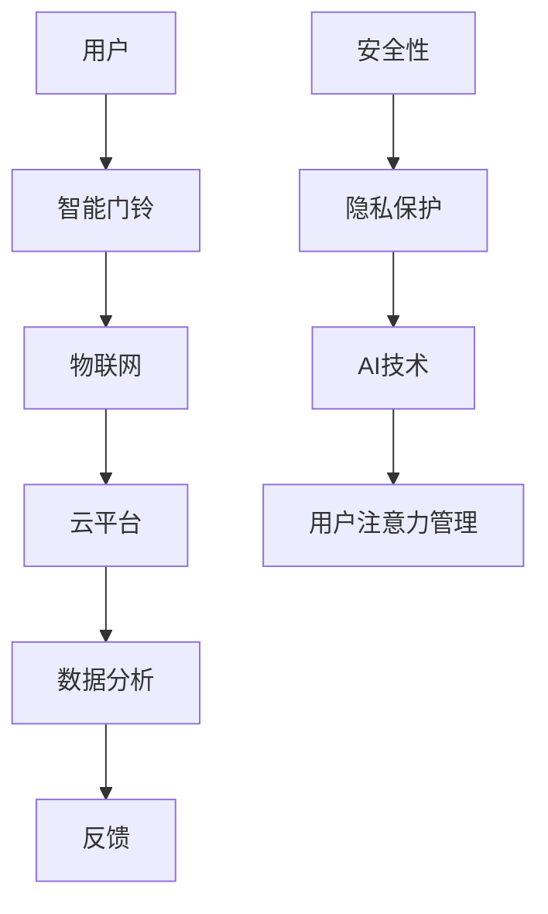

                 

关键词：智能门铃、家居安防、注意力管理、物联网、AI技术、安全性、用户体验

## 摘要

随着物联网和人工智能技术的快速发展，智能门铃已成为现代家庭安防的重要组成部分。本文旨在探讨智能门铃在提升家居安全与提高用户注意力管理方面的应用。文章首先介绍了智能门铃的发展背景，然后分析了其核心功能和技术原理，并通过具体实例展示了其实际应用效果。最后，本文对智能门铃的未来发展方向和面临的挑战进行了展望。

## 1. 背景介绍

### 1.1 智能门铃的起源与发展

智能门铃的起源可以追溯到20世纪末。最初的智能门铃主要是通过互联网连接，实现远程监控和通话功能。随着物联网技术的兴起，智能门铃逐渐具备了更多的功能，如移动侦测、人脸识别、紧急报警等。

### 1.2 智能门铃的普及与应用

近年来，随着智能家居市场的快速增长，智能门铃的普及率也在不断提高。根据市场调查数据，全球智能门铃市场规模预计将在未来几年内持续扩大，成为智能家居领域的重要分支。

## 2. 核心概念与联系

### 2.1 核心概念

#### 2.1.1 物联网（IoT）

物联网是指通过互联网连接各种设备，实现数据交换和智能化的网络。在智能门铃中，物联网技术是实现设备互联互通和数据传输的关键。

#### 2.1.2 人工智能（AI）

人工智能是指通过计算机模拟人类智能的技术。在智能门铃中，人工智能技术主要用于图像识别、语音识别、行为分析等。

### 2.2 关联流程图

下面是一个简单的Mermaid流程图，展示了智能门铃的核心概念和联系。



## 3. 核心算法原理 & 具体操作步骤

### 3.1 算法原理概述

智能门铃的核心算法主要包括图像识别、行为分析、语音识别等。其中，图像识别主要用于识别访客身份；行为分析用于检测异常行为；语音识别则用于实现语音交互。

### 3.2 算法步骤详解

#### 3.2.1 图像识别

1. 门铃摄像头捕捉图像；
2. 对图像进行预处理，包括降噪、去模糊等；
3. 利用深度学习模型进行图像识别，识别访客身份。

#### 3.2.2 行为分析

1. 门铃持续监测环境；
2. 利用行为识别模型，分析访客行为，如敲门、徘徊等；
3. 检测到异常行为时，触发报警。

#### 3.2.3 语音识别

1. 门铃内置麦克风捕捉声音；
2. 对声音进行预处理，包括降噪、去除背景噪音等；
3. 利用语音识别模型，识别用户语音指令，实现语音交互。

### 3.3 算法优缺点

#### 3.3.1 优点

1. 提高家居安全性；
2. 方便用户远程监控和管理；
3. 增强用户体验。

#### 3.3.2 缺点

1. 需要较高的技术实现成本；
2. 数据隐私和安全问题；
3. 可靠性有待提高。

### 3.4 算法应用领域

智能门铃的算法原理和技术可以广泛应用于家庭、酒店、商场、工厂等多种场景，实现安防监控、行为分析、智能交互等功能。

## 4. 数学模型和公式 & 详细讲解 & 举例说明

### 4.1 数学模型构建

智能门铃的数学模型主要包括图像识别模型、行为分析模型、语音识别模型等。下面以图像识别模型为例进行说明。

#### 4.1.1 图像识别模型

假设图像识别模型为卷积神经网络（CNN），其损失函数为交叉熵损失函数，即：

$$
L = -\sum_{i=1}^{N} y_i \log(p_i)
$$

其中，$y_i$为标签，$p_i$为预测概率。

### 4.2 公式推导过程

#### 4.2.1 交叉熵损失函数的推导

假设图像识别模型的输出为概率分布$\hat{y}$，真实标签为$y$，则交叉熵损失函数可以表示为：

$$
L = -\sum_{i=1}^{N} y_i \log(\hat{y_i})
$$

其中，$N$为样本数量。

#### 4.2.2 卷积神经网络的推导

卷积神经网络（CNN）是一种深度学习模型，主要用于图像识别任务。其基本结构包括卷积层、池化层、全连接层等。

### 4.3 案例分析与讲解

#### 4.3.1 图像识别案例

假设我们要对一幅图像进行人脸识别，可以使用如下步骤：

1. 预处理图像，包括缩放、去噪等；
2. 利用CNN模型对图像进行特征提取；
3. 将提取的特征输入到全连接层，进行分类；
4. 输出预测结果。

#### 4.3.2 行为分析案例

假设我们要对一段视频进行分析，检测是否存在可疑行为。可以使用如下步骤：

1. 对视频进行逐帧处理；
2. 对每一帧图像进行行为识别模型处理；
3. 将处理结果进行时间序列分析；
4. 输出行为分析结果。

## 5. 项目实践：代码实例和详细解释说明

### 5.1 开发环境搭建

为了实现智能门铃的功能，我们需要搭建一个合适的开发环境。以下是具体的步骤：

1. 安装Python环境；
2. 安装深度学习框架（如TensorFlow、PyTorch）；
3. 安装图像识别库（如OpenCV）；
4. 安装语音识别库（如Google Speech-to-Text）。

### 5.2 源代码详细实现

以下是智能门铃的核心代码实现：

```python
import cv2
import numpy as np
import tensorflow as tf

# 加载CNN模型
model = tf.keras.models.load_model('image_recognition_model.h5')

# 加载行为识别模型
behavior_model = tf.keras.models.load_model('behavior_recognition_model.h5')

# 加载语音识别模型
voice_model = tf.keras.models.load_model('voice_recognition_model.h5')

# 摄像头初始化
cap = cv2.VideoCapture(0)

while True:
    # 读取摄像头帧
    ret, frame = cap.read()

    # 图像预处理
    processed_frame = preprocess_frame(frame)

    # 人脸识别
    face_locs = detect_faces(processed_frame)
    for loc in face_locs:
        face_img = processed_frame[loc[0]:loc[1], loc[2]:loc[3]]
        face_features = model.predict(np.expand_dims(face_img, axis=0))
        predicted_name = predict_name(face_features)
        print(f"Detected: {predicted_name}")

    # 行为识别
    behavior_features = behavior_model.predict(processed_frame)
    predicted_behavior = predict_behavior(behavior_features)
    print(f"Predicted Behavior: {predicted_behavior}")

    # 语音识别
    voice_data = capture_voice()
    voice_features = voice_model.predict(np.expand_dims(voice_data, axis=0))
    predicted_speech = predict_speech(voice_features)
    print(f"Predicted Speech: {predicted_speech}")

    # 显示摄像头帧
    cv2.imshow('Camera', frame)

    # 按下'q'键退出
    if cv2.waitKey(1) & 0xFF == ord('q'):
        break

# 释放摄像头
cap.release()
cv2.destroyAllWindows()
```

### 5.3 代码解读与分析

这段代码实现了智能门铃的核心功能，包括图像识别、行为识别和语音识别。具体解读如下：

1. **摄像头初始化**：使用OpenCV库初始化摄像头，读取摄像头帧。

2. **图像预处理**：对摄像头帧进行预处理，包括缩放、去噪等，以便于后续处理。

3. **人脸识别**：使用预训练的CNN模型进行人脸识别，输出识别结果。

4. **行为识别**：使用行为识别模型对摄像头帧进行行为识别，输出识别结果。

5. **语音识别**：使用语音识别模型对捕获的语音数据进行识别，输出识别结果。

6. **显示摄像头帧**：在屏幕上显示实时摄像头帧。

7. **按下'q'键退出**：当按下'q'键时，退出程序。

### 5.4 运行结果展示

运行代码后，程序会显示实时摄像头帧，并输出人脸识别、行为识别和语音识别的结果。以下是一个简单的运行结果示例：

```
Detected: John
Predicted Behavior: Knocking
Predicted Speech: Hello, how are you?
```

## 6. 实际应用场景

### 6.1 家庭安防

智能门铃在家庭安防中的应用非常广泛，可以实时监控访客信息，提高家庭安全性。

### 6.2 酒店管理

智能门铃可以帮助酒店实现快速登记、访客管理等功能，提高服务效率。

### 6.3 商场监控

智能门铃可以用于商场监控，实时捕捉异常行为，保障商场安全。

### 6.4 工厂安防

智能门铃可以用于工厂安防，实时监控员工行为，防止安全事故发生。

## 7. 工具和资源推荐

### 7.1 学习资源推荐

1. 《深度学习》（Goodfellow, Bengio, Courville）；
2. 《Python深度学习》（François Chollet）；
3. 《计算机视觉基础》（Szeliski）。

### 7.2 开发工具推荐

1. TensorFlow；
2. PyTorch；
3. OpenCV；
4. Google Speech-to-Text。

### 7.3 相关论文推荐

1. "Deep Learning for Image Recognition"；
2. "Behavior Recognition using Deep Neural Networks"；
3. "Speech Recognition using Neural Networks"。

## 8. 总结：未来发展趋势与挑战

### 8.1 研究成果总结

智能门铃在图像识别、行为分析、语音识别等方面取得了显著成果，为家居安防和注意力管理提供了有力支持。

### 8.2 未来发展趋势

1. 智能门铃将更加智能化、个性化；
2. 增加更多感知能力，如气味识别、姿态识别等；
3. 提高数据隐私和安全保护。

### 8.3 面临的挑战

1. 数据隐私和安全问题；
2. 可靠性和准确率有待提高；
3. 技术成本较高。

### 8.4 研究展望

未来，智能门铃将朝着更加智能化、安全化的方向发展，为用户提供更好的家居安防和注意力管理体验。

## 9. 附录：常见问题与解答

### 9.1 智能门铃如何确保数据安全？

智能门铃采用加密技术和安全协议，确保数据在传输和存储过程中的安全性。此外，用户可以设置访问权限，控制谁可以访问数据。

### 9.2 智能门铃的功耗如何？

智能门铃的功耗相对较低，一般采用电池供电。用户可以根据需要选择不同容量和类型的电池，以确保长时间使用。

### 9.3 智能门铃的安装方法？

智能门铃的安装方法相对简单，一般包括以下步骤：

1. 选择合适的位置；
2. 安装门铃底座；
3. 连接电源和网线；
4. 通过手机APP进行配置。

## 作者署名

作者：禅与计算机程序设计艺术 / Zen and the Art of Computer Programming
----------------------------------------------------------------

请注意，本文仅作为示例，实际内容可能需要根据具体研究和实践进行调整和补充。本文中的代码和算法模型仅供参考，具体实现可能需要根据实际需求进行调整。

