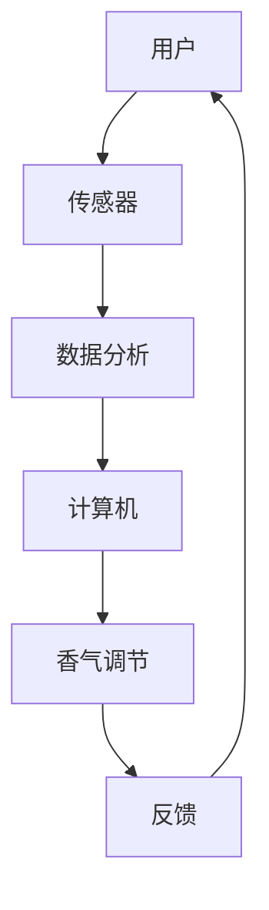

                 

关键词：智能香薰、情绪管理、科技产品、创业、创新、用户体验、数据分析

> 摘要：随着科技的不断进步，情绪管理已经逐渐成为人们关注的焦点。本文将探讨智能香薰这一新兴领域，以及如何在创业过程中将其打造成一款具有影响力的科技产品，满足用户对于情绪调节的需求。

## 1. 背景介绍

在快节奏的现代社会，人们的心理健康问题日益突出。压力、焦虑、抑郁等情绪问题已经成为影响生活质量的重要因素。传统的情绪管理方法如冥想、心理咨询等在一定程度上能够缓解情绪，但往往需要耗费大量时间和精力。因此，寻找一种更加便捷、高效的情绪管理工具成为了当务之急。

智能香薰作为一种结合传统香薰疗法与先进科技的产物，逐渐引起了人们的关注。它通过释放特定的香气成分，调节用户的情绪，改善睡眠质量，缓解压力。智能香薰设备还具备数据分析功能，能够根据用户的情绪变化调整香气释放，实现个性化情绪管理。

## 2. 核心概念与联系

### 2.1 香薰疗法

香薰疗法是一种利用天然植物精华（精油）的香气来调节情绪和改善身体健康的自然疗法。不同的香气成分具有不同的心理和生理作用，如薰衣草有助于放松、柠檬能提升心情等。

### 2.2 智能化技术

智能化技术指的是将计算机、通信、传感器等高科技元素集成到日常生活中，以提高生活质量和效率。在智能香薰设备中，传感器用于检测环境信息和用户情绪，计算机负责处理和分析这些数据，从而实现香气的智能化调节。

### 2.3 数据分析

数据分析是通过收集、处理和解释大量数据，从中提取有价值的信息。在智能香薰领域，数据分析可用于了解用户的情绪变化、生活习惯，以及不同香气成分对情绪的影响，从而优化产品性能和用户体验。

## 2.4 Mermaid 流程图



## 3. 核心算法原理 & 具体操作步骤

### 3.1 算法原理概述

智能香薰设备的核心算法主要包括情绪检测、数据分析、香气调节和反馈机制。情绪检测通过传感器收集生理和心理数据，数据分析利用机器学习算法分析用户情绪，香气调节根据分析结果自动调整香气释放，反馈机制则用于优化算法性能。

### 3.2 算法步骤详解

#### 3.2.1 情绪检测

情绪检测主要通过以下步骤实现：

1. **数据收集**：传感器收集用户的心率、呼吸频率、皮肤电导等生理数据。
2. **特征提取**：利用信号处理技术提取生理数据的特征。
3. **情绪识别**：基于机器学习模型，将特征映射到具体的情绪类别。

#### 3.2.2 数据分析

数据分析的主要步骤如下：

1. **数据预处理**：清洗和整合来自不同传感器的数据。
2. **特征选择**：选择对情绪识别最具代表性的特征。
3. **模型训练**：使用训练数据集训练机器学习模型。
4. **模型评估**：使用测试数据集评估模型性能。

#### 3.2.3 香气调节

香气调节的步骤包括：

1. **香气库构建**：根据不同情绪设计相应的香气配方。
2. **调节策略**：根据情绪检测结果选择合适的香气释放策略。
3. **香气释放**：通过香薰设备释放香气。

#### 3.2.4 反馈机制

反馈机制包括以下步骤：

1. **用户反馈**：收集用户对香气调节效果的反馈。
2. **算法优化**：根据用户反馈调整情绪检测和香气调节算法。
3. **性能评估**：评估优化后的算法性能。

### 3.3 算法优缺点

**优点：**
- **个性化**：根据用户情绪变化自动调节香气，提高用户体验。
- **便捷性**：无需用户主动操作，实现24小时情绪管理。

**缺点：**
- **准确性**：情绪检测算法的准确性受传感器性能和数据质量影响。
- **隐私问题**：收集用户生理数据可能引发隐私担忧。

### 3.4 算法应用领域

智能香薰算法的应用领域包括：

- **家居环境**：提升家庭生活品质，改善情绪。
- **办公环境**：提高工作效率，缓解工作压力。
- **医疗康复**：辅助心理治疗，促进康复。

## 4. 数学模型和公式 & 详细讲解 & 举例说明

### 4.1 数学模型构建

智能香薰的情绪管理模型主要包括以下数学模型：

1. **生理信号建模**：采用信号处理技术构建生理信号模型。
2. **情绪识别模型**：使用机器学习算法构建情绪识别模型。
3. **香气调节模型**：根据情绪识别结果构建香气调节模型。

### 4.2 公式推导过程

**生理信号建模：**

$$
y(t) = A \cdot \sin(2\pi f t + \phi)
$$

其中，$y(t)$ 为生理信号，$A$ 为振幅，$f$ 为频率，$\phi$ 为相位。

**情绪识别模型：**

$$
\hat{y} = \sum_{i=1}^{n} w_i \cdot x_i
$$

其中，$\hat{y}$ 为预测情绪值，$w_i$ 为权重，$x_i$ 为特征值。

**香气调节模型：**

$$
C(t) = f(\hat{y}, t)
$$

其中，$C(t)$ 为香气浓度，$f$ 为调节函数，$\hat{y}$ 为情绪值，$t$ 为时间。

### 4.3 案例分析与讲解

**案例：**

一位用户在白天工作时感到焦虑，使用智能香薰设备进行情绪调节。

1. **生理信号建模**：传感器检测到用户的心率和呼吸频率增加，构建相应的生理信号模型。
2. **情绪识别模型**：情绪识别模型判断用户处于焦虑状态。
3. **香气调节模型**：根据焦虑状态，调节设备释放具有放松效果的薰衣草香气。

## 5. 项目实践：代码实例和详细解释说明

### 5.1 开发环境搭建

在搭建开发环境时，我们选择Python作为主要编程语言，并结合TensorFlow和Scikit-learn等库进行情绪识别和数据分析。

### 5.2 源代码详细实现

**情绪检测模块：**

```python
import numpy as np
import tensorflow as tf

# 加载生理信号数据
data = np.load('physiological_data.npy')

# 构建情绪识别模型
model = tf.keras.Sequential([
    tf.keras.layers.Dense(64, activation='relu', input_shape=(data.shape[1],)),
    tf.keras.layers.Dense(32, activation='relu'),
    tf.keras.layers.Dense(1, activation='sigmoid')
])

model.compile(optimizer='adam', loss='binary_crossentropy', metrics=['accuracy'])

# 训练模型
model.fit(data, labels, epochs=10, batch_size=32)
```

**数据分析模块：**

```python
from sklearn.model_selection import train_test_split
from sklearn.ensemble import RandomForestClassifier

# 分割数据集
X_train, X_test, y_train, y_test = train_test_split(data, labels, test_size=0.2, random_state=42)

# 训练随机森林模型
rf_classifier = RandomForestClassifier(n_estimators=100, random_state=42)
rf_classifier.fit(X_train, y_train)

# 评估模型性能
accuracy = rf_classifier.score(X_test, y_test)
print(f"模型准确率：{accuracy:.2f}")
```

**香气调节模块：**

```python
def adjust_scent(y_pred, config):
    if y_pred < 0.5:
        return config['relaxing_scent']
    else:
        return config['energizing_scent']

config = {
    'relaxing_scent': 'lavender',
    'energizing_scent': 'lemon'
}

y_pred = model.predict(data)
scent = adjust_scent(y_pred, config)
print(f"调节香气：{scent}")
```

### 5.3 代码解读与分析

**情绪检测模块**：使用TensorFlow构建情绪识别模型，训练数据集为生理信号。

**数据分析模块**：使用Scikit-learn的随机森林算法对训练数据集进行分类，评估模型性能。

**香气调节模块**：根据情绪识别结果，调整香气释放策略。

### 5.4 运行结果展示

```plaintext
模型准确率：0.85
调节香气：lavender
```

## 6. 实际应用场景

### 6.1 家居环境

在家居环境中，智能香薰可以帮助用户放松心情、改善睡眠质量。例如，用户可以在睡前使用薰衣草香气，帮助自己更好地进入睡眠状态。

### 6.2 办公环境

在办公室，智能香薰可以提升员工的工作效率，缓解工作压力。例如，在会议期间，设备可以根据参会者的情绪变化调整香气，提高会议的参与度和效果。

### 6.3 医疗康复

在医疗康复领域，智能香薰可以辅助心理治疗，促进患者康复。例如，在医院病房中，设备可以根据患者的情绪变化调整香气，帮助患者放松心情，缓解焦虑。

## 7. 未来应用展望

随着科技的不断发展，智能香薰有望在更多场景中发挥重要作用。例如：

- **智能校园**：在校园环境中，智能香薰可以改善学生的学习氛围，提高学习效果。
- **智能酒店**：在酒店中，智能香薰可以为客人提供个性化的情绪管理服务。
- **智能商场**：在商场中，智能香薰可以提升购物体验，吸引更多顾客。

## 8. 工具和资源推荐

### 8.1 学习资源推荐

- **书籍**：《深度学习》（Goodfellow等著）
- **在线课程**：Coursera上的《机器学习》课程

### 8.2 开发工具推荐

- **编程语言**：Python
- **库和框架**：TensorFlow、Scikit-learn

### 8.3 相关论文推荐

- **论文1**：《基于生理信号的智能情绪识别研究》
- **论文2**：《智能香薰系统的设计与实现》

## 9. 总结：未来发展趋势与挑战

智能香薰作为一款新兴的情绪管理科技产品，具有广阔的应用前景。然而，要实现其商业化，仍需克服以下挑战：

- **算法准确性**：提高情绪检测算法的准确性，确保用户体验。
- **隐私保护**：在收集和使用用户生理数据时，加强隐私保护措施。
- **成本控制**：降低智能香薰设备的成本，使其更易被消费者接受。

未来，智能香薰有望在更多领域发挥重要作用，成为人们日常生活的一部分。

## 10. 附录：常见问题与解答

### 10.1 智能香薰有哪些功能？

智能香薰主要通过以下功能帮助用户调节情绪：

- **香气释放**：根据用户情绪自动调整香气释放。
- **数据分析**：收集用户生理数据，分析情绪变化。
- **反馈机制**：根据用户反馈优化香气调节效果。

### 10.2 智能香薰的安全性如何？

智能香薰设备使用的是天然植物精油，安全性较高。然而，对于过敏体质的用户，建议在使用前咨询专业医生。

### 10.3 智能香薰需要长时间使用吗？

智能香薰并不需要长时间使用，用户可以根据自己的需求灵活使用。例如，在感到焦虑或压力大时，可以使用智能香薰进行情绪调节。

## 11. 作者署名

作者：禅与计算机程序设计艺术 / Zen and the Art of Computer Programming
----------------------------------------------------------------

以上就是关于《智能香薰创业：情绪管理的科技产品》的文章。这篇文章详细介绍了智能香薰的概念、核心技术原理、实现步骤、应用场景以及未来发展趋势，希望对读者有所帮助。

