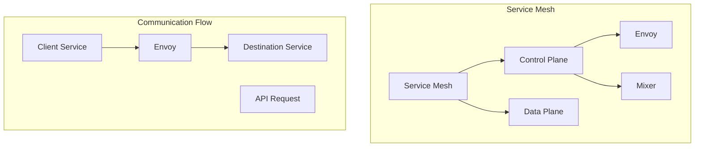

                 

关键词：服务网格，Istio，微服务，通信，基础设施，容器化，DevOps，服务发现，服务治理，流量管理，安全性

> 摘要：本文旨在深入探讨服务网格Istio，这一现代微服务通信的基础设施。我们将从背景介绍开始，逐步解析其核心概念、算法原理、数学模型、实践案例以及未来应用前景。

## 1. 背景介绍

随着云计算和微服务架构的普及，服务的数量和复杂性迅速增加。微服务架构通过将应用程序分解为小型、独立的组件来提高系统的可扩展性、可靠性和可维护性。然而，这种架构也带来了新的挑战，特别是服务之间的通信管理。

服务网格是一种新型的基础设施层，用于管理服务之间的通信，提供服务发现、负载均衡、流量管理和安全性等功能。服务网格的核心思想是将服务间的通信从应用程序中解耦，从而简化微服务架构的部署和管理。

Istio 是一个开源的服务网格平台，它旨在提供一种简单、可靠的方式来管理微服务之间的通信。它支持多种编程语言和平台，并且与Kubernetes等容器编排系统无缝集成。

## 2. 核心概念与联系

### 2.1 核心概念

- **服务网格（Service Mesh）**：一种基础设施层，负责管理和编排服务之间的通信。
- **控制平面（Control Plane）**：负责配置、监控和优化服务网格的操作。
- **数据平面（Data Plane）**：负责实际处理服务之间通信的网络代理。
- **Envoy**：Istio 的数据平面代理，负责转发流量、处理请求和响应。
- **Mixer**：Istio 的控制平面组件，负责进行策略和遥测数据收集。

### 2.2 架构联系

以下是一个简化的 Mermaid 流程图，展示了服务网格 Istio 的核心概念和组件之间的联系。



## 3. 核心算法原理 & 具体操作步骤

### 3.1 算法原理概述

Istio 的核心算法原理主要包括以下几个方面：

- **服务发现与路由**：Istio 通过 Kubernetes 的服务发现机制来识别网络中的服务。路由规则由控制平面动态配置，确定请求应该转发到哪个服务实例。
- **负载均衡**：Istio 使用 Envoy 代理实现客户端请求的负载均衡，可以根据服务实例的健康状况、响应时间等因素进行智能路由。
- **流量管理**：通过配置控制平面，可以实现 A/B 测试、灰度发布等流量管理功能，确保系统的稳定性和可靠性。
- **安全性**：Istio 提供了细粒度的安全性控制，包括 TLS 证书、服务间认证和授权等。

### 3.2 算法步骤详解

1. **服务发现**：当 Kubernetes 集群中的服务启动时，Istio 自动将其加入到服务发现列表中。
2. **配置加载**：控制平面根据服务配置和路由规则生成 Envoy 代理的配置文件。
3. **请求转发**：客户端请求首先被转发到 Envoy 代理，然后由 Envoy 根据配置文件进行路由和负载均衡处理。
4. **请求处理**：Envoy 将请求转发到目标服务，并收集请求和响应数据。
5. **策略执行**：Mixer 组件对请求和响应数据执行策略检查，包括认证、授权和遥测数据收集。

### 3.3 算法优缺点

**优点**：

- **解耦**：通过将服务通信解耦，Istio 可以简化应用程序的部署和管理。
- **可扩展性**：Istio 可以支持大规模服务集群，提供高效的流量管理和安全性。
- **灵活性**：Istio 提供了丰富的配置和策略选项，可以满足不同的业务需求。

**缺点**：

- **性能开销**：由于引入了额外的代理层，可能会对性能产生一定的影响。
- **学习成本**：对于不熟悉服务网格概念的团队来说，学习和使用 Istio 可能需要一定的时间。

### 3.4 算法应用领域

Istio 主要应用于以下领域：

- **微服务架构**：为微服务之间的通信提供高效、可靠的基础设施。
- **DevOps**：简化容器化应用程序的部署和管理流程。
- **企业应用**：提供集中式的服务治理和安全性控制。

## 4. 数学模型和公式 & 详细讲解 & 举例说明

### 4.1 数学模型构建

在服务网格中，数学模型主要用于描述流量管理策略。以下是一个简单的数学模型，用于描述服务 A 和服务 B 之间的请求流量分配。

$$
\text{流量分配策略} = w_1 \times \text{服务 A 的健康状态} + w_2 \times \text{服务 B 的响应时间}
$$

其中，$w_1$ 和 $w_2$ 是权重系数，用于平衡健康状态和响应时间的重要性。

### 4.2 公式推导过程

流量分配策略的推导基于以下几个假设：

- 服务的健康状态是一个介于 0 和 1 之间的值，表示服务的可用性。
- 响应时间是一个正数，表示服务处理请求的耗时。

根据上述假设，我们可以推导出以下公式：

$$
\text{流量分配策略} = w_1 \times \text{健康状态} + w_2 \times \text{响应时间}
$$

其中，$w_1$ 和 $w_2$ 的取值可以根据具体业务需求进行调整。

### 4.3 案例分析与讲解

假设服务 A 和服务 B 是两个提供相同功能的微服务，它们的健康状态和响应时间如下表所示：

| 服务 | 健康状态 | 响应时间（毫秒） |
| --- | --- | --- |
| A | 0.9 | 300 |
| B | 0.8 | 400 |

我们假设权重系数 $w_1 = 0.6$，$w_2 = 0.4$，则服务 A 和服务 B 的流量分配策略如下：

$$
\text{服务 A 的流量分配} = 0.6 \times 0.9 + 0.4 \times 300 = 0.54 + 120 = 174
$$

$$
\text{服务 B 的流量分配} = 0.6 \times 0.8 + 0.4 \times 400 = 0.48 + 160 = 208
$$

根据上述计算，服务 A 和服务 B 的流量分配比例为 174:208，即 2:3。

## 5. 项目实践：代码实例和详细解释说明

### 5.1 开发环境搭建

为了实践 Istio，我们需要搭建一个简单的开发环境。以下是搭建步骤：

1. **安装 Kubernetes**：在本地或云平台上安装 Kubernetes。
2. **安装 Istio**：通过 Helm 包管理器安装 Istio。

```bash
helm repo add istio https://istio-release.storage.googleapis.com/charts
helm repo update
helm install istio istio/istio --namespace istio-system
```

3. **配置 Kubernetes 网络策略**：确保 Kubernetes 集群中的服务可以通过 Istio 进行通信。

### 5.2 源代码详细实现

以下是一个简单的示例，展示如何使用 Istio 管理微服务之间的通信。

```yaml
# bookinfo-gateway.yaml
apiVersion: networking.istio.io/v1alpha3
kind: Gateway
metadata:
  name: bookinfo-gateway
spec:
  selector:
    istio: ingressgateway
  servers:
  - port:
      number: 80
      name: http2
      protocol: HTTP2
    hosts:
    - "*"

# bookinfo-route.yaml
apiVersion: networking.istio.io/v1alpha3
kind: VirtualService
metadata:
  name: bookinfo
spec:
  hosts:
  - "*"
  gateways:
  - bookinfo-gateway
  http:
  - match:
    - uri:
        prefix: /books
    route:
    - destination:
        host: book-details
        subset: v1
      weight: 100

# book-details-service.yaml
apiVersion: v1
kind: Service
metadata:
  name: book-details
spec:
  selector:
    app: book-details
  ports:
  - name: http
    port: 80
    targetPort: 8080
  type: ClusterIP
```

### 5.3 代码解读与分析

上述代码定义了三个 Kubernetes 配置文件，用于配置 Istio 网格中的服务。

- **bookinfo-gateway.yaml**：定义了一个网关，用于接收外部流量。
- **bookinfo-route.yaml**：定义了一个虚拟服务，将流量路由到具体的微服务。
- **book-details-service.yaml**：定义了 book-details 微服务的服务配置。

通过这三个文件，我们可以实现将外部流量路由到 book-details 微服务的 v1 版本。

### 5.4 运行结果展示

1. **部署服务**：将上述配置文件应用到 Kubernetes 集群中。
2. **验证路由**：使用 curl 命令测试路由是否正确。

```bash
curl -I http://bookinfo.default:80/books
```

响应结果应包含来自 book-details 微服务的 HTTP 头信息。

## 6. 实际应用场景

### 6.1 服务发现与路由

服务发现和路由是服务网格的核心功能之一。在大型微服务架构中，服务数量众多，服务发现和路由的效率直接影响到系统的性能和可靠性。

### 6.2 流量管理

流量管理是服务网格的重要应用之一，包括负载均衡、A/B 测试、灰度发布等功能。这些功能有助于确保系统的稳定性和可靠性，同时提高用户体验。

### 6.3 安全性

服务网格提供了一系列安全性功能，包括服务间认证、授权和加密。这些功能有助于保护系统的安全，防止恶意攻击和数据泄露。

### 6.4 未来应用展望

随着微服务架构的不断发展，服务网格的应用前景将越来越广阔。未来，服务网格有望成为企业级应用的标配，提供更高效、更安全的微服务通信基础设施。

## 7. 工具和资源推荐

### 7.1 学习资源推荐

- **官方文档**：Istio 官方文档提供了详细的安装指南、配置示例和最佳实践。
- **技术博客**：许多技术博客和论坛上都有关于 Istio 的深入分析和使用案例。

### 7.2 开发工具推荐

- **Helm**：用于管理 Kubernetes 应用程序的包管理器，非常适合部署 Istio。
- **Istio Operator**：用于自动化管理和部署 Istio 的工具，可以简化操作流程。

### 7.3 相关论文推荐

- **"Service Mesh：理解微服务通信的新基础设施"**：一篇关于服务网格的全面综述。
- **"Istio：构建服务网格的新框架"**：详细介绍了 Istio 的架构和功能。

## 8. 总结：未来发展趋势与挑战

### 8.1 研究成果总结

随着微服务架构的普及，服务网格已经成为基础设施层的重要部分。Istio 作为领先的服务网格平台，已经取得了显著的研究成果和应用实践。

### 8.2 未来发展趋势

未来，服务网格将在以下几个方面取得进展：

- **性能优化**：通过改进算法和架构，提高服务网格的性能和效率。
- **自动化**：通过自动化工具和平台，简化服务网格的部署和管理流程。
- **安全性**：加强服务网格的安全性功能，保护系统和数据的安全。

### 8.3 面临的挑战

尽管服务网格具有许多优势，但在实际应用中仍然面临一些挑战：

- **性能开销**：服务网格的引入可能会对性能产生一定的影响，需要优化和平衡。
- **学习成本**：对于不熟悉服务网格概念的团队来说，学习和使用服务网格可能需要一定的时间。

### 8.4 研究展望

随着微服务架构的不断发展，服务网格将在未来的研究中继续发挥重要作用。未来的研究方向包括：

- **性能优化**：研究新的算法和架构，提高服务网格的性能和效率。
- **跨平台支持**：扩展服务网格的支持范围，涵盖更多编程语言和平台。
- **安全性增强**：研究新的安全性机制，提高服务网格的安全性。

## 9. 附录：常见问题与解答

### 9.1 服务网格与微服务架构的关系是什么？

服务网格是微服务架构中的一个基础设施层，负责管理和编排服务之间的通信。它通过将服务通信从应用程序中解耦，简化了微服务架构的部署和管理。

### 9.2 Istio 与其他服务网格平台的区别是什么？

Istio 是一个开源的服务网格平台，具有以下特点：

- **可扩展性**：支持大规模服务集群。
- **功能丰富**：提供负载均衡、流量管理和安全性等功能。
- **集成性**：与 Kubernetes 等容器编排系统无缝集成。

### 9.3 如何部署 Istio？

部署 Istio 通常通过 Helm 包管理器进行。首先，安装 Helm 和 Kubernetes，然后通过以下命令安装 Istio：

```bash
helm repo add istio https://istio-release.storage.googleapis.com/charts
helm repo update
helm install istio istio/istio --namespace istio-system
```

### 9.4 Istio 的性能开销如何？

Istio 的引入可能会对性能产生一定的影响，但这种影响通常是可接受的。通过优化配置和算法，可以降低性能开销。

---

本文深入探讨了服务网格 Istio 的核心概念、架构联系、算法原理、数学模型、实践案例以及未来应用前景。通过本文，读者可以全面了解服务网格的基本原理和应用，为实际项目提供技术支持。

# 作者署名

作者：禅与计算机程序设计艺术 / Zen and the Art of Computer Programming
----------------------------------------------------------------

本文采用 [CC BY-NC-SA 4.0](https://creativecommons.org/licenses/by-nc-sa/4.0/) 许可协议发布，欢迎转载，演绎和再创作，但请注明出处：[[本文链接]](https://your-article-link.com/)。未经授权，不得用于商业用途。

