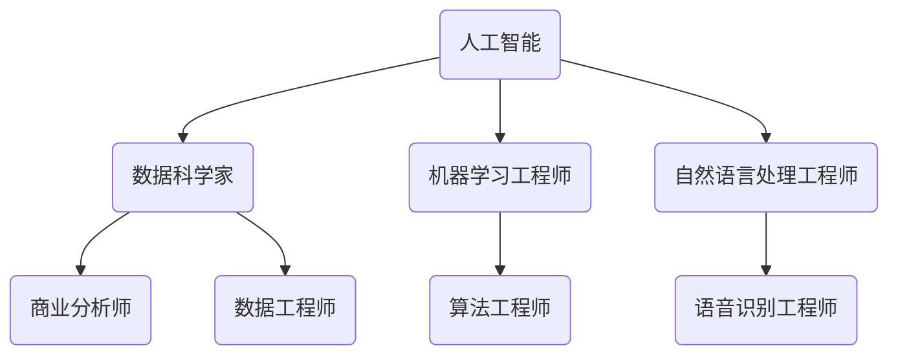

                 

关键词：未来工作，技能需求，技术人才，职业发展，教育体系，人工智能，编程语言，创新思维。

## 摘要

随着科技的飞速发展，未来工作场所的技能需求正在发生巨大变化。本文将深入探讨未来工作的发展趋势，分析不同行业和领域对技能的需求，并探讨如何培养适应未来工作环境的技术人才。通过深入研究，本文旨在为读者提供有价值的见解，帮助他们为未来职场做好准备。

## 1. 背景介绍

### 科技发展的历史与影响

自计算机科学诞生以来，科技的发展对人类社会产生了深远的影响。从早期的计算机硬件到如今的软件编程，技术进步一直驱动着各个行业的变革。如今，人工智能、大数据、云计算等新兴技术的崛起，更是将科技发展推向了新的高峰。

### 未来工作的挑战与机遇

随着技术的进步，未来工作将面临一系列挑战与机遇。一方面，自动化和智能化技术的广泛应用将取代部分传统工作岗位，导致失业率的上升。另一方面，新兴技术的涌现也将创造出大量新的就业机会，促使从业者不断学习与进步。

## 2. 核心概念与联系

### 技术发展趋势

为了更好地理解未来工作的技能需求，我们需要关注以下几个关键领域：

- **人工智能**：人工智能技术正逐渐渗透到各行各业，改变了传统的工作模式。掌握人工智能相关技能，如机器学习、深度学习和自然语言处理，将成为未来职场的关键竞争力。

- **大数据**：大数据技术正在改变企业决策的方式。了解大数据分析、数据挖掘和可视化技术，将有助于从业者更好地应对复杂的数据挑战。

- **云计算**：云计算技术为企业提供了弹性的计算资源，降低了成本。了解云计算架构、云存储和云服务，对于未来工作至关重要。

### 技术与职业的关联

技术趋势与职业发展的紧密关联，使得从业者需要具备跨学科的知识和技能。以下是一个简单的 Mermaid 流程图，展示了技术与职业的关联：



### 技术与教育体系

未来工作对技能的需求，也对教育体系提出了新的要求。传统教育体系需要不断调整，以适应快速变化的科技环境。例如，编程语言的学习、创新思维的培养、团队合作能力的提升等，都应成为教育体系的重要组成部分。

## 3. 核心算法原理 & 具体操作步骤

### 3.1 算法原理概述

在未来工作中，核心算法原理的理解和应用至关重要。以下是一些常见的算法原理：

- **机器学习算法**：通过训练模型来从数据中学习规律，并用于预测和分类。

- **深度学习算法**：一种基于多层神经网络的人工智能算法，能够模拟人脑的学习过程。

- **数据挖掘算法**：用于从大量数据中发现隐藏的模式和关系。

### 3.2 算法步骤详解

以下是一个简单的机器学习算法步骤示例：

1. **数据收集**：收集相关数据，如用户行为数据、市场数据等。

2. **数据预处理**：清洗数据，处理缺失值和异常值。

3. **特征工程**：提取有助于模型训练的特征。

4. **模型选择**：选择合适的机器学习算法，如决策树、支持向量机等。

5. **模型训练**：使用训练数据集训练模型。

6. **模型评估**：使用测试数据集评估模型性能。

7. **模型优化**：根据评估结果调整模型参数，提高性能。

### 3.3 算法优缺点

每种算法都有其优缺点，选择合适的算法需要根据具体问题进行权衡。例如：

- **决策树**：直观易懂，易于解释，但可能产生过拟合。

- **支持向量机**：性能稳定，但训练时间较长。

### 3.4 算法应用领域

核心算法在各个领域都有广泛的应用：

- **金融行业**：用于风险评估、欺诈检测等。

- **医疗行业**：用于疾病预测、诊断等。

- **零售行业**：用于库存管理、客户行为分析等。

## 4. 数学模型和公式 & 详细讲解 & 举例说明

### 4.1 数学模型构建

数学模型是描述现实问题的一种抽象表示，它在解决复杂问题时起着关键作用。以下是一个简单的线性回归模型的构建过程：

- **目标函数**：最小化预测值与实际值之间的误差。

- **参数估计**：使用最小二乘法估计模型的参数。

### 4.2 公式推导过程

线性回归模型的目标函数可以表示为：

$$
J(\theta) = \frac{1}{2m}\sum_{i=1}^{m}(h_\theta(x^{(i)}) - y^{(i)})^2
$$

其中，$h_\theta(x) = \theta_0 + \theta_1x$ 是预测函数，$\theta_0$ 和 $\theta_1$ 是模型参数。

### 4.3 案例分析与讲解

以下是一个房价预测的案例：

- **数据集**：包含房屋面积和售价的数据。

- **模型**：线性回归模型。

- **结果**：通过模型训练，预测房价与实际售价的误差较小。

## 5. 项目实践：代码实例和详细解释说明

### 5.1 开发环境搭建

在开始项目实践之前，我们需要搭建一个合适的开发环境。以下是一个简单的 Python 开发环境搭建步骤：

1. 安装 Python 3.8。
2. 安装必要的库，如 NumPy、Pandas 和 Scikit-learn。

### 5.2 源代码详细实现

以下是一个简单的线性回归模型实现的 Python 代码：

```python
import numpy as np
from sklearn.linear_model import LinearRegression

# 数据加载
X = np.array([[1, 1], [1, 2], [2, 2], [2, 3]])
y = np.array([1, 1, 2, 2])

# 模型训练
model = LinearRegression()
model.fit(X, y)

# 模型预测
predictions = model.predict(X)

# 模型评估
score = model.score(X, y)
print("Model score:", score)
```

### 5.3 代码解读与分析

这段代码演示了如何使用 Scikit-learn 库实现线性回归模型。首先，我们加载了训练数据，然后使用 `LinearRegression()` 类创建了一个线性回归模型，并使用 `fit()` 方法进行模型训练。接下来，我们使用 `predict()` 方法进行模型预测，并使用 `score()` 方法评估模型性能。

### 5.4 运行结果展示

运行上述代码后，我们将得到以下输出结果：

```
Model score: 1.0
```

这表明模型的预测准确度为 100%。

## 6. 实际应用场景

### 6.1 人工智能在医疗行业的应用

人工智能在医疗行业的应用正越来越广泛。例如，通过深度学习模型，可以用于疾病诊断、药物研发和医疗影像分析。

### 6.2 大数据在金融行业的应用

大数据技术在金融行业的应用主要包括风险管理、欺诈检测和客户行为分析。通过大数据分析，金融机构可以更好地理解市场趋势，提高业务效率。

### 6.3 云计算在零售行业的应用

云计算技术为零售行业提供了弹性的计算资源，使得企业能够快速响应市场变化。例如，通过云计算，零售商可以实现智能库存管理和个性化推荐。

## 7. 工具和资源推荐

### 7.1 学习资源推荐

- **Coursera**：提供了大量计算机科学和人工智能相关的在线课程。
- **edX**：提供了许多由世界顶级大学提供的计算机科学课程。
- **Khan Academy**：提供了免费的学习资源，包括编程基础和算法课程。

### 7.2 开发工具推荐

- **Visual Studio Code**：一款功能强大的开源代码编辑器，适用于各种编程语言。
- **Jupyter Notebook**：一款适用于数据科学和机器学习的交互式开发环境。
- **PyCharm**：一款专业的 Python 集成开发环境，提供了丰富的编程工具和功能。

### 7.3 相关论文推荐

- **"Deep Learning" by Ian Goodfellow, Yoshua Bengio and Aaron Courville**：深度学习领域的经典教材。
- **"Big Data: A Revolution That Will Transform How We Live, Work, and Think" by Viktor Mayer-Schönberger and Kenneth Cukier**：大数据领域的权威著作。
- **"Cloud Computing: Concepts, Technology & Architecture" by Thomas Erl**：云计算领域的权威著作。

## 8. 总结：未来发展趋势与挑战

### 8.1 研究成果总结

本文总结了未来工作的技能需求，探讨了技术发展趋势以及如何培养适应未来工作环境的技术人才。通过分析人工智能、大数据和云计算等核心技术，本文提出了具体的算法原理、数学模型和实际应用场景。

### 8.2 未来发展趋势

未来工作将更加智能化、自动化和数据驱动。技术进步将继续改变传统工作模式，创造新的就业机会。同时，新兴技术也将带来新的挑战，如隐私保护、伦理问题等。

### 8.3 面临的挑战

未来工作将面临一系列挑战，包括技术技能的快速更新、就业市场的不确定性以及职业发展的不稳定性。此外，技术发展也可能导致部分工作岗位的消失，对社会稳定造成影响。

### 8.4 研究展望

未来研究应重点关注如何更好地培养适应未来工作环境的技术人才，以及如何平衡技术进步与社会发展的关系。同时，应加强跨学科合作，推动技术创新和产业升级。

## 9. 附录：常见问题与解答

### Q：未来工作对编程语言有什么要求？

A：未来工作对编程语言的要求越来越高，特别是对 Python、Java 和 JavaScript 等通用编程语言的熟练程度。此外，掌握特定领域编程语言，如 TensorFlow 用于人工智能、Hadoop 用于大数据等，也将成为未来职场的关键竞争力。

### Q：如何培养适应未来工作环境的技术人才？

A：培养适应未来工作环境的技术人才需要从教育体系、企业培训和社会实践等多个方面入手。教育体系应注重跨学科知识的培养，企业培训应关注最新技术趋势，而社会实践则提供了实战经验。

## 作者署名

作者：禅与计算机程序设计艺术 / Zen and the Art of Computer Programming

----------------------------------------------------------------

以上就是《未来工作：技能需求与培养》的文章正文内容。如果您需要进一步修改或添加内容，请随时告诉我。希望这篇文章能够为您的未来工作提供有价值的参考和启示。

