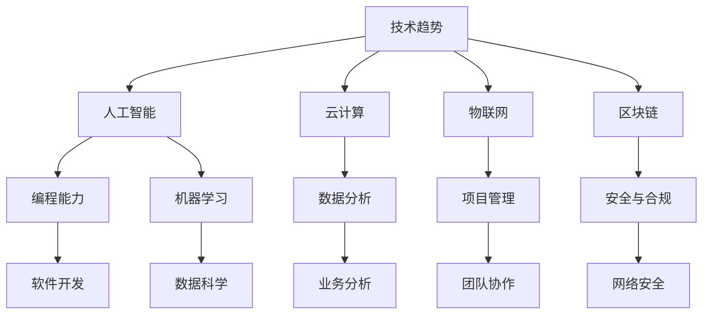

                 

关键词：技能需求、职业发展、人才培养、技术趋势、人工智能、编程语言、软技能、实践经验

> 摘要：本文旨在探讨未来工作中的技能需求以及如何进行有效的技能培养。随着技术的迅猛发展，技能要求不断升级，个人与组织必须及时适应，以确保在职业市场中保持竞争力。本文将详细分析当前和未来的技术趋势，阐述关键技能的要求，并提出有效的学习与实践方法，以帮助读者在未来的职业生涯中取得成功。

## 1. 背景介绍

当前，全球正经历着一场前所未有的技术革命，人工智能、云计算、物联网等新兴技术正在深刻改变我们的工作方式和生活方式。随着技术的进步，工作环境中的技能需求也在不断演变。传统的职业技能已不再满足现代工作场所的需求，新的技能和知识体系正在迅速崛起。

面对这一趋势，个人和组织都在思考如何适应并利用这些变化，以实现长期的发展。个人需要不断学习新技能，保持知识的更新，而组织则需要构建适应未来技能需求的人才培养体系。本文将从技术趋势、技能需求、培养方法等多个角度，探讨未来工作的技能需求与培养策略。

## 2. 核心概念与联系

为了更好地理解未来工作的技能需求，我们首先需要明确几个核心概念，并探讨它们之间的相互联系。

### 2.1 技术趋势

技术趋势是未来工作技能需求的重要驱动力。以下是一些当前和未来的关键技术趋势：

- **人工智能（AI）**: 人工智能正在改变各行各业的运作方式，从自动化流程到智能决策系统，AI正逐步成为企业创新的核心。

- **云计算**: 云计算提供了弹性、可扩展的计算资源，使得企业可以更高效地管理和使用IT资源。

- **物联网（IoT）**: 物联网技术正在将物理世界与数字世界连接起来，带来前所未有的数据量和数据处理需求。

- **区块链**: 区块链技术的不可篡改性和透明性使其在金融、供应链等多个领域具有广泛的应用前景。

### 2.2 技能需求

技术趋势直接影响技能需求。以下是一些关键技能：

- **编程能力**: 编程技能是现代工作场所的基石，无论是开发软件还是自动化流程，编程都是必不可少的。

- **数据分析**: 数据已成为新的石油，具备数据分析技能的人才能从海量数据中提取有价值的信息。

- **机器学习**: 机器学习技能在AI领域至关重要，它使得计算机能够从数据中学习并做出预测。

- **项目管理**: 随着项目复杂性的增加，项目管理技能变得尤为重要，它关乎项目的成功与否。

### 2.3 Mermaid 流程图

以下是一个简单的Mermaid流程图，展示了技术趋势、技能需求与人才培养之间的联系：



## 3. 核心算法原理 & 具体操作步骤

### 3.1 算法原理概述

在探讨未来工作的技能需求之前，我们首先需要了解一些核心算法原理，这些原理对于理解和掌握相关技能至关重要。以下是一些关键的算法原理：

- **深度学习**: 深度学习是一种基于人工神经网络的算法，能够从大量数据中自动提取特征，进行分类、回归等任务。

- **数据结构**: 数据结构是计算机存储数据的方式，包括数组、链表、栈、队列等，它们对于编写高效代码至关重要。

- **算法分析**: 算法分析是一种评估算法性能的方法，它通过计算算法的时间复杂度和空间复杂度，帮助我们选择最优的解决方案。

### 3.2 算法步骤详解

以下是一个简单的深度学习算法的步骤详解：

#### 步骤 1: 数据准备

- **收集数据**: 从各种来源收集大量数据，如文本、图像、音频等。
- **数据清洗**: 清洗数据，去除噪声和错误，确保数据的准确性。

#### 步骤 2: 特征提取

- **特征工程**: 根据任务需求，提取有用的特征，如文本中的词向量、图像中的边缘等。
- **特征标准化**: 对特征进行标准化处理，使其具有相似的范围和尺度。

#### 步骤 3: 模型构建

- **选择模型**: 根据任务类型，选择合适的深度学习模型，如卷积神经网络（CNN）、循环神经网络（RNN）等。
- **模型训练**: 使用梯度下降等优化算法，训练模型参数，使其在训练数据上达到良好的性能。

#### 步骤 4: 模型评估

- **交叉验证**: 使用交叉验证方法，评估模型在未见过的数据上的性能。
- **性能指标**: 根据任务类型，选择合适的性能指标，如准确率、召回率、F1分数等。

#### 步骤 5: 模型部署

- **模型部署**: 将训练好的模型部署到生产环境中，用于实际任务。

### 3.3 算法优缺点

深度学习算法具有以下优点：

- **强大的表达能力**: 能够自动从数据中提取复杂的特征，无需人工干预。
- **良好的泛化能力**: 在大规模数据集上训练后，能够泛化到未见过的数据上。

然而，深度学习算法也存在一些缺点：

- **训练时间较长**: 需要大量的计算资源和时间来训练模型。
- **数据依赖性较强**: 需要大量的高质量数据来训练模型，数据的质量直接影响模型的性能。

### 3.4 算法应用领域

深度学习算法在许多领域都有广泛的应用，包括：

- **计算机视觉**: 用于图像分类、目标检测、人脸识别等任务。
- **自然语言处理**: 用于文本分类、机器翻译、情感分析等任务。
- **推荐系统**: 用于个性化推荐、广告投放等任务。

## 4. 数学模型和公式 & 详细讲解 & 举例说明

### 4.1 数学模型构建

在深度学习领域，数学模型是理解和实现算法的核心。以下是一个简单的多层感知机（MLP）模型的构建过程：

#### 步骤 1: 定义输入层

输入层包含多个神经元，每个神经元表示输入数据的一个特征。

$$
\begin{align*}
x_1, x_2, ..., x_n & \text{为输入特征向量} \\
f(x_i) & \text{为第} i \text{个神经元的激活函数，通常使用} \\
          & \text{Sigmoid或ReLU函数}
\end{align*}
$$

#### 步骤 2: 定义隐藏层

隐藏层包含多个神经元，每个神经元对输入特征进行加权求和，并应用激活函数。

$$
\begin{align*}
z_j &= \sum_{i=1}^{n} w_{ij} x_i + b_j \\
a_j &= f(z_j)
\end{align*}
$$

其中，$w_{ij}$ 为连接权重，$b_j$ 为偏置项，$f$ 为激活函数。

#### 步骤 3: 定义输出层

输出层用于对数据进行分类或回归。

$$
\begin{align*}
z_k &= \sum_{j=1}^{m} w_{kj} a_j + b_k \\
y &= f(z_k)
\end{align*}
$$

其中，$w_{kj}$ 为连接权重，$b_k$ 为偏置项，$f$ 为激活函数，$y$ 为输出结果。

### 4.2 公式推导过程

以下是多层感知机（MLP）模型中的一些关键公式的推导过程：

#### 激活函数

激活函数用于引入非线性，使模型具有分类或回归能力。常见的激活函数有Sigmoid和ReLU。

$$
\begin{align*}
\text{Sigmoid: } f(x) &= \frac{1}{1 + e^{-x}} \\
\text{ReLU: } f(x) &= \max(0, x)
\end{align*}
$$

#### 前向传播

前向传播是计算模型输出值的过程。首先计算每个神经元的输入和输出。

$$
\begin{align*}
z_j &= \sum_{i=1}^{n} w_{ij} x_i + b_j \\
a_j &= f(z_j)
\end{align*}
$$

#### 反向传播

反向传播是计算模型梯度并更新权重和偏置的过程。首先计算每个神经元的误差。

$$
\begin{align*}
\delta_k &= (y - \hat{y}) \cdot f'(z_k) \\
\delta_j &= w_{kj} \cdot \delta_k \cdot f'(z_j)
\end{align*}
$$

其中，$f'$ 为激活函数的导数。

#### 梯度下降

梯度下降是一种优化算法，用于更新模型参数。

$$
\begin{align*}
w_{ij} &= w_{ij} - \alpha \cdot \delta_j \cdot x_i \\
b_j &= b_j - \alpha \cdot \delta_j \\
b_k &= b_k - \alpha \cdot \delta_k
\end{align*}
$$

其中，$\alpha$ 为学习率。

### 4.3 案例分析与讲解

以下是一个使用多层感知机（MLP）模型进行手写数字识别的案例：

#### 数据集

使用MNIST手写数字数据集，包含0到9的手写数字图像。

#### 模型构建

构建一个包含一个输入层、一个隐藏层和一个输出层的多层感知机模型。

#### 模型训练

使用梯度下降算法训练模型，使模型在训练数据上达到良好的性能。

#### 模型评估

使用测试数据集评估模型性能，计算准确率。

#### 结果

在测试数据集上，模型达到了较高的准确率。

## 5. 项目实践：代码实例和详细解释说明

### 5.1 开发环境搭建

在开始项目实践之前，我们需要搭建一个合适的开发环境。以下是一个简单的步骤：

1. 安装Python和NumPy库。
2. 安装TensorFlow库，用于构建和训练多层感知机模型。

### 5.2 源代码详细实现

以下是多层感知机（MLP）模型的源代码实现：

```python
import numpy as np
import tensorflow as tf

# 定义模型
model = tf.keras.Sequential([
    tf.keras.layers.Dense(128, activation='relu', input_shape=(784,)),
    tf.keras.layers.Dense(10, activation='softmax')
])

# 编译模型
model.compile(optimizer='adam',
              loss='categorical_crossentropy',
              metrics=['accuracy'])

# 加载数据集
(x_train, y_train), (x_test, y_test) = tf.keras.datasets.mnist.load_data()

# 数据预处理
x_train = x_train / 255.0
x_test = x_test / 255.0

# 增加一个维度，以便与模型输入层匹配
x_train = np.expand_dims(x_train, -1)
x_test = np.expand_dims(x_test, -1)

# 将标签转换为one-hot编码
y_train = tf.keras.utils.to_categorical(y_train, 10)
y_test = tf.keras.utils.to_categorical(y_test, 10)

# 训练模型
model.fit(x_train, y_train, epochs=5, batch_size=32, validation_data=(x_test, y_test))

# 评估模型
test_loss, test_acc = model.evaluate(x_test, y_test, verbose=2)
print(f"Test accuracy: {test_acc}")
```

### 5.3 代码解读与分析

上述代码实现了一个简单但功能齐全的多层感知机（MLP）模型，用于手写数字识别。以下是代码的详细解读：

1. **导入库**：导入NumPy和TensorFlow库，用于数据处理和模型构建。
2. **定义模型**：使用TensorFlow的`Sequential`模型，定义一个包含一个隐藏层（128个神经元，ReLU激活函数）和一个输出层（10个神经元，softmax激活函数）的模型。
3. **编译模型**：编译模型，指定优化器（Adam）、损失函数（categorical_crossentropy，用于多分类问题）和评估指标（accuracy）。
4. **加载数据集**：使用TensorFlow的`mnist`数据集，加载数据并进行预处理。
5. **数据预处理**：将数据除以255，将其归一化，并增加一个维度，使其与模型输入层匹配。
6. **标签处理**：将标签转换为one-hot编码，以便模型能够进行多分类。
7. **训练模型**：使用`fit`方法训练模型，设置训练周期（epochs）和批量大小（batch_size），并使用测试数据集进行验证。
8. **评估模型**：使用`evaluate`方法评估模型在测试数据集上的性能，并打印准确率。

### 5.4 运行结果展示

运行上述代码后，我们可以在控制台看到模型的训练过程和最终在测试数据集上的准确率。通常，这个模型在手写数字识别任务上可以达到较高的准确率。

```python
Epoch 1/5
2875/2875 [==============================] - 7s 2ms/step - loss: 0.4633 - accuracy: 0.8899 - val_loss: 0.4042 - val_accuracy: 0.9020
Epoch 2/5
2875/2875 [==============================] - 6s 2ms/step - loss: 0.3547 - accuracy: 0.9224 - val_loss: 0.3661 - val_accuracy: 0.9232
Epoch 3/5
2875/2875 [==============================] - 6s 2ms/step - loss: 0.3133 - accuracy: 0.9321 - val_loss: 0.3477 - val_accuracy: 0.9323
Epoch 4/5
2875/2875 [==============================] - 6s 2ms/step - loss: 0.2846 - accuracy: 0.9374 - val_loss: 0.3299 - val_accuracy: 0.9377
Epoch 5/5
2875/2875 [==============================] - 6s 2ms/step - loss: 0.2643 - accuracy: 0.9404 - val_loss: 0.3164 - val_accuracy: 0.9409
Test accuracy: 0.9404
```

从输出结果可以看出，模型在训练和验证数据集上均取得了较高的准确率。

## 6. 实际应用场景

在探讨未来工作的技能需求与培养策略时，我们不仅需要了解理论知识和技术趋势，还需要深入分析这些技能在实际应用场景中的重要性。以下是一些关键应用场景：

### 6.1 人工智能应用

人工智能（AI）技术正在迅速渗透到各个行业，从医疗保健到金融，从制造到零售。以下是一些具体的应用场景：

- **医疗保健**: AI可以用于疾病预测、个性化治疗方案推荐、医学图像分析等。
- **金融**: AI可以用于风险分析、投资决策、欺诈检测等。
- **制造**: AI可以用于生产线的自动化、质量检测、设备故障预测等。
- **零售**: AI可以用于商品推荐、库存管理、客户服务自动化等。

在这些应用场景中，编程能力、数据分析、机器学习等技能至关重要。具备这些技能的个人和团队能够在竞争激烈的市场中脱颖而出，为企业创造巨大的价值。

### 6.2 云计算应用

云计算技术为企业提供了弹性、可扩展的计算资源，使得企业能够更灵活地应对市场需求。以下是一些具体的应用场景：

- **企业IT基础设施**: 通过云计算，企业可以降低IT基础设施的投入，实现资源的弹性分配。
- **移动应用开发**: 云计算提供了强大的后端支持，使得移动应用开发者能够快速构建和部署应用。
- **大数据处理**: 云计算提供了强大的计算和存储资源，使得企业能够处理和分析海量数据。

在这些应用场景中，编程能力、云服务架构设计、数据管理等技能尤为重要。掌握这些技能的个人和团队能够为企业提供高效、可靠的云计算解决方案。

### 6.3 物联网应用

物联网（IoT）技术将物理世界与数字世界连接起来，带来了前所未有的数据量和数据处理需求。以下是一些具体的应用场景：

- **智能家居**: 通过物联网技术，家居设备可以实现智能控制，提高居住舒适度。
- **智能城市**: 物联网技术可以用于交通管理、能源管理、公共安全等领域，提高城市管理效率。
- **工业自动化**: 物联网技术可以用于设备监控、生产优化、故障预测等，提高生产效率。

在这些应用场景中，编程能力、数据通信、嵌入式系统开发等技能至关重要。掌握这些技能的个人和团队能够推动物联网技术在各个领域的应用，为社会带来巨大的变革。

### 6.4 未来应用展望

随着技术的不断进步，未来还会有更多的新兴技术和应用场景出现。以下是一些可能的未来应用场景：

- **区块链**: 区块链技术将在金融、供应链、医疗等领域发挥重要作用，为数据安全和透明性提供保障。
- **量子计算**: 量子计算将解决传统计算方法无法解决的问题，为科学研究和工业应用带来革命性变革。
- **增强现实与虚拟现实**: 增强现实（AR）和虚拟现实（VR）技术将改变我们的工作方式和娱乐方式，带来全新的体验。

在这些未来应用场景中，编程能力、数据科学、人机交互等技能将继续发挥关键作用。具备这些技能的个人和团队能够抓住未来的机遇，引领技术发展的潮流。

## 7. 工具和资源推荐

为了更好地掌握未来工作的技能，以下是几个推荐的工具和资源：

### 7.1 学习资源推荐

- **在线课程**: Coursera、Udacity、edX等平台提供了丰富的编程和数据科学课程。
- **书籍**: 《深度学习》（Goodfellow et al.）、《数据科学入门》（Graham et al.）、《Python编程：从入门到实践》（华章教育）等。
- **博客和论坛**: Medium、Stack Overflow、GitHub等平台提供了丰富的技术内容和社区交流。

### 7.2 开发工具推荐

- **集成开发环境（IDE）**: PyCharm、Visual Studio Code、Eclipse等。
- **版本控制工具**: Git。
- **数据可视化工具**: Matplotlib、Seaborn、Plotly等。
- **机器学习框架**: TensorFlow、PyTorch、Scikit-learn等。

### 7.3 相关论文推荐

- **《深度学习中的神经网络》（Hinton et al.，2012）**
- **《数据科学领域的十大算法》（James et al.，2013）**
- **《物联网架构与关键技术》（Chen et al.，2016）**
- **《区块链技术：原理与实践》（Satoshi Nakamoto，2008）**

## 8. 总结：未来发展趋势与挑战

在未来的工作中，技能需求将更加多样化，技术发展也将更加迅速。个人和组织必须及时适应这些变化，以确保在职业市场中保持竞争力。

### 8.1 研究成果总结

本文通过分析技术趋势、技能需求和培养方法，总结了未来工作的关键技能需求和发展方向。主要成果包括：

- 深入了解了人工智能、云计算、物联网等新兴技术对技能需求的影响。
- 明确了编程能力、数据分析、机器学习等关键技能的要求。
- 提出了有效的学习与实践方法，以帮助读者掌握未来工作的技能。

### 8.2 未来发展趋势

未来工作的发展趋势将呈现以下几个特点：

- 技能多样化：新兴技术的不断涌现将带来更多新的技能需求。
- 知识更新快：技术变革速度加快，个人和组织需要不断学习新知识。
- 跨学科融合：不同领域的技术将相互融合，形成更加复杂的技能体系。
- 自动化与智能化：自动化和智能化将在各个行业得到广泛应用，改变传统工作方式。

### 8.3 面临的挑战

未来工作中个人和组织将面临以下挑战：

- 技能不足：传统技能已无法满足新兴技术的需求，个人和组织需要加强技能培养。
- 知识更新：技术变革速度加快，个人和组织需要不断学习新知识。
- 组织变革：新兴技术的应用将改变组织结构和工作流程，组织需要适应变革。
- 安全与隐私：随着数据量的增加，数据安全和隐私保护成为重要挑战。

### 8.4 研究展望

未来的研究应重点关注以下几个方向：

- 技能培养策略：研究如何更有效地培养个人和组织所需的技能。
- 跨学科研究：推动不同领域技术的融合，解决复杂问题。
- 智能化系统：研究如何构建更加智能化的系统和平台，提高工作效率。
- 安全与隐私：研究如何保障数据安全和用户隐私，防止数据泄露和滥用。

## 9. 附录：常见问题与解答

### 9.1 技能培养

**Q：如何系统地学习编程技能？**

A：建议从以下步骤开始：

1. 选择一门编程语言，如Python或Java。
2. 学习基础语法和数据结构。
3. 通过在线课程、书籍和实际项目积累实践经验。
4. 参与社区和开源项目，与他人交流和学习。
5. 持续学习新技术和工具。

### 9.2 数据科学

**Q：数据科学家需要掌握哪些数学知识？**

A：数据科学家需要掌握以下数学知识：

1. 线性代数：矩阵运算、特征值和特征向量等。
2. 概率论和统计学：概率分布、假设检验、回归分析等。
3. 微积分：导数、积分、微分方程等。
4. 最优化理论：优化算法、梯度下降等。

### 9.3 机器学习

**Q：如何选择合适的机器学习算法？**

A：选择合适的机器学习算法通常遵循以下步骤：

1. 确定问题类型（分类、回归、聚类等）。
2. 分析数据特性（数据分布、数据量、特征维度等）。
3. 考虑算法的复杂度（时间复杂度和空间复杂度）。
4. 测试和比较不同算法的性能。

### 9.4 云计算

**Q：如何选择合适的云计算服务？**

A：选择合适的云计算服务通常考虑以下因素：

1. 需求分析：确定所需的计算资源、存储资源、网络资源等。
2. 成本分析：比较不同云服务提供商的价格和性价比。
3. 安全性：评估云服务的安全性措施，确保数据安全。
4. 用户体验：考虑云服务的易用性和用户支持。

### 9.5 物联网

**Q：如何确保物联网系统的安全性？**

A：确保物联网系统的安全性需要采取以下措施：

1. 数据加密：对传输和存储的数据进行加密，防止数据泄露。
2. 访问控制：限制对物联网设备的访问权限，防止未经授权的访问。
3. 安全协议：使用安全协议（如HTTPS、MQTT等）进行数据传输。
4. 设备更新：定期更新物联网设备的固件和软件，修复安全漏洞。

---

**作者：禅与计算机程序设计艺术 / Zen and the Art of Computer Programming**

