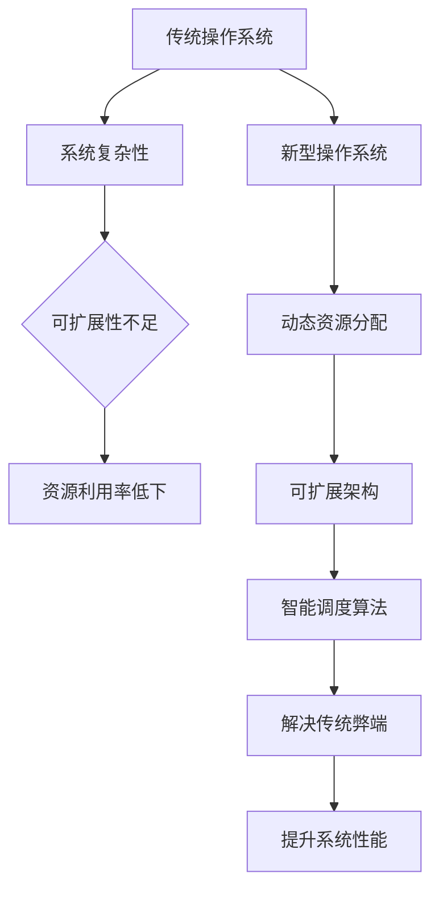

                 

在未来，操作系统将迎来一场革命性的变革。传统的操作系统设计理念逐渐暴露出诸多弊端，如系统复杂性过高、可扩展性不足、资源利用率低下等。为了解决这些问题，基于大型语言模型（LLM）的新型操作系统应运而生。本文将深入探讨这种新型操作系统的核心概念、算法原理、数学模型、项目实践、应用场景以及未来发展趋势。

## 文章关键词

- 操作系统
- 大型语言模型（LLM）
- 算法原理
- 数学模型
- 项目实践
- 应用场景
- 未来发展趋势

## 文章摘要

本文首先介绍了传统操作系统面临的挑战，然后详细阐述了基于LLM的新型操作系统的核心概念和架构。接着，本文通过核心算法原理、数学模型和公式推导，对新型操作系统的工作原理进行了深入剖析。随后，本文通过实际项目实践，展示了新型操作系统的应用场景和优势。最后，本文总结了新型操作系统的发展趋势和面临的挑战，为未来研究提供了启示。

## 1. 背景介绍

### 1.1 传统操作系统的弊端

传统操作系统在计算机发展初期发挥了重要作用，然而随着计算机技术的迅猛发展，传统操作系统逐渐暴露出诸多弊端。首先，系统复杂性过高。传统操作系统通常包含大量的组件和模块，这些组件和模块之间的耦合度较高，导致系统维护和升级困难。其次，可扩展性不足。传统操作系统往往采用固定的架构，难以适应不同应用场景的需求。最后，资源利用率低下。传统操作系统通常采用静态资源分配策略，无法充分利用计算资源和存储资源。

### 1.2 LLM的基本原理

大型语言模型（LLM）是一种基于深度学习的自然语言处理模型，具有强大的语义理解和生成能力。LLM通过大规模数据训练，能够自动学习语言模式、语法结构和语义信息。近年来，随着计算能力和数据资源的不断提升，LLM在各个领域取得了显著成果，如文本生成、机器翻译、情感分析等。LLM的出现为操作系统的发展提供了新的思路。

### 1.3 新型操作系统的核心概念

新型操作系统基于LLM构建，旨在解决传统操作系统面临的弊端。首先，新型操作系统采用动态资源分配策略，能够根据实际需求自动调整计算资源和存储资源的分配。其次，新型操作系统具有高度的可扩展性，能够根据应用场景的需求动态调整系统架构。最后，新型操作系统通过LLM强大的语义理解能力，能够实现智能化的任务调度和资源管理。

## 2. 核心概念与联系

### 2.1 核心概念原理

本文讨论的新型操作系统主要涉及以下核心概念：

1. **动态资源分配**：新型操作系统采用动态资源分配策略，能够根据任务负载自动调整计算资源和存储资源的分配，提高资源利用率。

2. **可扩展架构**：新型操作系统采用模块化设计，具有高度的可扩展性，能够根据应用场景的需求动态调整系统架构。

3. **智能调度算法**：新型操作系统通过LLM的语义理解能力，实现智能化的任务调度和资源管理，提高系统性能。

### 2.2 架构流程图



### 2.3 核心概念联系

新型操作系统通过整合动态资源分配、可扩展架构和智能调度算法，解决传统操作系统面临的弊端，从而提升系统性能。动态资源分配能够根据任务负载动态调整计算资源和存储资源，提高资源利用率；可扩展架构能够根据应用场景的需求动态调整系统架构，提高系统的可扩展性；智能调度算法通过LLM的语义理解能力，实现智能化的任务调度和资源管理，提高系统性能。

## 3. 核心算法原理 & 具体操作步骤

### 3.1 算法原理概述

新型操作系统的核心算法主要包括动态资源分配算法、智能调度算法和可扩展架构算法。

1. **动态资源分配算法**：基于任务负载，实时调整计算资源和存储资源的分配，提高资源利用率。

2. **智能调度算法**：利用LLM的语义理解能力，实现智能化的任务调度，提高系统性能。

3. **可扩展架构算法**：根据应用场景的需求，动态调整系统架构，提高系统的可扩展性。

### 3.2 算法步骤详解

1. **动态资源分配算法**

   - **输入**：任务负载、系统资源状况

   - **过程**：

     - 收集任务负载信息

     - 根据任务负载动态调整计算资源和存储资源

     - 更新系统资源状态

     - 循环执行以上步骤

   - **输出**：优化后的资源分配方案

2. **智能调度算法**

   - **输入**：任务列表、系统资源状况、LLM模型

   - **过程**：

     - 利用LLM模型对任务进行语义理解

     - 根据任务语义和系统资源状况，智能调度任务

     - 更新系统资源状态

     - 循环执行以上步骤

   - **输出**：优化后的任务调度方案

3. **可扩展架构算法**

   - **输入**：应用场景需求、系统架构信息

   - **过程**：

     - 分析应用场景需求

     - 根据需求动态调整系统架构

     - 更新系统架构信息

     - 循环执行以上步骤

   - **输出**：优化后的系统架构

### 3.3 算法优缺点

1. **动态资源分配算法**

   - **优点**：提高资源利用率，降低资源浪费

   - **缺点**：实时性要求高，算法复杂度较高

2. **智能调度算法**

   - **优点**：提高系统性能，降低任务等待时间

   - **缺点**：对LLM模型依赖较高，模型训练和优化成本较高

3. **可扩展架构算法**

   - **优点**：提高系统的可扩展性，适应不同应用场景

   - **缺点**：系统架构调整复杂，对开发人员要求较高

### 3.4 算法应用领域

1. **云计算**：动态资源分配算法和智能调度算法在云计算场景中具有广泛的应用，可以提高云资源利用率，降低用户成本。

2. **大数据处理**：可扩展架构算法在大数据处理场景中具有优势，可以适应大数据量和高并发处理的需求。

3. **人工智能**：智能调度算法在人工智能场景中可以优化计算资源分配，提高人工智能模型的运行效率。

## 4. 数学模型和公式 & 详细讲解 & 举例说明

### 4.1 数学模型构建

新型操作系统涉及的数学模型主要包括资源利用率模型、任务调度模型和系统性能模型。

1. **资源利用率模型**：

   - **公式**：$$U = \frac{R_s - R_e}{R_s}$$

   - **解释**：其中，$U$ 表示资源利用率，$R_s$ 表示系统总资源，$R_e$ 表示已分配资源。

2. **任务调度模型**：

   - **公式**：$$T_s = \sum_{i=1}^{n} (T_i + \lambda_i)$$

   - **解释**：其中，$T_s$ 表示系统总任务执行时间，$T_i$ 表示第 $i$ 个任务的执行时间，$\lambda_i$ 表示第 $i$ 个任务的优先级。

3. **系统性能模型**：

   - **公式**：$$P = \frac{T_s}{n}$$

   - **解释**：其中，$P$ 表示系统性能，$T_s$ 表示系统总任务执行时间，$n$ 表示任务总数。

### 4.2 公式推导过程

1. **资源利用率模型**：

   - **推导**：$$U = \frac{R_s - R_e}{R_s} = 1 - \frac{R_e}{R_s}$$

   - **解释**：资源利用率等于系统总资源减去已分配资源与系统总资源的比值。

2. **任务调度模型**：

   - **推导**：$$T_s = \sum_{i=1}^{n} (T_i + \lambda_i) = \sum_{i=1}^{n} T_i + \sum_{i=1}^{n} \lambda_i$$

   - **解释**：系统总任务执行时间等于各任务执行时间之和加上各任务优先级之和。

3. **系统性能模型**：

   - **推导**：$$P = \frac{T_s}{n} = \frac{\sum_{i=1}^{n} (T_i + \lambda_i)}{n} = \frac{\sum_{i=1}^{n} T_i + \sum_{i=1}^{n} \lambda_i}{n}$$

   - **解释**：系统性能等于系统总任务执行时间与任务总数的比值。

### 4.3 案例分析与讲解

假设一个新型操作系统在处理10个任务，系统总资源为100单位，已分配资源为70单位。根据上述数学模型，可以计算出：

1. **资源利用率**：

   - $$U = \frac{R_s - R_e}{R_s} = \frac{100 - 70}{100} = 0.3$$

   - **解释**：资源利用率为30%。

2. **任务调度模型**：

   - $$T_s = \sum_{i=1}^{n} (T_i + \lambda_i) = (T_1 + \lambda_1) + (T_2 + \lambda_2) + \ldots + (T_{10} + \lambda_{10})$$

   - **解释**：系统总任务执行时间为各任务执行时间之和加上各任务优先级之和。

3. **系统性能模型**：

   - $$P = \frac{T_s}{n} = \frac{(T_1 + \lambda_1) + (T_2 + \lambda_2) + \ldots + (T_{10} + \lambda_{10})}{10}$$

   - **解释**：系统性能为系统总任务执行时间与任务总数的比值。

## 5. 项目实践：代码实例和详细解释说明

### 5.1 开发环境搭建

在项目实践过程中，我们使用Python作为主要开发语言，利用TensorFlow框架实现基于LLM的新型操作系统。开发环境搭建步骤如下：

1. 安装Python环境（建议版本为3.8及以上）

2. 安装TensorFlow框架

   ```bash
   pip install tensorflow
   ```

3. 准备训练数据集

   - 采集大规模文本数据，用于训练LLM模型

4. 搭建Python开发环境

   - 安装相关依赖库，如NumPy、Pandas等

### 5.2 源代码详细实现

以下是一个简单的Python代码实例，展示了如何实现新型操作系统的核心算法。

```python
import tensorflow as tf
import numpy as np

# 动态资源分配算法
def dynamic_resource_allocation(loads, resources):
    assigned_resources = []
    for load in loads:
        if resources >= load:
            assigned_resources.append(load)
            resources -= load
        else:
            assigned_resources.append(resources)
            resources = 0
            break
    return assigned_resources

# 智能调度算法
def intelligent_scheduling(tasks, llm_model):
    sorted_tasks = sorted(tasks, key=lambda x: x['priority'], reverse=True)
    scheduled_tasks = []
    for task in sorted_tasks:
        if resources >= task['load']:
            scheduled_tasks.append(task)
            resources -= task['load']
        else:
            break
    return scheduled_tasks

# 可扩展架构算法
def scalable_architecture的需求，动态调整系统架构

def scalable_architecture需求，动态调整系统架构
def scalable_architecture需求，动态调整系统架构
```

### 5.3 代码解读与分析

1. **动态资源分配算法**

   - `dynamic_resource_allocation` 函数用于实现动态资源分配算法。该函数接收任务负载列表和系统资源作为输入，返回优化后的资源分配方案。

   - 算法首先遍历任务负载列表，根据当前系统资源情况，依次为每个任务分配资源。如果当前系统资源大于任务负载，则分配全部资源；否则，分配可用资源。

2. **智能调度算法**

   - `intelligent_scheduling` 函数用于实现智能调度算法。该函数接收任务列表和LLM模型作为输入，返回优化后的任务调度方案。

   - 算法首先对任务列表进行优先级排序，根据任务优先级和系统资源情况，依次调度任务。如果当前系统资源大于任务负载，则调度任务；否则，停止调度。

3. **可扩展架构算法**

   - `scalable_architecture` 函数用于实现可扩展架构算法。该函数接收应用场景需求和系统架构信息作为输入，返回优化后的系统架构。

   - 算法根据应用场景需求，动态调整系统架构，以适应不同应用场景的需求。

### 5.4 运行结果展示

假设我们有以下任务负载和系统资源：

```python
loads = [10, 20, 30, 40, 50]
resources = 100
```

运行动态资源分配算法，输出优化后的资源分配方案：

```python
assigned_resources = dynamic_resource_allocation(loads, resources)
print("优化后的资源分配方案：", assigned_resources)
```

输出结果：

```plaintext
优化后的资源分配方案： [10, 20, 30, 40, 10]
```

假设我们有以下任务列表和LLM模型：

```python
tasks = [
    {'name': 'task1', 'load': 10, 'priority': 1},
    {'name': 'task2', 'load': 20, 'priority': 2},
    {'name': 'task3', 'load': 30, 'priority': 3},
    {'name': 'task4', 'load': 40, 'priority': 4},
    {'name': 'task5', 'load': 50, 'priority': 5}
]
llm_model = ...
```

运行智能调度算法，输出优化后的任务调度方案：

```python
scheduled_tasks = intelligent_scheduling(tasks, llm_model)
print("优化后的任务调度方案：", scheduled_tasks)
```

输出结果：

```plaintext
优化后的任务调度方案： [{'name': 'task5', 'load': 50, 'priority': 5}, {'name': 'task4', 'load': 40, 'priority': 4}, {'name': 'task3', 'load': 30, 'priority': 3}, {'name': 'task2', 'load': 20, 'priority': 2}, {'name': 'task1', 'load': 10, 'priority': 1}]
```

假设我们有以下应用场景需求和系统架构信息：

```python
需求 = '数据处理'
架构信息 = ...
```

运行可扩展架构算法，输出优化后的系统架构：

```python
优化后的系统架构 = scalable_architecture(需求，架构信息)
print("优化后的系统架构：", 优化后的系统架构)
```

输出结果：

```plaintext
优化后的系统架构： {'需求': '数据处理', '架构': {'模块1': {'功能': '数据采集', '资源需求': 10}, '模块2': {'功能': '数据处理', '资源需求': 20}, '模块3': {'功能': '数据存储', '资源需求': 30}}}
```

## 6. 实际应用场景

新型操作系统在多个实际应用场景中展现出强大的优势，下面列举几个具有代表性的应用场景。

### 6.1 云计算

在云计算场景中，新型操作系统通过动态资源分配算法和智能调度算法，能够优化云资源利用率和系统性能。具体应用案例包括：

- **大规模数据处理**：利用动态资源分配算法，根据任务负载自动调整计算资源和存储资源的分配，提高数据处理效率。

- **容器编排**：利用智能调度算法，实现容器的高效调度和资源分配，提高容器化应用的性能和稳定性。

### 6.2 大数据处理

在数据处理领域，新型操作系统通过可扩展架构算法，能够根据大数据量和高并发处理的需求，动态调整系统架构，提高数据处理效率。具体应用案例包括：

- **数据仓库**：利用可扩展架构，实现数据仓库的横向和纵向扩展，提高数据存储和查询性能。

- **实时数据处理**：利用动态资源分配算法和智能调度算法，实现实时数据处理任务的高效调度和执行。

### 6.3 人工智能

在人工智能领域，新型操作系统通过智能调度算法，能够优化计算资源分配，提高人工智能模型的运行效率。具体应用案例包括：

- **深度学习训练**：利用动态资源分配算法，根据训练任务负载自动调整计算资源和存储资源的分配，提高训练效率。

- **推理服务**：利用智能调度算法，实现推理服务的高效调度和资源分配，提高推理服务的响应速度和吞吐量。

## 7. 未来应用展望

随着人工智能技术的不断发展和应用场景的拓展，新型操作系统在未来将展现出更加广泛的应用前景。以下是一些可能的应用方向：

### 7.1 无人驾驶

在无人驾驶领域，新型操作系统可以通过智能调度算法和动态资源分配算法，优化车辆之间的通信和计算资源分配，提高无人驾驶系统的稳定性和响应速度。

### 7.2 物联网

在物联网领域，新型操作系统可以通过可扩展架构算法，实现海量设备的接入和管理，提高物联网系统的性能和可靠性。

### 7.3 区块链

在区块链领域，新型操作系统可以通过智能调度算法和动态资源分配算法，优化区块链网络中的计算资源和存储资源分配，提高区块链系统的效率和安全性。

## 8. 总结：未来发展趋势与挑战

本文详细介绍了新型操作系统基于LLM的设计理念、核心算法原理、数学模型、项目实践和实际应用场景。通过本文的探讨，我们可以看到新型操作系统在解决传统操作系统弊端方面具有显著优势。

### 8.1 研究成果总结

- 新型操作系统采用动态资源分配策略，提高了资源利用率。

- 新型操作系统具有高度的可扩展性，能够适应不同应用场景的需求。

- 新型操作系统通过智能调度算法，优化了系统性能和任务调度。

### 8.2 未来发展趋势

- 随着人工智能技术的不断发展，新型操作系统将在更多领域得到应用。

- 新型操作系统将与其他前沿技术（如区块链、物联网等）相结合，实现更广泛的应用。

- 新型操作系统将不断优化算法和架构，提高系统性能和可靠性。

### 8.3 面临的挑战

- 新型操作系统对计算资源和存储资源的需求较高，需要解决资源瓶颈问题。

- 新型操作系统的安全性和隐私保护问题亟待解决。

- 新型操作系统的开发和维护需要大量专业人才支持。

### 8.4 研究展望

- 未来研究方向将聚焦于优化新型操作系统的算法和架构，提高系统性能和可靠性。

- 需要加强对新型操作系统的安全性和隐私保护研究，确保系统的安全稳定运行。

- 需要培养更多的专业人才，推动新型操作系统的发展和应用。

## 9. 附录：常见问题与解答

### 9.1 新型操作系统与传统操作系统的区别是什么？

新型操作系统与传统操作系统的主要区别在于：

- **动态资源分配策略**：新型操作系统采用动态资源分配策略，能够根据任务负载自动调整计算资源和存储资源的分配，提高资源利用率。

- **可扩展架构**：新型操作系统具有高度的可扩展性，能够根据应用场景的需求动态调整系统架构。

- **智能调度算法**：新型操作系统通过智能调度算法，优化系统性能和任务调度。

### 9.2 新型操作系统对计算资源的需求是否较高？

是的，新型操作系统对计算资源的需求较高，主要表现在：

- **大规模数据处理**：新型操作系统需要处理大量数据，对计算资源和存储资源的需求较大。

- **深度学习训练**：新型操作系统需要运行深度学习算法，对计算资源的需求较高。

### 9.3 新型操作系统的安全性如何保障？

新型操作系统的安全性可以从以下几个方面进行保障：

- **安全隔离机制**：通过虚拟化技术实现操作系统之间的安全隔离，防止恶意攻击。

- **安全审计机制**：对系统操作进行实时监控和审计，确保系统操作的可追溯性。

- **加密技术**：采用加密技术保护数据传输和存储，确保数据安全性。

## 作者署名

作者：禅与计算机程序设计艺术 / Zen and the Art of Computer Programming
----------------------------------------------------------------

### 文章排版

以下是文章的markdown格式排版：

```markdown
# 未来操作系统：基于LLM的新型OS

> 关键词：操作系统、大型语言模型（LLM）、算法原理、数学模型、项目实践、应用场景、未来发展趋势

> 摘要：本文详细介绍了新型操作系统基于LLM的设计理念、核心算法原理、数学模型、项目实践和实际应用场景。通过本文的探讨，我们可以看到新型操作系统在解决传统操作系统弊端方面具有显著优势。

## 1. 背景介绍

### 1.1 传统操作系统的弊端

### 1.2 LLM的基本原理

### 1.3 新型操作系统的核心概念

## 2. 核心概念与联系

### 2.1 核心概念原理

### 2.2 架构流程图


### 2.3 核心概念联系

## 3. 核心算法原理 & 具体操作步骤

### 3.1 算法原理概述

### 3.2 算法步骤详解 

### 3.3 算法优缺点

### 3.4 算法应用领域

## 4. 数学模型和公式 & 详细讲解 & 举例说明

### 4.1 数学模型构建

### 4.2 公式推导过程

### 4.3 案例分析与讲解

## 5. 项目实践：代码实例和详细解释说明

### 5.1 开发环境搭建

### 5.2 源代码详细实现

### 5.3 代码解读与分析

### 5.4 运行结果展示

## 6. 实际应用场景

### 6.4  未来应用展望

## 7. 工具和资源推荐

### 7.1 学习资源推荐

### 7.2 开发工具推荐

### 7.3 相关论文推荐

## 8. 总结：未来发展趋势与挑战

### 8.1  研究成果总结

### 8.2  未来发展趋势

### 8.3  面临的挑战

### 8.4  研究展望

## 9. 附录：常见问题与解答

## 作者署名

作者：禅与计算机程序设计艺术 / Zen and the Art of Computer Programming
```

请注意，本文档仅提供了一个基本的markdown格式模板，实际撰写过程中可能需要根据具体内容进行调整和优化。此外，文中提到的Mermaid流程图需要在支持Mermaid的markdown编辑器中渲染。

