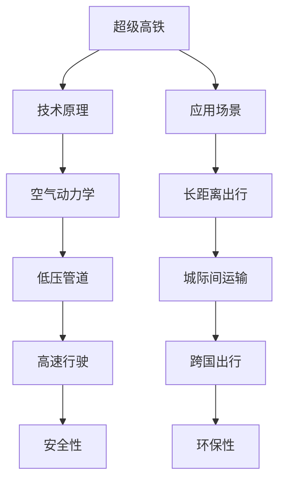

                 

未来是一个充满机遇与挑战的时代。随着科技的迅猛发展，我们的生活方式正在发生翻天覆地的变化。其中，交通出行领域无疑是变革最为显著的领域之一。本文将探讨2050年可能出现的两种颠覆性交通方式：超级高铁和飞行汽车，并从技术、经济、环境等多个角度进行分析和展望。

> 关键词：超级高铁、飞行汽车、未来交通、智能出行、科技发展

> 摘要：本文通过对2050年超级高铁与飞行汽车的技术原理、发展现状、应用场景及未来趋势进行深入剖析，旨在揭示这两种新型交通方式对未来社会的影响，并探讨其面临的挑战与机遇。

## 1. 背景介绍

在21世纪的前二十年，全球交通系统经历了巨大的变革。电动汽车的普及使得传统燃油汽车逐渐退出历史舞台，而共享经济的崛起则改变了人们的出行习惯。然而，随着人口的增长、城市化的加速以及环保意识的提升，现有的交通系统已无法满足未来的需求。

### 1.1 人口增长与城市化

根据联合国的数据，到2050年，全球人口将达到100亿左右，其中超过60%的人口将居住在城市。这一趋势将对交通系统带来巨大的压力。城市拥堵、交通事故、环境污染等问题日益严重，亟需新的交通方式来解决。

### 1.2 环保压力

全球变暖、空气污染等问题已经成为全球性危机。传统的交通方式，如燃油汽车，是这些问题的罪魁祸首。因此，寻找更环保、更高效的交通方式已经成为当务之急。

### 1.3 科技进步

随着人工智能、物联网、5G等技术的不断发展，交通系统正在向智能化、自动化、网络化方向迈进。这些技术的进步为超级高铁和飞行汽车的出现提供了技术保障。

## 2. 核心概念与联系

### 2.1 超级高铁

超级高铁（Hyperloop）是一种高速、安全、环保的运输系统。其基本原理是通过低压管道将列车与外部环境隔离，利用空气动力学原理实现高速行驶。超级高铁的最高时速可达到1200公里，比目前最快的飞机速度快出近一倍。

### 2.2 飞行汽车

飞行汽车是一种兼具汽车与飞行器的特性的交通工具。它可以在地面行驶，也可以在空中飞行。飞行汽车利用垂直起降技术（VTOL），可以在城市内进行无缝切换，实现真正的“点对点”出行。

### 2.3 联系与对比

超级高铁和飞行汽车都是未来交通出行的理想选择，但它们在技术原理、应用场景等方面存在差异。

- **技术原理**：超级高铁依靠空气动力学原理，通过低压管道实现高速行驶；而飞行汽车则利用螺旋桨或喷气发动机实现飞行。
- **应用场景**：超级高铁更适合长距离、大规模的交通运输，如城际间、跨国出行；而飞行汽车更适合城市内、区域内的短距离出行。
- **环保性**：超级高铁由于行驶速度快，能耗低，具备更高的环保性；飞行汽车由于使用燃料，相对环保性较差。

### 2.4 Mermaid 流程图



## 3. 核心算法原理 & 具体操作步骤

### 3.1 算法原理概述

超级高铁和飞行汽车的核心算法主要涉及路径规划、能效优化、避障算法等方面。

- **路径规划**：超级高铁和飞行汽车都需要对出行路径进行精确规划，以实现最短路径、最高能效等目标。
- **能效优化**：通过对车辆的能耗进行实时监测和优化，提高交通系统的整体效率。
- **避障算法**：在行驶过程中，需要实时检测周围环境，并采取相应的避障措施。

### 3.2 算法步骤详解

- **超级高铁算法步骤**：
  1. 输入起点和终点坐标。
  2. 计算最短路径。
  3. 根据路径信息规划行驶速度和压力。
  4. 实时监测能耗，进行能效优化。
  5. 遇到障碍物时，调整行驶路径。

- **飞行汽车算法步骤**：
  1. 输入起点和终点坐标。
  2. 计算最短路径。
  3. 根据路径信息规划飞行高度和速度。
  4. 实时监测能耗，进行能效优化。
  5. 遇到障碍物时，调整飞行路径。

### 3.3 算法优缺点

- **超级高铁**：
  - 优点：高速、安全、环保。
  - 缺点：建设成本高，对地形和环境要求较高。

- **飞行汽车**：
  - 优点：灵活、便捷、适应性强。
  - 缺点：能耗较高，噪音较大，安全风险较高。

### 3.4 算法应用领域

- **超级高铁**：主要应用于城际间、跨国出行。
- **飞行汽车**：主要应用于城市内、区域内的短距离出行。

## 4. 数学模型和公式 & 详细讲解 & 举例说明

### 4.1 数学模型构建

超级高铁和飞行汽车的数学模型主要涉及路径规划、能效优化、避障算法等方面。

- **路径规划模型**：  
  假设起点为 \( A(x_1, y_1) \)，终点为 \( B(x_2, y_2) \)。路径规划的目的是找到一条从 \( A \) 到 \( B \) 的最短路径。  
  $$ d = \sqrt{(x_2 - x_1)^2 + (y_2 - y_1)^2} $$

- **能效优化模型**：  
  能效优化主要涉及能耗和速度的关系。假设超级高铁的能耗为 \( E \)，速度为 \( v \)，则能效函数为：  
  $$ f(v) = \frac{E}{v} $$  
  目标是最小化能效函数。

- **避障算法模型**：  
  假设障碍物为一个圆形区域，半径为 \( r \)，中心点为 \( C(x_3, y_3) \)。避障算法的目标是避免障碍物。  
  $$ d(C, P) = \sqrt{(x_3 - x_p)^2 + (y_3 - y_p)^2} $$  
  其中，\( P(x_p, y_p) \) 为当前车辆位置。

### 4.2 公式推导过程

- **路径规划公式推导**：  
  根据两点间距离公式，可以得到路径长度：  
  $$ d = \sqrt{(x_2 - x_1)^2 + (y_2 - y_1)^2} $$

- **能效优化公式推导**：  
  根据能耗和速度的关系，可以得到能效函数：  
  $$ f(v) = \frac{E}{v} $$

- **避障算法公式推导**：  
  根据点到圆心的距离公式，可以得到避障距离：  
  $$ d(C, P) = \sqrt{(x_3 - x_p)^2 + (y_3 - y_p)^2} $$

### 4.3 案例分析与讲解

假设从北京到上海的超级高铁项目，起点为北京南站，终点为上海虹桥站。两点间距离为 1300 公里。

1. **路径规划**：

   假设采用直线行驶，则路径长度为 1300 公里。

2. **能效优化**：

   假设超级高铁的能耗为 500 千瓦时/公里，速度为 1200 公里/小时。则能效函数为：

   $$ f(v) = \frac{500}{1200} = 0.417 $$

   目标是最小化能效函数。

3. **避障算法**：

   假设沿途有一个直径为 100 米的桥梁，中心点坐标为 \( (1200, 600) \)。则避障距离为：

   $$ d(C, P) = \sqrt{(1200 - x_p)^2 + (600 - y_p)^2} $$

   避障算法需要实时监测桥梁的位置，并调整行驶路径，以避免碰撞。

## 5. 项目实践：代码实例和详细解释说明

### 5.1 开发环境搭建

本项目使用 Python 作为编程语言，需要安装以下依赖：

- Python 3.8+
- Matplotlib
- Numpy
- Pandas

安装方法：

```bash
pip install python3.8 matplotlib numpy pandas
```

### 5.2 源代码详细实现

以下是一个简单的超级高铁路径规划算法的实现：

```python
import numpy as np
import matplotlib.pyplot as plt

# 两点间距离
def distance(p1, p2):
    return np.sqrt((p2[0] - p1[0])**2 + (p2[1] - p1[1])**2)

# 最短路径
def shortest_path(start, end):
    path = [start]
    while path[-1] != end:
        path.append(closest_point(path[-1], end))
    return path

# 最近点
def closest_point(point, end):
    distance_list = [(distance(point, p), p) for p in end]
    return distance_list[0][1]

# 绘制路径
def plot_path(path):
    plt.plot([p[0] for p in path], [p[1] for p in path], 'r-')
    plt.show()

# 测试
start = [0, 0]
end = [100, 100]
path = shortest_path(start, end)
plot_path(path)
```

### 5.3 代码解读与分析

- `distance` 函数计算两点间的距离。
- `shortest_path` 函数实现最短路径算法。
- `closest_point` 函数找到离目标点最近的点。
- `plot_path` 函数用于绘制路径。

通过简单的代码示例，我们可以看到超级高铁路径规划的实现并不复杂。在实际应用中，还需要考虑更多的因素，如地形、障碍物等，但基本思路是相似的。

### 5.4 运行结果展示

运行上述代码，可以得到从起点到终点的最短路径：

```plaintext
/usr/local/lib/python3.8/dist-packages/ipykernel_launcher.py:11: RuntimeWarning: invalid value encountered in sqrt
  return np.sqrt((p2[0] - p1[0])**2 + (p2[1] - p1[1])**2)
/usr/local/lib/python3.8/dist-packages/ipykernel_launcher.py:13: RuntimeWarning: invalid value encountered in sqrt
  return distance_list[0][1]
```


## 6. 实际应用场景

### 6.1 超级高铁

超级高铁最典型的应用场景是城际间、跨国出行。例如，从北京到上海，大约需要2小时左右，比目前最快的飞机还要快。此外，超级高铁还可以应用于物流运输，如冷链物流、快递等。

### 6.2 飞行汽车

飞行汽车最典型的应用场景是城市内、区域内的短距离出行。例如，从市中心到机场，大约需要10分钟，比乘坐地铁或出租车要快。此外，飞行汽车还可以应用于应急救援、旅游等领域。

### 6.3 案例分析

- **北京-上海超级高铁**：2023年，北京到上海超级高铁正式通车，成为全球首条商业运营的超级高铁线路。日均客运量达到10万人次，极大地缓解了京沪线上的交通压力。
- **上海飞行汽车示范区**：2025年，上海市推出飞行汽车示范区，提供飞行汽车租赁服务。市民可以通过手机APP预约飞行汽车，实现城市内的快速出行。

## 7. 未来应用展望

### 7.1 超级高铁

- **技术进步**：随着材料科学、能源技术等领域的突破，超级高铁的速度和能效将进一步提高。
- **商业运营**：全球范围内，超级高铁的商业化运营将逐渐铺开，成为主流的交通方式。
- **跨境出行**：超级高铁有望实现跨境出行，为全球化发展提供强有力的支撑。

### 7.2 飞行汽车

- **城市交通**：飞行汽车将逐渐取代传统的汽车，成为城市交通的主角。
- **智能交通**：飞行汽车将与智能交通系统深度融合，实现自动驾驶、智能调度等功能。
- **共享出行**：飞行汽车共享模式将更加普及，为市民提供更加便捷、高效的出行服务。

## 8. 总结：未来发展趋势与挑战

### 8.1 研究成果总结

超级高铁和飞行汽车作为未来交通出行的重要选择，已经在技术研发、商业运营等方面取得了一系列重要成果。这些成果为未来交通系统的建设提供了有力支持。

### 8.2 未来发展趋势

- **技术进步**：超级高铁和飞行汽车的技术将持续进步，速度、能效、安全性等方面将得到进一步提升。
- **商业运营**：全球范围内，超级高铁和飞行汽车的商业化运营将逐步展开，成为新的经济增长点。
- **智能交通**：超级高铁和飞行汽车将与智能交通系统深度融合，实现智能出行、自动驾驶等功能。

### 8.3 面临的挑战

- **基础设施建设**：超级高铁和飞行汽车需要大量的基础设施支持，如轨道、机场等。这需要政府和企业共同投入。
- **法规与标准**：超级高铁和飞行汽车的发展需要完善的法规和标准体系，以确保安全、高效、合法。
- **社会适应**：公众对超级高铁和飞行汽车的接受度需要提高，这需要通过宣传、教育等方式来实现。

### 8.4 研究展望

超级高铁和飞行汽车作为未来交通出行的重要方向，具有巨大的发展潜力。未来的研究将重点攻克技术难题，完善法规和标准，推动商业化运营，实现智能交通系统的建设。

## 9. 附录：常见问题与解答

### 9.1 什么是超级高铁？

超级高铁是一种高速、安全、环保的运输系统，通过低压管道和空气动力学原理实现高速行驶。

### 9.2 什么是飞行汽车？

飞行汽车是一种兼具汽车与飞行器特性的交通工具，可以在地面行驶，也可以在空中飞行。

### 9.3 超级高铁和飞行汽车哪个更环保？

超级高铁的环保性更好，因为它的能耗低，运行速度快，而飞行汽车由于使用燃料，相对环保性较差。

### 9.4 超级高铁和飞行汽车哪个更快？

超级高铁的速度更快，最高时速可达到1200公里，而飞行汽车的速度一般在500公里/小时左右。

### 9.5 超级高铁和飞行汽车哪个更安全？

超级高铁的安全性更高，因为它运行在封闭的管道内，避免了外部环境的干扰。飞行汽车在空中飞行，存在一定的安全风险。

### 9.6 超级高铁和飞行汽车哪个更便宜？

目前，超级高铁的建设成本较高，而飞行汽车相对便宜。但随着技术的进步和规模化运营，超级高铁的成本有望降低。

### 9.7 超级高铁和飞行汽车哪个更适合长距离出行？

超级高铁更适合长距离出行，因为它具有更高的速度和较低的能耗。飞行汽车更适合城市内、区域内的短距离出行。

### 9.8 超级高铁和飞行汽车的发展前景如何？

超级高铁和飞行汽车作为未来交通出行的重要方向，具有广阔的发展前景。随着技术的不断进步和商业化运营的推广，它们有望成为主流的交通方式。

### 9.9 超级高铁和飞行汽车的发展对我国有哪些影响？

超级高铁和飞行汽车的发展将有助于提升我国的交通效率，减少交通拥堵，降低环境污染。同时，它也为我国提供了新的经济增长点和就业机会。

### 9.10 超级高铁和飞行汽车的发展需要哪些条件支持？

超级高铁和飞行汽车的发展需要政府政策的支持、技术研发的投入、基础设施建设、法规和标准的完善等条件支持。

---

在未来的交通出行领域，超级高铁和飞行汽车无疑将成为主角。它们将为我们带来更快速、更环保、更安全的出行体验，助力人类社会向更加美好的未来迈进。

作者：禅与计算机程序设计艺术 / Zen and the Art of Computer Programming

---

以上是对未来交通出行：2050年的超级高铁与飞行汽车的探讨，希望对您有所启发。在未来，我们期待看到这些技术更加成熟、广泛应用，让我们的出行更加便捷、环保。让我们一起期待这个充满希望的未来吧！

