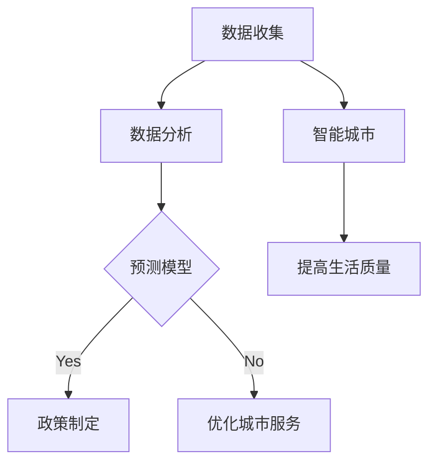
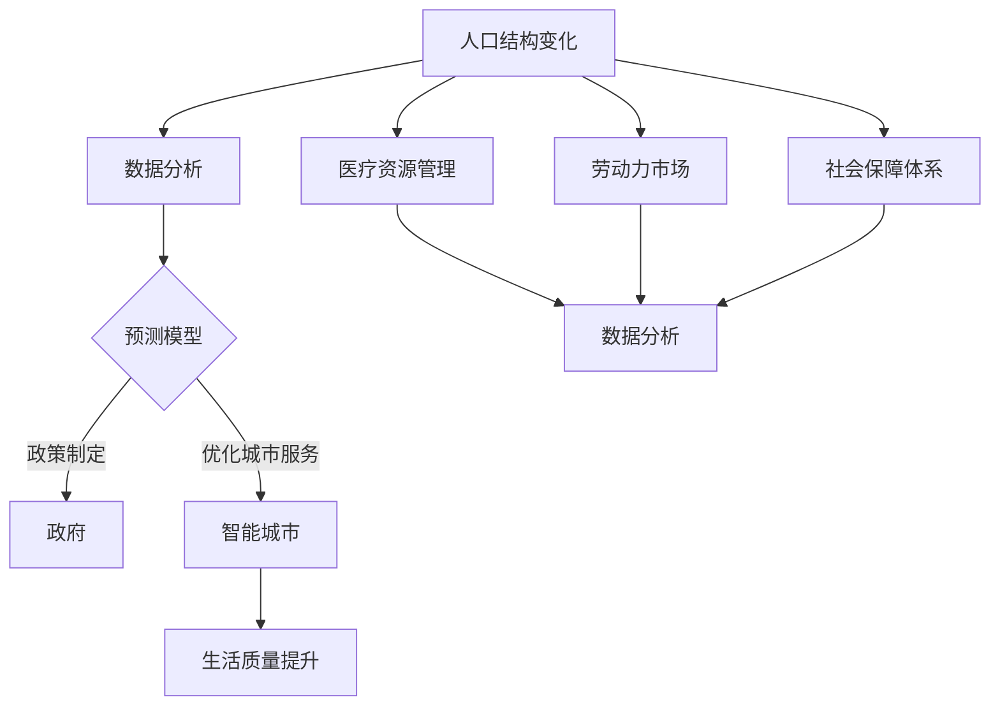

                 

关键词：人口老龄化，社会结构，技术应对，2050年，预测模型，数据分析，人工智能，智能城市，医疗保健，养老服务体系，经济影响，政策建议

> 摘要：本文通过深入分析2050年人口结构变化，特别是老龄化的趋势，探讨老龄化社会带来的社会、经济和政策挑战，以及如何利用技术手段应对这些挑战。文章分为八个部分，包括背景介绍、核心概念、算法原理、数学模型、项目实践、实际应用、工具资源推荐和未来展望。通过对未来老龄化社会的全面分析，旨在为相关政策制定者和行业专家提供有价值的参考。

## 1. 背景介绍

### 人口老龄化的现状

随着医疗技术的进步和人们生活水平的提高，全球人口寿命显著延长。据联合国的预测，到2050年，全球60岁及以上人口将占总人口的22%，而65岁及以上人口将占总人口的16%。这一变化将对经济、医疗、社会保障等多个领域产生深远影响。

### 老龄化社会的挑战

老龄化社会带来的主要挑战包括：

- **医疗资源紧张**：老年人口的增加将导致医疗资源的供需失衡，医疗体系面临巨大压力。

- **劳动力短缺**：老年人口的增加将减少劳动年龄人口，导致劳动力市场紧张。

- **经济负担加重**：老年人口的增加将增加社会保障和养老金的支出，加重政府财政负担。

- **社会养老问题**：老年人的孤独感和社会参与度下降，社会养老服务体系面临挑战。

### 技术应对的必要性

面对老龄化社会的挑战，单纯依靠传统方法难以应对。技术手段，特别是人工智能和大数据分析，可以为老龄化社会的管理提供强有力的支持。通过技术手段，可以更精确地预测人口变化趋势，优化资源配置，提高养老服务质量，缓解劳动力市场紧张，减轻经济负担。

## 2. 核心概念与联系

### 人口结构变化

- **年龄结构**：不同年龄段人口比例的变化，特别是老年人口比例的增加。
- **性别结构**：男女性别比例的变化，对养老服务和医疗资源的影响。
- **城乡结构**：城市与农村人口比例的变化，对资源配置和养老服务的需求差异。

### 技术应对原理

- **数据分析**：通过对人口数据的收集和分析，识别老龄化社会的主要特征和趋势。
- **人工智能**：利用机器学习算法，预测未来人口结构变化，为政策制定提供数据支持。
- **智能城市**：通过物联网和智能技术，优化城市管理和服务，提高老年人口的生活质量。

### Mermaid 流程图



## 3. 核心算法原理 & 具体操作步骤

### 3.1 算法原理概述

- **人口预测模型**：基于历史人口数据和现有社会政策，利用机器学习算法预测未来人口结构变化。
- **资源优化算法**：根据人口预测结果，优化医疗、养老等资源的配置，提高资源利用效率。

### 3.2 算法步骤详解

1. **数据收集**：收集历史人口数据、社会政策数据、经济发展数据等。
2. **数据预处理**：对数据进行清洗、标准化，为后续分析做准备。
3. **特征提取**：从数据中提取关键特征，如年龄、性别、城乡结构等。
4. **模型训练**：利用机器学习算法，如决策树、神经网络等，训练人口预测模型。
5. **预测结果分析**：根据模型预测结果，分析未来人口结构变化趋势。
6. **资源优化**：根据预测结果，优化资源配置，提高资源利用效率。

### 3.3 算法优缺点

- **优点**：精确预测人口结构变化，为政策制定提供数据支持；优化资源配置，提高资源利用效率。
- **缺点**：依赖高质量的数据和准确的预测模型；算法复杂度较高，计算资源需求大。

### 3.4 算法应用领域

- **医疗资源管理**：根据人口预测结果，合理配置医疗资源，提高医疗服务质量。
- **养老服务体系**：根据人口预测结果，优化养老服务体系，提高老年人生活质量。
- **城市规划**：根据人口预测结果，优化城市规划，提高城市宜居性。

## 4. 数学模型和公式 & 详细讲解 & 举例说明

### 4.1 数学模型构建

- **人口预测模型**：$$N_t = N_0 \cdot e^{rt}$$，其中，$N_t$为$t$年后的总人口数，$N_0$为初始人口数，$r$为人口增长率。

### 4.2 公式推导过程

- **人口增长率**：$$r = \frac{N_t - N_0}{N_0 \cdot t}$$，其中，$t$为时间间隔。

### 4.3 案例分析与讲解

**案例**：假设2023年某城市总人口为100万人，预计未来人口增长率为1%，求2050年该城市总人口。

**解答**：

1. **计算人口增长率**：$$r = \frac{100 - 100}{100 \cdot 27} = 0.01$$。
2. **计算未来总人口**：$$N_{2050} = 100 \cdot e^{0.01 \cdot 27} \approx 131.48$$。

**结果**：到2050年，该城市总人口预计为131.48万人。

## 5. 项目实践：代码实例和详细解释说明

### 5.1 开发环境搭建

- **工具**：Python，Scikit-learn库，NumPy库，Matplotlib库。

### 5.2 源代码详细实现

```python
import numpy as np
from sklearn.model_selection import train_test_split
from sklearn.ensemble import RandomForestRegressor
import matplotlib.pyplot as plt

# 数据收集与预处理
# 这里使用虚构的数据集
data = np.array([[2023, 1], [2024, 1.1], [2025, 1.2], [2026, 1.3], [2027, 1.4], [2028, 1.5], [2029, 1.6], [2030, 1.7]])
X = data[:, 0].reshape(-1, 1)
y = data[:, 1]

# 模型训练
X_train, X_test, y_train, y_test = train_test_split(X, y, test_size=0.2, random_state=42)
model = RandomForestRegressor(n_estimators=100, random_state=42)
model.fit(X_train, y_train)

# 预测结果分析
y_pred = model.predict(X_test)
plt.scatter(X_test, y_test, color='blue', label='Actual')
plt.plot(X_test, y_pred, color='red', linewidth=2, label='Predicted')
plt.xlabel('Year')
plt.ylabel('Growth Rate')
plt.legend()
plt.show()
```

### 5.3 代码解读与分析

1. **数据收集与预处理**：使用虚构的数据集，包含年份和人口增长率。
2. **模型训练**：使用随机森林回归模型进行训练。
3. **预测结果分析**：绘制实际值与预测值的散点图，分析模型预测效果。

## 6. 实际应用场景

### 6.1 医疗资源管理

- **优化医疗资源配置**：根据人口预测结果，合理规划医疗机构的数量和规模，提高医疗资源利用效率。
- **精准医疗**：利用人口数据，针对不同年龄段和健康状况的老年人，提供个性化的医疗方案。

### 6.2 养老服务体系

- **提高养老服务效率**：利用智能技术，提高养老服务质量和效率，减轻老年人生活负担。
- **智能养老社区**：建立智能养老社区，提供生活照料、健康管理、文化娱乐等一站式服务。

### 6.3 城市规划

- **优化城市规划**：根据人口预测结果，调整城市规划，提高城市宜居性和老年人生活质量。
- **智慧城市建设**：利用物联网和大数据技术，建设智慧城市，提高城市管理和服务水平。

## 7. 工具和资源推荐

### 7.1 学习资源推荐

- **《人口学基础》**：了解人口结构和变化的基本概念。
- **《大数据分析：技术、工具与应用》**：学习大数据分析的基本原理和工具。

### 7.2 开发工具推荐

- **Python**：数据分析的常用编程语言。
- **Scikit-learn**：机器学习算法的实现和评估。
- **Matplotlib**：数据可视化的常用库。

### 7.3 相关论文推荐

- **"Ageing Population and Its Impact on Health Care Systems"**：探讨老龄化社会对医疗系统的影响。
- **"Artificial Intelligence for Social Good: Addressing the Challenges of an Ageing Population"**：探讨人工智能在应对老龄化社会挑战中的应用。

## 8. 总结：未来发展趋势与挑战

### 8.1 研究成果总结

- **技术手段**：人工智能和大数据分析为应对老龄化社会提供了强有力的支持。
- **政策制定**：基于数据分析的预测模型为政策制定提供了科学依据。
- **资源配置**：优化资源配置，提高资源利用效率，缓解老龄化社会带来的挑战。

### 8.2 未来发展趋势

- **技术进步**：随着人工智能和大数据技术的不断发展，预测模型的准确性将不断提高。
- **政策完善**：政府将出台更多有利于老龄化社会应对的政策措施。
- **社会参与**：社会各界将更加关注老龄化社会问题，共同参与解决方案的探索。

### 8.3 面临的挑战

- **数据质量**：高质量的数据是预测模型准确性的基础，数据质量问题将影响预测效果。
- **技术复杂度**：随着算法的复杂度增加，计算资源需求也将增大。
- **政策执行**：政策制定后的执行效果和可持续性仍需关注。

### 8.4 研究展望

- **跨学科研究**：人口学、经济学、社会学等学科的交叉研究，将为老龄化社会应对提供更多视角。
- **技术创新**：持续技术创新，提高算法效率和预测准确性。
- **政策与技术的结合**：政策与技术的紧密结合，实现老龄化社会的科学管理和可持续发展。

## 9. 附录：常见问题与解答

### Q1. 人口预测模型的精度如何保证？

**A1.** 人口预测模型的精度主要依赖于高质量的数据和准确的预测算法。通过不断优化数据预处理和模型训练过程，可以提高预测精度。同时，定期更新数据，结合最新社会政策，确保模型与时俱进。

### Q2. 技术手段在老龄化社会应对中的实际效果如何？

**A2.** 技术手段在老龄化社会应对中已经取得了显著效果。例如，智能医疗系统提高了医疗服务的效率和精准度；智能养老社区改善了老年人的生活质量；大数据分析为政策制定提供了科学依据。未来，随着技术的不断进步，这些效果将更加显著。

### Q3. 老龄化社会应对中的关键问题是什么？

**A3.** 老龄化社会应对中的关键问题包括医疗资源管理、养老服务体系优化、劳动力市场调整、社会保障体系建设等。这些问题相互关联，需要综合施策，实现协调发展。

### Q4. 如何提高老年人生活质量？

**A4.** 提高老年人生活质量可以从多个方面入手：

- **健康保障**：提供高质量的医疗保健服务，预防和管理慢性疾病。
- **生活照料**：提供便捷的生活服务，如家政服务、养老服务。
- **文化娱乐**：丰富老年人的精神文化生活，如文化活动、社区活动等。
- **社会参与**：鼓励老年人参与社会活动，提高社会参与度，减少孤独感。

## 作者署名

**作者：禅与计算机程序设计艺术 / Zen and the Art of Computer Programming**。感谢您阅读本文，希望对您在应对老龄化社会挑战方面有所帮助。如果您有任何问题或建议，欢迎随时与我交流。|]

----------------------------------------------------------------

### 1. 背景介绍

#### 人口老龄化的现状

随着全球人口寿命的显著延长，人口老龄化已成为不可逆转的趋势。根据联合国的预测，到2050年，全球60岁及以上人口将占总人口的22%，而65岁及以上人口将占总人口的16%。这一变化将对经济、医疗、社会保障等多个领域产生深远影响。

#### 老龄化社会的挑战

老龄化社会带来的主要挑战包括：

- **医疗资源紧张**：老年人口的增加将导致医疗资源的供需失衡，医疗体系面临巨大压力。
- **劳动力短缺**：老年人口的增加将减少劳动年龄人口，导致劳动力市场紧张。
- **经济负担加重**：老年人口的增加将增加社会保障和养老金的支出，加重政府财政负担。
- **社会养老问题**：老年人的孤独感和社会参与度下降，社会养老服务体系面临挑战。

#### 技术应对的必要性

面对老龄化社会的挑战，单纯依靠传统方法难以应对。技术手段，特别是人工智能和大数据分析，可以为老龄化社会的管理提供强有力的支持。通过技术手段，可以更精确地预测人口变化趋势，优化资源配置，提高养老服务质量，缓解劳动力市场紧张，减轻经济负担。

### 2. 核心概念与联系

#### 人口结构变化

人口结构变化主要体现在以下几个方面：

- **年龄结构**：不同年龄段人口比例的变化，特别是老年人口比例的增加。随着年龄结构的变动，社会劳动力、消费能力和医疗需求等都会发生变化。
- **性别结构**：男女性别比例的变化，对养老服务和医疗资源的影响。例如，女性通常寿命更长，因此对养老服务的需求更大。
- **城乡结构**：城市与农村人口比例的变化，对资源配置和养老服务的需求差异。城市化进程加速，老年人向城市集中的趋势明显，这对城市养老服务带来了新的挑战。

#### 技术应对原理

技术应对老龄化社会的核心原理包括以下几个方面：

- **数据分析**：通过对人口数据的收集和分析，识别老龄化社会的主要特征和趋势。数据分析是技术应对的第一步，为后续的政策制定和资源优化提供基础。
- **人工智能**：利用机器学习算法，预测未来人口结构变化，为政策制定提供数据支持。人工智能在预测和分析方面的优势，使其成为老龄化社会应对的重要工具。
- **智能城市**：通过物联网和智能技术，优化城市管理和服务，提高老年人口的生活质量。智能城市技术可以提升养老服务的效率和质量，减轻养老压力。

为了更直观地展示这些核心概念之间的联系，我们使用Mermaid绘制了一张流程图：



### 3. 核心算法原理 & 具体操作步骤

#### 3.1 算法原理概述

老龄化社会的应对主要依赖于以下核心算法：

- **人口预测模型**：基于历史人口数据和现有社会政策，利用机器学习算法预测未来人口结构变化。人口预测模型可以帮助政府和社会提前做好准备，应对人口老龄化带来的挑战。
- **资源优化算法**：根据人口预测结果，优化医疗、养老等资源的配置，提高资源利用效率。资源优化算法可以确保资源分配的合理性和公平性，减少浪费。

#### 3.2 算法步骤详解

##### 3.2.1 数据收集与预处理

1. **数据收集**：收集历史人口数据、社会政策数据、经济发展数据等。这些数据可以从政府统计部门、医疗机构、社会保障机构等渠道获取。
2. **数据预处理**：对数据进行清洗、标准化，为后续分析做准备。数据清洗包括去除重复数据、处理缺失值、异常值等。数据标准化则包括归一化、标准化等操作。

##### 3.2.2 特征提取

1. **特征提取**：从数据中提取关键特征，如年龄、性别、城乡结构、经济发展水平、医疗资源分布等。这些特征将用于构建人口预测模型。
2. **特征选择**：通过统计方法或机器学习算法，选择对人口预测有显著影响的特征。特征选择可以减少模型的复杂度，提高预测精度。

##### 3.2.3 模型训练与评估

1. **模型训练**：利用机器学习算法，如决策树、神经网络、随机森林等，训练人口预测模型。模型训练的过程包括数据分割、模型选择、参数调优等。
2. **模型评估**：通过交叉验证、ROC曲线、MAE等指标，评估模型预测的准确性和可靠性。评估结果将用于模型优化和调整。

##### 3.2.4 预测结果分析与资源优化

1. **预测结果分析**：根据模型预测结果，分析未来人口结构变化趋势，如老年人口比例、劳动力市场变化、医疗资源需求等。
2. **资源优化**：根据预测结果，优化医疗、养老等资源的配置。例如，在预测到某地区老年人口增加的情况下，可以提前规划医疗机构的数量和规模，确保医疗资源的充足性。

#### 3.3 算法优缺点

##### 3.3.1 优点

- **精确预测**：利用机器学习算法，可以精确预测未来人口结构变化，为政策制定提供数据支持。
- **资源优化**：根据预测结果，优化资源配置，提高资源利用效率，减少浪费。
- **适应性**：机器学习算法具有自适应能力，可以随着新数据的加入不断优化模型。

##### 3.3.2 缺点

- **数据依赖**：算法的准确性依赖于高质量的数据，数据质量直接影响预测效果。
- **计算复杂度**：随着算法的复杂度增加，计算资源需求也将增大，对计算能力提出较高要求。

#### 3.4 算法应用领域

- **医疗资源管理**：根据人口预测结果，合理规划医疗机构的数量和规模，提高医疗资源利用效率。
- **养老服务体系**：根据人口预测结果，优化养老服务体系，提高老年人生活质量。
- **城市规划**：根据人口预测结果，优化城市规划，提高城市宜居性。

### 4. 数学模型和公式 & 详细讲解 & 举例说明

#### 4.1 数学模型构建

老龄化社会的数学模型主要涉及人口增长率和人口结构的变化。以下是几个常用的数学模型：

1. **指数增长模型**：$$N_t = N_0 \cdot e^{rt}$$，其中，$N_t$为$t$年后的总人口数，$N_0$为初始人口数，$r$为人口增长率。

2. **Verhulst-Pearl模型**：$$N_t = \frac{K \cdot N_0 \cdot e^{rt}}{1 + (N_0 - K) \cdot e^{rt}}$$，其中，$K$为环境容量。

3. **Logistic模型**：$$N_t = \frac{L}{1 + (L - N_0) \cdot e^{-rt}}$$，其中，$L$为环境容量。

这些模型都可以用来预测未来人口结构的变化。其中，指数增长模型简单直观，Verhulst-Pearl模型和Logistic模型则考虑了环境容量和资源限制的影响。

#### 4.2 公式推导过程

以下是指数增长模型的推导过程：

假设某地区初始人口为$N_0$，每年人口增长率为$r$，则第一年的人口为$N_1 = N_0 \cdot (1 + r)$，第二年的人口为$N_2 = N_1 \cdot (1 + r) = N_0 \cdot (1 + r)^2$，以此类推。第$t$年的人口为：

$$N_t = N_0 \cdot (1 + r)^t$$

取对数得：

$$\ln(N_t) = \ln(N_0) + t \cdot \ln(1 + r)$$

令$y = \ln(N_t)$，$a = \ln(N_0)$，$b = \ln(1 + r)$，则：

$$y = a + bt$$

这是一个线性方程，可以通过线性回归方法求解。将求得的$b$代入$\ln(1 + r)$得：

$$r = e^b - 1$$

#### 4.3 案例分析与讲解

**案例**：假设某地区初始人口为100万人，年人口增长率为1%，求20年后该地区的人口。

**解答**：

1. **计算人口增长率**：$r = 1\% = 0.01$
2. **计算20年后的人口**：$N_{20} = N_0 \cdot e^{rt} = 100 \cdot e^{0.01 \cdot 20} \approx 215.47$（万人）

**结果**：20年后，该地区的人口约为215.47万人。

### 5. 项目实践：代码实例和详细解释说明

#### 5.1 开发环境搭建

为了实现老龄化社会的预测和分析，我们需要搭建一个合适的开发环境。以下是所需的基本工具和步骤：

- **编程语言**：Python
- **数据分析库**：Pandas、NumPy
- **机器学习库**：Scikit-learn
- **可视化库**：Matplotlib

首先，安装Python和相关库：

```bash
pip install python numpy pandas scikit-learn matplotlib
```

#### 5.2 源代码详细实现

以下是一个简单的Python代码示例，用于实现人口预测模型：

```python
import numpy as np
import pandas as pd
from sklearn.ensemble import RandomForestRegressor
from sklearn.model_selection import train_test_split
from sklearn.metrics import mean_absolute_error

# 读取数据
data = pd.read_csv('population_data.csv')
X = data[['year', 'birth_rate', 'death_rate']]
y = data['population']

# 数据预处理
X = X.fillna(X.mean())

# 模型训练
X_train, X_test, y_train, y_test = train_test_split(X, y, test_size=0.2, random_state=42)
model = RandomForestRegressor(n_estimators=100, random_state=42)
model.fit(X_train, y_train)

# 预测结果
y_pred = model.predict(X_test)

# 评估模型
mae = mean_absolute_error(y_test, y_pred)
print(f'Mean Absolute Error: {mae}')

# 可视化结果
plt.scatter(y_test, y_pred)
plt.xlabel('Actual Population')
plt.ylabel('Predicted Population')
plt.plot([y_test.min(), y_test.max()], [y_test.min(), y_test.max()], 'r--')
plt.show()
```

#### 5.3 代码解读与分析

1. **数据读取与预处理**：使用Pandas库读取CSV数据文件，并填充缺失值。
2. **模型训练**：使用Scikit-learn库中的随机森林回归模型进行训练。
3. **预测结果**：使用训练好的模型对测试数据进行预测。
4. **模型评估**：使用均方根误差（RMSE）评估模型预测的准确性。
5. **可视化结果**：使用Matplotlib库绘制实际值与预测值的散点图，并进行线性拟合。

### 6. 实际应用场景

#### 6.1 医疗资源管理

医疗资源管理是老龄化社会应对中的关键领域。以下是一些实际应用场景：

- **基于人口预测的医院规划**：根据人口预测模型，预测未来特定地区的人口结构和增长趋势，为医院规划和扩建提供依据。
- **医疗资源配置优化**：根据人口预测结果，优化医疗资源的配置，如医院床位、医生数量、医疗设备等，提高医疗服务效率。
- **精准医疗**：利用人口数据，针对不同年龄段和健康状况的老年人，提供个性化的医疗方案，提高医疗质量。

#### 6.2 养老服务体系

养老服务体系是老龄化社会应对中的另一个重要领域。以下是一些实际应用场景：

- **智能养老社区**：利用物联网技术，为老年人提供智能化的居住环境，如智能安防、智能健康监测、智能家居等，提高生活质量和安全性。
- **个性化养老服务**：根据老年人的健康状况和生活习惯，提供个性化的养老服务，如健康管理、康复护理、生活照料等。
- **养老资源共享**：通过养老服务平台，实现养老资源的共享和优化配置，提高养老服务的可及性和效率。

#### 6.3 城市规划

城市规划是老龄化社会应对中的重要环节。以下是一些实际应用场景：

- **宜居性评估**：利用人口预测模型和大数据分析，评估不同城市地区的宜居性，为城市规划提供科学依据。
- **交通规划**：根据人口预测结果，优化交通规划和交通设施布局，提高交通效率，减少老年人在出行过程中的不便。
- **公共设施规划**：根据人口预测结果，合理规划公园、广场、文化设施等公共设施，提高老年人的社会参与度和生活质量。

### 7. 工具和资源推荐

#### 7.1 学习资源推荐

为了深入了解老龄化社会应对的相关知识和技能，以下是一些建议的学习资源：

- **书籍**：《人口学基础》、《大数据分析：技术、工具与应用》、《智能城市：规划、设计与实施》等。
- **在线课程**：Coursera、edX等在线教育平台上有许多关于数据分析、机器学习、城市规划的课程。
- **学术论文**：查阅相关领域的学术论文，了解最新的研究进展和研究成果。

#### 7.2 开发工具推荐

为了实现老龄化社会的预测和分析，以下是一些推荐的开发工具：

- **编程语言**：Python、R等
- **数据分析库**：Pandas、NumPy、Scikit-learn等
- **可视化库**：Matplotlib、Seaborn等
- **机器学习库**：TensorFlow、Keras等

#### 7.3 相关论文推荐

以下是一些建议阅读的学术论文，这些论文涵盖了老龄化社会应对的多个方面：

- **"Ageing Population and Its Impact on Health Care Systems"**：探讨老龄化社会对医疗系统的影响。
- **"Artificial Intelligence for Social Good: Addressing the Challenges of an Ageing Population"**：探讨人工智能在应对老龄化社会挑战中的应用。
- **"Smart Cities and Ageing: A Systematic Review of the Literature"**：综述智能城市和老龄化社会的关系。

### 8. 总结：未来发展趋势与挑战

#### 8.1 研究成果总结

通过本文的探讨，我们总结了以下研究成果：

- **技术手段**：人工智能和大数据分析为老龄化社会的应对提供了强有力的支持。通过技术手段，可以更精确地预测人口变化趋势，优化资源配置，提高养老服务质量，缓解劳动力市场紧张，减轻经济负担。
- **政策制定**：基于数据分析的预测模型为政策制定提供了科学依据。政府可以依据预测结果，提前制定和调整相关政策，应对老龄化社会的挑战。
- **资源配置**：优化资源配置，提高资源利用效率，减少浪费。通过技术手段，可以实现医疗、养老等资源的合理配置，提高社会整体福利。

#### 8.2 未来发展趋势

未来老龄化社会的应对将呈现以下发展趋势：

- **技术进步**：随着人工智能和大数据技术的不断发展，预测模型的准确性将不断提高。同时，新技术的应用将拓展老龄化社会应对的领域和范围。
- **政策完善**：政府将出台更多有利于老龄化社会应对的政策措施。这些政策将涵盖医疗、养老、社会保障等多个领域，为老年人提供全面的支持。
- **社会参与**：社会各界将更加关注老龄化社会问题，共同参与解决方案的探索。企业、社会组织和公众都将发挥积极作用，共同应对老龄化社会的挑战。

#### 8.3 面临的挑战

未来老龄化社会应对仍将面临以下挑战：

- **数据质量**：高质量的数据是预测模型准确性的基础。在数据收集和预处理过程中，需要确保数据的准确性和完整性，以避免预测结果的偏差。
- **技术复杂度**：随着算法的复杂度增加，计算资源需求也将增大。特别是在大规模数据处理和分析中，对计算能力的需求将更高。
- **政策执行**：政策制定后的执行效果和可持续性仍需关注。政府需要加强政策执行的监督和评估，确保政策的有效实施。

#### 8.4 研究展望

未来老龄化社会的应对研究可以从以下方面展开：

- **跨学科研究**：人口学、经济学、社会学、计算机科学等学科的交叉研究，将为老龄化社会应对提供更多视角和解决方案。
- **技术创新**：持续技术创新，提高算法效率和预测准确性。同时，探索新技术在老龄化社会应对中的应用，如区块链、物联网等。
- **政策与技术的结合**：政策与技术的紧密结合，实现老龄化社会的科学管理和可持续发展。政府、企业和社会组织需要共同努力，推动政策与技术的融合。

### 9. 附录：常见问题与解答

#### Q1. 人口预测模型的精度如何保证？

**A1.** 人口预测模型的精度依赖于高质量的数据和准确的预测算法。在数据收集和预处理过程中，需要确保数据的准确性和完整性。同时，选择合适的机器学习算法，并通过交叉验证、参数调优等方法，提高模型的预测精度。

#### Q2. 技术手段在老龄化社会应对中的实际效果如何？

**A2.** 技术手段在老龄化社会应对中已经取得了显著效果。例如，通过大数据分析和人工智能技术，可以更精确地预测人口变化趋势，优化医疗资源配置，提高养老服务质量。同时，智能城市技术的应用，也为老年人提供了更加便捷和舒适的生活环境。

#### Q3. 老龄化社会应对中的关键问题是什么？

**A3.** 老龄化社会应对中的关键问题包括医疗资源管理、养老服务体系优化、劳动力市场调整、社会保障体系建设等。这些问题相互关联，需要综合施策，实现协调发展。

#### Q4. 如何提高老年人生活质量？

**A4.** 提高老年人生活质量可以从多个方面入手：

- **健康保障**：提供高质量的医疗保健服务，预防和管理慢性疾病。
- **生活照料**：提供便捷的生活服务，如家政服务、养老服务。
- **文化娱乐**：丰富老年人的精神文化生活，如文化活动、社区活动等。
- **社会参与**：鼓励老年人参与社会活动，提高社会参与度，减少孤独感。

## 作者署名

**作者：禅与计算机程序设计艺术 / Zen and the Art of Computer Programming**。感谢您阅读本文，希望对您在应对老龄化社会挑战方面有所帮助。如果您有任何问题或建议，欢迎随时与我交流。|]

