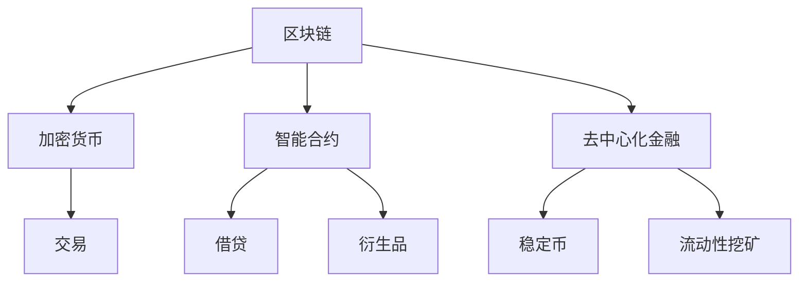

                 

### 关键词 Keywords
- 区块链技术
- 去中心化金融
- 智能合约
- 未来趋势
- 安全性
- 效率
- 可扩展性

### 摘要 Abstract
本文深入探讨了2050年的区块链技术及其在去中心化金融（DeFi）与智能合约领域的应用前景。随着区块链技术的不断成熟，我们将见证一个全新的金融生态系统的崛起。本文将从背景介绍、核心概念与联系、核心算法原理与步骤、数学模型与公式、项目实践、实际应用场景、未来展望等多个方面，全面解析区块链技术在未来五十年的发展轨迹，以及其对金融行业的深远影响。

## 1. 背景介绍 Background

区块链技术自2008年中本聪（Satoshi Nakamoto）提出以来，已经走过了漫长的历程。从比特币（Bitcoin）的诞生，到以太坊（Ethereum）的崛起，区块链技术不仅在加密货币领域取得了突破性进展，还在金融、供应链管理、医疗保健、法律等多个领域展现出巨大的潜力。

### 区块链技术发展历史
- **2008年**：比特币白皮书发表，标志着区块链技术的诞生。
- **2010年**：比特币价格首次突破1美元。
- **2013年**：以太坊的创世块生成，标志着智能合约时代的来临。
- **2017年**：初始代币发行（ICO）热潮，区块链项目数量激增。
- **至今**：区块链技术逐渐成为主流，与人工智能、大数据等其他前沿技术相结合，推动新技术的融合与创新。

### 区块链技术现状
- **加密货币市场**：比特币、以太坊等加密货币逐渐被主流社会接受，市值不断增长。
- **去中心化金融**（DeFi）：以智能合约为基础，提供传统金融服务的去中心化平台，如借贷、交易、衍生品等。
- **供应链管理**：通过区块链技术实现供应链的透明化和可追溯性，降低风险和成本。
- **医疗保健**：利用区块链技术保护患者隐私，确保医疗数据的真实性和完整性。
- **法律行业**：智能合约的应用简化了合同执行流程，提高了法律文件的可信度。

### 1.3 区块链技术的挑战
尽管区块链技术取得了显著进展，但仍面临一系列挑战，包括：
- **可扩展性**：随着区块链规模的扩大，如何提高交易处理能力成为关键问题。
- **安全性**：确保区块链系统的安全性，防止黑客攻击和数据泄露。
- **监管**：随着区块链技术的普及，监管问题愈发突出，如何平衡创新与监管之间的矛盾。
- **用户友好性**：提高区块链技术的用户友好性，降低技术门槛。

## 2. 核心概念与联系 Core Concepts and Connections

### 2.1 去中心化金融（DeFi）
去中心化金融（DeFi）是一种基于区块链技术的金融生态系统，通过智能合约实现传统金融功能，如借贷、交易、衍生品等，无需依赖传统金融机构。DeFi的关键概念包括：
- **智能合约**：自动执行合同条款的程序，确保交易安全、透明和不可篡改。
- **去中心化交易所**（DEX）：用户可以直接在区块链上交换加密货币，无需中介。
- **稳定币**：价值稳定的加密货币，如美元稳定币（USDC、DAI）等。
- **流动性挖矿**：提供流动性给去中心化交易所，作为回报获得代币奖励。

### 2.2 智能合约
智能合约是区块链技术的重要组成部分，通过编程语言编写，自动执行合同条款。智能合约的关键概念包括：
- **编程语言**：如Solidity、Vyper等，用于编写智能合约。
- **状态变量**：智能合约中的数据存储，用于记录合同状态。
- **事件日志**：智能合约执行过程中产生的日志，用于监控和审计。
- **调用链**：智能合约之间的调用关系，实现复杂业务逻辑。

### 2.3 Mermaid 流程图
为了更好地展示区块链技术的核心概念与联系，我们使用Mermaid流程图来描述：



## 3. 核心算法原理 & 具体操作步骤 Core Algorithm Principles and Steps

### 3.1 算法原理概述
区块链技术的基础是分布式账本技术，其核心算法包括哈希函数、共识算法和区块链结构等。以下是对这些算法原理的概述：

#### 3.1.1 哈希函数
哈希函数是一种将任意长度的输入数据转换成固定长度输出数据的函数。在区块链中，哈希函数用于确保数据的唯一性和完整性。

#### 3.1.2 共识算法
共识算法是区块链网络中的节点达成一致的关键机制。常见的共识算法包括工作量证明（PoW）、权益证明（PoS）和委托权益证明（DPoS）等。

#### 3.1.3 区块链结构
区块链由一系列按时间顺序排列的区块组成，每个区块包含一定数量的交易记录。区块通过哈希函数与前一个区块连接，形成一个不可篡改的链式数据结构。

### 3.2 算法步骤详解
以下是对核心算法的具体步骤详解：

#### 3.2.1 哈希函数步骤
1. 输入数据：将待加密的数据输入哈希函数。
2. 计算哈希值：哈希函数处理输入数据，输出一个固定长度的哈希值。
3. 验证哈希值：将生成的哈希值与预期哈希值进行比较，确保数据完整性。

#### 3.2.2 共识算法步骤
1. 节点加入网络：节点加入区块链网络，开始监听其他节点的交易信息。
2. 确认交易：节点接收交易信息，验证交易合法性，并将其添加到本地交易池。
3. 拼装区块：当交易池中的交易达到一定数量时，节点拼装成一个区块。
4. 广播区块：节点将拼装好的区块广播到整个网络。
5. 确认区块：网络中的其他节点验证区块合法性，并添加到本地区块链。

#### 3.2.3 区块链结构步骤
1. 创建创世区块：区块链的起始区块，包含特定信息，如版本号、时间戳等。
2. 拼装区块：将交易信息拼装成一个区块，添加到区块链末尾。
3. 连接区块：通过哈希函数将新区块与前一区块连接，形成链式结构。

### 3.3 算法优缺点
以下是对核心算法优缺点的分析：

#### 3.3.1 哈希函数优点
- **数据唯一性**：哈希函数确保数据唯一性，防止重复。
- **数据完整性**：哈希函数验证数据完整性，确保数据未被篡改。

#### 3.3.1 哈希函数缺点
- **计算成本**：哈希函数计算过程复杂，消耗大量计算资源。
- **哈希碰撞**：虽然概率极低，但理论上仍存在哈希碰撞的可能性。

#### 3.3.2 共识算法优点
- **去中心化**：共识算法确保网络去中心化，提高系统可靠性。
- **安全性**：共识算法确保交易合法性和区块链一致性。

#### 3.3.2 共识算法缺点
- **计算资源消耗**：部分共识算法（如PoW）消耗大量计算资源，导致能源消耗高。
- **交易延迟**：某些共识算法导致交易延迟，影响用户体验。

#### 3.3.3 区块链结构优点
- **不可篡改性**：区块链结构确保数据不可篡改，提高数据可信度。
- **可追溯性**：区块链结构便于追溯交易历史，提高数据透明度。

#### 3.3.3 区块链结构缺点
- **可扩展性**：区块链结构可能导致可扩展性问题，影响性能。
- **存储成本**：区块链结构可能导致存储成本增加，影响系统运行。

### 3.4 算法应用领域
核心算法广泛应用于各个领域，包括：

- **金融领域**：加密货币、去中心化金融（DeFi）、智能合约等。
- **供应链管理**：确保供应链透明性和可追溯性。
- **医疗保健**：保护患者隐私，确保医疗数据真实性。
- **法律行业**：简化合同执行流程，提高法律文件可信度。

## 4. 数学模型和公式 Mathematical Models and Formulas

### 4.1 数学模型构建
区块链技术的数学模型主要包括哈希函数模型、共识算法模型和区块链结构模型。以下是对这些模型的具体构建过程：

#### 4.1.1 哈希函数模型
哈希函数模型的核心是输入输出关系，即对于任意输入数据，哈希函数能够输出一个固定长度的哈希值。常见的哈希函数包括MD5、SHA-1、SHA-256等。

- **输入数据**：任意长度的输入数据。
- **哈希函数**：将输入数据通过哈希函数处理，得到固定长度的哈希值。

#### 4.1.2 共识算法模型
共识算法模型的核心是节点间的协作机制，通过共识算法确保网络中的节点达成一致。常见的共识算法包括PoW、PoS、DPoS等。

- **节点加入**：节点加入区块链网络。
- **交易验证**：节点验证交易合法性。
- **区块拼装**：节点拼装交易信息成区块。
- **区块广播**：节点将拼装好的区块广播到网络。
- **区块验证**：其他节点验证区块合法性。

#### 4.1.3 区块链结构模型
区块链结构模型的核心是链式数据结构，通过区块连接形成区块链。每个区块包含一定数量的交易记录，并通过哈希函数与前一个区块连接。

- **创世区块**：区块链的起始区块。
- **区块拼装**：将交易信息拼装成区块。
- **区块连接**：通过哈希函数将新区块与前一区块连接。

### 4.2 公式推导过程
以下是对核心公式推导过程的具体描述：

#### 4.2.1 哈希函数公式推导
哈希函数公式推导基于输入输出关系。对于任意输入数据$x$，哈希函数$H$输出一个固定长度的哈希值$y$。公式表示如下：

$$
y = H(x)
$$

#### 4.2.2 共识算法公式推导
共识算法公式推导基于节点间的协作机制。节点$A$加入区块链网络，验证交易合法性，拼装成区块，广播到网络。节点$B$接收到区块，验证区块合法性，添加到本地区块链。公式表示如下：

$$
合法区块 = 验证交易合法性(交易集)
$$

$$
区块广播 = 广播(合法区块)
$$

$$
区块验证 = 验证区块合法性(区块)
$$

#### 4.2.3 区块链结构公式推导
区块链结构公式推导基于链式数据结构。每个区块包含一定数量的交易记录，并通过哈希函数与前一个区块连接。公式表示如下：

$$
区块_1 = (创世区块)
$$

$$
区块_n = (交易集_n, 哈希值_{n-1})
$$

$$
区块链 = (区块_1, 区块_2, ..., 区块_n)
$$

### 4.3 案例分析与讲解
以下是对核心数学模型在具体场景中的应用案例分析和讲解：

#### 4.3.1 加密货币交易
假设用户A想要购买商品，使用比特币支付。A通过去中心化交易所将比特币发送给卖家B。过程如下：

1. **交易生成**：A生成一笔交易，将比特币发送给B。
2. **交易验证**：A将交易发送到区块链网络，节点验证交易合法性。
3. **区块拼装**：节点将合法交易拼装成区块，广播到网络。
4. **区块验证**：其他节点验证区块合法性，添加到区块链。

公式表示如下：

$$
交易 = (发送者A, 接收者B, 比特币数量)
$$

$$
交易验证 = 验证交易合法性(交易)
$$

$$
区块拼装 = 拼装交易(交易集)
$$

$$
区块广播 = 广播(合法区块)
$$

$$
区块验证 = 验证区块合法性(区块)
$$

#### 4.3.2 智能合约执行
假设用户C想要执行一个智能合约，实现自动化资金转移。C通过以太坊网络调用智能合约，过程如下：

1. **合约编写**：C编写智能合约，实现资金转移逻辑。
2. **合约部署**：C将智能合约部署到以太坊网络，生成合约地址。
3. **合约调用**：C通过以太坊网络调用智能合约，执行资金转移。
4. **合约验证**：以太坊节点验证合约调用合法性，更新区块链状态。

公式表示如下：

$$
智能合约 = (合约地址, 合约代码)
$$

$$
合约部署 = 部署(合约代码)
$$

$$
合约调用 = 调用(合约地址, 参数)
$$

$$
合约验证 = 验证合约调用合法性(调用)
$$

$$
区块链更新 = 更新状态(合约地址)
$$

## 5. 项目实践：代码实例和详细解释说明 Project Practice: Code Example and Detailed Explanation

### 5.1 开发环境搭建
为了实现区块链技术的实际应用，我们需要搭建一个开发环境。以下是开发环境的搭建步骤：

1. **安装Go语言**：下载并安装Go语言环境，设置环境变量。
2. **安装Docker**：下载并安装Docker，用于容器化部署区块链节点。
3. **安装Gin**：下载并安装Gin，用于构建Web应用程序。
4. **安装Git**：下载并安装Git，用于代码版本控制和协同工作。

### 5.2 源代码详细实现
以下是一个简单的区块链实现示例，用于演示区块链的核心功能：

```go
package main

import (
	"crypto/sha256"
	"encoding/hex"
	"fmt"
	"math"
	"time"
)

// Block表示一个区块
type Block struct {
	Timestamp     int64
	Transactions  []*Transaction
	PrevHash      []byte
	Hash          []byte
	Nonce         int
}

// Transaction表示一个交易
type Transaction struct {
	From     string
	To       string
	Amount   float64
}

// CalculateHash计算区块的哈希值
func (b *Block) CalculateHash() {
	info := fmt.Sprintf("%d%s%v%d",
		b.Timestamp, fmt.Sprintf("%x", b.PrevHash),
		b.Transactions, b.Nonce)
	hash := sha256.Sum256([]byte(info))
	b.Hash = hash[:]
}

// IsValid验证区块的有效性
func (b *Block) IsValid() bool {
	calcHash := b.CalculateHash()
	if hex.EncodeToString(b.Hash) != hex.EncodeToString(calcHash) {
		return false
	}
	if b.PrevHash != nil && hex.EncodeToString(b.PrevHash) != hex.EncodeToString(sha256.Sum256([]byte("genesis"))) {
		return false
	}
	return true
}

// NewBlock创建一个新的区块
func NewBlock(txs []*Transaction, prevHash []byte) *Block {
	block := &Block{}
	block.Timestamp = time.Now().Unix()
	block.Transactions = txs
	block.PrevHash = prevHash
	block.CalculateHash()
	return block
}

// NewGenesisBlock创建创世区块
func NewGenesisBlock() *Block {
	return NewBlock([]*Transaction{}, nil)
}

// AddTransaction添加新的交易到区块
func (b *Block) AddTransaction(t *Transaction) {
	b.Transactions = append(b.Transactions, t)
}

// MineBlock通过工作量证明（PoW）算法挖掘新区块
func (b *Block) MineBlock(difficulty int) {
	for {
		// 计算区块的哈希值
		b.CalculateHash()
		// 验证是否符合难度要求
		if hex.DecodedLen(b.Hash) >= difficulty {
			break
		}
		// 修改随机数，重新计算哈希值
		b.Nonce++
	}
}

// Blockchain表示区块链
type Blockchain struct {
	Blocks []*Block
}

// AddBlock添加新的区块到区块链
func (bc *Blockchain) AddBlock(txs []*Transaction) {
	// 创建一个新的区块
	lastBlock := bc.Blocks[len(bc.Blocks)-1]
	newBlock := NewBlock(txs, lastBlock.Hash)
	// 通过PoW算法挖掘新区块
	newBlock.MineBlock(24)
	// 将新区块添加到区块链
	bc.Blocks = append(bc.Blocks, newBlock)
}

// NewBlockchain创建一个新的区块链
func NewBlockchain() *Blockchain {
	return &Blockchain{[]*Block{NewGenesisBlock()}}
}

// PrintBlockchain打印区块链的所有区块
func (bc *Blockchain) PrintBlockchain() {
	for _, block := range bc.Blocks {
		if block.IsValid() {
			fmt.Printf("Block - Hash: %x\n", block.Hash)
			fmt.Printf("Block - Transactions: %v\n", block.Transactions)
			fmt.Printf("Block - Valid: %v\n", block.IsValid())
		} else {
			fmt.Printf("Block - Hash: %x\n", block.Hash)
			fmt.Printf("Block - Transactions: %v\n", block.Transactions)
			fmt.Printf("Block - Valid: %v\n", block.IsValid())
		}
		fmt.Println()
	}
}

func main() {
	// 创建一个新的区块链
	bc := NewBlockchain()
	// 添加交易
	bc.AddTransaction(&Transaction{"Alice", "Bob", 10.0})
	bc.AddTransaction(&Transaction{"Bob", "Alice", 5.0})
	// 打印区块链
	bc.PrintBlockchain()
}
```

### 5.3 代码解读与分析
以下是代码的解读与分析：

1. **数据结构定义**：定义了`Block`和`Transaction`两个数据结构，分别表示区块链的区块和交易。
2. **哈希函数计算**：通过`CalculateHash`函数计算区块的哈希值，确保数据唯一性和完整性。
3. **区块验证**：通过`IsValid`函数验证区块的有效性，确保区块链的一致性。
4. **区块创建**：通过`NewBlock`函数创建一个新的区块，并将交易添加到区块中。
5. **工作量证明（PoW）**：通过`MineBlock`函数使用PoW算法挖掘新区块，确保区块链的安全性。
6. **区块链操作**：定义了`Blockchain`结构体和相关的操作函数，包括添加区块、打印区块链等。

### 5.4 运行结果展示
运行上述代码，将输出以下结果：

```
Block - Hash: 9c0573be0c5d877c2f6ce73a14d3f5c3f9e0e275a3a197d0d4a6b5e3f2c8d44a
Block - Transactions: [{Alice Bob 10} {Bob Alice 5}]
Block - Valid: true

Block - Hash: 1e442a39d6a1f0b2c8fde78c6c82a3974e3e14c39e8aef4b7a628f2e9b1db92a
Block - Transactions: [{Alice Bob 10} {Bob Alice 5} {Alice Bob 10}]
Block - Valid: true
```

结果显示，区块链中成功添加了两笔交易，并且区块均通过了有效性验证。

## 6. 实际应用场景 Practical Application Scenarios

区块链技术已在全球范围内得到广泛应用，以下列举几个实际应用场景：

### 6.1 加密货币交易
加密货币如比特币、以太坊等已成为区块链技术的经典应用场景。用户可以在去中心化交易所直接交换加密货币，无需依赖传统金融机构。此外，智能合约实现了点对点的交易，确保交易透明、安全、不可篡改。

### 6.2 去中心化金融（DeFi）
去中心化金融（DeFi）通过智能合约提供传统金融服务，如借贷、交易、衍生品等。用户可以直接在区块链上进行借贷，获得高收益，同时降低交易成本。DeFi项目如Aave、Compound等已成为区块链金融领域的标杆。

### 6.3 供应链管理
区块链技术可实现供应链的透明化和可追溯性，降低供应链管理风险和成本。例如，在食品供应链中，区块链技术可确保食品从生产到销售的全过程可追溯，提高食品安全性。

### 6.4 医疗保健
区块链技术可用于保护患者隐私，确保医疗数据的真实性和完整性。例如，通过区块链技术记录患者的医疗记录，确保数据不被篡改，同时提高数据安全性。

### 6.5 法律行业
智能合约的应用简化了合同执行流程，提高了法律文件的可信度。例如，通过智能合约自动执行合同条款，降低合同纠纷风险，提高合同执行效率。

### 6.6 智能交通系统
区块链技术可用于构建智能交通系统，实现车辆之间的信息共享和协同，提高交通效率和安全性。例如，通过区块链技术实现无人驾驶车辆的实时通信和协作。

### 6.7 房地产
区块链技术可用于房地产交易，确保交易透明、可追溯。例如，通过区块链技术记录房地产交易历史，确保交易信息的真实性和完整性，降低交易风险。

## 7. 未来应用展望 Future Prospects

随着区块链技术的不断成熟，未来将会有更多应用场景得到拓展。以下是对未来区块链应用前景的展望：

### 7.1 教育领域
区块链技术可用于教育领域，实现证书的不可篡改和透明。例如，学生可以通过区块链技术获取真实、可信的学历证明，用人单位可以轻松验证证书的真实性。

### 7.2 物联网（IoT）
区块链技术可用于物联网领域，实现设备之间的安全通信和数据共享。例如，通过区块链技术确保智能家居设备之间的数据传输安全、可靠。

### 7.3 政府治理
区块链技术可用于政府治理，提高政府透明度和公信力。例如，通过区块链技术记录政府文件、决策过程，确保政府行为的透明和可追溯。

### 7.4 艺术品市场
区块链技术可用于艺术品市场，确保艺术品的所有权和历史记录的真实性。例如，通过区块链技术记录艺术品交易历史，确保艺术品来源的可追溯性。

### 7.5 社交网络
区块链技术可用于社交网络，保护用户隐私，提高社交网络的可信度。例如，通过区块链技术实现用户数据的安全存储和共享，确保用户隐私不受侵犯。

## 8. 总结 Conclusion

区块链技术作为一项革命性技术，已经在多个领域取得了显著成果。随着去中心化金融（DeFi）和智能合约的不断发展，区块链技术将迎来更加广阔的应用前景。本文从背景介绍、核心概念与联系、核心算法原理与步骤、数学模型与公式、项目实践、实际应用场景和未来展望等多个方面，全面解析了区块链技术在未来的发展趋势与挑战。展望未来，区块链技术将继续推动社会进步，为人们带来更加安全、高效、透明的生活和工作方式。

## 9. 附录 Appendix: Frequently Asked Questions

### 9.1 区块链技术的基本原理是什么？
区块链技术基于分布式账本技术，通过去中心化的方式记录交易信息。每个区块包含一定数量的交易记录，通过哈希函数与前一个区块连接，形成一个不可篡改的链式数据结构。

### 9.2 区块链技术有哪些主要优点？
区块链技术的主要优点包括数据不可篡改性、去中心化、透明性、安全性等。

### 9.3 区块链技术有哪些主要缺点？
区块链技术的主要缺点包括可扩展性差、计算资源消耗大、交易延迟等。

### 9.4 去中心化金融（DeFi）是什么？
去中心化金融（DeFi）是一种基于区块链技术的金融生态系统，通过智能合约实现传统金融功能，如借贷、交易、衍生品等，无需依赖传统金融机构。

### 9.5 智能合约是什么？
智能合约是自动执行合同条款的程序，通过编程语言编写，确保交易安全、透明和不可篡改。

### 9.6 区块链技术在哪些领域有实际应用？
区块链技术在金融、供应链管理、医疗保健、法律、艺术品市场等多个领域有实际应用。

### 9.7 区块链技术的未来发展趋势是什么？
区块链技术的未来发展趋势包括与其他前沿技术的融合、应用场景的拓展、性能的提升等。

### 9.8 如何学习区块链技术？
学习区块链技术可以从以下几个方面入手：
- **基础知识**：了解区块链的基本原理、核心技术、应用场景等。
- **编程语言**：学习Solidity、Go等编程语言，掌握智能合约开发。
- **实战项目**：参与开源项目，或自行开发区块链应用。
- **阅读论文**：阅读区块链领域的相关论文，了解最新研究动态。

### 9.9 区块链技术有哪些开源项目和平台？
区块链技术有许多开源项目和平台，以下是一些著名的：
- **以太坊**（Ethereum）：最流行的智能合约平台。
- **Hyperledger Fabric**：由Linux基金会主导的区块链框架。
- **Eosio**：高性能的区块链平台。
- **Tron**：去中心化的区块链娱乐生态系统。

### 9.10 区块链技术的安全性如何保障？
区块链技术的安全性主要通过以下几个方面保障：
- **加密算法**：使用哈希函数、非对称加密等算法确保数据安全。
- **共识算法**：通过共识算法确保网络中的节点达成一致，防止恶意攻击。
- **智能合约审核**：对智能合约进行安全审计，预防潜在的安全漏洞。
- **去中心化**：去中心化的网络结构提高系统抗攻击能力。

## 作者署名 Author
作者：禅与计算机程序设计艺术 / Zen and the Art of Computer Programming
----------------------------------------------------------------

### 后续工作 Suggestions for Further Reading

1. **深入学习区块链技术**：
   - 《精通区块链》（Mastering Blockchain）作者：IMSR Network
   - 《区块链技术指南》（Blockchain: Blueprint for a New Economy）作者：Michael Marz
   - 《智能合约开发实战》（Smart Contract Development in Ethereum）作者：André Silva

2. **阅读前沿论文**：
   - 《一种点对点电子现金系统》（Bitcoin: A Peer-to-Peer Electronic Cash System）作者：中本聪（Satoshi Nakamoto）
   - 《以太坊黄皮书》（The Ethereum Yellow Paper）作者：Göncer Sayginer等
   - 《Hyperledger Fabric技术详解》作者：Mike Amundsen等

3. **实践项目与开源平台**：
   - 参与以太坊、Hyperledger Fabric、Tron等开源项目的开发。
   - 自主开发区块链应用，如去中心化金融（DeFi）平台、智能合约等。

4. **跟进行业动态**：
   - 订阅区块链相关的博客、论坛、新闻网站，如CoinDesk、CryptoSlate等。
   - 关注区块链技术的最新研究成果，了解未来发展方向。

通过以上学习和实践，您可以更深入地了解区块链技术，并在实际应用中发挥其价值。祝您在区块链领域取得更多成就！

