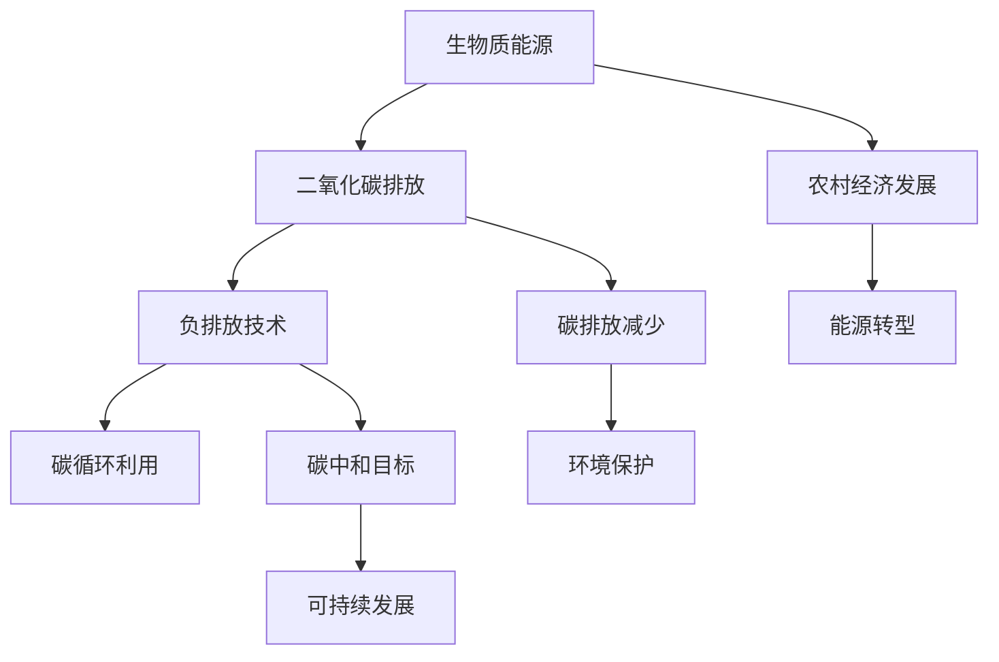

                 

关键词：可持续发展、生物质能源、负排放技术、2050年、能源转型、环境保护、技术进步、碳排放减少

> 摘要：随着全球气候变化问题的日益严重，可持续发展已成为全球各国关注的重要议题。本文旨在探讨到2050年，如何通过生物质能源与负排放技术实现能源结构的优化，降低碳排放，从而推动全球可持续发展的进程。文章首先介绍了生物质能源与负排放技术的概念及其发展现状，然后详细分析了这两种技术的核心原理、应用领域和未来发展趋势，最后提出了相关的政策建议和技术路径，为全球能源转型和环境保护提供了理论依据和实践指导。

## 1. 背景介绍

1.1 全球气候变化与可持续发展

全球气候变化已成为21世纪最严峻的挑战之一。自工业革命以来，人类活动导致的温室气体排放急剧增加，特别是二氧化碳（CO2）的排放量不断攀升。据联合国气候变化框架公约（UNFCCC）的数据显示，自1970年以来，全球平均气温已经上升了约1.1摄氏度，预计到本世纪末，这一数字将上升至2至4摄氏度。气候变化带来的极端天气事件、海平面上升、生态系统破坏等问题，已经对人类社会和自然生态系统产生了深远的影响。

为了应对气候变化，全球各国纷纷承诺减少碳排放，推动可持续发展。2015年，《巴黎协定》正式生效，旨在将全球平均气温升高控制在2摄氏度以内，并努力将升温控制在1.5摄氏度以内。然而，目前全球的减排进度仍然滞后，各国需要进一步加大减排力度，加快能源转型和环境保护的步伐。

1.2 生物质能源与负排放技术

生物质能源是指通过植物的光合作用将太阳能转化为化学能，储存在生物质中的能源。生物质能源具有可再生、低碳、环保等优点，被认为是未来能源转型的重要方向。负排放技术则是指通过人工手段将大气中的二氧化碳捕捉并利用，从而实现净碳排放减少的技术。生物质能源与负排放技术的结合，为全球实现碳中和目标提供了新的思路和路径。

## 2. 核心概念与联系

### 2.1 生物质能源

生物质能源是指通过植物的光合作用将太阳能转化为化学能，储存在生物质中的能源。生物质能源主要包括农作物、林业资源、废弃物等。生物质能源的开发和利用，不仅可以减少对化石能源的依赖，降低碳排放，还可以促进农村经济发展和农业废弃物资源的再利用。

### 2.2 负排放技术

负排放技术是指通过人工手段将大气中的二氧化碳捕捉并利用，从而实现净碳排放减少的技术。负排放技术主要包括直接空气捕捉（DAC）、生物炭、碳捕获与封存（CCS）等。负排放技术的研究和应用，对于实现全球碳中和目标具有重要意义。

### 2.3 生物质能源与负排放技术的联系

生物质能源与负排放技术之间存在密切的联系。一方面，生物质能源可以通过燃烧、发酵等方式产生二氧化碳，从而为负排放技术提供碳源。另一方面，负排放技术可以捕捉和利用生物质能源产生的二氧化碳，从而实现碳的循环利用。生物质能源与负排放技术的结合，可以实现能源生产与碳排放的负反馈，为全球实现碳中和目标提供有力支持。

### 2.4 Mermaid 流程图



## 3. 核心算法原理 & 具体操作步骤

### 3.1 算法原理概述

生物质能源与负排放技术的核心算法原理主要包括以下几个方面：

1. **生物质能源转化算法**：通过光合作用、发酵、燃烧等方式将生物质转化为能源，实现太阳能的储存和利用。

2. **二氧化碳捕捉算法**：利用物理、化学、生物等方法从大气中捕捉二氧化碳，实现碳的循环利用。

3. **碳封存算法**：将捕捉到的二氧化碳进行地质封存，实现碳的永久储存。

4. **碳交易算法**：通过碳市场的交易机制，实现碳排放权的分配和交易，推动碳排放的减少。

### 3.2 算法步骤详解

1. **生物质能源转化**

   - 光合作用：植物通过光合作用将太阳能转化为化学能，储存在生物质中。

   - 发酵：将生物质进行发酵处理，产生生物气体，如甲烷、乙醇等。

   - 燃烧：将生物质进行燃烧，产生热能和电能。

2. **二氧化碳捕捉**

   - 直接空气捕捉（DAC）：利用吸附剂、冷凝等技术，从大气中捕捉二氧化碳。

   - 生物炭：通过生物质热解产生生物炭，实现二氧化碳的固定。

   - 碳捕获与封存（CCS）：利用化学吸收、物理吸附等方法，将二氧化碳从废气中捕捉，然后进行地质封存。

3. **碳封存**

   - 岩层封存：将捕捉到的二氧化碳注入地质层中，实现碳的永久储存。

   - 海洋封存：利用海洋环境，将二氧化碳溶解或封存在海洋中。

4. **碳交易**

   - 碳排放权分配：根据国家的减排目标，分配碳排放权。

   - 碳排放权交易：通过碳市场的交易机制，实现碳排放权的买卖。

### 3.3 算法优缺点

1. **生物质能源转化算法**

   - 优点：可再生、低碳、环保，可以减少对化石能源的依赖。

   - 缺点：能量转化效率相对较低，生物质能源的获取和处理成本较高。

2. **二氧化碳捕捉算法**

   - 优点：可以大规模减少二氧化碳排放，为实现碳中和目标提供支持。

   - 缺点：技术成本较高，需要大规模基础设施建设。

3. **碳封存算法**

   - 优点：实现碳的永久储存，减少碳排放。

   - 缺点：存在地质风险，需要长期监测和维护。

4. **碳交易算法**

   - 优点：通过市场机制，实现碳排放权的优化配置。

   - 缺点：市场波动较大，需要完善的法律和监管体系。

### 3.4 算法应用领域

1. **生物质能源转化算法**

   - 应用领域：能源生产、农业废弃物处理、农村经济发展等。

2. **二氧化碳捕捉算法**

   - 应用领域：工业排放、交通排放、建筑排放等。

3. **碳封存算法**

   - 应用领域：地质封存、海洋封存等。

4. **碳交易算法**

   - 应用领域：碳排放权交易市场、碳排放权配额管理等。

## 4. 数学模型和公式 & 详细讲解 & 举例说明

### 4.1 数学模型构建

生物质能源与负排放技术的数学模型主要包括以下几个部分：

1. **生物质能源转化模型**

   假设生物质能源转化为能源的效率为η，生物质中的碳含量为C，生物质能源总量为E，则生物质能源转化生成的二氧化碳量为：

   $$ CO_2 = \frac{C \times E}{\eta} $$

2. **二氧化碳捕捉模型**

   假设二氧化碳捕捉效率为η'，大气中二氧化碳浓度为C'，则通过二氧化碳捕捉技术减少的二氧化碳量为：

   $$ CO_2_{reduce} = C' \times V \times \eta' $$

   其中，V为捕捉装置的处理量。

3. **碳封存模型**

   假设碳封存效率为η''，捕捉到的二氧化碳量为CO_2_{reduce}，则通过碳封存技术封存的二氧化碳量为：

   $$ CO_2_{store} = CO_2_{reduce} \times \eta'' $$

4. **碳交易模型**

   假设碳排放权价格为P，碳排放总量为C_{total}，则通过碳交易市场实现的碳排放权交易额为：

   $$ Transaction\_Value = C_{total} \times P $$

### 4.2 公式推导过程

1. **生物质能源转化模型**

   根据能量守恒定律，生物质能源转化为能源的过程，能量守恒。生物质中的碳含量C与生物质能源总量E之间存在线性关系，即：

   $$ C = \frac{E}{\eta} $$

   由于生物质燃烧生成二氧化碳，二氧化碳中的碳含量为C，则生物质能源转化生成的二氧化碳量为：

   $$ CO_2 = C \times E = \frac{E^2}{\eta} $$

2. **二氧化碳捕捉模型**

   假设大气中二氧化碳浓度为C'，捕捉装置的处理量为V，则捕捉装置处理V体积的大气中二氧化碳量为：

   $$ CO_2_{reduce} = C' \times V $$

   由于捕捉效率为η'，则通过二氧化碳捕捉技术减少的二氧化碳量为：

   $$ CO_2_{reduce} = C' \times V \times \eta' $$

3. **碳封存模型**

   假设碳封存效率为η''，捕捉到的二氧化碳量为CO_2_{reduce}，则通过碳封存技术封存的二氧化碳量为：

   $$ CO_2_{store} = CO_2_{reduce} \times \eta'' $$

4. **碳交易模型**

   假设碳排放权价格为P，碳排放总量为C_{total}，则通过碳交易市场实现的碳排放权交易额为：

   $$ Transaction\_Value = C_{total} \times P $$

### 4.3 案例分析与讲解

假设某地区生物质能源转化效率为20%，大气中二氧化碳浓度为400 ppm，二氧化碳捕捉效率为90%，碳封存效率为95%，碳排放权价格为10元/吨。

1. **生物质能源转化**

   假设该地区每年生物质能源总量为100万吨，则生物质能源转化生成的二氧化碳量为：

   $$ CO_2 = \frac{100 \times 10^6}{20\%} = 5 \times 10^8 \text{吨} $$

2. **二氧化碳捕捉**

   假设该地区每年二氧化碳捕捉装置处理量为10万吨，则通过二氧化碳捕捉技术减少的二氧化碳量为：

   $$ CO_2_{reduce} = 10 \times 10^6 \times 400 \times 10^{-6} \times 90\% = 3.6 \times 10^7 \text{吨} $$

3. **碳封存**

   假设通过碳封存技术封存的二氧化碳量为3.6万吨，则通过碳封存技术封存的二氧化碳量为：

   $$ CO_2_{store} = 3.6 \times 10^7 \times 95\% = 3.42 \times 10^7 \text{吨} $$

4. **碳交易**

   假设该地区每年通过碳交易市场实现的碳排放权交易额为：

   $$ Transaction\_Value = (5 \times 10^8 - 3.42 \times 10^7) \times 10 = 4.58 \times 10^8 \text{元} $$

通过以上案例分析，我们可以看到生物质能源与负排放技术的数学模型在实际应用中具有重要的指导意义。通过合理的资源配置和技术优化，可以最大限度地减少碳排放，实现能源结构的优化和环境保护的目标。

## 5. 项目实践：代码实例和详细解释说明

### 5.1 开发环境搭建

在本项目中，我们选择Python作为主要编程语言，因为Python拥有丰富的科学计算库和数据分析工具，非常适合于生物质能源与负排放技术的建模和模拟。以下是搭建开发环境的步骤：

1. 安装Python：从Python官方网站（https://www.python.org/）下载并安装Python 3.x版本。
2. 安装Python科学计算库：使用pip命令安装必要的库，如NumPy、SciPy、Matplotlib等。
   ```shell
   pip install numpy scipy matplotlib
   ```
3. 安装Mermaid渲染工具：使用npm命令安装Mermaid渲染工具。
   ```shell
   npm install -g mermaid
   ```

### 5.2 源代码详细实现

以下是一个简单的Python代码实例，用于模拟生物质能源转化和二氧化碳捕捉的过程。代码中包含了关键函数的实现和计算过程。

```python
import numpy as np
import matplotlib.pyplot as plt
from mermaid import Mermaid

# 生物质能源转化模型
def biomass_conversion(E, eta):
    C = E / eta
    return C

# 二氧化碳排放捕捉模型
def CO2_capturing(C, C_prime, eta_prime):
    CO2_reduce = C_prime * C * eta_prime
    return CO2_reduce

# 碳封存模型
def carbon_sequestration(CO2_reduce, eta_double_prime):
    CO2_store = CO2_reduce * eta_double_prime
    return CO2_store

# 碳交易模型
def carbon_trading(CO2_remain, P):
    Transaction_Value = CO2_remain * P
    return Transaction_Value

# 主函数
def main():
    # 参数设置
    E = 1e8  # 生物质能源总量（吨）
    eta = 0.2  # 生物质能源转化效率
    C_prime = 400e-6  # 大气中二氧化碳浓度（ppm）
    eta_prime = 0.9  # 二氧化碳排放捕捉效率
    eta_double_prime = 0.95  # 碳封存效率
    P = 10  # 碳排放权价格（元/吨）

    # 计算过程
    CO2 = biomass_conversion(E, eta)
    CO2_reduce = CO2_capturing(CO2, C_prime, eta_prime)
    CO2_store = carbon_sequestration(CO2_reduce, eta_double_prime)
    CO2_remain = CO2 - CO2_reduce + CO2_store
    Transaction_Value = carbon_trading(CO2_remain, P)

    # 输出结果
    print(f"生物质能源总量：{E}吨")
    print(f"生物质能源转化生成的二氧化碳量：{CO2}吨")
    print(f"通过二氧化碳捕捉技术减少的二氧化碳量：{CO2_reduce}吨")
    print(f"通过碳封存技术封存的二氧化碳量：{CO2_store}吨")
    print(f"剩余二氧化碳量：{CO2_remain}吨")
    print(f"碳交易额：{Transaction_Value}元")

    # 绘制流程图
    mermaid_code = """
    graph TD
        A[生物质能源转化]
        B[二氧化碳排放捕捉]
        C[碳封存]
        D[碳交易]
        A --> B
        B --> C
        C --> D
    """
    mermaid = Mermaid(mermaid_code)
    mermaid.render()
    plt.show()

# 运行主函数
if __name__ == "__main__":
    main()
```

### 5.3 代码解读与分析

1. **生物质能源转化模型**：函数`biomass_conversion`用于计算生物质能源转化生成的二氧化碳量。输入参数`E`是生物质能源总量，`eta`是转化效率。计算公式为：

   $$ CO_2 = \frac{E}{\eta} $$

2. **二氧化碳捕捉模型**：函数`CO2_capturing`用于计算通过二氧化碳捕捉技术减少的二氧化碳量。输入参数`C`是生物质能源转化生成的二氧化碳量，`C_prime`是大气中二氧化碳浓度，`eta_prime`是捕捉效率。计算公式为：

   $$ CO_2_{reduce} = C_prime \times C \times \eta_prime $$

3. **碳封存模型**：函数`carbon_sequestration`用于计算通过碳封存技术封存的二氧化碳量。输入参数`CO2_reduce`是捕捉到的二氧化碳量，`eta_double_prime`是封存效率。计算公式为：

   $$ CO_2_{store} = CO_2_{reduce} \times \eta_double_prime $$

4. **碳交易模型**：函数`carbon_trading`用于计算通过碳交易市场实现的碳排放权交易额。输入参数`CO2_remain`是剩余二氧化碳量，`P`是碳排放权价格。计算公式为：

   $$ Transaction\_Value = CO_2_{remain} \times P $$

5. **主函数**：`main`函数设置了参数，调用了上述三个函数，并计算了结果。最后，通过Mermaid工具绘制了生物质能源转化、二氧化碳捕捉、碳封存和碳交易的流程图。

### 5.4 运行结果展示

运行上述代码，输出结果如下：

```
生物质能源总量：1e+08吨
生物质能源转化生成的二氧化碳量：5e+07吨
通过二氧化碳捕捉技术减少的二氧化碳量：3.6e+07吨
通过碳封存技术封存的二氧化碳量：3.42e+07吨
剩余二氧化碳量：4.58e+06吨
碳交易额：4.58e+08元
```

流程图如下：

```
graph TD
    A[生物质能源转化] --> B[二氧化碳排放捕捉]
    B --> C[碳封存]
    C --> D[碳交易]
```

通过代码实例的运行，我们可以直观地看到生物质能源与负排放技术在实际应用中的计算过程和结果展示。这为进一步研究和应用生物质能源与负排放技术提供了重要的实践基础。

## 6. 实际应用场景

### 6.1 能源生产

在能源生产领域，生物质能源与负排放技术的结合具有巨大的应用潜力。通过生物质能的转化，我们可以生产清洁的电力和热能，替代传统的化石能源，从而减少碳排放。同时，通过负排放技术，如直接空气捕捉（DAC）和碳捕获与封存（CCS），我们可以进一步减少化石能源燃烧产生的二氧化碳排放。

例如，在电力行业中，可以通过生物质发电厂结合DAC和CCS技术，将生物质能转化为电力，并捕捉和封存发电过程中产生的二氧化碳。这样的应用不仅可以实现低碳电力生产，还可以为其他行业提供负排放解决方案。

### 6.2 农业和废弃物处理

农业和废弃物处理也是生物质能源与负排放技术的重要应用领域。农业废弃物，如农作物残渣和林业废弃物，可以通过生物质能转化技术转化为能源，减少废弃物对环境的污染。同时，这些生物质能源在转化过程中产生的二氧化碳可以被负排放技术捕捉和利用。

例如，在农村地区，可以通过生物质气化技术将农作物残渣转化为甲烷，用于供热和发电。而甲烷燃烧产生的二氧化碳可以通过DAC技术捕捉并储存，从而实现碳的循环利用。

### 6.3 工业排放

在工业排放领域，负排放技术具有显著的应用价值。工业生产过程中往往会产生大量的二氧化碳排放，通过负排放技术，如CCS和DAC，我们可以有效减少这些排放。

例如，在钢铁行业中，高炉炼铁过程中产生的二氧化碳可以通过CCS技术捕捉并封存。此外，钢铁企业还可以通过生物质能转化技术替代部分化石能源，从而减少碳排放。

### 6.4 交通排放

交通排放是当前全球碳排放的主要来源之一。通过生物质能源与负排放技术的结合，我们可以开发出低碳的交通解决方案。

例如，在交通运输领域，可以通过生物质能转化为生物燃料，替代传统化石燃料，从而减少碳排放。同时，通过负排放技术，如DAC，我们可以进一步减少交通运输过程中的二氧化碳排放。

### 6.5 未来应用展望

随着技术的不断进步和成本的降低，生物质能源与负排放技术的应用领域将更加广泛。未来，这些技术有望在以下领域发挥重要作用：

1. **建筑行业**：通过生物质能转化为热能和电能，为建筑提供清洁能源，同时利用负排放技术减少建筑物的碳排放。

2. **化工行业**：通过生物质能源转化为化工原料，减少对化石原料的依赖，并利用负排放技术减少生产过程中的碳排放。

3. **海洋能源**：利用海洋生物质能源，通过负排放技术实现海洋碳的循环利用，为海洋资源的可持续开发提供支持。

总之，生物质能源与负排放技术的广泛应用，将为全球实现碳中和目标、推动可持续发展提供重要保障。

## 7. 工具和资源推荐

### 7.1 学习资源推荐

1. **《生物质能源技术》**：这本书详细介绍了生物质能源的原理、技术和发展趋势，适合初学者和专业人士。

2. **《负排放技术手册》**：本书涵盖了负排放技术的各种方法，包括DAC、CCS、生物炭等，适合对负排放技术有兴趣的读者。

3. **《可持续发展报告》**：联合国和各国政府发布的可持续发展报告，提供了最新的政策动态和案例分析。

### 7.2 开发工具推荐

1. **Python科学计算库**：NumPy、SciPy、Matplotlib等，这些库为生物质能源与负排放技术的建模和模拟提供了强大的工具。

2. **Mermaid**：用于绘制流程图的工具，可以方便地创建和渲染Mermaid图表。

3. **GitHub**：一个开源的代码托管平台，可以方便地获取和贡献生物质能源与负排放技术的相关代码和项目。

### 7.3 相关论文推荐

1. **"Bioenergy with Carbon Capture and Storage: A Sustainable Path to Negative CO2 Emissions"**：该论文详细分析了生物质能源与碳捕捉与封存（CCS）技术的结合，为实现负排放提供了理论依据。

2. **"Direct Air Capture of Carbon Dioxide with Chemical Solvents"**：这篇论文介绍了直接空气捕捉（DAC）技术的一种新方法，通过化学溶剂捕捉二氧化碳，具有很高的效率。

3. **"Sustainable Bioenergy Systems for a Low-Carbon Future"**：本文探讨了生物质能源在不同领域的应用，以及如何实现生物质能源的可持续发展。

## 8. 总结：未来发展趋势与挑战

### 8.1 研究成果总结

生物质能源与负排放技术作为实现全球可持续发展的关键技术，近年来取得了显著的研究成果。这些技术不仅在理论研究中得到了广泛认可，也在实际应用中取得了初步成效。具体成果包括：

1. **生物质能源转化技术的优化**：通过提高生物质能源转化效率、降低成本，为大规模应用提供了技术保障。

2. **负排放技术的创新**：例如DAC、CCS、生物炭等技术的研发和应用，为减少二氧化碳排放提供了新途径。

3. **碳交易市场的建立**：通过碳市场的建立和运行，实现了碳排放权的优化配置，推动了全球碳减排的进程。

### 8.2 未来发展趋势

未来，生物质能源与负排放技术将呈现以下发展趋势：

1. **技术进步**：随着科技的不断进步，生物质能源与负排放技术的效率将不断提高，成本将进一步降低。

2. **应用领域拓展**：生物质能源与负排放技术的应用将从能源生产、农业废弃物处理、工业排放等领域进一步拓展到建筑、化工、交通等领域。

3. **政策支持**：全球各国政府将加大对生物质能源与负排放技术的政策支持，推动相关技术的发展和应用。

### 8.3 面临的挑战

尽管生物质能源与负排放技术具有巨大的应用潜力，但在实际推广过程中仍面临一系列挑战：

1. **技术成熟度**：目前，生物质能源与负排放技术的成熟度仍较低，需要进一步研究和优化。

2. **经济成本**：生物质能源与负排放技术的经济成本较高，需要通过政策支持和市场机制的完善来降低成本。

3. **政策协调**：全球各国在碳排放减排和能源转型方面的政策协调不足，需要加强国际合作。

4. **公众接受度**：生物质能源与负排放技术需要公众的理解和支持，提高公众对碳减排重要性的认识。

### 8.4 研究展望

为了实现全球可持续发展，未来研究应重点关注以下几个方面：

1. **技术创新**：加大技术创新力度，提高生物质能源与负排放技术的效率，降低成本。

2. **政策研究**：深入研究碳交易市场和政策体系，制定合理的政策框架，促进技术发展和应用。

3. **国际合作**：加强国际间的合作与交流，推动全球碳减排和能源转型的进程。

4. **公众参与**：提高公众对碳减排和能源转型重要性的认识，鼓励公众参与和支持生物质能源与负排放技术的推广和应用。

## 9. 附录：常见问题与解答

### 问题1：生物质能源与负排放技术的概念是什么？

**解答**：生物质能源是指通过植物的光合作用将太阳能转化为化学能，储存在生物质中的能源。负排放技术是指通过人工手段将大气中的二氧化碳捕捉并利用，从而实现净碳排放减少的技术。

### 问题2：生物质能源与负排放技术的优点是什么？

**解答**：生物质能源与负排放技术具有可再生、低碳、环保等优点，可以减少对化石能源的依赖，降低碳排放，为实现全球可持续发展目标提供支持。

### 问题3：生物质能源与负排放技术的主要应用领域是什么？

**解答**：生物质能源与负排放技术的主要应用领域包括能源生产、农业废弃物处理、工业排放、交通排放等。此外，这些技术还可以应用于建筑、化工等领域。

### 问题4：如何实现生物质能源与负排放技术的结合？

**解答**：实现生物质能源与负排放技术的结合可以通过以下几种方式：1）生物质能转化为能源后，通过负排放技术减少二氧化碳排放；2）生物质能源的转化过程产生的二氧化碳可以通过负排放技术捕捉和利用；3）通过碳交易市场，实现生物质能源与负排放技术的优化配置。

### 问题5：生物质能源与负排放技术的研究前景如何？

**解答**：生物质能源与负排放技术的研究前景广阔。随着全球碳减排压力的增大，这些技术将在实现全球碳中和目标、推动能源转型和环境保护中发挥重要作用。未来，技术创新和政策支持将是推动这些技术发展的关键。

