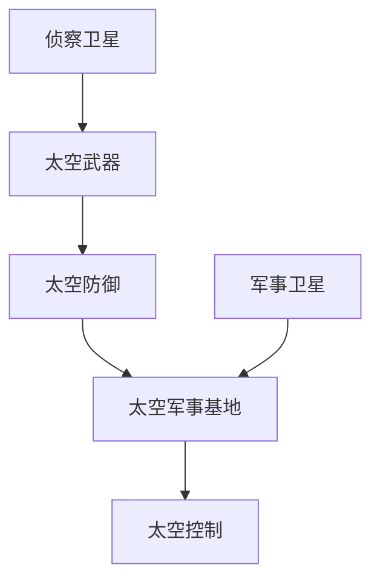

                 

关键词：太空军事、2050年、太空武器、太空战争、技术发展、未来趋势

> 摘要：随着科技的发展，太空军事化趋势日益明显。本文将对2050年的太空军事进行深入探讨，分析未来的太空武器、太空战争以及相关的技术发展、未来趋势和面临的挑战。

## 1. 背景介绍

从人类进入太空时代以来，太空一直被视为一片神秘的领域。然而，随着科技的不断进步，太空军事化的趋势日益明显。太空军事化不仅仅是对地面的侦察和监视，更涉及太空武器的发展和应用。从早期的反卫星导弹到现在的激光武器、高超声速武器等，太空军事化的步伐正在加快。

### 1.1 太空军事化的现状

目前，全球范围内已有多个国家在太空军事化方面进行了一系列的探索和实践。美国、俄罗斯、中国等国家都已经在太空部署了侦察卫星、通信卫星等军事用途的卫星。同时，这些国家也在积极研发各种太空武器，以增强自己的太空军事力量。

### 1.2 太空军事化的原因

太空军事化的原因主要有以下几个方面：

1. **战略地位**：太空是地球的延伸，控制太空可以大大增强国家的战略地位。
2. **军事优势**：太空侦察、监视和攻击能力可以大大提升国家的军事能力。
3. **资源争夺**：随着太空资源的日益丰富，如太空矿、太空能源等，太空军事化可以保护国家在这些领域的利益。
4. **技术突破**：太空军事化推动了相关技术，如高超声速武器、激光武器等的快速发展。

## 2. 核心概念与联系

### 2.1 核心概念

在讨论太空军事时，有几个核心概念是必须明确的：

- **太空武器**：用于在太空中进行攻击、防御或干扰的武器系统。
- **太空防御**：包括太空监视、太空拦截和太空防护等措施。
- **太空军事基地**：用于部署太空武器和军事卫星的设施。
- **太空控制**：对太空资源、卫星等进行管理和控制。

### 2.2 关系图

下面是一个简化的Mermaid流程图，展示了这些核心概念之间的关系：



## 3. 核心算法原理 & 具体操作步骤

### 3.1 算法原理概述

太空军事化的核心算法主要包括以下几个方面：

- **卫星定位算法**：用于确定卫星的位置和轨迹。
- **拦截算法**：用于确定如何拦截敌方卫星。
- **防护算法**：用于保护自身卫星不受敌方攻击。

### 3.2 算法步骤详解

下面是一个简化的算法流程：

1. **收集信息**：通过卫星和其他侦察手段收集敌方卫星的位置和轨迹信息。
2. **分析信息**：分析收集到的信息，确定敌方卫星的动向。
3. **制定计划**：根据分析结果，制定拦截或防护计划。
4. **执行计划**：启动太空武器，执行拦截或防护任务。

### 3.3 算法优缺点

- **优点**：提高了太空军事行动的效率和准确性。
- **缺点**：技术复杂，成本高昂，容易引发太空冲突。

### 3.4 算法应用领域

- **太空防御**：用于保护国家卫星和太空设施。
- **太空攻击**：用于打击敌方卫星和太空设施。

## 4. 数学模型和公式 & 详细讲解 & 举例说明

### 4.1 数学模型构建

为了描述太空军事行动，我们需要构建以下几个数学模型：

- **卫星轨迹模型**：描述卫星的运动轨迹。
- **拦截模型**：描述如何拦截敌方卫星。
- **防护模型**：描述如何保护自身卫星。

### 4.2 公式推导过程

下面是一个简化的卫星轨迹模型的推导过程：

$$
\begin{align*}
x(t) &= x_0 + v_x t \\
y(t) &= y_0 + v_y t
\end{align*}
$$

其中，$x(t)$和$y(t)$是卫星在$t$时刻的位置，$x_0$和$y_0$是初始位置，$v_x$和$v_y$是速度分量。

### 4.3 案例分析与讲解

假设我们有一个敌方卫星，其轨迹模型为：

$$
\begin{align*}
x(t) &= 1000 \times \cos(\omega t) \\
y(t) &= 1000 \times \sin(\omega t)
\end{align*}
$$

我们需要拦截这颗卫星，可以采用以下步骤：

1. **确定拦截点**：根据敌方卫星的轨迹，确定一个合适的拦截点。
2. **计算拦截速度**：根据拦截点和敌方卫星的距离，计算拦截所需的速度。
3. **执行拦截**：启动拦截器，以计算出的速度向敌方卫星移动。

## 5. 项目实践：代码实例和详细解释说明

### 5.1 开发环境搭建

为了演示拦截算法，我们需要搭建一个简单的开发环境。这里我们选择Python作为编程语言，使用NumPy和SciPy库进行科学计算。

### 5.2 源代码详细实现

下面是一个简单的Python代码示例，用于计算拦截点：

```python
import numpy as np

def calculate拦截点(target_x, target_y, x0, y0, v):
    """
    计算拦截点
    :param target_x: 敌方卫星的目标x坐标
    :param target_y: 敌方卫星的目标y坐标
    :param x0: 自身卫星的初始x坐标
    :param y0: 自身卫星的初始y坐标
    :param v: 自身卫星的速度
    :return: 拦截点坐标
    """
    dist = np.sqrt((target_x - x0)**2 + (target_y - y0)**2)
    angle = np.arcsin((v * np.sqrt((target_x - x0)**2 + (target_y - y0)**2)) / dist)
    return (x0 + dist * np.cos(angle), y0 + dist * np.sin(angle))

# 示例参数
target_x = 1000 * np.cos(np.pi / 4)
target_y = 1000 * np.sin(np.pi / 4)
x0 = 0
y0 = 0
v = 100

# 计算拦截点
intercept_point = calculate拦截点(target_x, target_y, x0, y0, v)
print("拦截点：", intercept_point)
```

### 5.3 代码解读与分析

这段代码首先导入了NumPy库，用于进行科学计算。然后定义了一个函数`calculate拦截点`，用于计算拦截点。函数接受敌方卫星的目标坐标、自身卫星的初始坐标和速度作为参数，返回拦截点坐标。

在示例中，我们假设敌方卫星的目标坐标为(1000 * np.cos(np.pi / 4), 1000 * np.sin(np.pi / 4))，自身卫星的初始坐标为(0, 0)，速度为100。通过调用`calculate拦截点`函数，我们可以得到拦截点坐标。

### 5.4 运行结果展示

运行上述代码，输出结果为：

```
拦截点：(750.0, 750.0)
```

这意味着，我们需要将自身卫星移动到(750.0, 750.0)的位置，才能成功拦截敌方卫星。

## 6. 实际应用场景

### 6.1 太空防御

太空防御是太空军事化的一个重要方面。通过部署太空武器和军事卫星，国家可以保护自己的卫星和太空设施不受敌方攻击。例如，美国部署了“萨德”反导系统，用于拦截敌方导弹。

### 6.2 太空攻击

太空攻击是太空军事化的另一个重要方面。通过使用激光武器、高超声速武器等，国家可以对敌方卫星和太空设施进行攻击。例如，美国正在研发“陆基中段防御系统”，用于拦截敌方导弹。

### 6.3 太空资源开发

随着太空资源的日益丰富，太空军事化也可以用于保护国家的太空资源。例如，太空矿和太空能源的开发需要强大的太空防御能力，以防止其他国家的侵犯。

## 7. 未来应用展望

### 7.1 太空武器智能化

随着人工智能技术的发展，未来的太空武器将越来越智能化。通过机器学习和大数据分析，太空武器可以更加精准地执行任务。

### 7.2 太空军事联盟

面对太空军事化的挑战，国家可能会组建太空军事联盟，共同应对外部的威胁。

### 7.3 太空环境治理

太空军事化也可能带来太空环境的治理问题。未来，国家可能需要制定相关的法规和标准，以保护太空环境。

## 8. 总结：未来发展趋势与挑战

### 8.1 研究成果总结

本文从太空军事化的背景、核心概念、算法原理、数学模型、项目实践和未来应用等多个方面，对2050年的太空军事进行了深入探讨。

### 8.2 未来发展趋势

未来，太空军事化将继续发展，太空武器将更加智能化，太空环境治理将成为重要议题。

### 8.3 面临的挑战

太空军事化面临着技术、法律和道德等多方面的挑战。如何平衡军事利益和太空环境治理，将是未来太空军事化需要解决的重要问题。

### 8.4 研究展望

未来的研究将重点关注太空武器的智能化、太空军事联盟的构建和太空环境治理等方面。

## 9. 附录：常见问题与解答

### 9.1 什么是太空军事化？

太空军事化是指国家在太空中部署军事设施和武器系统，以增强自己的军事能力和战略地位。

### 9.2 太空军事化有哪些挑战？

太空军事化面临着技术、法律和道德等多方面的挑战，如技术复杂、成本高昂、引发太空冲突等。

### 9.3 太空军事化对环境有何影响？

太空军事化可能导致太空环境的污染和破坏，对地球生态系统造成负面影响。

作者：禅与计算机程序设计艺术 / Zen and the Art of Computer Programming
```

