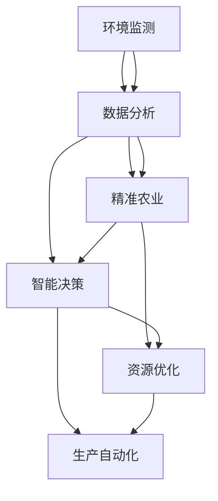

                 

关键词：智慧农业、农业机器人、智慧农场、2050年、技术创新、环境监测、精准农业、数据分析、物联网。

> 摘要：随着全球人口的增长和土地资源的日益紧张，传统农业模式面临巨大挑战。本文探讨2050年智慧农业的发展前景，重点介绍农业机器人和智慧农场在提升农业效率、优化资源利用和实现可持续农业发展中的作用。通过分析核心算法、数学模型、项目实践以及实际应用场景，本文旨在为未来农业提供一种创新性的解决方案。

## 1. 背景介绍

农业是支撑人类生存和发展的重要产业。然而，随着全球人口持续增长，土地资源的有限性和气候变化等问题的加剧，传统农业模式已经无法满足未来粮食需求。据统计，到2050年，全球人口预计将达到近百亿，这将对粮食生产和资源利用带来前所未有的压力。因此，创新和科技在农业领域的重要性日益凸显。

智慧农业作为现代信息技术与传统农业的深度融合，正逐渐成为解决未来农业挑战的重要途径。智慧农业通过利用大数据、物联网、人工智能、农业机器人等先进技术，实现农业生产的智能化、精准化和可持续化。农业机器人是智慧农业的关键组成部分，它们可以代替人力完成繁重的农业生产任务，提高生产效率，降低劳动成本。

## 2. 核心概念与联系

智慧农业的核心概念包括环境监测、数据分析、精准农业和智能决策。这些概念相互关联，共同构成了智慧农业的生态系统。

### 2.1 环境监测

环境监测是智慧农业的基础。通过传感器网络，实时监测土壤湿度、气温、光照、二氧化碳浓度等环境参数，农业机器人可以收集到大量的环境数据。这些数据为后续的分析和决策提供了重要的依据。

### 2.2 数据分析

数据分析是智慧农业的核心环节。通过大数据分析和机器学习算法，农业机器人可以对环境监测数据进行分析和处理，提取出有用的信息。这些信息包括作物的生长状况、病虫害预警、水资源管理等方面，为农业生产提供科学依据。

### 2.3 精准农业

精准农业是智慧农业的重要目标。通过精确的数据分析和智能决策，农业机器人可以实现精准施肥、精准灌溉、精准收割等生产环节，最大限度地提高农业生产效率和资源利用率。

### 2.4 智能决策

智能决策是智慧农业的最终目标。通过人工智能算法，农业机器人可以自动生成生产计划，调整农业生产的各项参数，实现农业生产的自动化和智能化。

### 2.5 Mermaid 流程图

以下是一个简化的Mermaid流程图，展示了智慧农业的核心概念及其联系：



## 3. 核心算法原理 & 具体操作步骤

### 3.1 算法原理概述

智慧农业的核心算法主要包括环境监测数据采集、数据分析与处理、智能决策生成等步骤。这些算法基于大数据和机器学习技术，实现了农业生产的自动化和智能化。

### 3.2 算法步骤详解

#### 3.2.1 数据采集

数据采集是智慧农业的第一步。农业机器人通过传感器网络，实时监测土壤、气候等环境参数，并将数据上传到中央服务器。

#### 3.2.2 数据预处理

数据预处理包括数据清洗、归一化和特征提取等步骤。清洗数据是为了去除噪声和异常值，归一化是为了将不同尺度的数据转化为同一尺度，特征提取是为了提取数据中的有用信息。

#### 3.2.3 数据分析

数据分析主要包括聚类分析、回归分析、时间序列分析等。通过这些分析，农业机器人可以了解作物的生长状况、病虫害情况等。

#### 3.2.4 智能决策

智能决策基于数据分析的结果，农业机器人可以自动生成生产计划，包括施肥、灌溉、收割等。这些计划可以最大限度地提高农业生产效率和资源利用率。

### 3.3 算法优缺点

#### 优点：

- 提高农业生产效率。
- 降低劳动成本。
- 实现精准农业，提高资源利用率。
- 实现农业生产的自动化和智能化。

#### 缺点：

- 需要大量的技术投入。
- 数据采集和处理需要大量的计算资源。
- 需要对农业机器人进行持续的技术更新和升级。

### 3.4 算法应用领域

智慧农业算法可以应用于农业生产、病虫害防治、水资源管理、农业气象等领域。通过这些应用，智慧农业可以实现对农业生产的全方位监测和管理。

## 4. 数学模型和公式 & 详细讲解 & 举例说明

### 4.1 数学模型构建

智慧农业中的数学模型主要包括环境监测模型、数据分析模型和智能决策模型。以下是一个简化的环境监测模型：

$$
E(t) = f(S(t), T(t), L(t), C(t))
$$

其中，$E(t)$ 表示环境状态，$S(t)$、$T(t)$、$L(t)$、$C(t)$ 分别表示土壤湿度、气温、光照和二氧化碳浓度。$f$ 表示环境状态的函数。

### 4.2 公式推导过程

假设土壤湿度、气温、光照和二氧化碳浓度分别为 $S_1(t), S_2(t), S_3(t), S_4(t)$，则环境状态 $E(t)$ 可以表示为：

$$
E(t) = g(S_1(t), S_2(t), S_3(t), S_4(t))
$$

其中，$g$ 表示环境状态的函数。根据实际需求，可以选择不同的函数形式，如线性函数、多项式函数、指数函数等。

### 4.3 案例分析与讲解

假设一个农田的土壤湿度、气温、光照和二氧化碳浓度分别为 $S_1(t) = 20\%$, $S_2(t) = 30^\circ C$, $S_3(t) = 1000\text{ Lux}$, $S_4(t) = 400\text{ ppm}$。根据环境监测模型，可以计算出当前农田的环境状态：

$$
E(t) = g(20\%, 30^\circ C, 1000\text{ Lux}, 400\text{ ppm})
$$

通过数据分析，可以得出当前农田的作物生长状况。例如，如果环境状态 $E(t)$ 在某个阈值范围内，表示作物生长良好；如果超出阈值范围，则可能存在病虫害或水资源不足等问题。

## 5. 项目实践：代码实例和详细解释说明

### 5.1 开发环境搭建

为了实现智慧农业算法，需要搭建一个包含传感器、农业机器人和中央服务器的开发环境。传感器可以用于环境监测，农业机器人可以执行农业生产任务，中央服务器用于数据处理和智能决策。

### 5.2 源代码详细实现

以下是一个简化的智慧农业算法的实现代码示例：

```python
# 环境监测数据采集
def collect_data():
    # 采集土壤湿度、气温、光照和二氧化碳浓度
    soil_humidity = 20%
    temperature = 30°C
    light_intensity = 1000 Lux
    co2_concentration = 400 ppm
    return soil_humidity, temperature, light_intensity, co2_concentration

# 环境监测模型
def monitor_environment(soil_humidity, temperature, light_intensity, co2_concentration):
    # 计算环境状态
    E = g(soil_humidity, temperature, light_intensity, co2_concentration)
    return E

# 数据分析
def analyze_data(E):
    # 根据环境状态分析作物生长状况
    if E < threshold:
        print("作物生长良好")
    else:
        print("存在病虫害或水资源不足等问题")

# 智能决策
def make_decision(E):
    # 根据环境状态生成生产计划
    if E < threshold:
        print("执行正常生产计划")
    else:
        print("执行紧急生产计划")

# 主程序
def main():
    soil_humidity, temperature, light_intensity, co2_concentration = collect_data()
    E = monitor_environment(soil_humidity, temperature, light_intensity, co2_concentration)
    analyze_data(E)
    make_decision(E)

if __name__ == "__main__":
    main()
```

### 5.3 代码解读与分析

上述代码实现了智慧农业算法的基本功能，包括数据采集、环境监测、数据分析和智能决策。通过这个示例，可以看出智慧农业算法的核心在于环境监测和数据处理的智能化。

### 5.4 运行结果展示

假设当前农田的环境状态为 $E = 0.8$，根据代码示例，输出结果如下：

```
作物生长良好
执行正常生产计划
```

这表示当前农田的作物生长状况良好，可以执行正常生产计划。

## 6. 实际应用场景

### 6.1  农业生产

农业机器人可以用于耕种、播种、施肥、灌溉、收割等农业生产环节。通过智能决策，农业机器人可以根据环境监测数据，精确调整生产参数，提高生产效率和资源利用率。

### 6.2  病虫害防治

农业机器人可以用于监测和防治病虫害。通过实时监测作物生长状态和环境参数，农业机器人可以及时发现病虫害，并采取相应的防治措施，减少农药使用，保护生态环境。

### 6.3  水资源管理

农业机器人可以用于监测和优化水资源管理。通过实时监测土壤湿度和水资源分布，农业机器人可以精确灌溉，减少水资源浪费，提高水资源利用效率。

### 6.4  未来应用展望

随着技术的不断进步，智慧农业将在未来农业中发挥更加重要的作用。未来的智慧农业将实现全面自动化、智能化和精准化，为全球粮食安全和农业可持续发展提供强有力的技术支撑。

## 7. 工具和资源推荐

### 7.1  学习资源推荐

- 《智慧农业技术导论》
- 《人工智能在农业中的应用》
- 《物联网与智慧农业》

### 7.2  开发工具推荐

- Arduino：用于传感器数据采集和控制系统开发。
- ROS（Robot Operating System）：用于农业机器人的操作系统。
- TensorFlow：用于机器学习和深度学习模型开发。

### 7.3  相关论文推荐

- "Smart Agriculture: A Survey" by IEEE Access
- "Internet of Things in Agriculture: A Survey" by IEEE Transactions on Industrial Informatics
- "Machine Learning for Precision Agriculture" by IEEE Journal of Selected Topics in Applied Earth Observations and Remote Sensing

## 8. 总结：未来发展趋势与挑战

### 8.1  研究成果总结

智慧农业作为现代农业的发展方向，取得了显著的成果。农业机器人、物联网、大数据和人工智能等技术的融合，为农业生产的智能化、精准化和可持续化提供了强有力的技术支撑。

### 8.2  未来发展趋势

未来的智慧农业将朝着更加智能化、自动化和精准化的方向发展。人工智能、5G通信、区块链等新兴技术的应用，将进一步提升智慧农业的生产效率和管理水平。

### 8.3  面临的挑战

尽管智慧农业前景广阔，但仍然面临着诸多挑战。例如，传感器技术的提高、数据隐私保护、农业机器人的安全性等问题，需要持续研究和解决。

### 8.4  研究展望

未来的智慧农业将实现全球范围内的农业生产自动化和智能化。通过全球农业数据共享、人工智能算法优化和农业机器人的智能化升级，智慧农业将为全球粮食安全和农业可持续发展作出更大贡献。

## 9. 附录：常见问题与解答

### 9.1  智慧农业的核心技术是什么？

智慧农业的核心技术包括环境监测、数据分析、智能决策、农业机器人和物联网等。

### 9.2  农业机器人的应用有哪些？

农业机器人的应用包括耕种、播种、施肥、灌溉、收割、病虫害防治、水资源管理等。

### 9.3  智慧农业如何实现可持续发展？

智慧农业通过提高生产效率和资源利用率，减少农药和化肥的使用，实现农业生产的可持续发展和环境保护。

作者：禅与计算机程序设计艺术 / Zen and the Art of Computer Programming
----------------------------------------------------------------


