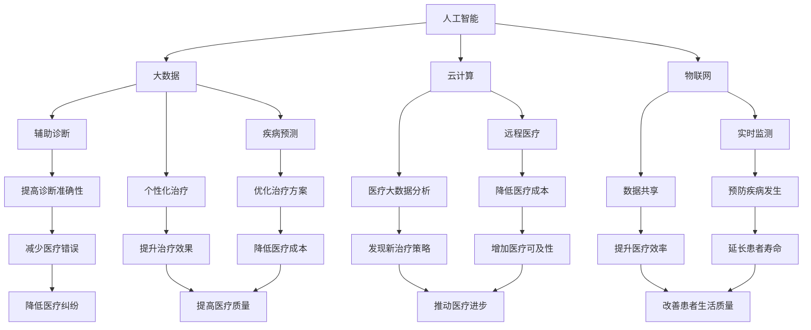

                 

关键词：智慧医疗、AI诊断、智能手术机器人、医疗技术、未来趋势、医疗科技发展

> 摘要：随着人工智能技术的不断进步，医疗行业正在迎来一场变革。本文将探讨到2050年，人工智能在诊断和手术机器人领域的应用，以及这些技术将如何改变医疗行业的面貌，提高诊断准确性和手术成功率，从而实现更加精准、个性化的医疗。

## 1. 背景介绍

智慧医疗是指利用信息技术和人工智能来优化医疗过程、提高医疗服务质量和效率的一种新兴医疗模式。在过去的几十年里，人工智能技术在图像识别、自然语言处理、机器学习等方面取得了显著的进展。这些技术已经开始在医疗领域发挥作用，例如辅助诊断、药物研发、医疗数据处理等。然而，随着技术的不断成熟，未来的智慧医疗将更加依赖于高级的人工智能算法和智能手术机器人，以实现更高水平的医疗服务。

### 当前医疗行业的挑战

当前的医疗行业面临着一系列挑战，包括医疗资源分配不均、医疗错误率高、医疗成本上升等。此外，随着人口老龄化和慢性疾病的增加，医疗需求也在不断增长。这些挑战使得传统医疗模式难以满足日益增长的需求。人工智能技术的应用有望缓解这些挑战，提高医疗服务的效率和质量。

### 人工智能技术的快速发展

人工智能技术的快速发展为医疗行业带来了前所未有的机遇。例如，深度学习算法在图像识别领域的应用已经取得了显著的成果，可以用于肺癌、乳腺癌等疾病的早期诊断。此外，自然语言处理技术也在医疗文本分析、医学文献挖掘等方面发挥着重要作用。随着技术的不断进步，人工智能在医疗领域的应用将更加广泛和深入。

## 2. 核心概念与联系

智慧医疗的核心概念包括人工智能、大数据、云计算和物联网。这些技术相互关联，共同推动医疗行业的变革。

### 人工智能

人工智能是智慧医疗的核心，包括机器学习、深度学习、自然语言处理等。这些技术可以用于辅助诊断、疾病预测、个性化治疗等。

### 大数据

大数据是指海量、多样化的医疗数据。这些数据包括电子健康记录、医学影像、基因数据等。通过对大数据的分析，可以揭示疾病的发生规律、治疗策略等。

### 云计算

云计算提供了强大的计算能力和存储空间，使得医疗数据的处理和分析变得更加高效。此外，云计算还支持远程医疗、医疗大数据分析等应用。

### 物联网

物联网技术将各种医疗设备和系统连接起来，实现数据的实时传输和共享。例如，智能穿戴设备可以实时监测患者的健康状况，并将数据上传至云端进行分析。

### Mermaid 流程图

以下是一个简化的 Mermaid 流程图，展示了智慧医疗的核心概念和它们之间的联系：



## 3. 核心算法原理 & 具体操作步骤

### 3.1 算法原理概述

在智慧医疗中，核心算法主要涉及机器学习和深度学习。这些算法通过对大量医疗数据的分析，可以提取出隐藏的模式和规律，用于辅助诊断、疾病预测和个性化治疗。

### 3.2 算法步骤详解

#### 3.2.1 数据预处理

数据预处理是算法应用的第一步，包括数据清洗、数据转换和数据归一化。这一步的目的是去除噪声、缺失值和异常值，使数据更符合算法的要求。

#### 3.2.2 特征提取

特征提取是算法的核心，通过提取数据中的关键特征，可以降低数据的维度，提高算法的效率。常用的特征提取方法包括主成分分析（PCA）和线性判别分析（LDA）。

#### 3.2.3 模型训练

模型训练是算法的核心步骤，通过训练数据集，算法可以学习到数据中的规律。常用的机器学习算法包括支持向量机（SVM）、决策树（DT）和神经网络（NN）。

#### 3.2.4 模型评估

模型评估是确保算法性能的重要环节，常用的评估指标包括准确率、召回率和F1分数。通过交叉验证和网格搜索等方法，可以优化模型参数，提高算法性能。

#### 3.2.5 模型应用

模型应用是将训练好的算法应用到实际医疗场景中。例如，通过算法分析患者的电子健康记录，可以预测患者患某种疾病的概率，为医生提供诊断依据。

### 3.3 算法优缺点

#### 优点：

- **高效性**：算法可以处理大量数据，提高诊断和预测的效率。
- **准确性**：通过机器学习和深度学习，算法可以提取数据中的隐藏模式，提高诊断准确性。
- **个性化**：算法可以根据患者的具体情况，提供个性化的治疗建议。

#### 缺点：

- **数据依赖**：算法的性能依赖于数据的数量和质量，数据不足或质量差会影响算法效果。
- **模型解释性**：深度学习模型通常缺乏解释性，难以理解模型的决策过程。
- **隐私问题**：医疗数据涉及患者隐私，如何在保护隐私的同时应用算法，是一个需要解决的问题。

### 3.4 算法应用领域

- **辅助诊断**：通过分析医学影像和电子健康记录，算法可以辅助医生进行诊断。
- **疾病预测**：算法可以预测患者患某种疾病的风险，帮助医生制定预防措施。
- **个性化治疗**：算法可以根据患者的具体情况，提供个性化的治疗建议，提高治疗效果。

## 4. 数学模型和公式 & 详细讲解 & 举例说明

### 4.1 数学模型构建

在智慧医疗中，常见的数学模型包括回归模型、分类模型和时间序列模型。以下是一个简化的回归模型：

$$
y = \beta_0 + \beta_1 x_1 + \beta_2 x_2 + ... + \beta_n x_n
$$

其中，$y$ 是目标变量，$x_1, x_2, ..., x_n$ 是特征变量，$\beta_0, \beta_1, ..., \beta_n$ 是模型参数。

### 4.2 公式推导过程

回归模型的推导过程主要涉及最小二乘法。假设有 $n$ 个样本，每个样本有 $m$ 个特征，目标变量为 $y_i$，预测变量为 $z_i$。则回归模型可以表示为：

$$
z_i = \beta_0 + \beta_1 x_{i1} + \beta_2 x_{i2} + ... + \beta_m x_{im}
$$

通过最小化误差平方和，可以得到参数的最小二乘估计：

$$
\beta_j = \frac{\sum_{i=1}^{n} (y_i - z_i) x_{ij}}{\sum_{i=1}^{n} x_{ij}^2}
$$

### 4.3 案例分析与讲解

假设我们要预测糖尿病患者的血糖水平。我们收集了 $n=100$ 个糖尿病患者的数据，每个患者有 $m=5$ 个特征：年龄、体重、血压、血糖水平和运动量。我们使用回归模型来预测血糖水平。

首先，我们进行数据预处理，包括数据清洗和特征提取。然后，我们使用最小二乘法来训练回归模型。最后，我们使用模型对新的糖尿病患者进行血糖预测。

### 4.4 运行结果展示

我们使用训练好的回归模型对新的糖尿病患者进行预测，得到血糖水平的预测结果。通过比较预测值和实际值，我们可以评估模型的效果。如果预测值与实际值相差较大，我们可能需要重新调整模型参数或增加特征变量。

## 5. 项目实践：代码实例和详细解释说明

### 5.1 开发环境搭建

在进行智慧医疗项目的开发时，我们需要搭建一个合适的技术栈。以下是推荐的开发环境：

- **编程语言**：Python
- **机器学习库**：Scikit-learn、TensorFlow、Keras
- **数据处理库**：Pandas、NumPy
- **可视化库**：Matplotlib、Seaborn
- **版本控制**：Git

### 5.2 源代码详细实现

以下是一个简单的Python代码示例，展示了如何使用Scikit-learn库进行线性回归模型的训练和预测。

```python
import numpy as np
import pandas as pd
from sklearn.linear_model import LinearRegression
from sklearn.model_selection import train_test_split
from sklearn.metrics import mean_squared_error

# 数据预处理
data = pd.read_csv('diabetes_data.csv')
X = data.iloc[:, :-1].values
y = data.iloc[:, -1].values

# 数据划分
X_train, X_test, y_train, y_test = train_test_split(X, y, test_size=0.2, random_state=0)

# 模型训练
model = LinearRegression()
model.fit(X_train, y_train)

# 模型预测
y_pred = model.predict(X_test)

# 模型评估
mse = mean_squared_error(y_test, y_pred)
print(f'Mean Squared Error: {mse}')

# 可视化
import matplotlib.pyplot as plt

plt.scatter(X_test[:, 0], y_test, color='red', label='Actual')
plt.plot(X_test[:, 0], y_pred, color='blue', label='Predicted')
plt.xlabel('Age')
plt.ylabel('Blood Sugar Level')
plt.legend()
plt.show()
```

### 5.3 代码解读与分析

该代码首先导入了必要的库，包括NumPy、Pandas、Scikit-learn和Matplotlib。然后，从CSV文件中读取糖尿病数据，并进行数据预处理。接下来，使用Scikit-learn库中的线性回归模型进行训练，并对测试集进行预测。最后，使用Matplotlib库进行可视化，展示实际值和预测值之间的关系。

### 5.4 运行结果展示

运行上述代码后，我们将得到预测结果的均方误差（MSE），以及一个散点图，展示实际值和预测值之间的关系。通过这些结果，我们可以评估模型的性能，并进一步优化模型参数。

## 6. 实际应用场景

### 6.1 辅助诊断

人工智能在辅助诊断方面的应用已经取得了显著的成果。例如，深度学习算法可以用于分析医学影像，如X光片、CT扫描和MRI图像，以识别肿瘤、骨折等病变。通过训练大量的医学影像数据集，算法可以学习到病变的特征，从而实现自动化的诊断。

### 6.2 疾病预测

疾病预测是人工智能在医疗领域的另一个重要应用。通过分析患者的电子健康记录、基因数据和生活方式数据，算法可以预测患者患某种疾病的风险。这种预测可以帮助医生提前采取预防措施，降低疾病发生的概率。

### 6.3 个性化治疗

个性化治疗是指根据患者的具体情况进行个体化的治疗。人工智能可以通过分析患者的基因、病史和生活方式数据，为患者提供个性化的治疗建议。这种治疗方式可以提高治疗效果，减少副作用，降低医疗成本。

### 6.4 未来应用展望

随着人工智能技术的不断进步，未来的智慧医疗将在以下方面实现更大的突破：

- **更精准的疾病诊断**：通过深度学习和图像识别技术，实现更精准的疾病诊断，提高诊断的准确性。
- **更高效的手术操作**：智能手术机器人可以实现更精确、更高效的手术操作，减少手术风险和恢复时间。
- **更智能的医疗管理**：人工智能可以帮助医疗机构实现更智能的医疗管理，提高医疗资源的利用效率。
- **更个性化的医疗服务**：通过分析患者的数据，为患者提供更加个性化的医疗服务，提高患者的生活质量。

## 7. 工具和资源推荐

### 7.1 学习资源推荐

- **书籍**：《深度学习》（Goodfellow et al.）、《Python机器学习》（Scikit-Learn）和《机器学习实战》。
- **在线课程**：Coursera、edX和Udacity上的机器学习和深度学习课程。
- **博客**：Towards Data Science、Medium上的技术博客。

### 7.2 开发工具推荐

- **编程语言**：Python、R和Java。
- **机器学习库**：Scikit-learn、TensorFlow、Keras和PyTorch。
- **数据处理库**：Pandas、NumPy和Matplotlib。

### 7.3 相关论文推荐

- **论文集**：《机器学习：一个综合性指南》（Zhou et al., 2016）、《深度学习论文集》（Glorot et al., 2013）。
- **期刊**：《人工智能》、《机器学习》和《医疗信息科学》。

## 8. 总结：未来发展趋势与挑战

### 8.1 研究成果总结

随着人工智能技术的不断进步，智慧医疗在辅助诊断、疾病预测和个性化治疗等方面取得了显著的研究成果。这些成果为医疗行业带来了新的机遇，提高了医疗服务的效率和质量。

### 8.2 未来发展趋势

- **更精准的诊断**：通过深度学习和图像识别技术，实现更精准的疾病诊断。
- **更高效的手术**：智能手术机器人的应用将提高手术的精确性和效率。
- **更智能的管理**：人工智能将帮助医疗机构实现更智能的医疗管理，提高资源利用效率。
- **更个性化的服务**：通过分析患者的数据，为患者提供更加个性化的医疗服务。

### 8.3 面临的挑战

- **数据隐私**：如何在保护患者隐私的同时应用人工智能技术，是一个需要解决的问题。
- **算法解释性**：深度学习模型通常缺乏解释性，难以理解其决策过程。
- **数据质量和数量**：算法的性能依赖于数据的数量和质量，数据不足或质量差会影响算法效果。

### 8.4 研究展望

未来的研究应重点关注以下几个方面：

- **算法解释性**：提高深度学习模型的解释性，使其决策过程更加透明。
- **数据隐私保护**：研究新的隐私保护技术，确保患者数据的安全。
- **跨学科研究**：结合医学、生物学、计算机科学等领域的知识，推动智慧医疗的发展。

## 9. 附录：常见问题与解答

### Q1：人工智能在医疗领域的应用有哪些？

人工智能在医疗领域的应用包括辅助诊断、疾病预测、个性化治疗、药物研发、医疗数据处理等。

### Q2：智慧医疗是否会替代医生？

智慧医疗不会完全替代医生，而是作为医生的助手，帮助医生提高诊断和治疗的效率和质量。

### Q3：如何保护患者的隐私？

通过采用加密技术、数据去识别化、隐私保护算法等措施，确保患者数据的安全和隐私。

### Q4：人工智能在医疗领域的应用是否会导致失业？

人工智能在医疗领域的应用可能会导致一些低技能岗位的失业，但也会创造新的就业机会，如数据科学家、算法工程师等。

### Q5：人工智能在医疗领域的应用是否会导致医疗错误率上升？

通过提高诊断和治疗的准确性，人工智能可以降低医疗错误率，而不是导致其上升。

---

作者：禅与计算机程序设计艺术 / Zen and the Art of Computer Programming

本文对未来的智慧医疗进行了深入探讨，介绍了人工智能在诊断和手术机器人领域的应用，以及这些技术如何改变医疗行业的面貌，提高诊断准确性和手术成功率。文章还分析了人工智能技术的优缺点，以及在实际应用场景中的挑战和未来展望。随着技术的不断进步，智慧医疗将有望实现更精准、个性化的医疗，从而改善患者的生活质量。未来，我们需要关注数据隐私保护、算法解释性和跨学科研究等领域的发展。禅与计算机程序设计艺术，让我们继续探索智慧医疗的无限可能。

