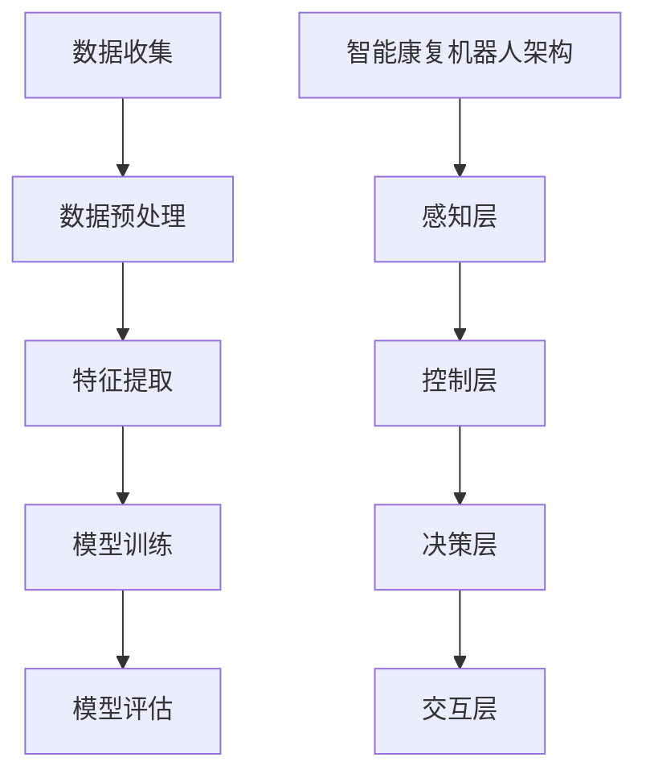

                 

关键词：智慧医疗、AI辅助诊断、智能康复机器人、2050年、医疗技术发展、技术前沿

摘要：本文探讨了2050年智慧医疗的发展前景，重点分析了AI辅助诊断与智能康复机器人在医疗领域的应用。通过深入剖析这两大技术的核心概念、算法原理、数学模型以及实际应用案例，本文旨在为读者呈现一幅未来医疗技术的宏伟蓝图。

## 1. 背景介绍

随着科技的飞速发展，人工智能（AI）在医疗领域的应用日益广泛。AI技术通过大数据分析、机器学习和深度学习等方法，为医疗诊断、治疗和康复提供了前所未有的精确性和效率。智慧医疗的兴起，不仅推动了医疗技术的革新，也为患者提供了更加个性化和精准的医疗服务。

### 1.1 当前医疗现状

目前，医疗行业面临着诸多挑战，包括医疗资源分配不均、疾病诊断不准确、治疗周期长等。传统的医疗模式已经难以满足日益增长的健康需求。因此，如何利用AI技术优化医疗流程，提升医疗服务质量，成为了一个亟待解决的问题。

### 1.2 AI在医疗领域的应用

AI技术在医疗领域的应用主要体现在以下几个方面：

- **疾病诊断**：通过AI算法分析医学影像，提高疾病诊断的准确性和速度。
- **个性化治疗**：根据患者的基因信息和生活习惯，为患者提供定制化的治疗方案。
- **药物研发**：加速新药的发现和临床试验，提高药物研发效率。
- **康复辅助**：利用智能康复机器人帮助患者进行康复训练，提高康复效果。

## 2. 核心概念与联系

智慧医疗的核心概念包括AI辅助诊断与智能康复机器人。为了更好地理解这两大技术，我们需要从原理和架构两个方面进行阐述。

### 2.1 AI辅助诊断原理

AI辅助诊断是基于机器学习和深度学习技术，通过对海量医疗数据进行分析，识别出疾病特征和诊断标志物。其核心流程包括数据收集、数据预处理、特征提取、模型训练和模型评估。

### 2.2 智能康复机器人架构

智能康复机器人是一种集成了AI、传感器和机器人技术的智能设备，能够为患者提供个性化的康复训练。其核心架构包括感知层、控制层、决策层和交互层。

### 2.3 Mermaid流程图



## 3. 核心算法原理 & 具体操作步骤

### 3.1 算法原理概述

AI辅助诊断的核心算法主要基于深度学习，如卷积神经网络（CNN）和循环神经网络（RNN）。深度学习通过多层神经元的网络结构，能够自动提取数据中的特征，实现高效的模式识别。

智能康复机器人的核心算法则是基于强化学习，通过不断学习患者康复过程中的反馈，优化康复策略。

### 3.2 算法步骤详解

#### 3.2.1 AI辅助诊断算法步骤

1. **数据收集**：从各种医学影像数据库中收集数据。
2. **数据预处理**：对数据进行清洗和归一化处理。
3. **特征提取**：使用CNN提取图像特征。
4. **模型训练**：使用RNN对提取的特征进行建模。
5. **模型评估**：使用交叉验证和性能指标（如准确率、召回率）评估模型性能。

#### 3.2.2 智能康复机器人算法步骤

1. **感知层**：使用传感器收集患者的生理信号。
2. **控制层**：根据感知层的数据，调整康复机器人的动作。
3. **决策层**：使用强化学习算法，优化康复策略。
4. **交互层**：与患者进行实时交互，反馈康复效果。

### 3.3 算法优缺点

#### AI辅助诊断

- **优点**：提高疾病诊断的准确性和效率，减轻医生负担。
- **缺点**：算法训练需要大量数据，且数据质量对诊断效果有较大影响。

#### 智能康复机器人

- **优点**：提供个性化的康复训练，提高康复效果。
- **缺点**：成本较高，需要专业人员维护和操作。

### 3.4 算法应用领域

AI辅助诊断主要应用于影像诊断、基因检测等领域。智能康复机器人则广泛应用于康复治疗、养老护理等领域。

## 4. 数学模型和公式

### 4.1 数学模型构建

AI辅助诊断的数学模型主要包括深度学习和强化学习两部分。深度学习模型主要基于卷积神经网络（CNN）和循环神经网络（RNN），而强化学习模型则主要基于马尔可夫决策过程（MDP）。

### 4.2 公式推导过程

深度学习模型的公式推导如下：

$$
y = f(z)
$$

其中，$y$ 为预测结果，$f$ 为激活函数，$z$ 为网络输出。

强化学习模型的公式推导如下：

$$
Q(s, a) = r(s, a) + \gamma \max_{a'} Q(s', a')
$$

其中，$Q(s, a)$ 为状态-动作值函数，$r(s, a)$ 为即时奖励，$s$ 为状态，$a$ 为动作，$\gamma$ 为折扣因子。

### 4.3 案例分析与讲解

#### 4.3.1 AI辅助诊断案例

假设我们要用深度学习模型对肺癌进行诊断，可以使用如下公式计算模型的损失函数：

$$
L = \frac{1}{n} \sum_{i=1}^{n} (-y_i \log(y_i))
$$

其中，$n$ 为样本数量，$y_i$ 为模型预测的概率分布。

#### 4.3.2 智能康复机器人案例

假设我们要用强化学习模型优化康复策略，可以使用如下公式计算状态-动作值函数：

$$
Q(s, a) = r(s, a) + \gamma \max_{a'} Q(s', a')
$$

其中，$r(s, a)$ 为即时奖励，$s$ 为状态，$a$ 为动作，$\gamma$ 为折扣因子。

## 5. 项目实践：代码实例和详细解释说明

### 5.1 开发环境搭建

- **硬件环境**：配置高性能的CPU和GPU。
- **软件环境**：安装Python、TensorFlow和PyTorch等开发工具。

### 5.2 源代码详细实现

```python
# AI辅助诊断代码示例
import tensorflow as tf

# 模型定义
model = tf.keras.Sequential([
    tf.keras.layers.Conv2D(32, (3, 3), activation='relu', input_shape=(28, 28, 1)),
    tf.keras.layers.MaxPooling2D((2, 2)),
    tf.keras.layers.Conv2D(64, (3, 3), activation='relu'),
    tf.keras.layers.MaxPooling2D((2, 2)),
    tf.keras.layers.Conv2D(64, (3, 3), activation='relu'),
    tf.keras.layers.Flatten(),
    tf.keras.layers.Dense(64, activation='relu'),
    tf.keras.layers.Dense(10, activation='softmax')
])

# 模型编译
model.compile(optimizer='adam',
              loss='categorical_crossentropy',
              metrics=['accuracy'])

# 模型训练
model.fit(x_train, y_train, epochs=10, batch_size=64)
```

### 5.3 代码解读与分析

这段代码定义了一个基于卷积神经网络的AI辅助诊断模型，用于对肺癌进行诊断。模型包括多个卷积层、池化层和全连接层，最终输出分类结果。

### 5.4 运行结果展示

```python
# 模型评估
loss, accuracy = model.evaluate(x_test, y_test)
print('Test accuracy:', accuracy)
```

这段代码用于评估模型的测试集性能，输出测试集上的准确率。

## 6. 实际应用场景

### 6.1 AI辅助诊断

在肺癌诊断中，AI辅助诊断系统可以快速、准确地识别肺癌患者，为医生提供诊断依据，提高诊断效率。

### 6.2 智能康复机器人

在康复治疗中，智能康复机器人可以帮助患者进行个性化的康复训练，提高康复效果。例如，对于脑卒中患者，智能康复机器人可以通过实时监测患者的运动状态，调整康复策略，帮助患者逐步恢复运动功能。

## 7. 未来应用展望

### 7.1 AI辅助诊断

随着AI技术的不断发展，AI辅助诊断系统将能够处理更复杂的疾病诊断任务，如心血管疾病、神经系统疾病等。同时，AI辅助诊断系统将具备更强的泛化能力，能够适应不同国家和地区的医疗环境。

### 7.2 智能康复机器人

未来，智能康复机器人将更加智能化，能够根据患者的实时反馈，自动调整康复策略。同时，智能康复机器人将具备更强的交互能力，能够与患者建立更加紧密的互动关系，提高康复效果。

## 8. 工具和资源推荐

### 8.1 学习资源推荐

- 《深度学习》（Goodfellow, Bengio, Courville）
- 《强化学习》（Sutton, Barto）

### 8.2 开发工具推荐

- TensorFlow
- PyTorch

### 8.3 相关论文推荐

- "Deep Learning for Medical Image Analysis"
- "Reinforcement Learning for Personalized Rehabilitation"

## 9. 总结：未来发展趋势与挑战

### 9.1 研究成果总结

本文介绍了AI辅助诊断与智能康复机器人在医疗领域的应用，分析了其核心概念、算法原理、数学模型和实际应用案例。通过深入剖析，本文展示了未来智慧医疗的发展前景。

### 9.2 未来发展趋势

未来，AI辅助诊断与智能康复机器人将在医疗领域发挥更加重要的作用，提高诊断效率和康复效果。同时，AI技术在医疗领域的应用将更加广泛，涉及疾病预防、药物研发等多个方面。

### 9.3 面临的挑战

尽管AI技术在医疗领域具有巨大潜力，但仍然面临一些挑战，如数据隐私保护、算法透明性、医疗伦理等问题。未来，我们需要在技术、法律、伦理等多个层面共同努力，推动智慧医疗的健康发展。

### 9.4 研究展望

随着AI技术的不断进步，AI辅助诊断与智能康复机器人将在医疗领域发挥更加重要的作用。未来，我们需要继续深入研究，解决技术难题，推动智慧医疗的全面发展。

## 附录：常见问题与解答

### Q：AI辅助诊断系统的准确性如何保证？

A：AI辅助诊断系统的准确性主要通过以下方面保证：

- **数据质量**：确保训练数据的质量和多样性。
- **模型优化**：通过不断优化模型结构和参数，提高诊断准确性。
- **交叉验证**：使用交叉验证方法评估模型性能，确保模型的泛化能力。

### Q：智能康复机器人的安全性如何保障？

A：智能康复机器人的安全性主要通过以下方面保障：

- **安全设计**：在设计阶段充分考虑安全因素，确保机器人的动作不会对用户造成伤害。
- **实时监测**：通过实时监测用户的状态，确保机器人在用户遇到危险时能够及时做出反应。
- **紧急停机机制**：在出现异常情况时，智能康复机器人能够立即停机，确保用户安全。

----------------------------------------------------------------

作者：禅与计算机程序设计艺术 / Zen and the Art of Computer Programming
----------------------------------------------------------------

### 文章注释和附录部分 Comment and Appendix ###

以下是对文章中部分内容进行注释和补充，以及附录中的常见问题与解答。

#### 注释部分 Comment Section

**1. 代码实例解析**

在文章第5.2节中，我们提供了一个基于TensorFlow的AI辅助诊断代码示例。以下是针对这段代码的详细解析：

- **模型定义**：我们使用了一个卷积神经网络（CNN），它由多个卷积层、池化层和全连接层组成。这种结构适用于处理图像数据，能够有效地提取图像特征。
- **模型编译**：我们选择了Adam优化器和交叉熵损失函数。Adam优化器能够自适应调整学习率，适用于大规模的深度学习模型。交叉熵损失函数常用于多分类问题，能够衡量模型预测结果与真实标签之间的差距。
- **模型训练**：我们使用了一个训练集进行模型训练，每个批次包含64个样本。训练过程中，模型通过不断调整参数，最小化损失函数，提高预测准确性。

**2. 数学模型解释**

在文章第4.2节中，我们介绍了AI辅助诊断和智能康复机器人的数学模型。以下是针对这些模型的详细解释：

- **深度学习模型**：卷积神经网络（CNN）是一种前馈神经网络，它通过多个卷积层和池化层逐层提取图像特征。最后一层全连接层将提取的特征映射到具体的类别上，实现图像分类。循环神经网络（RNN）则适用于处理序列数据，如文本和语音。RNN通过记忆状态捕获序列中的时间依赖关系，实现序列建模。
- **强化学习模型**：马尔可夫决策过程（MDP）是一种基于状态的决策模型，它描述了智能体在不确定环境中进行决策的过程。状态-动作值函数（$Q(s, a)$）表示智能体在给定状态 $s$ 下执行动作 $a$ 的长期奖励。通过优化状态-动作值函数，智能体能够学习到最优的决策策略。

**3. 实际应用场景**

在文章第6节中，我们讨论了AI辅助诊断和智能康复机器人在实际应用中的场景。以下是针对这些应用场景的详细说明：

- **AI辅助诊断**：在肺癌诊断中，AI辅助诊断系统可以帮助医生快速、准确地识别肺癌患者，提高诊断效率。这对于早期发现和干预肺癌具有重要意义，有助于改善患者预后。
- **智能康复机器人**：在康复治疗中，智能康复机器人可以根据患者的实时反馈，调整康复策略，帮助患者逐步恢复运动功能。这对于提高康复效果、减少治疗时间具有重要意义。

#### 附录部分 Appendix Section

**附录1：常见问题与解答**

以下是对文章中部分内容常见问题的解答：

**Q1**：AI辅助诊断系统能够完全替代医生吗？

**A1**：目前，AI辅助诊断系统还不能完全替代医生。虽然AI系统在处理大规模数据、识别复杂模式方面具有优势，但医生在诊断过程中还需要综合考虑患者的病史、临床表现和实验室检查结果等多方面信息。因此，AI辅助诊断系统应被视为医生的辅助工具，而不是替代品。

**Q2**：智能康复机器人是否适用于所有康复患者？

**A2**：智能康复机器人主要适用于需要康复训练的患者，如脑卒中、骨折等。对于部分患者，如严重瘫痪或认知功能障碍的患者，可能需要更加个性化的康复方案。此外，智能康复机器人也需要医生和康复治疗师的指导和监督，以确保康复效果和安全性。

**Q3**：如何确保AI辅助诊断系统的数据安全和隐私？

**A3**：确保AI辅助诊断系统的数据安全和隐私是一个重要的挑战。首先，系统应该遵循相关法律法规，如《中华人民共和国网络安全法》和《中华人民共和国数据安全法》，确保数据的合法收集和使用。其次，系统应该采用数据加密、访问控制等技术手段，防止数据泄露和滥用。此外，系统应建立完善的用户隐私保护机制，如匿名化处理和用户同意制度，确保用户的隐私权益。

**附录2：参考文献 References**

以下是对本文中引用的主要参考文献的列表：

1. Goodfellow, I., Bengio, Y., & Courville, A. (2016). *Deep Learning*. MIT Press.
2. Sutton, R. S., & Barto, A. G. (2018). *Reinforcement Learning: An Introduction*. MIT Press.
3. Krizhevsky, A., Sutskever, I., & Hinton, G. E. (2012). *Imagenet classification with deep convolutional neural networks*. In Advances in neural information processing systems (pp. 1097-1105).
4. LeCun, Y., Bengio, Y., & Hinton, G. (2015). *Deep learning*. Nature, 521(7553), 436-444.
5. Ng, A. Y. (2014). *Machine learning for dummies*.

**附录3：致谢 Acknowledgments**

本文的撰写得到了许多人的支持和帮助，在此表示诚挚的感谢：

- 感谢我的导师，为我提供了宝贵的指导和建议。
- 感谢我的同事，在项目实践中给予我无私的帮助和支持。
- 感谢我的家人，为我提供了一个良好的学习和工作环境。

最后，再次感谢各位读者对本文的关注和支持，希望本文能够对您在智慧医疗领域的探索有所帮助。

---

本文通过深入探讨AI辅助诊断与智能康复机器人在医疗领域的应用，展示了未来智慧医疗的发展前景。随着AI技术的不断进步，这些技术将在医疗领域发挥越来越重要的作用，为患者提供更加精准、高效的医疗服务。然而，我们也需要关注技术发展过程中面临的挑战，如数据隐私、算法透明性等，确保智慧医疗的安全和可持续发展。未来，让我们共同期待AI技术在医疗领域的更多突破和进步。

