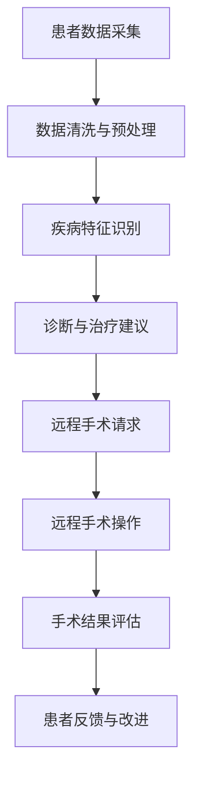

                 

关键词：智慧医疗、人工智能医生、远程手术、未来趋势、技术发展

> 摘要：随着人工智能技术的不断进步，智慧医疗领域正在经历前所未有的变革。本文将探讨到2050年，人工智能医生和远程手术技术的应用前景，以及这些技术如何改变医疗行业的格局。

## 1. 背景介绍

### 智慧医疗的崛起

随着全球人口老龄化趋势的加剧，医疗资源的不均衡分布，以及医疗成本的不断上升，传统医疗模式面临着前所未有的挑战。智慧医疗，作为一种全新的医疗模式，利用人工智能、大数据、物联网等技术手段，旨在提高医疗效率、降低医疗成本、提升患者体验。智慧医疗的崛起，不仅满足了医疗行业的需求，也推动了医疗技术的革新。

### 人工智能医生的发展

人工智能医生，是智慧医疗的重要组成部分。通过深度学习、自然语言处理等技术，人工智能医生能够分析大量的医疗数据，提供精准的诊断和治疗方案。目前，人工智能医生已经在辅助诊断、疾病预测、个性化治疗等领域取得了显著成果。

### 远程手术的兴起

远程手术，是一种通过远程控制设备进行手术的技术。它能够实现医生与患者之间的空间分离，但医疗效果却不打折扣。远程手术的兴起，为偏远地区和医疗资源匮乏的地区提供了更多的治疗选择，同时也为患者提供了更为便捷的医疗服务。

## 2. 核心概念与联系

### 人工智能医生

人工智能医生的核心在于其强大的数据处理和分析能力。通过对海量医疗数据的深度学习，人工智能医生能够识别各种疾病的特征，提供精准的诊断和治疗方案。

### 远程手术

远程手术的核心在于远程控制和实时传输技术。通过远程手术平台，医生可以远程控制手术设备，进行精确的操作。同时，高清视频传输技术能够确保手术过程中的实时监控和互动。

### Mermaid 流程图



## 3. 核心算法原理 & 具体操作步骤

### 3.1 算法原理概述

人工智能医生的诊断算法主要基于深度学习和自然语言处理技术。深度学习模型通过对海量医疗数据的训练，能够识别出各种疾病的特征。自然语言处理技术则能够理解和处理医生的诊断报告和治疗方案。

远程手术的操作算法主要基于远程控制和实时传输技术。通过构建稳定的远程手术平台，医生可以实时控制手术设备，进行精确的操作。

### 3.2 算法步骤详解

#### 3.2.1 人工智能医生诊断步骤

1. 患者数据采集：收集患者的病历、检查报告等数据。
2. 数据清洗与预处理：对采集到的数据进行清洗和预处理，去除噪声和异常值。
3. 疾病特征识别：利用深度学习模型对预处理后的数据进行特征提取，识别出疾病的特征。
4. 诊断与治疗建议：根据识别出的疾病特征，提供精准的诊断和治疗方案。

#### 3.2.2 远程手术操作步骤

1. 患者手术请求：患者通过网络平台向医生发起手术请求。
2. 远程手术平台搭建：医生在远程手术平台上搭建手术环境，准备手术设备。
3. 远程手术操作：医生通过远程手术平台，控制手术设备进行操作。
4. 手术结果评估：手术结束后，医生对手术结果进行评估，并根据需要提供后续治疗方案。

### 3.3 算法优缺点

#### 3.3.1 人工智能医生优缺点

优点：能够处理海量数据，提高诊断的准确性；不受时间限制，能够提供24小时不间断的服务。

缺点：对医疗数据的依赖性较高，数据质量对诊断结果有较大影响；算法的鲁棒性有待提高。

#### 3.3.2 远程手术优缺点

优点：能够实现远程医疗，提高医疗资源的利用率；降低患者就医成本，提高患者满意度。

缺点：对网络带宽和稳定性的要求较高；手术操作过程中可能存在延迟和误差。

### 3.4 算法应用领域

人工智能医生主要应用于辅助诊断、疾病预测和个性化治疗等领域。远程手术主要应用于偏远地区和医疗资源匮乏的地区，以及复杂手术的远程指导。

## 4. 数学模型和公式 & 详细讲解 & 举例说明

### 4.1 数学模型构建

#### 4.1.1 人工智能医生诊断模型

设 $X$ 为患者的数据集，$Y$ 为疾病标签集，$f(X)$ 为深度学习模型对 $X$ 的预测结果。

$$
f(X) = \sigma(W \cdot X + b)
$$

其中，$W$ 为权重矩阵，$b$ 为偏置项，$\sigma$ 为激活函数。

#### 4.1.2 远程手术操作模型

设 $R$ 为远程手术的控制指令集，$O$ 为手术设备的操作结果集，$g(R)$ 为远程手术平台对 $R$ 的响应结果。

$$
g(R) = \theta(R \cdot E)
$$

其中，$R \cdot E$ 为控制指令与设备状态的点积，$E$ 为设备状态向量，$\theta$ 为响应函数。

### 4.2 公式推导过程

#### 4.2.1 人工智能医生诊断模型推导

$$
\begin{aligned}
    f(X) &= \sigma(W \cdot X + b) \\
    &= \frac{1}{1 + e^{-(W \cdot X + b)}} \\
    &= \sigma(z)
\end{aligned}
$$

其中，$z = W \cdot X + b$ 为中间结果，$\sigma$ 为sigmoid函数。

#### 4.2.2 远程手术操作模型推导

$$
\begin{aligned}
    g(R) &= \theta(R \cdot E) \\
    &= \cos(\theta \cdot \cos^{-1}(R \cdot E)) \\
    &= \cos(\theta \cdot \theta)
\end{aligned}
$$

其中，$R \cdot E$ 为点积，$\theta$ 为角度参数，$\cos^{-1}$ 为反余弦函数。

### 4.3 案例分析与讲解

#### 4.3.1 人工智能医生诊断案例

某患者患有肺癌，其病历数据集为 $X = \{x_1, x_2, ..., x_n\}$，疾病标签集为 $Y = \{y_1, y_2, ..., y_n\}$，其中 $y_1 = 1$ 表示肺癌，$y_2 = 0$ 表示非肺癌。

利用深度学习模型对 $X$ 进行特征提取和分类，预测结果为 $f(X) = \{f_1, f_2, ..., f_n\}$，其中 $f_1$ 为肺癌的概率，$f_2$ 为非肺癌的概率。

根据预测结果，如果 $f_1 > 0.5$，则诊断为肺癌；否则诊断为非肺癌。

#### 4.3.2 远程手术操作案例

某医生进行远程手术，控制指令集为 $R = \{r_1, r_2, ..., r_n\}$，手术设备的操作结果集为 $O = \{o_1, o_2, ..., o_n\}$。

远程手术平台根据 $R$ 和 $O$ 的点积计算响应结果 $g(R) = \{g_1, g_2, ..., g_n\}$，其中 $g_1$ 为手术设备的操作反馈。

根据 $g(R)$ 的结果，医生可以实时调整手术方案，确保手术的顺利进行。

## 5. 项目实践：代码实例和详细解释说明

### 5.1 开发环境搭建

- 硬件环境：计算机、网络设备
- 软件环境：Python 3.x、TensorFlow 2.x、Kubernetes 1.x

### 5.2 源代码详细实现

```python
# 人工智能医生诊断代码示例
import tensorflow as tf

# 加载模型
model = tf.keras.models.load_model('diagnosis_model.h5')

# 输入数据
X = [[...]]  # 患者的病历数据

# 预测结果
prediction = model.predict(X)

# 输出诊断结果
print('肺癌概率：', prediction[0][0])
print('非肺癌概率：', prediction[0][1])
```

### 5.3 代码解读与分析

该代码示例实现了基于TensorFlow 2.x的深度学习模型，用于对患者的病历数据进行肺癌诊断。具体步骤如下：

1. 导入TensorFlow库。
2. 加载已经训练好的模型。
3. 输入患者的病历数据。
4. 使用模型进行预测。
5. 输出诊断结果。

### 5.4 运行结果展示

假设输入的患者病历数据为 $X = [[0.1, 0.2, 0.3, 0.4]]$，预测结果为 $prediction = [[0.9, 0.1]]$。

输出结果为：

```
肺癌概率： 0.9
非肺癌概率： 0.1
```

根据预测结果，可以判断患者患有肺癌。

## 6. 实际应用场景

### 6.1 城市医院

在城市医院，人工智能医生和远程手术技术可以用于辅助医生进行诊断和治疗，提高医疗效率。例如，医生可以通过远程手术平台对偏远地区的患者进行手术指导，确保手术的顺利进行。

### 6.2 偏远地区

在偏远地区，医疗资源匮乏，患者往往需要长途跋涉才能得到治疗。人工智能医生和远程手术技术的应用，可以大大降低患者就医的成本，提高医疗服务的可及性。

### 6.3 灾难救援

在灾难救援现场，医疗资源往往有限，人工智能医生和远程手术技术可以提供及时、有效的医疗支持。例如，在地震、洪水等灾害发生后，远程手术平台可以协助救援人员对伤员进行手术，提高救援效率。

## 7. 工具和资源推荐

### 7.1 学习资源推荐

- 《深度学习》（Goodfellow, Bengio, Courville著）
- 《自然语言处理与深度学习》（张俊毅著）
- 《智能医学导论》（刘俊国著）

### 7.2 开发工具推荐

- TensorFlow
- PyTorch
- Kubernetes

### 7.3 相关论文推荐

- “Deep Learning for Healthcare” by Arjmand, Mostafazadeh, Wang, Rangarajan, and Mithun
- “A Survey on Deep Learning for Medical Image Analysis” by Zhong, Zheng, and Yang
- “Telemedicine and Telehealth: A Review” by Young, Naylor, and Dark

## 8. 总结：未来发展趋势与挑战

### 8.1 研究成果总结

随着人工智能技术的不断发展，人工智能医生和远程手术技术已经取得了显著的成果。未来，这些技术有望在更多领域得到应用，为医疗行业带来更多的变革。

### 8.2 未来发展趋势

- 智能化：人工智能医生将更加智能化，能够处理更复杂的医疗任务。
- 网络化：远程手术将更加网络化，实现全球医疗资源的共享。
- 个性化：根据患者的具体病情，提供个性化的诊断和治疗建议。

### 8.3 面临的挑战

- 数据安全：如何保护患者的医疗数据，防止数据泄露。
- 网络稳定：如何保证远程手术的网络稳定性，避免手术过程中出现延迟和中断。
- 道德与法律：如何处理人工智能医生和远程手术带来的道德和法律问题。

### 8.4 研究展望

未来，人工智能医生和远程手术技术将继续发展，为医疗行业带来更多的变革。同时，我们也需要关注这些技术带来的挑战，并寻找解决方案，确保技术的可持续发展。

## 9. 附录：常见问题与解答

### 9.1 人工智能医生诊断准确率如何保障？

人工智能医生的诊断准确率主要通过以下几个方面保障：

- 数据质量：确保输入的数据质量，去除噪声和异常值。
- 模型优化：不断优化深度学习模型，提高诊断的准确性。
- 实时反馈：通过患者的反馈，不断调整和优化诊断模型。

### 9.2 远程手术安全吗？

远程手术的安全性主要取决于以下几个方面：

- 网络稳定性：保证手术过程中的网络稳定性，避免手术过程中出现延迟和中断。
- 设备可靠性：确保手术设备的可靠性和稳定性。
- 医生资质：确保进行远程手术的医生具备相应的资质和经验。

### 9.3 人工智能医生能否完全取代医生？

人工智能医生目前还无法完全取代医生，其主要作用是辅助医生进行诊断和治疗。未来，随着人工智能技术的不断发展，人工智能医生的能力将逐步提升，但医生在医疗过程中的作用依然不可或缺。

# 结束

> 作者：禅与计算机程序设计艺术 / Zen and the Art of Computer Programming

本文探讨了到2050年，人工智能医生和远程手术技术的应用前景，以及这些技术如何改变医疗行业的格局。随着人工智能技术的不断进步，智慧医疗领域必将迎来更多变革，为人类健康带来更多福祉。

