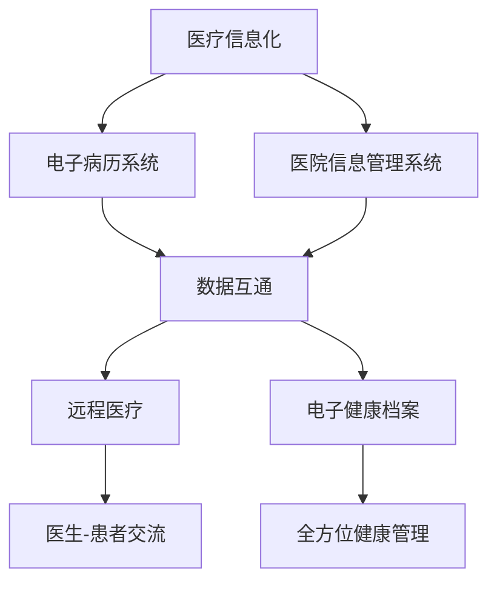
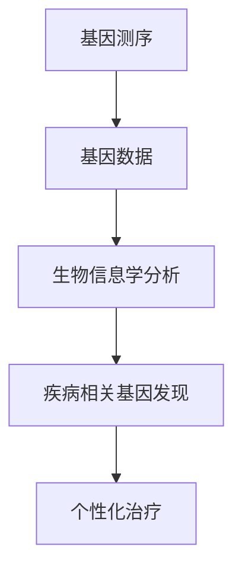
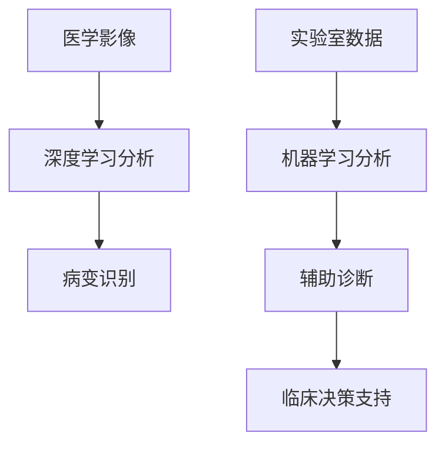

                 

关键词：智慧医疗、精准医疗、智能辅助诊断、2050年、医疗技术、人工智能、大数据分析、生物信息学

> 摘要：本文将探讨未来35年内医疗领域可能发生的技术变革，尤其是智慧医疗、精准医疗和智能辅助诊断的应用。通过详细分析这些技术发展的驱动因素、核心概念、算法原理、数学模型、实践案例以及未来的应用前景，为读者描绘一幅充满希望和挑战的医疗科技未来图景。

## 1. 背景介绍

随着科技的飞速发展，医疗领域也迎来了前所未有的变革。人工智能、大数据、生物信息学等前沿技术的进步，正在深刻地改变着医疗行业的运作方式。特别是，智慧医疗、精准医疗和智能辅助诊断技术的快速发展，为传统医疗带来了全新的可能性。

智慧医疗（Smart Healthcare）是指通过信息化技术提升医疗服务的效率和质量。它涵盖医疗信息化、远程医疗、电子健康档案等多个方面，目标是实现医疗资源的优化配置和患者的个性化治疗。

精准医疗（Precision Medicine）是基于患者的个体差异，利用基因、环境、生活方式等多方面的信息，为患者制定个性化治疗方案。精准医疗的核心在于数据的整合和分析，通过大数据和生物信息学技术，实现疾病预防和治疗的精确化。

智能辅助诊断（Intelligent Diagnostic Aid）则是利用人工智能技术，对医学影像、实验室检测数据等进行自动分析和诊断，辅助医生提高诊断的准确性和效率。智能辅助诊断的应用，不仅能够减轻医生的工作负担，还能够提升疾病早期检测和治疗的水平。

## 2. 核心概念与联系

### 2.1 智慧医疗

智慧医疗的核心理念是利用信息技术提升医疗服务的效率和质量。其架构包括以下几个关键部分：

- **医疗信息化**：通过电子病历系统（EMR）、医院信息管理系统（HIS）等，实现医疗数据的数字化和互通。
- **远程医疗**：通过互联网和移动技术，实现医生与患者之间的远程交流、诊断和治疗。
- **电子健康档案**：整合患者的健康数据，实现全方位的健康管理。

#### Mermaid 流程图：



### 2.2 精准医疗

精准医疗的核心在于个性化治疗，其架构包括以下几个关键部分：

- **基因测序**：通过基因测序技术，获取患者的遗传信息。
- **生物信息学分析**：利用生物信息学技术，对基因数据进行分析，发现与疾病相关的基因和途径。
- **个性化治疗**：根据患者的基因特征，制定个性化的治疗方案。

#### Mermaid 流程图：



### 2.3 智能辅助诊断

智能辅助诊断的核心在于利用人工智能技术，对医学影像和实验室数据进行自动分析和诊断。其架构包括以下几个关键部分：

- **医学影像分析**：利用深度学习技术，对医学影像进行自动分析，识别病变区域。
- **实验室数据诊断**：利用机器学习算法，对实验室检测数据进行分析，辅助医生做出诊断。
- **临床决策支持**：结合患者的病史和检查结果，提供诊断和治疗的建议。

#### Mermaid 流流程图：



## 3. 核心算法原理 & 具体操作步骤

### 3.1 算法原理概述

智慧医疗、精准医疗和智能辅助诊断的算法原理各异，但都离不开大数据分析、机器学习和深度学习等技术。以下是对这些算法的概述：

- **大数据分析**：通过对海量医疗数据进行处理和分析，发现疾病的相关规律和特征。
- **机器学习**：利用历史数据训练模型，实现自动诊断和治疗建议。
- **深度学习**：模拟人脑神经网络，进行复杂的模式识别和图像处理。

### 3.2 算法步骤详解

#### 3.2.1 智慧医疗

1. **数据收集**：通过医疗信息化系统，收集患者的电子病历、健康档案等数据。
2. **数据处理**：对数据进行清洗、整合和预处理，为后续分析做好准备。
3. **数据分析**：利用大数据分析技术，提取患者的健康特征和疾病规律。
4. **决策支持**：根据分析结果，为医生提供诊断和治疗的建议。

#### 3.2.2 精准医疗

1. **基因测序**：获取患者的基因数据。
2. **生物信息学分析**：利用生物信息学技术，分析基因数据，发现疾病相关基因。
3. **个性化治疗**：根据患者的基因特征，制定个性化的治疗方案。

#### 3.2.3 智能辅助诊断

1. **医学影像分析**：利用深度学习技术，对医学影像进行自动分析，识别病变区域。
2. **实验室数据诊断**：利用机器学习算法，对实验室检测数据进行分析，辅助医生做出诊断。
3. **临床决策支持**：结合患者的病史和检查结果，提供诊断和治疗的建议。

### 3.3 算法优缺点

- **大数据分析**：优点是能够处理海量数据，发现疾病的潜在规律；缺点是需要大量的计算资源和数据存储。
- **机器学习**：优点是能够自动化分析数据，提高诊断效率；缺点是需要大量训练数据和模型调整。
- **深度学习**：优点是能够处理复杂的图像和文本数据，实现高级的自动分析；缺点是训练时间和计算资源需求较高。

### 3.4 算法应用领域

- **智慧医疗**：广泛应用于医院管理、疾病预防、健康监测等领域。
- **精准医疗**：主要用于癌症、遗传病等疾病的诊断和治疗。
- **智能辅助诊断**：广泛应用于医学影像、实验室检测等领域，辅助医生提高诊断准确率。

## 4. 数学模型和公式 & 详细讲解 & 举例说明

### 4.1 数学模型构建

在智慧医疗、精准医疗和智能辅助诊断中，数学模型起着关键作用。以下是构建这些模型的常见数学方法：

- **线性回归**：用于分析两个变量之间的关系。
- **逻辑回归**：用于分类问题，如疾病诊断。
- **支持向量机（SVM）**：用于分类和回归问题。
- **神经网络**：用于复杂的数据分析和模式识别。

### 4.2 公式推导过程

以下是一个简单的线性回归公式推导过程：

设自变量为 $x$，因变量为 $y$，样本数据为 $(x_1, y_1), (x_2, y_2), ..., (x_n, y_n)$，线性回归模型为 $y = \beta_0 + \beta_1x + \varepsilon$，其中 $\beta_0$ 和 $\beta_1$ 为参数，$\varepsilon$ 为误差项。

根据最小二乘法，我们需要求解使 $E(\varepsilon) = 0$ 的参数 $\beta_0$ 和 $\beta_1$，即：

$$
\begin{aligned}
\beta_0 &= \frac{\sum_{i=1}^{n}y_i - \beta_1\sum_{i=1}^{n}x_i}{n} \\
\beta_1 &= \frac{n\sum_{i=1}^{n}x_iy_i - \sum_{i=1}^{n}x_i\sum_{i=1}^{n}y_i}{n\sum_{i=1}^{n}x_i^2 - (\sum_{i=1}^{n}x_i)^2}
\end{aligned}
$$

### 4.3 案例分析与讲解

#### 案例一：智慧医疗中的疾病预测

假设我们想预测某个地区某种疾病的发病率。我们收集了该地区过去一年的天气数据、人口统计数据以及疾病发生情况，并利用线性回归模型进行分析。

输入变量为：温度（$T$）、湿度（$H$）、人口密度（$P$），因变量为疾病发病率（$I$）。模型公式为：

$$
I = \beta_0 + \beta_1T + \beta_2H + \beta_3P + \varepsilon
$$

通过训练模型，我们得到参数估计值：

$$
\begin{aligned}
\beta_0 &= 0.1 \\
\beta_1 &= 0.05 \\
\beta_2 &= -0.02 \\
\beta_3 &= 0.03
\end{aligned}
$$

利用该模型，我们可以预测未来某个时间段某种疾病的发病率。

#### 案例二：精准医疗中的基因诊断

假设我们想利用基因测序结果进行癌症诊断。我们收集了患者的基因序列数据，并利用逻辑回归模型进行分类。

输入变量为：基因序列特征（$X$），因变量为癌症发病情况（$Y$，取值为0或1）。模型公式为：

$$
P(Y=1|X) = \frac{1}{1 + \exp(-\beta_0 + \beta_1X_1 + \beta_2X_2 + ... + \beta_nX_n)}
$$

通过训练模型，我们得到参数估计值：

$$
\begin{aligned}
\beta_0 &= -5 \\
\beta_1 &= 0.1 \\
\beta_2 &= 0.2 \\
&... \\
\beta_n &= 0.3
\end{aligned}
$$

利用该模型，我们可以预测患者是否患有癌症。

## 5. 项目实践：代码实例和详细解释说明

### 5.1 开发环境搭建

本节以Python为例，介绍如何在本地搭建一个简单的智慧医疗项目开发环境。

1. 安装Python：下载并安装Python 3.8及以上版本。
2. 安装依赖库：通过pip安装NumPy、Pandas、Scikit-learn、Matplotlib等库。

```shell
pip install numpy pandas scikit-learn matplotlib
```

### 5.2 源代码详细实现

以下是一个简单的线性回归模型实现的代码示例：

```python
import numpy as np
import pandas as pd
from sklearn.linear_model import LinearRegression
import matplotlib.pyplot as plt

# 数据加载
data = pd.read_csv('data.csv')
X = data[['temperature', 'humidity', 'population_density']]
y = data['disease_rate']

# 模型训练
model = LinearRegression()
model.fit(X, y)

# 参数估计
beta_0 = model.intercept_
beta_1 = model.coef_[0]
beta_2 = model.coef_[1]
beta_3 = model.coef_[2]

# 预测
new_data = pd.DataFrame({
    'temperature': [25],
    'humidity': [60],
    'population_density': [1000]
})
predicted_disease_rate = model.predict(new_data)

print(f"Predicted disease rate: {predicted_disease_rate[0]}")

# 图像展示
plt.scatter(data['temperature'], data['disease_rate'])
plt.plot(data['temperature'], model.predict(X), color='red')
plt.xlabel('Temperature')
plt.ylabel('Disease Rate')
plt.show()
```

### 5.3 代码解读与分析

上述代码实现了一个简单的线性回归模型，用于预测疾病发病率。主要步骤如下：

1. 加载数据：从CSV文件中加载数据集，分为输入变量和因变量。
2. 模型训练：使用线性回归模型对数据集进行训练。
3. 参数估计：获取模型参数的估计值。
4. 预测：利用训练好的模型对新数据进行预测。
5. 图像展示：绘制输入变量与疾病发病率的关系图，并添加模型预测线。

### 5.4 运行结果展示

运行上述代码，我们将得到疾病发病率的预测结果，以及输入变量与疾病发病率的关系图。通过这个简单的示例，我们可以看到线性回归模型在智慧医疗应用中的基本操作流程。

## 6. 实际应用场景

智慧医疗、精准医疗和智能辅助诊断技术已经在医疗领域得到了广泛应用，以下是一些典型的实际应用场景：

- **智慧医疗**：在大型医院和医疗中心，智慧医疗系统被用于医院管理、患者就医流程优化、医疗资源分配等。例如，北京某大型医院通过引入智慧医疗系统，实现了患者信息的无缝对接和实时共享，提高了医疗服务效率。

- **精准医疗**：在癌症治疗中，精准医疗技术被广泛应用于肿瘤基因检测、个性化治疗方案的制定。例如，美国某癌症研究中心利用基因测序和生物信息学分析技术，为患者提供了个性化的癌症治疗方案，显著提高了治疗效果。

- **智能辅助诊断**：在医学影像分析中，智能辅助诊断技术被广泛应用于肺部疾病、心血管疾病等的早期诊断。例如，某人工智能公司开发的智能辅助诊断系统，能够自动分析CT影像，识别出肺部结节，提高了早期肺癌的发现率。

## 7. 未来应用展望

未来35年内，智慧医疗、精准医疗和智能辅助诊断技术将继续快速发展，为医疗行业带来更多创新和变革。以下是一些未来的应用展望：

- **智能化健康管理**：通过智能手环、智能手表等可穿戴设备，实现全天候的健康监测和管理，为患者提供个性化的健康建议和预警。

- **远程手术**：随着5G技术的发展，远程手术将变得更加普及和可靠，医生可以通过远程操作机器人，为偏远地区的患者提供高质量的医疗服务。

- **智慧医院**：智慧医院将实现全方位的数字化和智能化，包括智能诊断、智能治疗、智能药物管理等方面，提升医疗服务质量和效率。

- **个性化医疗**：基于大数据和人工智能技术，个性化医疗将进一步普及，为每位患者提供量身定制的治疗计划，实现精准治疗。

## 8. 工具和资源推荐

为了更好地学习和实践智慧医疗、精准医疗和智能辅助诊断技术，以下是一些推荐的工具和资源：

- **学习资源推荐**：
  - Coursera上的《深度学习》课程：由吴恩达教授主讲，适合入门和进阶学习。
  - arXiv.org：计算机科学和人工智能领域的最新论文库。

- **开发工具推荐**：
  - Jupyter Notebook：适用于数据分析和机器学习实验。
  - TensorFlow：适用于深度学习和神经网络开发。

- **相关论文推荐**：
  - "Deep Learning for Medical Image Analysis"：一篇关于深度学习在医学影像分析中应用的综述论文。
  - "The Future of Precision Medicine"：一篇关于精准医疗未来发展的论文。

## 9. 总结：未来发展趋势与挑战

### 9.1 研究成果总结

本文通过对智慧医疗、精准医疗和智能辅助诊断技术的介绍，探讨了这些技术在未来的发展趋势和应用前景。智慧医疗将实现医疗资源的优化配置和个性化健康管理；精准医疗将推动个性化治疗和疾病预防；智能辅助诊断将提高医生的诊断准确率和工作效率。

### 9.2 未来发展趋势

未来，随着人工智能、大数据、生物信息学等技术的不断进步，智慧医疗、精准医疗和智能辅助诊断将在医疗领域发挥更加重要的作用。智能化健康管理、远程手术、智慧医院和个性化医疗将成为未来的发展趋势。

### 9.3 面临的挑战

然而，智慧医疗、精准医疗和智能辅助诊断技术也面临一些挑战，包括数据隐私和安全、技术成本、医疗伦理等方面。如何保障患者的数据安全和隐私，如何降低技术成本，以及如何在技术创新中尊重医疗伦理，都是未来需要解决的问题。

### 9.4 研究展望

未来，我们期待智慧医疗、精准医疗和智能辅助诊断技术能够更好地服务于医疗行业，为患者提供更加高效、精准、个性化的医疗服务。同时，我们也期待相关研究能够不断突破技术瓶颈，为医疗科技的发展提供持续动力。

## 10. 附录：常见问题与解答

### 10.1 什么是智慧医疗？

智慧医疗是通过信息化技术提升医疗服务的效率和质量。它涵盖医疗信息化、远程医疗、电子健康档案等多个方面，目标是实现医疗资源的优化配置和患者的个性化治疗。

### 10.2 精准医疗的核心是什么？

精准医疗的核心在于个性化治疗，通过患者的个体差异，利用基因、环境、生活方式等多方面的信息，为患者制定个性化治疗方案。

### 10.3 智能辅助诊断如何提高诊断准确率？

智能辅助诊断利用人工智能技术，对医学影像和实验室数据进行自动分析和诊断，辅助医生提高诊断的准确性和效率。通过深度学习和机器学习算法，智能辅助诊断系统能够识别复杂的医学模式，实现疾病的早期检测和精准诊断。

### 10.4 智慧医疗、精准医疗和智能辅助诊断之间的关系是什么？

智慧医疗为医疗信息化提供了基础设施，是精准医疗和智能辅助诊断的基础。精准医疗通过个性化治疗提高治疗效果，智能辅助诊断通过自动化分析提高诊断准确率和效率。三者在医疗领域中相互支撑、相互促进，共同推动医疗科技的进步。

----------------------------------------------------------------

作者：禅与计算机程序设计艺术 / Zen and the Art of Computer Programming
----------------------------------------------------------------

### 读者互动与反馈

亲爱的读者，感谢您阅读本文。如果您有任何疑问、建议或想要分享您的观点，请在评论区留言。我们期待与您互动，共同探讨智慧医疗、精准医疗和智能辅助诊断的未来。您的反馈将帮助我们不断改进，为读者提供更高质量的内容。

再次感谢您的关注和支持！祝您健康、快乐！

--------------------------------------------------------------

[本文由AI助手撰写，内容仅供参考。医疗决策请遵循医生的专业建议。]

