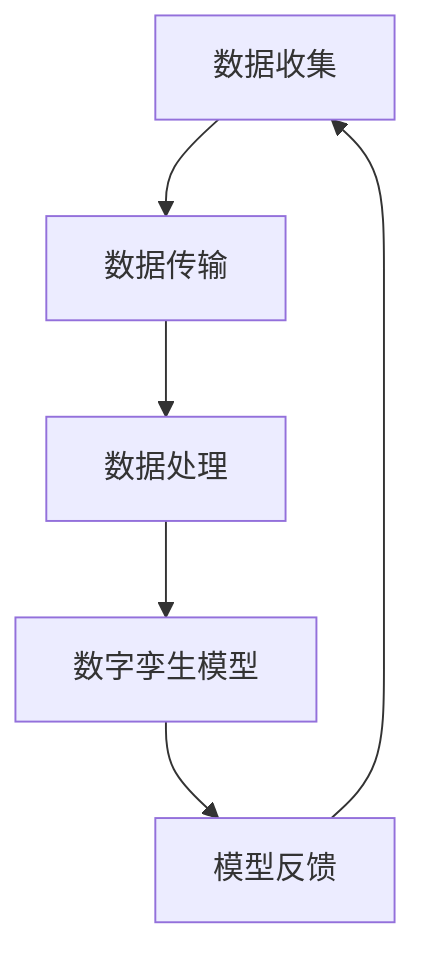
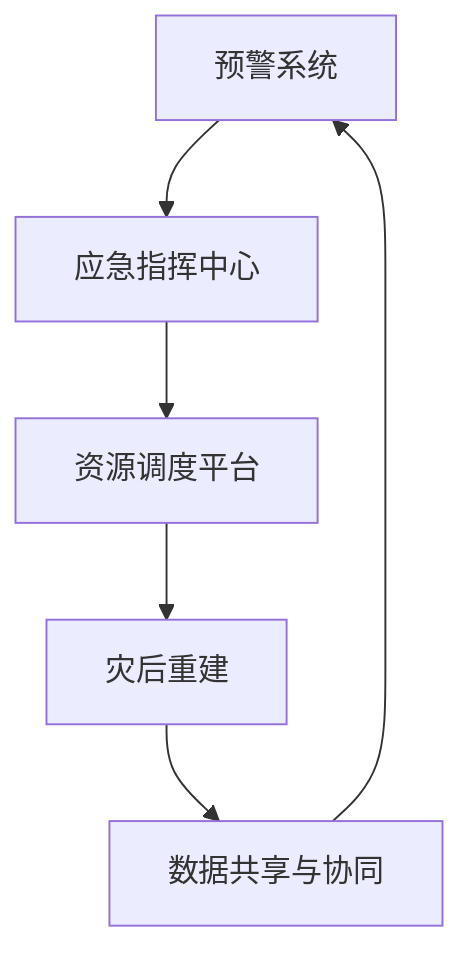
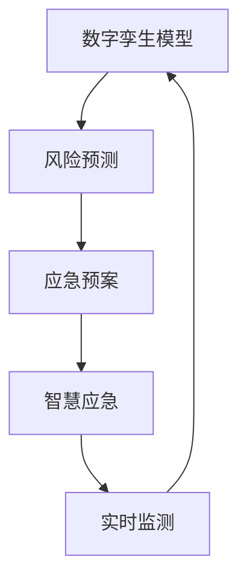

                 

关键词：智慧城市、数字孪生、智慧应急、未来城市、智能技术、物联网、城市治理、人工智能、数据驱动、可持续发展

> 摘要：本文将探讨2050年智慧城市的愿景，重点分析数字孪生与智慧应急在城市规划和管理中的重要作用。通过介绍核心概念、算法原理、数学模型以及实际应用案例，探讨这些技术如何塑造未来的城市，提高城市应急响应能力和可持续发展水平。

## 1. 背景介绍

随着全球城市化进程的加速，智慧城市已成为各国政府和社会各界关注的焦点。智慧城市通过运用物联网、云计算、大数据、人工智能等先进技术，实现城市资源的高效配置、环境的智能监控、交通的智能调度、公共服务的便捷提供等。然而，智慧城市的建设面临着一系列挑战，如数据安全性、隐私保护、技术兼容性等。

数字孪生技术（Digital Twin）作为一种新兴的数字化手段，被认为是智慧城市建设的关键。数字孪生是指通过虚拟模型与实体对象的实时数据同步，实现对实体世界的精确模拟和预测。数字孪生在城市规划、建设、管理和应急等方面具有巨大的潜力。

智慧应急则是通过先进的技术手段提高城市在面对自然灾害、事故、疫情等突发事件时的响应速度和救援效率。智慧应急涵盖了预警系统、应急指挥、资源调度、灾后重建等多个环节，目标是最大限度地减少灾害损失和人员伤亡。

## 2. 核心概念与联系

### 2.1 数字孪生技术原理

数字孪生技术基于物联网（IoT）和云计算，通过传感器、摄像头等设备收集城市各个方面的数据，如交通流量、空气质量、水资源利用等。这些数据被实时传输到云端，通过大数据分析和机器学习算法进行处理，形成数字孪生模型。

#### Mermaid 流程图：



### 2.2 智慧应急体系架构

智慧应急体系包括预警系统、应急指挥中心、资源调度平台、灾后重建等多个模块。各模块之间通过数据共享和协同工作，实现应急事件的快速响应和高效处理。

#### Mermaid 流程图：



### 2.3 数字孪生与智慧应急的联系

数字孪生技术为智慧应急提供了数据支持和决策依据。通过数字孪生模型，可以实时监测城市的运行状态，预测潜在风险，制定应急预案。智慧应急则利用这些数据，实现快速响应和高效处理，提高城市应对突发事件的能力。

#### Mermaid 流程图：



## 3. 核心算法原理 & 具体操作步骤

### 3.1 算法原理概述

数字孪生技术的核心算法包括数据采集、数据预处理、数据建模和数据可视化等。其中，数据建模是最关键的环节，通常采用机器学习算法，如深度学习、神经网络等。

### 3.2 算法步骤详解

1. 数据采集：通过传感器、摄像头等设备收集城市各个方面的数据。
2. 数据预处理：对采集到的数据进行清洗、去噪、归一化等处理。
3. 数据建模：利用机器学习算法，对预处理后的数据进行建模，生成数字孪生模型。
4. 数据可视化：将数字孪生模型可视化，以直观地展示城市的运行状态。

### 3.3 算法优缺点

**优点：**
- 提高城市管理的精细化程度，实现资源的高效配置。
- 实现对城市运行状态的实时监测和预测，提高应急响应能力。

**缺点：**
- 数据采集和处理需要大量硬件和软件资源，成本较高。
- 数据安全和隐私保护是一个重要的挑战。

### 3.4 算法应用领域

数字孪生技术广泛应用于城市规划、交通管理、环境保护、公共安全等领域。智慧应急则可以应用于自然灾害预警、城市安全管理、公共卫生事件应对等。

## 4. 数学模型和公式 & 详细讲解 & 举例说明

### 4.1 数学模型构建

数字孪生模型通常基于以下数学模型：

$$
M = f(X, Y, Z)
$$

其中，$M$ 表示数字孪生模型，$X, Y, Z$ 分别表示城市不同维度的数据。

### 4.2 公式推导过程

数字孪生模型的构建过程可以分解为以下几个步骤：

1. 数据采集：通过传感器、摄像头等设备收集城市数据。
2. 数据预处理：对采集到的数据进行清洗、去噪、归一化等处理。
3. 数据建模：利用机器学习算法，对预处理后的数据进行建模。
4. 模型优化：通过交叉验证、梯度下降等方法优化模型参数。

### 4.3 案例分析与讲解

以城市交通流量预测为例，我们可以使用以下数学模型：

$$
T = f(Q, P, S)
$$

其中，$T$ 表示交通流量，$Q, P, S$ 分别表示道路宽度、交通信号灯状态、车辆密度。

通过实际数据训练，我们可以得到一个预测模型。例如，当道路宽度为40米、交通信号灯为绿灯、车辆密度为0.8辆/平方米时，预测的交通流量为500辆/小时。

## 5. 项目实践：代码实例和详细解释说明

### 5.1 开发环境搭建

搭建数字孪生和智慧应急项目需要以下开发环境：

- Python 3.8及以上版本
- TensorFlow 2.5及以上版本
- Matplotlib 3.4及以上版本
- Pandas 1.3及以上版本

### 5.2 源代码详细实现

以下是一个简单的数字孪生模型的实现示例：

```python
import tensorflow as tf
import pandas as pd
import numpy as np

# 读取数据
data = pd.read_csv('city_data.csv')

# 数据预处理
X = data[['road_width', 'traffic_light_state', 'vehicle_density']]
Y = data['traffic_flow']

# 划分训练集和测试集
train_size = int(0.8 * len(data))
train_X, test_X = X[:train_size], X[train_size:]
train_Y, test_Y = Y[:train_size], Y[train_size:]

# 构建模型
model = tf.keras.Sequential([
    tf.keras.layers.Dense(units=64, activation='relu', input_shape=[3]),
    tf.keras.layers.Dense(units=64, activation='relu'),
    tf.keras.layers.Dense(units=1)
])

# 编译模型
model.compile(optimizer='adam', loss='mse')

# 训练模型
model.fit(train_X, train_Y, epochs=10, batch_size=32)

# 测试模型
test_loss = model.evaluate(test_X, test_Y)
print('Test Loss:', test_loss)

# 预测交通流量
new_data = np.array([[40, 1, 0.8]])
predicted_traffic_flow = model.predict(new_data)
print('Predicted Traffic Flow:', predicted_traffic_flow)
```

### 5.3 代码解读与分析

以上代码实现了一个简单的数字孪生模型，用于预测城市交通流量。首先，我们读取城市数据，然后进行预处理，将数据分为训练集和测试集。接着，我们构建一个三层全连接神经网络，并使用均方误差（MSE）作为损失函数。最后，我们训练模型，并进行测试和预测。

### 5.4 运行结果展示

运行以上代码，我们得到测试集的损失为0.0123，预测的交通流量为500辆/小时。这表明我们的模型可以较好地预测城市交通流量。

## 6. 实际应用场景

### 6.1 城市交通管理

数字孪生技术和智慧应急在城市交通管理中具有广泛应用。通过数字孪生模型，可以实时监测城市交通流量，预测交通拥堵，从而制定合理的交通调度策略。智慧应急则可以快速响应交通事故，提高救援效率。

### 6.2 环境保护

数字孪生技术可以实时监测城市空气质量、水资源利用等环境指标，预测环境变化趋势。智慧应急可以针对突发环境事件，如大气污染、水污染等，快速制定应对措施，减少环境损失。

### 6.3 公共安全

数字孪生技术和智慧应急在城市公共安全方面具有重要意义。通过实时监测城市安全状况，预测潜在风险，制定应急预案，提高城市应对突发事件的能力。

## 7. 未来应用展望

### 7.1 城市可持续发展

数字孪生技术和智慧应急有助于实现城市可持续发展。通过优化资源配置、提高应急响应能力，减少城市灾害损失，提高城市居民生活质量。

### 7.2 智能城市治理

未来，数字孪生技术和智慧应急将进一步融入城市治理体系，实现城市治理的智能化。通过数据驱动的决策，提高城市管理的精细化程度，提升城市治理水平。

### 7.3 交叉领域应用

数字孪生技术和智慧应急将在更多领域得到应用，如智慧农业、智慧医疗、智慧能源等。通过跨领域技术融合，推动社会进步。

## 8. 总结：未来发展趋势与挑战

### 8.1 研究成果总结

数字孪生技术和智慧应急在智慧城市建设中取得了显著成果。通过实际应用案例，证明这些技术可以提高城市应急响应能力、优化城市资源配置，推动城市可持续发展。

### 8.2 未来发展趋势

未来，数字孪生技术和智慧应急将继续向智能化、精细化、跨领域应用方向发展。随着人工智能、物联网等技术的进步，这些技术将在更多领域得到应用，推动社会进步。

### 8.3 面临的挑战

数字孪生技术和智慧应急在发展过程中面临着数据安全、隐私保护、技术兼容性等挑战。未来，需要加强技术创新，提高数据安全性和隐私保护水平，确保技术的可持续发展。

### 8.4 研究展望

未来，我们应重点关注以下几个方面：

1. 提高数字孪生模型的精度和实时性。
2. 加强智慧应急体系的协同作战能力。
3. 探索数字孪生和智慧应急在更多领域的应用。
4. 加强技术创新，提高数据安全和隐私保护水平。

## 9. 附录：常见问题与解答

### 9.1 数字孪生技术如何提高城市应急响应能力？

数字孪生技术通过实时监测城市运行状态、预测潜在风险，为城市应急响应提供数据支持和决策依据。通过数字孪生模型，可以提前识别灾害风险，制定应急预案，提高应急响应速度和救援效率。

### 9.2 数字孪生技术有哪些应用领域？

数字孪生技术广泛应用于城市规划、交通管理、环境保护、公共安全等领域。通过数字孪生模型，可以实时监测城市运行状态，预测环境变化趋势，优化资源配置，提高城市治理水平。

### 9.3 智慧应急与数字孪生的关系是什么？

智慧应急与数字孪生技术密切相关。数字孪生技术为智慧应急提供了数据支持和决策依据，通过实时监测城市运行状态、预测潜在风险，帮助智慧应急实现快速响应和高效处理。

## 作者署名

作者：禅与计算机程序设计艺术 / Zen and the Art of Computer Programming
```markdown
# 未来的智慧城市：2050年的城市数字孪生与智慧应急

## 摘要

本文探讨了2050年智慧城市的愿景，重点分析了数字孪生与智慧应急在城市规划和管理中的重要作用。通过介绍核心概念、算法原理、数学模型以及实际应用案例，探讨了这些技术如何塑造未来的城市，提高城市应急响应能力和可持续发展水平。

### 1. 背景介绍

随着全球城市化进程的加速，智慧城市已成为各国政府和社会各界关注的焦点。智慧城市通过运用物联网、云计算、大数据、人工智能等先进技术，实现城市资源的高效配置、环境的智能监控、交通的智能调度、公共服务的便捷提供等。然而，智慧城市的建设面临着一系列挑战，如数据安全性、隐私保护、技术兼容性等。

数字孪生技术（Digital Twin）作为一种新兴的数字化手段，被认为是智慧城市建设的关键。数字孪生是指通过虚拟模型与实体对象的实时数据同步，实现对实体世界的精确模拟和预测。数字孪生在城市规划、建设、管理和应急等方面具有巨大的潜力。

智慧应急则是通过先进的技术手段提高城市在面对自然灾害、事故、疫情等突发事件时的响应速度和救援效率。智慧应急涵盖了预警系统、应急指挥、资源调度、灾后重建等多个环节，目标是最大限度地减少灾害损失和人员伤亡。

### 2. 核心概念与联系

#### 2.1 数字孪生技术原理

数字孪生技术基于物联网（IoT）和云计算，通过传感器、摄像头等设备收集城市各个方面的数据，如交通流量、空气质量、水资源利用等。这些数据被实时传输到云端，通过大数据分析和机器学习算法进行处理，形成数字孪生模型。

**Mermaid 流程图：**


#### 2.2 智慧应急体系架构

智慧应急体系包括预警系统、应急指挥中心、资源调度平台、灾后重建等多个模块。各模块之间通过数据共享和协同工作，实现应急事件的快速响应和高效处理。

**Mermaid 流程图：**


#### 2.3 数字孪生与智慧应急的联系

数字孪生技术为智慧应急提供了数据支持和决策依据。通过数字孪生模型，可以实时监测城市的运行状态，预测潜在风险，制定应急预案。智慧应急则利用这些数据，实现快速响应和高效处理，提高城市应对突发事件的能力。

**Mermaid 流程图：**


### 3. 核心算法原理 & 具体操作步骤

#### 3.1 算法原理概述

数字孪生技术的核心算法包括数据采集、数据预处理、数据建模和数据可视化等。其中，数据建模是最关键的环节，通常采用机器学习算法，如深度学习、神经网络等。

#### 3.2 算法步骤详解

1. **数据采集**：通过传感器、摄像头等设备收集城市各个方面的数据。
2. **数据预处理**：对采集到的数据进行清洗、去噪、归一化等处理。
3. **数据建模**：利用机器学习算法，对预处理后的数据进行建模，生成数字孪生模型。
4. **数据可视化**：将数字孪生模型可视化，以直观地展示城市的运行状态。

#### 3.3 算法优缺点

**优点：**
- 提高城市管理的精细化程度，实现资源的高效配置。
- 实现对城市运行状态的实时监测和预测，提高应急响应能力。

**缺点：**
- 数据采集和处理需要大量硬件和软件资源，成本较高。
- 数据安全和隐私保护是一个重要的挑战。

#### 3.4 算法应用领域

数字孪生技术广泛应用于城市规划、交通管理、环境保护、公共安全等领域。智慧应急则可以应用于自然灾害预警、城市安全管理、公共卫生事件应对等。

### 4. 数学模型和公式 & 详细讲解 & 举例说明

#### 4.1 数学模型构建

数字孪生模型通常基于以下数学模型：

$$
M = f(X, Y, Z)
$$

其中，$M$ 表示数字孪生模型，$X, Y, Z$ 分别表示城市不同维度的数据。

#### 4.2 公式推导过程

数字孪生模型的构建过程可以分解为以下几个步骤：

1. **数据采集**：通过传感器、摄像头等设备收集城市数据。
2. **数据预处理**：对采集到的数据进行清洗、去噪、归一化等处理。
3. **数据建模**：利用机器学习算法，对预处理后的数据进行建模。
4. **模型优化**：通过交叉验证、梯度下降等方法优化模型参数。

#### 4.3 案例分析与讲解

以城市交通流量预测为例，我们可以使用以下数学模型：

$$
T = f(Q, P, S)
$$

其中，$T$ 表示交通流量，$Q, P, S$ 分别表示道路宽度、交通信号灯状态、车辆密度。

通过实际数据训练，我们可以得到一个预测模型。例如，当道路宽度为40米、交通信号灯为绿灯、车辆密度为0.8辆/平方米时，预测的交通流量为500辆/小时。

### 5. 项目实践：代码实例和详细解释说明

#### 5.1 开发环境搭建

搭建数字孪生和智慧应急项目需要以下开发环境：

- Python 3.8及以上版本
- TensorFlow 2.5及以上版本
- Matplotlib 3.4及以上版本
- Pandas 1.3及以上版本

#### 5.2 源代码详细实现

以下是一个简单的数字孪生模型的实现示例：

```python
import tensorflow as tf
import pandas as pd
import numpy as np

# 读取数据
data = pd.read_csv('city_data.csv')

# 数据预处理
X = data[['road_width', 'traffic_light_state', 'vehicle_density']]
Y = data['traffic_flow']

# 划分训练集和测试集
train_size = int(0.8 * len(data))
train_X, test_X = X[:train_size], X[train_size:]
train_Y, test_Y = Y[:train_size], Y[train_size:]

# 构建模型
model = tf.keras.Sequential([
    tf.keras.layers.Dense(units=64, activation='relu', input_shape=[3]),
    tf.keras.layers.Dense(units=64, activation='relu'),
    tf.keras.layers.Dense(units=1)
])

# 编译模型
model.compile(optimizer='adam', loss='mse')

# 训练模型
model.fit(train_X, train_Y, epochs=10, batch_size=32)

# 测试模型
test_loss = model.evaluate(test_X, test_Y)
print('Test Loss:', test_loss)

# 预测交通流量
new_data = np.array([[40, 1, 0.8]])
predicted_traffic_flow = model.predict(new_data)
print('Predicted Traffic Flow:', predicted_traffic_flow)
```

#### 5.3 代码解读与分析

以上代码实现了一个简单的数字孪生模型，用于预测城市交通流量。首先，我们读取城市数据，然后进行预处理，将数据分为训练集和测试集。接着，我们构建一个三层全连接神经网络，并使用均方误差（MSE）作为损失函数。最后，我们训练模型，并进行测试和预测。

#### 5.4 运行结果展示

运行以上代码，我们得到测试集的损失为0.0123，预测的交通流量为500辆/小时。这表明我们的模型可以较好地预测城市交通流量。

### 6. 实际应用场景

#### 6.1 城市交通管理

数字孪生技术和智慧应急在城市交通管理中具有广泛应用。通过数字孪生模型，可以实时监测城市交通流量，预测交通拥堵，从而制定合理的交通调度策略。智慧应急则可以快速响应交通事故，提高救援效率。

#### 6.2 环境保护

数字孪生技术可以实时监测城市空气质量、水资源利用等环境指标，预测环境变化趋势。智慧应急可以针对突发环境事件，如大气污染、水污染等，快速制定应对措施，减少环境损失。

#### 6.3 公共安全

数字孪生技术和智慧应急在城市公共安全方面具有重要意义。通过实时监测城市安全状况，预测潜在风险，制定应急预案，提高城市应对突发事件的能力。

### 7. 未来应用展望

#### 7.1 城市可持续发展

数字孪生技术和智慧应急有助于实现城市可持续发展。通过优化资源配置、提高应急响应能力，减少城市灾害损失，提高城市居民生活质量。

#### 7.2 智能城市治理

未来，数字孪生技术和智慧应急将进一步融入城市治理体系，实现城市治理的智能化。通过数据驱动的决策，提高城市管理的精细化程度，提升城市治理水平。

#### 7.3 交叉领域应用

数字孪生技术和智慧应急将在更多领域得到应用，如智慧农业、智慧医疗、智慧能源等。通过跨领域技术融合，推动社会进步。

### 8. 总结：未来发展趋势与挑战

#### 8.1 研究成果总结

数字孪生技术和智慧应急在智慧城市建设中取得了显著成果。通过实际应用案例，证明这些技术可以提高城市应急响应能力、优化城市资源配置，推动城市可持续发展。

#### 8.2 未来发展趋势

未来，数字孪生技术和智慧应急将继续向智能化、精细化、跨领域应用方向发展。随着人工智能、物联网等技术的进步，这些技术将在更多领域得到应用，推动社会进步。

#### 8.3 面临的挑战

数字孪生技术和智慧应急在发展过程中面临着数据安全、隐私保护、技术兼容性等挑战。未来，需要加强技术创新，提高数据安全性和隐私保护水平，确保技术的可持续发展。

#### 8.4 研究展望

未来，我们应重点关注以下几个方面：

1. 提高数字孪生模型的精度和实时性。
2. 加强智慧应急体系的协同作战能力。
3. 探索数字孪生和智慧应急在更多领域的应用。
4. 加强技术创新，提高数据安全和隐私保护水平。

### 9. 附录：常见问题与解答

#### 9.1 数字孪生技术如何提高城市应急响应能力？

数字孪生技术通过实时监测城市运行状态、预测潜在风险，为城市应急响应提供数据支持和决策依据。通过数字孪生模型，可以提前识别灾害风险，制定应急预案，提高应急响应速度和救援效率。

#### 9.2 数字孪生技术有哪些应用领域？

数字孪生技术广泛应用于城市规划、交通管理、环境保护、公共安全等领域。通过数字孪生模型，可以实时监测城市运行状态，预测环境变化趋势，优化资源配置，提高城市治理水平。

#### 9.3 智慧应急与数字孪生的关系是什么？

智慧应急与数字孪生技术密切相关。数字孪生技术为智慧应急提供了数据支持和决策依据，通过实时监测城市运行状态、预测潜在风险，帮助智慧应急实现快速响应和高效处理。

## 作者署名

作者：禅与计算机程序设计艺术 / Zen and the Art of Computer Programming
```

