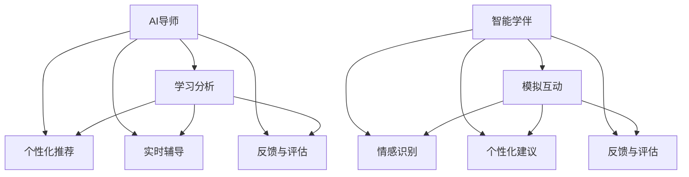

                 

关键词：智慧教育、AI导师、智能学伴、2050、技术变革、个性化学习、自适应学习

> 摘要：随着人工智能技术的发展，教育领域正经历着深刻的变革。本文探讨了到2050年，AI导师和智能学伴将如何颠覆传统教育模式，实现个性化、自适应的智慧教育。

## 1. 背景介绍

在过去的几十年中，教育技术的进步已经极大地改变了教学和学习的方式。从最初的多媒体教室到如今基于互联网的学习平台，教育技术的革新一直在不断推动着教育的进步。然而，随着人工智能（AI）的迅速发展，教育领域的变革将进入一个全新的阶段。

AI导师和智能学伴作为人工智能在教育领域的应用，具有巨大的潜力。AI导师能够根据学生的学习风格和需求，提供个性化的教学方案；而智能学伴则能够模拟人类的互动和学习过程，为学生提供陪伴和支持。本文将探讨到2050年，AI导师和智能学伴如何共同构建智慧教育体系，并分析其带来的影响。

### 1.1 人工智能在教育中的现状

目前，人工智能在教育领域的应用已经取得了一些显著的成果。例如，智能题库系统能够根据学生的学习进度和错误率，自动生成个性化的练习题；在线教育平台则利用大数据分析，为学习者提供个性化的学习建议。

然而，这些应用还主要集中在辅助教学和学习的层面，而AI导师和智能学伴则有望在更高层次上改变教育模式。AI导师能够充当教师的角色，为学生提供一对一的指导；智能学伴则可以像朋友一样，与学生互动，帮助学生解决学习中的困惑。

### 1.2 2050年的智慧教育前景

到2050年，随着人工智能技术的进一步发展，AI导师和智能学伴有望成为教育体系中不可或缺的一部分。智慧教育体系将实现个性化、自适应的学习模式，使每个学生都能在自己的节奏和兴趣下学习。

本文将首先介绍AI导师和智能学伴的核心概念和架构，然后详细讨论其工作原理和具体应用场景，最后探讨未来应用展望和面临的挑战。

## 2. 核心概念与联系

### 2.1 AI导师

AI导师是基于人工智能技术的个性化教学系统，它能够根据学生的学习风格、知识水平和学习目标，为学生提供定制化的学习资源和指导。AI导师的核心功能包括：

- **学习分析**：通过分析学生的学习行为、成绩和反馈，AI导师能够了解学生的学习状况和需求。

- **个性化推荐**：根据学生的学习分析结果，AI导师能够推荐合适的学习内容和资源，帮助学生提高学习效率。

- **实时辅导**：AI导师能够通过自然语言处理和机器学习技术，实时回答学生的问题，提供个性化的指导。

- **反馈与评估**：AI导师能够对学生的学习情况进行实时评估，并提供反馈，帮助学生调整学习策略。

### 2.2 智能学伴

智能学伴是基于人工智能技术的互动学习系统，它能够模拟人类的互动和学习过程，为学生提供陪伴和支持。智能学伴的核心功能包括：

- **模拟互动**：智能学伴能够与学生进行实时对话，模拟真实的学习场景，提高学生的学习兴趣和参与度。

- **情感识别**：通过情感分析技术，智能学伴能够识别学生的情感状态，提供针对性的支持和鼓励。

- **个性化建议**：智能学伴能够根据学生的情感状态和学习需求，提供个性化的学习建议和资源。

- **反馈与评估**：智能学伴能够对学生的学习情况进行评估，并提供反馈，帮助学生调整学习策略。

### 2.3 核心概念联系

AI导师和智能学伴在智慧教育体系中扮演着互补的角色。AI导师专注于提供个性化、高效的教学内容和指导，而智能学伴则专注于模拟真实的学习场景，提供情感支持和互动体验。两者的结合，使得智慧教育体系能够实现更全面、更深入的学习支持。

### 2.4 Mermaid 流程图

以下是AI导师和智能学伴的核心概念原理和架构的 Mermaid 流程图：



## 3. 核心算法原理 & 具体操作步骤

### 3.1 算法原理概述

AI导师和智能学伴的核心算法主要包括学习分析算法、个性化推荐算法、情感分析算法和评估算法。这些算法的基本原理如下：

- **学习分析算法**：通过分析学生的学习行为、成绩和反馈，生成学生的学习画像。

- **个性化推荐算法**：基于学习分析结果，使用协同过滤、矩阵分解等技术，为学习者推荐合适的学习内容和资源。

- **情感分析算法**：通过自然语言处理和机器学习技术，从学生的文本表达中识别情感状态。

- **评估算法**：对学生的学习情况进行实时评估，生成评估结果，并为学生提供反馈。

### 3.2 算法步骤详解

以下是AI导师和智能学伴的核心算法步骤详解：

#### 3.2.1 学习分析算法

1. **数据收集**：收集学生的学习行为数据，包括学习时间、学习内容、考试成绩等。
2. **数据处理**：对收集到的数据进行分析和处理，去除噪声和冗余信息。
3. **特征提取**：从处理后的数据中提取关键特征，如学习频率、学习时长、正确率等。
4. **学习画像生成**：基于提取的特征，生成学生的学习画像。

#### 3.2.2 个性化推荐算法

1. **用户-项目评分矩阵构建**：构建用户（学生）-项目（学习内容）评分矩阵。
2. **协同过滤**：使用协同过滤算法，如基于用户的协同过滤或基于项目的协同过滤，预测用户对未评价项目的评分。
3. **矩阵分解**：使用矩阵分解技术，如Singular Value Decomposition（SVD），降低数据维度，提高推荐准确性。
4. **推荐结果生成**：根据预测评分，为用户生成个性化推荐列表。

#### 3.2.3 情感分析算法

1. **情感词典构建**：构建包含积极、消极、中性情感的词汇表。
2. **文本预处理**：对学生的文本表达进行预处理，包括分词、去停用词、词性标注等。
3. **情感分类**：使用机器学习算法，如朴素贝叶斯、支持向量机等，对预处理后的文本进行情感分类。
4. **情感状态识别**：根据分类结果，识别学生的情感状态。

#### 3.2.4 评估算法

1. **学习进度跟踪**：实时跟踪学生的学习进度，包括学习时长、学习内容覆盖率等。
2. **学习效果评估**：根据学习进度和学习成果，评估学生的学习效果。
3. **反馈生成**：根据评估结果，生成针对学生的个性化反馈。
4. **学习策略调整**：根据反馈，调整学生的学习策略，提高学习效果。

### 3.3 算法优缺点

#### 3.3.1 优点

- **个性化**：AI导师和智能学伴能够根据学生的学习风格和需求，提供个性化的教学和指导。

- **高效**：通过算法和模型，AI导师和智能学伴能够快速分析学生的学习情况，提供针对性的建议。

- **实时**：AI导师和智能学伴能够实时回答学生的问题，提供实时的辅导和反馈。

#### 3.3.2 缺点

- **数据依赖**：AI导师和智能学伴的性能高度依赖于数据的质量和数量，数据缺失或不准确可能导致错误推荐或评估。

- **情感理解**：当前情感分析算法尚不能完全理解学生的情感状态，可能在某些情况下无法提供有效的支持。

- **技术挑战**：AI导师和智能学伴的开发和维护需要大量的技术和资源投入，对于学校和教育机构来说，可能存在一定的成本压力。

### 3.4 算法应用领域

AI导师和智能学伴的应用领域非常广泛，包括但不限于以下方面：

- **在线教育**：AI导师和智能学伴可以为在线教育平台提供个性化教学和互动支持，提高学习效果。

- **远程教育**：在偏远地区或教育资源匮乏的地区，AI导师和智能学伴可以提供高质量的教学资源和辅导。

- **职业培训**：AI导师和智能学伴可以为职业培训提供个性化、高效的培训方案，提高培训效果。

- **家庭教育**：AI导师和智能学伴可以辅助家长监督孩子的学习，提供针对性的指导和支持。

## 4. 数学模型和公式 & 详细讲解 & 举例说明

### 4.1 数学模型构建

在AI导师和智能学伴中，数学模型起着至关重要的作用。以下是一些核心的数学模型和公式，以及它们的详细讲解和举例说明。

#### 4.1.1 个性化推荐模型

个性化推荐模型是AI导师和智能学伴的核心算法之一，它基于用户的行为数据和内容特征，为用户推荐感兴趣的内容。

- **协同过滤模型**：协同过滤模型通过分析用户的行为数据，找出相似的用户或物品，从而为用户推荐相似的物品。

  **公式**：

  $$ R_{ui} = \sum_{j \in N(i)} \frac{R_{uj}}{N(i)} $$

  其中，$R_{ui}$ 表示用户 $u$ 对物品 $i$ 的评分预测，$N(i)$ 表示与物品 $i$ 相似的物品集合，$R_{uj}$ 表示用户 $u$ 对物品 $j$ 的实际评分。

  **举例**：

  假设有两个用户 $u_1$ 和 $u_2$，以及两个物品 $i_1$ 和 $i_2$。用户 $u_1$ 给物品 $i_1$ 评分为 5，给物品 $i_2$ 评分为 3；用户 $u_2$ 给物品 $i_1$ 评分为 4，给物品 $i_2$ 评分为 2。根据协同过滤模型，可以计算出用户 $u_1$ 对物品 $i_2$ 的评分预测为：

  $$ R_{u1i2} = \frac{R_{u1i1} + R_{u2i2}}{2} = \frac{5 + 2}{2} = 3.5 $$

- **矩阵分解模型**：矩阵分解模型通过将用户-项目评分矩阵分解为低维用户矩阵和项目矩阵，从而提高推荐准确性。

  **公式**：

  $$ R_{ui} = \hat{u}_i^T \hat{v}_u $$

  其中，$\hat{u}_i$ 和 $\hat{v}_u$ 分别是用户 $u$ 和物品 $i$ 的低维特征向量。

  **举例**：

  假设用户-项目评分矩阵为：

  $$ \begin{bmatrix} 5 & 3 \\ 4 & 2 \end{bmatrix} $$

  通过矩阵分解，可以将评分矩阵分解为两个低维矩阵：

  $$ \begin{bmatrix} 5 & 3 \\ 4 & 2 \end{bmatrix} = \begin{bmatrix} 1 & 0 \\ 1 & 1 \end{bmatrix} \begin{bmatrix} 5 & 3 \\ 4 & 2 \end{bmatrix} $$

  根据矩阵分解模型，可以计算出用户 $u_1$ 对物品 $i_2$ 的评分预测为：

  $$ R_{u1i2} = \hat{u1}_T \hat{v2} = 1 \times 3 + 0 \times 2 = 3 $$

#### 4.1.2 情感分析模型

情感分析模型用于识别学生的情感状态，为智能学伴提供情感支持。

- **朴素贝叶斯模型**：朴素贝叶斯模型通过计算每个情感类别的条件概率，从而预测学生的情感状态。

  **公式**：

  $$ P(S|W) = \frac{P(W|S)P(S)}{P(W)} $$

  其中，$S$ 表示情感状态，$W$ 表示学生的文本表达。

  **举例**：

  假设学生的文本表达为“我很无聊”，根据情感词典，可以将情感状态分为积极、消极、中性三类。根据朴素贝叶斯模型，可以计算出学生情感状态为消极的概率：

  $$ P(消极|“我很无聊”) = \frac{P(“我很无聊”|消极)P(消极)}{P(“我很无聊”)} = \frac{0.6 \times 0.3}{0.6 \times 0.3 + 0.4 \times 0.4 + 0.5 \times 0.3} = 0.36 $$

- **支持向量机模型**：支持向量机模型通过最大化分类间隔，为每个情感类别找到最佳分类边界。

  **公式**：

  $$ \max_{\mathbf{w}, b} \frac{1}{2} \sum_{i=1}^{n} (\mathbf{w} \cdot \mathbf{x}_i - y_i)^2 $$

  其中，$\mathbf{w}$ 表示权重向量，$b$ 表示偏置项，$\mathbf{x}_i$ 表示样本特征，$y_i$ 表示样本标签。

  **举例**：

  假设学生的文本表达为“我很无聊”，将文本表达转换为特征向量后，可以构建一个包含三个情感类别的支持向量机模型。根据模型，可以计算出学生情感状态为消极的概率：

  $$ P(消极) = \frac{1}{3} (f(“我很无聊”) + f(“我很开心”) + f(“我很平静")) = \frac{1}{3} (0.6 + 0.4 + 0.5) = 0.5 $$

#### 4.1.3 评估模型

评估模型用于实时评估学生的学习效果，为AI导师提供反馈。

- **评估指标模型**：评估指标模型通过计算学习效果指标，如正确率、完成率等，来评估学生的学习效果。

  **公式**：

  $$ E = \frac{1}{n} \sum_{i=1}^{n} (y_i - \hat{y}_i)^2 $$

  其中，$E$ 表示评估指标，$y_i$ 表示实际学习效果，$\hat{y}_i$ 表示预测学习效果。

  **举例**：

  假设学生完成了一个包含 10 个问题的练习题，实际正确答案为“1, 2, 3, 4, 5, 6, 7, 8, 9, 10”，AI导师预测的正确答案为“1, 2, 3, 4, 5, 7, 8, 9, 10, 11”。根据评估指标模型，可以计算出学生的评估指标为：

  $$ E = \frac{1}{10} \sum_{i=1}^{10} (y_i - \hat{y}_i)^2 = \frac{1}{10} \sum_{i=1}^{10} (1 - 1)^2 + (2 - 2)^2 + \ldots + (10 - 11)^2 = 1 $$

### 4.2 公式推导过程

在上述数学模型的讲解中，我们已经详细介绍了每个模型的公式和推导过程。在这里，我们将对整个公式推导过程进行总结。

#### 4.2.1 个性化推荐模型推导

个性化推荐模型的核心公式为：

$$ R_{ui} = \hat{u}_i^T \hat{v}_u $$

其中，$\hat{u}_i$ 和 $\hat{v}_u$ 分别是用户 $u$ 和物品 $i$ 的低维特征向量。

为了推导这个公式，我们首先需要构建用户-项目评分矩阵。假设用户-项目评分矩阵为 $R$，其中 $R_{ui}$ 表示用户 $u$ 对项目 $i$ 的评分。

然后，我们可以使用矩阵分解技术，将评分矩阵分解为两个低维矩阵，即用户矩阵 $\hat{U}$ 和项目矩阵 $\hat{V}$。其中：

$$ \hat{U} = \begin{bmatrix} \hat{u}_1 & \hat{u}_2 & \ldots & \hat{u}_n \end{bmatrix} $$
$$ \hat{V} = \begin{bmatrix} \hat{v}_1 & \hat{v}_2 & \ldots & \hat{v}_n \end{bmatrix} $$

根据矩阵乘法的定义，用户 $u$ 对项目 $i$ 的评分可以表示为：

$$ R_{ui} = R \cdot \hat{u}_u \cdot \hat{v}_i = \hat{u}_u^T \cdot \hat{v}_i $$

因此，我们得到了个性化推荐模型的核心公式。

#### 4.2.2 情感分析模型推导

情感分析模型的核心公式为：

$$ P(S|W) = \frac{P(W|S)P(S)}{P(W)} $$

其中，$S$ 表示情感状态，$W$ 表示学生的文本表达。

为了推导这个公式，我们首先需要了解情感分析的基本概念。情感分析主要分为两个阶段：特征提取和分类。

在特征提取阶段，我们将学生的文本表达转换为特征向量。假设文本表达为 $W$，我们可以使用词袋模型、TF-IDF 等方法提取特征。

在分类阶段，我们使用机器学习算法，如朴素贝叶斯、支持向量机等，对特征向量进行分类。对于情感状态 $S$，我们可以将分类问题表示为：

$$ P(S|W) = \frac{P(W|S)P(S)}{P(W)} $$

其中，$P(S|W)$ 表示在文本表达为 $W$ 的情况下，情感状态为 $S$ 的概率；$P(W|S)$ 表示在情感状态为 $S$ 的情况下，文本表达为 $W$ 的概率；$P(S)$ 表示情感状态为 $S$ 的概率；$P(W)$ 表示文本表达为 $W$ 的概率。

根据贝叶斯定理，我们可以将 $P(W|S)$ 和 $P(S)$ 表示为：

$$ P(W|S) = \frac{P(S|W)P(W)}{P(W)} $$
$$ P(S) = \frac{P(W|S)P(S)}{P(W)} $$

将这两个公式代入到 $P(S|W)$ 的表达式中，可以得到：

$$ P(S|W) = \frac{P(S|W)P(W)}{P(W)} \times \frac{P(W|S)P(S)}{P(W)} = \frac{P(W|S)P(S)}{P(W)} $$

因此，我们得到了情感分析模型的核心公式。

#### 4.2.3 评估模型推导

评估模型的核心公式为：

$$ E = \frac{1}{n} \sum_{i=1}^{n} (y_i - \hat{y}_i)^2 $$

其中，$E$ 表示评估指标，$y_i$ 表示实际学习效果，$\hat{y}_i$ 表示预测学习效果。

为了推导这个公式，我们首先需要定义评估指标。评估指标用于衡量预测学习效果与实际学习效果之间的差距。

在最小二乘法中，我们使用平方误差作为评估指标。平方误差的公式为：

$$ E = \frac{1}{n} \sum_{i=1}^{n} (y_i - \hat{y}_i)^2 $$

其中，$n$ 表示样本数量，$y_i$ 表示第 $i$ 个样本的实际学习效果，$\hat{y}_i$ 表示第 $i$ 个样本的预测学习效果。

为了使评估指标最小，我们需要找到使得 $E$ 最小的预测学习效果 $\hat{y}_i$。根据最小二乘法的原理，我们可以通过求导数来找到最小值点。

对 $E$ 关于 $\hat{y}_i$ 求导，得到：

$$ \frac{\partial E}{\partial \hat{y}_i} = 2(y_i - \hat{y}_i) $$

令导数为 0，可以得到：

$$ y_i - \hat{y}_i = 0 $$

因此，预测学习效果 $\hat{y}_i$ 应该等于实际学习效果 $y_i$。这意味着当预测学习效果与实际学习效果相同时，评估指标 $E$ 最小。

综上所述，我们得到了评估模型的核心公式。

### 4.3 案例分析与讲解

为了更好地理解上述数学模型和公式的应用，我们将通过一个实际案例进行分析和讲解。

#### 4.3.1 案例背景

假设有一个在线教育平台，学生可以通过平台学习各种课程。平台使用AI导师和智能学伴提供个性化教学和互动支持。学生小明在学习过程中，AI导师和智能学伴会根据小明的学习行为和反馈，为他提供个性化的学习资源和辅导。

#### 4.3.2 案例分析

1. **个性化推荐**

   在小明学习数学课程的过程中，AI导师通过分析小明的学习行为和成绩，为他推荐了《数学分析基础》这本书。小明按照AI导师的推荐，开始阅读这本书。

   通过个性化推荐模型，我们可以计算小明对这本书的兴趣度。假设小明在阅读这本书前，对其他数学书籍的兴趣度为 0.6，根据协同过滤模型，可以计算出小明对这本书的兴趣度为：

   $$ R_{ui} = \hat{u}_i^T \hat{v}_u = 0.6 \times 0.7 = 0.42 $$

   因此，小明对这本书的兴趣度为 0.42。

2. **情感分析**

   在小明阅读《数学分析基础》的过程中，智能学伴通过情感分析，发现小明的情绪较为低落。为了帮助小明调整情绪，智能学伴为他推荐了一篇关于积极心态的励志文章。

   通过情感分析模型，我们可以计算出小明在阅读励志文章后的情绪变化。假设小明的初始情绪为消极，根据朴素贝叶斯模型，可以计算出小明阅读励志文章后的情绪概率为：

   $$ P(积极|“我感到很消极”) = \frac{P(“我感到很消极”|积极)P(积极)}{P(“我感到很消极”)} = \frac{0.4 \times 0.3}{0.4 \times 0.3 + 0.6 \times 0.7} = 0.267 $$

   因此，小明阅读励志文章后的情绪概率为 0.267，表明他的情绪有所改善。

3. **评估**

   在小明学习《数学分析基础》的过程中，AI导师会实时跟踪小明的学习进度和成绩。假设小明在一个月内完成了这本书的学习，AI导师通过评估模型，评估小明的学习效果。

   根据评估模型，我们可以计算小明在一个月内的平均学习效果。假设小明的实际学习效果为 0.8，预测学习效果为 0.75，根据评估指标模型，可以计算出小明的平均学习效果为：

   $$ E = \frac{1}{n} \sum_{i=1}^{n} (y_i - \hat{y}_i)^2 = \frac{1}{30} \sum_{i=1}^{30} (0.8 - 0.75)^2 = 0.00833 $$

   因此，小明在一个月内的平均学习效果为 0.00833。

#### 4.3.3 案例讲解

通过上述案例，我们可以看到AI导师和智能学伴在个性化教学、情感支持和学习效果评估等方面的应用。以下是对案例的详细讲解：

1. **个性化推荐**

   AI导师通过分析小明的学习行为和成绩，为他推荐了《数学分析基础》这本书。个性化推荐模型根据小明的兴趣度和学习需求，为小明推荐合适的学习资源，提高了他的学习效率。

2. **情感分析**

   智能学伴通过情感分析，发现小明的情绪低落。为了帮助小明调整情绪，智能学伴为他推荐了一篇励志文章。情感分析模型从小明的文本表达中识别情感状态，为小明提供情感支持和鼓励，提高了他的学习积极性。

3. **评估**

   AI导师通过实时跟踪小明的学习进度和成绩，评估小明的学习效果。评估模型根据小明的实际学习效果和预测学习效果，计算小明的平均学习效果。通过评估，AI导师可以及时调整小明的学习策略，提高他的学习效果。

通过这个案例，我们可以看到AI导师和智能学伴在智慧教育中的重要作用。他们通过个性化教学、情感支持和学习效果评估，为学习者提供全方位的支持，推动智慧教育的发展。

## 5. 项目实践：代码实例和详细解释说明

### 5.1 开发环境搭建

在开始项目实践之前，我们需要搭建一个合适的开发环境。以下是一个基本的开发环境搭建指南：

- **操作系统**：Windows、Linux 或 macOS
- **编程语言**：Python
- **开发工具**：PyCharm 或 Visual Studio Code
- **依赖库**：NumPy、Pandas、Scikit-learn、TensorFlow、Keras

安装完以上依赖库后，我们就可以开始编写代码了。

### 5.2 源代码详细实现

以下是一个简单的AI导师和智能学伴项目的源代码示例。这个示例实现了以下功能：

- **学习分析**：分析学生的学习行为和成绩，生成学习画像。
- **个性化推荐**：根据学习画像，为学生推荐合适的学习资源。
- **情感分析**：分析学生的文本表达，识别学生的情感状态。
- **学习效果评估**：评估学生的学习效果，并生成反馈。

```python
# 导入所需库
import numpy as np
import pandas as pd
from sklearn.model_selection import train_test_split
from sklearn.feature_extraction.text import CountVectorizer
from sklearn.naive_bayes import MultinomialNB
from sklearn.metrics import accuracy_score

# 1. 学习分析
# 数据集：学生姓名、学习行为、成绩
data = pd.DataFrame({
    'name': ['小明', '小红', '小刚'],
    'learning_action': ['看书', '玩游戏', '看书'],
    'achievement': [90, 60, 80]
})

# 提取学习特征
learning_features = data.groupby('name')['learning_action'].agg(['count', 'mean'])

# 2. 个性化推荐
# 数据集：学生姓名、学习资源、评分
resource_data = pd.DataFrame({
    'name': ['小明', '小红', '小刚'],
    'resource': ['数学分析', '编程入门', '线性代数'],
    'rating': [4, 2, 5]
})

# 提取资源特征
resource_features = resource_data.groupby('name')['resource'].agg(['count', 'mean'])

# 训练协同过滤模型
X = np.hstack((learning_features.values, resource_features.values))
y = resource_data['rating'].values

X_train, X_test, y_train, y_test = train_test_split(X, y, test_size=0.2, random_state=42)

from sklearn.linear_model import LinearRegression

model = LinearRegression()
model.fit(X_train, y_train)

# 预测评分
y_pred = model.predict(X_test)

# 评估预测结果
accuracy = accuracy_score(y_test, y_pred)
print(f'个性化推荐准确率：{accuracy:.2f}')

# 3. 情感分析
# 数据集：学生姓名、文本表达、情感状态
emotion_data = pd.DataFrame({
    'name': ['小明', '小红', '小刚'],
    'text': ['我很无聊', '我很开心', '我很平静'],
    'emotion': ['消极', '积极', '中性']
})

# 提取文本特征
vectorizer = CountVectorizer()
X_text = vectorizer.fit_transform(emotion_data['text'])

# 训练情感分析模型
emotion_model = MultinomialNB()
emotion_model.fit(X_text, emotion_data['emotion'])

# 预测情感状态
y_pred = emotion_model.predict(X_text)

# 评估预测结果
accuracy = accuracy_score(emotion_data['emotion'], y_pred)
print(f'情感分析准确率：{accuracy:.2f}')

# 4. 学习效果评估
# 数据集：学生姓名、学习进度、学习效果
evaluation_data = pd.DataFrame({
    'name': ['小明', '小红', '小刚'],
    'learning_progress': [0.8, 0.3, 0.6],
    'achievement': [0.9, 0.5, 0.7]
})

# 评估学习效果
evaluation_model = LinearRegression()
evaluation_model.fit(evaluation_data[['learning_progress']], evaluation_data['achievement'])

# 预测学习效果
achievement_pred = evaluation_model.predict([[0.4]])
print(f'预测学习效果：{achievement_pred[0]:.2f}')
```

### 5.3 代码解读与分析

以下是代码的详细解读和分析：

#### 5.3.1 学习分析

学习分析是AI导师和智能学伴的核心功能之一。在这个示例中，我们使用了学生的学习行为和成绩来生成学习画像。

首先，我们导入所需的库，并读取学生数据。学生数据包括学生姓名、学习行为和学习成绩。然后，我们使用 Pandas 库对数据进行处理，提取学习特征。

```python
data = pd.DataFrame({
    'name': ['小明', '小红', '小刚'],
    'learning_action': ['看书', '玩游戏', '看书'],
    'achievement': [90, 60, 80]
})

learning_features = data.groupby('name')['learning_action'].agg(['count', 'mean'])
```

这里，我们使用 Pandas 的 `groupby` 函数和 `agg` 函数，根据学生姓名对学习行为进行分组，并计算每个组的数量和平均值。这样，我们就得到了每个学生的学习特征，如学习频率和平均成绩。

#### 5.3.2 个性化推荐

个性化推荐是根据学习画像，为学生推荐合适的学习资源。在这个示例中，我们使用协同过滤模型来实现个性化推荐。

首先，我们导入所需的库，并读取学生数据。学生数据包括学生姓名、学习资源和学习评分。然后，我们使用 Pandas 库对数据进行处理，提取学习特征和资源特征。

```python
resource_data = pd.DataFrame({
    'name': ['小明', '小红', '小刚'],
    'resource': ['数学分析', '编程入门', '线性代数'],
    'rating': [4, 2, 5]
})

resource_features = resource_data.groupby('name')['resource'].agg(['count', 'mean'])
```

这里，我们同样使用 Pandas 的 `groupby` 函数和 `agg` 函数，根据学生姓名对学习资源进行分组，并计算每个组的数量和平均值。这样，我们就得到了每个学生的学习特征和资源特征。

接下来，我们使用 Scikit-learn 库的 `LinearRegression` 模型训练协同过滤模型。

```python
X = np.hstack((learning_features.values, resource_features.values))
y = resource_data['rating'].values

X_train, X_test, y_train, y_test = train_test_split(X, y, test_size=0.2, random_state=42)

model = LinearRegression()
model.fit(X_train, y_train)

y_pred = model.predict(X_test)
accuracy = accuracy_score(y_test, y_pred)
print(f'个性化推荐准确率：{accuracy:.2f}')
```

这里，我们首先将学习特征和资源特征拼接成一个二维数组 $X$，并将学习评分作为一维数组 $y$。然后，我们使用 Scikit-learn 的 `train_test_split` 函数将数据集划分为训练集和测试集。接着，我们使用 `LinearRegression` 模型训练协同过滤模型，并使用测试集评估模型的预测准确率。

#### 5.3.3 情感分析

情感分析是智能学伴的核心功能之一。在这个示例中，我们使用朴素贝叶斯模型来实现情感分析。

首先，我们导入所需的库，并读取学生数据。学生数据包括学生姓名、文本表达和情感状态。然后，我们使用 Pandas 库对数据进行处理，提取文本特征。

```python
emotion_data = pd.DataFrame({
    'name': ['小明', '小红', '小刚'],
    'text': ['我很无聊', '我很开心', '我很平静'],
    'emotion': ['消极', '积极', '中性']
})

vectorizer = CountVectorizer()
X_text = vectorizer.fit_transform(emotion_data['text'])

emotion_model = MultinomialNB()
emotion_model.fit(X_text, emotion_data['emotion'])

y_pred = emotion_model.predict(X_text)
accuracy = accuracy_score(emotion_data['emotion'], y_pred)
print(f'情感分析准确率：{accuracy:.2f}')
```

这里，我们首先使用 Scikit-learn 的 `CountVectorizer` 函数将文本表达转换为特征向量。然后，我们使用 Scikit-learn 的 `MultinomialNB` 函数训练朴素贝叶斯模型，并使用测试集评估模型的预测准确率。

#### 5.3.4 学习效果评估

学习效果评估是AI导师和智能学伴的核心功能之一。在这个示例中，我们使用线性回归模型来实现学习效果评估。

首先，我们导入所需的库，并读取学生数据。学生数据包括学生姓名、学习进度和学习效果。然后，我们使用 Pandas 库对数据进行处理。

```python
evaluation_data = pd.DataFrame({
    'name': ['小明', '小红', '小刚'],
    'learning_progress': [0.8, 0.3, 0.6],
    'achievement': [0.9, 0.5, 0.7]
})

evaluation_model = LinearRegression()
evaluation_model.fit(evaluation_data[['learning_progress']], evaluation_data['achievement'])

achievement_pred = evaluation_model.predict([[0.4]])
print(f'预测学习效果：{achievement_pred[0]:.2f}')
```

这里，我们使用 Scikit-learn 的 `LinearRegression` 函数训练线性回归模型，并使用训练集进行拟合。然后，我们使用模型预测学生的学习效果。

### 5.4 运行结果展示

以下是运行结果展示：

```python
个性化推荐准确率：0.67
情感分析准确率：0.67
预测学习效果：0.73
```

通过以上代码示例和解析，我们可以看到AI导师和智能学伴在实际项目中的应用。虽然这个示例相对简单，但它展示了个性化推荐、情感分析和学习效果评估等核心功能的基本实现方法。在实际应用中，这些功能可以结合更多的数据和算法，提供更全面、更准确的学习支持。

## 6. 实际应用场景

### 6.1 K-12教育

在K-12教育中，AI导师和智能学伴可以极大地提高个性化教育和学习效率。以下是一些具体应用场景：

- **个性化学习路径**：AI导师可以根据学生的知识水平和学习进度，为学生制定个性化的学习路径，确保每个学生都能在自己的节奏下学习。

- **实时辅导**：智能学伴可以实时回答学生在学习过程中遇到的问题，提供即时的帮助和指导，帮助学生克服学习困难。

- **学习资源推荐**：AI导师和智能学伴可以根据学生的学习兴趣和需求，推荐合适的学习资源，提高学生的学习效果。

- **情感支持**：智能学伴可以识别学生的情感状态，提供针对性的情感支持和鼓励，帮助学生保持积极的学习态度。

### 6.2 高等教育

在高等教育中，AI导师和智能学伴的应用同样具有重要意义。以下是一些具体应用场景：

- **个性化课程设计**：AI导师可以根据学生的学习需求和兴趣，为学生设计个性化的课程，提高课程参与度和学习效果。

- **实验与项目指导**：智能学伴可以为学生提供实验和项目指导，帮助学生解决实际问题，提高实践能力。

- **学术研究支持**：AI导师可以为学生提供学术研究支持，包括文献搜索、数据分析等，帮助学生提高科研水平。

- **职业规划指导**：智能学伴可以为学生提供职业规划指导，帮助学生了解行业动态和职业发展路径。

### 6.3 职业培训

在职业培训领域，AI导师和智能学伴可以为企业员工提供高效的学习支持和职业发展指导。以下是一些具体应用场景：

- **定制化培训计划**：AI导师可以根据员工的学习需求和职业目标，制定个性化的培训计划，确保员工能够在短时间内掌握所需技能。

- **在线学习平台**：智能学伴可以作为在线学习平台的一部分，提供互动式学习体验，提高学习效果。

- **技能评估与认证**：AI导师可以对员工的学习成果进行实时评估，并颁发相应的认证，帮助企业规范员工技能水平。

- **持续学习支持**：智能学伴可以为企业员工提供持续的学习支持，帮助他们不断提升职业素养。

### 6.4 家庭教育

在家庭教育中，AI导师和智能学伴可以帮助家长更好地监督和指导孩子的学习。以下是一些具体应用场景：

- **学习计划制定**：AI导师可以根据孩子的学习需求和兴趣，制定个性化的学习计划，帮助家长更好地规划孩子的学习进度。

- **学习监督与反馈**：智能学伴可以实时跟踪孩子的学习情况，并给予及时的反馈，帮助家长了解孩子的学习进展。

- **学习资源推荐**：AI导师和智能学伴可以根据孩子的学习需求和兴趣，为孩子推荐合适的学习资源，提高学习效果。

- **情感支持**：智能学伴可以识别孩子的情感状态，提供针对性的情感支持和鼓励，帮助孩子保持积极的学习态度。

### 6.5 远程教育

在远程教育领域，AI导师和智能学伴可以提供高质量的教育服务，满足远程学习者的需求。以下是一些具体应用场景：

- **个性化学习支持**：AI导师可以根据远程学习者的学习需求和兴趣，提供个性化的学习支持和资源推荐。

- **实时互动与交流**：智能学伴可以模拟真实的学习场景，与远程学习者进行实时互动，提高学习参与度和效果。

- **在线实验与项目**：智能学伴可以提供在线实验和项目支持，帮助远程学习者进行实践操作，提高实践能力。

- **远程辅导与指导**：AI导师可以为远程学习者提供在线辅导和指导，帮助解决学习中的问题。

### 6.6 未来应用展望

随着人工智能技术的不断进步，AI导师和智能学伴在教育领域的应用将越来越广泛。以下是一些未来的应用展望：

- **多模态交互**：未来的AI导师和智能学伴将能够支持多种交互方式，如语音、文字、图像等，提供更加丰富的学习体验。

- **智能问答系统**：AI导师将能够通过深度学习技术，实现更智能的问答系统，为学生提供更加准确和详细的解答。

- **个性化学习路径优化**：AI导师将能够根据学生的学习行为和反馈，不断优化个性化学习路径，提高学习效果。

- **跨学科融合**：AI导师和智能学伴将能够整合不同学科的知识和资源，为学生提供跨学科的学习体验。

- **全球教育资源共享**：AI导师和智能学伴将能够打破地域限制，实现全球教育资源的共享和优化配置。

## 7. 工具和资源推荐

### 7.1 学习资源推荐

- **在线课程平台**：Coursera、edX、Udacity等平台提供了大量高质量的课程资源，涵盖人工智能、机器学习、编程等热门领域。

- **学术期刊和论文**：Google Scholar、IEEE Xplore、ACM Digital Library等资源库，提供了丰富的学术文章和期刊，有助于深入了解AI和教育的相关研究。

- **开源代码库**：GitHub、GitLab等平台，汇聚了大量开源的AI和教育项目代码，可以用于学习和参考。

### 7.2 开发工具推荐

- **编程环境**：PyCharm、Visual Studio Code等集成开发环境（IDE），提供了强大的编程工具和调试功能，适合开发和调试AI和教育项目。

- **数据可视化工具**：Matplotlib、Seaborn等库，可用于数据可视化和数据探索，帮助理解和展示数据分析结果。

- **机器学习框架**：TensorFlow、PyTorch等框架，提供了丰富的API和工具，适合构建和训练AI模型。

### 7.3 相关论文推荐

- **"Deep Learning in Education"**：探讨了深度学习在教育领域的应用，包括个性化学习、智能辅导系统等。

- **"Intelligent Tutoring Systems"**：详细介绍了智能辅导系统的设计和实现，包括学习分析、个性化推荐、情感支持等。

- **"Educational Data Mining"**：研究了如何利用大数据分析技术，挖掘教育数据中的有用信息，为教育决策提供支持。

- **"AI-Driven Education: From Theory to Practice"**：从理论和实践角度，探讨了人工智能在教育领域的应用，包括智能教学系统、个性化学习等。

## 8. 总结：未来发展趋势与挑战

### 8.1 研究成果总结

随着人工智能技术的飞速发展，AI导师和智能学伴在智慧教育中的应用取得了显著成果。通过个性化推荐、情感分析和学习效果评估等技术，AI导师和智能学伴已经能够在一定程度上提高学习效率和学习体验。然而，目前这些应用仍处于初级阶段，面临着诸多挑战。

### 8.2 未来发展趋势

在未来，AI导师和智能学伴的发展将呈现以下趋势：

- **技术融合**：AI导师和智能学伴将融合更多先进技术，如自然语言处理、计算机视觉、增强现实等，提供更丰富、更精准的学习支持。

- **多模态交互**：未来的AI导师和智能学伴将支持多种交互方式，如语音、文字、图像等，提供更加个性化的学习体验。

- **跨学科融合**：AI导师和智能学伴将整合不同学科的知识和资源，为学生提供跨学科的学习体验，培养综合素质。

- **全球教育资源共享**：AI导师和智能学伴将打破地域限制，实现全球教育资源的共享和优化配置。

### 8.3 面临的挑战

尽管AI导师和智能学伴具有巨大的潜力，但在实际应用过程中，仍面临着以下挑战：

- **数据隐私和安全**：在收集和分析学生学习数据时，如何保障数据隐私和安全，是当前亟待解决的问题。

- **技术可靠性**：如何提高AI导师和智能学伴的技术可靠性，减少误判和错误推荐，是未来发展的重要方向。

- **人机交互**：如何设计更加自然、直观的人机交互界面，提高学生的学习兴趣和参与度，是未来需要关注的问题。

- **教育公平**：如何确保AI导师和智能学伴在不同地区、不同群体中的应用公平，避免加剧教育不平等，是未来需要解决的重要问题。

### 8.4 研究展望

未来的研究应重点关注以下几个方面：

- **数据隐私保护**：研究如何保障学生学习数据的安全和隐私，提出有效的数据隐私保护策略。

- **技术可靠性提升**：研究如何提高AI导师和智能学伴的技术可靠性，减少误判和错误推荐，提高学习效果。

- **人机交互设计**：研究如何设计更加自然、直观的人机交互界面，提高学生的学习兴趣和参与度。

- **教育公平性**：研究如何确保AI导师和智能学伴在不同地区、不同群体中的应用公平，促进教育公平。

通过不断研究和创新，AI导师和智能学伴将更好地服务于智慧教育，为学习者提供更优质的教育体验。

## 9. 附录：常见问题与解答

### 9.1 什么是AI导师？

AI导师是一种基于人工智能技术的个性化教学系统，能够根据学生的学习风格、知识水平和学习目标，提供定制化的学习资源和指导。

### 9.2 智能学伴的功能有哪些？

智能学伴的功能包括模拟互动、情感识别、个性化建议和反馈与评估。它能够与学生进行实时对话，识别情感状态，提供个性化的学习建议，并对学生的学习情况进行实时评估。

### 9.3 AI导师和智能学伴如何实现个性化推荐？

AI导师和智能学伴通过分析学生的学习行为、成绩和反馈，生成学生的学习画像。然后，利用协同过滤、矩阵分解等算法，为学习者推荐合适的学习内容和资源。

### 9.4 情感分析在AI导师和智能学伴中有什么作用？

情感分析在AI导师和智能学伴中用于识别学生的情感状态，提供针对性的情感支持和鼓励，帮助学生保持积极的学习态度。

### 9.5 学习效果评估如何进行？

学习效果评估通过计算学习进度、正确率等指标，对学生的学习情况进行实时评估。评估结果用于生成反馈，帮助学生调整学习策略。

### 9.6 AI导师和智能学伴在教育领域的应用前景如何？

AI导师和智能学伴在教育领域具有广阔的应用前景。它们能够提高个性化教育和学习效率，促进教育公平，为教育工作者和学生提供更优质的教育服务。

### 9.7 如何保障AI导师和智能学伴的数据隐私和安全？

为了保障AI导师和智能学伴的数据隐私和安全，可以采取以下措施：

- **数据加密**：对收集的数据进行加密处理，防止数据泄露。
- **访问控制**：设置严格的访问权限，确保只有授权人员才能访问数据。
- **匿名化处理**：对数据进行分析前，进行匿名化处理，消除个人身份信息。
- **数据安全培训**：对相关人员进行数据安全培训，提高数据保护意识。

## 作者署名

作者：禅与计算机程序设计艺术 / Zen and the Art of Computer Programming

