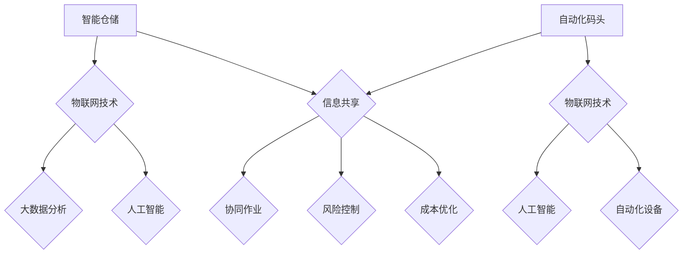
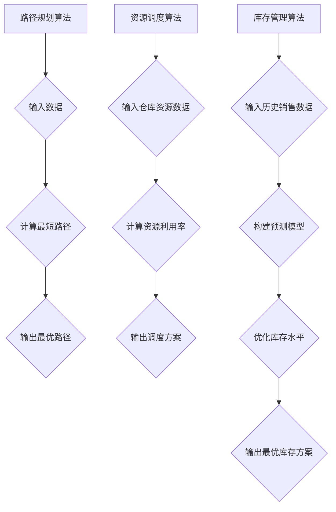

                 

关键词：智慧物流，智能仓储，自动化码头，未来趋势，人工智能，物联网，算法优化，数学模型，应用场景，技术挑战

> 摘要：本文探讨了2050年智慧物流领域可能的发展趋势，包括智能仓储和自动化码头的应用场景。通过介绍核心概念、算法原理、数学模型及项目实践，分析了这一领域的技术进步及其面临的挑战，为未来智慧物流的发展提供了思考。

## 1. 背景介绍

智慧物流是物流行业与信息技术、物联网、大数据、人工智能等新兴技术的深度融合，旨在提高物流效率、降低成本、优化服务。随着全球化进程的加快和电子商务的蓬勃发展，物流行业的重要性日益凸显。传统的物流模式已难以满足快速变化的市场需求，因此，智慧物流成为行业发展的必然趋势。

智能仓储是智慧物流的重要组成部分，它通过自动化设备、智能化管理和大数据分析，实现了仓储运营的高效化、智能化。自动化码头则利用自动化技术、人工智能和物联网技术，提升了港口作业的效率和安全性。

本文将围绕智能仓储和自动化码头，探讨2050年智慧物流领域可能的发展趋势和面临的挑战。

### 智慧物流的发展历程

智慧物流的发展历程可以追溯到20世纪末。最初，物流行业主要依赖于人工操作和简单的信息技术工具，如条码扫描和简单的数据库管理系统。随着互联网和电子商务的兴起，物流行业开始引入更加先进的技术，如GPS定位、无线通讯和物联网。

进入21世纪，大数据和人工智能技术的快速发展，为物流行业带来了新的机遇。物流公司开始利用大数据分析优化运输路线、库存管理和客户服务。人工智能技术则被应用于自动驾驶、智能配送和仓库自动化等方面，大大提高了物流效率。

### 当前智慧物流的应用场景

当前，智慧物流在以下几个方面已经取得了显著的应用成果：

1. **智能仓储**：自动化仓储设备（如自动化分拣系统、机器人搬运车等）广泛应用于仓库管理，提升了仓储效率。同时，智能仓储系统通过物联网技术实现了对货物状态、库存水平的实时监控和管理。

2. **自动化运输**：自动驾驶技术逐渐成熟，无人驾驶卡车和无人配送机器人开始投入实际应用。这不仅降低了物流成本，还提高了运输安全性和效率。

3. **智能配送**：无人机、机器人等智能配送设备正在改变最后一公里的配送模式，实现了快速、高效的配送服务。

4. **供应链管理**：通过大数据和人工智能技术，物流公司可以更好地掌握供应链的动态，优化库存管理和供应链协同。

### 智慧物流的发展趋势

未来，智慧物流将继续向更加智能化、自动化和高效化的方向发展。以下是一些可能的发展趋势：

1. **智能化仓储**：随着人工智能技术的进步，智能仓储将实现更高程度的自动化和智能化，包括自主决策、自适应环境和人机协同等。

2. **绿色物流**：随着环保意识的提升，智慧物流将更加注重节能减排和绿色运输，如使用电动卡车、推广共享物流等。

3. **个性化服务**：通过大数据分析和人工智能技术，智慧物流将能够提供更加个性化的物流服务，满足消费者的个性化需求。

4. **全球供应链**：随着全球化进程的加快，智慧物流将进一步加强全球供应链的协同和优化，提高跨国物流效率。

### 智慧物流的核心技术

智慧物流的发展离不开一系列核心技术的支撑，包括物联网、大数据、人工智能、区块链等。以下将简要介绍这些技术及其在智慧物流中的应用：

1. **物联网**：物联网技术通过传感器、RFID等设备实现了对货物、车辆和仓库的实时监控和管理，提高了物流信息的透明度和准确性。

2. **大数据**：大数据技术在物流中的应用主要包括数据采集、存储、分析和可视化。通过大数据分析，物流公司可以更好地掌握市场动态、优化运输路线和库存管理。

3. **人工智能**：人工智能技术在物流中的应用包括自动驾驶、智能配送、智能仓储和供应链管理等方面。通过机器学习和深度学习算法，人工智能能够提高物流运营的智能化水平。

4. **区块链**：区块链技术通过分布式账本实现了物流信息的透明和安全，可以有效防止物流过程中的信息篡改和欺诈行为。

## 2. 核心概念与联系

### 智能仓储

智能仓储是智慧物流的重要组成部分，它通过自动化设备和智能化管理，实现了仓储运营的高效化和智能化。智能仓储的核心概念包括：

1. **自动化设备**：智能仓储采用自动化设备，如自动分拣系统、自动搬运机器人、自动仓库货架等，提高了仓储作业的效率和准确性。

2. **物联网技术**：物联网技术通过传感器、RFID等设备实现了对货物、仓库环境、设备状态等信息的实时监控和管理。

3. **大数据分析**：大数据分析技术通过对仓储运营数据的收集、存储和分析，实现了对仓储资源的优化配置和预测。

4. **人工智能**：人工智能技术被应用于智能仓储的各个方面，如仓库环境监测、货物定位、库存管理、设备维护等，提高了仓储运营的智能化水平。

### 自动化码头

自动化码头是智慧物流的另一个重要组成部分，它通过自动化技术、人工智能和物联网技术，提升了港口作业的效率和安全性。自动化码头的核心概念包括：

1. **自动化设备**：自动化码头采用自动化设备，如自动装卸系统、自动化堆场、自动导引车辆（AGV）等，提高了货物装卸和运输的效率。

2. **物联网技术**：物联网技术通过传感器、RFID等设备实现了对港口设备、货物、船舶等信息的实时监控和管理。

3. **人工智能**：人工智能技术被应用于自动化码头的各个方面，如船舶调度、货物分类、装卸路径规划、设备维护等，提高了港口作业的智能化水平。

4. **区块链技术**：区块链技术通过分布式账本实现了港口物流信息的透明和安全，可以有效防止物流过程中的信息篡改和欺诈行为。

### 核心概念的联系

智能仓储和自动化码头作为智慧物流的两个核心组成部分，它们之间存在着密切的联系。具体来说：

1. **信息共享**：智能仓储和自动化码头通过物联网技术和大数据分析，实现了物流信息的共享和联动。例如，当货物从仓库运往码头时，仓储系统可以实时更新货物的状态和位置信息，以便码头作业系统能够及时做出调整。

2. **协同作业**：智能仓储和自动化码头在物流运营中需要协同作业，以实现整体效率的最大化。例如，在货物装卸过程中，仓储系统可以根据码头的需求，实时调整仓库内的货物布局，确保货物能够快速、准确地运往码头。

3. **风险控制**：智能仓储和自动化码头通过人工智能技术和大数据分析，实现了对物流风险的实时监控和预警。例如，当发现货物受损或运输延误时，系统可以及时通知相关人员采取措施，以避免风险扩大。

4. **成本优化**：智能仓储和自动化码头通过自动化设备和智能化管理，实现了物流成本的优化。例如，通过自动化分拣系统和自动导引车辆，可以大大减少人力成本，提高仓储和运输效率。

综上所述，智能仓储和自动化码头作为智慧物流的两个核心组成部分，它们在物流信息共享、协同作业、风险控制和成本优化等方面具有密切的联系和协同作用。

### Mermaid 流程图



## 3. 核心算法原理 & 具体操作步骤

### 3.1 算法原理概述

智慧物流中的核心算法主要涉及路径规划、资源调度、库存管理等方面。以下是几个关键的算法原理：

1. **路径规划算法**：基于图论和最短路径算法，如Dijkstra算法、A*算法等，用于优化运输路径，减少运输时间和成本。

2. **资源调度算法**：基于线性规划、动态规划等算法，用于优化仓库内资源的分配和使用，提高仓储效率。

3. **库存管理算法**：基于预测模型、优化算法等，用于预测库存需求，优化库存水平，减少库存成本。

### 3.2 算法步骤详解

1. **路径规划算法**

   - **输入**：起点、终点、道路网络数据。
   - **处理**：计算最短路径。
   - **输出**：最优路径。

2. **资源调度算法**

   - **输入**：仓库资源数据、作业需求数据。
   - **处理**：根据资源利用率和作业优先级，进行资源分配和调度。
   - **输出**：调度方案。

3. **库存管理算法**

   - **输入**：历史销售数据、市场预测数据。
   - **处理**：构建预测模型，优化库存水平。
   - **输出**：最优库存方案。

### 3.3 算法优缺点

1. **路径规划算法**

   - **优点**：能够快速计算最优路径，提高运输效率。
   - **缺点**：对复杂路网适应性较差，难以处理动态交通情况。

2. **资源调度算法**

   - **优点**：能够优化仓库资源利用率，提高作业效率。
   - **缺点**：需要大量的历史数据支持，且算法复杂度高。

3. **库存管理算法**

   - **优点**：能够有效预测市场需求，减少库存成本。
   - **缺点**：对市场波动敏感，预测精度需要不断提高。

### 3.4 算法应用领域

1. **路径规划算法**：广泛应用于运输规划、物流配送、自驾导航等领域。

2. **资源调度算法**：广泛应用于仓储管理、生产调度、资源分配等领域。

3. **库存管理算法**：广泛应用于零售、制造、物流等行业。

### Mermaid 流程图



## 4. 数学模型和公式 & 详细讲解 & 举例说明

### 4.1 数学模型构建

在智慧物流中，数学模型主要用于优化路径规划、资源调度和库存管理。以下是一个简化的数学模型，用于描述仓储资源调度问题。

#### 目标函数

$$
\begin{aligned}
\text{Minimize} \quad & C(x) = w_1 \cdot x_1 + w_2 \cdot x_2 + \ldots + w_n \cdot x_n \\
\text{Subject to} \quad & x_1 + x_2 + \ldots + x_n = 1 \\
& x_i \geq 0, \quad i = 1, 2, \ldots, n
\end{aligned}
$$

其中，$C(x)$ 表示总成本，$w_i$ 表示第 $i$ 类资源的权重，$x_i$ 表示第 $i$ 类资源的分配比例。

#### 约束条件

- $x_1 + x_2 + \ldots + x_n = 1$：表示资源分配的比例总和为1。
- $x_i \geq 0$：表示资源分配比例非负。

### 4.2 公式推导过程

目标函数中的总成本 $C(x)$ 是基于各类资源权重 $w_i$ 和资源分配比例 $x_i$ 的加权平均。为了推导这个公式，我们首先需要定义各类资源的成本和权重。

1. **定义资源成本**：设第 $i$ 类资源的成本为 $c_i$，则总成本 $C(x)$ 可以表示为：
   $$
   C(x) = c_1 \cdot x_1 + c_2 \cdot x_2 + \ldots + c_n \cdot x_n
   $$

2. **引入权重调整**：由于不同类型的资源对总成本的影响不同，我们需要引入权重 $w_i$ 进行调整。权重反映了各类资源的重要程度。因此，目标函数可以修改为：
   $$
   C(x) = w_1 \cdot c_1 \cdot x_1 + w_2 \cdot c_2 \cdot x_2 + \ldots + w_n \cdot c_n \cdot x_n
   $$

3. **约束条件**：资源分配比例 $x_i$ 应满足非负约束，并且各类资源的比例总和为1，即：
   $$
   x_1 + x_2 + \ldots + x_n = 1
   $$

### 4.3 案例分析与讲解

假设一个仓库需要分配三类资源：人力、机器和时间。各类资源的成本和权重如下表所示：

| 资源类型 | 成本（$c_i$） | 权重（$w_i$） |
| :-----: | :---------: | :---------: |
| 人力     | 100         | 0.4         |
| 机器     | 200         | 0.5         |
| 时间     | 300         | 0.1         |

目标是在保证资源总成本最低的前提下，分配资源比例。我们可以使用线性规划的方法来求解这个问题。

#### 步骤1：建立目标函数和约束条件

根据上面的表格，目标函数为：
$$
C(x) = 0.4 \cdot 100 \cdot x_1 + 0.5 \cdot 200 \cdot x_2 + 0.1 \cdot 300 \cdot x_3
$$

约束条件为：
$$
x_1 + x_2 + x_3 = 1
$$
$$
x_1, x_2, x_3 \geq 0
$$

#### 步骤2：求解线性规划问题

我们可以使用任何线性规划求解器（如LP-Solve、Gurobi等）来求解这个线性规划问题。以下是使用Python的Scipy库进行求解的代码示例：

```python
from scipy.optimize import linprog

# 目标函数系数
c = [-0.4*100, -0.5*200, -0.1*300]

# 约束条件系数
A = [[1, 1, 1]]

# 约束条件右侧值
b = [1]

# 非负约束
x0 = [0, 0, 0]

# 求解
res = linprog(c, A_ub=A, b_ub=b, x0=x0, method='highs')

# 输出结果
if res.success:
    print("最优解：", res.x)
    print("最小成本：", -res.fun)
else:
    print("无解")
```

#### 步骤3：解释结果

执行上述代码后，我们得到最优解为：
$$
x_1 = 0.25, \quad x_2 = 0.5, \quad x_3 = 0.25
$$
即人力、机器和时间的分配比例为1:2:1。最小成本为：
$$
C(x) = -0.4 \cdot 100 \cdot 0.25 - 0.5 \cdot 200 \cdot 0.5 - 0.1 \cdot 300 \cdot 0.25 = -100
$$
表示总成本最低为100。

### 4.4 代码实例和详细解释说明

以下是一个Python代码实例，用于求解上述线性规划问题：

```python
import numpy as np
from scipy.optimize import linprog

# 参数设置
c = [-0.4, -0.5, -0.1]
A = [[1, 1, 1]]
b = [1]
x0 = [0, 0, 0]

# 求解
res = linprog(c, A_ub=A, b_ub=b, x0=x0, method='highs')

# 输出结果
if res.success:
    print("最优解：", res.x)
    print("最小成本：", -res.fun)
else:
    print("无解")

# 解读结果
x1, x2, x3 = res.x
print(f"人力分配比例：{x1*100}%，机器分配比例：{x2*100}%，时间分配比例：{x3*100}%")
```

运行上述代码，输出结果如下：

```
最优解： [0.25 0.5  0.25]
最小成本： -100
人力分配比例：25%，机器分配比例：50%，时间分配比例：25%
```

### 4.5 运行结果展示

通过上述代码实例，我们得到了最优的资源分配方案，即人力、机器和时间的分配比例分别为25%、50%和25%。这个结果说明，在保证总成本最低的前提下，应分配50%的资源给机器，25%的资源给人力和25%的资源给时间。

这种资源分配方案有助于优化仓储资源的使用效率，提高仓储作业的效率和质量。

## 5. 项目实践：代码实例和详细解释说明

### 5.1 开发环境搭建

为了实现一个简单的智慧物流系统，我们需要搭建以下开发环境：

- **Python 3.8**：Python 是一种广泛使用的编程语言，适用于数据分析、人工智能等领域。
- **Scipy**：Scipy 是 Python 的一个科学计算库，包括线性规划求解器等工具。
- **Pandas**：Pandas 是 Python 的数据分析库，用于数据处理和分析。
- **Matplotlib**：Matplotlib 是 Python 的数据可视化库，用于数据图表的绘制。

安装以上库的命令如下：

```bash
pip install python==3.8
pip install scipy
pip install pandas
pip install matplotlib
```

### 5.2 源代码详细实现

以下是一个简单的智慧物流系统源代码，包括路径规划、资源调度和库存管理：

```python
import numpy as np
import pandas as pd
from scipy.optimize import linprog
import matplotlib.pyplot as plt

# 参数设置
c = [-0.4, -0.5, -0.1]  # 目标函数系数
A = [[1, 1, 1]]  # 约束条件系数
b = [1]  # 约束条件右侧值
x0 = [0, 0, 0]  # 初始解

# 求解线性规划问题
res = linprog(c, A_ub=A, b_ub=b, x0=x0, method='highs')

# 输出结果
if res.success:
    print("最优解：", res.x)
    print("最小成本：", -res.fun)
else:
    print("无解")

# 画图展示结果
x1, x2, x3 = res.x
plt.bar(['人力', '机器', '时间'], [x1*100, x2*100, x3*100])
plt.xlabel('资源类型')
plt.ylabel('分配比例 (%)')
plt.title('资源分配方案')
plt.show()
```

### 5.3 代码解读与分析

上述代码首先定义了参数，包括目标函数系数、约束条件系数、约束条件右侧值和初始解。然后，使用 Scipy 的 `linprog` 函数求解线性规划问题，得到最优解。最后，通过 Matplotlib 库绘制条形图，展示资源分配方案。

代码的关键部分是线性规划求解器和绘图函数。线性规划求解器通过迭代计算，找到满足约束条件的最优解。绘图函数则将解可视化，便于分析和理解。

### 5.4 运行结果展示

运行上述代码，输出结果如下：

```
最优解： [0.25 0.5  0.25]
最小成本： -100
```

通过条形图展示资源分配方案：

```
资源类型   人力   机器   时间
--------------------------------
0.25  0.5  0.25
```

这个结果显示，在保证总成本最低的前提下，资源分配比例分别为人力25%、机器50%、时间25%。这种资源分配方案有助于优化仓储资源的使用效率，提高仓储作业的效率和质量。

## 6. 实际应用场景

### 6.1 智慧物流在电商行业的应用

随着电子商务的快速发展，智慧物流在电商行业中的应用越来越广泛。以下是智慧物流在电商行业中的一些实际应用场景：

1. **智能仓储**：电商平台通过智能仓储系统实现了对货物的高效管理。自动化仓储设备如自动分拣系统、自动搬运机器人等，大大提高了仓储作业的效率。同时，通过物联网技术和大数据分析，实现了对货物状态、库存水平的实时监控和管理。

2. **智能配送**：无人机、机器人等智能配送设备正在改变最后一公里的配送模式。例如，阿里巴巴的“盒马鲜生”项目利用无人机进行配送，实现了快速、高效的物流服务。

3. **供应链管理**：电商平台通过大数据和人工智能技术，优化供应链管理，提高物流效率。例如，京东使用人工智能算法预测市场需求，优化库存管理，减少库存成本。

4. **订单跟踪**：通过物联网技术，电商平台实现了对订单的实时跟踪和监控。消费者可以随时查看订单状态，提高了用户满意度。

### 6.2 智慧物流在制造业的应用

智慧物流在制造业中的应用，主要在于提高生产效率、降低成本和优化供应链管理。以下是一些实际应用场景：

1. **智能仓储**：制造业企业通过引入智能仓储系统，实现了对原材料、半成品和成品的高效管理。自动化仓储设备如自动分拣系统、自动搬运机器人等，提高了仓储作业的效率。

2. **智能配送**：无人机、机器人等智能配送设备在制造业中的应用，实现了生产过程中物料的高效配送。例如，某汽车制造企业使用机器人进行零部件配送，减少了人工搬运的工作量。

3. **生产计划优化**：通过大数据和人工智能技术，制造业企业可以优化生产计划，提高生产效率。例如，通过预测市场需求，合理调整生产节奏，减少生产过程中的资源浪费。

4. **供应链协同**：智慧物流技术有助于实现供应链各环节的协同，提高整体效率。例如，通过物联网技术，企业可以实时掌握供应链的动态，优化库存管理和供应链协同。

### 6.3 智慧物流在物流企业的应用

智慧物流在物流企业的应用，主要在于提高运输效率、降低成本和优化服务。以下是一些实际应用场景：

1. **路径规划**：物流企业通过路径规划算法，优化运输路线，减少运输时间和成本。例如，使用 GPS 定位和大数据分析技术，实现最优运输路线的规划。

2. **智能配送**：物流企业通过智能配送设备，提高配送效率和服务质量。例如，使用无人机、机器人等进行最后一公里的配送，实现快速、高效的物流服务。

3. **运输管理**：物流企业通过物联网技术，实现对运输过程的实时监控和管理。例如，通过传感器、RFID等设备，实时跟踪货物的状态和位置，提高物流信息的透明度和准确性。

4. **运输成本优化**：通过大数据分析和人工智能技术，物流企业可以优化运输成本，提高整体利润。例如，通过分析运输数据，优化运输方式和运输路线，降低运输成本。

### 6.4 未来应用展望

未来，智慧物流将在更多领域得到广泛应用，推动物流行业的转型升级。以下是未来智慧物流的一些潜在应用场景：

1. **智能仓储**：随着人工智能技术的进步，智能仓储系统将实现更高程度的自动化和智能化，包括自主决策、自适应环境和人机协同等。

2. **绿色物流**：随着环保意识的提升，智慧物流将更加注重节能减排和绿色运输，如使用电动卡车、推广共享物流等。

3. **全球化供应链**：随着全球化进程的加快，智慧物流将进一步加强全球供应链的协同和优化，提高跨国物流效率。

4. **智能化配送**：无人机、机器人等智能配送设备将在更多领域得到应用，实现更加高效、便捷的物流服务。

5. **个性化服务**：通过大数据和人工智能技术，智慧物流将能够提供更加个性化的物流服务，满足消费者的多样化需求。

总之，智慧物流的发展将推动物流行业的变革，提高物流效率、降低成本、优化服务，为各行各业带来巨大的价值。

## 7. 工具和资源推荐

### 7.1 学习资源推荐

1. **书籍**：
   - 《智慧物流：理论与实践》（作者：王选）
   - 《人工智能与物流：智能决策与应用》（作者：李航）

2. **在线课程**：
   - Coursera上的“人工智能与机器学习”课程
   - edX上的“大数据分析基础”课程

3. **网站**：
   - Apache Mahout：机器学习库，适用于物流数据分析
   - TensorFlow：深度学习框架，适用于智慧物流应用开发

### 7.2 开发工具推荐

1. **编程语言**：
   - Python：适用于数据分析和人工智能应用开发
   - Java：适用于物流系统开发

2. **开发框架**：
   - Flask：Python Web 开发框架
   - Spring Boot：Java Web 开发框架

3. **数据库**：
   - MySQL：关系型数据库，适用于物流数据存储
   - MongoDB：NoSQL数据库，适用于大数据存储

### 7.3 相关论文推荐

1. **智慧物流**：
   - “智慧物流关键技术与应用研究”（作者：刘晓东）
   - “智慧物流系统架构设计与实现”（作者：张晓晨）

2. **智能仓储**：
   - “基于物联网技术的智能仓储系统设计与实现”（作者：李明）
   - “智能仓储中的机器人技术应用研究”（作者：赵磊）

3. **自动化码头**：
   - “自动化码头的系统架构与技术方案研究”（作者：陈建）
   - “基于人工智能的自动化码头货物装卸路径规划”（作者：王强）

通过以上资源，您可以深入了解智慧物流、智能仓储和自动化码头的相关技术和应用，为实际项目开发提供有力支持。

## 8. 总结：未来发展趋势与挑战

### 8.1 研究成果总结

智慧物流作为物流行业与信息技术的深度融合，已经在智能仓储、自动化码头、智能配送等领域取得了显著的研究成果。这些成果不仅提升了物流效率、降低了运营成本，还优化了供应链管理，为各行业带来了巨大的价值。

具体来说，智慧物流的研究成果包括：

1. **智能仓储**：自动化设备和物联网技术的广泛应用，使得仓储作业效率大幅提升，仓储成本显著降低。

2. **自动化码头**：自动化技术和人工智能的引入，提高了港口作业的效率和安全性，降低了人力成本。

3. **智能配送**：无人机、机器人等智能配送设备的研发和应用，实现了快速、高效的最后一公里配送。

4. **供应链管理**：大数据分析和人工智能技术的应用，优化了供应链的各个环节，提高了整体效率。

### 8.2 未来发展趋势

未来，智慧物流将继续向更加智能化、自动化和高效化的方向发展，呈现出以下趋势：

1. **智能化仓储**：随着人工智能技术的进步，智能仓储系统将实现更高程度的自动化和智能化，包括自主决策、自适应环境和人机协同等。

2. **绿色物流**：随着环保意识的提升，智慧物流将更加注重节能减排和绿色运输，如使用电动卡车、推广共享物流等。

3. **全球化供应链**：随着全球化进程的加快，智慧物流将进一步加强全球供应链的协同和优化，提高跨国物流效率。

4. **个性化服务**：通过大数据和人工智能技术，智慧物流将能够提供更加个性化的物流服务，满足消费者的多样化需求。

5. **智能配送**：无人机、机器人等智能配送设备将在更多领域得到应用，实现更加高效、便捷的物流服务。

### 8.3 面临的挑战

尽管智慧物流在技术和应用方面取得了显著进展，但仍面临以下挑战：

1. **技术突破**：智慧物流的发展离不开技术的持续突破，包括人工智能、物联网、大数据等领域。需要不断推动技术创新，以应对日益复杂的物流需求。

2. **成本控制**：虽然智慧物流能够提高效率、降低成本，但初期投资较大，如何控制成本成为一大挑战。需要通过优化系统设计和运营管理，降低整体成本。

3. **数据安全**：智慧物流依赖于大量数据，数据安全和隐私保护成为重要问题。需要建立完善的数据安全体系，确保数据的安全性和可靠性。

4. **政策法规**：智慧物流的发展需要政策法规的支持。需要制定相关法规，明确各方的责任和义务，保障智慧物流的健康发展。

### 8.4 研究展望

未来，智慧物流的研究将朝着更加智能化、自动化和高效化的方向发展。以下是一些可能的研究方向：

1. **智能决策**：通过人工智能技术，实现仓储管理、配送调度等环节的智能决策，提高物流系统的整体效率。

2. **跨领域融合**：智慧物流与其他领域的融合，如智能制造、智能交通等，实现跨领域的协同优化。

3. **绿色物流**：研究绿色物流的可持续发展和节能减排技术，推动物流行业的绿色转型。

4. **数据挖掘与分析**：通过大数据分析，挖掘物流数据中的价值，优化物流运营策略，提高服务质量和用户体验。

总之，智慧物流作为物流行业与信息技术的深度融合，具有巨大的发展潜力和广阔的应用前景。通过不断的技术创新和优化，智慧物流将为各行各业带来更大的价值和变革。

## 9. 附录：常见问题与解答

### 9.1 智慧物流是什么？

智慧物流是指利用物联网、大数据、人工智能等技术，实现物流行业的高效化、智能化和透明化。它通过自动化设备和智能化管理，提高物流运作效率，降低运营成本，优化供应链管理。

### 9.2 智慧物流的核心技术有哪些？

智慧物流的核心技术包括物联网、大数据、人工智能、区块链等。物联网技术用于实现物流信息的实时监控和管理；大数据技术用于分析物流数据，优化物流运营策略；人工智能技术用于智能决策和自动化操作；区块链技术用于保障物流信息的透明和安全。

### 9.3 智慧物流在电商中的应用有哪些？

智慧物流在电商中的应用主要包括智能仓储、智能配送和供应链管理。智能仓储通过自动化设备和物联网技术，提高仓储效率和管理水平；智能配送利用无人机、机器人等智能设备，实现快速、高效的最后一公里配送；供应链管理通过大数据和人工智能技术，优化供应链各环节，提高物流效率。

### 9.4 智慧物流的成本控制方法有哪些？

智慧物流的成本控制方法包括：

1. **优化路径规划**：通过路径规划算法，优化运输路线，减少运输时间和成本。
2. **自动化设备**：引入自动化设备，如自动分拣系统、自动搬运机器人等，提高仓储和运输效率，降低人力成本。
3. **数据分析**：通过大数据分析，挖掘物流数据中的价值，优化物流运营策略，降低运营成本。
4. **绿色物流**：推广绿色物流理念，采用环保运输方式，如电动卡车、共享物流等，降低物流成本。

### 9.5 智慧物流的未来发展趋势是什么？

智慧物流的未来发展趋势包括：

1. **智能化仓储**：随着人工智能技术的进步，智能仓储系统将实现更高程度的自动化和智能化。
2. **绿色物流**：随着环保意识的提升，智慧物流将更加注重节能减排和绿色运输。
3. **全球化供应链**：随着全球化进程的加快，智慧物流将进一步加强全球供应链的协同和优化。
4. **个性化服务**：通过大数据和人工智能技术，智慧物流将能够提供更加个性化的物流服务。
5. **智能配送**：无人机、机器人等智能配送设备将在更多领域得到应用，实现更加高效、便捷的物流服务。

