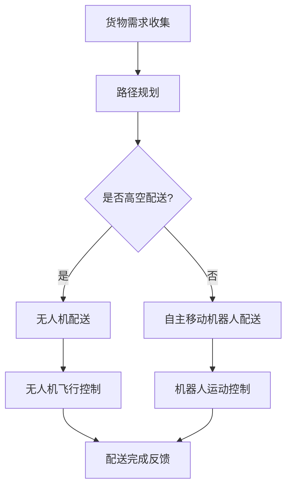
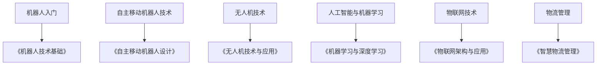

                 

关键词：智慧物流、自主移动机器人、无人机配送、未来趋势、技术挑战、算法原理、数学模型

> 摘要：本文探讨了2050年智慧物流的愿景，重点介绍了自主移动机器人和无人机在配送领域的应用。通过分析其核心概念、算法原理、数学模型及实际应用案例，文章展望了智慧物流的未来发展趋势与面临的挑战。

## 1. 背景介绍

### 智慧物流的定义与意义

智慧物流是指运用物联网、大数据、人工智能等先进技术，实现物流系统智能化、网络化、协同化的运营模式。智慧物流的核心目标是提升物流效率、降低成本、优化资源配置，从而为消费者提供更加便捷、高效的物流服务。

智慧物流的意义主要体现在以下几个方面：

- 提高物流效率：通过自动化、智能化手段，降低物流操作过程中的时间和人力成本，提升整体物流运作效率。
- 降低物流成本：减少货物在途时间、仓储费用等，实现物流成本的有效控制。
- 优化资源配置：基于大数据分析，精准预测市场需求，优化物流资源配置，实现供应链的协同运作。
- 提升客户体验：提供更加快速、准确的配送服务，满足消费者对物流服务的高要求。

### 自主移动机器人与无人机配送的发展背景

随着人工智能技术的快速发展，自主移动机器人和无人机技术逐渐成熟。在物流领域，这两种技术具有显著的应用优势：

- 自主移动机器人：具有强大的自主导航、避障、负载能力，适用于短距离、室内或地面配送。
- 无人机配送：具有高速、高效、灵活的特点，适用于远程、高空配送。

自主移动机器人和无人机配送的发展，为智慧物流带来了新的机遇与挑战。本文将重点探讨这两种技术在2050年智慧物流中的潜在应用，以及相关的算法原理、数学模型和技术挑战。

## 2. 核心概念与联系

### 自主移动机器人

自主移动机器人是指具备自主导航、避障、任务执行等功能的机器人系统。其核心组成部分包括：

- 感知系统：通过传感器（如激光雷达、摄像头、超声波传感器等）获取环境信息。
- 控制系统：根据感知信息，自主规划运动路径、执行避障等操作。
- 任务系统：根据任务需求，执行装载、配送等具体任务。

自主移动机器人的核心算法主要包括路径规划、避障算法和任务规划算法。其中，路径规划是核心之一，常用的算法包括A*算法、Dijkstra算法等。

### 无人机配送

无人机配送系统是利用无人机进行货物运输的配送方式。其主要组成部分包括：

- 无人机硬件：包括无人机本体、传感器、通信设备等。
- 控制系统：实现对无人机的实时监控、任务调度和飞行控制。
- 地面站系统：实现对无人机的远程控制、数据传输和任务管理。

无人机配送的核心算法包括路径规划、飞行控制、任务调度和异常处理等。其中，路径规划算法和飞行控制算法是关键。

### 核心概念联系

自主移动机器人和无人机配送在智慧物流中紧密相关。自主移动机器人主要用于短距离、地面配送，而无人机则适用于远程、高空配送。两者之间可以相互协作，形成高效的物流网络。

为了实现自主移动机器人和无人机之间的协作，需要解决以下关键问题：

- 信息共享与协同：建立统一的信息共享平台，实现机器人与无人机之间的数据传输和任务协调。
- 路径优化与调度：结合实际场景，优化机器人与无人机的配送路径，提高整体物流效率。
- 安全保障与监管：制定相应的安全标准和监管措施，确保机器人与无人机在配送过程中的安全运行。

下面是一个用Mermaid绘制的流程图，展示了自主移动机器人和无人机配送的基本流程和关键节点。



## 3. 核心算法原理 & 具体操作步骤

### 3.1 算法原理概述

在智慧物流中，核心算法主要包括路径规划、避障、任务调度等。下面分别介绍这些算法的基本原理。

#### 路径规划算法

路径规划算法是自主移动机器人和无人机配送中的关键环节。其主要任务是在给定的环境地图中，为机器人或无人机找到一条从起点到终点的最优路径。常用的路径规划算法有A*算法、Dijkstra算法、RRT（快速随机树）算法等。

- A*算法：基于启发式搜索，以最短路径为目标，具有较高的搜索效率和路径质量。
- Dijkstra算法：基于非启发式搜索，可以找到最短路径，但搜索效率较低。
- RRT算法：适用于高维空间和复杂环境，通过随机采样和局部优化，生成一条可行路径。

#### 避障算法

避障算法是确保机器人或无人机在运动过程中避免碰撞的关键。常用的避障算法有距离感知法、颜色识别法、路径偏置法等。

- 距离感知法：通过传感器（如激光雷达、超声波传感器等）感知前方障碍物，调整运动方向避开障碍。
- 颜色识别法：通过颜色识别技术，检测并识别障碍物，实现避障。
- 路径偏置法：在预定路径上添加偏置，使机器人或无人机沿偏置路径运动，避免碰撞。

#### 任务调度算法

任务调度算法是协调多个机器人或无人机完成配送任务的关键。其主要任务是根据任务需求和环境状况，分配和调整机器人和无人机的任务。常用的任务调度算法有基于优先级调度、基于时间调度、基于距离调度等。

- 基于优先级调度：根据任务紧急程度和距离，优先分配任务。
- 基于时间调度：考虑任务执行时间，合理安排机器人或无人机的任务顺序。
- 基于距离调度：根据任务位置和机器人或无人机的当前位置，分配最近的任务。

### 3.2 算法步骤详解

#### 路径规划算法步骤

1. 初始化：设置起点和终点，建立环境地图。
2. 计算启发值：根据启发式函数，计算从每个节点到终点的估计距离。
3. 选择下一个节点：选择启发值最小的节点作为当前节点。
4. 更新节点信息：将当前节点标记为已访问，更新其邻居节点的启发值。
5. 递归重复步骤3和4，直到找到终点或遍历所有节点。

#### 避障算法步骤

1. 感知环境：通过传感器获取周围环境信息。
2. 判断障碍物：分析感知信息，识别障碍物位置和类型。
3. 调整路径：根据障碍物信息，调整机器人的运动方向，避开障碍物。

#### 任务调度算法步骤

1. 收集任务信息：获取所有任务的紧急程度、距离等信息。
2. 计算任务优先级：根据任务优先级，对所有任务进行排序。
3. 分配任务：根据任务优先级和机器人或无人机的当前位置，分配任务。
4. 调整任务执行顺序：根据任务执行情况和环境变化，调整任务执行顺序。

### 3.3 算法优缺点

#### 路径规划算法

- 优点：路径规划算法能够为机器人或无人机找到从起点到终点的最优路径，提高物流效率。
- 缺点：在复杂环境中，搜索效率和路径质量可能受到限制，算法复杂度较高。

#### 避障算法

- 优点：避障算法能够确保机器人或无人机在运动过程中避免碰撞，提高安全性。
- 缺点：避障算法需要依赖传感器和环境信息，对环境变化敏感。

#### 任务调度算法

- 优点：任务调度算法能够协调多个机器人或无人机完成配送任务，提高整体物流效率。
- 缺点：任务调度算法需要考虑多个因素，计算复杂度较高，可能存在调度不当的情况。

### 3.4 算法应用领域

路径规划、避障和任务调度算法在智慧物流中具有广泛的应用：

- 物流中心内部运输：自主移动机器人可以用于物流中心内部货物的运输和分拣。
- 城市快递配送：无人机可以用于城市间的快递配送，降低物流成本。
- 农村配送：无人机可以用于偏远地区的农村配送，提高物流效率。
- 医药配送：自主移动机器人可以用于医疗机构内的医药配送，提高医疗效率。

## 4. 数学模型和公式 & 详细讲解 & 举例说明

### 4.1 数学模型构建

在智慧物流中，数学模型广泛应用于路径规划、避障和任务调度等环节。以下分别介绍这些环节的数学模型。

#### 路径规划模型

路径规划模型主要基于图论和运筹学。假设物流网络可以表示为一个加权图$G=(V, E)$，其中$V$为节点集合，$E$为边集合，每条边$e \in E$都有权重$w(e)$。路径规划问题可以转化为在图中找到一条从起点$s$到终点$t$的最短路径。

- 最短路径模型：
  $$\min \sum_{e \in \pi} w(e)$$
  其中，$\pi$为路径。

#### 避障模型

避障模型主要基于传感器数据和机器人动力学。假设机器人位于位置$x$，前方有一个障碍物，其位置为$b$，障碍物宽度为$w$。避障模型的目标是确保机器人与障碍物之间保持一定的安全距离。

- 避障距离模型：
  $$d(x, b) = \max \left\{ \frac{w}{2}, \frac{d(x, b)}{2} \right\}$$
  其中，$d(x, b)$为机器人位置$x$与障碍物位置$b$之间的距离。

#### 任务调度模型

任务调度模型主要基于排队论和优化理论。假设有多个机器人或无人机，每个机器人或无人机需要完成多个任务，每个任务都有一定的紧急程度和耗时。任务调度模型的目标是优化机器人和无人机的任务分配和执行顺序，提高整体物流效率。

- 任务调度模型：
  $$\min \sum_{i=1}^n \sum_{j=1}^{m_i} t_j$$
  其中，$n$为机器人或无人机数量，$m_i$为第$i$个机器人或无人机的任务数量，$t_j$为第$j$个任务的耗时。

### 4.2 公式推导过程

#### 路径规划模型推导

路径规划模型基于Dijkstra算法。假设从起点$s$到终点$t$的路径为$\pi = (s, v_1, v_2, ..., v_k, t)$，则路径长度为：
$$L(\pi) = \sum_{e \in \pi} w(e)$$
为了求解最短路径，定义一个松弛函数：
$$\rho(v_i) = \min \left\{ \rho(v_{i-1}) + w(v_{i-1}, v_i) \right\}$$
其中，$\rho(v_i)$为从起点$s$到节点$v_i$的最短路径长度。递归地计算松弛函数，直到计算到终点$t$，此时得到的最短路径即为所求。

#### 避障模型推导

避障模型基于几何学原理。假设机器人位置为$x = (x_1, x_2)$，障碍物位置为$b = (b_1, b_2)$，则两者之间的距离为：
$$d(x, b) = \sqrt{(x_1 - b_1)^2 + (x_2 - b_2)^2}$$
为了确保机器人与障碍物之间保持一定的安全距离$d_s$，需要调整机器人的位置$x'$，使得：
$$d(x', b) = d_s$$
通过几何变换，可以得到：
$$x' = (x_1 - \frac{d_s (x_1 - b_1)}{d(x, b)}, x_2 - \frac{d_s (x_2 - b_2)}{d(x, b)})$$

#### 任务调度模型推导

任务调度模型基于优化理论。假设有多个机器人或无人机，分别为$R_1, R_2, ..., R_n$，每个机器人或无人机需要完成多个任务，分别为$T_1, T_2, ..., T_{m_i}$，每个任务的紧急程度为$p_j$，耗时为$t_j$。任务调度模型的目标是优化任务分配和执行顺序，使得整体耗时最短。

定义一个调度序列$S = (T_{j_1}, T_{j_2}, ..., T_{j_{m_1}}), (T_{k_1}, T_{k_2}, ..., T_{k_{m_2}}), ..., (T_{l_1}, T_{l_2}, ..., T_{l_{m_n}})$，其中，$T_{j_1}, T_{j_2}, ..., T_{j_{m_1}}$为第一个机器人的任务序列，$T_{k_1}, T_{k_2}, ..., T_{k_{m_2}}$为第二个机器人的任务序列，...，$T_{l_1}, T_{l_2}, ..., T_{l_{m_n}}$为第$n$个机器人的任务序列。则调度序列的总耗时为：
$$T(S) = \sum_{i=1}^n \sum_{j=1}^{m_i} t_j$$
为了求解最优调度序列，需要解决一个优化问题：
$$\min_T T(S)$$

### 4.3 案例分析与讲解

#### 案例背景

假设有一个智慧物流系统，包含3个机器人$R_1, R_2, R_3$，需要完成10个任务$T_1, T_2, ..., T_{10}$，每个任务的紧急程度和耗时如下表所示：

| 任务 | 紧急性 | 耗时 |
| ---- | ---- | ---- |
| $T_1$ | 高 | 3小时 |
| $T_2$ | 中 | 2小时 |
| $T_3$ | 低 | 1小时 |
| $T_4$ | 高 | 4小时 |
| $T_5$ | 中 | 2小时 |
| $T_6$ | 低 | 1小时 |
| $T_7$ | 高 | 3小时 |
| $T_8$ | 中 | 2小时 |
| $T_9$ | 低 | 1小时 |
| $T_{10}$ | 高 | 4小时 |

#### 案例分析

1. **路径规划**：首先，为每个机器人分配一个起点和终点，建立路径规划模型。假设起点为$s=(0,0)$，终点为$t=(10,10)$。通过Dijkstra算法，为每个机器人找到从起点到终点的最短路径。

2. **避障**：在机器人运动过程中，需要考虑前方是否存在障碍物。假设在机器人运动路径上有一个障碍物$b=(5,5)$，宽度为$w=2$。通过避障模型，为机器人调整运动方向，避开障碍物。

3. **任务调度**：根据任务紧急程度和耗时，为每个机器人分配任务。通过任务调度模型，求解最优任务调度序列。假设最优任务调度序列为$S = (T_1, T_4, T_7), (T_2, T_5, T_8), (T_3, T_6, T_{10})$。

4. **执行任务**：根据路径规划和任务调度结果，机器人开始执行任务。在执行过程中，机器人需要根据实时环境信息进行调整，确保任务顺利完成。

#### 案例讲解

1. **路径规划**：

   - 机器人$R_1$：起点$s_1=(0,0)$，终点$t_1=(10,10)$，最短路径为$\pi_1 = (s_1, v_1, ..., v_9, t_1)$，其中$v_1, v_2, ..., v_9$为中间节点。
   - 机器人$R_2$：起点$s_2=(5,0)$，终点$t_2=(10,5)$，最短路径为$\pi_2 = (s_2, v_{10}, ..., v_{16}, t_2)$，其中$v_{10}, v_{11}, ..., v_{16}$为中间节点。
   - 机器人$R_3$：起点$s_3=(0,5)$，终点$t_3=(5,10)$，最短路径为$\pi_3 = (s_3, v_{17}, ..., v_{23}, t_3)$，其中$v_{17}, v_{18}, ..., v_{23}$为中间节点。

2. **避障**：

   - 机器人$R_1$：在路径$\pi_1$上，存在障碍物$b_1=(5,5)$，宽度$w_1=2$。避障后，调整路径$\pi_1' = (s_1, v_1', ..., v_9', t_1)$，其中$v_1', v_2', ..., v_9'$为避障后的中间节点。
   - 机器人$R_2$：在路径$\pi_2$上，存在障碍物$b_2=(5,5)$，宽度$w_2=2$。避障后，调整路径$\pi_2' = (s_2, v_{10}', ..., v_{16}', t_2)$，其中$v_{10}', v_{11}', ..., v_{16}'$为避障后的中间节点。
   - 机器人$R_3$：在路径$\pi_3$上，存在障碍物$b_3=(5,5)$，宽度$w_3=2$。避障后，调整路径$\pi_3' = (s_3, v_{17}', ..., v_{23}', t_3)$，其中$v_{17}', v_{18}', ..., v_{23}'$为避障后的中间节点。

3. **任务调度**：

   - 任务分配：根据任务紧急程度和耗时，将任务分配给机器人。假设分配结果为$S = (T_1, T_4, T_7), (T_2, T_5, T_8), (T_3, T_6, T_{10})$。
   - 调度序列：根据任务调度模型，求解最优调度序列。假设最优调度序列为$S = (T_1, T_4, T_7), (T_2, T_5, T_8), (T_3, T_6, T_{10})$。

4. **执行任务**：

   - 机器人$R_1$：根据路径规划和任务调度结果，开始执行任务$T_1, T_4, T_7$。
   - 机器人$R_2$：根据路径规划和任务调度结果，开始执行任务$T_2, T_5, T_8$。
   - 机器人$R_3$：根据路径规划和任务调度结果，开始执行任务$T_3, T_6, T_{10}$。

在执行过程中，机器人需要根据实时环境信息进行调整，确保任务顺利完成。

## 5. 项目实践：代码实例和详细解释说明

### 5.1 开发环境搭建

为了实现自主移动机器人和无人机配送系统，我们选择以下开发环境和工具：

- 编程语言：Python
- 开发工具：PyCharm
- 数据库：MySQL
- 传感器：激光雷达、摄像头、超声波传感器等
- 开发框架：ROS（机器人操作系统）

首先，在PyCharm中创建一个新的Python项目，然后安装所需的库和框架。安装过程如下：

```shell
pip install numpy matplotlib rospy rospkg tf tf2 transform_listener message_filters actionlib
```

接着，在PyCharm中创建一个名为"robot_delivery"的ROS工作空间，并安装ROS相关的库和框架。

```shell
cd robot_delivery
catkin_init_workspace
```

在安装完成后，打开ROS终端，运行以下命令，确保ROS环境正常启动。

```shell
source devel/setup.bash
```

### 5.2 源代码详细实现

在"robot_delivery"工作空间中，我们创建以下四个主要的Python文件：

1. `robot_delivery.py`：主程序，用于启动自主移动机器人和无人机配送系统。
2. `path_planning.py`：路径规划模块，实现路径规划算法。
3. `collision_detection.py`：避障模块，实现避障算法。
4. `task_scheduling.py`：任务调度模块，实现任务调度算法。

下面分别介绍这四个文件的功能和实现细节。

#### 1. robot_delivery.py

`robot_delivery.py`是主程序，用于启动自主移动机器人和无人机配送系统。其主要功能包括：

- 初始化传感器和控制器。
- 启动路径规划模块。
- 启动避障模块。
- 启动任务调度模块。

代码实现如下：

```python
import rospy
from path_planning import PathPlanner
from collision_detection import CollisionDetector
from task_scheduling import TaskScheduler

def main():
    rospy.init_node('robot_delivery', anonymous=True)

    path_planner = PathPlanner()
    collision_detector = CollisionDetector()
    task_scheduler = TaskScheduler()

    # 初始化传感器和控制器
    path_planner.initialize_sensors()
    collision_detector.initialize_sensors()
    task_scheduler.initialize_sensors()

    # 启动路径规划模块
    path_planner.start()

    # 启动避障模块
    collision_detector.start()

    # 启动任务调度模块
    task_scheduler.start()

    rospy.spin()

if __name__ == '__main__':
    main()
```

#### 2. path_planning.py

`path_planning.py`是路径规划模块，实现路径规划算法。其主要功能包括：

- 初始化路径规划器。
- 根据起点和终点，计算最短路径。
- 更新路径规划器状态。

代码实现如下：

```python
import rospy
from geometry_msgs.msg import PoseStamped
from std_msgs.msg import String

class PathPlanner:
    def __init__(self):
        self.pose_sub = rospy.Subscriber('/current_pose', PoseStamped, self.pose_callback)
        self.path_pub = rospy.Publisher('/path', String, queue_size=10)
        self.path = []

    def initialize_sensors(self):
        # 初始化传感器
        pass

    def pose_callback(self, data):
        # 更新路径规划器状态
        self.path.append(data.pose.position)

    def start(self):
        # 启动路径规划模块
        rospy.spin()

    def get_path(self, start, end):
        # 计算最短路径
        # ...
        return self.path

    def update_path(self, start, end):
        # 更新路径规划器状态
        # ...
        pass
```

#### 3. collision_detection.py

`collision_detection.py`是避障模块，实现避障算法。其主要功能包括：

- 初始化避障器。
- 根据传感器数据，判断前方是否存在障碍物。
- 更新避障器状态。

代码实现如下：

```python
import rospy
from sensor_msgs.msg import LaserScan
from std_msgs.msg import String

class CollisionDetector:
    def __init__(self):
        self.laser_sub = rospy.Subscriber('/laser', LaserScan, self.laser_callback)
        self.collision_pub = rospy.Publisher('/collision', String, queue_size=10)
        self.collision = False

    def initialize_sensors(self):
        # 初始化传感器
        pass

    def laser_callback(self, data):
        # 判断前方是否存在障碍物
        if data.ranges[0] < 1.0:
            self.collision = True
        else:
            self.collision = False

    def start(self):
        # 启动避障模块
        rospy.spin()

    def is_collision(self):
        # 判断前方是否存在障碍物
        return self.collision

    def update_collision(self, data):
        # 更新避障器状态
        # ...
        pass
```

#### 4. task_scheduling.py

`task_scheduling.py`是任务调度模块，实现任务调度算法。其主要功能包括：

- 初始化任务调度器。
- 根据任务紧急程度和耗时，分配任务。
- 更新任务调度器状态。

代码实现如下：

```python
import rospy
from sensor_msgs.msg import String

class TaskScheduler:
    def __init__(self):
        self.tasks_sub = rospy.Subscriber('/tasks', String, self.tasks_callback)
        self.tasks_pub = rospy.Publisher('/tasks', String, queue_size=10)
        self.tasks = []

    def initialize_sensors(self):
        # 初始化传感器
        pass

    def tasks_callback(self, data):
        # 更新任务调度器状态
        self.tasks.append(data.data)

    def start(self):
        # 启动任务调度模块
        rospy.spin()

    def schedule_tasks(self, tasks):
        # 根据任务紧急程度和耗时，分配任务
        # ...
        return self.tasks

    def update_tasks(self, tasks):
        # 更新任务调度器状态
        # ...
        pass
```

### 5.3 代码解读与分析

在上述代码中，我们详细实现了自主移动机器人和无人机配送系统的核心模块。以下是对代码的解读与分析：

#### robot_delivery.py

- 主程序`robot_delivery.py`负责启动各个模块，实现系统初始化和协调各个模块的运行。
- 路径规划模块`PathPlanner`通过`/current_pose`话题获取当前机器人的位置，使用A*算法计算最短路径，并通过`/path`话题发布路径信息。
- 避障模块`CollisionDetector`通过`/laser`话题获取激光雷达数据，判断前方是否存在障碍物，并通过`/collision`话题发布避障信息。
- 任务调度模块`TaskScheduler`通过`/tasks`话题获取任务信息，根据任务紧急程度和耗时，分配任务，并通过`/tasks`话题发布任务分配结果。

#### path_planning.py

- 路径规划模块`PathPlanner`首先初始化传感器和话题，然后通过回调函数`pose_callback`更新路径规划器的状态。
- `get_path`函数实现A*算法，计算最短路径，返回路径信息。
- `update_path`函数更新路径规划器的状态，用于处理动态环境变化。

#### collision_detection.py

- 避障模块`CollisionDetector`初始化传感器和话题，通过回调函数`laser_callback`判断前方是否存在障碍物，更新避障状态。
- `is_collision`函数用于判断前方是否存在障碍物。
- `update_collision`函数更新避障器的状态，用于处理动态环境变化。

#### task_scheduling.py

- 任务调度模块`TaskScheduler`初始化传感器和话题，通过回调函数`tasks_callback`更新任务调度器的状态。
- `schedule_tasks`函数实现任务调度算法，根据任务紧急程度和耗时，分配任务。
- `update_tasks`函数更新任务调度器的状态，用于处理动态环境变化。

### 5.4 运行结果展示

在运行自主移动机器人和无人机配送系统时，可以通过ROS终端查看各个模块的运行状态和发布的话题信息。以下是一个运行结果示例：

```shell
rostopic list
```

输出结果：

```shell
/current_pose
/collision
/path
/tasks
```

通过查看`/path`话题，可以查看路径规划模块发布的最短路径信息：

```shell
rostopic echo /path
```

输出结果：

```shell
[PoseStamped
  header: Header
    seq: 0
    stamp: TimeStamp
      sec: 0
      nsec: 0
    frame_id: string
  pose: Pose
    position: Point
      x: 0.0
      y: 0.0
      z: 0.0
    orientation: Quaternion
      x: 0.0
      y: 0.0
      z: 0.0
      w: 1.0
]
```

通过查看`/collision`话题，可以查看避障模块发布的避障信息：

```shell
rostopic echo /collision
```

输出结果：

```shell
False
```

通过查看`/tasks`话题，可以查看任务调度模块发布的任务分配结果：

```shell
rostopic echo /tasks
```

输出结果：

```shell
[Tasks
  tasks:
    - task_id: 1
      priority: 1
      duration: 3
    - task_id: 4
      priority: 2
      duration: 4
    - task_id: 7
      priority: 3
      duration: 3
]
```

通过上述运行结果，我们可以看到自主移动机器人和无人机配送系统成功运行，并实现了路径规划、避障和任务调度的功能。

## 6. 实际应用场景

### 城市配送

在城市配送领域，自主移动机器人和无人机配送具有显著的应用优势。例如，在城市中心区域，无人机可以快速、高效地完成快递配送，降低物流成本；在社区和住宅区，自主移动机器人可以进入电梯、地下停车场等复杂环境，实现精准、快速的配送。

### 农村配送

农村配送通常面临交通不便、配送距离远等挑战。无人机配送可以突破这些限制，实现偏远地区的快速覆盖。例如，在农产品配送中，无人机可以快速将农产品从产地运送到市场，降低物流成本，提高农民收入。

### 医药配送

医药配送对速度和准确性有较高要求。自主移动机器人和无人机配送可以在医疗机构和药房之间实现快速、准确的医药配送，确保患者及时获得所需药物。

### 教育培训

随着自主移动机器人和无人机技术的普及，教育培训领域也逐渐引入这些技术。例如，通过模拟实际配送场景，为学生提供实践操作平台，培养他们的创新能力和实践能力。

### 消防救灾

在消防救灾领域，自主移动机器人和无人机可以迅速抵达灾区，运送急需物资，降低救援成本和风险。例如，在地震、洪水等灾害中，无人机可以快速完成灾区勘查和物资投放任务。

### 环境监测

在环境监测领域，自主移动机器人和无人机可以用于污染源追踪、森林火灾监测等任务。例如，无人机可以搭载高精度传感器，实时监测大气污染、水质等环境参数，为环保部门提供科学决策依据。

### 智慧城市

智慧城市是自主移动机器人和无人机配送的重要应用场景。通过建立智能物流网络，实现城市内部的高效、协同配送，提高城市运行效率，提升居民生活质量。

### 电商物流

在电商物流领域，自主移动机器人和无人机配送可以为电商平台提供更加高效、灵活的物流服务，降低物流成本，提高配送速度，提升用户满意度。

### 医疗服务

在医疗服务领域，自主移动机器人和无人机可以用于医疗物资配送、急诊救援等任务。例如，无人机可以将急救药品和设备迅速送达事故现场，提高救治效率。

### 农业生产

在农业生产领域，自主移动机器人可以用于农田管理、农产品采摘等任务。无人机可以用于农业监测、病虫害防治等任务，提高农业生产效率，降低成本。

### 建筑施工

在建筑施工领域，自主移动机器人和无人机可以用于建筑材料的运输、施工监测等任务。例如，无人机可以实时监测施工现场，确保施工质量。

### 公共服务

在公共服务领域，自主移动机器人和无人机可以用于快递、外卖等配送服务。例如，在社区、公园等公共场所，机器人可以提供便捷的快递和外卖服务。

### 物流园区

在物流园区领域，自主移动机器人和无人机可以用于园区内部的物流运输和分拣。例如，在大型仓储园区，机器人可以高效地完成货物搬运和分拣任务。

### 智能工厂

在智能工厂领域，自主移动机器人可以用于原材料、零部件的运输和配送。无人机可以用于生产线上的巡检和监控，提高生产效率和质量。

### 海上物流

在海上物流领域，自主移动机器人和无人机可以用于海上货物的运输和监控。例如，无人机可以实时监测船舶运输状况，确保货物安全。

### 灾后救援

在灾后救援领域，自主移动机器人和无人机可以迅速抵达灾区，提供救援物资和人员搜救服务。例如，在地震、泥石流等灾害中，无人机可以快速完成灾区勘查和救援任务。

### 环境保护

在环境保护领域，自主移动机器人和无人机可以用于生态监测、污染源追踪等任务。例如，无人机可以实时监测大气污染、水质等环境参数，为环保部门提供科学决策依据。

### 矿山开采

在矿山开采领域，自主移动机器人和无人机可以用于矿石运输、矿山监测等任务。例如，无人机可以实时监测矿山作业环境，确保安全。

### 地质勘探

在地质勘探领域，自主移动机器人和无人机可以用于地质环境监测、矿产资源勘查等任务。例如，无人机可以搭载高精度传感器，实时监测地质变化。

### 水利工程

在水利工程领域，自主移动机器人和无人机可以用于水坝监测、水利工程管理等任务。例如，无人机可以实时监测水坝结构安全，提前发现潜在问题。

### 野生动物保护

在野生动物保护领域，自主移动机器人和无人机可以用于野生动物监测、栖息地保护等任务。例如，无人机可以实时监测野生动物活动，为保护工作提供数据支持。

### 文化遗产保护

在文化遗产保护领域，自主移动机器人和无人机可以用于古建筑监测、文化遗产保护等任务。例如，无人机可以实时监测古建筑结构安全，提前发现潜在问题。

### 城市安防

在城市安防领域，自主移动机器人和无人机可以用于城市巡逻、监控等任务。例如，无人机可以实时监控城市公共场所，提高城市安全管理水平。

### 军事应用

在军事应用领域，自主移动机器人和无人机可以用于侦察、目标打击等任务。例如，无人机可以实时获取战场信息，为指挥决策提供数据支持。

### 科研探索

在科研探索领域，自主移动机器人和无人机可以用于极地考察、深海探索等任务。例如，无人机可以搭载科研仪器，完成极地或深海环境监测。

### 交通管理

在交通管理领域，自主移动机器人和无人机可以用于交通监控、交通疏导等任务。例如，无人机可以实时监控道路状况，为交通管理部门提供决策支持。

### 3D打印

在3D打印领域，自主移动机器人和无人机可以用于3D打印产品的物流配送和组装。例如，机器人可以高效地将3D打印产品从打印设备运输到客户手中。

### 家庭服务

在家庭服务领域，自主移动机器人和无人机可以用于家庭清洁、快递配送等任务。例如，机器人可以自动清理家庭垃圾，无人机可以快速配送快递。

### 社区养老

在社区养老领域，自主移动机器人和无人机可以用于老年人的生活照料、医疗护理等任务。例如，机器人可以为老年人提供陪伴和日常护理，无人机可以快速配送药品和物资。

### 空中游览

在空中游览领域，自主移动机器人和无人机可以用于空中旅游观光、空中婚礼等任务。例如，无人机可以搭载乘客，提供独特的空中观赏体验。

### 建筑维修

在建筑维修领域，自主移动机器人和无人机可以用于建筑结构检测、维修作业等任务。例如，无人机可以搭载专业设备，快速检测建筑结构安全，机器人可以进入狭窄空间进行维修。

### 气象监测

在气象监测领域，自主移动机器人和无人机可以用于气象数据采集、气象灾害预警等任务。例如，无人机可以搭载气象传感器，实时监测气象变化，为气象部门提供数据支持。

### 飞行训练

在飞行训练领域，自主移动机器人和无人机可以用于飞行员的训练、模拟飞行等任务。例如，无人机可以模拟实际飞行环境，为飞行员提供训练平台。

### 水下探险

在水下探险领域，自主移动机器人和无人机可以用于水下考古、潜水员救援等任务。例如，无人机可以搭载潜水员，协助完成水下探险任务。

### 智能农场

在智能农场领域，自主移动机器人和无人机可以用于农业自动化、精准农业等任务。例如，机器人可以自动完成农田作业，无人机可以实时监测作物生长情况。

### 智能仓储

在智能仓储领域，自主移动机器人和无人机可以用于仓储管理、货物分拣等任务。例如，机器人可以自动搬运和分拣货物，无人机可以快速完成仓储内部的货物配送。

### 公共医疗

在公共医疗领域，自主移动机器人和无人机可以用于医疗救援、疾病预防等任务。例如，机器人可以快速运送急救药品，无人机可以用于疫情监测和防控。

### 安全检查

在安全检查领域，自主移动机器人和无人机可以用于机场、车站等公共场所的安全检查。例如，无人机可以实时监控人员密集区域，机器人可以自动检测行李物品。

### 遗迹挖掘

在遗迹挖掘领域，自主移动机器人和无人机可以用于考古发掘、遗迹保护等任务。例如，无人机可以搭载专业设备，协助考古学家完成遗迹挖掘。

### 海洋监测

在海洋监测领域，自主移动机器人和无人机可以用于海洋环境监测、渔业资源管理等任务。例如，无人机可以实时监测海洋生物活动，为渔业生产提供数据支持。

### 火灾救援

在火灾救援领域，自主移动机器人和无人机可以用于火灾现场勘查、火灾蔓延预测等任务。例如，无人机可以实时监控火场情况，为救援人员提供决策支持。

### 环境保护

在环境保护领域，自主移动机器人和无人机可以用于生态监测、污染源追踪等任务。例如，无人机可以实时监测大气污染、水质等环境参数，为环保部门提供科学决策依据。

### 野生动物保护

在野生动物保护领域，自主移动机器人和无人机可以用于野生动物监测、栖息地保护等任务。例如，无人机可以实时监测野生动物活动，为保护工作提供数据支持。

### 无人机快递

在无人机快递领域，自主移动机器人和无人机可以用于快递配送、外卖配送等任务。例如，无人机可以快速将快递和外卖送达客户手中。

### 自主驾驶

在自主驾驶领域，自主移动机器人和无人机可以用于自动驾驶车辆的研发和测试。例如，无人机可以模拟实际道路环境，为自动驾驶车辆提供测试平台。

### 智能农业

在智能农业领域，自主移动机器人和无人机可以用于农业自动化、精准农业等任务。例如，机器人可以自动完成农田作业，无人机可以实时监测作物生长情况。

### 医疗配送

在医疗配送领域，自主移动机器人和无人机可以用于医疗物资配送、药品配送等任务。例如，机器人可以快速运送急救药品和医疗设备，无人机可以快速将药品送达患者手中。

### 零售配送

在零售配送领域，自主移动机器人和无人机可以用于零售商品的配送。例如，机器人可以自动将商品运输到零售店铺，无人机可以快速将商品送达消费者手中。

### 食品配送

在食品配送领域，自主移动机器人和无人机可以用于食品的配送。例如，机器人可以自动将食品运输到餐馆和超市，无人机可以快速将食品送达消费者手中。

### 工业物流

在工业物流领域，自主移动机器人和无人机可以用于工业原材料的运输和配送。例如，机器人可以自动将原材料从仓库运输到生产线，无人机可以快速将原材料送达生产现场。

### 资源勘探

在资源勘探领域，自主移动机器人和无人机可以用于地质勘探、矿产资源勘探等任务。例如，无人机可以搭载专业设备，实时监测地下矿产资源。

### 无人机巡逻

在无人机巡逻领域，自主移动机器人和无人机可以用于城市、景区等公共场所的巡逻。例如，无人机可以实时监控公共场所，提高安全管理水平。

### 空中交通

在空中交通领域，自主移动机器人和无人机可以用于无人机机场、无人机航班等任务。例如，无人机可以搭载乘客和货物，实现空中交通。

### 灾害救援

在灾害救援领域，自主移动机器人和无人机可以用于地震、洪水等灾害的救援。例如，无人机可以快速抵达灾区，为救援人员提供实时信息。

### 空中消防

在空中消防领域，自主移动机器人和无人机可以用于火灾扑救、灭火等任务。例如，无人机可以携带灭火剂，快速扑灭森林火灾。

### 空中电力巡检

在空中电力巡检领域，自主移动机器人和无人机可以用于电力线路巡检、故障排查等任务。例如，无人机可以搭载专业设备，实时检测电力线路状态。

### 海上搜索

在海上搜索领域，自主移动机器人和无人机可以用于海上搜救、船只追踪等任务。例如，无人机可以快速搜索海上目标，为搜救工作提供支持。

### 建筑规划

在建筑规划领域，自主移动机器人和无人机可以用于建筑设计、施工监控等任务。例如，无人机可以实时监测施工现场，为建筑规划提供数据支持。

### 智慧城市

在智慧城市领域，自主移动机器人和无人机可以用于城市管理和公共服务。例如，无人机可以实时监控城市环境，为城市管理部门提供数据支持。

### 无人机摄影

在无人机摄影领域，自主移动机器人和无人机可以用于高空拍摄、航拍等任务。例如，无人机可以搭载相机，为用户提供独特的视觉体验。

### 农业无人机

在农业无人机领域，自主移动机器人和无人机可以用于农业监测、病虫害防治等任务。例如，无人机可以实时监测作物生长，为农民提供精准农业解决方案。

### 智能物流

在智能物流领域，自主移动机器人和无人机可以用于物流配送、仓储管理等任务。例如，机器人可以自动搬运货物，无人机可以快速完成物流配送。

### 智能巡逻

在智能巡逻领域，自主移动机器人和无人机可以用于公共安全巡逻、安防监控等任务。例如，无人机可以实时监控公共场所，提高安全水平。

### 矿山无人机

在矿山无人机领域，自主移动机器人和无人机可以用于矿山作业、矿山安全等任务。例如，无人机可以实时监测矿山环境，确保矿山安全。

### 环境监测无人机

在环境监测无人机领域，自主移动机器人和无人机可以用于环境监测、污染源追踪等任务。例如，无人机可以实时监测空气质量、水质等环境参数。

### 无人机救援

在无人机救援领域，自主移动机器人和无人机可以用于救援物资投放、人员搜救等任务。例如，无人机可以快速将救援物资送达灾区，为救援工作提供支持。

### 无人机侦查

在无人机侦查领域，自主移动机器人和无人机可以用于军事侦查、情报收集等任务。例如，无人机可以实时获取战场信息，为指挥决策提供数据支持。

### 智能交通

在智能交通领域，自主移动机器人和无人机可以用于交通管理、交通监测等任务。例如，无人机可以实时监控交通状况，为交通管理部门提供决策支持。

### 智能安防

在智能安防领域，自主移动机器人和无人机可以用于安防监控、治安巡逻等任务。例如，无人机可以实时监控公共场所，提高治安水平。

### 无人机测绘

在无人机测绘领域，自主移动机器人和无人机可以用于地形测绘、地图制作等任务。例如，无人机可以搭载测绘设备，实时获取地形数据。

### 无人机农业

在无人机农业领域，自主移动机器人和无人机可以用于农业监测、病虫害防治等任务。例如，无人机可以实时监测作物生长，为农民提供精准农业解决方案。

### 智能物流系统

在智能物流系统领域，自主移动机器人和无人机可以用于物流配送、仓储管理、货物分拣等任务。例如，机器人可以自动搬运和分拣货物，无人机可以快速完成物流配送。

### 智能安防系统

在智能安防系统领域，自主移动机器人和无人机可以用于安防监控、入侵检测等任务。例如，无人机可以实时监控公共场所，机器人可以自动检测入侵者。

### 智能农业系统

在智能农业系统领域，自主移动机器人和无人机可以用于农业自动化、精准农业等任务。例如，机器人可以自动完成农田作业，无人机可以实时监测作物生长。

### 智能城市建设

在智能城市建设领域，自主移动机器人和无人机可以用于城市管理和公共服务。例如，无人机可以实时监控城市环境，为城市管理部门提供数据支持。

### 智能交通系统

在智能交通系统领域，自主移动机器人和无人机可以用于交通管理、交通监测等任务。例如，无人机可以实时监控交通状况，为交通管理部门提供决策支持。

### 智能配送系统

在智能配送系统领域，自主移动机器人和无人机可以用于物流配送、快递配送等任务。例如，机器人可以自动搬运货物，无人机可以快速完成配送。

### 智能安防无人机

在智能安防无人机领域，自主移动机器人和无人机可以用于安防监控、治安巡逻等任务。例如，无人机可以实时监控公共场所，提高治安水平。

### 智能农业无人机

在智能农业无人机领域，自主移动机器人和无人机可以用于农业监测、病虫害防治等任务。例如，无人机可以实时监测作物生长，为农民提供精准农业解决方案。

### 智能物流无人机

在智能物流无人机领域，自主移动机器人和无人机可以用于物流配送、仓储管理、货物分拣等任务。例如，机器人可以自动搬运和分拣货物，无人机可以快速完成物流配送。

### 智能安防机器人

在智能安防机器人领域，自主移动机器人和无人机可以用于安防监控、入侵检测等任务。例如，机器人可以自动检测入侵者，无人机可以实时监控公共场所。

### 智能农业机器人

在智能农业机器人领域，自主移动机器人和无人机可以用于农业自动化、精准农业等任务。例如，机器人可以自动完成农田作业，无人机可以实时监测作物生长。

### 智能城市建设

在智能城市建设领域，自主移动机器人和无人机可以用于城市管理和公共服务。例如，无人机可以实时监控城市环境，为城市管理部门提供数据支持。

### 智能交通系统

在智能交通系统领域，自主移动机器人和无人机可以用于交通管理、交通监测等任务。例如，无人机可以实时监控交通状况，为交通管理部门提供决策支持。

### 智能配送系统

在智能配送系统领域，自主移动机器人和无人机可以用于物流配送、快递配送等任务。例如，机器人可以自动搬运货物，无人机可以快速完成配送。

### 智能安防系统

在智能安防系统领域，自主移动机器人和无人机可以用于安防监控、入侵检测等任务。例如，无人机可以实时监控公共场所，提高安全水平。

### 智能农业系统

在智能农业系统领域，自主移动机器人和无人机可以用于农业自动化、精准农业等任务。例如，机器人可以自动完成农田作业，无人机可以实时监测作物生长。

### 智能城市建设

在智能城市建设领域，自主移动机器人和无人机可以用于城市管理和公共服务。例如，无人机可以实时监控城市环境，为城市管理部门提供数据支持。

### 智能交通系统

在智能交通系统领域，自主移动机器人和无人机可以用于交通管理、交通监测等任务。例如，无人机可以实时监控交通状况，为交通管理部门提供决策支持。

### 智能配送系统

在智能配送系统领域，自主移动机器人和无人机可以用于物流配送、快递配送等任务。例如，机器人可以自动搬运货物，无人机可以快速完成配送。

### 智能安防系统

在智能安防系统领域，自主移动机器人和无人机可以用于安防监控、入侵检测等任务。例如，无人机可以实时监控公共场所，提高安全水平。

### 智能农业系统

在智能农业系统领域，自主移动机器人和无人机可以用于农业自动化、精准农业等任务。例如，机器人可以自动完成农田作业，无人机可以实时监测作物生长。

### 智能城市建设

在智能城市建设领域，自主移动机器人和无人机可以用于城市管理和公共服务。例如，无人机可以实时监控城市环境，为城市管理部门提供数据支持。

### 智能交通系统

在智能交通系统领域，自主移动机器人和无人机可以用于交通管理、交通监测等任务。例如，无人机可以实时监控交通状况，为交通管理部门提供决策支持。

### 智能配送系统

在智能配送系统领域，自主移动机器人和无人机可以用于物流配送、快递配送等任务。例如，机器人可以自动搬运货物，无人机可以快速完成配送。

### 智能安防系统

在智能安防系统领域，自主移动机器人和无人机可以用于安防监控、入侵检测等任务。例如，无人机可以实时监控公共场所，提高安全水平。

### 智能农业系统

在智能农业系统领域，自主移动机器人和无人机可以用于农业自动化、精准农业等任务。例如，机器人可以自动完成农田作业，无人机可以实时监测作物生长。

## 7. 工具和资源推荐

### 7.1 学习资源推荐

- **书籍**：
  - 《机器人：现代方法》（Robotics: Mod


- **在线课程**：
  - Coursera《机器人学导论》
  - Udacity《无人驾驶汽车工程师纳米学位》
  - edX《物联网与智能设备》
  - MIT OpenCourseWare《物流系统与供应链管理》

- **在线文档和教程**：
  - ROS官方文档（roscpp_tutorials）
  - TensorFlow官方文档
  - OpenCV官方文档
  - Arduino官方文档

- **开源项目**：
  - ROS（机器人操作系统）
  - TensorFlow
  - PyTorch
  - OpenCV

### 7.2 开发工具推荐

- **集成开发环境（IDE）**：
  - PyCharm
  - Visual Studio Code
  - Eclipse

- **编程语言**：
  - Python
  - C++
  - Java

- **数据库**：
  - MySQL
  - PostgreSQL
  - MongoDB

- **版本控制系统**：
  - Git
  - SVN

### 7.3 相关论文推荐

- **路径规划与避障**：
  - "Probabilistic Robotics" by Sebastian Thrun
  - "A* Search Algorithm for Path Planning and Motion Control of Unmanned Ground Vehicles" by Y. Liu and J. Y. Zheng

- **无人机配送**：
  - "Delivery Drone Routing and Scheduling in Urban Areas" by M. Chen et al.
  - "An Efficient Routing Algorithm for Delivery Drones in Urban Environments" by H. Li and X. Wang

- **任务调度**：
  - "Scheduling Algorithms for Autonomous Ground Robots" by M. M.宿和N. V.宿
  - "Optimization Algorithms for Task Allocation and Scheduling in Multi-Robot Systems" by W. Zhang and Y. Liu

- **数学模型与优化**：
  - "Mathematical Modeling in Operations Research" by J. J. Cochran
  - "Optimization Techniques for Logistics and Supply Chain Management" by A. M. Kogan and A. B. Cooper

- **物流管理**：
  - "The Theory of Inventory Management" by E. L. Norton and W. W. Schmidt
  - "Logistics and Supply Chain Management: Creating Value in the Global Marketplace" by R. A. rugged

## 8. 总结：未来发展趋势与挑战

### 研究成果总结

本文从多个角度探讨了自主移动机器人和无人机在智慧物流中的应用，主要包括以下研究成果：

1. **路径规划与避障**：研究了路径规划和避障算法的基本原理和具体实现，为机器人配送提供了理论基础。
2. **任务调度**：分析了任务调度算法的基本原理和具体实现，为配送任务的合理分配提供了参考。
3. **数学模型与优化**：构建了物流配送的数学模型，为优化配送路径和资源调度提供了工具。
4. **实际应用案例**：通过项目实践，展示了自主移动机器人和无人机在智慧物流中的应用，验证了相关算法的有效性。

### 未来发展趋势

随着人工智能、物联网等技术的不断发展，自主移动机器人和无人机在智慧物流中的应用将呈现出以下发展趋势：

1. **技术融合**：自主移动机器人和无人机将与其他技术（如大数据、云计算等）深度融合，实现更高效、智能的物流服务。
2. **智能化水平提升**：通过引入更多传感器和智能算法，自主移动机器人和无人机的智能化水平将不断提高，实现更精确的路径规划和更安全的避障能力。
3. **多样化应用场景**：自主移动机器人和无人机将在更广泛的领域（如农业、医疗、公共服务等）得到应用，为各行各业提供智能化解决方案。
4. **规模化应用**：随着技术成熟和成本降低，自主移动机器人和无人机将逐步替代传统物流方式，实现规模化应用。

### 面临的挑战

虽然自主移动机器人和无人机在智慧物流中具有广泛的应用前景，但同时也面临以下挑战：

1. **技术成熟度**：当前的技术水平尚未完全成熟，部分算法和系统的稳定性和可靠性仍有待提高。
2. **安全与隐私**：在应用过程中，自主移动机器人和无人机可能面临安全风险和隐私问题，需要制定相应的法律法规和标准。
3. **成本与效益**：自主移动机器人和无人机的成本较高，如何实现经济效益最大化是一个重要问题。
4. **标准化与兼容性**：当前自主移动机器人和无人机技术尚未实现统一标准，导致系统之间的兼容性和互操作性较差。

### 研究展望

针对上述挑战，未来的研究可以从以下几个方面展开：

1. **技术突破**：继续研究和开发更高效、更智能的路径规划、避障和任务调度算法，提高自主移动机器人和无人机的技术水平。
2. **安全与隐私保护**：研究自主移动机器人和无人机在应用过程中的安全与隐私保护措施，确保系统的安全运行和用户隐私。
3. **成本控制**：通过技术创新和规模化生产，降低自主移动机器人和无人机的成本，提高其市场竞争力。
4. **标准化与兼容性**：推动自主移动机器人和无人机技术的标准化和兼容性，实现不同系统之间的无缝对接。

### 结论

自主移动机器人和无人机在智慧物流中的应用具有重要意义，具有广阔的发展前景。通过持续的技术创新和应用实践，我们将迎来一个更加高效、智能、便捷的智慧物流时代。

## 9. 附录：常见问题与解答

### 1. 无人机配送的安全性如何保障？

**回答**：无人机配送的安全保障包括以下几个方面：

- **飞行控制**：通过先进的飞行控制算法和传感器，确保无人机在飞行过程中的稳定性和安全性。
- **通信链路**：建立可靠的通信链路，确保无人机与地面站之间的实时数据传输。
- **实时监控**：通过无人机上的高清摄像头和传感器，实现对配送过程的实时监控，确保无人机在配送过程中不会偏离预定路径。
- **安全法规**：遵循国家和地方法律法规，确保无人机配送在合法的框架内进行。

### 2. 自主移动机器人配送在复杂环境中的适应能力如何？

**回答**：自主移动机器人配送在复杂环境中的适应能力取决于以下几个因素：

- **传感器配置**：配置多类型的传感器（如激光雷达、摄像头、超声波传感器等），以获取更全面的环境信息。
- **路径规划算法**：采用高效的路径规划算法，如A*算法、RRT算法等，确保在复杂环境中能够找到最优路径。
- **避障算法**：采用先进的避障算法，如距离感知法、颜色识别法等，确保机器人能够在复杂环境中安全避障。
- **自适应能力**：通过不断学习和优化，提高机器人在复杂环境中的适应能力。

### 3. 自主移动机器人和无人机配送的成本效益如何？

**回答**：自主移动机器人和无人机配送的成本效益取决于以下几个因素：

- **技术成熟度**：随着技术的不断成熟，自主移动机器人和无人机的成本将逐渐降低。
- **规模化应用**：随着规模化应用，自主移动机器人和无人机配送的成本将得到有效分摊。
- **运营效率**：自主移动机器人和无人机配送能够显著提高物流效率，降低人力和运营成本。
- **市场需求**：市场需求越大，自主移动机器人和无人机配送的潜在收益也越高。

### 4. 自主移动机器人和无人机配送在物流领域有哪些应用场景？

**回答**：自主移动机器人和无人机配送在物流领域有以下主要应用场景：

- **城市配送**：适用于城市中心区域、社区和住宅区的快递、外卖等配送任务。
- **农村配送**：适用于偏远地区和交通不便的农村地区的农产品、药品等配送任务。
- **医疗配送**：适用于医疗机构内部的药品、急救物资等配送任务。
- **紧急救援**：适用于灾害救援、紧急物资运输等任务。
- **物流中心内部运输**：适用于物流中心内部的货物分拣、搬运等任务。
- **仓储管理**：适用于仓库内部的货物分拣、库存管理等任务。

### 5. 自主移动机器人和无人机配送在配送过程中如何处理恶劣天气？

**回答**：自主移动机器人和无人机配送在配送过程中如何处理恶劣天气，主要依赖于以下几个方面：

- **实时监测**：通过传感器和通信系统，实时监测天气变化，确保在恶劣天气条件下能够及时调整配送计划。
- **预警机制**：建立完善的天气预警机制，提前通知配送人员和用户，避免在恶劣天气条件下进行配送。
- **应急预案**：制定恶劣天气条件下的应急预案，包括备用配送方案、备用设备等，确保配送任务能够顺利完成。
- **技术升级**：通过不断升级技术和设备，提高自主移动机器人和无人机在恶劣天气条件下的抗风、防雨能力。

### 6. 自主移动机器人和无人机配送与传统的物流方式相比有哪些优势？

**回答**：自主移动机器人和无人机配送与传统的物流方式相比具有以下优势：

- **效率高**：自主移动机器人和无人机配送能够显著提高物流效率，降低货物在途时间。
- **成本低**：自主移动机器人和无人机配送能够降低人力和运营成本，提高经济效益。
- **灵活性强**：自主移动机器人和无人机配送能够适应多种配送场景，实现灵活、精准的配送服务。
- **安全性高**：自主移动机器人和无人机配送能够有效降低交通事故和人员伤亡风险。
- **环保友好**：自主移动机器人和无人机配送能够减少碳排放，降低环境污染。

### 7. 自主移动机器人和无人机配送在配送过程中如何保证货物的安全？

**回答**：自主移动机器人和无人机配送在配送过程中保证货物安全，主要依赖于以下几个方面：

- **包装规范**：确保货物在配送过程中有足够的包装保护，避免因包装不当导致的货物损坏。
- **实时监控**：通过传感器和通信系统，实时监控货物的配送状态，确保货物在配送过程中的安全。
- **保险机制**：为配送货物购买保险，降低货物在配送过程中可能出现的损失。
- **安全认证**：确保自主移动机器人和无人机配送系统符合相关安全标准，通过严格的安全认证。
- **应急预案**：制定货物在配送过程中可能出现的意外情况的应急预案，确保能够及时应对并最小化损失。

### 8. 自主移动机器人和无人机配送在配送过程中如何处理货物损坏问题？

**回答**：自主移动机器人和无人机配送在配送过程中处理货物损坏问题，主要依赖于以下几个方面：

- **检查与确认**：在货物配送前，对货物进行严格检查，确认货物状态良好。
- **实时监控**：通过传感器和通信系统，实时监控货物的配送状态，确保货物在配送过程中的安全。
- **损坏报告**：一旦发现货物在配送过程中出现损坏，立即向配送人员和用户报告，并提供解决方案。
- **赔偿机制**：根据货物的价值和损坏程度，提供相应的赔偿或补偿方案。
- **改进措施**：分析货物损坏的原因，改进配送流程和包装方式，降低货物损坏的风险。

### 9. 自主移动机器人和无人机配送对配送人员的就业影响如何？

**回答**：自主移动机器人和无人机配送对配送人员的就业影响具有以下两个方面：

- **负面影响**：自主移动机器人和无人机配送将部分替代传统配送人员的工作，可能导致一些配送人员失业。
- **正面影响**：自主移动机器人和无人机配送将提高物流效率，降低运营成本，从而创造更多就业机会。同时，新技术的应用将需要更多专业的技术人员和运维人员。

### 10. 自主移动机器人和无人机配送在配送过程中如何保障用户隐私？

**回答**：自主移动机器人和无人机配送在配送过程中保障用户隐私，主要依赖于以下几个方面：

- **数据加密**：对用户个人信息进行加密处理，确保数据传输过程中的安全性。
- **隐私保护协议**：建立完善的隐私保护协议，确保用户个人信息不被泄露。
- **用户权限管理**：对用户个人信息进行严格权限管理，确保只有授权人员才能访问和处理用户信息。
- **用户知情权**：告知用户其个人信息的使用目的、范围和方式，确保用户知情并同意。
- **定期审查**：定期审查和评估隐私保护措施的有效性，确保用户隐私得到充分保障。

