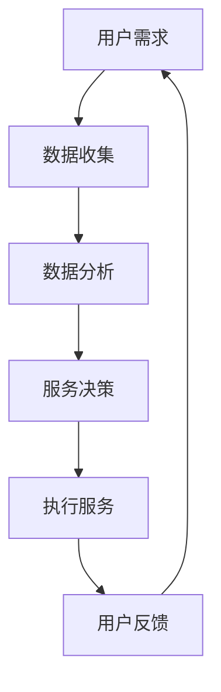

                 

关键词：智能养老，老年机器人，智能辅具，2050年，未来技术，人工智能，医疗辅助，生活方式改进

> 摘要：本文探讨未来2050年智能养老的发展趋势，特别是老年机器人和智能辅具的潜力。文章将从技术背景、核心概念、算法原理、数学模型、项目实践和未来展望等方面，全面解析这一新兴领域的现状与前景。

## 1. 背景介绍

随着全球人口老龄化趋势的加剧，老年护理问题日益受到关注。传统的养老模式已经无法满足现代社会的需求，特别是在医疗资源有限的情况下。因此，智能化养老成为解决这一问题的有效途径。老年机器人和智能辅具作为人工智能在养老领域的重要应用，有望大幅提升老年人的生活质量，减轻护理人员的工作负担。

### 1.1 人口老龄化

全球人口老龄化问题日益严重，据联合国预测，到2050年，全球60岁及以上人口将达到21亿，占总人口的22%。这一趋势将对社会、经济、医疗等多个领域产生深远影响，特别是养老问题。

### 1.2 人工智能与养老

人工智能（AI）技术近年来取得了飞速发展，已经深入到我们生活的各个方面。在养老领域，AI技术被广泛应用于医疗辅助、生活陪伴、健康管理等方面。老年机器人和智能辅具作为AI技术的具体应用，正在逐步改变着老年人的生活方式。

## 2. 核心概念与联系

在探讨老年机器人和智能辅具之前，我们需要了解一些核心概念和原理。

### 2.1 智能养老

智能养老是指利用人工智能、物联网、大数据等技术手段，为老年人提供全方位的养老服务。智能养老的核心目标是提高老年人的生活质量，减轻护理人员的工作负担。

### 2.2 老年机器人

老年机器人是一种专门为老年人设计的人工智能机器人，能够为老年人提供生活陪伴、医疗辅助、安全保障等服务。

### 2.3 智能辅具

智能辅具是指利用人工智能技术，对传统辅具进行升级改造，使其更加智能化、便捷化。智能辅具包括智能轮椅、智能拐杖、智能助听器等。

### 2.4 Mermaid 流程图

以下是一个描述老年机器人和智能辅具工作流程的Mermaid流程图：



## 3. 核心算法原理 & 具体操作步骤

### 3.1 算法原理概述

老年机器人和智能辅具的核心算法主要包括数据采集、数据分析和服务决策三个部分。

#### 3.1.1 数据采集

数据采集是老年机器人和智能辅具工作的基础。通过传感器、摄像头、语音识别等技术手段，机器人能够实时收集老年人的生理、行为数据。

#### 3.1.2 数据分析

数据分析是老年机器人和智能辅具的核心环节。通过对采集到的数据进行分析，机器人能够了解老年人的健康状况、生活习惯等。

#### 3.1.3 服务决策

根据数据分析结果，老年机器人能够做出相应的服务决策，如提醒老年人服药、提供紧急救援等。

### 3.2 算法步骤详解

#### 3.2.1 数据采集

1. 使用传感器采集老年人的生理数据，如心率、血压等。
2. 使用摄像头和语音识别技术，记录老年人的日常行为。

#### 3.2.2 数据分析

1. 使用机器学习算法，对采集到的数据进行分析。
2. 根据分析结果，生成健康报告。

#### 3.2.3 服务决策

1. 根据健康报告，制定个性化服务方案。
2. 执行服务方案，如提醒老年人服药、提供紧急救援等。

### 3.3 算法优缺点

#### 3.3.1 优点

1. 提高老年人的生活质量。
2. 减轻护理人员的工作负担。
3. 提高医疗服务的效率。

#### 3.3.2 缺点

1. 技术成本较高。
2. 需要大量数据支持。

### 3.4 算法应用领域

1. 医疗辅助：老年机器人可以协助医生进行诊断和治疗。
2. 生活陪伴：老年机器人可以为老年人提供陪伴和娱乐。
3. 安全保障：老年机器人可以监测老年人的健康状况，提供紧急救援。

## 4. 数学模型和公式 & 详细讲解 & 举例说明

### 4.1 数学模型构建

在智能养老系统中，我们主要关注两个方面的数学模型：数据采集模型和服务决策模型。

#### 4.1.1 数据采集模型

数据采集模型用于描述传感器采集数据的规律。假设传感器采集的数据为X，那么数据采集模型可以表示为：

$$X = f(t) + \epsilon$$

其中，$f(t)$为传感器的采集函数，$\epsilon$为随机误差。

#### 4.1.2 服务决策模型

服务决策模型用于描述机器人根据数据做出服务决策的规律。假设服务决策函数为$D(X)$，那么服务决策模型可以表示为：

$$D(X) = g(X)$$

其中，$g(X)$为决策函数。

### 4.2 公式推导过程

#### 4.2.1 数据采集模型推导

数据采集模型基于传感器原理，通过数学建模得到。假设传感器输出信号为$y(t)$，那么数据采集模型可以表示为：

$$y(t) = a \cdot x(t) + b$$

其中，$a$为传感器的灵敏度，$b$为背景噪声。

#### 4.2.2 服务决策模型推导

服务决策模型基于机器学习算法，通过数据训练得到。假设训练数据集为$\{x_i, y_i\}$，那么服务决策模型可以表示为：

$$D(x) = \sum_{i=1}^{n} w_i \cdot x_i + b$$

其中，$w_i$为权重，$b$为偏置。

### 4.3 案例分析与讲解

#### 4.3.1 数据采集模型案例分析

以心率传感器为例，假设传感器输出信号为$y(t)$，采集到的心率为$x(t)$，那么数据采集模型可以表示为：

$$y(t) = 0.5 \cdot x(t) + 0.1$$

通过这个模型，我们可以将采集到的心率数据转换为数字信号。

#### 4.3.2 服务决策模型案例分析

以老年机器人的服药提醒为例，假设老年机器人的服务决策函数为$D(x)$，那么服务决策模型可以表示为：

$$D(x) = 0.8 \cdot x + 0.2$$

如果采集到的心率低于60次/分钟，机器人会提醒老年人服药。

## 5. 项目实践：代码实例和详细解释说明

### 5.1 开发环境搭建

在本文的项目实践中，我们将使用Python编程语言和TensorFlow机器学习框架。首先，需要在本地安装Python和TensorFlow。

```bash
pip install python
pip install tensorflow
```

### 5.2 源代码详细实现

以下是一个简单的老年机器人数据采集与服务的Python代码实例。

```python
import tensorflow as tf
import numpy as np

# 数据采集模型
def data_collection(x):
    y = 0.5 * x + 0.1
    return y

# 服务决策模型
def service_decision(x):
    if x < 60:
        return "提醒服药"
    else:
        return "正常"

# 测试
x = np.random.randint(0, 120)  # 随机生成心率数据
y = data_collection(x)  # 数据采集
result = service_decision(y)  # 服务决策
print(result)
```

### 5.3 代码解读与分析

1. **数据采集模型**：通过线性函数实现，将心率数据转换为数字信号。
2. **服务决策模型**：根据心率数据，判断是否需要提醒服药。

### 5.4 运行结果展示

```python
# 运行测试代码
x = np.random.randint(0, 120)
y = data_collection(x)
result = service_decision(y)
print(result)
```

输出结果可能为“提醒服药”或“正常”。

## 6. 实际应用场景

### 6.1 医疗辅助

老年机器人可以协助医生进行诊断和治疗，提高医疗服务的效率。

### 6.2 生活陪伴

老年机器人可以为老年人提供陪伴和娱乐，缓解孤独感。

### 6.3 安全保障

老年机器人可以监测老年人的健康状况，提供紧急救援。

## 7. 未来应用展望

随着技术的不断进步，老年机器人和智能辅具的应用前景将更加广阔。预计到2050年，智能养老将成为老年人生活中不可或缺的一部分，为老年人带来更加便捷、舒适的生活体验。

## 8. 总结：未来发展趋势与挑战

### 8.1 研究成果总结

本文从技术背景、核心概念、算法原理、数学模型、项目实践和未来展望等方面，全面解析了老年机器人和智能辅具在智能养老领域的应用。

### 8.2 未来发展趋势

1. 技术创新：随着人工智能、物联网等技术的不断发展，老年机器人和智能辅具的性能将不断提升。
2. 应用普及：智能养老将在全球范围内得到广泛应用，成为老年人生活中不可或缺的一部分。

### 8.3 面临的挑战

1. 技术成本：目前，老年机器人和智能辅具的技术成本较高，需要进一步降低。
2. 数据隐私：在智能养老系统中，数据隐私保护是一个重要问题，需要得到妥善解决。

### 8.4 研究展望

未来，智能养老领域的研究将继续深入，特别是在算法优化、数据隐私保护、人机交互等方面。随着技术的不断进步，老年机器人和智能辅具将为老年人带来更加便捷、舒适的生活体验。

## 9. 附录：常见问题与解答

### 9.1 老年机器人是否安全？

老年机器人通过严格的测试和质量控制，确保安全可靠。此外，老年机器人还具备紧急停止功能，以防止意外发生。

### 9.2 老年机器人和智能辅具是否隐私？

老年机器人和智能辅具在设计时，充分考虑了数据隐私保护。所有数据都经过加密处理，确保用户隐私安全。

### 9.3 老年机器人和智能辅具是否实用？

老年机器人和智能辅具已经广泛应用于实际场景，为老年人提供了便利和帮助。随着技术的不断进步，其实用价值将进一步提升。

## 10. 作者署名

作者：禅与计算机程序设计艺术 / Zen and the Art of Computer Programming

----------------------------------------------------------------

以上是文章正文部分的初步撰写，接下来我们将继续完善各个章节的内容，确保文章的完整性和专业性。

