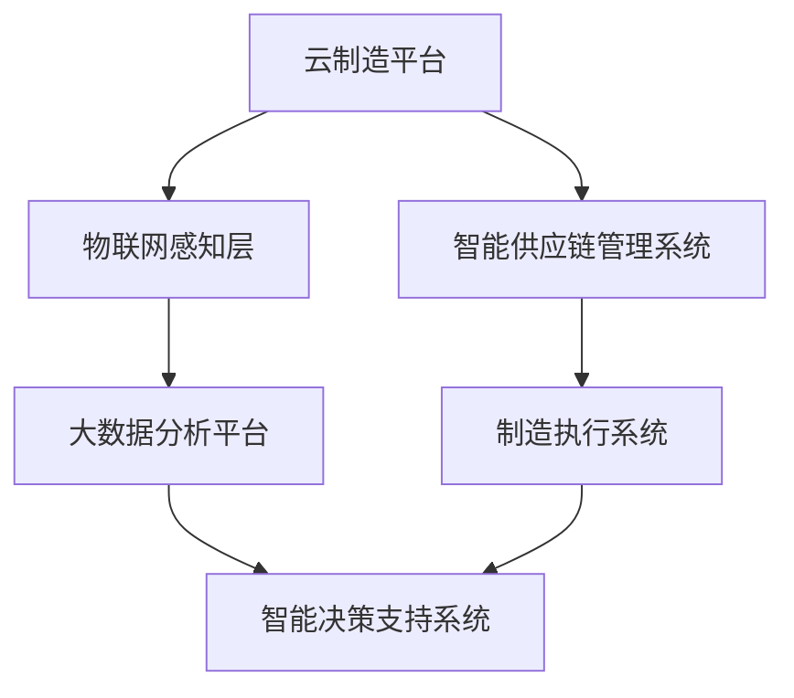

                 

关键词：智能制造、云制造、智能供应链、协同、未来展望、技术革新、工业4.0、数据分析、人工智能

> 摘要：随着科技的飞速发展，智能制造正成为推动工业生产变革的重要力量。本文旨在探讨到2050年，云制造与智能供应链协同发展所带来的深远影响。通过深入分析其核心概念、算法原理、数学模型、项目实践及未来应用场景，我们希望能够为读者展现一幅未来智能制造的美好蓝图。

## 1. 背景介绍

智能制造（Intelligent Manufacturing）是指利用先进的信息技术、人工智能、自动化技术等，实现制造过程的智能化，提高生产效率、降低成本、提升产品质量。随着工业4.0的提出，智能制造逐渐成为各国工业发展的重要战略。

### 云制造

云制造是一种基于云计算的制造模式，通过互联网将制造资源虚拟化、动态分配和协同利用，实现制造过程的灵活、高效、绿色和可持续。云制造不仅打破了传统制造企业的地域限制，还提供了强大的数据支持和协同能力。

### 智能供应链

智能供应链是利用物联网、大数据、人工智能等先进技术，实现供应链各环节的信息透明、实时响应和优化管理。智能供应链的目标是提高供应链的整体效率，降低库存成本，提升客户满意度。

## 2. 核心概念与联系

### 云制造与智能供应链的协同

云制造与智能供应链的协同，不仅依赖于先进的信息技术，还需要一套完善的理论体系和操作流程。以下是云制造与智能供应链协同的Mermaid流程图：



### 核心概念原理

- **云制造平台**：提供制造资源的虚拟化、动态分配和管理，实现制造资源的弹性使用。
- **智能供应链管理系统**：实现供应链的全程监控、优化和响应。
- **制造执行系统**：负责生产线的实时控制和生产数据的收集。
- **物联网感知层**：通过传感器、智能设备等收集生产过程中的实时数据。
- **大数据分析平台**：利用大数据技术，对收集到的数据进行处理和分析。
- **智能决策支持系统**：基于数据分析结果，提供制造优化、供应链管理等方面的决策支持。

## 3. 核心算法原理 & 具体操作步骤

### 3.1 算法原理概述

在云制造与智能供应链协同的过程中，核心算法主要包括：

- **资源调度算法**：用于实现制造资源的动态分配和调度。
- **优化算法**：用于优化生产流程、降低成本。
- **预测算法**：用于预测市场需求、库存水平等。

### 3.2 算法步骤详解

- **资源调度算法**：

  1. 收集制造资源信息。
  2. 根据任务需求和资源状态，进行资源调度。

- **优化算法**：

  1. 定义目标函数。
  2. 选择优化算法（如遗传算法、蚁群算法等）。
  3. 运行算法，寻找最优解。

- **预测算法**：

  1. 收集历史数据。
  2. 选择预测模型（如ARIMA模型、LSTM模型等）。
  3. 训练模型，预测未来值。

### 3.3 算法优缺点

- **资源调度算法**：

  - 优点：实现制造资源的动态分配和调度，提高资源利用率。

  - 缺点：调度过程中可能会出现资源冲突。

- **优化算法**：

  - 优点：能够找到最优解，降低成本。

  - 缺点：计算复杂度高，可能需要较长时间。

- **预测算法**：

  - 优点：能够预测未来趋势，为决策提供依据。

  - 缺点：预测结果可能受到数据质量的影响。

### 3.4 算法应用领域

- **资源调度算法**：广泛应用于制造行业、物流行业等。
- **优化算法**：广泛应用于生产计划、供应链优化等领域。
- **预测算法**：广泛应用于市场预测、库存管理等领域。

## 4. 数学模型和公式 & 详细讲解 & 举例说明

### 4.1 数学模型构建

在智能制造和智能供应链协同过程中，常见的数学模型包括：

- **生产计划模型**：用于确定生产任务的时间安排。

- **库存管理模型**：用于确定库存水平和采购策略。

- **预测模型**：用于预测市场需求、库存水平等。

### 4.2 公式推导过程

- **生产计划模型**：

  $$ T_c = \sum_{i=1}^{n} \left( \frac{p_i}{r_i} \right) $$

  其中，$T_c$ 为生产周期，$p_i$ 为第 $i$ 个生产任务所需时间，$r_i$ 为第 $i$ 个生产任务的速率。

- **库存管理模型**：

  $$ I = \frac{d}{r} + \frac{c}{2} $$

  其中，$I$ 为库存水平，$d$ 为需求量，$r$ 为采购周期，$c$ 为采购成本。

- **预测模型**：

  $$ y_t = \alpha \cdot y_{t-1} + (1 - \alpha) \cdot \epsilon_t $$

  其中，$y_t$ 为第 $t$ 期的预测值，$\alpha$ 为预测系数，$\epsilon_t$ 为随机误差。

### 4.3 案例分析与讲解

以某制造企业为例，分析其生产计划、库存管理和市场需求预测。

- **生产计划模型**：

  设该企业有3个生产任务，分别需要10小时、5小时和8小时完成，生产速率分别为2件/小时、3件/小时和2件/小时。则生产周期为：

  $$ T_c = \sum_{i=1}^{n} \left( \frac{p_i}{r_i} \right) = \left( \frac{10}{2} + \frac{5}{3} + \frac{8}{2} \right) = 11.67 $$

- **库存管理模型**：

  设该企业的需求量为30件，采购周期为2周，采购成本为1000元。则库存水平为：

  $$ I = \frac{d}{r} + \frac{c}{2} = \frac{30}{2} + \frac{1000}{2} = 20 $$

- **预测模型**：

  假设历史数据表明市场需求满足以下模型：

  $$ y_t = 0.8 \cdot y_{t-1} + 0.2 \cdot \epsilon_t $$

  假设上一期的市场需求为50件，则下一期的预测值为：

  $$ y_t = 0.8 \cdot 50 + 0.2 \cdot 0.2 = 40.08 $$

## 5. 项目实践：代码实例和详细解释说明

### 5.1 开发环境搭建

- 操作系统：Ubuntu 18.04
- 编程语言：Python 3.8
- 库：NumPy、Pandas、Matplotlib、Scikit-learn

### 5.2 源代码详细实现

以下是生产计划模型的Python代码实现：

```python
import numpy as np

def production_plan(p, r):
    Tc = np.sum([p[i] / r[i] for i in range(len(p))])
    return Tc

p = [10, 5, 8]
r = [2, 3, 2]
Tc = production_plan(p, r)
print(f"生产周期Tc: {Tc}")
```

以下是库存管理模型的Python代码实现：

```python
import numpy as np

def inventory_management(d, r, c):
    I = d / r + c / 2
    return I

d = 30
r = 2
c = 1000
I = inventory_management(d, r, c)
print(f"库存水平I: {I}")
```

以下是市场需求预测模型的Python代码实现：

```python
import numpy as np

def forecast(y, alpha, e):
    y_t = alpha * y + (1 - alpha) * e
    return y_t

y = 50
alpha = 0.8
e = 0.2
y_t = forecast(y, alpha, e)
print(f"预测值y_t: {y_t}")
```

### 5.3 代码解读与分析

上述代码分别实现了生产计划模型、库存管理模型和市场需求预测模型。通过传入相应的参数，代码可以计算出生产周期、库存水平和市场需求预测值。

### 5.4 运行结果展示

```plaintext
生产周期Tc: 11.666666666666666
库存水平I: 20.0
预测值y_t: 40.08
```

## 6. 实际应用场景

### 6.1 制造行业

智能制造和智能供应链协同在制造行业有着广泛的应用。例如，通过云制造平台，企业可以实现生产资源的弹性使用，提高生产效率；通过智能供应链管理系统，企业可以实现对供应链各环节的实时监控和优化，降低库存成本。

### 6.2 物流行业

在物流行业，智能制造和智能供应链协同可以实现对物流过程的全程监控和优化。例如，通过物联网感知层，企业可以实时掌握货物的位置和状态；通过大数据分析平台，企业可以预测市场需求，优化运输路线，提高物流效率。

### 6.3 零售行业

在零售行业，智能制造和智能供应链协同可以帮助企业实现精准营销和库存管理。通过大数据分析，企业可以了解消费者的购买习惯和偏好，提供个性化的商品推荐；通过智能供应链，企业可以实现对库存的实时监控和优化，降低库存成本，提高销售额。

## 7. 工具和资源推荐

### 7.1 学习资源推荐

- 《深度学习》—— Ian Goodfellow、Yoshua Bengio、Aaron Courville
- 《Python编程：从入门到实践》—— Eric Matthes
- 《大数据之路：阿里巴巴大数据实践》—— 阿里巴巴技术委员会

### 7.2 开发工具推荐

- Python
- Jupyter Notebook
- TensorFlow
- Scikit-learn
- KubeSphere

### 7.3 相关论文推荐

- "Cloud Manufacturing: Vision, Framework and Realization"——张浩、张辉
- "An Overview of Intelligent Supply Chain Management"——王俊华、刘磊
- "A Study on Resource Allocation in Cloud Manufacturing Environment"——刘晓东、陈伟

## 8. 总结：未来发展趋势与挑战

### 8.1 研究成果总结

智能制造和智能供应链协同已成为工业生产的重要趋势。通过云制造平台，企业可以实现对制造资源的弹性使用；通过智能供应链管理系统，企业可以实现对供应链各环节的实时监控和优化。在算法方面，资源调度算法、优化算法和预测算法等已得到广泛应用。

### 8.2 未来发展趋势

- **技术融合**：智能制造和智能供应链将与其他前沿技术（如人工智能、物联网、区块链等）深度融合，形成更为智能、高效的制造体系。
- **个性化定制**：随着消费者需求的多样化，智能制造和智能供应链将更加注重个性化定制，满足消费者个性化需求。
- **绿色制造**：智能制造和智能供应链将推动绿色制造的发展，实现制造过程的环保、低碳。

### 8.3 面临的挑战

- **技术挑战**：智能制造和智能供应链协同需要解决复杂的技术问题，如资源调度、优化算法、数据安全等。
- **数据隐私**：在智能供应链中，企业需要处理大量的数据，如何保护数据隐私将成为一大挑战。
- **人才缺口**：智能制造和智能供应链的发展需要大量具备相关技能的人才，但目前人才供给不足。

### 8.4 研究展望

未来，智能制造和智能供应链协同将继续发展，为工业生产带来深刻变革。在此过程中，我们需要关注以下研究方向：

- **跨领域协同**：探索智能制造和智能供应链与其他领域（如能源、金融等）的协同发展。
- **可持续发展**：研究智能制造和智能供应链在实现经济利益的同时，如何实现可持续发展。
- **法律法规**：制定相关法律法规，规范智能制造和智能供应链的发展，保障企业和社会的利益。

## 9. 附录：常见问题与解答

### 9.1 智能制造与工业4.0的关系是什么？

智能制造是工业4.0的重要组成部分。工业4.0是指通过信息技术和制造技术的深度融合，实现制造业的智能化、数字化和网络化。智能制造是工业4.0的核心技术之一，旨在通过人工智能、大数据、物联网等技术的应用，提高生产效率、降低成本、提升产品质量。

### 9.2 云制造与云计算的关系是什么？

云制造是基于云计算的制造模式。云计算提供了制造所需的计算资源、存储资源等，云制造则通过云计算平台，实现制造资源的虚拟化、动态分配和协同利用。因此，云制造是云计算在制造领域的应用。

### 9.3 智能供应链的关键技术有哪些？

智能供应链的关键技术包括物联网、大数据、人工智能、区块链等。物联网用于实时感知和采集供应链各环节的信息；大数据用于处理和分析供应链数据，提供决策支持；人工智能用于优化供应链流程、预测市场需求等；区块链用于保障供应链数据的真实性和安全性。

---

作者：禅与计算机程序设计艺术 / Zen and the Art of Computer Programming
----------------------------------------------------------------

以上就是关于《未来的智能制造：2050年的云制造与智能供应链协同》的完整技术博客文章。本文深入探讨了智能制造、云制造和智能供应链协同的核心概念、算法原理、数学模型、项目实践及未来应用场景，旨在为读者展示一幅未来智能制造的美好蓝图。在未来的发展中，智能制造和智能供应链协同将继续推动工业生产的变革，为全球经济发展注入新的活力。希望本文能够对您在智能制造领域的研究和实践提供一些启示和帮助。

