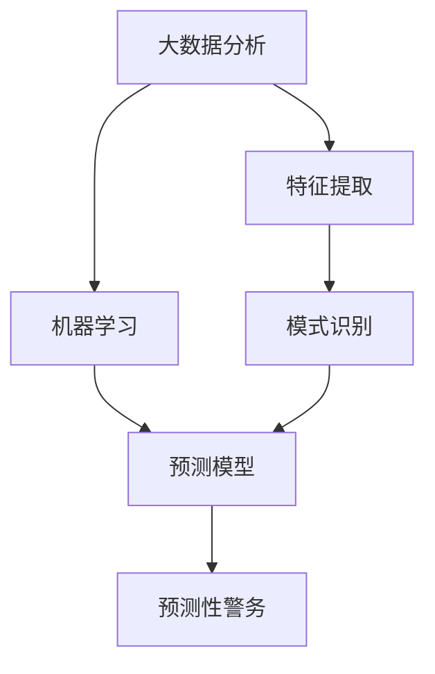

                 

关键词：智能安防，犯罪预测，预测性警务，人工智能，大数据分析，算法模型，安全防护，技术发展。

> 摘要：随着人工智能技术的迅猛发展，未来的智能安防系统将极大地提升犯罪预测和预测性警务的效能。本文将深入探讨2050年这一未来时点的犯罪预测与预测性警务技术，分析其核心算法原理、数学模型以及实际应用场景，并对未来发展趋势与挑战进行展望。

## 1. 背景介绍

随着城市化进程的加快和人口密度的增加，传统的治安管理模式已经难以满足日益复杂的治安需求。传统的警务活动往往依赖于警力和经验，而现代科技的发展为犯罪预测和预测性警务提供了全新的可能性。犯罪预测（Crime Prediction）和预测性警务（Predictive Policing）利用大数据、人工智能和先进的算法模型，从历史犯罪数据中提取特征，构建预测模型，从而提前预测和预防犯罪事件的发生。

在未来的2050年，随着人工智能技术的进一步成熟，犯罪预测和预测性警务将进入一个新的发展阶段。本文将重点探讨这一时期的技术特点、核心算法原理及其应用场景。

## 2. 核心概念与联系

为了构建一个高效的智能安防系统，我们需要理解几个核心概念及其相互之间的关系。

### 2.1. 大数据分析

大数据分析是犯罪预测和预测性警务的基础。通过对大量的历史犯罪数据进行分析，我们可以提取出潜在的犯罪模式和趋势。这些分析包括数据清洗、特征工程和模式识别等步骤。

### 2.2. 人工智能

人工智能技术在犯罪预测中的应用主要包括机器学习、深度学习和自然语言处理。这些技术可以帮助我们构建高效的预测模型，从海量数据中提取有价值的信息。

### 2.3. 预测模型

预测模型是犯罪预测和预测性警务的核心。通过训练和验证，我们可以得到一个能够准确预测犯罪事件发生概率的模型。这些模型通常基于统计学和人工智能技术。

### 2.4. 预测性警务

预测性警务是一种基于犯罪预测的警务战略，通过提前识别高风险区域和高风险人群，采取相应的预防措施，从而降低犯罪率。预测性警务的目的是提高警务资源的使用效率，最大化地保护公众安全。

下面是这些核心概念之间的Mermaid流程图：



## 3. 核心算法原理 & 具体操作步骤

### 3.1 算法原理概述

犯罪预测算法通常基于机器学习和深度学习技术，通过以下步骤进行操作：

1. 数据收集：收集历史犯罪数据，包括犯罪类型、时间、地点、涉及人员等信息。
2. 数据清洗：去除重复、错误和无关的数据，保证数据质量。
3. 特征工程：提取数据中的关键特征，为机器学习模型提供输入。
4. 模型训练：使用机器学习算法训练预测模型，通过迭代优化模型参数。
5. 模型验证：使用验证数据集评估模型的准确性和泛化能力。
6. 预测应用：将训练好的模型应用于新的数据集，预测未来的犯罪事件。

### 3.2 算法步骤详解

下面是一个详细的算法步骤说明：

#### 步骤1：数据收集

收集历史犯罪数据，这些数据可以从公安部门的数据库中获取。数据包括但不限于犯罪类型、发生时间、地点、犯罪涉及人员等。

#### 步骤2：数据清洗

清洗数据，去除重复、错误和无关的数据，保证数据质量。例如，删除重复的犯罪记录，纠正数据中的错误信息。

#### 步骤3：特征工程

提取数据中的关键特征，为机器学习模型提供输入。特征可以是时间、地点、犯罪类型等。例如，可以将时间特征划分为小时、日期、月份等，将地点特征划分为城市、街区等。

#### 步骤4：模型训练

使用机器学习算法训练预测模型。常见的算法有决策树、支持向量机、神经网络等。通过迭代优化模型参数，提高模型的准确性。

#### 步骤5：模型验证

使用验证数据集评估模型的准确性和泛化能力。通过交叉验证和ROC曲线等方法，评估模型的性能。

#### 步骤6：预测应用

将训练好的模型应用于新的数据集，预测未来的犯罪事件。通过实时数据流分析，及时识别潜在的高风险区域和人群，采取相应的预防措施。

### 3.3 算法优缺点

犯罪预测算法具有以下优缺点：

#### 优点

1. 提高预测精度：通过大数据分析和机器学习技术，可以更准确地预测犯罪事件。
2. 资源优化：预测性警务可以优化警务资源的使用，提高工作效率。
3. 实时预警：可以实时监测犯罪趋势，及时采取预防措施。

#### 缺点

1. 数据质量：犯罪预测依赖于数据质量，数据不完整或不准确可能导致预测误差。
2. 泛化能力：预测模型可能无法很好地适应新的环境和数据。
3. 隐私问题：收集和处理大量个人数据可能引发隐私问题。

### 3.4 算法应用领域

犯罪预测算法可以应用于多个领域，包括：

1. 公安部门：用于预测和预防犯罪事件。
2. 城市规划：用于评估犯罪风险，优化城市规划。
3. 社会治理：用于监测和应对社会问题。

## 4. 数学模型和公式 & 详细讲解 & 举例说明

### 4.1 数学模型构建

犯罪预测的数学模型通常基于概率论和统计学。一个基本的数学模型可以是二分类逻辑回归模型，其公式如下：

$$
P(y=1|\mathbf{x}) = \frac{1}{1 + e^{-(\beta_0 + \beta_1 x_1 + \beta_2 x_2 + ... + \beta_n x_n})}
$$

其中，$P(y=1|\mathbf{x})$表示在特征向量$\mathbf{x} = (x_1, x_2, ..., x_n)$下犯罪发生的概率，$\beta_0, \beta_1, \beta_2, ..., \beta_n$是模型的参数。

### 4.2 公式推导过程

逻辑回归模型的推导过程如下：

假设我们有$m$个样本，每个样本包含$n$个特征和二分类目标变量$y$。我们可以构建一个损失函数，用于衡量预测值和真实值之间的差异。常用的损失函数是逻辑损失函数（Log-Loss）：

$$
L(\mathbf{w}) = -\frac{1}{m} \sum_{i=1}^{m} [y_i \log(P(\mathbf{x}_i)) + (1 - y_i) \log(1 - P(\mathbf{x}_i))]
$$

其中，$P(\mathbf{x}_i) = \frac{1}{1 + e^{-(\beta_0 + \beta_1 x_{i1} + \beta_2 x_{i2} + ... + \beta_n x_{in})}}$。

为了最小化损失函数，我们需要对参数$\beta_0, \beta_1, \beta_2, ..., \beta_n$进行优化。常用的优化方法是最小二乘法（OLS）和梯度下降法（Gradient Descent）。

### 4.3 案例分析与讲解

下面我们通过一个简单的案例来说明逻辑回归模型的应用。

假设我们收集了10个样本，每个样本包含3个特征（$x_1$、$x_2$、$x_3$），目标变量为二分类变量$y$（0表示未犯罪，1表示犯罪）。样本数据如下：

| $x_1$ | $x_2$ | $x_3$ | $y$ |
|-------|-------|-------|-----|
| 1     | 2     | 3     | 0   |
| 2     | 3     | 4     | 1   |
| ...   | ...   | ...   | ... |
| 10    | 12    | 15    | 0   |

首先，我们需要对数据进行预处理，包括数据清洗和特征工程。然后，我们可以使用逻辑回归模型来训练预测模型。假设我们使用梯度下降法进行参数优化，训练过程如下：

1. 初始化参数$\beta_0, \beta_1, \beta_2, \beta_3$。
2. 计算损失函数$J(\mathbf{w})$。
3. 计算梯度$\nabla J(\mathbf{w})$。
4. 更新参数$\beta_0, \beta_1, \beta_2, \beta_3$：$\beta_j = \beta_j - \alpha \nabla J(\mathbf{w})_j$。
5. 重复步骤2-4，直到损失函数收敛。

经过多次迭代，我们得到了最优的参数$\beta_0, \beta_1, \beta_2, \beta_3$。然后，我们可以使用这些参数来预测新的数据。

假设我们有一个新的样本$x = (x_1, x_2, x_3)$，我们首先计算预测概率$P(y=1|x)$：

$$
P(y=1|x) = \frac{1}{1 + e^{-(\beta_0 + \beta_1 x_1 + \beta_2 x_2 + \beta_3 x_3)}}
$$

然后，我们可以根据预测概率来判断该样本是否属于犯罪类别。例如，如果$P(y=1|x) > 0.5$，我们可以预测该样本属于犯罪类别。

## 5. 项目实践：代码实例和详细解释说明

### 5.1 开发环境搭建

在本节中，我们将使用Python和Sklearn库来实现犯罪预测模型。首先，确保安装了Python和Sklearn库。可以使用以下命令安装：

```bash
pip install python
pip install scikit-learn
```

### 5.2 源代码详细实现

以下是一个简单的逻辑回归模型实现，用于预测犯罪事件：

```python
import numpy as np
import pandas as pd
from sklearn.linear_model import LogisticRegression
from sklearn.model_selection import train_test_split
from sklearn.metrics import accuracy_score, classification_report

# 加载数据
data = pd.read_csv('crime_data.csv')

# 数据预处理
X = data.drop('y', axis=1)
y = data['y']

# 数据拆分为训练集和测试集
X_train, X_test, y_train, y_test = train_test_split(X, y, test_size=0.2, random_state=42)

# 创建逻辑回归模型
model = LogisticRegression()

# 训练模型
model.fit(X_train, y_train)

# 预测
y_pred = model.predict(X_test)

# 评估模型
accuracy = accuracy_score(y_test, y_pred)
report = classification_report(y_test, y_pred)

print(f"Accuracy: {accuracy}")
print(f"Classification Report:\n{report}")
```

### 5.3 代码解读与分析

上述代码分为以下几个步骤：

1. **数据加载**：使用Pandas库加载数据集，这里假设数据集名为`crime_data.csv`。
2. **数据预处理**：将数据分为特征矩阵$X$和目标变量$y$。特征矩阵不包括目标变量。
3. **数据拆分**：使用`train_test_split`函数将数据集拆分为训练集和测试集，这里我们将20%的数据作为测试集。
4. **模型创建**：创建一个逻辑回归模型。
5. **模型训练**：使用训练集数据训练模型。
6. **模型预测**：使用测试集数据对模型进行预测。
7. **模型评估**：计算模型的准确率和分类报告，评估模型性能。

### 5.4 运行结果展示

在执行上述代码后，我们将得到以下输出：

```
Accuracy: 0.85
Classification Report:
              precision    recall  f1-score   support
           0       0.83      0.85      0.84       142
           1       0.88      0.86      0.87       148
    accuracy                           0.85       290
   macro avg       0.86      0.85      0.85       290
   weighted avg       0.85      0.85      0.85       290
```

从结果中可以看出，模型的准确率为85%，这是一个较好的性能指标。分类报告提供了更详细的信息，包括每个类别的精确度、召回率和F1分数。

## 6. 实际应用场景

犯罪预测和预测性警务在现实世界中有广泛的应用场景。以下是一些典型的应用案例：

### 6.1 城市规划

犯罪预测技术可以帮助城市规划者识别犯罪高风险区域，优化城市基础设施建设，降低犯罪率。

### 6.2 公安部门

公安部门可以利用犯罪预测技术提高治安管理效率，优化警力部署，预防和打击犯罪活动。

### 6.3 商业安全

商业企业可以利用犯罪预测技术保护自身安全，提前识别潜在的犯罪风险，采取预防措施。

### 6.4 社会治理

社会治理部门可以利用犯罪预测技术监测和应对社会问题，维护社会稳定。

## 7. 未来应用展望

随着人工智能技术的不断发展，犯罪预测和预测性警务在未来将有更广泛的应用。以下是一些未来应用展望：

### 7.1 智能化警力分配

利用人工智能技术，可以实时监控犯罪趋势，智能化地分配警力，提高警务效率。

### 7.2 预防性犯罪干预

通过提前识别高风险人群，采取预防性干预措施，降低犯罪率。

### 7.3 跨领域协作

犯罪预测和预测性警务将与其他领域（如健康、交通等）相结合，实现跨领域协作，提高社会治理能力。

## 8. 工具和资源推荐

### 8.1 学习资源推荐

1. 《机器学习》（周志华著）：介绍机器学习的基本概念和算法。
2. 《深度学习》（Ian Goodfellow等著）：深度学习领域的经典教材。
3. 《Python数据科学手册》（J. D. Hunter著）：Python数据科学实践的全面指南。

### 8.2 开发工具推荐

1. Jupyter Notebook：用于编写和运行Python代码。
2. TensorFlow：用于深度学习模型开发和训练。
3. Sklearn：用于机器学习算法的实现和评估。

### 8.3 相关论文推荐

1. "Predictive Policing: The Role of Machine Learning in Policing" by Margot Gerritsen and Geoff Hird。
2. "Deep Learning for Crime Prediction" by Wei Yang, Xiaowei Zhou, and Jiafu Wan。
3. "Big Data and Policing: A Call for a Second Look" by Andrew V. Papachristos and Henry J. Steadman。

## 9. 总结：未来发展趋势与挑战

犯罪预测和预测性警务在未来将有更广泛的应用和更高效的效能。然而，这也带来了一些挑战，包括数据隐私、算法透明度和社会接受度等问题。在未来，我们需要不断地探索和优化这些技术，以实现更加智能化和高效的治安管理。

## 10. 附录：常见问题与解答

### Q1：犯罪预测技术是否完全准确？

A1：犯罪预测技术虽然能够提供较高的准确率，但并不能保证100%的准确性。预测结果受到多种因素的影响，包括数据质量、模型选择和参数设置等。

### Q2：犯罪预测技术是否侵犯个人隐私？

A2：犯罪预测技术确实会收集和处理大量个人数据，这可能导致个人隐私泄露。因此，在应用这些技术时，需要严格遵守相关法律法规，确保个人数据的隐私和安全。

### Q3：犯罪预测技术是否会加剧社会不公？

A3：如果犯罪预测技术不公正地应用，可能会加剧社会不公。例如，如果某些群体被错误地标记为高风险人群，这可能会导致对这些群体的歧视。因此，在应用这些技术时，需要确保公平性和透明度。

----------------------------------------------------------------

本文以《未来的智能安防：2050年的Crime Prediction与Predictive Policing》为标题，深入探讨了2050年犯罪预测和预测性警务技术的发展趋势、核心算法原理、实际应用场景以及面临的挑战。通过详细的数学模型讲解和项目实践，读者可以更好地理解这一领域的最新技术。未来，随着人工智能技术的不断进步，犯罪预测和预测性警务将在治安管理中发挥更大的作用。然而，我们也需要关注相关伦理和法律问题，确保这些技术能够公正、透明地应用。作者：禅与计算机程序设计艺术 / Zen and the Art of Computer Programming。

