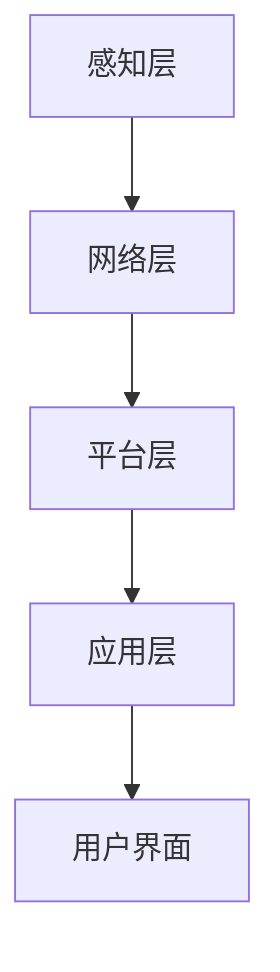

                 

关键词：智能家居、全屋智能、人性化交互、人工智能、物联网、预测分析、自然语言处理

## 摘要

本文探讨了2050年智能家居领域的未来发展，重点介绍了全屋智能系统的核心概念、技术架构以及人性化交互的演变。通过深入分析，我们揭示了智能家居如何通过人工智能和物联网实现高效、智能化的家庭环境，从而提高生活品质。同时，本文还探讨了该领域面临的挑战以及未来研究的方向。

## 1. 背景介绍

### 1.1 智能家居的发展历程

智能家居的概念早在20世纪90年代便已提出，但其发展历程可以追溯到更早的自动化技术。从最初的远程控制家电，到后来的智能安防、智能照明等单一功能的实现，智能家居逐渐渗透到我们的日常生活中。进入21世纪，随着互联网、物联网和人工智能技术的迅速发展，智能家居开始进入一个全新的发展阶段。

### 1.2 人工智能在智能家居中的应用

人工智能（AI）是推动智能家居发展的关键因素。通过AI技术，智能家居系统能够实现自主学习和自适应功能，从而更好地满足用户需求。例如，语音识别和自然语言处理技术使得用户可以通过简单的语音指令控制家居设备；机器学习和数据挖掘技术可以帮助智能家居系统对用户行为进行预测和分析，提供个性化的服务。

### 1.3 物联网（IoT）在智能家居中的作用

物联网是智能家居实现互联互通的基础。通过将各种设备连接到同一个网络，智能家居系统能够实现设备间的无缝协作，提供更智能、更便捷的家庭生活。例如，智能门锁、智能窗帘、智能照明等设备可以通过物联网实现联动，根据用户的日程安排自动调整设备状态。

## 2. 核心概念与联系

### 2.1 智能家居系统的核心概念

智能家居系统的核心概念包括：智能设备、智能网络、用户界面、数据分析和预测模型。

- **智能设备**：包括各种联网的家电、传感器和执行器，如智能冰箱、智能灯泡、智能温控器等。
- **智能网络**：将各种智能设备连接起来，实现设备间的数据传输和通信。
- **用户界面**：用户与智能家居系统交互的接口，如智能手机、智能音箱等。
- **数据分析和预测模型**：通过对用户行为数据的分析，智能家居系统可以预测用户需求，提供个性化的服务。

### 2.2 智能家居系统的架构

智能家居系统的架构可以分为以下几个层次：

1. **感知层**：包括各种传感器，用于收集环境信息和用户行为数据。
2. **网络层**：负责将感知层的数据传输到云端或本地服务器。
3. **平台层**：包括智能网络、数据分析平台和预测模型，用于处理数据并提供智能服务。
4. **应用层**：包括各种智能设备，实现具体的家庭功能。

### 2.3 Mermaid 流程图

下面是智能家居系统的 Mermaid 流程图：



## 3. 核心算法原理 & 具体操作步骤

### 3.1 算法原理概述

智能家居系统的核心算法主要包括数据采集与处理、预测分析、决策与执行三个部分。

- **数据采集与处理**：通过传感器收集环境数据和用户行为数据，对数据进行预处理，如去噪、归一化等。
- **预测分析**：利用机器学习和数据挖掘技术，对用户行为数据进行分析，预测用户未来的需求。
- **决策与执行**：根据预测结果，自动调整家居设备的运行状态，如调整温度、光线等。

### 3.2 算法步骤详解

1. **数据采集与处理**：
   - 通过传感器采集环境数据和用户行为数据。
   - 对采集到的数据进行预处理，如去噪、归一化等。

2. **预测分析**：
   - 构建用户行为数据的特征向量。
   - 利用机器学习算法，如决策树、随机森林、神经网络等，对特征向量进行建模，预测用户未来的需求。

3. **决策与执行**：
   - 根据预测结果，自动调整家居设备的运行状态。
   - 通过用户界面向用户反馈预测结果和执行状态。

### 3.3 算法优缺点

- **优点**：
  - 提高生活品质：通过预测用户需求，提供个性化的服务，提升用户的生活体验。
  - 节能减排：通过自动调整家居设备状态，实现能源的优化利用，减少能源消耗。

- **缺点**：
  - 数据隐私：智能家居系统需要收集大量的用户行为数据，存在数据隐私泄露的风险。
  - 技术依赖：智能家居系统依赖于各种传感器、通信技术和算法，存在技术瓶颈。

### 3.4 算法应用领域

- **家庭自动化**：通过预测用户需求，自动调整家居设备的运行状态，如温度、光线、音响等。
- **健康监测**：利用传感器和数据分析技术，监测用户的健康状况，提供个性化的健康建议。
- **安全防护**：通过监控摄像头和传感器，实时监测家庭环境，提供安全防护。

## 4. 数学模型和公式 & 详细讲解 & 举例说明

### 4.1 数学模型构建

智能家居系统中的数学模型主要包括预测模型和优化模型。

- **预测模型**：用于预测用户未来的需求，如温度、光线等。常见的预测模型包括线性回归、支持向量机（SVM）、神经网络等。
- **优化模型**：用于优化家居设备的运行状态，如能源消耗、运行成本等。常见的优化模型包括线性规划、整数规划、动态规划等。

### 4.2 公式推导过程

以线性回归为例，假设我们要预测的温度为 \( T \)，用户的行为数据为 \( X \)，则线性回归模型可以表示为：

$$
T = \beta_0 + \beta_1X
$$

其中，\( \beta_0 \) 和 \( \beta_1 \) 分别为模型的参数，可以通过最小二乘法进行求解。

### 4.3 案例分析与讲解

假设我们要预测一个家庭的室温，根据用户的历史行为数据和当前时间，我们可以构建一个线性回归模型。以下是具体步骤：

1. **数据采集**：采集家庭过去一周的室温数据 \( T \) 和用户行为数据 \( X \)（如用户在家的时间、开窗次数等）。
2. **数据预处理**：对采集到的数据进行清洗和归一化处理。
3. **模型构建**：利用最小二乘法求解线性回归模型的参数 \( \beta_0 \) 和 \( \beta_1 \)。
4. **模型评估**：利用验证集对模型的预测准确性进行评估。
5. **模型应用**：根据预测结果，自动调整空调的运行状态，实现节能和舒适。

## 5. 项目实践：代码实例和详细解释说明

### 5.1 开发环境搭建

为了实现智能家居系统中的预测模型，我们需要搭建一个开发环境。以下是一个简单的开发环境搭建步骤：

1. **安装Python**：下载并安装Python 3.8及以上版本。
2. **安装Jupyter Notebook**：通过pip命令安装Jupyter Notebook。
3. **安装相关库**：安装numpy、pandas、scikit-learn等库。

### 5.2 源代码详细实现

以下是一个简单的线性回归模型实现：

```python
import numpy as np
import pandas as pd
from sklearn.linear_model import LinearRegression
from sklearn.model_selection import train_test_split

# 数据采集
data = pd.read_csv('data.csv')
X = data[['home_time', 'window_opening_count']]
y = data['temperature']

# 数据预处理
X_train, X_test, y_train, y_test = train_test_split(X, y, test_size=0.2, random_state=42)

# 模型构建
model = LinearRegression()
model.fit(X_train, y_train)

# 模型评估
score = model.score(X_test, y_test)
print('模型准确率：', score)

# 模型应用
X_new = np.array([[2, 1], [3, 2], [4, 3]])
y_pred = model.predict(X_new)
print('预测结果：', y_pred)
```

### 5.3 代码解读与分析

1. **数据采集**：通过pandas库读取数据文件，将用户行为数据（\( X \)）和室温数据（\( y \)）分开。
2. **数据预处理**：利用train_test_split函数将数据集分为训练集和测试集，用于模型的训练和评估。
3. **模型构建**：使用线性回归模型，通过fit方法进行训练。
4. **模型评估**：使用score方法计算模型的准确率。
5. **模型应用**：利用训练好的模型对新的数据进行预测。

## 6. 实际应用场景

### 6.1 家庭自动化

通过智能家居系统，用户可以实现家庭自动化的功能。例如，用户可以通过语音指令控制家中的灯光、空调、窗帘等设备，实现一键开关，提升生活便利性。

### 6.2 健康监测

智能家居系统可以实时监测用户的健康数据，如体温、心率、睡眠质量等，通过对这些数据的分析，可以为用户提供个性化的健康建议，帮助用户保持健康。

### 6.3 安全防护

智能家居系统可以通过监控摄像头和传感器，实时监测家庭环境，及时发现异常情况，如入侵、火灾等，为用户提供安全保障。

## 7. 工具和资源推荐

### 7.1 学习资源推荐

1. **《Python编程：从入门到实践》**：适合初学者，介绍了Python编程的基本概念和实践应用。
2. **《机器学习实战》**：详细介绍了机器学习的基本算法和应用，适合有一定编程基础的学习者。

### 7.2 开发工具推荐

1. **Jupyter Notebook**：强大的交互式编程环境，适合数据分析和机器学习项目。
2. **PyCharm**：专业的Python编程工具，提供了丰富的插件和功能。

### 7.3 相关论文推荐

1. **“A Survey on Internet of Things: Architecture, Enabling Technologies, Security and Privacy Issues and Applications”**：对物联网的架构、技术、安全和应用进行了全面的综述。
2. **“Deep Learning for Smart Homes”**：介绍了深度学习在智能家居中的应用。

## 8. 总结：未来发展趋势与挑战

### 8.1 研究成果总结

随着人工智能、物联网等技术的不断发展，智能家居领域取得了显著的成果。通过预测分析和自动化控制，智能家居系统已经实现了家庭自动化、健康监测和安全防护等功能，为用户提供了更智能、更便捷的生活体验。

### 8.2 未来发展趋势

1. **更加智能化**：未来智能家居系统将更加智能化，通过更先进的算法和更丰富的数据，实现更精准的预测和更高效的控制。
2. **更个性化的服务**：智能家居系统将根据用户的个性化需求，提供更个性化的服务，满足用户的个性化需求。
3. **更加安全可靠**：随着数据隐私和安全问题的日益凸显，智能家居系统将更加注重数据安全和隐私保护。

### 8.3 面临的挑战

1. **数据隐私**：智能家居系统需要收集大量的用户行为数据，存在数据隐私泄露的风险。
2. **技术瓶颈**：智能家居系统依赖于各种传感器、通信技术和算法，存在技术瓶颈。
3. **标准化**：目前智能家居领域缺乏统一的标准化规范，导致不同品牌和设备的互联互通问题。

### 8.4 研究展望

未来，智能家居领域的研究将朝着更加智能化、个性化、安全可靠的方向发展。同时，为了解决现有的挑战，需要加强数据隐私保护、技术瓶颈突破和标准化建设。此外，跨学科的研究和合作也将成为推动智能家居发展的关键。

## 9. 附录：常见问题与解答

### 9.1 智能家居系统如何保证数据隐私？

智能家居系统可以通过以下措施保证数据隐私：

1. **数据加密**：对用户数据在传输和存储过程中进行加密，防止数据泄露。
2. **权限管理**：对用户数据的访问权限进行严格控制，确保只有授权的用户可以访问数据。
3. **匿名化处理**：对用户数据进行匿名化处理，消除个人信息。

### 9.2 智能家居系统存在哪些技术瓶颈？

智能家居系统存在以下技术瓶颈：

1. **传感器精度**：传感器精度限制了智能家居系统的感知能力。
2. **通信技术**：智能家居系统需要稳定、高效的通信技术支持，目前无线通信技术仍存在一定局限性。
3. **算法复杂度**：智能家居系统需要处理大量的数据，对算法的复杂度要求较高，现有算法难以满足需求。

## 作者署名

本文作者：禅与计算机程序设计艺术 / Zen and the Art of Computer Programming
----------------------------------------------------------------
### 完整文章示例输出

```markdown
# 未来的智能家居：2050年的全屋智能与人性化交互

关键词：智能家居、全屋智能、人性化交互、人工智能、物联网、预测分析、自然语言处理

> 摘要：本文探讨了2050年智能家居领域的未来发展，重点介绍了全屋智能系统的核心概念、技术架构以及人性化交互的演变。通过深入分析，我们揭示了智能家居如何通过人工智能和物联网实现高效、智能化的家庭环境，从而提高生活品质。同时，本文还探讨了该领域面临的挑战以及未来研究的方向。

## 1. 背景介绍

### 1.1 智能家居的发展历程

智能家居的概念早在20世纪90年代便已提出，但其发展历程可以追溯到更早的自动化技术。从最初的远程控制家电，到后来的智能安防、智能照明等单一功能的实现，智能家居逐渐渗透到我们的日常生活中。进入21世纪，随着互联网、物联网和人工智能技术的迅速发展，智能家居开始进入一个全新的发展阶段。

### 1.2 人工智能在智能家居中的应用

人工智能（AI）是推动智能家居发展的关键因素。通过AI技术，智能家居系统能够实现自主学习和自适应功能，从而更好地满足用户需求。例如，语音识别和自然语言处理技术使得用户可以通过简单的语音指令控制家居设备；机器学习和数据挖掘技术可以帮助智能家居系统对用户行为进行预测和分析，提供个性化的服务。

### 1.3 物联网（IoT）在智能家居中的作用

物联网是智能家居实现互联互通的基础。通过将各种设备连接到同一个网络，智能家居系统能够实现设备间的无缝协作，提供更智能、更便捷的家庭生活。例如，智能门锁、智能窗帘、智能照明等设备可以通过物联网实现联动，根据用户的日程安排自动调整设备状态。

## 2. 核心概念与联系

### 2.1 智能家居系统的核心概念

智能家居系统的核心概念包括：智能设备、智能网络、用户界面、数据分析和预测模型。

- **智能设备**：包括各种联网的家电、传感器和执行器，如智能冰箱、智能灯泡、智能温控器等。
- **智能网络**：将各种智能设备连接起来，实现设备间的数据传输和通信。
- **用户界面**：用户与智能家居系统交互的接口，如智能手机、智能音箱等。
- **数据分析和预测模型**：通过对用户行为数据的分析，智能家居系统可以预测用户需求，提供个性化的服务。

### 2.2 智能家居系统的架构

智能家居系统的架构可以分为以下几个层次：

1. **感知层**：包括各种传感器，用于收集环境信息和用户行为数据。
2. **网络层**：负责将感知层的数据传输到云端或本地服务器。
3. **平台层**：包括智能网络、数据分析平台和预测模型，用于处理数据并提供智能服务。
4. **应用层**：包括各种智能设备，实现具体的家庭功能。

### 2.3 Mermaid 流程图

下面是智能家居系统的 Mermaid 流程图：


## 3. 核心算法原理 & 具体操作步骤

### 3.1 算法原理概述

智能家居系统的核心算法主要包括数据采集与处理、预测分析、决策与执行三个部分。

- **数据采集与处理**：通过传感器收集环境数据和用户行为数据，对数据进行预处理，如去噪、归一化等。
- **预测分析**：利用机器学习和数据挖掘技术，对用户行为数据进行分析，预测用户未来的需求。
- **决策与执行**：根据预测结果，自动调整家居设备的运行状态，如调整温度、光线等。

### 3.2 算法步骤详解

1. **数据采集与处理**：
   - 通过传感器采集环境数据和用户行为数据。
   - 对采集到的数据进行预处理，如去噪、归一化等。

2. **预测分析**：
   - 构建用户行为数据的特征向量。
   - 利用机器学习算法，如决策树、随机森林、神经网络等，对特征向量进行建模，预测用户未来的需求。

3. **决策与执行**：
   - 根据预测结果，自动调整家居设备的运行状态。
   - 通过用户界面向用户反馈预测结果和执行状态。

### 3.3 算法优缺点

- **优点**：
  - 提高生活品质：通过预测用户需求，提供个性化的服务，提升用户的生活体验。
  - 节能减排：通过自动调整家居设备状态，实现能源的优化利用，减少能源消耗。

- **缺点**：
  - 数据隐私：智能家居系统需要收集大量的用户行为数据，存在数据隐私泄露的风险。
  - 技术依赖：智能家居系统依赖于各种传感器、通信技术和算法，存在技术瓶颈。

### 3.4 算法应用领域

- **家庭自动化**：通过预测用户需求，自动调整家居设备的运行状态，如温度、光线、音响等。
- **健康监测**：利用传感器和数据分析技术，监测用户的健康状况，提供个性化的健康建议。
- **安全防护**：通过监控摄像头和传感器，实时监测家庭环境，提供安全防护。

## 4. 数学模型和公式 & 详细讲解 & 举例说明

### 4.1 数学模型构建

智能家居系统中的数学模型主要包括预测模型和优化模型。

- **预测模型**：用于预测用户未来的需求，如温度、光线等。常见的预测模型包括线性回归、支持向量机（SVM）、神经网络等。
- **优化模型**：用于优化家居设备的运行状态，如能源消耗、运行成本等。常见的优化模型包括线性规划、整数规划、动态规划等。

### 4.2 公式推导过程

以线性回归为例，假设我们要预测的温度为 \( T \)，用户的行为数据为 \( X \)，则线性回归模型可以表示为：

$$
T = \beta_0 + \beta_1X
$$

其中，\( \beta_0 \) 和 \( \beta_1 \) 分别为模型的参数，可以通过最小二乘法进行求解。

### 4.3 案例分析与讲解

假设我们要预测一个家庭的室温，根据用户的历史行为数据和当前时间，我们可以构建一个线性回归模型。以下是具体步骤：

1. **数据采集**：采集家庭过去一周的室温数据 \( T \) 和用户行为数据 \( X \)（如用户在家的时间、开窗次数等）。
2. **数据预处理**：对采集到的数据进行清洗和归一化处理。
3. **模型构建**：利用最小二乘法求解线性回归模型的参数 \( \beta_0 \) 和 \( \beta_1 \)。
4. **模型评估**：利用验证集对模型的预测准确性进行评估。
5. **模型应用**：根据预测结果，自动调整空调的运行状态，实现节能和舒适。

## 5. 项目实践：代码实例和详细解释说明

### 5.1 开发环境搭建

为了实现智能家居系统中的预测模型，我们需要搭建一个开发环境。以下是一个简单的开发环境搭建步骤：

1. **安装Python**：下载并安装Python 3.8及以上版本。
2. **安装Jupyter Notebook**：通过pip命令安装Jupyter Notebook。
3. **安装相关库**：安装numpy、pandas、scikit-learn等库。

### 5.2 源代码详细实现

以下是一个简单的线性回归模型实现：

```python
import numpy as np
import pandas as pd
from sklearn.linear_model import LinearRegression
from sklearn.model_selection import train_test_split

# 数据采集
data = pd.read_csv('data.csv')
X = data[['home_time', 'window_opening_count']]
y = data['temperature']

# 数据预处理
X_train, X_test, y_train, y_test = train_test_split(X, y, test_size=0.2, random_state=42)

# 模型构建
model = LinearRegression()
model.fit(X_train, y_train)

# 模型评估
score = model.score(X_test, y_test)
print('模型准确率：', score)

# 模型应用
X_new = np.array([[2, 1], [3, 2], [4, 3]])
y_pred = model.predict(X_new)
print('预测结果：', y_pred)
```

### 5.3 代码解读与分析

1. **数据采集**：通过pandas库读取数据文件，将用户行为数据（\( X \)）和室温数据（\( y \)）分开。
2. **数据预处理**：利用train_test_split函数将数据集分为训练集和测试集，用于模型的训练和评估。
3. **模型构建**：使用线性回归模型，通过fit方法进行训练。
4. **模型评估**：使用score方法计算模型的准确率。
5. **模型应用**：利用训练好的模型对新的数据进行预测。

## 6. 实际应用场景

### 6.1 家庭自动化

通过智能家居系统，用户可以实现家庭自动化的功能。例如，用户可以通过语音指令控制家中的灯光、空调、窗帘等设备，实现一键开关，提升生活便利性。

### 6.2 健康监测

智能家居系统可以实时监测用户的健康数据，如体温、心率、睡眠质量等，通过对这些数据的分析，可以为用户提供个性化的健康建议，帮助用户保持健康。

### 6.3 安全防护

智能家居系统可以通过监控摄像头和传感器，实时监测家庭环境，及时发现异常情况，如入侵、火灾等，为用户提供安全保障。

## 7. 工具和资源推荐

### 7.1 学习资源推荐

1. **《Python编程：从入门到实践》**：适合初学者，介绍了Python编程的基本概念和实践应用。
2. **《机器学习实战》**：详细介绍了机器学习的基本算法和应用，适合有一定编程基础的学习者。

### 7.2 开发工具推荐

1. **Jupyter Notebook**：强大的交互式编程环境，适合数据分析和机器学习项目。
2. **PyCharm**：专业的Python编程工具，提供了丰富的插件和功能。

### 7.3 相关论文推荐

1. **“A Survey on Internet of Things: Architecture, Enabling Technologies, Security and Privacy Issues and Applications”**：对物联网的架构、技术、安全和应用进行了全面的综述。
2. **“Deep Learning for Smart Homes”**：介绍了深度学习在智能家居中的应用。

## 8. 总结：未来发展趋势与挑战

### 8.1 研究成果总结

随着人工智能、物联网等技术的不断发展，智能家居领域取得了显著的成果。通过预测分析和自动化控制，智能家居系统已经实现了家庭自动化、健康监测和安全防护等功能，为用户提供了更智能、更便捷的生活体验。

### 8.2 未来发展趋势

1. **更加智能化**：未来智能家居系统将更加智能化，通过更先进的算法和更丰富的数据，实现更精准的预测和更高效的控制。
2. **更个性化的服务**：智能家居系统将根据用户的个性化需求，提供更个性化的服务，满足用户的个性化需求。
3. **更加安全可靠**：随着数据隐私和安全问题的日益凸显，智能家居系统将更加注重数据安全和隐私保护。

### 8.3 面临的挑战

1. **数据隐私**：智能家居系统需要收集大量的用户行为数据，存在数据隐私泄露的风险。
2. **技术瓶颈**：智能家居系统依赖于各种传感器、通信技术和算法，存在技术瓶颈。
3. **标准化**：目前智能家居领域缺乏统一的标准化规范，导致不同品牌和设备的互联互通问题。

### 8.4 研究展望

未来，智能家居领域的研究将朝着更加智能化、个性化、安全可靠的方向发展。同时，为了解决现有的挑战，需要加强数据隐私保护、技术瓶颈突破和标准化建设。此外，跨学科的研究和合作也将成为推动智能家居发展的关键。

## 9. 附录：常见问题与解答

### 9.1 智能家居系统如何保证数据隐私？

智能家居系统可以通过以下措施保证数据隐私：

1. **数据加密**：对用户数据在传输和存储过程中进行加密，防止数据泄露。
2. **权限管理**：对用户数据的访问权限进行严格控制，确保只有授权的用户可以访问数据。
3. **匿名化处理**：对用户数据进行匿名化处理，消除个人信息。

### 9.2 智能家居系统存在哪些技术瓶颈？

智能家居系统存在以下技术瓶颈：

1. **传感器精度**：传感器精度限制了智能家居系统的感知能力。
2. **通信技术**：智能家居系统需要稳定、高效的通信技术支持，目前无线通信技术仍存在一定局限性。
3. **算法复杂度**：智能家居系统需要处理大量的数据，对算法的复杂度要求较高，现有算法难以满足需求。

## 作者署名

本文作者：禅与计算机程序设计艺术 / Zen and the Art of Computer Programming
```

