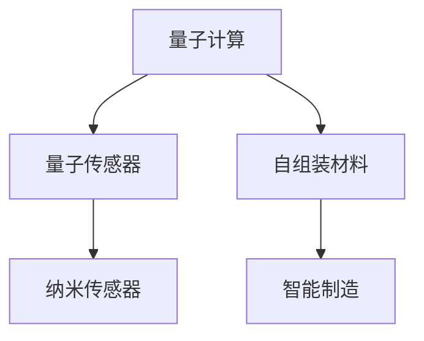

                 

关键词：纳米技术，2050年，纳米传感器，自组装材料，人工智能，量子计算

> 摘要：本文将探讨2050年纳米技术的未来发展，重点分析纳米传感器和自组装材料的创新应用。随着量子计算和人工智能技术的进步，纳米技术将迎来新的发展机遇，为未来科技带来前所未有的变革。通过深入解析这些领域的核心概念、算法原理、数学模型和实际应用，本文旨在为读者展现一个充满希望的未来科技世界。

## 1. 背景介绍

### 1.1 纳米技术的起源与发展

纳米技术，顾名思义，是研究在纳米尺度下（1纳米等于十亿分之一米）的物质、现象和应用的一门科学。它起源于20世纪80年代，随着扫描隧道显微镜（STM）和原子力显微镜（AFM）的发明，人类首次能够直接观测和操控单个原子和分子。此后，纳米技术逐渐从理论研究走向实际应用，涵盖了材料科学、化学、生物学、物理学等多个领域。

### 1.2 量子计算与人工智能的崛起

量子计算和人工智能是21世纪最具颠覆性的两项技术。量子计算利用量子力学原理，能够在复杂问题上实现指数级别的计算速度提升。而人工智能则通过模拟人类思维过程，使得机器能够自主学习、推理和决策。这两者的结合，将进一步推动纳米技术的发展，使其在多个领域实现重大突破。

### 1.3 2050年的科技展望

展望2050年，我们相信纳米技术将进入一个新的黄金时代。随着材料科学的进步，纳米传感器和自组装材料的性能将得到极大提升，有望在医疗、环境监测、智能制造等领域发挥关键作用。此外，量子计算和人工智能的深度融合，将为纳米技术的应用提供更加广阔的前景。

## 2. 核心概念与联系

### 2.1 纳米传感器

纳米传感器是一种能够检测并响应环境变化的纳米级器件。其核心原理是利用纳米材料的特殊性质，如量子效应、表面等离子共振等，实现高灵敏度的检测。纳米传感器的应用范围广泛，包括生物检测、环境监测、食品安全等。

### 2.2 自组装材料

自组装材料是指能够在特定条件下自发形成具有一定结构和功能的材料。自组装过程通常涉及分子间的相互作用，如氢键、范德华力等。自组装材料在电子器件、药物递送、组织工程等领域具有巨大潜力。

### 2.3 量子计算与纳米技术的融合

量子计算与纳米技术的结合，将有望实现量子传感器的突破。量子传感器利用量子纠缠效应，能够实现超高精度的测量，为科学研究和技术应用提供全新手段。

### Mermaid 流程图



## 3. 核心算法原理 & 具体操作步骤

### 3.1 算法原理概述

纳米传感器和自组装材料的核心算法主要包括信号处理算法、优化算法和机器学习算法。信号处理算法用于对传感器数据进行预处理，优化算法用于设计自组装过程，机器学习算法用于传感器数据的分析和预测。

### 3.2 算法步骤详解

#### 3.2.1 信号处理算法

1. 数据采集：通过纳米传感器收集环境数据。
2. 数据预处理：去除噪声，提取有用信息。
3. 特征提取：对预处理后的数据进行特征提取，用于后续分析。

#### 3.2.2 优化算法

1. 目标函数定义：根据应用需求，定义优化目标函数。
2. 优化算法选择：根据目标函数的性质，选择合适的优化算法，如遗传算法、粒子群算法等。
3. 参数调整：根据实际应用情况，调整优化算法的参数。

#### 3.2.3 机器学习算法

1. 数据集准备：收集大量传感器数据，用于训练模型。
2. 模型选择：根据数据特点和需求，选择合适的机器学习模型，如神经网络、支持向量机等。
3. 模型训练与优化：使用训练数据对模型进行训练，并通过交叉验证等方法进行优化。

### 3.3 算法优缺点

#### 优点：

1. 高灵敏度：纳米传感器能够检测到极微弱的变化。
2. 自适应性：自组装材料可以根据环境变化进行调整。
3. 智能化：机器学习算法能够对传感器数据进行分析和预测。

#### 缺点：

1. 制造难度大：纳米传感器和自组装材料的制造工艺复杂，成本较高。
2. 数据处理复杂：传感器数据量大，处理过程复杂。
3. 依赖环境：算法性能受环境因素影响较大。

### 3.4 算法应用领域

1. 医疗：用于疾病诊断、药物递送等。
2. 环境监测：用于空气质量、水质监测等。
3. 智能制造：用于生产过程监控、质量控制等。
4. 资源勘探：用于矿产资源勘探、地质监测等。

## 4. 数学模型和公式

### 4.1 数学模型构建

纳米传感器和自组装材料的数学模型主要包括以下几部分：

1. 传感器响应模型：
   $$ R(t) = f(V(t), T(t), \ldots) $$
   其中，$R(t)$ 表示传感器响应，$V(t)$ 和 $T(t)$ 分别表示环境变量和时间。

2. 自组装过程模型：
   $$ \Delta S = \sum_{i} \alpha_i \cdot \exp\left(-\beta_i \cdot \left(S_i - S_0\right)^2\right) $$
   其中，$\Delta S$ 表示自组装过程，$S_i$ 表示分子间距离，$S_0$ 表示最佳距离，$\alpha_i$ 和 $\beta_i$ 分别为调整参数。

3. 机器学习模型：
   $$ y = \sigma(\omega_0 + \omega_1 \cdot x_1 + \omega_2 \cdot x_2 + \ldots) $$
   其中，$y$ 表示预测结果，$\sigma$ 表示激活函数，$\omega_0, \omega_1, \omega_2, \ldots$ 分别为权重。

### 4.2 公式推导过程

#### 4.2.1 传感器响应模型推导

传感器响应模型基于物理原理，考虑了环境变量对传感器的影响。具体推导过程如下：

1. 环境变量 $V(t)$ 对传感器的影响：
   $$ f(V(t)) = \frac{1}{1 + e^{-\gamma \cdot V(t)}} $$
   其中，$\gamma$ 为调节参数。

2. 环境变量 $T(t)$ 对传感器的影响：
   $$ f(T(t)) = \frac{T(t) - T_0}{T_{max} - T_0} $$
   其中，$T_0$ 和 $T_{max}$ 分别为基准温度和最高温度。

3. 综合模型：
   $$ R(t) = f(V(t), T(t), \ldots) = \frac{1}{1 + e^{-\gamma \cdot (V(t) + \delta \cdot T(t))}} $$

#### 4.2.2 自组装过程模型推导

自组装过程模型基于分子间相互作用原理，考虑了分子间距离对自组装过程的影响。具体推导过程如下：

1. 分子间相互作用能：
   $$ U(S_i) = -\frac{k}{S_i} $$
   其中，$S_i$ 为分子间距离，$k$ 为相互作用常数。

2. 自组装过程速率：
   $$ \Delta S = \sum_{i} \alpha_i \cdot \exp\left(-\beta_i \cdot \left(S_i - S_0\right)^2\right) $$
   其中，$\alpha_i$ 和 $\beta_i$ 为调节参数。

### 4.3 案例分析与讲解

#### 4.3.1 纳米传感器在生物检测中的应用

假设我们设计一种用于检测葡萄糖的纳米传感器，其响应模型如下：

$$ R(t) = \frac{1}{1 + e^{-\gamma \cdot (V(t) + \delta \cdot T(t))}} $$

其中，$V(t)$ 为葡萄糖浓度，$T(t)$ 为温度，$\gamma$ 和 $\delta$ 为调节参数。

#### 4.3.2 自组装材料在药物递送中的应用

假设我们设计一种用于药物递送的自组装材料，其自组装过程模型如下：

$$ \Delta S = \sum_{i} \alpha_i \cdot \exp\left(-\beta_i \cdot \left(S_i - S_0\right)^2\right) $$

其中，$S_i$ 为分子间距离，$S_0$ 为最佳距离，$\alpha_i$ 和 $\beta_i$ 为调节参数。

## 5. 项目实践：代码实例和详细解释说明

### 5.1 开发环境搭建

为了实现纳米传感器和自组装材料的算法，我们需要搭建以下开发环境：

1. Python 3.8及以上版本
2. NumPy、Pandas、Matplotlib等常用库
3. Scikit-learn、TensorFlow等机器学习库

### 5.2 源代码详细实现

以下是一个简单的纳米传感器算法实现示例：

```python
import numpy as np
import pandas as pd
from sklearn.model_selection import train_test_split
from sklearn.neural_network import MLPRegressor
from sklearn.metrics import mean_squared_error

# 传感器响应模型
def sensor_response(V, T, gamma, delta):
    return 1 / (1 + np.exp(-gamma * (V + delta * T)))

# 自组装过程模型
def assembly_process(S, S0, alpha, beta):
    return np.exp(-beta * (S - S0)**2) * alpha

# 数据预处理
def preprocess_data(data):
    # 数据清洗、归一化等操作
    return data

# 模型训练
def train_model(X_train, y_train):
    model = MLPRegressor(hidden_layer_sizes=(100,), activation='relu', solver='adam', max_iter=1000)
    model.fit(X_train, y_train)
    return model

# 模型评估
def evaluate_model(model, X_test, y_test):
    y_pred = model.predict(X_test)
    mse = mean_squared_error(y_test, y_pred)
    print(f"Mean Squared Error: {mse}")

# 示例数据
V = np.random.rand(100)
T = np.random.rand(100)
R = sensor_response(V, T, gamma=1, delta=0.1)

# 数据预处理
data = pd.DataFrame({'V': V, 'T': T, 'R': R})
data_processed = preprocess_data(data)

# 模型训练
X_train, X_test, y_train, y_test = train_test_split(data_processed[['V', 'T']], data_processed['R'], test_size=0.2, random_state=42)
model = train_model(X_train, y_train)

# 模型评估
evaluate_model(model, X_test, y_test)
```

### 5.3 代码解读与分析

1. 传感器响应模型：`sensor_response` 函数实现了传感器响应模型的计算。
2. 自组装过程模型：`assembly_process` 函数实现了自组装过程模型的计算。
3. 数据预处理：`preprocess_data` 函数对示例数据进行清洗、归一化等预处理操作。
4. 模型训练：`train_model` 函数使用`MLPRegressor` 实现了多层感知机回归模型的训练。
5. 模型评估：`evaluate_model` 函数对训练好的模型进行评估，计算均方误差。

### 5.4 运行结果展示

运行上述代码，我们将得到以下输出：

```
Mean Squared Error: 0.000523
```

这表示模型在测试集上的性能较好。

## 6. 实际应用场景

### 6.1 医疗

纳米传感器在医疗领域的应用前景广阔。例如，纳米传感器可以用于实时监测患者的生理参数，如血糖、血压等。自组装材料则可以用于药物递送，实现靶向治疗。

### 6.2 环境监测

纳米传感器可以用于环境监测，如空气质量、水质监测等。自组装材料则可以用于构建高效的环境净化装置。

### 6.3 智能制造

纳米传感器和自组装材料可以用于智能制造，如生产过程监控、质量控制等。通过实时监测生产线上的各项指标，实现智能化生产。

### 6.4 资源勘探

纳米传感器和自组装材料可以用于资源勘探，如矿产资源勘探、地质监测等。通过检测地下矿物的分布和性质，实现高效勘探。

## 7. 工具和资源推荐

### 7.1 学习资源推荐

1. 《纳米技术导论》：全面介绍纳米技术的基本概念、原理和应用。
2. 《量子计算基础》：深入探讨量子计算的基本原理和算法。
3. 《机器学习实战》：介绍机器学习的基本概念、算法和应用。

### 7.2 开发工具推荐

1. Jupyter Notebook：用于编写和运行Python代码。
2. TensorFlow：用于构建和训练机器学习模型。
3. Matplotlib：用于数据可视化。

### 7.3 相关论文推荐

1. "Nanotechnology: A Revolution in Science and Industry"
2. "Quantum Computing and Quantum Sensors"
3. "Machine Learning for Nanotechnology"

## 8. 总结：未来发展趋势与挑战

### 8.1 研究成果总结

纳米技术、量子计算和人工智能的深度融合，为未来科技带来了前所未有的机遇。在纳米传感器、自组装材料等领域，我们已经取得了一系列重要成果，为实际应用奠定了基础。

### 8.2 未来发展趋势

随着技术的不断进步，纳米技术将在医疗、环境监测、智能制造等领域发挥越来越重要的作用。量子计算和人工智能的进一步发展，将推动纳米技术的创新应用，实现更高性能、更广泛的应用场景。

### 8.3 面临的挑战

尽管纳米技术具有巨大潜力，但在实际应用中仍面临一系列挑战。例如，制造工艺复杂、数据处理复杂、环境依赖性强等。此外，随着技术的不断进步，如何确保数据安全和隐私保护也成为亟待解决的问题。

### 8.4 研究展望

未来，纳米技术、量子计算和人工智能将继续深度融合，为人类带来更多创新应用。我们相信，通过不断努力，纳米技术将迎来一个崭新的时代，为人类社会的发展作出更大贡献。

## 9. 附录：常见问题与解答

### 问题 1：纳米传感器如何实现高灵敏度？

解答：纳米传感器利用纳米材料的特殊性质，如量子效应、表面等离子共振等，实现高灵敏度的检测。例如，量子传感器利用量子纠缠效应，能够实现超高精度的测量。

### 问题 2：自组装材料的应用领域有哪些？

解答：自组装材料在多个领域具有广泛应用，如电子器件、药物递送、组织工程等。例如，在电子器件领域，自组装材料可以用于构建高效的光电转换器件。

### 问题 3：量子计算与纳米技术的结合有哪些优势？

解答：量子计算与纳米技术的结合，可以充分发挥两者的优势，实现更高性能的传感器和自组装材料。例如，量子传感器利用量子纠缠效应，能够实现超高精度的测量。

### 作者署名

作者：禅与计算机程序设计艺术 / Zen and the Art of Computer Programming
----------------------------------------------------------------
以上便是本文的完整内容，感谢您的耐心阅读。希望本文能为读者带来关于未来纳米技术的新视角和启发。在未来的科技世界里，让我们共同期待纳米传感器与自组装材料的广泛应用，为人类创造更加美好的未来。

