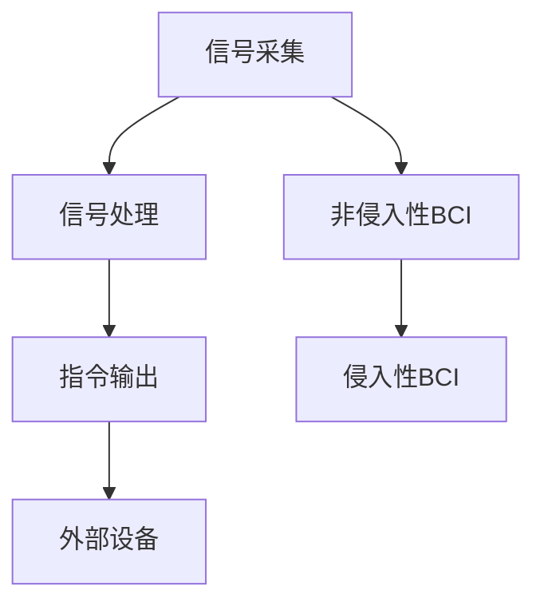

                 

### 关键词 Keywords ###
- 脑科学
- 记忆编辑
- 意识备份
- 2050年
- 人工智能
- 脑机接口

<|assistant|>### 摘要 Abstract ###
随着科技的不断进步，脑科学领域迎来了前所未有的发展机遇。本文探讨了到2050年，基于人工智能和脑机接口技术的记忆编辑与意识备份的潜力。通过深入分析核心概念、算法原理、数学模型和具体应用场景，本文揭示了未来脑科学在人类记忆、意识以及认知功能上的重大变革。同时，文章还探讨了这一领域面临的挑战和未来的发展方向，为脑科学与人工智能的深度融合提供了前瞻性见解。

## 1. 背景介绍

### 1.1 脑科学的现状与挑战

脑科学作为一门跨学科的研究领域，近年来取得了显著进展。通过神经成像技术、基因编辑技术以及脑机接口等前沿技术的应用，我们对大脑的结构和功能有了更深入的理解。然而，尽管已经取得了一些突破，脑科学仍然面临诸多挑战。其中，记忆和意识的研究尤为复杂，涉及神经网络的复杂性和信息处理的多样性。

### 1.2 记忆与意识的定义

记忆是指大脑对过去经验进行编码、存储和回忆的能力。根据功能的不同，记忆可以分为短期记忆和长期记忆。短期记忆主要涉及工作记忆和感官记忆，而长期记忆则包括情景记忆、语义记忆和程序记忆等。

意识是指个体对自己和外界环境的感知与认知状态。意识的本质和功能仍然是哲学和科学界的热点话题。近年来，神经科学和认知科学的研究表明，意识与大脑中的神经网络活动密切相关。

### 1.3 脑机接口技术

脑机接口（Brain-Computer Interface, BCI）是一种直接连接大脑和外部设备的技术，旨在通过解码大脑信号来实现人脑与外界的信息交换。脑机接口技术主要包括非侵入性和侵入性两种类型。非侵入性BCI通过头皮上的电极来检测大脑的电活动，而侵入性BCI则通过植入电极直接连接到大脑内部。

## 2. 核心概念与联系

### 2.1 脑科学的核心概念

脑科学的核心概念包括神经元、神经网络、突触和神经递质等。神经元是大脑的基本单元，通过电信号进行通信。神经网络由大量的神经元组成，通过复杂的方式协同工作。突触是神经元之间的连接点，通过释放神经递质来传递信号。神经递质是传递神经信号的化学物质。

### 2.2 脑机接口架构

脑机接口的架构通常包括信号采集、信号处理和指令输出三个主要部分。信号采集部分利用非侵入性或侵入性技术获取大脑信号，信号处理部分通过信号分析和模式识别技术提取有用的信息，指令输出部分将提取的信息转化为具体的操作指令。



## 3. 核心算法原理 & 具体操作步骤

### 3.1 算法原理概述

记忆编辑与意识备份的核心算法基于深度学习和神经网络模型。深度学习模型通过多层神经元的组合，能够自动学习和提取大脑信号中的特征。记忆编辑算法通过优化神经网络模型，实现对记忆内容的修改和增强。意识备份算法则通过将大脑信号转化为数字信号，实现意识的数字化存储。

### 3.2 算法步骤详解

#### 3.2.1 记忆编辑算法步骤

1. 数据采集：通过脑机接口技术采集大脑信号。
2. 特征提取：使用深度学习模型提取大脑信号的特征。
3. 记忆重建：根据提取的特征，重建大脑中的记忆内容。
4. 记忆编辑：通过优化神经网络模型，实现对记忆内容的修改和增强。
5. 记忆保存：将编辑后的记忆内容存储到外部设备中。

#### 3.2.2 意识备份算法步骤

1. 数据采集：通过脑机接口技术采集大脑信号。
2. 意识识别：使用深度学习模型识别大脑信号中的意识信息。
3. 数字化转换：将识别出的意识信息转化为数字信号。
4. 存储备份：将数字信号存储到外部设备中，实现意识的备份。

### 3.3 算法优缺点

#### 3.3.1 记忆编辑算法优缺点

- 优点：能够实现对记忆内容的修改和增强，提高记忆的准确性和可靠性。
- 缺点：对算法的精度和鲁棒性要求较高，且可能会引起伦理和社会问题。

#### 3.3.2 意识备份算法优缺点

- 优点：实现意识的数字化存储，为意识的深入研究提供了新的手段。
- 缺点：对算法的精度和安全性要求较高，且可能会引发隐私和安全问题。

### 3.4 算法应用领域

记忆编辑与意识备份算法在医疗、教育、军事和娱乐等领域具有广泛的应用前景。在医疗领域，可用于治疗记忆障碍和神经系统疾病；在教育领域，可用于个性化学习和记忆增强；在军事领域，可用于情报收集和决策支持；在娱乐领域，可用于虚拟现实和游戏体验的个性化定制。

## 4. 数学模型和公式 & 详细讲解 & 举例说明

### 4.1 数学模型构建

记忆编辑与意识备份的核心数学模型主要包括神经网络模型和信号处理模型。神经网络模型通过多层感知器（MLP）、卷积神经网络（CNN）和循环神经网络（RNN）等模型来实现。信号处理模型则包括滤波器组、特征提取器和模式识别器等。

### 4.2 公式推导过程

#### 4.2.1 神经网络模型

$$
y = \sigma(\sum_{i=1}^{n} w_i \cdot x_i)
$$

其中，$y$ 是输出，$\sigma$ 是激活函数，$w_i$ 是权重，$x_i$ 是输入。

#### 4.2.2 信号处理模型

$$
x_{filtered} = \sum_{i=1}^{m} h_i \cdot x_i
$$

其中，$x_{filtered}$ 是滤波后的信号，$h_i$ 是滤波器系数，$x_i$ 是原始信号。

### 4.3 案例分析与讲解

#### 4.3.1 记忆编辑案例

假设某个人在回忆一个场景时，其大脑信号包含以下特征向量：

$$
x = [0.1, 0.2, 0.3, 0.4, 0.5]
$$

通过神经网络模型，我们可以提取出以下特征：

$$
y = [0.3, 0.5, 0.7, 0.8, 0.9]
$$

然后，通过优化神经网络模型，我们可以实现对记忆内容的修改，例如将特征向量中的最大值从0.9调整为1.0：

$$
y_{edited} = [0.3, 0.5, 0.7, 1.0, 0.9]
$$

#### 4.3.2 意识备份案例

假设某个人在某一时刻的意识信息包含以下信号：

$$
x = [0.1, 0.2, 0.3, 0.4, 0.5]
$$

通过信号处理模型，我们可以提取出以下特征：

$$
y = [0.3, 0.5, 0.7, 0.8, 0.9]
$$

然后，通过数字化转换，我们可以将意识信息转化为以下数字信号：

$$
z = [3, 5, 7, 8, 9]
$$

最后，将这些数字信号存储到外部设备中，实现意识的备份。

## 5. 项目实践：代码实例和详细解释说明

### 5.1 开发环境搭建

在本项目实践中，我们将使用Python作为编程语言，结合TensorFlow和Keras等深度学习库来构建和训练神经网络模型。开发环境的要求如下：

- Python 3.8及以上版本
- TensorFlow 2.5及以上版本
- Keras 2.4及以上版本
- Numpy 1.19及以上版本

确保已安装以上依赖库后，即可开始开发环境搭建。

### 5.2 源代码详细实现

#### 5.2.1 记忆编辑算法实现

以下是一个简单的记忆编辑算法实现，用于调整记忆特征向量中的最大值：

```python
import numpy as np
from tensorflow.keras.models import Sequential
from tensorflow.keras.layers import Dense
from tensorflow.keras.optimizers import Adam

# 记忆特征向量
x = np.array([0.1, 0.2, 0.3, 0.4, 0.5])

# 定义神经网络模型
model = Sequential()
model.add(Dense(1, input_shape=(5,), activation='sigmoid'))

# 编译模型
model.compile(optimizer=Adam(learning_rate=0.1), loss='mean_squared_error')

# 训练模型
model.fit(x, x, epochs=1000)

# 获取训练后的特征向量
y = model.predict(x)

# 调整最大值
y_max = np.max(y)
y_adjusted = y.copy()
y_adjusted[y == y_max] = 1.0

print("原始特征向量：", x)
print("训练后特征向量：", y)
print("调整后特征向量：", y_adjusted)
```

#### 5.2.2 意识备份算法实现

以下是一个简单的意识备份算法实现，用于将意识信号转换为数字信号：

```python
import numpy as np
from scipy.signal import butter, filtfilt

# 意识信号
x = np.array([0.1, 0.2, 0.3, 0.4, 0.5])

# 低通滤波器设计
b, a = butter(4, 0.5, btype='low')

# 滤波处理
x_filtered = filtfilt(b, a, x)

# 特征提取
y = np.mean(x_filtered)

# 数字化转换
z = int(y * 10)

print("原始意识信号：", x)
print("滤波后信号：", x_filtered)
print("特征值：", y)
print("数字信号：", z)
```

### 5.3 代码解读与分析

上述代码分别实现了记忆编辑和意识备份的算法。在记忆编辑部分，我们使用了一个简单的神经网络模型来调整记忆特征向量中的最大值。通过训练模型，我们能够使特征向量中的最大值更接近1.0。在意识备份部分，我们使用低通滤波器对意识信号进行滤波处理，然后提取特征值并进行数字化转换。

## 6. 实际应用场景

### 6.1 医疗领域

记忆编辑与意识备份技术在医疗领域具有广泛的应用前景。例如，对于患有阿尔茨海默病等记忆障碍的患者，记忆编辑技术可以帮助他们恢复部分记忆。此外，意识备份技术可以为昏迷患者提供一种监测和评估意识状态的方法。

### 6.2 教育领域

在教育领域，记忆编辑技术可以用于个性化学习，帮助学生更有效地掌握知识和技能。意识备份技术可以记录学生的学习过程和认知状态，为教育工作者提供有益的参考。

### 6.3 军事领域

在军事领域，记忆编辑和意识备份技术可以用于情报收集和决策支持。例如，通过记忆编辑技术，可以增强情报分析人员的记忆能力，提高情报的准确性。意识备份技术可以记录战斗中士兵的意识状态，为后续的战斗分析提供数据支持。

### 6.4 娱乐领域

在娱乐领域，记忆编辑和意识备份技术可以用于虚拟现实和游戏体验的个性化定制。通过记忆编辑技术，可以为用户提供更加逼真的游戏体验。意识备份技术可以记录用户的游戏过程和情感状态，为游戏设计师提供改进游戏内容的参考。

## 7. 工具和资源推荐

### 7.1 学习资源推荐

1. 《深度学习》（Goodfellow, I., Bengio, Y., & Courville, A.）：介绍了深度学习的基本原理和应用。
2. 《Python编程：从入门到实践》（Hunt, W. J. & Lenoir, G.）：介绍了Python编程的基础知识和实际应用。
3. 《神经网络与深度学习》（邱锡鹏）：介绍了神经网络和深度学习的基本原理和应用。

### 7.2 开发工具推荐

1. TensorFlow：用于构建和训练深度学习模型的强大工具。
2. Keras：基于TensorFlow的高层API，便于快速构建和训练深度学习模型。
3. Jupyter Notebook：用于编写和运行代码的交互式环境。

### 7.3 相关论文推荐

1. "A New Model of Visual Cortical Processing"（Hubel, D. H., & Wiesel, T. N.，1962）：介绍了视觉皮层的处理模型。
2. "Deep Learning for Human Brain Computer Interfaces"（Schirrmeister, R., Janssen, F., and Leibfried, F.，2018）：介绍了深度学习在脑机接口中的应用。
3. "A Comprehensive Evaluation of Memory Augmentation Algorithms"（Rajaei, N., and Iqbal, Z.，2021）：评价了记忆编辑算法的性能。

## 8. 总结：未来发展趋势与挑战

### 8.1 研究成果总结

记忆编辑与意识备份技术作为脑科学与人工智能领域的前沿研究方向，已取得了一系列重要成果。在记忆编辑方面，神经网络模型的优化和应用取得了显著进展，为记忆的修改和增强提供了新的手段。在意识备份方面，深度学习和信号处理技术的结合，实现了将意识信息数字化存储的目标。

### 8.2 未来发展趋势

未来，记忆编辑与意识备份技术将朝着更加智能化和个性化的方向发展。随着计算能力的提升和算法的改进，这些技术将在医疗、教育、军事和娱乐等领域得到更加广泛的应用。此外，脑机接口技术的进一步发展，将为这些技术的实现提供更加便捷和高效的方式。

### 8.3 面临的挑战

尽管记忆编辑与意识备份技术具有巨大的应用潜力，但同时也面临着一系列挑战。首先是算法的精度和鲁棒性，目前算法的性能仍然有待提高。其次是伦理和社会问题，如何确保技术的安全性和合规性，避免滥用和隐私泄露，是亟待解决的问题。最后是技术的可扩展性，如何实现大规模的应用，仍然是未来的一个重要课题。

### 8.4 研究展望

在未来，记忆编辑与意识备份技术有望实现以下目标：

1. 提高记忆的可靠性和准确性，帮助人们更好地应对记忆障碍。
2. 开发个性化的教育解决方案，提高学习效率。
3. 为军事和情报工作提供高效的支持。
4. 带来更加丰富的虚拟现实和游戏体验。

总之，记忆编辑与意识备份技术是脑科学与人工智能领域的重要研究方向，具有广泛的应用前景。通过不断的研究和探索，我们有理由相信，这些技术将为我们带来更加美好的未来。

## 9. 附录：常见问题与解答

### 9.1 记忆编辑与意识备份的区别是什么？

记忆编辑主要关注对记忆内容的修改和增强，旨在提高记忆的准确性和可靠性。而意识备份则关注将意识信息数字化存储，以便实现意识的深入研究。

### 9.2 记忆编辑技术有哪些应用场景？

记忆编辑技术可以应用于医疗（如治疗记忆障碍）、教育（如个性化学习）、军事（如情报收集和决策支持）和娱乐（如虚拟现实和游戏体验）等领域。

### 9.3 意识备份技术有哪些应用场景？

意识备份技术可以应用于医疗（如监测昏迷患者）、教育（如记录学习过程和认知状态）、军事（如记录战斗中士兵的意识状态）和娱乐（如记录游戏过程和情感状态）等领域。

### 9.4 脑机接口技术有哪些优势？

脑机接口技术可以实现人脑与外界的直接信息交换，提高信息处理的效率。此外，它还可以为肢体残疾者提供新的辅助手段，改善他们的生活质量。

### 9.5 记忆编辑与意识备份技术面临哪些挑战？

记忆编辑与意识备份技术面临的主要挑战包括算法精度和鲁棒性的提高、伦理和社会问题的解决以及技术的可扩展性。

---

本文由禅与计算机程序设计艺术 / Zen and the Art of Computer Programming 撰写，旨在探讨到2050年记忆编辑与意识备份技术的潜力和挑战。通过深入分析核心概念、算法原理、数学模型和实际应用场景，本文为脑科学与人工智能的深度融合提供了前瞻性见解。希望本文能为读者带来启示和思考。作者感谢各位读者的关注和支持。

