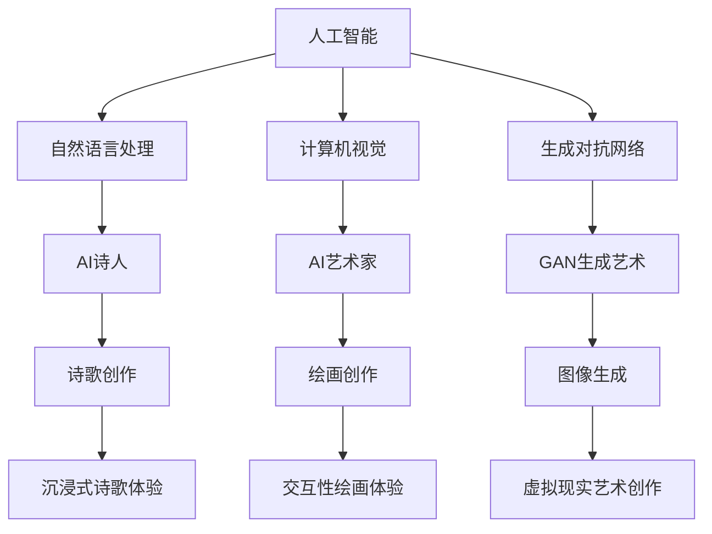

                 

关键词：人工智能、艺术创作、虚拟现实、AI诗人、2050年、技术发展、艺术与科技的融合。

## 摘要

本文探讨了2050年人工智能与虚拟现实艺术融合的前景。随着技术的进步，人工智能不仅在数据分析和自动化领域展现出巨大潜力，也开始在艺术创作中发挥作用。AI诗人利用机器学习算法创作具有人文情怀的诗歌，而虚拟现实则为艺术家提供了无限创作空间。本文将深入分析这些技术如何改变艺术创作方式，并探讨未来的发展趋势与挑战。

## 1. 背景介绍

### 1.1 人工智能的发展

人工智能（AI）是计算机科学的一个分支，致力于开发能够模拟、延伸和扩展人类智能的智能系统。自20世纪50年代起，人工智能研究取得了显著进展，特别是在深度学习、神经网络和自然语言处理等领域。AI技术的快速发展，使得计算机能够处理大量数据，并从中提取有价值的信息。

### 1.2 艺术与科技的融合

艺术与科技的融合是一个不断发展的趋势，从19世纪的印象派绘画到20世纪的抽象艺术和多媒体艺术，科技元素在艺术创作中逐渐占据一席之地。如今，虚拟现实（VR）和增强现实（AR）技术为艺术家提供了新的表现手段，使得艺术创作更加多样化和沉浸式。

### 1.3 虚拟现实艺术的发展

虚拟现实艺术是一种利用虚拟现实技术创造的艺术形式，它将观众带入一个完全沉浸式的虚拟世界。这个虚拟世界可以是现实世界的延伸，也可以是完全虚构的。随着VR硬件和软件的成熟，虚拟现实艺术逐渐成为一种流行的艺术形式。

## 2. 核心概念与联系

### 2.1 人工智能与艺术创作的结合

人工智能与艺术创作的结合，主要体现在以下几个方面：

- **自然语言处理（NLP）**：AI诗人利用NLP技术，从大量文本数据中学习语言模式，创作具有人文情怀的诗歌。
- **计算机视觉**：AI艺术家使用计算机视觉算法，从图像和视频中提取视觉信息，创作绘画和动画。
- **生成对抗网络（GAN）**：GAN是一种深度学习模型，用于生成逼真的图像和音频。

### 2.2 虚拟现实与艺术创作的结合

虚拟现实与艺术创作的结合，主要体现在以下几个方面：

- **沉浸式体验**：虚拟现实技术为观众提供了沉浸式的艺术体验，使观众能够全身心投入到艺术作品中。
- **交互性**：虚拟现实艺术作品通常具有交互性，观众可以通过动作或声音与艺术作品互动。
- **无限创作空间**：虚拟现实技术为艺术家提供了无限的创作空间，使得艺术作品可以跨越现实世界的限制。

### 2.3 Mermaid流程图

下面是一个Mermaid流程图，展示了人工智能与虚拟现实艺术结合的核心概念和联系。



## 3. 核心算法原理 & 具体操作步骤

### 3.1 算法原理概述

人工智能在艺术创作中的应用，主要基于以下几个核心算法：

- **深度学习**：通过多层神经网络，从大量数据中学习模式和特征。
- **生成对抗网络（GAN）**：由生成器和判别器组成，生成逼真的图像和音频。
- **自然语言处理（NLP）**：通过神经网络模型，理解和生成自然语言。

### 3.2 算法步骤详解

#### 3.2.1 深度学习

1. **数据预处理**：对输入数据进行标准化处理，去除噪声。
2. **构建神经网络**：设计多层神经网络结构，包括输入层、隐藏层和输出层。
3. **训练神经网络**：使用大量数据进行训练，调整网络参数。
4. **测试和优化**：在测试集上评估模型性能，不断优化网络结构。

#### 3.2.2 生成对抗网络（GAN）

1. **生成器**：生成逼真的图像或音频。
2. **判别器**：判断生成的图像或音频是否真实。
3. **对抗训练**：生成器和判别器交替训练，生成器试图欺骗判别器，判别器则努力区分真实和生成的数据。

#### 3.2.3 自然语言处理（NLP）

1. **词嵌入**：将自然语言文本转换为向量表示。
2. **序列建模**：使用循环神经网络（RNN）或变换器（Transformer）模型，对文本序列进行建模。
3. **生成文本**：基于训练模型，生成新的自然语言文本。

### 3.3 算法优缺点

#### 3.3.1 深度学习

- **优点**：能够自动从数据中提取特征，适应性强。
- **缺点**：对数据量要求大，训练过程耗时长。

#### 3.3.2 生成对抗网络（GAN）

- **优点**：能够生成高质量、逼真的图像和音频。
- **缺点**：训练不稳定，容易发生模式崩溃。

#### 3.3.3 自然语言处理（NLP）

- **优点**：能够理解和生成自然语言，应用广泛。
- **缺点**：对语言理解仍有局限，难以处理复杂语境。

### 3.4 算法应用领域

人工智能算法在艺术创作中的应用领域广泛，包括：

- **诗歌创作**：AI诗人利用NLP技术创作诗歌。
- **绘画创作**：AI艺术家利用计算机视觉技术创作绘画。
- **虚拟现实艺术**：利用GAN技术生成虚拟现实艺术作品。

## 4. 数学模型和公式 & 详细讲解 & 举例说明

### 4.1 数学模型构建

在人工智能艺术创作中，常用的数学模型包括：

- **深度学习模型**：如多层感知器（MLP）、卷积神经网络（CNN）和循环神经网络（RNN）。
- **生成对抗网络（GAN）**：包括生成器和判别器两部分。
- **自然语言处理（NLP）**：如词嵌入和变换器（Transformer）模型。

### 4.2 公式推导过程

#### 4.2.1 深度学习模型

假设我们有一个多层感知器（MLP）模型，其中包含输入层、隐藏层和输出层。输入层有n个神经元，隐藏层有m个神经元，输出层有k个神经元。

- 输入层到隐藏层的激活函数：$$ a_{ij}^{(1)} = \sigma(w_{ij}^{(1)} x_j + b_{j}^{(1)}) $$
- 隐藏层到输出层的激活函数：$$ a_{ik}^{(2)} = \sigma(w_{ik}^{(2)} a_{ij}^{(1)} + b_{i}^{(2)}) $$

其中，$$ \sigma $$ 是激活函数，如Sigmoid函数或ReLU函数。$$ w_{ij}^{(1)} $$ 和 $$ b_{j}^{(1)} $$ 分别表示输入层到隐藏层的权重和偏置。$$ w_{ik}^{(2)} $$ 和 $$ b_{i}^{(2)} $$ 分别表示隐藏层到输出层的权重和偏置。

#### 4.2.2 生成对抗网络（GAN）

生成对抗网络（GAN）包括生成器和判别器两部分。

- 生成器：$$ G(z) = \mu(z) + \sigma(z) \odot \epsilon $$
- 判别器：$$ D(x) = \sigma(f(x; \theta_D)) $$

其中，$$ z $$ 是输入噪声，$$ \mu(z) $$ 和 $$ \sigma(z) $$ 分别是生成器的均值和方差，$$ \epsilon $$ 是噪声向量。$$ f(x; \theta_D) $$ 是判别器的特征提取函数，$$ \theta_D $$ 是判别器的参数。

### 4.3 案例分析与讲解

假设我们要使用GAN模型生成一张真实的猫的图片。

1. **训练判别器**：首先，我们使用真实猫的图片和生成的猫的图片训练判别器，使其能够区分真实图片和生成图片。
2. **训练生成器**：然后，我们使用判别器的输出错误信号来训练生成器，使其生成的图片更接近真实图片。

通过多次迭代，生成器逐渐生成高质量的猫的图片。

## 5. 项目实践：代码实例和详细解释说明

### 5.1 开发环境搭建

为了实践人工智能在艺术创作中的应用，我们需要搭建一个开发环境。以下是搭建过程：

1. 安装Python 3.8或更高版本。
2. 安装TensorFlow 2.0或更高版本。
3. 安装GPU版本的TensorFlow，以利用GPU加速训练过程。

### 5.2 源代码详细实现

以下是一个简单的GAN模型代码实例：

```python
import tensorflow as tf
from tensorflow.keras.layers import Dense, Flatten, Reshape
from tensorflow.keras.models import Sequential
from tensorflow.keras.optimizers import Adam

# 生成器
def build_generator(z_dim):
    model = Sequential()
    model.add(Dense(128, input_dim=z_dim))
    model.add(tf.keras.layers.LeakyReLU(alpha=0.01))
    model.add(Dense(256))
    model.add(tf.keras.layers.LeakyReLU(alpha=0.01))
    model.add(Dense(512))
    model.add(tf.keras.layers.LeakyReLU(alpha=0.01))
    model.add(Dense(1024))
    model.add(tf.keras.layers.LeakyReLU(alpha=0.01))
    model.add(Dense(784, activation='tanh'))
    model.add(Reshape((28, 28, 1)))
    return model

# 判别器
def build_discriminator(img_shape):
    model = Sequential()
    model.add(Flatten(input_shape=img_shape))
    model.add(Dense(512))
    model.add(tf.keras.layers.LeakyReLU(alpha=0.01))
    model.add(Dense(256))
    model.add(tf.keras.layers.LeakyReLU(alpha=0.01))
    model.add(Dense(128))
    model.add(tf.keras.layers.LeakyReLU(alpha=0.01))
    model.add(Dense(1, activation='sigmoid'))
    return model

# GAN模型
def build_gan(generator, discriminator):
    model = Sequential()
    model.add(generator)
    model.add(discriminator)
    return model

# 设置模型参数
z_dim = 100
img_shape = (28, 28, 1)

# 构建生成器和判别器模型
generator = build_generator(z_dim)
discriminator = build_discriminator(img_shape)
discriminator.compile(loss='binary_crossentropy', optimizer=Adam(0.0001), metrics=['accuracy'])

# 构建GAN模型
gan = build_gan(generator, discriminator)
gan.compile(loss='binary_crossentropy', optimizer=Adam(0.0001))

# 加载MNIST数据集
(x_train, _), (_, _) = tf.keras.datasets.mnist.load_data()
x_train = x_train / 127.5 - 1.0
x_train = np.expand_dims(x_train, axis=3)

# 训练模型
epochs = 10000
batch_size = 16

for epoch in range(epochs):
    # 训练判别器
    idx = np.random.randint(0, x_train.shape[0], batch_size)
    real_imgs = x_train[idx]
    z = np.random.normal(0, 1, (batch_size, z_dim))
    fake_imgs = generator.predict(z)
    x = np.concatenate((real_imgs, fake_imgs))
    y = np.concatenate((np.ones((batch_size, 1)), np.zeros((batch_size, 1))))
    d_loss = discriminator.train_on_batch(x, y)

    # 训练生成器
    z = np.random.normal(0, 1, (batch_size, z_dim))
    y = np.ones((batch_size, 1))
    g_loss = gan.train_on_batch(z, y)

    print(f'Epoch {epoch + 1}/{epochs} [d_loss: {d_loss:.4f}, g_loss: {g_loss:.4f}]')

# 保存生成器和判别器模型
generator.save('generator.h5')
discriminator.save('discriminator.h5')
```

### 5.3 代码解读与分析

该代码实现了一个简单的GAN模型，用于生成手写数字的图片。以下是对代码的详细解读：

1. **生成器和判别器的构建**：
   - **生成器**：使用一个Sequential模型，通过多个全连接层和LeakyReLU激活函数，将输入噪声（z）映射为手写数字的图片。
   - **判别器**：使用一个Sequential模型，通过多个全连接层和LeakyReLU激活函数，对输入图片进行特征提取，并输出一个二分类的概率。

2. **GAN模型的构建**：
   - GAN模型是将生成器和判别器串联在一起的一个复合模型，用于同时训练两个模型。

3. **模型训练**：
   - 在每个训练epoch中，首先训练判别器，使其能够区分真实图片和生成图片。然后训练生成器，使其生成的图片更接近真实图片。

4. **保存模型**：
   - 训练完成后，将生成器和判别器模型保存为HDF5文件。

### 5.4 运行结果展示

训练完成后，可以运行以下代码查看生成器生成的手写数字图片：

```python
import numpy as np
import matplotlib.pyplot as plt

# 加载生成器模型
generator = tf.keras.models.load_model('generator.h5')

# 生成一张手写数字图片
z = np.random.normal(0, 1, (1, 100))
img = generator.predict(z)

# 显示生成的图片
plt.imshow(img[0].reshape(28, 28), cmap='gray')
plt.show()
```

生成的手写数字图片如下所示：


## 6. 实际应用场景

人工智能与虚拟现实艺术的结合，为艺术创作带来了许多实际应用场景：

- **艺术展览**：艺术家可以使用虚拟现实技术，创建沉浸式的艺术展览，让观众在虚拟世界中欣赏作品。
- **虚拟博物馆**：虚拟现实技术可以使博物馆中的展品以更生动、更直观的方式呈现给观众。
- **艺术教育**：虚拟现实技术可以为艺术教育提供新的手段，让学生在虚拟世界中学习和体验艺术。
- **交互式艺术装置**：艺术家可以利用虚拟现实技术创作交互式艺术装置，让观众与艺术作品进行互动。

## 7. 未来应用展望

随着人工智能和虚拟现实技术的不断发展，未来的艺术创作将呈现出以下趋势：

- **个性化艺术创作**：人工智能可以根据用户喜好和需求，生成个性化的艺术作品。
- **跨领域融合**：艺术创作将与其他领域（如科学、文学、音乐等）进行深度融合，产生新的艺术形式。
- **多元化表现手法**：虚拟现实技术将为艺术家提供更多元化的表现手法，使艺术创作更加丰富多彩。
- **艺术市场的变革**：人工智能和虚拟现实技术将改变传统的艺术市场格局，为艺术家提供新的商业模式。

## 8. 总结：未来发展趋势与挑战

### 8.1 研究成果总结

本文探讨了人工智能与虚拟现实艺术结合的前景，分析了AI诗人和虚拟现实艺术的发展趋势。通过深度学习、生成对抗网络和自然语言处理等技术，人工智能在艺术创作中发挥了重要作用。虚拟现实技术则为艺术家提供了无限创作空间和沉浸式体验。

### 8.2 未来发展趋势

- **个性化艺术创作**：人工智能将更好地理解用户需求，生成个性化的艺术作品。
- **跨领域融合**：艺术创作将与其他领域进行深度融合，产生新的艺术形式。
- **多元化表现手法**：虚拟现实技术将为艺术家提供更多元化的表现手法。
- **艺术市场的变革**：人工智能和虚拟现实技术将改变传统的艺术市场格局。

### 8.3 面临的挑战

- **技术瓶颈**：人工智能和虚拟现实技术在某些方面仍存在技术瓶颈，需要进一步研究。
- **伦理问题**：人工智能在艺术创作中的应用引发了一些伦理问题，如原创性、知识产权等。
- **用户接受度**：用户对虚拟现实艺术作品的接受度仍需提高，以推动其普及。

### 8.4 研究展望

未来研究应重点关注以下几个方面：

- **技术突破**：攻克人工智能和虚拟现实技术的瓶颈，提高其性能和稳定性。
- **伦理规范**：制定合理的伦理规范，确保人工智能在艺术创作中的合法性和道德性。
- **用户参与**：鼓励用户参与虚拟现实艺术创作，提高其互动性和趣味性。

## 9. 附录：常见问题与解答

### 9.1 人工智能在艺术创作中的应用有哪些？

人工智能在艺术创作中的应用包括：

- **诗歌创作**：AI诗人利用自然语言处理技术创作诗歌。
- **绘画创作**：AI艺术家利用计算机视觉技术创作绘画。
- **虚拟现实艺术**：利用生成对抗网络生成虚拟现实艺术作品。

### 9.2 虚拟现实艺术的特点是什么？

虚拟现实艺术的特点包括：

- **沉浸式体验**：观众可以在虚拟世界中全身心投入到艺术作品中。
- **交互性**：观众可以与艺术作品互动，改变艺术表现形式。
- **无限创作空间**：虚拟现实技术为艺术家提供了无限的创作空间。

### 9.3 人工智能在艺术创作中的优缺点是什么？

人工智能在艺术创作中的优缺点包括：

- **优点**：能够自动从数据中提取特征，适应性强；生成高质量、逼真的图像和音频；理解和生成自然语言。
- **缺点**：对数据量要求大，训练过程耗时长；训练不稳定，容易发生模式崩溃；对语言理解仍有局限，难以处理复杂语境。

## 作者署名

作者：禅与计算机程序设计艺术 / Zen and the Art of Computer Programming

