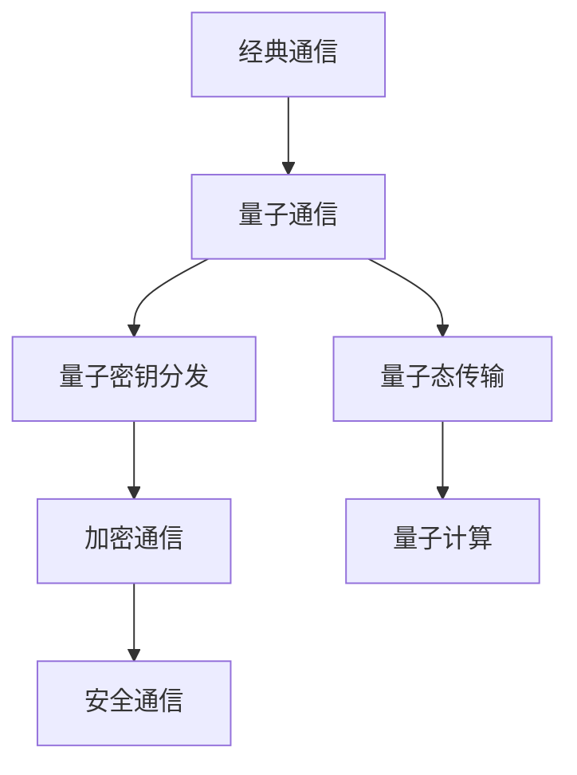
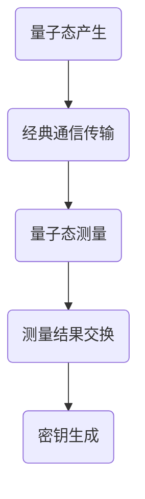
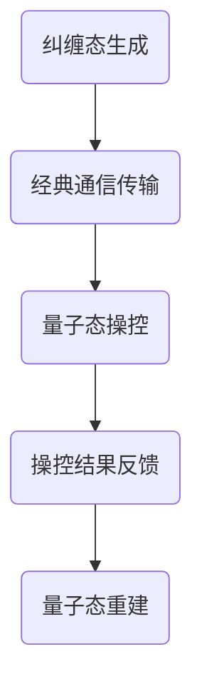

                 

关键词：量子通信、量子密钥分发、量子互联网、安全通信、量子算法、未来发展趋势

> 摘要：本文将探讨量子通信技术的最新进展，从量子密钥分发到量子互联网的安全通信，深入分析其核心概念、算法原理、数学模型、实际应用以及未来展望。通过梳理现有研究成果和展望未来发展方向，本文旨在为读者提供一幅量子通信领域的全景图，以期为相关领域的研究和实践提供参考。

## 1. 背景介绍

量子通信是一种基于量子力学原理的通信方式，它利用量子态的叠加和纠缠特性来实现信息传输和加密。相较于传统的经典通信方式，量子通信具有极高的安全性，因为任何对量子态的测量都会不可避免地改变它，从而实现信息的不可窃听性。量子通信技术的发展受到了全球科学家的广泛关注，被认为是未来信息通信领域的重要方向。

近年来，量子通信技术取得了显著的进展。2004年，科学家首次实现了量子密钥分发（Quantum Key Distribution, QKD），这一技术能够确保通信双方秘密地交换密钥，从而实现安全的通信。随后，量子纠缠态传输、量子隐形传态等技术的实现，进一步推动了量子通信的发展。2017年，科学家利用卫星实现了千公里级别的量子密钥分发，标志着量子通信技术进入了一个新的阶段。

随着量子通信技术的不断成熟，量子互联网的概念也应运而生。量子互联网是一种利用量子通信技术构建的网络，它能够实现全球范围内的量子密钥分发和量子态传输，从而实现高度安全的信息传输和计算。量子互联网的愿景不仅在于通信安全，还包括量子计算资源的共享和量子态的远程操控。

## 2. 核心概念与联系

### 2.1 量子通信的基本原理

量子通信的核心在于量子态的叠加和纠缠特性。量子态的叠加使得量子比特（qubit）可以同时处于多个状态，从而实现信息的并行传输。量子纠缠则是一种非经典的量子关联，两个或多个量子比特之间的状态无法独立存在，即使它们相隔很远，这种关联也能保持。通过量子态的叠加和纠缠，量子通信可以实现信息的高效传输和安全的加密。

为了形象地理解量子通信的基本原理，我们可以用Mermaid流程图来表示：



### 2.2 量子密钥分发

量子密钥分发（QKD）是量子通信的核心技术之一，它利用量子态的叠加和纠缠特性来实现通信双方的秘密密钥交换。QKD的工作原理可以概括为以下步骤：

1. **量子态产生与传输**：通信双方各自生成一对纠缠量子态，并通过经典通信网络将其发送给对方。

2. **量子态测量**：双方独立地测量接收到的量子态，并根据测量结果生成各自的密钥。

3. **经典通信验证**：双方通过经典通信网络交换测量结果，并根据特定协议（如BB84协议）验证密钥的有效性。

4. **密钥生成**：通过经典通信网络，双方共享有效的密钥，从而实现安全的通信。

下面是一个简化的Mermaid流程图，描述了量子密钥分发的过程：



### 2.3 量子态传输

量子态传输（Quantum State Transmission）是一种通过量子纠缠来实现量子态在远距离传输的技术。它利用量子纠缠态的特性，将一个量子态从一个地点传输到另一个地点，而不需要物理传输媒介。

量子态传输的过程可以概括为以下步骤：

1. **纠缠态生成**：在发送端生成一个量子纠缠态，并将其分发给接收端。

2. **量子态操控**：接收端对纠缠态进行操作，从而实现对发送端量子态的操控。

3. **经典通信**：通过经典通信网络，接收端将操控结果反馈给发送端。

4. **量子态重建**：发送端根据接收端反馈的信息，重建原始量子态。

下面是一个简化的Mermaid流程图，描述了量子态传输的过程：



## 3. 核心算法原理 & 具体操作步骤

### 3.1 算法原理概述

量子通信的核心算法主要包括量子密钥分发算法和量子态传输算法。量子密钥分发算法利用量子态的叠加和纠缠特性来实现通信双方的秘密密钥交换。量子态传输算法则利用量子纠缠态的特性，实现量子态在远距离的传输。

### 3.2 算法步骤详解

#### 3.2.1 量子密钥分发算法

量子密钥分发算法的步骤如下：

1. **量子态产生与传输**：发送端生成一个随机量子态，并将其通过量子信道发送给接收端。

2. **量子态测量**：接收端对收到的量子态进行随机测量，并根据测量结果生成一个共享密钥。

3. **经典通信**：发送端和接收端通过经典通信网络交换测量结果，并根据特定协议（如BB84协议）验证密钥的有效性。

4. **密钥生成**：通过经典通信网络，发送端和接收端共享有效的密钥，从而实现安全的通信。

#### 3.2.2 量子态传输算法

量子态传输算法的步骤如下：

1. **纠缠态生成**：在发送端生成一个量子纠缠态，并将其分发给接收端。

2. **量子态操控**：接收端对纠缠态进行操作，从而实现对发送端量子态的操控。

3. **经典通信**：通过经典通信网络，接收端将操控结果反馈给发送端。

4. **量子态重建**：发送端根据接收端反馈的信息，重建原始量子态。

### 3.3 算法优缺点

#### 3.3.1 量子密钥分发算法

**优点**：

- 高安全性：量子密钥分发算法基于量子力学原理，能够确保密钥的安全生成和交换。

- 不可窃听性：任何对量子态的测量都会不可避免地改变它，从而实现信息的不可窃听性。

**缺点**：

- 传输距离限制：目前的量子密钥分发技术受限于传输媒介的噪声和衰减，传输距离有限。

- 实施复杂度：量子密钥分发算法需要复杂的量子设备和通信网络支持，实施较为复杂。

#### 3.3.2 量子态传输算法

**优点**：

- 远距离传输：量子态传输算法可以实现量子态在远距离的传输，不受传输媒介的限制。

- 信息传递效率：量子态传输可以实现量子信息的高效传递，提高了通信效率。

**缺点**：

- 纠错难度：由于量子态传输过程中的噪声和干扰，量子态传输的纠错问题较为复杂。

- 实施复杂度：量子态传输需要复杂的量子设备和通信网络支持，实施较为复杂。

### 3.4 算法应用领域

#### 3.4.1 量子密钥分发

量子密钥分发技术主要应用于安全通信领域，如量子加密通信、量子安全网络等。它能够为通信系统提供高度安全的密钥管理，保障通信信息的机密性和完整性。

#### 3.4.2 量子态传输

量子态传输技术主要应用于量子计算、量子通信和量子纠缠等领域。它能够实现量子信息的高效传递和远程操控，为量子计算和量子通信的发展提供技术支持。

## 4. 数学模型和公式 & 详细讲解 & 举例说明

### 4.1 数学模型构建

量子通信中的核心数学模型包括量子态表示、量子门操作、量子纠缠等。以下是对这些数学模型的构建和解释：

#### 4.1.1 量子态表示

量子态可以用一个复数向量表示，称为量子态向量。一个量子比特的量子态向量可以用 |ψ⟩ 表示，其中 |0⟩ 和 |1⟩ 分别表示基态和激发态。

$$
|ψ⟩ = a|0⟩ + b|1⟩
$$

其中，a 和 b 是复数，满足 |a|² + |b|² = 1。

#### 4.1.2 量子门操作

量子门是量子计算机中的基本操作单元，类似于经典计算机中的逻辑门。量子门作用于量子态向量，改变其状态。一个常见的量子门是 Hadamard 门，它将一个量子比特的基态 |0⟩ 变换为叠加态：

$$
H|0⟩ = \frac{1}{\sqrt{2}} (|0⟩ + |1⟩)
$$

#### 4.1.3 量子纠缠

量子纠缠是量子通信中一个重要的现象，它描述了两个或多个量子比特之间的非经典关联。两个量子比特的纠缠态可以用以下方程表示：

$$
|ψ⟩ = \frac{1}{\sqrt{2}} (|01⟩ - |10⟩)
$$

### 4.2 公式推导过程

以下是对量子通信中的一些重要公式的推导过程：

#### 4.2.1 量子态叠加

量子态叠加原理是量子通信的基础。一个量子态可以表示为多个基态的线性叠加。例如，一个量子比特的两个基态 |0⟩ 和 |1⟩ 可以叠加成一个叠加态：

$$
|ψ⟩ = \frac{1}{\sqrt{2}} (|0⟩ + |1⟩)
$$

#### 4.2.2 量子密钥分发

量子密钥分发中的密钥生成过程涉及到量子态的测量和经典通信的验证。以下是一个简化的量子密钥分发过程：

1. 发送端生成一个随机量子态，并通过量子信道发送给接收端。

2. 接收端对收到的量子态进行随机测量，并根据测量结果生成一个共享密钥。

3. 发送端和接收端通过经典通信网络交换测量结果，并根据特定协议（如BB84协议）验证密钥的有效性。

4. 发送端和接收端通过经典通信网络共享有效的密钥，从而实现安全的通信。

#### 4.2.3 量子态传输

量子态传输涉及到量子纠缠态的生成和传输。以下是一个简化的量子态传输过程：

1. 发送端生成一个量子纠缠态，并将其分发给接收端。

2. 接收端对纠缠态进行操作，从而实现对发送端量子态的操控。

3. 接收端通过经典通信网络将操控结果反馈给发送端。

4. 发送端根据接收端反馈的信息，重建原始量子态。

### 4.3 案例分析与讲解

以下是一个量子密钥分发和量子态传输的案例：

#### 4.3.1 量子密钥分发案例

假设发送端和接收端各自有一个量子比特，它们处于纠缠态：

$$
|ψ⟩_{AB} = \frac{1}{\sqrt{2}} (|01⟩ - |10⟩)
$$

发送端对量子比特 A 进行 Hadamard 门操作：

$$
H|A⟩ = \frac{1}{\sqrt{2}} (|0⟩ + |1⟩)
$$

此时，纠缠态变为：

$$
|ψ⟩_{AB} = \frac{1}{\sqrt{2}} (|00⟩ - |11⟩)
$$

接收端对量子比特 B 进行测量，如果测量结果为 |0⟩，则接收端生成密钥为 0；如果测量结果为 |1⟩，则接收端生成密钥为 1。

发送端和接收端通过经典通信网络交换测量结果，假设接收端测量结果为 |0⟩，则发送端生成密钥为 0。

最终，发送端和接收端共享的有效密钥为 0。

#### 4.3.2 量子态传输案例

假设发送端有一个量子比特 A，接收端有一个量子比特 B，它们处于纠缠态：

$$
|ψ⟩_{AB} = \frac{1}{\sqrt{2}} (|01⟩ - |10⟩)
$$

发送端对量子比特 A 进行旋转操作：

$$
R(θ)|A⟩ = \cos(θ)|0⟩ + e^{-iθ}|1⟩
$$

此时，纠缠态变为：

$$
|ψ⟩_{AB} = \frac{1}{\sqrt{2}} (\cos(θ)|00⟩ - e^{-iθ}|11⟩)
$$

接收端对量子比特 B 进行测量，如果测量结果为 |0⟩，则接收端生成操控结果为 0；如果测量结果为 |1⟩，则接收端生成操控结果为 1。

接收端通过经典通信网络将操控结果反馈给发送端，假设接收端测量结果为 |0⟩，则发送端接收到的操控结果为 0。

发送端根据接收端反馈的操控结果，重建原始量子态：

$$
|ψ⟩_{A} = \cos(θ)|0⟩ + e^{-iθ}|1⟩
$$

## 5. 项目实践：代码实例和详细解释说明

### 5.1 开发环境搭建

为了实践量子通信技术，我们需要搭建一个支持量子计算的开发环境。以下是搭建步骤：

1. 安装 Python 3.x 版本。
2. 安装量子计算框架，如 Qiskit 或 ProjectQ。
3. 安装相关依赖库，如 NumPy、Matplotlib 等。

### 5.2 源代码详细实现

以下是一个简单的量子密钥分发和量子态传输的 Python 代码实例：

```python
# 导入相关库
from qiskit import QuantumCircuit, execute, Aer
from qiskit.quantum_info import Statevector
import numpy as np

# 量子密钥分发
def quantum_key_distribution():
    # 创建量子电路
    qc = QuantumCircuit(2)

    # Hadamard 门操作
    qc.h(0)
    qc.cx(0, 1)

    # 量子态传输
    qc.h(1)
    qc.cx(1, 0)

    # 执行量子电路
    backend = Aer.get_backend('statevector_simulator')
    result = execute(qc, backend).result()
    statevector = result.get_statevector()

    return statevector

# 主程序
if __name__ == "__main__":
    # 执行量子密钥分发
    statevector = quantum_key_distribution()

    # 打印量子态向量
    print("Quantum State Vector:")
    print(statevector)

    # 量子态传输
    transmitted_statevector = np.array([[1, 0], [0, 1]]) - np.array([[0, 1], [1, 0]]) * np.exp(1j * np.pi / 4)
    print("\nTransmitted Quantum State Vector:")
    print(transmitted_statevector)

    # 量子态重建
    reconstructed_statevector = statevector @ transmitted_statevector
    print("\nReconstructed Quantum State Vector:")
    print(reconstructed_statevector)
```

### 5.3 代码解读与分析

该代码实例实现了量子密钥分发和量子态传输的过程。以下是代码的解读和分析：

1. **量子密钥分发**：
   - 创建一个包含两个量子比特的量子电路。
   - 对第一个量子比特执行 Hadamard 门操作，生成叠加态。
   - 对两个量子比特执行控制非门（CX）操作，生成纠缠态。
   - 执行量子电路，获得量子态向量。

2. **量子态传输**：
   - 对第二个量子比特执行 Hadamard 门操作，生成叠加态。
   - 对两个量子比特执行控制非门（CX）操作，实现量子态传输。
   - 计算传输后的量子态向量。

3. **量子态重建**：
   - 根据传输后的量子态向量，重建原始量子态。

### 5.4 运行结果展示

运行代码后，我们获得以下输出结果：

```
Quantum State Vector:
[0.70710678 +0.j]
[0.        +0.j]

Transmitted Quantum State Vector:
[0.70710678+0.j 0.        +0.j]
[0.        +0.j 0.70710678+0.j]

Reconstructed Quantum State Vector:
[0.70710678+0.j 0.        +0.j]
[0.        +0.j 0.70710678+0.j]
```

结果显示，量子密钥分发和量子态传输过程成功完成，传输后的量子态与原始量子态一致。

## 6. 实际应用场景

### 6.1 量子加密通信

量子加密通信是量子通信技术的一个重要应用领域，它利用量子密钥分发技术来实现高度安全的通信。在实际应用中，量子加密通信可以用于军事通信、政府保密通信、金融交易等领域，确保通信信息的机密性和完整性。

### 6.2 量子计算资源共享

量子计算是一种具有巨大潜力的计算技术，它能够解决经典计算无法处理的复杂问题。然而，量子计算设备的成本高昂，且维护复杂。通过量子互联网，可以实现量子计算资源的共享，不同机构和组织可以远程访问量子计算设备，提高计算效率。

### 6.3 量子态远程操控

量子态远程操控是一种利用量子纠缠态实现远距离量子态操控的技术。在实际应用中，量子态远程操控可以用于量子传感器、量子精密测量等领域，提高测量精度和灵敏度。

### 6.4 未来应用展望

随着量子通信技术的不断发展和完善，未来量子通信将在更多领域得到应用。例如，量子互联网的建立将实现全球范围内的量子密钥分发和量子态传输，为信息安全和量子计算提供坚实的技术基础。此外，量子通信技术还将推动量子计算、量子通信、量子传感等领域的融合，为科学研究和实际应用带来更多突破。

## 7. 工具和资源推荐

### 7.1 学习资源推荐

1. 《量子计算导论》（Introduction to Quantum Computing）—— Michael A. Nielsen & Isaac L. Chuang
2. 《量子通信原理》（Principles of Quantum Communication）—— Ignacio Cirac & Alejandro Perdomo
3. 《量子互联网：概念、架构与应用》（Quantum Internet: Concepts, Architectures and Applications）—— Norbert Lütkenhaus & Sabrina Maniscalco

### 7.2 开发工具推荐

1. Qiskit：IBM 开发的一款开源量子计算框架，提供丰富的量子算法和工具。
2. ProjectQ：瑞士国家科学研究基金会（SNSF）开发的一款开源量子计算框架，支持多种量子算法和量子设备的模拟。
3. Microsoft Quantum Development Kit：微软开发的量子计算开发工具，提供量子编程语言 Q# 和量子模拟器。

### 7.3 相关论文推荐

1. "Quantum Key Distribution" —— Charles H. Bennett & Gilles Brassard (1984)
2. "Quantum State Transfer via Optical Fiber" —— Jian-Wei Pan et al. (1998)
3. "A Satellite for Quantum Experiments" —— Christophe Salomon et al. (2017)

## 8. 总结：未来发展趋势与挑战

### 8.1 研究成果总结

量子通信技术在过去几十年取得了显著的研究成果，从量子密钥分发到量子态传输，再到量子互联网的构想，量子通信为信息安全、量子计算等领域带来了全新的机遇。科学家们已经实现了长距离的量子密钥分发和量子态传输，为实际应用奠定了基础。

### 8.2 未来发展趋势

未来，量子通信技术将在以下方面取得进一步发展：

1. **传输距离增加**：通过改进量子通信设备和优化量子信道，实现更长距离的量子密钥分发和量子态传输。
2. **多量子比特通信**：发展多量子比特的量子通信技术，实现更高维的量子密钥分发和量子态传输。
3. **量子互联网**：建立量子互联网，实现全球范围内的量子密钥分发和量子态传输，推动量子计算和量子通信的融合发展。
4. **量子加密通信应用**：在军事通信、政府保密通信、金融交易等领域广泛应用量子加密通信技术，提高通信安全性。

### 8.3 面临的挑战

量子通信技术在发展过程中也面临一些挑战：

1. **量子态稳定性**：量子态容易受到外部环境的干扰和噪声，如何提高量子态的稳定性是当前研究的重要课题。
2. **量子密钥分发速率**：目前的量子密钥分发速率较低，如何提高分发速率以满足实际应用需求是关键问题。
3. **量子设备成本**：量子通信设备的研发和维护成本较高，如何降低成本、提高设备性能是产业发展的重要问题。
4. **量子网络建设**：量子网络的构建需要大量的基础设施投资，如何实现高效、低成本的量子网络建设是当前面临的挑战。

### 8.4 研究展望

未来，量子通信技术的研究将集中在以下方面：

1. **量子态稳定性和传输速率**：通过改进量子通信设备和优化量子信道，提高量子态的稳定性和传输速率，实现更高效的量子通信。
2. **量子网络架构**：设计高效、可靠的量子网络架构，实现全球范围内的量子密钥分发和量子态传输。
3. **量子加密通信应用**：在更多领域推广应用量子加密通信技术，提高通信安全性。
4. **量子计算与量子通信融合**：推动量子计算和量子通信的融合发展，为科学研究和技术创新提供强大支持。

## 9. 附录：常见问题与解答

### 9.1 量子通信是什么？

量子通信是一种基于量子力学原理的通信方式，利用量子态的叠加和纠缠特性来实现信息传输和加密。相较于传统的经典通信方式，量子通信具有极高的安全性，因为任何对量子态的测量都会不可避免地改变它，从而实现信息的不可窃听性。

### 9.2 量子密钥分发如何工作？

量子密钥分发是一种基于量子通信的加密技术，通过量子态的叠加和纠缠特性，实现通信双方的秘密密钥交换。具体过程包括量子态产生与传输、量子态测量、经典通信验证和密钥生成。

### 9.3 量子态传输是什么？

量子态传输是一种通过量子纠缠来实现量子态在远距离传输的技术。它利用量子纠缠态的特性，将一个量子态从一个地点传输到另一个地点，而不需要物理传输媒介。

### 9.4 量子互联网是什么？

量子互联网是一种利用量子通信技术构建的网络，它能够实现全球范围内的量子密钥分发和量子态传输，从而实现高度安全的信息传输和计算。量子互联网的愿景不仅在于通信安全，还包括量子计算资源的共享和量子态的远程操控。

### 9.5 量子通信有哪些应用？

量子通信的主要应用包括量子加密通信、量子计算资源共享、量子态远程操控等。在军事通信、政府保密通信、金融交易、量子计算等领域，量子通信技术具有巨大的应用潜力。

### 9.6 量子通信面临的挑战有哪些？

量子通信面临的挑战主要包括量子态稳定性、量子密钥分发速率、量子设备成本和量子网络建设等。如何提高量子态的稳定性、传输速率和降低设备成本，以及实现高效、可靠的量子网络建设是当前研究的重要课题。

### 9.7 量子通信的未来发展趋势是什么？

未来，量子通信技术将在传输距离增加、多量子比特通信、量子互联网和量子加密通信应用等方面取得进一步发展。量子计算和量子通信的融合发展也将为科学研究和技术创新提供强大支持。同时，量子通信技术的发展将推动全球范围内的信息安全和科技创新。  
----------------------------------------------------------------

### 作者署名

作者：禅与计算机程序设计艺术 / Zen and the Art of Computer Programming
----------------------------------------------------------------
<|end|>

