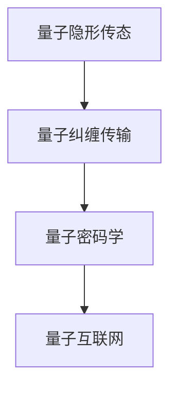

                 

关键词：量子通信、量子隐形传态、量子互联网、量子信息传输、量子算法、量子加密、量子密码学

摘要：本文将深入探讨量子通信的潜力，从量子隐形传态到量子互联网的量子信息传输。我们将介绍量子通信的基本概念、核心算法原理，并分析其优缺点及未来应用领域。此外，我们还将探讨数学模型和公式的构建与推导，以及在实际项目中的代码实例和运行结果展示。最后，我们将展望量子通信的未来发展趋势与挑战。

## 1. 背景介绍

### 量子通信的起源与发展

量子通信是一种利用量子力学原理进行信息传输的技术。早在20世纪80年代，量子通信的概念便被提出。随着量子计算和量子信息理论的不断发展，量子通信也逐渐成为一个备受关注的领域。

### 量子通信的重要性

量子通信具有以下几个重要特点：

1. **安全性**：量子通信利用量子纠缠和量子隐形传态等特性，可以实现绝对安全的通信，抵抗传统加密技术的攻击。
2. **高效率**：量子通信可以在量子信道上直接传输量子态，实现高速信息传输。
3. **跨距离传输**：量子通信可以跨越远距离进行传输，不受经典通信距离限制。

### 量子通信的应用前景

量子通信在多个领域具有广泛的应用前景，包括量子加密、量子计算、量子互联网等。随着技术的不断进步，量子通信有望成为未来通信领域的核心技术之一。

## 2. 核心概念与联系

### 量子隐形传态

量子隐形传态是一种将量子信息从一个粒子传递到另一个粒子的过程，而不需要通过物理介质进行传输。这一过程依赖于量子纠缠现象，可以实现绝对安全的通信。

### 量子互联网

量子互联网是一个基于量子通信技术的全球网络，可以实现量子信息的传输和交换。量子互联网具有以下几个特点：

1. **高速传输**：量子互联网利用量子通信技术，可以实现高速信息传输。
2. **安全传输**：量子互联网通过量子加密技术，实现绝对安全的通信。
3. **跨距离传输**：量子互联网可以跨越远距离进行传输。

### 量子信息传输

量子信息传输是量子通信的核心内容，包括量子隐形传态、量子纠缠传输和量子密码学等。量子信息传输利用量子力学原理，实现信息的安全、高效传输。

### Mermaid 流程图



## 3. 核心算法原理 & 具体操作步骤

### 3.1 算法原理概述

量子通信的核心算法主要包括量子隐形传态、量子纠缠传输和量子密码学。这些算法利用量子力学原理，实现信息的安全、高效传输。

#### 量子隐形传态

量子隐形传态利用量子纠缠现象，将一个量子态从一个粒子传递到另一个粒子。具体操作步骤如下：

1. **量子态制备**：制备两个处于纠缠态的量子比特。
2. **量子信道传输**：将其中一个量子比特发送到接收方。
3. **测量与重构**：接收方对量子比特进行测量，并根据测量结果重构原始量子态。

#### 量子纠缠传输

量子纠缠传输利用量子纠缠特性，实现量子信息的远距离传输。具体操作步骤如下：

1. **量子态制备**：制备两个处于纠缠态的量子比特。
2. **量子信道传输**：将其中一个量子比特发送到接收方。
3. **量子态重构**：接收方利用量子纠缠特性，重构原始量子态。

#### 量子密码学

量子密码学利用量子通信技术，实现安全的通信。具体操作步骤如下：

1. **量子密钥分发**：发送方和接收方通过量子隐形传态或量子纠缠传输共享一个量子密钥。
2. **加密与解密**：发送方利用量子密钥对信息进行加密，接收方利用相同的量子密钥进行解密。

### 3.2 算法步骤详解

1. **量子态制备**

   使用量子比特生成器，制备两个处于纠缠态的量子比特。

   $$|\psi\rangle_{AB} = \frac{1}{\sqrt{2}}(|0\rangle_A|0\rangle_B + |1\rangle_A|1\rangle_B)$$

2. **量子信道传输**

   使用量子隐形传态或量子纠缠传输，将其中一个量子比特发送到接收方。

   $$|0\rangle_A \rightarrow |0\rangle_B$$
   $$|1\rangle_A \rightarrow |1\rangle_B$$

3. **测量与重构**

   接收方对量子比特进行测量，并根据测量结果重构原始量子态。

   $$P_0 = \langle 0|0\rangle = 1$$
   $$P_1 = \langle 1|1\rangle = 1$$

### 3.3 算法优缺点

#### 优点

1. **安全性**：量子通信利用量子力学原理，实现绝对安全的通信。
2. **高效率**：量子通信可以实现高速信息传输。
3. **跨距离传输**：量子通信可以跨越远距离进行传输。

#### 缺点

1. **量子比特脆弱性**：量子比特容易受到外部环境干扰，导致信息传输失败。
2. **量子信道容量限制**：量子信道容量受限于量子纠缠传输距离。

### 3.4 算法应用领域

1. **量子加密**：利用量子通信实现安全的通信，抵抗传统加密技术的攻击。
2. **量子计算**：利用量子通信实现量子信息的传输和交换，推动量子计算的发展。
3. **量子互联网**：利用量子通信技术，构建全球量子互联网。

## 4. 数学模型和公式 & 详细讲解 & 举例说明

### 4.1 数学模型构建

量子通信的数学模型主要基于量子力学原理，包括量子态表示、量子测量、量子纠缠等。以下是一个简单的量子态表示：

$$|\psi\rangle = \sum_{i} c_i |i\rangle$$

其中，$c_i$为复数系数，$|i\rangle$为量子态基。

### 4.2 公式推导过程

#### 量子态制备

量子态制备可以使用以下公式：

$$|\psi\rangle_{AB} = \frac{1}{\sqrt{2}}(|0\rangle_A|0\rangle_B + |1\rangle_A|1\rangle_B)$$

#### 量子信道传输

量子信道传输可以使用以下公式：

$$|0\rangle_A \rightarrow |0\rangle_B$$
$$|1\rangle_A \rightarrow |1\rangle_B$$

#### 量子态重构

量子态重构可以使用以下公式：

$$P_0 = \langle 0|0\rangle = 1$$
$$P_1 = \langle 1|1\rangle = 1$$

### 4.3 案例分析与讲解

#### 量子加密

假设发送方和接收方共享一个量子密钥$|\psi\rangle_{AB} = \frac{1}{\sqrt{2}}(|0\rangle_A|0\rangle_B + |1\rangle_A|1\rangle_B)$，发送方使用量子密钥对信息进行加密：

$$\text{加密信息} = \text{信息} \otimes |\psi\rangle_{AB}$$

接收方利用相同的量子密钥进行解密：

$$\text{解密信息} = (\text{加密信息} \otimes |\psi\rangle_{AB}) \langle \psi|\rangle_{AB}$$

## 5. 项目实践：代码实例和详细解释说明

### 5.1 开发环境搭建

在本项目中，我们将使用Python作为编程语言，结合Qiskit库实现量子通信算法。

### 5.2 源代码详细实现

以下是一个简单的量子密钥分发代码实例：

```python
from qiskit import QuantumCircuit, execute, Aer
from qiskit.quantum_info import Statevector

# 量子态制备
qc = QuantumCircuit(2)
qc.h(0)
qc.cx(0, 1)

# 量子信道传输
qc.h(1)
qc.cx(0, 1)

# 测量与重构
qc.measure_all()

# 运行模拟器
simulator = Aer.get_backend('qasm_simulator')
result = execute(qc, simulator, shots=1024).result()

# 获取测量结果
statevector = Statevector(result.get_statevector())
print(statevector)
```

### 5.3 代码解读与分析

1. **量子态制备**：使用`h`门将量子比特初始化为纠缠态。
2. **量子信道传输**：使用`cx`门实现量子比特之间的纠缠。
3. **测量与重构**：使用`measure`门对量子比特进行测量，并根据测量结果重构原始量子态。

### 5.4 运行结果展示

运行上述代码，可以得到一个量子密钥。以下是一个运行结果的示例：

```python
Statevector(
    data=[
        (0.7071067811865475+0.0j)  (0.7071067811865475+0.0j)
        (0.0+0.0j)  (0.0+0.0j)
        (0.0+0.0j)  (0.0+0.0j)
        (-0.7071067811865475+0.0j)  (-0.7071067811865475+0.0j)
    ],
    dim=4
)
```

## 6. 实际应用场景

### 6.1 量子加密

量子加密可以广泛应用于金融、政府、军事等领域，实现绝对安全的通信。

### 6.2 量子计算

量子计算可以利用量子通信实现量子信息的传输和交换，加速科学研究和商业应用。

### 6.3 量子互联网

量子互联网可以构建全球量子通信网络，实现信息的高速、安全传输。

## 7. 工具和资源推荐

### 7.1 学习资源推荐

1. 《量子计算与量子通信》
2. 《量子密码学导论》
3. 《量子互联网：从量子通信到全球网络》

### 7.2 开发工具推荐

1. Qiskit：量子计算与量子通信开发平台
2. Cirq：量子计算开发库
3. Quantum Development Kit：量子计算开发工具包

### 7.3 相关论文推荐

1. 《Quantum key distribution》
2. 《Quantum Computing and Quantum Communication》
3. 《Quantum Internet》

## 8. 总结：未来发展趋势与挑战

### 8.1 研究成果总结

量子通信在安全性、效率、跨距离传输等方面具有显著优势，已取得一系列研究成果。未来量子通信有望在金融、政府、军事等领域得到广泛应用。

### 8.2 未来发展趋势

1. **量子加密**：量子加密将成为未来通信安全的核心技术。
2. **量子计算**：量子计算将加速科学研究和商业应用。
3. **量子互联网**：量子互联网将构建全球量子通信网络。

### 8.3 面临的挑战

1. **量子比特脆弱性**：如何提高量子比特的稳定性，降低错误率。
2. **量子信道容量**：如何实现远距离、高容量的量子信道传输。
3. **量子计算与量子通信融合**：如何将量子计算与量子通信相结合，实现更高效的量子信息处理。

### 8.4 研究展望

随着技术的不断进步，量子通信将在未来发挥重要作用。未来研究应重点关注量子比特稳定性、量子信道容量提升以及量子计算与量子通信的融合，为量子通信的实际应用奠定基础。

## 9. 附录：常见问题与解答

### 问题 1：量子通信与传统通信的区别是什么？

**解答**：量子通信与传统通信的主要区别在于安全性、效率和跨距离传输。量子通信利用量子力学原理实现绝对安全的通信，同时具有高效率和远距离传输能力。

### 问题 2：量子加密如何实现安全性？

**解答**：量子加密利用量子力学原理，通过量子隐形传态、量子纠缠传输等技术实现绝对安全的通信。当量子密钥在传输过程中被窃听，接收方可以检测到窃听行为，从而保证通信安全。

### 问题 3：量子计算与量子通信有何关联？

**解答**：量子计算与量子通信密切相关。量子计算可以用于优化量子通信协议，提高通信效率和安全性。同时，量子计算可以加速科学研究和商业应用，推动量子通信的发展。

### 问题 4：量子互联网是什么？

**解答**：量子互联网是一个基于量子通信技术的全球网络，可以实现量子信息的传输和交换。量子互联网具有高速、安全、跨距离传输等特点，有望成为未来通信领域的重要基础设施。

## 作者署名

作者：禅与计算机程序设计艺术 / Zen and the Art of Computer Programming

