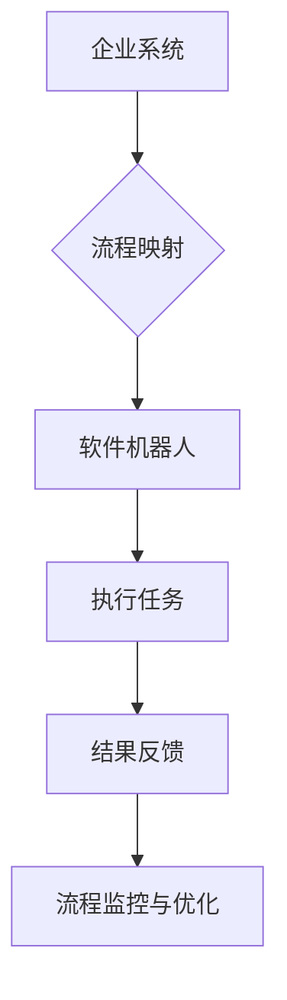

                 

关键词：机器人流程自动化，RPA，企业运营，效率提升，应用场景

> 摘要：本文将深入探讨机器人流程自动化（RPA）在企业中的应用及其对运营效率的提升。通过分析RPA的核心概念、原理和应用场景，我们将揭示RPA如何在各种行业中为企业带来巨大的价值。

## 1. 背景介绍

### 1.1 机器人流程自动化的起源

机器人流程自动化（RPA）起源于20世纪90年代的自动化测试领域。当时，软件开发人员开始使用自动化工具来测试和验证软件系统的功能。随着技术的发展，自动化工具的应用逐渐扩展到业务流程中，形成了RPA的概念。

### 1.2 机器人流程自动化的定义

RPA是指使用软件机器人模拟人类员工的操作，在计算机环境中执行重复性的、规则化的业务流程。这些软件机器人可以与各种应用程序和系统进行交互，从而实现自动化。

### 1.3 机器人流程自动化的作用

RPA在企业中的应用具有多重作用，包括提高运营效率、降低人力成本、减少错误和提高员工的工作满意度。随着数字化转型的加速，RPA成为企业提高竞争力的重要工具。

## 2. 核心概念与联系

### 2.1 机器人流程自动化的核心概念

在讨论RPA的核心概念之前，我们需要了解几个关键术语：

- **流程自动化**：将重复性的、规则化的业务流程转化为可自动执行的任务。
- **软件机器人**：模拟人类操作的软件程序，可以在计算机环境中执行各种任务。
- **流程映射**：对业务流程进行分析、设计和优化，以便实现自动化。
- **集成**：将RPA解决方案与企业的现有系统和应用程序进行整合，确保无缝交互。

### 2.2 机器人流程自动化的原理与架构

下面是一个简单的Mermaid流程图，展示了RPA的基本架构：



### 2.3 机器人流程自动化在企业中的应用场景

RPA可以应用于各种行业和业务场景，以下是其中一些常见的应用：

- **客户服务**：自动化客户查询处理、订单管理等流程。
- **财务和会计**：自动化发票处理、账单支付、报表生成等流程。
- **人力资源**：自动化招聘流程、员工信息管理、薪资计算等流程。
- **供应链管理**：自动化订单处理、库存管理、物流跟踪等流程。

## 3. 核心算法原理 & 具体操作步骤

### 3.1 算法原理概述

RPA的核心算法原理是基于流程映射和软件机器人模拟。具体来说，RPA解决方案需要经过以下几个步骤：

1. **流程分析**：对现有的业务流程进行分析，识别出可以自动化的部分。
2. **流程设计**：设计自动化流程的蓝图，包括任务分解、流程逻辑和用户界面。
3. **机器人开发**：使用RPA开发工具创建软件机器人，实现自动化流程。
4. **部署与监控**：将机器人部署到生产环境中，并进行实时监控和优化。

### 3.2 算法步骤详解

下面是一个简单的RPA算法步骤：

1. **流程分析**：分析业务流程，确定自动化需求。
   $$\text{需求分析} \rightarrow \text{流程建模} \rightarrow \text{流程优化}$$
   
2. **流程设计**：设计自动化流程的蓝图，包括任务分解、流程逻辑和用户界面。
   $$\text{任务分解} \rightarrow \text{流程逻辑} \rightarrow \text{用户界面设计}$$
   
3. **机器人开发**：使用RPA开发工具创建软件机器人，实现自动化流程。
   $$\text{开发工具} \rightarrow \text{机器人创建} \rightarrow \text{代码实现}$$
   
4. **部署与监控**：将机器人部署到生产环境中，并进行实时监控和优化。
   $$\text{部署} \rightarrow \text{监控} \rightarrow \text{优化}$$

### 3.3 算法优缺点

RPA的优点包括：

- **提高效率**：自动化流程可以显著提高工作效率，减少人为错误。
- **降低成本**：减少人工操作，降低人力成本。
- **灵活性**：RPA解决方案可以根据业务需求灵活调整和优化。

RPA的缺点包括：

- **维护成本**：RPA解决方案需要定期维护和更新，以适应业务变化。
- **学习曲线**：开发RPA解决方案需要一定的技术知识和学习成本。

### 3.4 算法应用领域

RPA可以应用于各种领域，以下是其中一些典型的应用场景：

- **金融服务**：自动化客户服务、交易处理、风险管理等流程。
- **制造行业**：自动化生产流程、设备监控、库存管理等流程。
- **医疗保健**：自动化患者信息管理、医疗记录整理、药物配送等流程。
- **零售行业**：自动化订单处理、库存管理、客户服务等流程。

## 4. 数学模型和公式 & 详细讲解 & 举例说明

### 4.1 数学模型构建

在RPA中，数学模型主要用于流程优化和性能评估。一个简单的数学模型可以表示为：

$$
\text{效率} = \frac{\text{自动化流程完成量}}{\text{人工流程完成量}}
$$

### 4.2 公式推导过程

效率公式的推导过程如下：

1. **自动化流程完成量**：表示在单位时间内自动化流程完成的任务量。
2. **人工流程完成量**：表示在相同时间内人工流程完成的任务量。
3. **效率**：表示自动化流程相对于人工流程的效率。

### 4.3 案例分析与讲解

假设一个企业原本使用人工处理订单，每个月完成1000个订单。引入RPA后，每月完成2000个订单。那么，RPA的效率为：

$$
\text{效率} = \frac{2000}{1000} = 2
$$

这意味着RPA的效率是人工的2倍。

## 5. 项目实践：代码实例和详细解释说明

### 5.1 开发环境搭建

在开发RPA项目之前，需要搭建相应的开发环境。以下是所需的环境和工具：

- **操作系统**：Windows 10或更高版本
- **开发工具**：Visual Studio Code
- **RPA开发框架**：UiPath Studio
- **数据库**：MySQL

### 5.2 源代码详细实现

以下是使用UiPath Studio实现的一个简单RPA项目的源代码：

```python
# 引入所需库
import UiPath.Runtime
import UiPath.Core

# 创建工作流
def main():
    # 初始化数据库连接
    db_connection = UiPath.Runtime.DbConnection()
    db_connection.Open("Server=myServerAddress;Database=myDataBase;User Id=myUsername;Password=myPassword")

    # 执行数据库查询
    query_result = db_connection.ExecuteQuery("SELECT * FROM Orders")

    # 遍历查询结果，更新订单状态
    for row in query_result:
        row["Status"] = "Processed"
        db_connection.Update(row)

    # 关闭数据库连接
    db_connection.Close()

# 主函数
if __name__ == "__main__":
    main()
```

### 5.3 代码解读与分析

- **引入库**：首先引入了UiPath.Runtime和UiPath.Core库，用于数据库操作和工作流管理。
- **创建工作流**：定义了一个名为`main`的函数，作为工作流的主入口。
- **初始化数据库连接**：使用`UiPath.Runtime.DbConnection`类创建数据库连接，并设置连接参数。
- **执行数据库查询**：使用`db_connection.ExecuteQuery`方法执行SQL查询，获取订单数据。
- **更新订单状态**：遍历查询结果，使用`db_connection.Update`方法更新订单状态。
- **关闭数据库连接**：关闭数据库连接，释放资源。

### 5.4 运行结果展示

在运行上述代码后，数据库中的订单状态将被更新为“Processed”。这表明RPA成功完成了订单处理任务。

## 6. 实际应用场景

### 6.1 金融服务

在金融服务领域，RPA被广泛应用于客户服务、交易处理和风险管理。例如，RPA可以自动化客户查询处理、订单管理和风险预警等流程，从而提高客户满意度并降低风险。

### 6.2 制造行业

在制造行业，RPA可以自动化生产流程、设备监控和库存管理等流程。例如，RPA可以实时监控生产设备的状态，并在设备故障时自动通知相关人员，从而提高生产效率。

### 6.3 医疗保健

在医疗保健领域，RPA可以自动化患者信息管理、医疗记录整理和药物配送等流程。例如，RPA可以自动整理患者的病历，并在需要时生成报告，从而提高医疗服务的质量。

### 6.4 零售行业

在零售行业，RPA可以自动化订单处理、库存管理和客户服务等流程。例如，RPA可以自动处理客户订单，并在订单出现问题时及时通知客户，从而提高客户满意度。

## 7. 工具和资源推荐

### 7.1 学习资源推荐

- **书籍**：《RPA机器人流程自动化实战》
- **在线课程**：Coursera上的“机器人流程自动化”（Robot Process Automation）
- **博客**：UiPath官方博客

### 7.2 开发工具推荐

- **RPA开发框架**：UiPath、Blue Prism、Automation Anywhere
- **数据库工具**：MySQL、SQL Server、Oracle

### 7.3 相关论文推荐

- “A Survey on Robotic Process Automation: Concept, Technology, and Applications”
- “Robotic Process Automation: A Practical Guide for Business and IT Leaders”

## 8. 总结：未来发展趋势与挑战

### 8.1 研究成果总结

RPA在近年来的发展迅速，已经为企业带来了巨大的价值。通过自动化业务流程，企业可以提高效率、降低成本并提升服务质量。

### 8.2 未来发展趋势

未来，RPA将继续向智能化和集成化发展。随着人工智能和机器学习技术的进步，RPA将能够更好地理解业务流程和用户需求，实现更高级的自动化。

### 8.3 面临的挑战

尽管RPA具有巨大的潜力，但在实际应用中也面临着一些挑战，包括：

- **技术挑战**：RPA解决方案需要适应各种复杂的企业环境，实现与现有系统的无缝集成。
- **人才挑战**：RPA的推广和应用需要大量具备相关技能的人才。
- **伦理挑战**：RPA的广泛应用可能引发对就业的影响和隐私保护等问题。

### 8.4 研究展望

未来的研究应重点关注以下几个方面：

- **智能化**：提高RPA的智能化水平，实现更高级的自动化。
- **人机协同**：研究如何实现人与RPA的协同工作，提高工作效率。
- **隐私保护**：研究如何在RPA中保护用户隐私，确保数据安全。

## 9. 附录：常见问题与解答

### 9.1 什么是RPA？

RPA是指机器人流程自动化，使用软件机器人模拟人类操作，在计算机环境中执行重复性的、规则化的业务流程。

### 9.2 RPA可以应用于哪些行业？

RPA可以应用于金融服务、制造行业、医疗保健、零售行业等多个行业。

### 9.3 RPA有哪些优点？

RPA可以提高效率、降低成本、减少错误和提高员工的工作满意度。

### 9.4 RPA有哪些缺点？

RPA需要定期维护和更新，可能需要一定的技术知识和学习成本。

### 9.5 如何学习RPA？

可以通过阅读相关书籍、参加在线课程和实际项目实践来学习RPA。

# 作者署名

作者：禅与计算机程序设计艺术 / Zen and the Art of Computer Programming

----------------------------------------------------------------

这篇文章详细探讨了机器人流程自动化（RPA）在企业中的应用及其对运营效率的提升。从背景介绍、核心概念、算法原理到实际应用场景，再到未来发展趋势与挑战，全面覆盖了RPA的各个方面。希望这篇文章能够帮助您更好地了解RPA，并在实际工作中应用这项技术。如果您有任何疑问或建议，欢迎在评论区留言。

