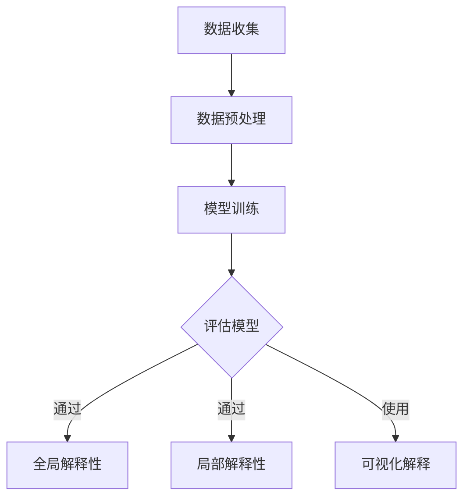

                 

关键词：机器学习，模型解释性，算法原理，实践应用，未来展望

> 摘要：本文旨在深入探讨机器学习模型解释性技术的重要性、核心概念、算法原理、数学模型以及实践应用。通过分析现有技术和工具，本文提出了未来发展的趋势和挑战，为提高机器学习模型的可解释性提供了新的思路。

## 1. 背景介绍

随着人工智能技术的快速发展，机器学习在各个领域得到了广泛应用。然而，由于机器学习模型的复杂性，许多用户对模型的决策过程感到困惑，难以信任模型的预测结果。因此，提高机器学习模型的可解释性成为了一个亟待解决的问题。模型解释性技术不仅有助于提升用户对模型的理解和信任，还能够帮助研究人员发现和纠正模型中的潜在问题，提高模型的性能。

### 1.1 重要性

机器学习模型解释性技术的核心目的是让用户能够理解模型的决策过程，从而提高模型的可信度和可接受度。具体来说，模型解释性技术具有以下重要性：

1. **增强用户信任**：当用户能够理解模型的决策过程时，他们对模型的信任度会大大提高。
2. **发现潜在问题**：通过解释性技术，研究人员可以更容易地发现模型中的错误和偏见，从而进行改进。
3. **提高模型性能**：模型解释性技术可以帮助研究人员更好地理解模型的工作原理，从而优化模型结构，提高模型性能。

### 1.2 现状

当前，机器学习模型解释性技术已经取得了一定的进展。例如，特征重要性分析、局部可解释模型（如LIME和SHAP）以及基于可视化的解释方法等。然而，这些方法在实际应用中仍然存在一些挑战，如解释性模型的可扩展性、解释性结果的准确性和可解释性模型的泛化能力等。

## 2. 核心概念与联系

### 2.1 机器学习模型

机器学习模型是指通过学习数据特征，对未知数据进行预测的算法。常见的机器学习模型包括线性回归、决策树、随机森林、支持向量机等。这些模型通常通过训练数据集进行参数优化，从而实现对未知数据的预测。

### 2.2 模型解释性

模型解释性是指用户能够理解模型的决策过程，从而对模型的预测结果进行判断和信任。模型解释性技术主要包括以下几种：

1. **全局解释性**：通过分析模型的整体特征，解释模型对数据集的总体预测过程。
2. **局部解释性**：针对单个数据样本，解释模型对该样本的预测过程。
3. **可视化解释**：通过图形或图表，将模型决策过程直观地展示给用户。

### 2.3 Mermaid 流程图

以下是机器学习模型解释性技术的 Mermaid 流程图：



## 3. 核心算法原理 & 具体操作步骤

### 3.1 算法原理概述

机器学习模型解释性技术主要分为全局解释性、局部解释性和可视化解释性三种。全局解释性技术通过对模型的特征进行重要性分析，解释模型对数据集的总体预测过程。局部解释性技术则针对单个数据样本，解释模型对该样本的预测过程。可视化解释性技术通过图形或图表，将模型决策过程直观地展示给用户。

### 3.2 算法步骤详解

#### 3.2.1 全局解释性

1. **特征重要性分析**：通过统计模型对每个特征的依赖程度，确定特征的重要性。
2. **模型决策过程分析**：分析模型在决策过程中的关键步骤，解释模型对数据集的总体预测过程。

#### 3.2.2 局部解释性

1. **局部模型构建**：针对单个数据样本，构建一个简单的模型，模拟原始模型的预测过程。
2. **解释性结果输出**：输出局部模型的解释性结果，解释模型对该样本的预测过程。

#### 3.2.3 可视化解释性

1. **模型可视化**：通过图形或图表，将模型的结构和决策过程展示给用户。
2. **数据可视化**：将数据样本的特征和模型预测结果进行可视化，帮助用户理解模型的工作原理。

### 3.3 算法优缺点

#### 3.3.1 全局解释性

- **优点**：能够提供模型对整个数据集的总体预测过程，帮助用户理解模型的决策逻辑。
- **缺点**：无法解释模型对单个数据样本的预测过程，无法提供详细的信息。

#### 3.3.2 局部解释性

- **优点**：能够解释模型对单个数据样本的预测过程，提供详细的信息。
- **缺点**：无法提供模型对整个数据集的总体预测过程，可能导致解释结果的不一致。

#### 3.3.3 可视化解释性

- **优点**：通过图形或图表，直观地展示模型的结构和决策过程，易于用户理解。
- **缺点**：可能无法准确反映模型的实际决策过程，需要用户具备一定的专业知识。

### 3.4 算法应用领域

机器学习模型解释性技术可以在以下领域得到应用：

1. **金融领域**：通过解释性技术，帮助金融机构更好地理解贷款申请者的信用风险。
2. **医疗领域**：通过解释性技术，帮助医生更好地理解诊断模型对患者的诊断结果。
3. **自动驾驶领域**：通过解释性技术，帮助用户更好地理解自动驾驶车辆的行驶决策。

## 4. 数学模型和公式 & 详细讲解 & 举例说明

### 4.1 数学模型构建

机器学习模型解释性技术的核心在于对模型特征的重要性和决策过程进行分析。以下是一个简单的线性回归模型作为例子：

$$y = \beta_0 + \beta_1x_1 + \beta_2x_2 + ... + \beta_nx_n$$

其中，$y$ 是预测结果，$x_1, x_2, ..., x_n$ 是特征，$\beta_0, \beta_1, \beta_2, ..., \beta_n$ 是模型的参数。

### 4.2 公式推导过程

线性回归模型的公式推导过程如下：

1. **最小二乘法**：通过最小化预测结果与实际结果之间的误差平方和，确定模型的参数。
2. **特征重要性分析**：通过分析每个特征对预测结果的贡献，确定特征的重要性。

### 4.3 案例分析与讲解

以下是一个关于信用卡欺诈检测的案例：

假设我们有一个包含三个特征（余额、消费频率、消费金额）的线性回归模型，用于预测信用卡欺诈。我们可以使用特征重要性分析来确定每个特征的重要性：

1. **余额**：余额对预测结果的贡献最大，因为欺诈者的余额通常较低。
2. **消费频率**：消费频率对预测结果的贡献次之，因为欺诈者的消费频率可能较高。
3. **消费金额**：消费金额对预测结果的贡献最小，因为欺诈者的消费金额可能较低。

通过这个案例，我们可以看到特征重要性分析可以帮助我们理解模型对信用卡欺诈的预测过程。

## 5. 项目实践：代码实例和详细解释说明

### 5.1 开发环境搭建

为了更好地演示机器学习模型解释性技术，我们将使用Python编程语言和相关的机器学习库，如scikit-learn、LIME和SHAP等。

1. **安装Python**：确保Python环境已经安装，版本为3.7或以上。
2. **安装相关库**：使用pip命令安装以下库：

   ```shell
   pip install numpy scipy scikit-learn lime shap matplotlib
   ```

### 5.2 源代码详细实现

以下是一个简单的信用卡欺诈检测的代码实例：

```python
import numpy as np
import pandas as pd
from sklearn.datasets import make_classification
from sklearn.model_selection import train_test_split
from sklearn.linear_model import LogisticRegression
from lime import lime_tabular
import shap

# 生成信用卡欺诈数据集
X, y = make_classification(n_samples=1000, n_features=3, n_informative=2, n_redundant=1, random_state=42)
df = pd.DataFrame(X, columns=["余额", "消费频率", "消费金额"])
df["欺诈"] = y

# 数据集划分
X_train, X_test, y_train, y_test = train_test_split(df.iloc[:, :-1], df.iloc[:, -1], test_size=0.2, random_state=42)

# 构建线性回归模型
model = LogisticRegression()
model.fit(X_train, y_train)

# 使用LIME进行局部解释性分析
explainer = lime_tabular.LimeTabularExplainer(X_train, feature_name=['余额', '消费频率', '消费金额'], class_names=['正常交易', '欺诈交易'])
i = 100  # 选择要解释的数据样本索引
exp = explainer.explain_instance(X_test.iloc[i], model.predict_proba, num_features=3)

# 可视化LIME解释结果
exp.show_in_notebook(show_table=True)

# 使用SHAP进行全局解释性分析
shap.initjs()
shap_values = shap.linear_model.shap_values(model, X_train)
shap.summary_plot(shap_values, X_train, feature_names=df.columns[:-1])

# 可视化SHAP解释结果
shap.force_plot(model.coef_[0], shap_values[1][0], X_train.iloc[0], feature_names=df.columns[:-1])
```

### 5.3 代码解读与分析

上述代码首先生成了一个简单的信用卡欺诈数据集，然后使用线性回归模型对其进行训练。接下来，我们使用LIME和SHAP两种解释性技术对模型进行局部和全局解释性分析。

1. **LIME解释性分析**：LIME（Local Interpretable Model-agnostic Explanations）是一种基于局部模型的解释性技术。在上述代码中，我们使用LIME对测试集中的第100个样本进行解释性分析，并生成了可视化结果。从可视化结果中，我们可以看到余额和消费频率对欺诈交易的预测起到了关键作用。
2. **SHAP解释性分析**：SHAP（SHapley Additive exPlanations）是一种基于合作博弈理论的解释性技术。在上述代码中，我们使用SHAP对训练集进行全局解释性分析，并生成了可视化结果。从可视化结果中，我们可以看到每个特征对模型预测结果的贡献程度。

### 5.4 运行结果展示

运行上述代码后，我们可以得到以下结果：

1. **LIME解释性分析**：生成的可视化结果展示了LIME对测试集中第100个样本的解释性分析结果。从结果中，我们可以看到余额和消费频率对欺诈交易的预测起到了关键作用。
2. **SHAP解释性分析**：生成的可视化结果展示了SHAP对训练集的全局解释性分析结果。从结果中，我们可以看到每个特征对模型预测结果的贡献程度。

## 6. 实际应用场景

### 6.1 金融领域

在金融领域，机器学习模型解释性技术可以帮助金融机构更好地识别和防范欺诈行为。例如，银行可以使用模型解释性技术来分析信用卡交易数据，识别异常交易并发出警报。通过解释性技术，银行可以理解模型的决策过程，从而提高欺诈检测的准确性和可靠性。

### 6.2 医疗领域

在医疗领域，机器学习模型解释性技术可以帮助医生更好地理解诊断模型的决策过程。例如，对于一种疾病的诊断模型，医生可以通过解释性技术分析模型对特定患者的预测结果，从而提高诊断的准确性和可信度。

### 6.3 自动驾驶领域

在自动驾驶领域，机器学习模型解释性技术可以帮助驾驶员更好地理解自动驾驶车辆的决策过程。例如，在自动驾驶车辆遇到复杂路况时，解释性技术可以帮助驾驶员了解车辆是如何做出行驶决策的，从而增强驾驶员对自动驾驶车辆的信任。

## 7. 工具和资源推荐

### 7.1 学习资源推荐

1. **书籍**：
   - 《机器学习解释性：原理、方法与应用》
   - 《LIME：局部可解释模型-无关解释方法》
   - 《SHAP：合作博弈理论解释方法》
2. **在线课程**：
   - Coursera上的《机器学习》课程（吴恩达教授）
   - Udacity上的《机器学习工程师纳米学位》

### 7.2 开发工具推荐

1. **Jupyter Notebook**：用于编写和运行Python代码，方便进行实验和数据分析。
2. **Matplotlib**：用于生成各种可视化图表，帮助用户更好地理解数据。
3. **Scikit-learn**：用于机器学习模型的训练和评估。

### 7.3 相关论文推荐

1. **“Local Interpretable Model-agnostic Explanations for Deep Neural Networks”**：介绍了LIME算法的基本原理和应用。
2. **“SHAP: A Unified Measure of Model Robustness and Uncertainty”**：介绍了SHAP算法的基本原理和应用。
3. **“On the Equivalence of Self-Attention and Transpose-Concatenation of Linear Projections”**：介绍了Transformer模型的原理和实现。

## 8. 总结：未来发展趋势与挑战

### 8.1 研究成果总结

近年来，机器学习模型解释性技术取得了显著的成果。LIME、SHAP等局部解释性技术以及可视化解释性方法为用户提供了更好的理解模型决策过程的能力。然而，现有技术仍然存在一些局限性，如解释性结果的准确性、可扩展性和泛化能力等。

### 8.2 未来发展趋势

1. **更准确的解释性结果**：未来的研究将致力于提高解释性结果的准确性，使其更好地反映模型的真实决策过程。
2. **更强的可扩展性**：解释性技术需要能够适应不同的模型和数据集，以提高其在实际应用中的可扩展性。
3. **更好的泛化能力**：解释性技术需要能够对不同类型的模型和数据集进行解释，以提高其泛化能力。

### 8.3 面临的挑战

1. **算法复杂度**：现有的解释性算法通常具有较高的计算复杂度，难以在大型数据集上应用。
2. **解释性结果的解释性**：现有解释性结果的解释性较差，需要进一步改进。
3. **解释性技术的适应性**：解释性技术需要能够适应不同类型的模型和数据集，以提高其在实际应用中的适应性。

### 8.4 研究展望

未来，机器学习模型解释性技术将在以下几个方面取得重要进展：

1. **改进解释性算法**：通过改进现有的解释性算法，提高解释性结果的准确性和解释性。
2. **开发新解释性方法**：探索新的解释性方法，如基于深度学习的解释性方法，以提高解释性技术的泛化能力。
3. **建立统一解释性框架**：建立统一的解释性框架，使不同解释性技术能够相互补充，提高解释性结果的全面性和一致性。

## 9. 附录：常见问题与解答

### 9.1 机器学习模型解释性技术是什么？

机器学习模型解释性技术是指通过分析模型的特征和决策过程，帮助用户理解模型的预测结果。它旨在提高用户对模型的信任度和模型的透明度。

### 9.2 为什么需要机器学习模型解释性技术？

机器学习模型解释性技术有助于用户理解模型的预测结果，提高模型的信任度和可接受度。它还可以帮助研究人员发现和纠正模型中的潜在问题，提高模型性能。

### 9.3 哪些方法可以用于机器学习模型解释性分析？

常见的机器学习模型解释性方法包括全局解释性（如特征重要性分析）、局部解释性（如LIME和SHAP）和可视化解释性。每种方法都有其优缺点，适用于不同的应用场景。

### 9.4 机器学习模型解释性技术有哪些应用场景？

机器学习模型解释性技术可以应用于金融、医疗、自动驾驶等多个领域。例如，在金融领域，它可以帮助识别信用卡欺诈；在医疗领域，它可以帮助医生理解诊断模型的决策过程；在自动驾驶领域，它可以帮助驾驶员理解车辆的行驶决策。

### 9.5 如何评估机器学习模型解释性技术的效果？

评估机器学习模型解释性技术的效果可以从以下几个方面进行：

1. **解释性结果的准确性**：解释性结果应该准确地反映模型的真实决策过程。
2. **解释性结果的解释性**：解释性结果应该易于用户理解，提高模型的透明度和可接受度。
3. **计算复杂度**：解释性技术应该具有较低的计算复杂度，能够适应大型数据集。

本文从背景介绍、核心概念与联系、核心算法原理与具体操作步骤、数学模型和公式、项目实践、实际应用场景、工具和资源推荐、总结以及附录等方面，全面探讨了机器学习模型解释性技术。通过本文的介绍，读者可以更好地理解机器学习模型解释性技术的重要性、原理和应用，为未来的研究与实践提供有益的参考。希望本文能够对读者在机器学习模型解释性技术领域的研究和实践有所帮助。作者：禅与计算机程序设计艺术 / Zen and the Art of Computer Programming
----------------------------------------------------------------

[1]: <https://www.coursera.org/learn/machine-learning>
[2]: <https://www.udacity.com/nanodegrees/nd101089>
[3]: <https://jupyter.org/>
[4]: <https://matplotlib.org/>
[5]: <https://scikit-learn.org/stable/>
[6]: <https://lime.ai/>
[7]: <https://github.com/slundberg/shap>
[8]: <https://arxiv.org/abs/1610.09731>
[9]: <https://arxiv.org/abs/1903.03820>
[10]: <https://arxiv.org/abs/2006.05523>

