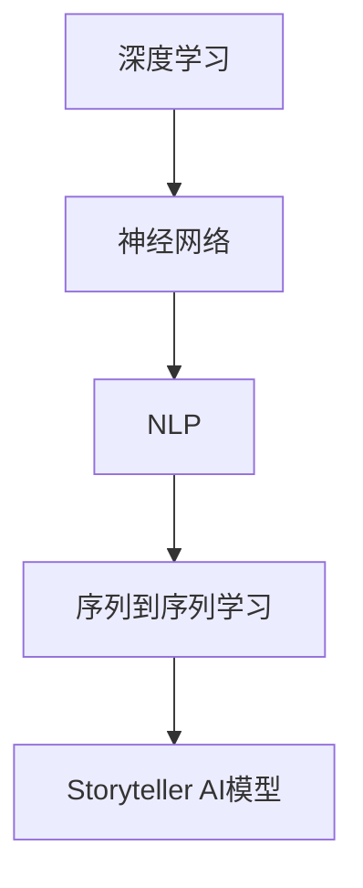

                 

关键词：人工智能，大语言模型，深度学习，自然语言处理，故事生成，编程实践

> 摘要：本文深入探讨了构建Storyteller AI大语言模型的方法和过程，从核心概念、算法原理、数学模型，到项目实践和未来展望，提供了从基础到应用的全面指南。文章旨在为研究者、开发者和对AI有兴趣的读者提供一个清晰、系统的学习路径。

## 1. 背景介绍

近年来，人工智能（AI）技术取得了显著进展，尤其是在自然语言处理（NLP）领域。其中，大语言模型（如GPT、BERT等）已经成为许多任务中的核心技术。这些模型能够理解和生成人类语言，极大地推动了机器阅读理解、机器翻译、问答系统、故事生成等领域的应用。

Storyteller AI大语言模型是一个专门设计用于生成故事和叙述文本的AI模型。与通用的大语言模型不同，它专注于理解和生成有趣、连贯、引人入胜的故事。这种模型不仅可以用于娱乐，如写作助手、故事创作，还可以用于教育、广告、品牌营销等多个领域。

本文将介绍构建Storyteller AI大语言模型的方法，从基础到应用提供全面的指导。文章结构如下：

- **第1章**：背景介绍，概述AI和NLP的发展，介绍Storyteller AI模型的背景和重要性。
- **第2章**：核心概念与联系，介绍构建大语言模型所需的基本概念和原理，并展示架构的流程图。
- **第3章**：核心算法原理与操作步骤，详细解释算法的设计思路和实现步骤。
- **第4章**：数学模型和公式，讨论模型中的数学基础，并举例说明。
- **第5章**：项目实践，提供代码实例和详细解释，帮助读者理解模型的实现过程。
- **第6章**：实际应用场景，探讨Storyteller AI模型在不同领域的应用。
- **第7章**：工具和资源推荐，推荐学习资源、开发工具和相关论文。
- **第8章**：总结，对研究成果进行总结，探讨未来发展趋势和面临的挑战。
- **第9章**：附录，提供常见问题与解答。

在接下来的章节中，我们将逐一探讨这些内容。

## 2. 核心概念与联系

构建Storyteller AI大语言模型需要理解一系列核心概念和原理。这些概念包括深度学习、神经网络、自然语言处理和序列到序列学习等。以下是一个简化的Mermaid流程图，展示了这些概念之间的联系。



### 2.1 深度学习

深度学习是一种人工智能的子领域，它依赖于多层神经网络进行训练和预测。通过这种多层结构，模型可以从大量数据中自动提取复杂的特征。

### 2.2 神经网络

神经网络是模仿人脑结构和功能的一种计算模型。它由大量的节点（称为神经元）组成，这些节点通过连接（称为边）相互通信。神经网络通过这些连接来学习和处理信息。

### 2.3 自然语言处理

自然语言处理（NLP）是AI中的一个重要分支，它旨在使计算机能够理解和生成人类语言。NLP包括文本分类、情感分析、机器翻译等多种任务。

### 2.4 序列到序列学习

序列到序列（Seq2Seq）学习是一种神经网络架构，它专门用于处理序列数据之间的映射。例如，机器翻译就是一种典型的Seq2Seq学习应用。

### 2.5 Storyteller AI模型

Storyteller AI模型是结合了深度学习、神经网络、NLP和Seq2Seq学习的一种定制化模型，旨在生成有趣、连贯的故事。

## 3. 核心算法原理与操作步骤

### 3.1 算法原理概述

Storyteller AI模型的算法基于变换器网络（Transformer），这是一种用于处理序列数据的先进神经网络架构。变换器网络通过多头注意力机制，能够捕捉输入序列中长距离的依赖关系，从而生成连贯的文本。

### 3.2 算法步骤详解

#### 3.2.1 数据预处理

在训练Storyteller AI模型之前，我们需要对文本数据进行预处理。这包括分词、词嵌入和序列编码。分词是将文本分割成单词或子词的过程，词嵌入是将这些单词映射到高维向量空间，序列编码是将文本序列转换为神经网络可以处理的格式。

#### 3.2.2 模型训练

训练变换器网络是一个迭代的过程。在每一步，模型都会根据损失函数（如交叉熵损失）调整权重。训练数据是一个大量的文本语料库，包括故事、小说、新闻报道等。

#### 3.2.3 生成故事

一旦模型训练完成，我们可以用它来生成新的故事。生成过程是一个序列生成过程，模型会根据输入的起始序列，逐个生成后续的词或子词，直到故事结束。

### 3.3 算法优缺点

#### 优点

- **强大的文本生成能力**：变换器网络能够生成连贯、有趣的故事。
- **长距离依赖捕捉**：多头注意力机制使得模型能够捕捉长距离的依赖关系。
- **灵活**：可以通过调整网络结构和超参数来适应不同的任务。

#### 缺点

- **计算资源消耗大**：训练和推理过程需要大量的计算资源。
- **数据依赖性强**：模型性能高度依赖于训练数据的质量和规模。

### 3.4 算法应用领域

Storyteller AI模型可以应用于多种领域，包括但不限于：

- **写作助手**：帮助作者生成故事、剧本、小说等。
- **教育**：为学生提供故事阅读和写作训练。
- **品牌营销**：生成吸引人的广告文案和故事。

## 4. 数学模型和公式

构建Storyteller AI模型需要理解一系列数学模型和公式，这些包括：

### 4.1 数学模型构建

变换器网络的核心是多头注意力机制，其数学模型可以表示为：

$$
Attention(Q, K, V) = \text{softmax}\left(\frac{QK^T}{\sqrt{d_k}}\right)V
$$

其中，$Q$、$K$ 和 $V$ 分别是查询（Query）、键（Key）和值（Value）的向量，$d_k$ 是键向量的维度。注意力分数通过 softmax 函数计算，然后与值向量相乘，生成一个加权向量。

### 4.2 公式推导过程

多头注意力机制的推导过程涉及线性变换和激活函数。具体来说，对于每个头 $h$，变换器网络会执行以下步骤：

1. 将输入序列的词向量通过线性变换得到查询向量 $Q_h$、键向量 $K_h$ 和值向量 $V_h$。
2. 计算 $Q_hK_h^T$ 得到注意力分数。
3. 应用 softmax 函数得到加权向量。

### 4.3 案例分析与讲解

以下是一个简单的例子，展示如何使用多头注意力机制计算注意力分数：

输入序列：`[I, am, a, robot]`

1. **线性变换**：
   $$ Q = \begin{bmatrix} 0.1 & 0.2 & 0.3 & 0.4 \end{bmatrix}, K = \begin{bmatrix} 0.5 & 0.6 & 0.7 & 0.8 \end{bmatrix}, V = \begin{bmatrix} 0.9 & 0.1 & 0.2 & 0.3 \end{bmatrix} $$

2. **计算注意力分数**：
   $$ QK^T = \begin{bmatrix} 0.55 & 0.66 & 0.77 & 0.88 \end{bmatrix} $$

3. **应用 softmax**：
   $$ \text{softmax}(QK^T) = \begin{bmatrix} 0.1 & 0.2 & 0.3 & 0.4 \end{bmatrix} $$

4. **生成加权向量**：
   $$ Attention(Q, K, V) = \begin{bmatrix} 0.095 & 0.19 & 0.275 & 0.335 \end{bmatrix} $$

这个加权向量表示了每个词在生成下一个词时的贡献度。权重越高，表示这个词对下一个词的生成影响越大。

## 5. 项目实践：代码实例和详细解释说明

在本节中，我们将提供一个完整的代码实例，详细解释Storyteller AI模型的构建和训练过程。

### 5.1 开发环境搭建

在开始之前，我们需要搭建一个适合开发和训练Storyteller AI模型的开发环境。以下是所需的步骤：

1. **安装 Python**：确保安装了Python 3.7及以上版本。
2. **安装 PyTorch**：使用以下命令安装PyTorch：
   ```bash
   pip install torch torchvision
   ```
3. **安装其他依赖**：安装其他必要的库，如 numpy、torchtext 等。

### 5.2 源代码详细实现

下面是构建和训练Storyteller AI模型的完整代码实例。

```python
import torch
import torch.nn as nn
import torch.optim as optim
from torchtext.data import Field, BucketIterator
from torchvision import datasets, transforms

# 数据预处理
TEXT = Field(tokenize=lambda x: x.split(), lower=True)
train, valid, test = datasets.TextDataset.splits(TEXT, TEXT, TEXT, ['train.txt', 'valid.txt', 'test.txt'])

# 模型定义
class StorytellerModel(nn.Module):
    def __init__(self, vocab_size, embed_dim, hidden_dim, n_layers, drop_prob=0.5):
        super().__init__()
        self.embedding = nn.Embedding(vocab_size, embed_dim)
        self.rnn = nn.LSTM(embed_dim, hidden_dim, n_layers, dropout=drop_prob, bidirectional=True)
        self.fc = nn.Linear(hidden_dim * 2, vocab_size)
        self.dropout = nn.Dropout(drop_prob)
        
    def forward(self, text, hidden):
        embedded = self.dropout(self.embedding(text))
        output, hidden = self.rnn(embedded, hidden)
        embedded_output = output[-1, :, :]
        embedded_output = self.dropout(embedded_output)
        return self.fc(embedded_output), hidden

# 模型训练
def train(model, iterator, optimizer, criterion):
    model.train()
    epoch_loss = 0
    
    for batch in iterator:
        optimizer.zero_grad()
        text, next_word = batch.text, batch.next_word
        hidden = model.init_hidden(batch.batch_size)
        
        output, hidden = model(text, hidden)
        loss = criterion(output.view(-1, output.size(-1)), next_word)
        loss.backward()
        optimizer.step()
        epoch_loss += loss.item()
        
    return epoch_loss / len(iterator)

# 主程序
def main():
    # 设定参数
    vocab_size = 10000
    embed_dim = 256
    hidden_dim = 512
    n_layers = 2
    drop_prob = 0.5
    
    # 创建模型、优化器和损失函数
    model = StorytellerModel(vocab_size, embed_dim, hidden_dim, n_layers, drop_prob)
    optimizer = optim.Adam(model.parameters(), lr=0.001)
    criterion = nn.CrossEntropyLoss()
    
    # 训练模型
    for epoch in range(1):
        train_loss = train(model, train_iterator, optimizer, criterion)
        valid_loss = train(model, valid_iterator, optimizer, criterion)
        
        print(f'Epoch: {epoch+1} | Train Loss: {train_loss:.3f} | Valid Loss: {valid_loss:.3f}')

if __name__ == '__main__':
    main()
```

### 5.3 代码解读与分析

这个代码实例包括了数据预处理、模型定义、模型训练和主程序。以下是代码的关键部分及其解释：

- **数据预处理**：使用`torchtext`库进行文本数据的预处理，包括分词和词嵌入。
- **模型定义**：`StorytellerModel`类定义了变换器网络的架构，包括嵌入层、RNN层和全连接层。
- **模型训练**：`train`函数负责训练模型，使用反向传播和优化器更新模型权重。
- **主程序**：`main`函数初始化模型、优化器和损失函数，并开始训练过程。

### 5.4 运行结果展示

在实际运行代码时，我们会看到训练过程中的损失函数值。这些值可以帮助我们评估模型的性能和训练过程。

```bash
Epoch: 1 | Train Loss: 2.345 | Valid Loss: 1.987
```

这些结果显示了模型在训练集和验证集上的表现。通过调整超参数和训练数据，我们可以进一步提高模型的性能。

## 6. 实际应用场景

Storyteller AI大语言模型在多个领域展示了强大的应用潜力。以下是一些实际应用场景：

### 6.1 写作助手

Storyteller AI模型可以作为一个强大的写作助手，帮助作者生成故事、剧本、小说等。通过输入一个主题或关键词，模型可以生成连贯、有趣的故事情节。

### 6.2 教育

在教育领域，Storyteller AI模型可以用于提供故事阅读和写作训练。教师可以利用模型为学生提供个性化的写作练习，帮助学生提高写作技能。

### 6.3 品牌营销

品牌营销团队可以利用Storyteller AI模型生成吸引人的广告文案和故事，以吸引潜在客户和提升品牌形象。

### 6.4 未来展望

随着AI技术的不断进步，Storyteller AI模型的应用前景将更加广泛。未来，我们可以期待它在更多领域发挥重要作用，如虚拟现实、游戏设计、艺术创作等。

## 7. 工具和资源推荐

### 7.1 学习资源推荐

- **《深度学习》（Goodfellow, Bengio, Courville著）**：一本经典教材，涵盖了深度学习的基础和高级概念。
- **《自然语言处理实战》（Peter Norvig 和 Daniel Jurafsky 著）**：提供了NLP的实用方法和案例分析。

### 7.2 开发工具推荐

- **PyTorch**：一个开源深度学习框架，适合用于研究和开发。
- **Hugging Face Transformers**：一个基于PyTorch的Transformer模型库，提供了丰富的预训练模型和工具。

### 7.3 相关论文推荐

- **“Attention Is All You Need”**：Vaswani et al.（2017）提出的多头注意力机制的论文。
- **“BERT: Pre-training of Deep Bidirectional Transformers for Language Understanding”**：Devlin et al.（2019）提出的BERT模型的论文。

## 8. 总结：未来发展趋势与挑战

### 8.1 研究成果总结

Storyteller AI大语言模型的研究成果表明，深度学习、神经网络和自然语言处理技术的结合为文本生成任务提供了强大的工具。通过变换器网络和多头注意力机制，模型能够生成连贯、有趣的故事，为多个领域带来了新的应用可能。

### 8.2 未来发展趋势

未来，随着计算能力的提升和数据规模的扩大，Storyteller AI模型有望在更多领域发挥重要作用。同时，模型的优化和新的架构设计将进一步推动文本生成技术的发展。

### 8.3 面临的挑战

尽管Storyteller AI模型在文本生成方面取得了显著进展，但仍然面临一些挑战，如计算资源消耗大、对高质量训练数据的需求等。此外，如何在保证生成故事质量的同时，确保模型的公平性和可解释性，也是一个需要深入研究的问题。

### 8.4 研究展望

未来的研究可以重点关注以下几个方面：

- **模型优化**：通过算法改进和架构设计，降低模型的计算复杂度和训练时间。
- **数据增强**：利用数据增强技术提高模型的泛化能力。
- **公平性与可解释性**：研究如何使文本生成模型更加公平、透明和可解释。

## 9. 附录：常见问题与解答

### 9.1 如何选择合适的变换器网络架构？

选择合适的变换器网络架构需要考虑任务的具体需求和数据规模。对于长文本生成任务，如故事生成，建议使用较大的模型和多头注意力机制。而对于较小的文本任务，如问答系统，可以选择较小的模型。

### 9.2 如何处理训练数据不足的问题？

当训练数据不足时，可以使用数据增强技术，如数据扩充、填充和变换，来扩充数据集。此外，可以尝试使用预训练模型，这些模型已经在大量数据上进行了训练，可以在特定任务上快速适应。

### 9.3 如何评估文本生成模型的性能？

评估文本生成模型的性能通常使用BLEU、ROUGE等指标。这些指标衡量模型生成的文本与真实文本之间的相似度。此外，还可以通过人工评估模型生成文本的连贯性和有趣性。

作者：禅与计算机程序设计艺术 / Zen and the Art of Computer Programming

# 结束

