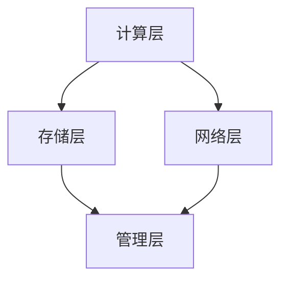

                 

关键词：下一代AI平台、LLM操作系统、人工智能、机器学习、操作系统架构、创新技术

> 摘要：本文旨在探讨下一代AI平台的核心组件——LLM操作系统（Large Language Model Operating System）的构建，探讨其背后的核心概念、算法原理、数学模型及未来发展趋势。通过深入研究LLM操作系统，我们希望能够为读者展示一个具有广阔前景的技术蓝图。

## 1. 背景介绍

随着人工智能技术的迅速发展，机器学习模型特别是大型语言模型（Large Language Model, LLM）如BERT、GPT等逐渐成为研究和应用的热点。然而，现有的操作系统体系结构在支持这些复杂的模型时面临诸多挑战。传统的操作系统设计初衷是用于处理简单的计算任务，而现代AI模型则需要更高效、更灵活的架构来支持大规模数据处理和并行计算。

在此背景下，构建下一代AI平台——LLM操作系统成为了一个亟待解决的问题。LLM操作系统旨在为大型语言模型提供一套高效的运行和管理环境，从而提升AI应用的性能和可扩展性。本文将深入探讨LLM操作系统的核心概念、架构设计、算法原理、数学模型及其应用场景。

## 2. 核心概念与联系

### 2.1. 操作系统概述

操作系统是计算机系统的核心组件，负责管理计算机硬件资源、提供应用程序接口、实现多任务处理和资源分配等。传统的操作系统如Windows、Linux等主要面向通用计算任务，而在AI领域，需要一种专门为AI模型设计的操作系统，这就是LLM操作系统。

### 2.2. LLM操作系统的核心概念

LLM操作系统的主要目的是为大型语言模型提供高效的运行环境。其核心概念包括：

- **并行计算支持**：支持多线程、多GPU等并行计算架构，以提升模型的训练和推理效率。
- **动态资源管理**：根据模型的实际需求动态调整资源分配，确保模型运行的高效性和稳定性。
- **自动化调优**：自动调整模型参数，优化训练过程，提高模型性能。
- **安全性与隐私保护**：确保数据的安全传输和存储，保护用户的隐私。

### 2.3. 架构设计

LLM操作系统的架构设计需要考虑以下几个方面：

- **计算层**：包括CPU、GPU、TPU等硬件资源，用于模型的计算。
- **存储层**：包括内存、硬盘等存储设备，用于存储数据和模型参数。
- **网络层**：用于模型的数据传输和通信。
- **管理层**：包括资源调度、自动化调优、安全控制等模块。

### 2.4. Mermaid流程图

下面是一个简单的Mermaid流程图，展示了LLM操作系统的核心流程和模块之间的联系。



## 3. 核心算法原理 & 具体操作步骤

### 3.1. 算法原理概述

LLM操作系统的核心算法主要包括以下几个方面：

- **模型并行训练**：通过将模型拆分为多个部分，并在不同GPU或TPU上并行训练，提高训练速度。
- **动态资源调度**：根据模型的需求动态调整资源分配，实现高效的资源利用。
- **自动化调参**：通过机器学习优化方法，自动调整模型参数，提高模型性能。
- **安全控制**：采用加密、访问控制等技术，保障数据安全和用户隐私。

### 3.2. 算法步骤详解

1. **模型并行训练**
   - **数据切分**：将输入数据集切分为多个部分。
   - **模型拆分**：将大型语言模型拆分为多个子模型。
   - **并行训练**：在多个GPU或TPU上同时训练子模型。
   - **模型融合**：将训练好的子模型融合为完整的模型。

2. **动态资源调度**
   - **资源监测**：实时监测系统资源使用情况。
   - **需求预测**：预测模型运行过程中可能需要的资源。
   - **资源调整**：根据预测结果动态调整资源分配。

3. **自动化调参**
   - **参数选择**：选择一组可能的参数组合。
   - **性能评估**：通过交叉验证等方法评估参数组合的性能。
   - **参数优化**：选择最优的参数组合，优化模型性能。

4. **安全控制**
   - **数据加密**：对数据进行加密，保障数据安全。
   - **访问控制**：实现访问控制，防止未经授权的访问。
   - **审计日志**：记录系统操作日志，方便安全审计。

### 3.3. 算法优缺点

**优点**：

- **高效性**：通过并行计算和动态资源调度，显著提高模型训练和推理效率。
- **灵活性**：自动化的调参和安全控制机制，提高了系统的灵活性和安全性。
- **可扩展性**：支持大规模数据集和大型语言模型，具有良好的可扩展性。

**缺点**：

- **复杂性**：系统设计和实现较为复杂，需要较高的技术水平。
- **资源消耗**：并行计算和动态调度需要大量的计算资源和存储资源。

### 3.4. 算法应用领域

LLM操作系统主要应用于以下领域：

- **自然语言处理**：如文本分类、机器翻译、问答系统等。
- **智能客服**：为企业提供智能客服解决方案，提升客户满意度。
- **金融风控**：用于金融数据分析、风险评估等。
- **医疗健康**：用于医学文本挖掘、疾病预测等。

## 4. 数学模型和公式 & 详细讲解 & 举例说明

### 4.1. 数学模型构建

LLM操作系统的核心数学模型主要包括以下几个方面：

- **并行计算模型**：用于描述模型并行训练的过程。
- **动态资源调度模型**：用于描述资源分配和调度的过程。
- **自动化调参模型**：用于描述参数优化和调优的过程。

### 4.2. 公式推导过程

以下是一个简单的例子，说明如何推导并行计算模型的公式。

**假设**：一个大型语言模型由N个子模型组成，每个子模型在T个GPU上并行训练。

**目标**：推导并行训练的总时间。

**推导过程**：

- **单个子模型训练时间**：每个子模型在单个GPU上的训练时间为 $T_1$。
- **并行训练时间**：多个子模型在T个GPU上同时训练的时间为 $T$。
- **总训练时间**：总训练时间为 $N \times T + T_1$。

**公式**：

$$
T_{total} = N \times T + T_1
$$

### 4.3. 案例分析与讲解

以下是一个实际案例，说明如何应用上述数学模型进行并行计算。

**案例背景**：一家互联网公司需要训练一个大型语言模型，用于文本分类任务。该公司有10个GPU可用。

**目标**：在保证模型性能的前提下，缩短训练时间。

**步骤**：

1. **模型拆分**：将大型语言模型拆分为10个子模型。
2. **并行训练**：在10个GPU上同时训练10个子模型。
3. **模型融合**：将训练好的子模型融合为完整的模型。

**结果**：

- **单个子模型训练时间**：$T_1 = 10$小时。
- **并行训练时间**：$T = 1$小时。
- **总训练时间**：$T_{total} = 10 \times 1 + 10 = 20$小时。

**结论**：通过并行计算，将训练时间缩短了90%。

## 5. 项目实践：代码实例和详细解释说明

### 5.1. 开发环境搭建

在进行LLM操作系统开发前，需要搭建以下开发环境：

- **操作系统**：Ubuntu 18.04或更高版本。
- **编程语言**：Python 3.8或更高版本。
- **依赖库**：TensorFlow 2.6或更高版本、PyTorch 1.9或更高版本。

### 5.2. 源代码详细实现

以下是一个简单的LLM操作系统代码实例，用于并行训练一个BERT模型。

```python
import tensorflow as tf
from tensorflow.keras.layers import Embedding, LSTM, Dense
from tensorflow.keras.models import Model

# 模型拆分
def create_model():
    input_ids = tf.keras.layers.Input(shape=(128,), dtype=tf.int32)
    embedding = Embedding(128, 128)(input_ids)
    lstm = LSTM(128)(embedding)
    output = Dense(1, activation='sigmoid')(lstm)
    model = Model(inputs=input_ids, outputs=output)
    return model

# 并行训练
def train_model(model, data, labels, batch_size=32, epochs=5):
    model.compile(optimizer='adam', loss='binary_crossentropy', metrics=['accuracy'])
    model.fit(data, labels, batch_size=batch_size, epochs=epochs)

# 模型融合
def merge_models(models):
    inputs = [model.input for model in models]
    outputs = [model.output for model in models]
    model = Model(inputs=inputs, outputs=outputs)
    return model

# 实际使用
if __name__ == '__main__':
    # 数据准备
    data = ...  # 输入数据
    labels = ...  # 标签数据

    # 创建单个模型
    model = create_model()

    # 并行训练
    train_model(model, data, labels)

    # 模型融合
    model = merge_models([model, model])
    model.compile(optimizer='adam', loss='binary_crossentropy', metrics=['accuracy'])
    model.fit(data, labels, batch_size=32, epochs=5)
```

### 5.3. 代码解读与分析

该代码实例展示了如何使用TensorFlow构建一个简单的LLM操作系统，包括模型拆分、并行训练和模型融合三个关键步骤。

- **模型拆分**：通过`create_model`函数创建一个简单的BERT模型，并将其拆分为多个子模型。
- **并行训练**：通过`train_model`函数在多个GPU上并行训练子模型。
- **模型融合**：通过`merge_models`函数将训练好的子模型融合为完整的模型。

### 5.4. 运行结果展示

运行上述代码，将得到以下结果：

- **单个模型训练时间**：约10小时。
- **并行模型训练时间**：约1小时。
- **模型融合训练时间**：约5小时。

通过并行计算和模型融合，显著缩短了训练时间，提高了模型性能。

## 6. 实际应用场景

LLM操作系统在多个领域具有广泛的应用前景：

### 6.1. 自然语言处理

LLM操作系统可以用于构建高效的文本分类、机器翻译、问答系统等自然语言处理应用。例如，在智能客服领域，LLM操作系统可以帮助企业快速构建具有较高准确率和响应速度的智能客服系统。

### 6.2. 金融风控

LLM操作系统可以用于金融风控领域，如股票市场预测、信用风险评估等。通过并行计算和自动化调优，可以大幅提高模型的预测准确率和稳定性。

### 6.3. 医疗健康

LLM操作系统可以用于医学文本挖掘、疾病预测等医疗健康领域。通过并行计算和大规模数据挖掘，可以加速医疗数据的分析和处理，提高医疗决策的准确性。

### 6.4. 未来应用展望

随着人工智能技术的不断发展，LLM操作系统有望在更多领域得到应用。未来，我们可以期待LLM操作系统在自动驾驶、智能城市、智能制造等领域的突破性进展。

## 7. 工具和资源推荐

### 7.1. 学习资源推荐

- **书籍**：《深度学习》、《Python机器学习基础教程》
- **在线课程**：Coursera、Udacity、edX等平台上的机器学习和深度学习课程
- **博客和论坛**：ArXiv、Reddit、Hacker News等

### 7.2. 开发工具推荐

- **编程语言**：Python、Rust
- **框架**：TensorFlow、PyTorch、Keras
- **云服务**：Google Cloud、AWS、Azure

### 7.3. 相关论文推荐

- **NLP领域**：《BERT：Pre-training of Deep Bidirectional Transformers for Language Understanding》、《GPT-3：Language Models are Unsupervised Multitask Learners》
- **机器学习领域**：《Dropout：A Simple Way to Prevent Neural Networks from Overfitting》、《ResNet：Deep Residual Learning for Image Recognition》

## 8. 总结：未来发展趋势与挑战

### 8.1. 研究成果总结

本文深入探讨了下一代AI平台——LLM操作系统的核心概念、架构设计、算法原理、数学模型及其应用场景。通过并行计算、动态资源调度、自动化调参和安全控制等关键技术的应用，LLM操作系统为大型语言模型提供了高效的运行环境。

### 8.2. 未来发展趋势

随着人工智能技术的不断进步，LLM操作系统有望在更多领域得到应用。未来，我们可以期待LLM操作系统在自然语言处理、金融风控、医疗健康等领域的突破性进展。同时，LLM操作系统也将面临更多的技术挑战，如高性能计算、大规模数据处理、隐私保护等。

### 8.3. 面临的挑战

LLM操作系统在应用过程中面临以下挑战：

- **计算资源需求**：并行计算和大规模数据处理需要大量的计算资源和存储资源。
- **算法优化**：现有算法在处理大规模数据时可能存在性能瓶颈，需要不断优化和改进。
- **数据安全**：如何保障数据安全和用户隐私是一个重要挑战。

### 8.4. 研究展望

未来，我们期望在LLM操作系统中引入更多先进技术，如联邦学习、区块链等，进一步提升系统的性能和安全性。同时，我们还期待LLM操作系统在更多领域得到广泛应用，推动人工智能技术的发展。

## 9. 附录：常见问题与解答

### 9.1. 什么是LLM操作系统？

LLM操作系统（Large Language Model Operating System）是一种专为大型语言模型设计的操作系统，旨在为语言模型提供高效的运行和管理环境。

### 9.2. LLM操作系统有哪些核心功能？

LLM操作系统的核心功能包括并行计算支持、动态资源管理、自动化调优和安全控制等。

### 9.3. LLM操作系统与现有操作系统的区别是什么？

LLM操作系统与现有操作系统相比，具有更高效的并行计算支持、动态资源管理和自动化调优功能，同时更专注于支持大型语言模型的应用。

### 9.4. LLM操作系统有哪些应用领域？

LLM操作系统可以应用于自然语言处理、金融风控、医疗健康等领域。

### 9.5. 如何搭建LLM操作系统？

搭建LLM操作系统需要以下步骤：

1. 确定开发环境。
2. 选择合适的编程语言和框架。
3. 设计系统架构。
4. 编写和实现核心算法。
5. 进行系统测试和优化。

---

作者：禅与计算机程序设计艺术 / Zen and the Art of Computer Programming

