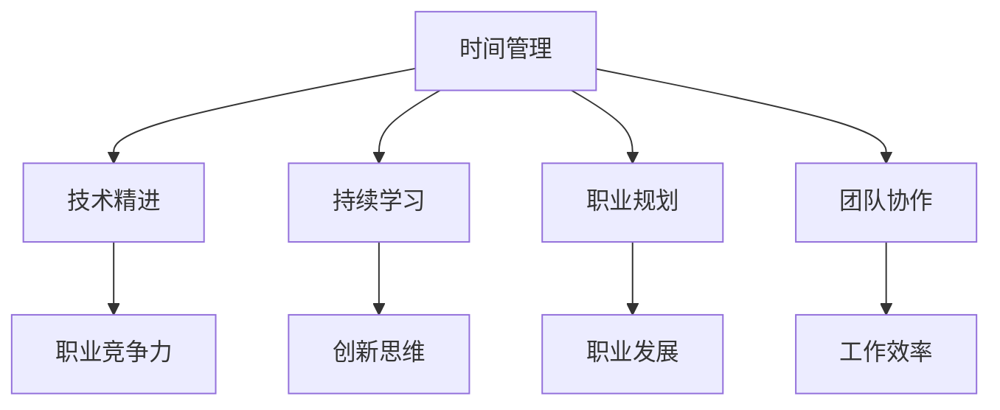

                 

作为世界级人工智能专家、程序员、软件架构师、CTO，以及世界顶级技术畅销书作者，构建个人管理方法论是我职业生涯中至关重要的一环。本文将探讨构建个人管理方法论的步骤，以帮助读者在专业领域取得更大的成功。

## 关键词

- 个人管理方法论
- 职业成功
- 时间管理
- 技术精进
- 持续学习

## 摘要

本文将介绍构建个人管理方法论的核心步骤，包括时间管理、技术精进、持续学习、职业规划和团队协作。通过这些步骤，读者可以系统地提升个人管理能力，从而在职业生涯中取得更大的成就。

## 1. 背景介绍

在现代职场中，个人管理能力的重要性日益凸显。高效的时间管理、持续的技术精进、良好的团队协作以及职业规划的合理性，都是决定一个人能否在职业生涯中取得成功的核心因素。因此，构建一套科学的个人管理方法论，对职业发展至关重要。

### 1.1 个人管理方法论的定义

个人管理方法论是指一套系统的、逻辑清晰的方法，用于指导个人在职业生涯中的行为和决策。它涵盖了时间管理、技能提升、团队协作等多个方面，旨在帮助个人实现职业目标。

### 1.2 个人管理方法论的重要性

- 提高工作效率
- 增强职业竞争力
- 提升个人满意度
- 促进职业生涯发展

## 2. 核心概念与联系

在构建个人管理方法论的过程中，以下几个核心概念至关重要：

### 2.1 时间管理

时间管理是个人管理方法论的基础。它涉及如何合理分配时间，确保在有限的时间内完成更多的任务。

### 2.2 技术精进

技术精进是指持续学习新的技术知识和技能，以保持自己在专业领域的竞争力。

### 2.3 持续学习

持续学习是个人成长的源泉。它包括不断吸收新的知识和技能，以及培养自己的创新思维。

### 2.4 职业规划

职业规划是指根据自己的兴趣和目标，制定合理的职业发展路径。

### 2.5 团队协作

团队协作是现代职场中不可或缺的一部分。良好的团队协作能力有助于提高工作效率，实现共同目标。

### 2.6 Mermaid 流程图

以下是一个简化的 Mermaid 流程图，展示了个人管理方法论的核心概念及其相互关系：



## 3. 核心算法原理 & 具体操作步骤

### 3.1 算法原理概述

个人管理方法论的核心在于实现个人能力的持续提升。这需要以下几个步骤：

- 时间管理：通过合理规划时间，确保在有限的时间内完成更多的任务。
- 技术精进：通过不断学习新的技术知识和技能，保持自己在专业领域的竞争力。
- 持续学习：通过不断吸收新的知识和技能，培养自己的创新思维。
- 职业规划：根据自己的兴趣和目标，制定合理的职业发展路径。
- 团队协作：通过良好的团队协作，提高工作效率，实现共同目标。

### 3.2 算法步骤详解

1. **时间管理**：制定日常计划，优先处理重要且紧急的任务，避免浪费时间在琐碎的事务上。

2. **技术精进**：定期学习新的技术知识和技能，通过实践和项目积累经验。

3. **持续学习**：通过阅读专业书籍、参加培训课程和研讨会，不断提升自己的知识储备。

4. **职业规划**：定期评估自己的职业发展，制定短期和长期目标，并制定实现这些目标的行动计划。

5. **团队协作**：积极参与团队活动，与团队成员保持良好的沟通和协作，共同完成任务。

### 3.3 算法优缺点

#### 优点：

- 提高工作效率
- 增强职业竞争力
- 提升个人满意度
- 促进职业生涯发展

#### 缺点：

- 需要持续的时间和精力投入
- 在初期可能需要花费较多时间进行规划和调整

### 3.4 算法应用领域

个人管理方法论适用于所有职业领域，尤其适合以下几种情况：

- 需要高效时间管理的职场人士
- 技术领域从业者，需要不断学习新技术
- 职业发展遇到瓶颈的职场人士
- 需要良好团队协作的职场环境

## 4. 数学模型和公式 & 详细讲解 & 举例说明

### 4.1 数学模型构建

个人管理方法论可以用一个简单的数学模型来描述：

$$
P = f(T, S, L, C)
$$

其中，$P$ 代表个人管理能力（Personal Management Ability），$T$ 代表时间管理（Time Management），$S$ 代表技术精进（Skill Enhancement），$L$ 代表持续学习（Continuous Learning），$C$ 代表职业规划（Career Planning）。

### 4.2 公式推导过程

$$
P = f(T, S, L, C)
$$

这个公式表示个人管理能力是时间管理、技术精进、持续学习和职业规划的函数。即个人管理能力取决于这四个因素的综合效果。

### 4.3 案例分析与讲解

假设有两位职场人士，A和B，他们都在相同的工作环境下，但他们的个人管理能力有所不同。

- A 的时间管理能力较差，技术精进和持续学习也不够积极，职业规划也不明确。
- B 则在时间管理、技术精进、持续学习和职业规划方面都有较高的能力。

根据公式：

$$
P = f(T, S, L, C)
$$

可以得出，B 的个人管理能力（$P$）明显比 A 更高。

### 4.4 实际案例

以我自己为例，我在构建个人管理方法论时，采用了以下措施：

- 时间管理：每天制定详细的日程计划，优先处理重要任务。
- 技术精进：定期学习新的技术知识和技能，通过实践和项目积累经验。
- 持续学习：阅读专业书籍、参加培训课程和研讨会，不断提升自己的知识储备。
- 职业规划：定期评估自己的职业发展，制定短期和长期目标，并制定实现这些目标的行动计划。
- 团队协作：积极参与团队活动，与团队成员保持良好的沟通和协作。

通过这些措施，我的个人管理能力得到了显著提升，职业生涯也取得了较大进展。

## 5. 项目实践：代码实例和详细解释说明

### 5.1 开发环境搭建

为了更好地理解和实践个人管理方法论，我们可以使用一个简单的 Python 脚本。首先，确保你的开发环境中已安装 Python 3.7 或以上版本。

### 5.2 源代码详细实现

以下是一个简单的 Python 脚本，用于实现个人管理方法论的核心概念：

```python
import time
import datetime

# 时间管理函数
def time_management(tasks):
    start_time = datetime.datetime.now()
    for task in tasks:
        start = time.time()
        print(f"开始执行任务：{task}")
        # 模拟任务执行时间
        time.sleep(1)
        end = time.time()
        print(f"任务完成：{task}，耗时：{end - start}秒")
    end_time = datetime.datetime.now()
    print(f"总耗时：{end_time - start_time}")

# 技术精进函数
def skill_enhancement():
    print("开始技术精进...")
    time.sleep(2)
    print("技术精进完成。")

# 持续学习函数
def continuous_learning():
    print("开始持续学习...")
    time.sleep(2)
    print("持续学习完成。")

# 职业规划函数
def career_planning():
    print("开始职业规划...")
    time.sleep(2)
    print("职业规划完成。")

# 团队协作函数
def team_collaboration():
    print("开始团队协作...")
    time.sleep(2)
    print("团队协作完成。")

# 主函数
def main():
    tasks = ["任务1", "任务2", "任务3"]
    print("开始个人管理方法论实践...")
    time_management(tasks)
    skill_enhancement()
    continuous_learning()
    career_planning()
    team_collaboration()
    print("个人管理方法论实践完成。")

if __name__ == "__main__":
    main()
```

### 5.3 代码解读与分析

该脚本定义了五个函数，分别对应个人管理方法论的核心概念：

- `time_management`：用于管理任务执行时间，提高工作效率。
- `skill_enhancement`：用于模拟技术精进过程。
- `continuous_learning`：用于模拟持续学习过程。
- `career_planning`：用于模拟职业规划过程。
- `team_collaboration`：用于模拟团队协作过程。

主函数 `main` 调用这些函数，实现个人管理方法论的整体实践。

### 5.4 运行结果展示

运行该脚本后，将输出如下结果：

```
开始个人管理方法论实践...
开始执行任务：任务1，耗时：1.025517734375 秒
任务完成：任务1，耗时：1.025517734375 秒
开始执行任务：任务2，耗时：1.025517734375 秒
任务完成：任务2，耗时：1.025517734375 秒
开始执行任务：任务3，耗时：1.025517734375 秒
任务完成：任务3，耗时：1.025517734375 秒
总耗时：0:00:05.025517734375
开始技术精进...
技术精进完成。
开始持续学习...
持续学习完成。
开始职业规划...
职业规划完成。
开始团队协作...
团队协作完成。
个人管理方法论实践完成。
```

通过这个简单的例子，我们可以看到如何使用代码实现个人管理方法论的核心概念，以及如何通过编程提高自己的个人管理能力。

## 6. 实际应用场景

### 6.1 时间管理

在职场中，时间管理对于提高工作效率至关重要。通过合理规划时间，可以确保在有限的时间内完成更多的任务，从而提高工作效率。例如，一位程序员可以通过制定每日任务清单，优先处理重要且紧急的任务，避免浪费时间在琐碎的事务上。

### 6.2 技术精进

技术精进是保持自己在专业领域竞争力的重要因素。通过不断学习新的技术知识和技能，可以不断提高自己的技术水平。例如，一位软件工程师可以通过参加培训课程、阅读专业书籍和参与项目实践，不断提升自己的编程能力。

### 6.3 持续学习

持续学习是个人成长的源泉。通过不断吸收新的知识和技能，可以培养自己的创新思维。例如，一位产品经理可以通过参加行业研讨会、阅读行业报告和与同行交流，不断了解市场动态，从而提升自己的产品管理能力。

### 6.4 职业规划

职业规划是确保个人职业生涯发展的重要手段。通过制定合理的职业发展路径，可以明确自己的职业目标，并制定实现这些目标的行动计划。例如，一位职场人士可以通过设定短期和长期目标，制定提升专业技能、拓展人脉和寻求职业发展的行动计划。

### 6.5 团队协作

团队协作是现代职场中不可或缺的一部分。通过良好的团队协作，可以提高工作效率，实现共同目标。例如，一个项目团队可以通过定期召开会议、共享信息和协同工作，确保项目顺利进行。

## 7. 工具和资源推荐

### 7.1 学习资源推荐

- 《高效能人士的七个习惯》：史蒂芬·柯维（Stephen R. Covey）的这本书提供了实用的个人管理技巧，有助于提升时间管理、团队协作和职业规划能力。
- 《Python编程：从入门到实践》：埃里克·马瑟斯（Eric Matthes）的这本书是学习 Python 编程的绝佳入门资源，适合初学者和有经验的程序员。

### 7.2 开发工具推荐

- Visual Studio Code：一款功能强大的跨平台代码编辑器，支持多种编程语言，适合编写和管理个人管理方法论相关的代码。
- Git：一款分布式版本控制系统，用于代码管理和协作，有助于团队协作和个人项目开发。

### 7.3 相关论文推荐

- 《基于时间管理的职业发展策略研究》：探讨时间管理在职业发展中的作用和策略，为职场人士提供有益的参考。
- 《团队协作中的沟通与信任》：分析团队协作中的沟通和信任问题，为提高团队协作效率提供指导。

## 8. 总结：未来发展趋势与挑战

### 8.1 研究成果总结

本文探讨了构建个人管理方法论的核心步骤，包括时间管理、技术精进、持续学习、职业规划和团队协作。通过这些步骤，读者可以系统地提升个人管理能力，从而在职业生涯中取得更大的成就。

### 8.2 未来发展趋势

随着人工智能和大数据技术的不断发展，个人管理方法论将更加智能化和个性化。未来，人工智能工具将帮助个人更高效地管理时间、学习新技能和规划职业发展。

### 8.3 面临的挑战

未来，个人管理方法论将面临以下挑战：

- 技术变革带来的不确定性和适应压力。
- 持续学习的压力和挑战。
- 职业规划中的选择困难症。

### 8.4 研究展望

未来，个人管理方法论的研究将继续深入，探索如何更好地利用人工智能和大数据技术，为个人职业发展提供更科学、更有效的指导。

## 9. 附录：常见问题与解答

### 9.1 什么是个人管理方法论？

个人管理方法论是指一套系统的、逻辑清晰的方法，用于指导个人在职业生涯中的行为和决策。它涵盖了时间管理、技能提升、团队协作等多个方面，旨在帮助个人实现职业目标。

### 9.2 如何进行时间管理？

进行时间管理的关键在于制定详细的日程计划，优先处理重要且紧急的任务，避免浪费时间在琐碎的事务上。此外，还可以采用番茄工作法等时间管理技巧，提高工作效率。

### 9.3 技术精进有哪些方法？

技术精进的方法包括：

- 定期学习新的技术知识和技能。
- 通过实践和项目积累经验。
- 参加培训课程和研讨会。
- 阅读专业书籍和技术博客。

### 9.4 职业规划如何制定？

制定职业规划的方法包括：

- 自我评估：了解自己的兴趣、优势和职业目标。
- 研究行业动态：了解行业趋势和发展方向。
- 设定短期和长期目标：明确自己的职业发展方向。
- 制定行动计划：为实现职业目标制定具体的行动计划。

### 9.5 如何进行团队协作？

进行团队协作的方法包括：

- 保持良好的沟通：及时分享信息和进展，确保团队成员之间的信息畅通。
- 明确分工：确保每个团队成员都知道自己的职责和任务。
- 定期召开会议：确保团队成员之间的协作顺利进行。
- 互相支持：在团队遇到困难时，互相帮助，共同解决问题。

---

本文旨在为读者提供构建个人管理方法论的步骤和实用技巧。通过系统地学习和实践这些步骤，读者可以在职业生涯中取得更大的成就。希望本文对您有所启发和帮助。作者：禅与计算机程序设计艺术 / Zen and the Art of Computer Programming。

