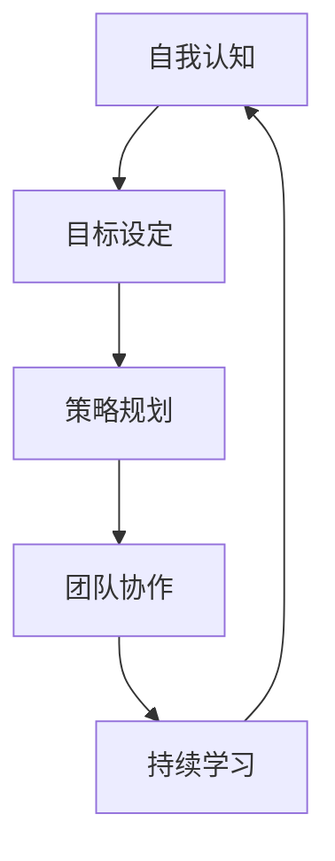

                 

 关键词：个人领导力、领导力体系、方法论、IT领域、技术专家、结构化思维、执行力、团队协作、职业发展

> 摘要：本文旨在探讨构建个人领导力体系的方法论，针对IT领域的专业技术人员，提出了一套系统的框架和步骤，帮助读者在职业发展过程中提升个人领导力，实现从优秀到卓越的转型。

## 1. 背景介绍

在快速变化的现代社会，技术日新月异，市场竞争日益激烈。IT领域尤为突出，作为一个高度专业化的行业，技术专家不仅需要具备扎实的技术能力，还必须具备出色的领导力。领导力不再仅仅是管理团队的技能，更是确保项目成功、提升团队效率、实现团队共同目标的关键因素。

本文提出的“构建个人领导力体系的方法论”，旨在帮助IT领域的专业技术人员，通过系统地学习、实践和反思，逐步建立起自己的领导力体系，从而在职场中脱颖而出，成为卓越的领导者。

## 2. 核心概念与联系

### 2.1 领导力的定义与重要性

领导力是指一种激励和影响他人去实现共同目标的能力。在IT领域，领导力不仅体现在对技术的掌握上，更重要的是对团队的管理和领导上。一个成功的IT项目，不仅依赖于技术解决方案的优劣，更依赖于团队的协作效率、成员之间的沟通和协调。

### 2.2 个人领导力体系的构成

个人领导力体系由五个核心部分构成：自我认知、目标设定、策略规划、团队协作和持续学习。这五个部分相互关联，共同构成了一个完整的领导力体系，如图：



### 2.3 个人领导力体系的作用

个人领导力体系的作用在于：

- 提高自我认知，明确个人优势和不足，从而有针对性地进行提升。
- 明确目标，规划实现路径，确保个人和团队的行动一致。
- 制定策略，合理分配资源和时间，提高工作效率。
- 建立有效的团队协作机制，促进团队成员的互动和合作。
- 持续学习，不断适应技术变革和市场需求，保持竞争力。

## 3. 核心算法原理 & 具体操作步骤

### 3.1 算法原理概述

构建个人领导力体系的算法原理可以概括为：自我认知、目标设定、策略规划、团队协作和持续学习五个步骤。每个步骤都有其特定的目标和操作方法，相互衔接，共同实现领导力体系的构建。

### 3.2 算法步骤详解

#### 3.2.1 自我认知

自我认知是构建领导力体系的第一步。它包括：

- **优势识别**：通过自我评估和他人反馈，识别个人在技术、管理、沟通等方面的优势。
- **劣势分析**：分析个人在哪些方面存在不足，并制定相应的改进计划。

#### 3.2.2 目标设定

目标设定是领导力构建的核心。具体步骤包括：

- **确定目标**：明确个人和团队的长期和短期目标。
- **分解目标**：将大目标分解为具体的可执行任务。
- **设定时间表**：为每个任务设定明确的时间表，确保目标的实现。

#### 3.2.3 策略规划

策略规划是确保目标实现的关键。具体包括：

- **资源分配**：根据目标需求和团队情况，合理分配资源和时间。
- **风险管理**：预测可能出现的问题，制定相应的应对措施。

#### 3.2.4 团队协作

团队协作是领导力的体现。具体包括：

- **沟通机制**：建立有效的沟通渠道，确保团队成员之间的信息传递畅通。
- **激励机制**：制定合适的激励机制，提高团队的工作积极性。

#### 3.2.5 持续学习

持续学习是领导力发展的动力。具体包括：

- **技能提升**：通过培训、学习和技术交流，不断提升个人技能。
- **知识更新**：关注行业动态，及时更新知识体系。

### 3.3 算法优缺点

**优点**：

- 系统性：算法涵盖了领导力构建的各个方面，具有系统性。
- 可操作性：每个步骤都有具体的操作方法，易于实践。
- 持续性：持续学习环节确保了领导力体系的长期有效性。

**缺点**：

- 实施难度：构建领导力体系需要长期的努力和持续的学习，对个人自律性要求较高。
- 环境适应：不同环境和团队可能会有不同的需求，算法需要根据实际情况进行调整。

### 3.4 算法应用领域

算法主要应用于IT领域的专业技术人员，特别是在项目管理、技术团队管理和企业转型等方面。

## 4. 数学模型和公式 & 详细讲解 & 举例说明

### 4.1 数学模型构建

构建个人领导力体系的数学模型可以表示为：

$$
\text{领导力} = f(\text{自我认知}, \text{目标设定}, \text{策略规划}, \text{团队协作}, \text{持续学习})
$$

其中，$f$ 表示领导力函数，$\text{自我认知}$、$\text{目标设定}$、$\text{策略规划}$、$\text{团队协作}$、$\text{持续学习}$ 分别表示领导力体系的五个核心组成部分。

### 4.2 公式推导过程

$$
\begin{aligned}
\text{领导力} &= f(\text{自我认知}, \text{目标设定}, \text{策略规划}, \text{团队协作}, \text{持续学习}) \\
&= g(\text{优势识别}, \text{劣势分析}) \cdot h(\text{目标确定}, \text{目标分解}, \text{时间表设定}) \cdot k(\text{资源分配}, \text{风险管理}) \cdot m(\text{沟通机制}, \text{激励机制}) \cdot p(\text{技能提升}, \text{知识更新})
\end{aligned}
$$

其中，$g$、$h$、$k$、$m$、$p$ 分别表示自我认知、目标设定、策略规划、团队协作和持续学习的函数。

### 4.3 案例分析与讲解

以一位IT项目经理为例，其构建个人领导力体系的过程如下：

- **自我认知**：通过自我评估和团队反馈，项目经理识别出自己的优势在于沟通能力和项目管理经验，但缺乏技术深度。
- **目标设定**：项目经理设定了短期目标为提高技术能力，长期目标为提升项目成功率。
- **策略规划**：项目经理制定了详细的策略，包括参加技术培训、参与技术讨论和阅读专业书籍。
- **团队协作**：项目经理建立了定期团队会议制度，确保团队成员之间的信息畅通，并制定激励机制，鼓励团队成员积极参与项目。
- **持续学习**：项目经理制定了学习计划，包括每周阅读一篇技术文章、每月参加一次技术研讨会。

通过上述步骤，项目经理逐步构建了自己的领导力体系，并取得了显著的效果，项目成功率显著提高。

## 5. 项目实践：代码实例和详细解释说明

### 5.1 开发环境搭建

为了实践构建个人领导力体系，我们使用Git和Markdown作为主要工具。以下是搭建开发环境的基本步骤：

1. 安装Git：在官网上下载并安装Git。
2. 配置Git：运行以下命令配置用户信息。
   ```shell
   git config --global user.name "Your Name"
   git config --global user.email "Your Email"
   ```
3. 安装Markdown编辑器：例如Typora或MarkdownPad。

### 5.2 源代码详细实现

以下是使用Markdown编写的个人领导力构建计划：

```markdown
# 个人领导力构建计划

## 1. 自我认知
- **优势**：
  - 沟通能力强
  - 项目管理经验丰富
- **劣势**：
  - 技术深度不足

## 2. 目标设定
- **短期目标**：
  - 提高技术能力
  - 提升项目成功率
- **长期目标**：
  - 成为技术专家

## 3. 策略规划
- **具体行动**：
  - 参加技术培训
  - 参与技术讨论
  - 阅读专业书籍

## 4. 团队协作
- **团队会议**：
  - 每周一次
  - 讨论项目进展和问题
- **激励机制**：
  - 完成任务的奖励

## 5. 持续学习
- **学习计划**：
  - 每周阅读一篇技术文章
  - 每月参加一次技术研讨会
```

### 5.3 代码解读与分析

上述代码实现了个人领导力构建计划的文档化。Markdown语法使得文档结构清晰，便于阅读和修改。每个部分都包含了具体的行动和目标，便于实施和跟踪。

### 5.4 运行结果展示

通过上述代码，项目经理可以清晰地看到自己的领导力构建计划，并按照计划逐步实施，不断提升个人领导力。

## 6. 实际应用场景

### 6.1 项目管理

在项目管理中，领导力的重要性不言而喻。项目经理通过构建个人领导力体系，能够更好地协调团队、管理资源、控制风险，从而提高项目的成功率。

### 6.2 技术团队管理

技术团队管理同样需要领导力。技术团队领导通过构建个人领导力体系，能够提升团队的技术能力、协作效率，从而推动团队的技术创新和业务发展。

### 6.3 企业转型

在企业转型过程中，领导力是确保转型成功的关键。企业领导者通过构建个人领导力体系，能够更好地引领团队应对变革，实现企业的长远发展。

## 7. 工具和资源推荐

### 7.1 学习资源推荐

- 《领导力》(作者：彼得·德鲁克)
- 《如何赢得朋友与影响他人》(作者：戴尔·卡耐基)
- 《精益创业》(作者：埃里克·莱斯)

### 7.2 开发工具推荐

- Git：版本控制工具。
- Markdown：文档编写工具。

### 7.3 相关论文推荐

- 《领导力的本质》(作者：詹姆斯·麦克雷文)
- 《敏捷领导力》(作者：迈克尔·马吉)

## 8. 总结：未来发展趋势与挑战

### 8.1 研究成果总结

本文提出了构建个人领导力体系的方法论，包括自我认知、目标设定、策略规划、团队协作和持续学习五个步骤，为IT领域的专业技术人员提供了一套实用的框架。

### 8.2 未来发展趋势

随着人工智能和大数据技术的发展，领导力在IT领域的应用将越来越广泛。未来，领导力模型和算法将更加智能化，更加贴合实际需求。

### 8.3 面临的挑战

- 技术变革带来的不确定性。
- 团队成员的多样性和复杂性。

### 8.4 研究展望

未来研究应重点关注领导力模型的可扩展性和适应性，以及如何在动态环境中保持领导力体系的稳定性。

## 9. 附录：常见问题与解答

### 9.1 如何提升自我认知？

- 定期进行自我评估，了解自己的优势和不足。
- 向同事和上级寻求反馈，了解他人的看法。

### 9.2 如何设定合理的目标？

- 设定具体、可衡量、可实现的目标。
- 将大目标分解为小目标，逐步实现。

### 9.3 如何提高团队协作效率？

- 建立有效的沟通机制。
- 设定合理的激励机制。

---

作者：禅与计算机程序设计艺术 / Zen and the Art of Computer Programming


