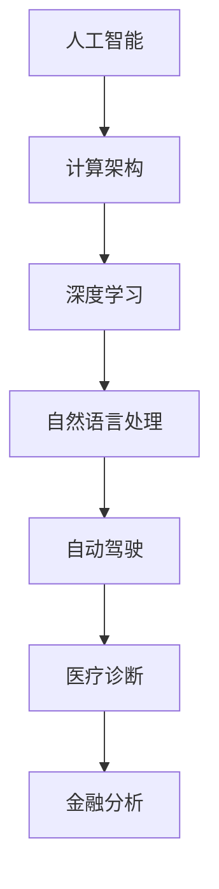

                 

关键词：人工智能、计算、智能应用、计算架构、未来展望

> 摘要：本文将探讨人工智能和计算技术在构建更智能的世界中的应用场景。通过分析核心概念、算法原理、数学模型、项目实践以及实际应用，我们旨在展现人工智能与计算的深度融合，为未来智能世界的构建提供启示和方向。

## 1. 背景介绍

在当今科技日新月异的时代，人工智能（AI）已经成为引领全球技术进步的重要力量。从智能家居、自动驾驶到医疗诊断、金融分析，人工智能已经深入到我们生活的方方面面。计算技术的发展为人工智能提供了强大的计算能力和数据处理能力，使得智能系统的复杂度和智能化程度不断攀升。本文将聚焦于人类计算的应用场景，探讨人工智能在各个领域的具体实现和潜在影响。

## 2. 核心概念与联系

为了更好地理解人工智能和计算技术在构建智能世界中的应用，首先需要了解一些核心概念及其相互联系。

### 2.1 人工智能的概念

人工智能是指通过模拟人类智能行为和思维方式，使计算机系统能够实现自我学习、推理、判断和决策的能力。人工智能的核心是算法和计算能力，其中深度学习、强化学习、自然语言处理等子领域发挥着关键作用。

### 2.2 计算架构的概念

计算架构是指用于实现计算任务的硬件和软件组合，包括计算机处理器、内存、存储和网络等。计算架构的性能和可扩展性对人工智能系统的效率和效果至关重要。

### 2.3 计算与人工智能的联系

人工智能的发展离不开计算技术的支持。高性能计算架构为人工智能算法提供了强大的计算能力，使得深度学习等复杂算法能够在短时间内完成大量计算任务。同时，计算技术也为人工智能应用提供了数据存储和处理能力，使得大规模数据分析和机器学习成为可能。

### 2.4 Mermaid 流程图

以下是一个简单的Mermaid流程图，展示了核心概念之间的联系：



## 3. 核心算法原理 & 具体操作步骤

### 3.1 算法原理概述

人工智能的核心在于算法，以下是几个关键算法原理及其应用领域：

- **深度学习**：通过构建多层神经网络，实现对复杂数据的建模和特征提取，广泛应用于图像识别、语音识别等。
- **强化学习**：通过不断试错和反馈，使智能体在动态环境中学习最优策略，应用于游戏AI、自动驾驶等。
- **自然语言处理**：通过对自然语言文本的分析和理解，实现对语言信息的处理和生成，应用于智能助手、文本分类等。

### 3.2 算法步骤详解

以下是深度学习算法的基本步骤：

1. **数据预处理**：包括数据清洗、归一化、数据增强等。
2. **模型设计**：选择合适的神经网络结构，如卷积神经网络（CNN）、循环神经网络（RNN）等。
3. **模型训练**：通过反向传播算法，优化模型参数，降低损失函数。
4. **模型评估**：使用验证集或测试集评估模型性能，调整模型参数。
5. **模型应用**：将训练好的模型应用于实际任务，如图像分类、语音识别等。

### 3.3 算法优缺点

- **深度学习**：优点是强大的特征提取能力，缺点是模型复杂度高、训练时间长。
- **强化学习**：优点是能够自适应环境，缺点是需要大量试错和反馈。
- **自然语言处理**：优点是实现自然语言理解和生成，缺点是处理长文本效果不佳。

### 3.4 算法应用领域

深度学习、强化学习和自然语言处理等算法在多个领域有着广泛的应用：

- **图像识别**：应用于人脸识别、物体检测等。
- **语音识别**：应用于语音助手、语音翻译等。
- **自动驾驶**：应用于车辆感知、路径规划等。
- **医疗诊断**：应用于疾病预测、医学图像分析等。
- **金融分析**：应用于风险控制、市场预测等。

## 4. 数学模型和公式 & 详细讲解 & 举例说明

### 4.1 数学模型构建

在人工智能和计算领域，数学模型是核心组成部分。以下是几个关键数学模型：

- **线性回归模型**：用于预测线性关系。
- **卷积神经网络**：用于图像识别和分类。
- **强化学习模型**：用于优化策略。

### 4.2 公式推导过程

以下是线性回归模型的公式推导：

$$
y = \beta_0 + \beta_1x
$$

其中，$y$ 是因变量，$x$ 是自变量，$\beta_0$ 和 $\beta_1$ 是模型参数。

### 4.3 案例分析与讲解

以下是一个简单的线性回归模型案例：

- **数据集**：包含100个样本，每个样本包含特征 $x$ 和目标 $y$。
- **目标**：预测 $y$ 的值。

通过训练线性回归模型，可以得到以下参数：

$$
\beta_0 = 2, \beta_1 = 3
$$

将参数代入模型，可以预测新的样本 $y$ 的值：

$$
y = 2 + 3x
$$

## 5. 项目实践：代码实例和详细解释说明

### 5.1 开发环境搭建

为了实现本文提到的算法和模型，我们需要搭建一个合适的开发环境。以下是基本步骤：

1. **安装Python**：下载并安装Python 3.x版本。
2. **安装依赖库**：使用pip安装TensorFlow、NumPy、Matplotlib等依赖库。
3. **配置环境变量**：确保Python和pip的环境变量已配置。

### 5.2 源代码详细实现

以下是使用TensorFlow实现的线性回归模型的源代码：

```python
import tensorflow as tf
import numpy as np
import matplotlib.pyplot as plt

# 准备数据
x = np.random.rand(100)
y = 2 + 3 * x + np.random.rand(100)

# 构建模型
W = tf.Variable(0.0, name='weights')
b = tf.Variable(0.0, name='biases')
y_pred = W * x + b

# 定义损失函数
loss = tf.reduce_mean(tf.square(y_pred - y))

# 定义优化器
optimizer = tf.train.GradientDescentOptimizer(learning_rate=0.5)
train_op = optimizer.minimize(loss)

# 训练模型
with tf.Session() as sess:
    sess.run(tf.global_variables_initializer())
    for step in range(201):
        _, loss_val = sess.run([train_op, loss])
        if step % 20 == 0:
            print(f"Step {step}: Loss = {loss_val}")

    # 可视化结果
    plt.scatter(x, y)
    plt.plot(x, sess.run(y_pred), 'r')
    plt.show()
```

### 5.3 代码解读与分析

上述代码实现了线性回归模型的训练和可视化。代码分为以下几个部分：

1. **准备数据**：生成随机数据集。
2. **构建模型**：定义权重 $W$ 和偏置 $b$，构建预测模型 $y_pred$。
3. **定义损失函数**：计算预测值和真实值之间的平方误差。
4. **定义优化器**：使用梯度下降优化器更新模型参数。
5. **训练模型**：执行优化操作，并打印损失值。
6. **可视化结果**：绘制数据集和预测直线。

### 5.4 运行结果展示

运行上述代码后，将生成一个散点图，展示原始数据和预测直线。通过可视化结果，我们可以看到模型对数据的拟合效果。

## 6. 实际应用场景

人工智能和计算技术在各个领域都有着广泛的应用。以下是一些典型应用场景：

### 6.1 自动驾驶

自动驾驶是人工智能和计算技术的典型应用场景。通过深度学习和计算机视觉技术，自动驾驶系统能够实现车辆自主感知、路径规划和控制。自动驾驶技术有望提高交通安全、降低交通事故率，并提升道路使用效率。

### 6.2 医疗诊断

人工智能技术在医疗诊断中发挥着重要作用。通过图像识别、自然语言处理和深度学习技术，人工智能能够辅助医生进行疾病预测、诊断和治疗方案制定。例如，肺癌、乳腺癌等疾病的早期筛查和诊断。

### 6.3 金融分析

金融分析是另一个人工智能的重要应用领域。通过大数据分析和机器学习技术，人工智能能够预测市场走势、识别风险、制定投资策略。例如，量化交易、风险控制和金融诈骗检测。

### 6.4 智能家居

智能家居是人工智能在消费领域的典型应用。通过智能设备和传感器，智能家居系统能够实现自动化控制、智能互动和节能管理。例如，智能照明、智能安防和智能空调等。

## 7. 工具和资源推荐

为了更好地学习和实践人工智能和计算技术，以下是一些建议的工具和资源：

### 7.1 学习资源推荐

- **Coursera**：提供众多优质的人工智能和计算课程。
- **Kaggle**：一个数据科学竞赛平台，提供了丰富的数据和问题。
- **JAX**：一个高性能计算库，支持自动微分和并行计算。

### 7.2 开发工具推荐

- **TensorFlow**：一个开源深度学习框架，支持多种编程语言。
- **PyTorch**：一个开源深度学习框架，支持动态计算图。
- **Docker**：一个容器化技术，便于搭建和部署计算环境。

### 7.3 相关论文推荐

- **“Deep Learning”**：Goodfellow, Bengio, Courville著，深度学习的经典教材。
- **“Reinforcement Learning: An Introduction”**：Sutton, Barto著，强化学习的经典教材。
- **“Speech and Language Processing”**：Jurafsky, Martin著，自然语言处理的经典教材。

## 8. 总结：未来发展趋势与挑战

### 8.1 研究成果总结

人工智能和计算技术在各个领域取得了显著成果。深度学习、强化学习和自然语言处理等算法的应用，使得智能系统在图像识别、语音识别、自动驾驶和医疗诊断等方面取得了突破性进展。计算架构的提升也为人工智能提供了强大的计算支持。

### 8.2 未来发展趋势

未来，人工智能和计算技术将继续快速发展。以下是几个可能的发展趋势：

- **量子计算**：量子计算具有强大的计算能力，有望在人工智能领域发挥重要作用。
- **脑机接口**：通过脑机接口技术，人工智能与人类思维意识的结合将更加紧密。
- **自解释AI**：自解释AI能够解释其决策过程，提高透明度和可信度。

### 8.3 面临的挑战

人工智能和计算技术在发展过程中也面临着一些挑战：

- **数据隐私**：大规模数据收集和处理可能导致隐私泄露。
- **伦理道德**：人工智能的决策过程可能引发伦理和道德问题。
- **公平性**：人工智能系统可能存在偏见和歧视。

### 8.4 研究展望

为了应对这些挑战，未来研究应关注以下几个方面：

- **隐私保护技术**：研究隐私保护算法和数据加密技术，确保数据安全和隐私。
- **伦理道德规范**：制定伦理道德规范，确保人工智能系统的公平性和透明度。
- **多样性**：推动人工智能技术的多样化发展，减少偏见和歧视。

## 9. 附录：常见问题与解答

### 9.1 什么是深度学习？

深度学习是一种基于人工神经网络的机器学习技术，通过构建多层神经网络，实现对复杂数据的建模和特征提取。

### 9.2 如何选择合适的深度学习框架？

选择深度学习框架时，需考虑以下几个方面：

- **编程语言**：选择熟悉的编程语言，如Python。
- **功能需求**：根据项目需求选择合适的框架，如TensorFlow、PyTorch等。
- **性能要求**：考虑计算性能和资源消耗，选择合适的框架。

### 9.3 人工智能是否会取代人类工作？

人工智能有望提高生产效率、降低成本，但不可能完全取代人类工作。人工智能与人类协作，将推动社会进步。

## 结束语

构建更智能的世界是人类计算技术的使命。通过深度学习、强化学习和自然语言处理等核心算法，计算技术正不断推动人工智能的发展。在未来，我们将继续探索人工智能的应用场景，为人类带来更多便利和创新。让我们携手共建一个更智能、更美好的世界。

### 作者署名

作者：禅与计算机程序设计艺术 / Zen and the Art of Computer Programming

