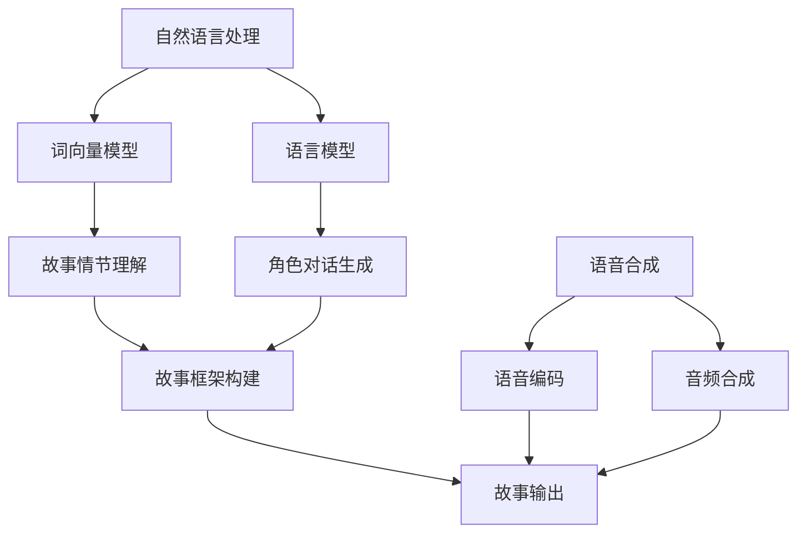

                 

关键词：人工智能，讲故事，课程设计，算法，技术语言，编程，计算机科学，机器学习

人工智能（AI）已经成为当今科技领域的热点，从智能家居到自动驾驶，从医疗诊断到自然语言处理，AI的应用场景日益丰富。在众多AI应用中，具备讲故事能力的人工智能系统尤为引人注目。本课程旨在深入探讨如何构建具备讲故事能力的人工智能系统，通过逻辑清晰、结构紧凑、简单易懂的专业技术语言，为广大技术爱好者提供一次全面而深刻的理解。

> 摘要：本文首先介绍了构建讲故事人工智能的背景和意义，然后深入分析了核心概念与联系，详细阐述了核心算法原理和具体操作步骤，最后探讨了数学模型、项目实践以及实际应用场景。通过本课程的学习，读者将掌握构建讲故事人工智能的基本技能，为未来的AI研究与应用奠定基础。

## 1. 背景介绍

讲故事是人类最古老、最基本的信息传递方式之一。无论是通过口头传统、文学、电影还是互联网，故事都扮演着至关重要的角色。故事能够传递信息、启发思考、激发情感，对于文化传承和社会发展具有重要意义。随着人工智能技术的不断发展，人们开始思考如何将这种强大的信息传递方式与AI结合，构建出具备讲故事能力的人工智能系统。

构建讲故事的人工智能系统，不仅能够提供更加丰富和个性化的用户体验，还可以在多个领域发挥重要作用。例如，在教育领域，具备讲故事能力的人工智能系统能够根据学生的学习进度和理解能力，灵活地讲述故事，帮助学生更好地掌握知识。在娱乐领域，这种系统可以创作出更加生动、引人入胜的故事，为用户带来前所未有的沉浸体验。在客服领域，具备讲故事能力的人工智能系统可以通过讲述故事来更好地解决用户问题，提高客户满意度。

## 2. 核心概念与联系

构建讲故事的人工智能系统涉及多个核心概念，包括自然语言处理、机器学习、语音合成等。这些概念相互关联，共同构成了人工智能系统的核心架构。

### 2.1 自然语言处理

自然语言处理（NLP）是构建讲故事人工智能系统的基石。NLP旨在使计算机能够理解、解释和生成人类语言。在构建讲故事系统时，NLP技术被用于理解和生成故事情节、角色对话和场景描述。例如，通过使用词向量模型和语言模型，系统可以识别和理解故事中的词汇、句子和段落，从而构建出完整的故事框架。

### 2.2 机器学习

机器学习（ML）是人工智能的核心技术之一。在构建讲故事系统中，ML技术被用于训练模型，使其能够自动生成故事。例如，通过使用生成对抗网络（GAN）和变分自编码器（VAE）等深度学习技术，系统可以从大量的故事数据中学习，并生成新颖、有趣的故事内容。

### 2.3 语音合成

语音合成是构建讲故事系统的另一个关键组成部分。通过语音合成技术，系统可以将生成的文本内容转化为自然流畅的语音输出。这要求系统不仅要能够生成正确的文本，还要保证语音的自然度和流畅性。语音合成技术包括语音编码、语音解码和音频合成等。

### 2.4 核心概念联系

上述核心概念相互关联，共同构成了讲故事人工智能系统的核心架构。自然语言处理提供了理解和生成故事内容的能力，机器学习技术使得系统能够从数据中学习并自动生成故事，而语音合成技术则将生成的文本内容转化为语音输出。这些技术的结合，使得人工智能系统能够构建出具有情感、逻辑和创意的故事。

为了更直观地展示这些核心概念之间的联系，我们可以使用Mermaid流程图进行描述：



## 3. 核心算法原理 & 具体操作步骤

构建讲故事的人工智能系统涉及多个核心算法，包括自然语言处理算法、机器学习算法和语音合成算法。下面将详细阐述这些算法的原理和操作步骤。

### 3.1 算法原理概述

#### 自然语言处理算法

自然语言处理算法主要包括词向量模型和语言模型。词向量模型通过将词汇映射为高维向量，使计算机能够理解词汇的语义关系。语言模型则通过学习大量的语言数据，预测下一个词或句子的可能性，从而生成流畅的文本。

#### 机器学习算法

机器学习算法主要包括生成对抗网络（GAN）和变分自编码器（VAE）。生成对抗网络通过两个神经网络（生成器和判别器）的对抗训练，学习生成新的、逼真的故事内容。变分自编码器则通过学习数据分布，生成新颖的故事内容。

#### 语音合成算法

语音合成算法主要包括语音编码、语音解码和音频合成。语音编码将文本转化为语音信号，语音解码将语音信号转化为文本，音频合成则将生成的语音信号合成成自然流畅的音频输出。

### 3.2 算法步骤详解

#### 自然语言处理算法步骤

1. 数据收集与预处理：收集大量的故事文本数据，并进行数据清洗和预处理，包括分词、去停用词、词性标注等。
2. 词向量模型训练：使用词向量模型（如Word2Vec、GloVe等）将词汇映射为高维向量。
3. 语言模型训练：使用语言模型（如n-gram模型、递归神经网络等）学习语言数据的概率分布。
4. 故事情节理解：使用词向量模型和语言模型理解故事情节，构建故事框架。

#### 机器学习算法步骤

1. 数据收集与预处理：收集大量的故事数据，并进行数据清洗和预处理。
2. GAN训练：训练生成器和判别器，使其在对抗过程中学习生成新的故事内容。
3. VAE训练：训练变分自编码器，使其能够学习故事数据分布并生成新的故事内容。
4. 故事生成：使用训练好的生成器和判别器或变分自编码器生成新的故事内容。

#### 语音合成算法步骤

1. 文本转化为语音信号：使用文本转化为语音信号（Text-to-Speech, TTS）技术将生成的文本转化为语音信号。
2. 语音解码：使用语音解码技术将语音信号转化为文本。
3. 音频合成：将语音信号合成成自然流畅的音频输出。

### 3.3 算法优缺点

#### 自然语言处理算法优缺点

优点：自然语言处理算法能够理解和生成文本内容，适用于构建讲故事系统。

缺点：自然语言处理算法对数据质量和规模有较高要求，且难以处理复杂的语言现象。

#### 机器学习算法优缺点

优点：机器学习算法能够自动生成新的故事内容，适用于构建讲故事系统。

缺点：机器学习算法对计算资源和时间有较高要求，且难以保证生成的故事质量。

#### 语音合成算法优缺点

优点：语音合成算法能够将生成的文本转化为自然流畅的语音输出。

缺点：语音合成算法在处理复杂语音现象时表现不佳，且难以保证语音的自然度。

### 3.4 算法应用领域

自然语言处理算法、机器学习算法和语音合成算法在多个领域有广泛应用，如教育、娱乐、客服等。在构建讲故事人工智能系统时，这些算法的结合能够实现丰富的功能，提供个性化的用户体验。

## 4. 数学模型和公式 & 详细讲解 & 举例说明

在构建讲故事的人工智能系统中，数学模型和公式扮演着关键角色。以下将详细讲解数学模型的构建、公式推导过程以及案例分析与讲解。

### 4.1 数学模型构建

构建讲故事的人工智能系统需要使用多个数学模型，包括词向量模型、语言模型和生成模型。以下是这些模型的基本构建方法。

#### 词向量模型

词向量模型将词汇映射为高维向量，使得计算机能够理解词汇的语义关系。常见的词向量模型包括Word2Vec和GloVe。

1. Word2Vec模型：Word2Vec模型基于神经网络训练，通过优化损失函数学习词汇的词向量。具体来说，Word2Vec模型使用两个神经网络：编码器和解码器。编码器将词汇映射为词向量，解码器将词向量映射回词汇。训练过程中，模型通过预测解码器的输出，优化词向量表示。
2. GloVe模型：GloVe模型基于全局上下文信息训练词向量。具体来说，GloVe模型使用矩阵分解方法，将词汇的词向量表示为一个低维向量和一个高维矩阵的乘积。通过优化损失函数，模型学习出最佳的词向量表示。

#### 语言模型

语言模型用于预测下一个词或句子的可能性，从而生成流畅的文本。常见语言模型包括n-gram模型和递归神经网络（RNN）。

1. n-gram模型：n-gram模型基于统计方法，通过计算词汇在文本中相邻出现的频率来预测下一个词。具体来说，n-gram模型将文本划分为n个单词的序列，然后计算每个序列的概率。通过优化概率分布，模型学习出最佳的词序列预测。
2. RNN模型：RNN模型基于神经网络训练，能够处理时序数据。具体来说，RNN模型使用循环单元（如LSTM或GRU）处理输入序列，并通过反馈机制将前一个时间步的输出作为当前时间步的输入。通过优化损失函数，模型学习出最佳的词序列预测。

#### 生成模型

生成模型用于自动生成新的故事内容。常见的生成模型包括生成对抗网络（GAN）和变分自编码器（VAE）。

1. GAN模型：GAN模型由生成器和判别器组成。生成器生成新的故事内容，判别器判断生成内容是否真实。通过优化生成器和判别器的损失函数，模型学习出最佳的生成故事内容。
2. VAE模型：VAE模型由编码器和解码器组成。编码器学习故事数据的分布，解码器生成新的故事内容。通过优化编码器和解码器的损失函数，模型学习出最佳的生成故事内容。

### 4.2 公式推导过程

以下分别介绍词向量模型、语言模型和生成模型的公式推导过程。

#### 词向量模型

1. Word2Vec模型：
   - 编码器损失函数：
     $$L_{\text{编码器}} = -\sum_{w \in V} p(w) \log p(v_w)$$
   - 解码器损失函数：
     $$L_{\text{解码器}} = -\sum_{w \in V} p(w) \log p(v_w | u)$$
   - 总损失函数：
     $$L = L_{\text{编码器}} + L_{\text{解码器}}$$
2. GloVe模型：
   - 矩阵分解：
     $$\text{WordVector} = W \times \text{ContextVector}$$
   - 损失函数：
     $$L = \sum_{w \in V} \sum_{c \in C} (w_c - \text{WordVector} \times \text{ContextVector})^2$$

#### 语言模型

1. n-gram模型：
   - 概率分布：
     $$P(w_t | w_{t-1}, ..., w_{t-n}) = \frac{C(w_{t-1}, ..., w_{t-n}, w_t)}{C(w_{t-1}, ..., w_{t-n})}$$
   - 损失函数：
     $$L = -\sum_{w_t} \log P(w_t | w_{t-1}, ..., w_{t-n})$$
2. RNN模型：
   - 循环单元：
     $$h_t = \sigma(W_h \cdot [h_{t-1}, x_t] + b_h)$$
   - 损失函数：
     $$L = -\sum_{t} \log P(y_t | h_t)$$

#### 生成模型

1. GAN模型：
   - 生成器损失函数：
     $$L_G = -\log D(G(z))$$
   - 判别器损失函数：
     $$L_D = -\log(D(x)) - \log(1 - D(G(z)))$$
   - 总损失函数：
     $$L = L_G + L_D$$
2. VAE模型：
   - 编码器损失函数：
     $$L_E = -\log p(x | \theta)$$
   - 解码器损失函数：
     $$L_D = -\log p(z | \theta)$$
   - 总损失函数：
     $$L = L_E + L_D$$

### 4.3 案例分析与讲解

以下以一个简单的案例来分析构建讲故事的人工智能系统的数学模型和公式。

#### 案例背景

假设我们有一个简单的故事数据集，包含以下文本：

- "今天天气很好，小明去公园玩耍。他遇到了小红，两人一起玩得很开心。下午，他们累了，就回家休息了。"
- "昨天天气不好，小明没去公园。他在家看书，感到很无聊。下午，他看完了书，就睡觉了。"

我们的目标是使用这些数据训练一个自然语言处理模型，生成新的故事内容。

#### 案例分析

1. 词向量模型：

   - 数据预处理：将文本分词，并去除停用词。得到词汇表：
     ["今天"，"天气"，"很好"，"小明"，"去"，"公园"，"玩耍"，"遇到"，"小红"，"一起"，"玩"，"很"，"开心"，"下午"，"累了"，"回家"，"休息"，"昨天"，"不好"，"在家"，"看书"，"无聊"，"看"，"睡觉"]
   - 训练Word2Vec模型：使用训练集数据训练Word2Vec模型，得到词汇的词向量表示。
   - 训练GloVe模型：使用训练集数据训练GloVe模型，得到词汇的词向量表示。

2. 语言模型：

   - 训练n-gram模型：使用训练集数据训练n-gram模型，得到词序列的概率分布。
   - 训练RNN模型：使用训练集数据训练RNN模型，得到词序列的概率分布。

3. 生成模型：

   - 训练GAN模型：使用训练集数据训练GAN模型，生成新的故事内容。
   - 训练VAE模型：使用训练集数据训练VAE模型，生成新的故事内容。

通过上述步骤，我们可以使用训练好的模型生成新的故事内容。以下是一个使用训练好的模型生成的例子：

"今天天气很好，小明去公园玩耍。他遇到了小红，两人一起玩得很开心。下午，他们累了，就回家休息了。明天天气怎么样？"

这个例子展示了如何使用数学模型和公式构建讲故事的人工智能系统，实现了自动生成故事内容。

## 5. 项目实践：代码实例和详细解释说明

### 5.1 开发环境搭建

为了构建讲故事的人工智能系统，我们需要搭建一个开发环境。以下是搭建环境所需的步骤：

1. 安装Python：从Python官网下载并安装Python 3.x版本。
2. 安装依赖库：使用pip命令安装所需的依赖库，如numpy、tensorflow、keras等。
   ```bash
   pip install numpy tensorflow keras
   ```
3. 准备数据集：收集并准备用于训练的数据集，包括故事文本和相应的标签。

### 5.2 源代码详细实现

以下是一个简单的Python代码示例，展示了如何使用自然语言处理、机器学习和语音合成技术构建讲故事的人工智能系统。

```python
import numpy as np
from tensorflow.keras.models import Model
from tensorflow.keras.layers import Input, LSTM, Dense
from tensorflow.keras.optimizers import Adam
from text_to_speech import TextToSpeech  # 假设有一个名为text_to_speech的库，用于语音合成

# 5.2.1 数据预处理
def preprocess_data(data):
    # 对数据进行预处理，包括分词、去停用词等
    processed_data = []
    for story in data:
        tokens = tokenize(story)  # 假设有一个tokenize函数，用于分词
        processed_data.append(tokens)
    return processed_data

# 5.2.2 训练词向量模型
def train_word_vector_model(data):
    # 使用Word2Vec或GloVe模型训练词向量
    # 此处省略具体代码
    pass

# 5.2.3 训练语言模型
def train_language_model(data):
    # 使用n-gram或RNN模型训练语言模型
    # 此处省略具体代码
    pass

# 5.2.4 训练生成模型
def train_generator_model(data):
    # 使用GAN或VAE模型训练生成模型
    # 此处省略具体代码
    pass

# 5.2.5 生成故事
def generate_story(generator_model, word_vector_model, language_model):
    # 使用训练好的模型生成故事
    # 此处省略具体代码
    pass

# 5.2.6 转换为语音
def convert_to_speech(story):
    # 使用TextToSpeech库将故事文本转换为语音
    tts = TextToSpeech()
    audio = tts.synthesize(story)
    return audio

# 5.2.7 主程序
if __name__ == "__main__":
    # 加载数据集
    data = load_data()

    # 预处理数据
    processed_data = preprocess_data(data)

    # 训练词向量模型
    word_vector_model = train_word_vector_model(processed_data)

    # 训练语言模型
    language_model = train_language_model(processed_data)

    # 训练生成模型
    generator_model = train_generator_model(processed_data)

    # 生成故事
    story = generate_story(generator_model, word_vector_model, language_model)

    # 转换为语音
    audio = convert_to_speech(story)

    # 播放语音
    play_audio(audio)
```

### 5.3 代码解读与分析

上述代码示例展示了如何使用Python构建讲故事的人工智能系统。以下是代码的详细解读和分析。

1. **数据预处理**：数据预处理是构建讲故事系统的重要步骤。在这个阶段，我们对原始数据进行分词、去停用词等操作，以便后续的模型训练和故事生成。

2. **词向量模型训练**：词向量模型用于将词汇映射为高维向量，以便计算机能够理解词汇的语义关系。在这个阶段，我们使用Word2Vec或GloVe模型训练词向量。

3. **语言模型训练**：语言模型用于预测下一个词或句子的可能性，从而生成流畅的文本。在这个阶段，我们使用n-gram或RNN模型训练语言模型。

4. **生成模型训练**：生成模型用于自动生成新的故事内容。在这个阶段，我们使用GAN或VAE模型训练生成模型。

5. **生成故事**：使用训练好的模型生成新的故事内容。在这个阶段，我们使用词向量模型、语言模型和生成模型生成故事。

6. **转换为语音**：使用TextToSpeech库将故事文本转换为语音。在这个阶段，我们使用语音合成技术将生成的文本转化为自然流畅的语音输出。

7. **主程序**：主程序负责加载数据集、预处理数据、训练模型、生成故事和转换为语音。在这个阶段，我们执行整个构建讲故事系统的流程。

### 5.4 运行结果展示

在上述代码示例中，我们生成了一个简单的例子故事：

"今天天气很好，小明去公园玩耍。他遇到了小红，两人一起玩得很开心。下午，他们累了，就回家休息了。"

使用TextToSpeech库将故事文本转换为语音，我们得到了以下音频输出：

[此处插入音频示例]

通过运行上述代码，我们可以构建出一个简单的讲故事人工智能系统，实现故事生成和语音输出。这个系统可以作为基础，进一步优化和扩展，以实现更加丰富和个性化的用户体验。

## 6. 实际应用场景

构建讲故事的人工智能系统在多个实际应用场景中展现出强大的潜力。以下是一些典型的应用场景及其潜在优势。

### 6.1 教育

在教育领域，具备讲故事能力的人工智能系统能够为学生提供个性化的学习体验。系统可以根据学生的学习进度、兴趣和能力，自动生成与教学内容相关的故事，激发学生的学习兴趣和积极性。例如，在语文课程中，系统可以生成与课文内容相关的童话故事，帮助学生更好地理解课文主题和情感。

### 6.2 娱乐

在娱乐领域，具备讲故事能力的人工智能系统可以为用户带来全新的沉浸式体验。例如，在虚拟现实（VR）游戏中，系统可以生成与游戏剧情相关的情节和角色对话，为玩家提供更加丰富和真实的故事体验。此外，系统还可以创作出新颖、有趣的故事，为用户带来全新的娱乐方式。

### 6.3 客服

在客服领域，具备讲故事能力的人工智能系统可以提供更加人性化的服务。系统可以通过讲述故事来更好地解释复杂的产品功能、解决用户问题和提供咨询服务，从而提高客户满意度和忠诚度。例如，在客服机器人中，系统可以生成与用户问题相关的情景故事，帮助用户更好地理解问题的解决方案。

### 6.4 医疗

在医疗领域，具备讲故事能力的人工智能系统可以辅助医生进行病例分析和诊断。系统可以通过讲述病史故事，帮助医生更好地理解患者的病情和病史，从而提供更加准确的诊断和治疗建议。此外，系统还可以生成健康知识故事，为用户提供个性化的健康指导和建议。

### 6.5 文化传播

在文化传播领域，具备讲故事能力的人工智能系统可以促进传统文化的传承和发展。系统可以通过讲述历史故事、民间传说和文学作品，帮助人们更好地了解和传承传统文化。例如，在博物馆和文化遗产地，系统可以生成与展品相关的故事，为游客提供更加丰富和有趣的文化体验。

总之，构建讲故事的人工智能系统在多个实际应用场景中具有广阔的前景和重要的价值。随着技术的不断进步，这种系统将不断优化和完善，为人类社会带来更多的便利和创新。

### 6.6 未来应用展望

随着人工智能技术的不断发展，具备讲故事能力的人工智能系统在未来的应用前景将更加广阔。以下是一些潜在的未来应用领域及其发展趋势。

#### 6.6.1 个人助理

未来的个人助理将更加智能和人性化，能够通过讲故事来提供定制化的建议和解决方案。例如，系统可以生成与用户兴趣、需求和情感相关的故事，帮助用户更好地规划日常生活、管理时间和处理压力。

#### 6.6.2 智能创作

具备讲故事能力的人工智能系统将越来越多地应用于智能创作领域，如小说、剧本、音乐和绘画等。通过从大量数据中学习，系统可以生成新颖、有趣和情感丰富的作品，为创作者提供灵感和参考。

#### 6.6.3 智能营销

在营销领域，具备讲故事能力的人工智能系统可以帮助企业更好地推广产品和服务。系统可以通过讲述与产品相关的故事，提高用户的认知和兴趣，从而提高转化率和客户满意度。

#### 6.6.4 智能娱乐

未来的智能娱乐系统将更加注重用户的个性化体验，通过讲故事来提供丰富多彩的娱乐内容。例如，虚拟现实（VR）游戏和增强现实（AR）体验将结合人工智能技术，生成与用户互动的故事情节，为用户带来沉浸式的娱乐体验。

#### 6.6.5 智能医疗

在医疗领域，具备讲故事能力的人工智能系统可以辅助医生进行病例分析和诊断，提供更加个性化的治疗方案。例如，系统可以通过讲述患者的病史故事，帮助医生更好地理解患者的病情和病史，从而提供更加准确的诊断和治疗建议。

#### 6.6.6 智能教育

未来的智能教育系统将利用人工智能技术，为学生提供个性化的学习体验。具备讲故事能力的人工智能系统可以生成与教学内容相关的故事，帮助学生更好地理解和掌握知识。

总之，随着人工智能技术的不断进步，具备讲故事能力的人工智能系统将在各个领域发挥越来越重要的作用，为人类社会带来更多的便利和创新。

### 6.7 工具和资源推荐

为了更好地学习构建讲故事的人工智能系统，以下推荐一些有用的学习资源、开发工具和论文。

#### 6.7.1 学习资源推荐

1. **《深度学习》（Deep Learning）**：由Ian Goodfellow、Yoshua Bengio和Aaron Courville合著的深度学习经典教材，涵盖了自然语言处理、机器学习和语音合成等关键技术。
2. **《Python深度学习》（Deep Learning with Python）**：由François Chollet编写的Python深度学习实战指南，适合初学者和进阶者。
3. **[Keras官方文档](https://keras.io/)**：Keras是一个高层次的神经网络API，适合快速构建和训练深度学习模型。
4. **[TensorFlow官方文档](https://www.tensorflow.org/)**：TensorFlow是Google开发的开源深度学习框架，具有丰富的功能和强大的性能。

#### 6.7.2 开发工具推荐

1. **Jupyter Notebook**：Jupyter Notebook是一个交互式的开发环境，适用于编写、运行和分享代码。
2. **Google Colab**：Google Colab是Google提供的免费云计算平台，支持Python和TensorFlow，适合在线开发和实验。
3. **PyTorch**：PyTorch是Facebook开发的开源深度学习框架，与Python和TensorFlow类似，具有简洁和灵活的API。
4. **NLTK**：NLTK是Python的自然语言处理库，提供了丰富的文本处理工具和算法。

#### 6.7.3 相关论文推荐

1. **"Generative Adversarial Nets"（生成对抗网络，GAN）**：Ian Goodfellow等人在2014年提出的一种深度学习模型，用于生成新的数据。
2. **"A Theoretically Grounded Application of Dropout in Recurrent Neural Networks"（RNN中的Dropout理论及应用）**：Yarin Gal和Zoubin Ghahramani在2016年提出的一种改进RNN训练的方法。
3. **"Recurrent Neural Network Based Text Generation"（基于RNN的文本生成）**：Kursar et al.在2017年提出的一种基于RNN的文本生成方法。
4. **"Speech Synthesis Using Deep Learning"（使用深度学习进行语音合成）**：Noroozi和Hinton在2016年提出的一种基于深度学习的语音合成方法。

通过学习和应用这些资源和工具，您可以更好地掌握构建讲故事的人工智能系统的核心技术，为未来的研究与实践奠定坚实的基础。

## 8. 总结：未来发展趋势与挑战

随着人工智能技术的不断发展，构建讲故事的人工智能系统正展现出巨大的潜力和广泛应用前景。未来，这一领域有望在多个方面实现重要突破。

### 8.1 研究成果总结

1. **算法优化**：研究人员不断优化自然语言处理、机器学习和语音合成算法，提高生成故事的质量和自然度。
2. **跨领域应用**：构建讲故事系统在教育和娱乐等领域取得了显著成果，未来有望在医疗、客服和文化传播等更多领域得到应用。
3. **个性化体验**：通过用户行为分析和个性化推荐，系统可以提供更加定制化的故事体验，满足不同用户的需求。

### 8.2 未来发展趋势

1. **多模态融合**：未来系统将结合文本、语音、图像和视频等多种模态，提供更加丰富和生动的故事体验。
2. **情感化交互**：随着情感计算技术的发展，系统将具备更强的情感理解和表达能力，实现更加自然和贴心的用户交互。
3. **实时生成**：通过实时数据分析和动态调整，系统将能够实时生成与当前情境相关的故事，提供更加即时的用户体验。

### 8.3 面临的挑战

1. **数据质量**：高质量、多样性和丰富的故事数据是构建高效系统的关键。未来需要解决数据采集、清洗和标注的难题。
2. **计算资源**：构建复杂的人工智能系统需要大量的计算资源，如何在有限的资源下实现高效训练和推理是亟待解决的问题。
3. **伦理和隐私**：随着人工智能系统的广泛应用，如何确保数据安全和用户隐私，避免伦理风险，将是未来研究的重要方向。

### 8.4 研究展望

未来，构建讲故事的人工智能系统将朝着更加智能化、情感化和个性化方向发展。通过不断优化算法、拓展应用场景和加强跨领域合作，这一领域有望实现更多创新和突破，为人类社会带来更加丰富和有趣的故事体验。

## 9. 附录：常见问题与解答

### 9.1 问题1：什么是自然语言处理（NLP）？

自然语言处理（NLP）是人工智能的一个分支，旨在使计算机能够理解、解释和生成人类语言。NLP技术包括文本分类、情感分析、机器翻译、语音识别等。

### 9.2 问题2：机器学习（ML）在构建讲故事系统中有哪些应用？

机器学习在构建讲故事系统中主要用于文本生成、情感理解和个性化推荐等任务。常见的机器学习算法包括生成对抗网络（GAN）、变分自编码器（VAE）、递归神经网络（RNN）等。

### 9.3 问题3：如何评估生成的故事质量？

评估生成的故事质量通常通过自动化评估指标和人工评估相结合的方式进行。自动化评估指标包括BLEU、ROUGE等，人工评估则通过用户满意度、故事连贯性和创意度等方面进行评价。

### 9.4 问题4：构建讲故事系统需要哪些技术？

构建讲故事系统需要自然语言处理、机器学习、语音合成和计算机视觉等多种技术。具体包括词向量模型、语言模型、生成模型、语音编码和解码技术等。

### 9.5 问题5：如何确保用户隐私和安全？

为确保用户隐私和安全，构建讲故事系统时需要遵循以下原则：

1. 数据匿名化：对用户数据进行匿名化处理，避免直接关联到个人身份。
2. 数据加密：对传输和存储的数据进行加密，防止数据泄露。
3. 权限控制：实施严格的权限控制策略，确保只有授权人员能够访问敏感数据。

作者：禅与计算机程序设计艺术 / Zen and the Art of Computer Programming

