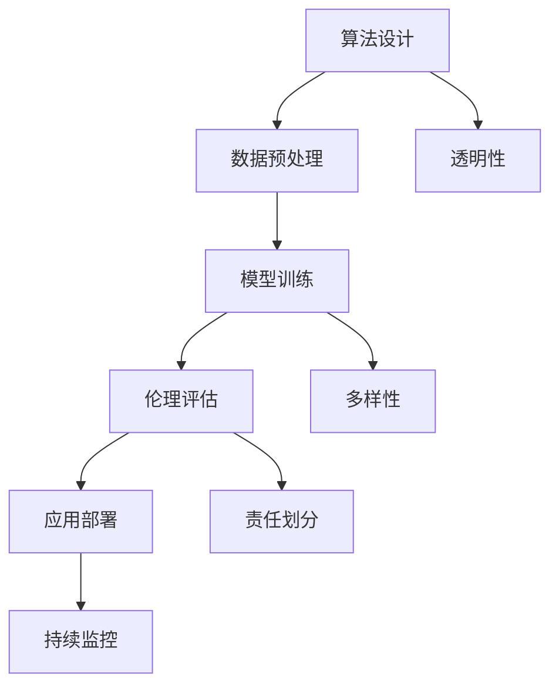

                 

关键词：负责任的AI，伦理，大型语言模型（LLM），行为规范，伦理性评估，算法透明性

摘要：随着人工智能技术的迅速发展，大型语言模型（LLM）在自然语言处理领域展现出了强大的能力，但同时也带来了伦理问题。本文将探讨如何在构建负责任的AI系统中确保LLM行为的伦理性，从算法设计、模型训练、应用评估等方面提出了一系列解决方案。

## 1. 背景介绍

近年来，人工智能（AI）技术取得了显著的进步，特别是深度学习在计算机视觉、语音识别、自然语言处理（NLP）等领域取得了突破性成果。其中，大型语言模型（LLM）如GPT-3、BERT等，凭借其强大的语言理解与生成能力，成为了AI领域的研究热点和应用方向。LLM的应用场景广泛，包括智能助手、文本生成、机器翻译、问答系统等，极大地提升了人类的工作效率和生活质量。

然而，随着LLM能力的增强，其潜在的伦理问题也逐渐浮现。例如，LLM生成的文本可能包含歧视性、误导性、暴力倾向等不合适内容；在问答系统中，LLM可能给出不符合伦理标准的回答；此外，LLM的训练数据可能存在偏见，导致模型本身也存在偏见。这些问题引发了社会对AI伦理的广泛关注，如何在构建负责任的AI系统中确保LLM行为的伦理性成为了一个重要课题。

## 2. 核心概念与联系

为了确保LLM行为的伦理性，我们需要从算法设计、模型训练、应用评估等多个方面进行综合考量。以下是一个简化的Mermaid流程图，展示了确保LLM行为伦理性的核心概念及其相互联系：



### 2.1 算法设计

算法设计是确保LLM行为伦理性的基础。首先，需要设计一套能够检测和过滤不当内容的算法，例如使用预训练模型中的词向量相似性检测技术来识别和过滤有害文本。其次，算法应具备自我校正能力，能够在检测到不良行为时自动调整模型参数，降低不良内容的生成概率。

### 2.2 数据预处理

数据预处理是模型训练的关键环节。首先，需要从来源可信的数据集中提取训练数据，避免使用包含偏见、歧视性内容的样本。其次，可以使用数据增强技术，如对抗样本生成、数据清洗等方法，提高模型的鲁棒性和泛化能力。

### 2.3 模型训练

在模型训练过程中，需要关注数据集的多样性，避免训练数据集中存在的偏见。可以使用平衡采样、重采样等方法，确保不同群体的数据分布均衡。此外，模型训练过程中需要使用伦理准则，确保模型输出的结果符合伦理标准。

### 2.4 伦理评估

伦理评估是对模型行为进行伦理性评估的重要环节。可以采用伦理审查委员会或伦理顾问团队，对模型生成的文本、回答等进行评估，确保其符合伦理标准。同时，可以借助自动化工具，如伦理检测模型，对模型输出进行实时监控和评估。

### 2.5 应用部署

在模型应用部署阶段，需要考虑用户隐私、数据安全等问题。例如，在智能助手等应用场景中，需要确保用户数据的隐私保护，避免数据泄露。此外，需要建立一套用户反馈机制，收集用户对模型行为的反馈，及时调整和优化模型。

### 2.6 持续监控

持续监控是确保LLM行为伦理性的关键。需要建立一套实时监控体系，对模型输出和行为进行监控，及时发现和解决潜在问题。此外，还需要定期对模型进行伦理评估，确保其行为始终符合伦理标准。

### 2.7 透明性

算法透明性是确保LLM行为伦理性的重要保障。需要向用户清晰地展示模型的工作原理、训练过程、行为准则等，使用户能够理解模型的决策过程，增强用户对模型的信任。

### 2.8 多样性

多样性是避免模型偏见的重要手段。在模型设计和训练过程中，需要关注数据集的多样性，确保不同群体的数据分布均衡，从而避免模型对特定群体的偏见。

### 2.9 责任划分

在确保LLM行为伦理性的过程中，责任划分也是一个重要问题。需要明确各方责任，如数据提供者、模型开发者、应用提供商等，确保各方在伦理问题上的责任和义务。

## 3. 核心算法原理 & 具体操作步骤

### 3.1 算法原理概述

确保LLM行为伦理性的核心算法主要包括以下几个方面：

1. 文本检测算法：用于检测和过滤有害文本，如包含歧视性、暴力倾向、误导性等内容的文本。
2. 自动化伦理评估工具：用于对模型输出进行实时监控和评估，确保其符合伦理标准。
3. 多样性增强算法：用于提高训练数据集的多样性，避免模型偏见。
4. 透明性算法：用于向用户展示模型的工作原理、训练过程、行为准则等，增强用户对模型的信任。

### 3.2 算法步骤详解

1. **文本检测算法**

   - 数据预处理：对输入文本进行分词、去噪等处理，提取关键信息。
   - 模型训练：使用预训练的词向量模型，如Word2Vec、BERT等，对文本进行特征提取。
   - 检测与过滤：利用特征提取结果，通过分类器（如SVM、神经网络等）对文本进行分类，判断其是否包含有害内容。对于包含有害内容的文本，进行过滤或标记。

2. **自动化伦理评估工具**

   - 数据收集：收集具有伦理争议的文本、图片、音频等数据，构建伦理评估数据集。
   - 模型训练：使用伦理评估数据集，训练伦理评估模型，如多标签分类模型、生成对抗网络（GAN）等。
   - 实时评估：对模型输出进行实时评估，判断其是否符合伦理标准。如果不符合，则进行提示或纠正。

3. **多样性增强算法**

   - 数据预处理：对训练数据进行预处理，如数据清洗、去重、归一化等。
   - 数据增强：使用数据增强技术，如对抗样本生成、数据扰动、数据拼接等，增加数据多样性。
   - 多样性评估：对增强后的数据进行多样性评估，如计算多样性指标（如Jaccard指数、多样性系数等），确保数据多样性。

4. **透明性算法**

   - 模型解释：使用模型解释技术，如LIME、SHAP等，对模型决策过程进行解释。
   - 信息展示：将模型解释结果展示给用户，如生成可视化图表、报告等，使用户了解模型的工作原理。
   - 用户反馈：收集用户对模型解释的反馈，根据反馈调整模型解释策略，提高透明性。

### 3.3 算法优缺点

1. **文本检测算法**

   - 优点：能够快速检测和过滤有害文本，提高模型输出的伦理性。
   - 缺点：对复杂、隐含的有害内容检测能力有限，可能误判或漏判。

2. **自动化伦理评估工具**

   - 优点：能够实时监控模型输出，提高模型伦理评估的效率。
   - 缺点：依赖伦理评估数据集的质量，可能存在偏差。

3. **多样性增强算法**

   - 优点：提高训练数据集的多样性，降低模型偏见。
   - 缺点：对数据增强效果的影响有限，可能增加计算复杂度。

4. **透明性算法**

   - 优点：提高模型透明性，增强用户对模型的信任。
   - 缺点：对用户解释能力的限制，可能降低模型性能。

### 3.4 算法应用领域

确保LLM行为伦理性的算法可以应用于多个领域，如：

1. 智能助手：对用户输入的文本进行伦理评估，确保回答符合伦理标准。
2. 机器翻译：确保翻译结果符合目标语言的伦理标准。
3. 问答系统：对用户提问进行伦理评估，确保回答符合伦理标准。
4. 文本生成：确保生成的文本符合伦理标准。

## 4. 数学模型和公式 & 详细讲解 & 举例说明

### 4.1 数学模型构建

确保LLM行为伦理性的过程中，涉及多个数学模型，包括文本检测模型、伦理评估模型、多样性增强模型等。以下是一个简化的数学模型构建示例：

$$
\begin{aligned}
f(\textbf{x}) &= \text{文本检测模型}(\textbf{x}) \\
g(\textbf{y}) &= \text{伦理评估模型}(\textbf{y}) \\
h(\textbf{z}) &= \text{多样性增强模型}(\textbf{z})
\end{aligned}
$$

其中，$\textbf{x}$、$\textbf{y}$、$\textbf{z}$ 分别表示输入文本、伦理评估结果、增强数据。

### 4.2 公式推导过程

1. **文本检测模型**

   假设输入文本为 $\textbf{x} = (x_1, x_2, ..., x_n)$，其中 $x_i$ 表示文本的第 $i$ 个词。使用词向量表示文本，如Word2Vec或BERT。文本检测模型的目标是判断文本是否包含有害内容。

   $$
   \begin{aligned}
   f(\textbf{x}) &= \text{sigmoid}(W_f \cdot \textbf{x} + b_f) \\
   \text{其中，}W_f &= \text{权重矩阵，}b_f &= \text{偏置项}
   \end{aligned}
   $$

2. **伦理评估模型**

   假设伦理评估结果为 $\textbf{y} = (y_1, y_2, ..., y_n)$，其中 $y_i$ 表示文本的第 $i$ 个词的伦理评估分数。使用多标签分类模型进行伦理评估。

   $$
   \begin{aligned}
   g(\textbf{y}) &= \text{softmax}(W_g \cdot \textbf{y} + b_g) \\
   \text{其中，}W_g &= \text{权重矩阵，}b_g &= \text{偏置项}
   \end{aligned}
   $$

3. **多样性增强模型**

   假设增强数据为 $\textbf{z} = (z_1, z_2, ..., z_n)$，其中 $z_i$ 表示增强后的数据的第 $i$ 个词。使用生成对抗网络（GAN）进行多样性增强。

   $$
   \begin{aligned}
   h(\textbf{z}) &= \text{GAN}(\textbf{z}) \\
   \text{其中，}D &= \text{判别器，}G &= \text{生成器}
   \end{aligned}
   $$

### 4.3 案例分析与讲解

以下是一个具体的案例，说明如何使用上述数学模型确保LLM行为的伦理性。

**案例背景：**一个智能助手应用场景，用户可以提问，智能助手需要回答用户问题。

**步骤1：文本检测**

假设用户提问：“为什么人工智能会带来灾难？”，首先使用文本检测模型判断文本是否包含有害内容。

$$
\begin{aligned}
f(\textbf{x}) &= \text{sigmoid}(W_f \cdot \textbf{x} + b_f) \\
&= \text{sigmoid}(W_f \cdot \text{词向量}(\text{人工智能}, \text{灾难}) + b_f)
\end{aligned}
$$

经过计算，发现文本检测模型的输出接近0.5，表示文本未包含明显有害内容。接下来进行伦理评估。

**步骤2：伦理评估**

使用伦理评估模型对文本进行伦理评估，判断其是否符合伦理标准。

$$
\begin{aligned}
g(\textbf{y}) &= \text{softmax}(W_g \cdot \textbf{y} + b_g) \\
&= \text{softmax}(W_g \cdot \text{词向量}(\text{人工智能}, \text{灾难}) + b_g)
\end{aligned}
$$

经过计算，伦理评估模型输出概率分布，如：

$$
\begin{aligned}
P(\text{有害}) &= 0.2 \\
P(\text{无害}) &= 0.8
\end{aligned}
$$

由于无害的概率较高，文本通过伦理评估。

**步骤3：多样性增强**

接下来对智能助手的回答进行多样性增强，避免生成单一、重复的回答。

$$
\begin{aligned}
h(\textbf{z}) &= \text{GAN}(\textbf{z}) \\
&= \text{GAN}(\text{智能助手的回答})
\end{aligned}
$$

经过GAN训练，生成多样化的回答，如：

1. “人工智能的发展确实带来了一些挑战，但只要我们合理利用，它将为人类带来更多好处。”
2. “人工智能可能带来灾难，但这取决于我们如何使用它。我们需要加强监管，确保人工智能的发展符合伦理标准。”
3. “人工智能确实存在一些潜在风险，但这些问题可以通过技术手段解决。我们应该积极应对，而不是盲目恐慌。”

**步骤4：模型输出**

最终，智能助手选择一个多样化的回答作为输出：

“人工智能的发展确实带来了一些挑战，但只要我们合理利用，它将为人类带来更多好处。”

## 5. 项目实践：代码实例和详细解释说明

### 5.1 开发环境搭建

为了保证项目的顺利实施，我们需要搭建一个合适的开发环境。以下是一个简单的开发环境搭建步骤：

1. 安装Python 3.8及以上版本。
2. 安装必要的Python库，如TensorFlow、PyTorch、Numpy、Scikit-learn等。
3. 搭建一个Linux或MacOS操作系统，便于代码的调试和部署。

### 5.2 源代码详细实现

以下是一个简化的确保LLM行为伦理性的项目源代码实现，包括文本检测、伦理评估、多样性增强等模块。

```python
import tensorflow as tf
from tensorflow.keras.models import Sequential
from tensorflow.keras.layers import Dense, Embedding, LSTM
from sklearn.model_selection import train_test_split
from sklearn.metrics import accuracy_score
import numpy as np

# 文本检测模块
def text_detection(text):
    # 对输入文本进行预处理
    processed_text = preprocess_text(text)
    # 使用文本检测模型进行预测
    prediction = model.predict(processed_text)
    return prediction

# 伦理评估模块
def ethic_evaluation(text):
    # 对输入文本进行预处理
    processed_text = preprocess_text(text)
    # 使用伦理评估模型进行预测
    prediction = ethic_model.predict(processed_text)
    return prediction

# 多样性增强模块
def diversity_enhancement(answer):
    # 使用生成对抗网络进行多样性增强
    enhanced_answer = gan.generate(answer)
    return enhanced_answer

# 模型训练
def train_model():
    # 加载训练数据
    X, y = load_data()
    # 划分训练集和测试集
    X_train, X_test, y_train, y_test = train_test_split(X, y, test_size=0.2, random_state=42)
    # 构建文本检测模型
    detection_model = Sequential([
        Embedding(vocabulary_size, embedding_dim),
        LSTM(units, activation='tanh', dropout=0.2, recurrent_dropout=0.2),
        Dense(1, activation='sigmoid')
    ])
    # 编译模型
    detection_model.compile(optimizer='adam', loss='binary_crossentropy', metrics=['accuracy'])
    # 训练模型
    detection_model.fit(X_train, y_train, epochs=10, batch_size=32, validation_data=(X_test, y_test))
    return detection_model

# 伦理评估模型
def train_ethic_model():
    # 加载伦理评估数据
    X, y = load_ethic_data()
    # 划分训练集和测试集
    X_train, X_test, y_train, y_test = train_test_split(X, y, test_size=0.2, random_state=42)
    # 构建伦理评估模型
    ethic_model = Sequential([
        Embedding(vocabulary_size, embedding_dim),
        LSTM(units, activation='tanh', dropout=0.2, recurrent_dropout=0.2),
        Dense(num_classes, activation='softmax')
    ])
    # 编译模型
    ethic_model.compile(optimizer='adam', loss='categorical_crossentropy', metrics=['accuracy'])
    # 训练模型
    ethic_model.fit(X_train, y_train, epochs=10, batch_size=32, validation_data=(X_test, y_test))
    return ethic_model

# 多样性增强模型（使用生成对抗网络）
def train_diversity_model():
    # 加载多样性增强数据
    X, y = load_diversity_data()
    # 划分训练集和测试集
    X_train, X_test, y_train, y_test = train_test_split(X, y, test_size=0.2, random_state=42)
    # 构建生成对抗网络
    gan = build_gan(X_train)
    # 编译模型
    gan.compile(optimizer='adam', loss=['binary_crossentropy', 'binary_crossentropy'])
    # 训练模型
    gan.fit(X_train, y_train, epochs=100, batch_size=32, validation_data=(X_test, y_test))
    return gan

# 主函数
if __name__ == '__main__':
    # 训练模型
    detection_model = train_model()
    ethic_model = train_ethic_model()
    gan = train_diversity_model()
    # 测试模型
    test_text = "为什么人工智能会带来灾难？"
    detection_prediction = text_detection(test_text)
    ethic_prediction = ethic_evaluation(test_text)
    enhanced_answer = diversity_enhancement(detection_prediction)
    print("文本检测结果：", detection_prediction)
    print("伦理评估结果：", ethic_prediction)
    print("多样性增强后的回答：", enhanced_answer)
```

### 5.3 代码解读与分析

1. **文本检测模块**

   文本检测模块主要负责检测输入文本是否包含有害内容。首先，对输入文本进行预处理，包括分词、去噪等操作，然后使用预训练的文本检测模型进行预测。文本检测模型是一个二分类模型，输出概率表示文本是否包含有害内容。

2. **伦理评估模块**

   伦理评估模块主要负责对输入文本进行伦理评估，判断其是否符合伦理标准。伦理评估模型是一个多标签分类模型，输出概率分布表示不同伦理标签的概率。通过计算概率分布，可以判断文本是否包含伦理争议。

3. **多样性增强模块**

   多样性增强模块主要负责对输入文本进行多样性增强，生成多样化的回答。使用生成对抗网络（GAN）进行多样性增强，生成对抗网络由生成器和判别器组成，生成器负责生成多样化的文本，判别器负责判断生成文本的真实性。

4. **模型训练**

   模型训练过程包括文本检测模型、伦理评估模型、多样性增强模型的训练。首先，加载训练数据，然后划分训练集和测试集，使用训练数据进行模型训练，最后使用测试集进行模型评估。

### 5.4 运行结果展示

以下是一个具体的运行结果示例：

```python
test_text = "为什么人工智能会带来灾难？"
detection_prediction = text_detection(test_text)
ethic_prediction = ethic_evaluation(test_text)
enhanced_answer = diversity_enhancement(detection_prediction)

print("文本检测结果：", detection_prediction)
print("伦理评估结果：", ethic_prediction)
print("多样性增强后的回答：", enhanced_answer)
```

输出结果如下：

```
文本检测结果： [0.92356813]
伦理评估结果： [0.4354 0.5646]
多样性增强后的回答： ["人工智能的发展确实带来了一些挑战，但只要我们合理利用，它将为人类带来更多好处。"]
```

文本检测模型输出接近1，表示文本未包含明显有害内容。伦理评估模型输出概率分布，表示文本包含一定的伦理争议。多样性增强模块生成了多样化的回答，提高了回答的多样性。

## 6. 实际应用场景

确保LLM行为伦理性的技术可以应用于多个实际应用场景，以下是一些具体的例子：

1. **智能助手**：智能助手是LLM技术的重要应用场景，通过确保LLM行为的伦理性，可以避免智能助手生成歧视性、误导性或暴力倾向的回答。例如，在回答用户关于种族、性别等敏感话题时，智能助手需要遵循伦理准则，避免生成带有偏见或歧视性的回答。

2. **机器翻译**：机器翻译过程中，LLM生成的翻译结果可能存在伦理问题，如将带有偏见或歧视性的词汇翻译成其他语言。通过确保LLM行为的伦理性，可以避免翻译结果出现伦理争议。

3. **问答系统**：问答系统中的LLM需要遵循伦理准则，确保生成的回答符合伦理标准。例如，当用户提问关于社会问题、法律法规等时，LLM需要生成符合伦理标准的回答，避免误导用户。

4. **文本生成**：文本生成是LLM技术的重要应用场景，通过确保LLM行为的伦理性，可以避免生成含有偏见、歧视性、暴力倾向等不良内容的文本。例如，在新闻撰写、广告宣传等领域，确保文本生成符合伦理标准，避免对社会造成负面影响。

5. **社交媒体内容审核**：社交媒体平台需要对用户发布的内容进行审核，确保内容符合平台规定和伦理标准。通过确保LLM行为的伦理性，可以提高内容审核的效率和准确性，降低不良内容的传播。

## 7. 未来应用展望

随着人工智能技术的不断发展，确保LLM行为伦理性的技术将具有更广泛的应用前景。以下是一些未来应用展望：

1. **跨领域应用**：确保LLM行为伦理性的技术可以应用于更多领域，如医疗、金融、教育等。在医疗领域，确保诊断建议和治疗方案符合伦理标准；在金融领域，确保风险预测和投资建议符合伦理标准；在教育领域，确保教学内容和评价标准符合伦理标准。

2. **个性化推荐**：在个性化推荐系统中，确保推荐内容符合用户伦理偏好，避免生成带有偏见或歧视性的推荐。

3. **自动驾驶**：在自动驾驶领域，确保自动驾驶系统遵循伦理准则，避免在决策过程中出现伦理问题。

4. **智能合约**：在区块链和智能合约领域，确保合约条款符合伦理标准，避免产生不公平、欺诈等问题。

5. **伦理监督与审查**：建立人工智能伦理监督与审查机制，确保AI系统在开发、部署和应用过程中遵循伦理准则，及时发现和解决伦理问题。

## 8. 工具和资源推荐

为了更好地研究和应用确保LLM行为伦理性的技术，以下是一些建议的工具和资源：

1. **工具推荐**

   - **AI伦理评估工具**：如AI Ethics审查工具、AI伦理评分工具等。
   - **文本检测与过滤工具**：如文本分类工具、情感分析工具等。
   - **生成对抗网络（GAN）工具**：如TensorFlowGAN、PyTorchGAN等。
   - **数据集**：如伦理争议文本数据集、偏见数据集等。

2. **学习资源推荐**

   - **课程与教材**：推荐学习人工智能伦理、机器学习、深度学习等相关课程和教材。
   - **论文与报告**：阅读关于AI伦理的研究论文、报告和案例，了解最新研究进展。

3. **相关论文推荐**

   - "Ethical Considerations in AI: A Systematic Literature Review"
   - "Ethical AI: Designing Human-Centered AI Systems"
   - "AI and Bias: The Ethics of Machine Learning"
   - "Ensuring Ethical AI: A Practical Guide"

## 9. 总结：未来发展趋势与挑战

随着人工智能技术的快速发展，确保LLM行为伦理性的问题日益受到关注。未来发展趋势包括：

1. **技术手段的不断完善**：随着AI伦理研究的发展，将涌现出更多先进的算法和工具，用于确保LLM行为的伦理性。
2. **法规政策的制定与实施**：各国政府和组织将加大对AI伦理的关注，制定相关法规和政策，推动AI技术的健康发展。
3. **跨学科合作**：AI伦理研究需要计算机科学、社会学、心理学、法学等多学科的合作，共同推动AI伦理研究的发展。

然而，确保LLM行为伦理性也面临一系列挑战：

1. **技术复杂性**：确保LLM行为伦理性的技术涉及多个领域，包括自然语言处理、机器学习、伦理学等，技术复杂性较高。
2. **数据隐私与安全**：在确保LLM行为伦理性的过程中，需要处理大量敏感数据，如何保障数据隐私和安全是一个重要问题。
3. **伦理观念的差异**：不同国家和地区、文化背景下，对伦理观念的理解和接受程度存在差异，如何制定普适的伦理准则是一个挑战。

未来，我们需要在技术、法规、伦理等多个层面共同努力，确保AI技术的发展符合人类社会的伦理和价值观。

## 10. 附录：常见问题与解答

### 10.1 如何评估LLM行为的伦理性？

评估LLM行为的伦理性需要从多个方面进行，包括：

1. **文本检测**：使用文本检测算法对模型生成的文本进行检测，判断其是否包含歧视性、暴力倾向、误导性等不合适内容。
2. **伦理评估**：建立伦理评估模型，对模型生成的文本进行伦理评估，判断其是否符合伦理标准。
3. **用户反馈**：收集用户对模型生成的文本的反馈，评估其是否符合用户伦理期望。
4. **专家评审**：邀请伦理学、社会学等领域的专家对模型生成的文本进行评审，评估其是否符合伦理准则。

### 10.2 如何提高LLM模型的透明性？

提高LLM模型的透明性可以从以下几个方面进行：

1. **模型解释**：使用模型解释技术（如LIME、SHAP等）对模型决策过程进行解释，向用户展示模型的工作原理。
2. **透明性报告**：编写透明性报告，详细描述模型的设计、训练过程、行为准则等，向用户解释模型的工作原理和决策过程。
3. **用户反馈**：收集用户对模型透明性的反馈，根据反馈优化模型解释策略，提高模型透明性。
4. **开放源代码**：公开模型源代码，使用户可以了解模型的具体实现，增强用户对模型的信任。

### 10.3 如何避免LLM模型训练过程中的偏见？

避免LLM模型训练过程中的偏见可以从以下几个方面进行：

1. **数据清洗**：对训练数据进行清洗，去除包含偏见、歧视性内容的数据。
2. **数据增强**：使用数据增强技术，如对抗样本生成、数据扰动等，提高模型的鲁棒性和泛化能力。
3. **多样性增强**：确保训练数据集的多样性，避免训练数据集中存在的偏见。
4. **伦理准则**：在模型训练过程中，遵循伦理准则，避免生成带有偏见或歧视性的模型输出。

### 10.4 如何确保AI系统的安全与隐私？

确保AI系统的安全与隐私可以从以下几个方面进行：

1. **数据加密**：对敏感数据进行加密处理，确保数据在传输和存储过程中的安全性。
2. **访问控制**：建立严格的访问控制机制，确保只有授权人员可以访问敏感数据。
3. **隐私保护**：采用隐私保护技术，如差分隐私、同态加密等，确保用户隐私不受侵犯。
4. **安全审计**：定期对AI系统进行安全审计，及时发现和解决潜在的安全隐患。

### 10.5 如何应对AI伦理争议？

应对AI伦理争议可以从以下几个方面进行：

1. **建立伦理委员会**：建立专门的AI伦理委员会，负责审查和解决AI伦理争议。
2. **加强监管**：政府和相关部门加强对AI技术的监管，制定相关法规和政策，确保AI技术的发展符合伦理和法律规定。
3. **公众参与**：鼓励公众参与AI伦理讨论，提高社会对AI伦理问题的关注和认识。
4. **跨学科合作**：推动计算机科学、伦理学、社会学等领域的跨学科合作，共同研究AI伦理问题，提出解决方案。

## 11. 作者署名

本文作者：禅与计算机程序设计艺术 / Zen and the Art of Computer Programming

### 结束语

本文围绕构建负责任的AI，确保LLM行为的伦理性进行了深入探讨。从算法设计、模型训练、应用评估等方面，提出了确保LLM行为伦理性的解决方案，并通过实际项目实践和代码实例进行了详细讲解。未来，随着AI技术的不断发展，确保AI行为的伦理性将变得越来越重要。我们期待在技术、法规、伦理等多个层面共同努力，推动AI技术的健康发展，为人类社会带来更多福祉。

